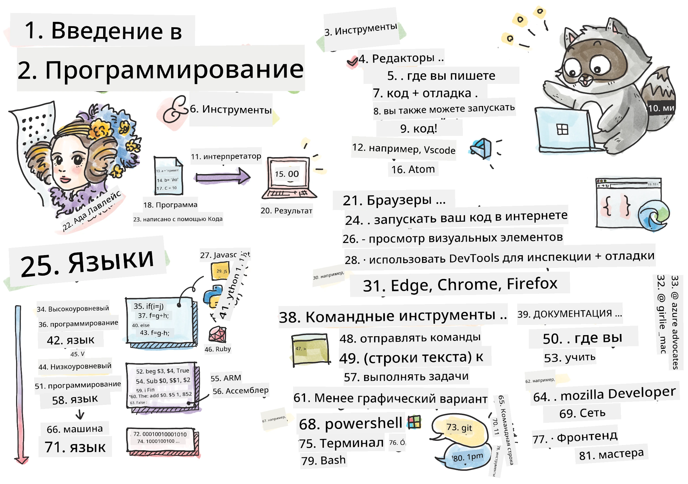
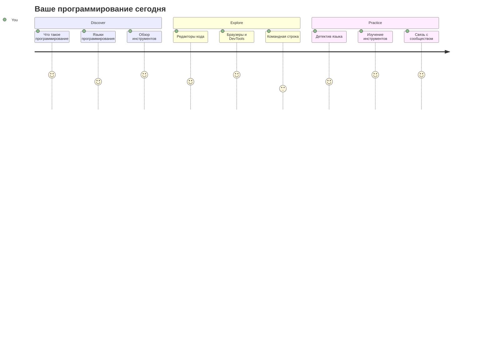
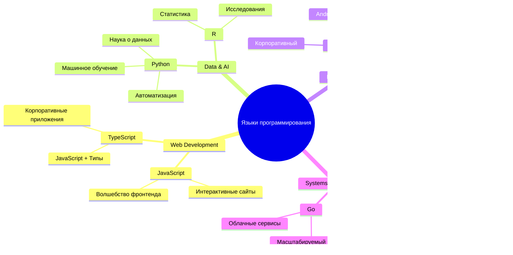
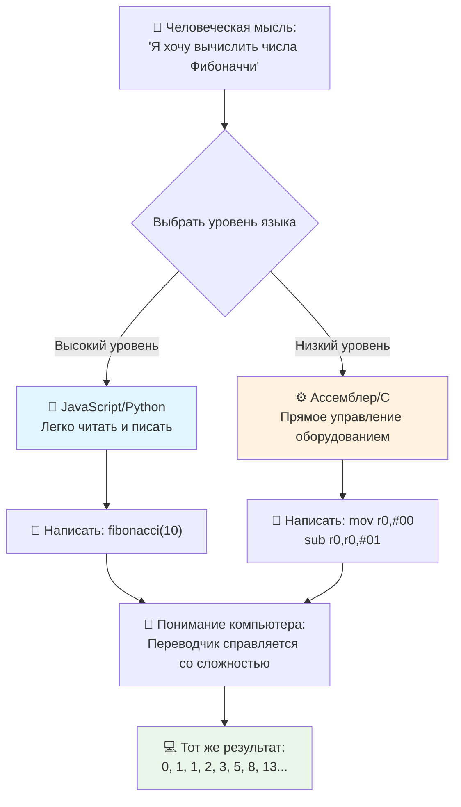
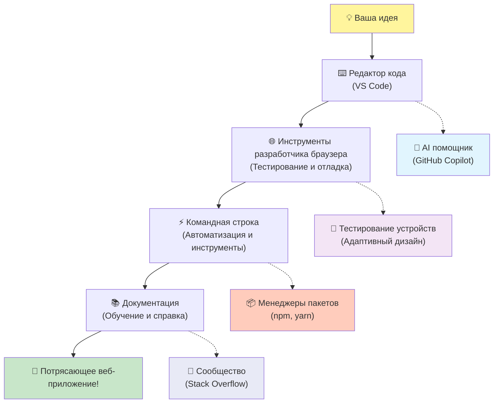
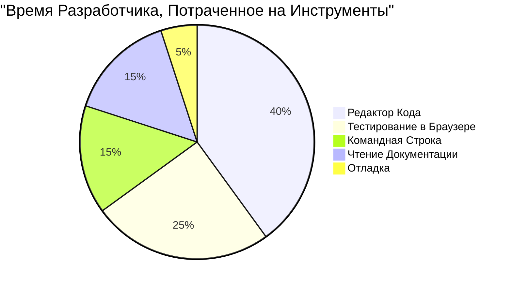
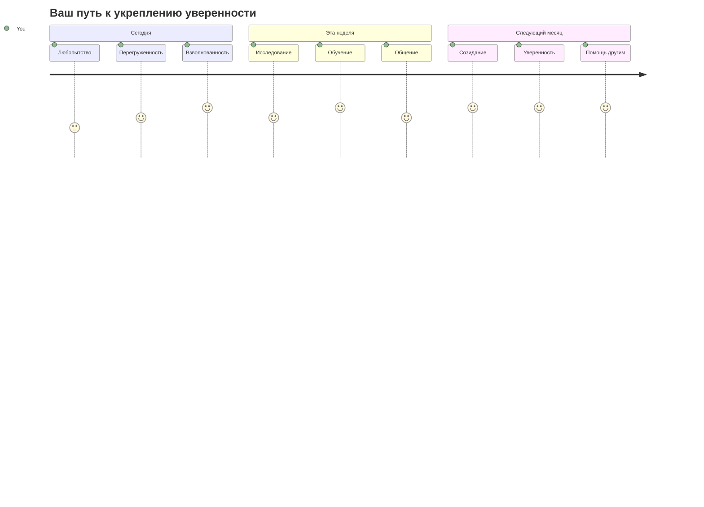

# Введение в языки программирования и современные инструменты для разработчиков

Привет, будущий разработчик! 👋 Можно я расскажу тебе кое-что, что до сих пор каждый день вызывает у меня мурашки? Ты вот-вот откроешь для себя, что программирование — это не просто про компьютеры – это настоящие суперспособности дарить жизнь самым смелым идеям!

Знаешь тот момент, когда пользуешься своим любимым приложением, и всё складывается идеально? Когда нажимаешь кнопку и случается что-то по-настоящему волшебное, заставляющее тебя сказать «вау, как они ЭТО сделали?» Так вот, кто-то такой же, как ты — вероятно, сидящий в любимом кафе в 2 часа ночи с третьим эспрессо — написал код, который создал это волшебство. И вот что поразит тебя до глубины души: к концу этого урока ты не только поймёшь, как они это сделали, но и будешь гореть желанием попробовать самому!

Слушай, я полностью понимаю, если сейчас программирование кажется пугающим. Когда я начинал, я честно думал, будто нужно быть каким-то математическим гением или кодить с пяти лет. Но вот что полностью поменяло моё восприятие: программирование – это точно так же, как учиться разговаривать на новом языке. Сначала ты учишься говорить «привет» и «спасибо», потом можешь заказать кофе, а вскоре уже ведёшь глубокие философские беседы! Только в этом случае беседуешь с компьютерами, и знаешь что? Они самые терпеливые собеседники на свете – никогда не осуждают ошибки и всегда рады попробовать снова!

Сегодня мы изучим невероятные инструменты, которые делают современную веб-разработку не просто возможной, а по-настоящему захватывающей. Я говорю о тех же редакторах, браузерах и рабочих процессах, которыми пользуются разработчики Netflix, Spotify и твоей любимой инди-студии. И вот что заставит тебя устроить счастливый танец: большинство этих профессиональных, индустриальных инструментов — абсолютно бесплатны!


> Скетчноут от [Tomomi Imura](https://twitter.com/girlie_mac)


```mermaid
journey
    title Ваше программирование сегодня
    section Discover
      Что такое программирование: 5: You
      Языки программирования: 4: You
      Обзор инструментов: 5: You
    section Explore
      Редакторы кода: 4: You
      Браузеры и DevTools: 5: You
      Командная строка: 3: You
    section Practice
      Детектив языка: 4: You
      Изучение инструментов: 5: You
      Связь с сообществом: 5: You
```
## Давай посмотрим, что ты уже знаешь!

Прежде чем прыгать в весёлое, мне интересно — что ты уже знаешь об этом программном мире? И слушай, если ты читаешь эти вопросы и думаешь «я вообще ничего не понимаю», это не просто нормально — это отлично! Значит, ты в точности в нужном месте. Представь, что этот тест — как разминка перед тренировкой — мы просто разогреваем мозговые мышцы!

[Пройти предурочный тест](https://ff-quizzes.netlify.app/web/)


## Приключение, на которое мы собираемся отправиться вместе

Ладно, я искренне не могу усидеть на месте от того, что мы собираемся исследовать сегодня! Серьёзно, хотелось бы увидеть твоё лицо, когда некоторые из этих концепций щёлкнут. Вот удивительное путешествие, в которое мы отправляемся вместе:

- **Что такое программирование на самом деле (и почему это самая классная вещь!)** – Мы узнаем, как код буквально является невидимой магией, которая управляет всем вокруг, от будильника, который каким-то образом знает, что сейчас понедельник, до алгоритма, идеально подбирающего рекомендации в Netflix
- **Языки программирования и их уникальные личности** – Представь, что приходишь на вечеринку, где у каждого гостя совершенно разные суперспособности и способы решения задач. Вот таков мир языков программирования, и ты полюбишь знакомство с ними!
- **Основные кирпичики, из которых строится цифровое волшебство** – Подумай об этом, как о самом крутом наборе LEGO для творчества. Как только поймёшь, как эти кусочки соединяются, ты осознаешь, что можешь построить буквально всё, что придёт в твоё воображение
- **Профессиональные инструменты, с которыми ты почувствуешь себя обладателем волшебной палочки** – Я не шучу — эти инструменты действительно заставят тебя почувствовать себя супергероем, а самое классное? Это те самые, что используют профессионалы!

> 💡 **Вот в чём дело**: Не пытайся запомнить всё сегодня! Сейчас я хочу, чтобы ты почувствовал искру интереса к возможностям. Детали закрепятся сами по мере практики — вот как происходит настоящее обучение!

> Ты можешь пройти этот урок на [Microsoft Learn](https://learn.microsoft.com/en-us/learn/modules/web-development-101/introduction-programming/?WT.mc_id=academic-77807-sagibbon)!

## Ну а что же *есть* программирование?

Хорошо, давай разберёмся с вопросом на миллион: что же такое программирование, на самом деле?

Расскажу тебе историю, которая полностью изменила моё понимание. На прошлой неделе я пытался объяснить маме, как пользоваться нашим новым пультом от умного телевизора. Поймал себя на том, что говорю что-то вроде «Нажми красную кнопку, но не большую красную кнопку, а маленькую красную слева... нет, с другой левой стороны... ладно, теперь держи две секунды, не одну, не три...» Звучит знакомо? 😅

Вот это и есть программирование! Искусство давать невероятно подробные, пошаговые инструкции чему-то очень мощному, но требующему чёткого описания всего до мельчайших деталей. Только вместо того, чтобы объяснять маме (которая может спросить «какую красную кнопку?!»), ты объясняешь компьютеру (который делает ровно то, что ты скажешь, даже если ты не совсем то имел в виду).

Вот что поразило меня, когда я впервые это узнал: компьютеры на самом деле довольно просты в основе. Они буквально понимают всего две вещи — 1 и 0, что по сути значит «да» и «нет» или «включено» и «выключено». Вот и всё! Но тут начинается магия – нам не нужно говорить на языке 1 и 0, словно в Матрице. Именно здесь на помощь приходят **языки программирования**. Это как иметь лучшего в мире переводчика, который берет твои вполне обычные человеческие мысли и превращает их в компьютерный язык.

И вот что до сих пор каждый раз будоражит меня по утрам: буквально *всё* цифровое в твоей жизни начиналось с кого-то такого же, как ты, наверное, в пижаме с кружкой кофе, набирающего код на ноутбуке. Тот фильтр в Instagram, который делает тебя безупречным? Кто-то написал для него код. Рекомендация, приведшая тебя к твоей новой любимой песне? Разработчик создал этот алгоритм. Приложение, которое помогает делить счёт за ужин с друзьями? Точно, кто-то подумал: «Это раздражает, я могу это починить», и сделал это!

Когда ты учишься программировать, ты не просто осваиваешь новый навык – ты становишься частью удивительного сообщества решателей проблем, которые проводят дни, думая: «А что если я создам что-то, что сделает чей-то день чуточку лучше?» Честно, что может быть круче?

✅ **Задание на поиск интересного**: Вот что классно поискать, когда будет свободная минутка – кто, по твоему мнению, был первым в мире программистом? Подскажу: это может быть совсем не тот, кого ты ждёшь! История этого человека невероятно увлекательна и показывает, что программирование всегда было про креативное решение задач и мышление вне шаблонов.

### 🧠 **Время проверки: Как ты себя чувствуешь?**

**Немного подумай:**
- Теперь тебе понятно, что значит «давать инструкции компьютерам»?
- Можешь вспомнить какую-то повседневную задачу, которую хотел бы автоматизировать с помощью программирования?
- Какие вопросы у тебя появились об этом всем программировании?

> **Помни**: абсолютно нормально, если некоторые вещи сейчас кажутся туманными. Изучать программирование — это как учиться новому языку – мозгу нужно время, чтобы построить новые нейронные пути. Ты молодец!

## Языки программирования — это как разные вкусы магии

Ладно, сейчас это прозвучит странно, но держись – языки программирования очень похожи на разные музыкальные жанры. Подумай: есть джаз – плавный и импровизационный, рок – мощный и простой, классика – изящная и структурированная, и хип-хоп – креативный и выразительный. У каждого стиля свой вайб, своё сообщество преданных поклонников, и каждый подходит для разных настроений и случаев.

С языками программирования точно так же! Ты ведь не будешь использовать один и тот же язык, чтобы создать забавную мобильную игру и обрабатывать огромные массивы климатических данных, как не стал бы играть дэт-метал на занятиях йогой (ну, в большинстве йога-классов точно! 😄).

Но вот что каждый раз поражает меня до глубины души: эти языки — словно самый терпеливый, блестящий переводчик в мире, сидящий рядом с тобой. Ты можешь выражать свои идеи так, как удобно твоему человеческому мозгу, а они берут на себя всю сложную работу по преобразованию этого в 1 и 0, на которых на самом деле говорят компьютеры. Это как иметь друга, идеально владеющего и «человеческим творчеством», и «компьютерной логикой» — который никогда не устает, не делает перерывов на кофе и никогда не осудит, если ты задашь один и тот же вопрос дважды!

### Популярные языки программирования и области применения


```mermaid
mindmap
  root((Языки программирования))
    Web Development
      JavaScript
        Волшебство фронтенда
        Интерактивные сайты
      TypeScript
        JavaScript + Типы
        Корпоративные приложения
    Data & AI
      Python
        Наука о данных
        Машинное обучение
        Автоматизация
      R
        Статистика
        Исследования
    Mobile Apps
      Java
        Android
        Корпоративный
      Swift
        iOS
        Экосистема Apple
      Kotlin
        Современный Android
        Кроссплатформенный
    Systems & Performance
      C++
        Игры
        Критичные к производительности
      Rust
        Безопасность памяти
        Системное программирование
      Go
        Облачные сервисы
        Масштабируемый бэкенд
```
| Язык | Лучше всего подходит для | Почему популярен |
|----------|----------|------------------|
| **JavaScript** | Веб-разработка, интерфейсы пользователей | Работает в браузерах, оживляет сайты |
| **Python** | Наука о данных, автоматизация, ИИ | Легко читать и учить, мощные библиотеки |
| **Java** | Корпоративные приложения, Android-приложения | Независим от платформы, надёжен для больших систем |
| **C#** | Windows-приложения, разработка игр | Сильная поддержка в экосистеме Microsoft |
| **Go** | Облачные сервисы, бекенд-системы | Быстрый, простой, создан для современных вычислений |

### Языки высокого и низкого уровня

Ладно, честно говоря, эта концепция сломала мне мозг, когда я только начинал, так что поделюсь аналогией, которая, наконец, заставила меня понять – очень надеюсь, что она поможет и тебе!

Представь, что ты в другой стране, где не говоришь на языке, и срочно нужно найти ближайший туалет (ну, мы все в такой ситуации оказывались, правда? 😅):

- **Языки низкого уровня** — это как знать местный диалект так хорошо, что ты можешь беседовать с бабушкой, продающей фрукты на углу, используя культурные ссылки, местный сленг и внутренние шутки, которые поймёт только тот, кто там вырос. Очень впечатляет и невероятно эффективно... если ты свободно говоришь! Но довольно сложно, когда просто хочешь найти туалет.

- **Языки высокого уровня** — это как иметь удивительного местного друга, который тебя понимает. Ты говоришь: «Мне реально нужно найти туалет» по-английски, а он уже делает всю культурную «переводческую работу» и даёт инструкции, понятные твоему чужестранному мозгу.

В терминах программирования:
- **Языки низкого уровня** (например, Ассемблер или C) позволяют вести очень подробные разговоры с самим «железом» компьютера, но требуют мыслить как машина, что... скажем так, большой ментальный сдвиг!
- **Языки высокого уровня** (например, JavaScript, Python или C#) позволяют думать как человек, а они берут на себя всю машинную лексику за кулисами. К тому же у них невероятно дружелюбные сообщества, где помнят, как это быть новичком, и искренне хотят помочь!

Угадай, с чего я предлагаю начать? 😉 Языки высокого уровня – как вспомогательные колёсики, которые ты никогда не захочешь убирать, потому что они делают весь опыт гораздо приятнее!


```mermaid
flowchart TB
    A["👤 Человеческая мысль:<br/>'Я хочу вычислить числа Фибоначчи'"] --> B{Выбрать уровень языка}
    
    B -->|Высокий уровень| C["🌟 JavaScript/Python<br/>Легко читать и писать"]
    B -->|Низкий уровень| D["⚙️ Ассемблер/C<br/>Прямое управление оборудованием"]
    
    C --> E["📝 Написать: fibonacci(10)"]
    D --> F["📝 Написать: mov r0,#00<br/>sub r0,r0,#01"]
    
    E --> G["🤖 Понимание компьютера:<br/>Переводчик справляется со сложностью"]
    F --> G
    
    G --> H["💻 Тот же результат:<br/>0, 1, 1, 2, 3, 5, 8, 13..."]
    
    style C fill:#e1f5fe
    style D fill:#fff3e0
    style H fill:#e8f5e8
```
### Позволь показать, почему языки высокого уровня гораздо дружелюбнее

Хорошо, я собираюсь показать тебе кое-что, что отлично демонстрирует, почему я влюбился в языки высокого уровня, но сначала — прошу тебя кое в чём пообещать. Когда увидишь первый пример кода — не паникуй! Он должен выглядеть слегка устрашающе. В этом и есть мой посыл!

Мы посмотрим на одну и ту же задачу, оформленную в двух совершенно разных стилях. Обе создают так называемую последовательность Фибоначчи – это красивый математический паттерн, где каждое число равно сумме двух предыдущих: 0, 1, 1, 2, 3, 5, 8, 13... (Кстати, этот паттерн буквально везде в природе – спирали семян подсолнуха, узоры сосновых шишек, даже формирование галактик!)

Готов увидеть разницу? Поехали!

**Язык высокого уровня (JavaScript) – удобочитаемый человеком:**

```javascript
// Шаг 1: Основная настройка Фибоначчи
const fibonacciCount = 10;
let current = 0;
let next = 1;

console.log('Fibonacci sequence:');
```

**Вот что делает этот код:**
- **Объявляет** константу, указывающую, сколько чисел Фибоначчи нужно сгенерировать
- **Инициализирует** две переменные для отслеживания текущего и следующего числа в последовательности
- **Задаёт** стартовые значения (0 и 1), определяющие паттерн Фибоначчи
- **Выводит** заголовок, идентифицирующий наш вывод

```javascript
// Шаг 2: Сгенерировать последовательность с помощью цикла
for (let i = 0; i < fibonacciCount; i++) {
  console.log(`Position ${i + 1}: ${current}`);
  
  // Вычислить следующее число в последовательности
  const sum = current + next;
  current = next;
  next = sum;
}
```

**Разбор того, что происходит здесь:**
- **Проходит в цикле** по каждой позиции последовательности с помощью `for`-цикла
- **Выводит** каждое число с его позицией, используя шаблонные строки
- **Вычисляет** следующее число Фибоначчи, складывая текущие и следующие значения
- **Обновляет** переменные, переходя к следующему шагу цикла

```javascript
// Шаг 3: Современный функциональный подход
const generateFibonacci = (count) => {
  const sequence = [0, 1];
  
  for (let i = 2; i < count; i++) {
    sequence[i] = sequence[i - 1] + sequence[i - 2];
  }
  
  return sequence;
};

// Пример использования
const fibSequence = generateFibonacci(10);
console.log(fibSequence);
```

**В приведённом коде мы:**
- **Создали** переиспользуемую функцию с помощью современного синтаксиса стрелочной функции
- **Построили** массив для хранения всей последовательности вместо вывода по одному числу
- **Использовали** индексацию массива для вычисления каждого нового числа на основе предыдущих
- **Вернули** всю последовательность для гибкого использования в других частях программы

**Язык низкого уровня (ARM Assembly) – удобочитаемый машиной:**

```assembly
 area ascen,code,readonly
 entry
 code32
 adr r0,thumb+1
 bx r0
 code16
thumb
 mov r0,#00
 sub r0,r0,#01
 mov r1,#01
 mov r4,#10
 ldr r2,=0x40000000
back add r0,r1
 str r0,[r2]
 add r2,#04
 mov r3,r0
 mov r0,r1
 mov r1,r3
 sub r4,#01
 cmp r4,#00
 bne back
 end
```

Обрати внимание, как версия на JavaScript читается почти как инструкции на английском, в то время как версия на Ассемблере использует загадочные команды, напрямую управляющие процессором компьютера. Обе выполняют одну и ту же задачу, но язык высокого уровня гораздо проще для человека – его легче понять, писать и поддерживать.

**Ключевые отличия, которые ты заметишь:**
- **Читаемость**: JavaScript использует описательные имена, такие как `fibonacciCount`, тогда как Assembly использует криптичные метки типа `r0`, `r1`
- **Комментарии**: Языки высокого уровня поощряют объясняющие комментарии, которые делают код само-документируемым
- **Структура**: Логический поток JavaScript совпадает с тем, как человек шаг за шагом думает над задачей
- **Поддержка**: Обновлять JavaScript-вариант для разных требований просто и понятно

✅ **О последовательности Фибоначчи**: Эта абсолютно великолепная числовая последовательность (где каждое число равно сумме двух предыдущих: 0, 1, 1, 2, 3, 5, 8...) встречается буквально *повсюду* в природе! Вы найдете её в спиралях подсолнечника, в рисунках шишек, в изгибах раковин наутилуса и даже в том, как растут ветви деревьев. Просто поражает, как математика и код помогают понять и воспроизвести закономерности, которые природа использует для создания красоты!

## Строительные блоки, создающие магию

Итак, теперь, когда вы увидели, как выглядят языки программирования в действии, давайте разберем основные элементы, из которых состоит буквально каждая написанная программа. Представьте их как основные ингредиенты вашего любимого рецепта — когда вы поймете, что делает каждый из них, вы сможете читать и писать код почти на любом языке!

Это как изучение грамматики программирования. Помните, как в школе учились существительным, глаголам и составлению предложений? У программирования есть своя «грамматика», и честно говоря, она гораздо логичнее и снисходительнее, чем английская! 😄

### Операторы: Инструкции шаг за шагом

Начнем с **операторов** — это как отдельные предложения в разговоре с вашим компьютером. Каждый оператор говорит компьютеру сделать что-то конкретное, словно давая указания: «Поверни налево здесь», «Остановись на красный свет», «Припаркуйся на том месте».

Что мне нравится в операторах, так это то, как они обычно читаются. Посмотрите на это:

```javascript
// Основные операторы, выполняющие одиночные действия
const userName = "Alex";                    
console.log("Hello, world!");              
const sum = 5 + 3;                         
```
  
**Что делает этот код:**  
- **Объявляет** константную переменную для хранения имени пользователя  
- **Выводит** приветственное сообщение в консоль  
- **Вычисляет** и сохраняет результат математической операции  

```javascript
// Операторы, которые взаимодействуют с веб-страницами
document.title = "My Awesome Website";      
document.body.style.backgroundColor = "lightblue";
```
  
**По шагам, что происходит:**  
- **Изменяет** заголовок страницы, отображаемый во вкладке браузера  
- **Меняет** цвет фона всего тела страницы  

### Переменные: Память вашей программы

Хорошо, **переменные** — честно говоря, одна из моих любимых тем для объяснения, потому что они очень похожи на то, что вы используете ежедневно!

Подумайте на секунду о контактной книге на вашем телефоне. Вы не запоминаете все номера наизусть — вместо этого сохраняете «Мама», «Лучший друг» или «Пиццерия с доставкой до 2 ночи», а телефон помнит реальные номера. Переменные — это то же самое! Это как именованные контейнеры, где программа может хранить информацию и позже извлекать её по имени, которое действительно имеет смысл.

Самое классное: переменные могут изменяться во время работы программы (отсюда и название «переменная» — видите, что тут задумали?). Как вы обновляете контакт пиццерии, если находите лучшее место, так и переменные могут обновляться, когда программа получает новую информацию или меняются обстоятельства!

Покажу, как это просто и красиво:

```javascript
// Шаг 1: Создание базовых переменных
const siteName = "Weather Dashboard";        
let currentWeather = "sunny";               
let temperature = 75;                       
let isRaining = false;                      
```
  
**Понимаем концепцию:**  
- **Хранить** неизменяемые значения с помощью `const` (например, название сайта)  
- **Использовать** `let` для значений, меняющихся в ходе программы  
- **Присваивать** разные типы данных — строки (текст), числа, булевые значения (true/false)  
- **Выбирать** описательные имена, объясняющие содержимое переменной  

```javascript
// Шаг 2: Работа с объектами для группировки связанных данных
const weatherData = {                       
  location: "San Francisco",
  humidity: 65,
  windSpeed: 12
};
```
  
**В этом примере мы:**  
- **Создали** объект для объединения связанных данных о погоде  
- **Организовали** множество данных под одним именем переменной  
- **Использовали** пары ключ-значение для четкой маркировки каждой части информации  

```javascript
// Шаг 3: Использование и обновление переменных
console.log(`${siteName}: Today is ${currentWeather} and ${temperature}°F`);
console.log(`Wind speed: ${weatherData.windSpeed} mph`);

// Обновление изменяемых переменных
currentWeather = "cloudy";                  
temperature = 68;                          
```
  
**Поясним каждый элемент:**  
- **Выводить** информацию с помощью шаблонных литералов и синтаксиса `${}`  
- **Обращаться** к свойствам объекта с помощью точечной нотации (`weatherData.windSpeed`)  
- **Обновлять** переменные, объявленные через `let`, чтобы отражать изменения  
- **Комбинировать** несколько переменных для создания осмысленных сообщений  

```javascript
// Шаг 4: Современное деструктурирование для более чистого кода
const { location, humidity } = weatherData; 
console.log(`${location} humidity: ${humidity}%`);
```
  
**Что важно знать:**  
- **Извлекать** конкретные свойства из объектов с помощью деструктуризации  
- **Создавать** новые переменные с такими же именами, как у ключей объекта  
- **Упрощать** код, избегая повторного обращения через точку  

### Управление потоком: Учим программу думать

А теперь начинается самое удивительное! **Управление потоком** — это обучение вашей программы принимать умные решения, так же как вы делаете это каждый день, не задумываясь.

Представьте: утром вы думаете «Если идет дождь, возьму зонт. Если холодно — надену куртку. Если опаздываю — пропущу завтрак и возьму кофе с собой». Ваш мозг автоматически применяет такую логику if-then десятки раз в день!

Именно это делает программы умными и живыми, а не просто выполняющими скучный, предсказуемый сценарий. Они смотрят на ситуацию, оценивают, что происходит, и отвечают адекватно. Это как дать программе мозг, который может адаптироваться и принимать решения!

Хочешь увидеть, как это здорово работает? Посмотри:

```javascript
// Шаг 1: Основная условная логика
const userAge = 17;

if (userAge >= 18) {
  console.log("You can vote!");
} else {
  const yearsToWait = 18 - userAge;
  console.log(`You'll be able to vote in ${yearsToWait} year(s).`);
}
```
  
**Что делает этот код:**  
- **Проверяет**, соответствует ли возраст пользователя требованиям для голосования  
- **Выполняет** разные блоки кода в зависимости от результата проверки  
- **Вычисляет** и выводит, сколько осталось до получения права голосовать, если меньше 18  
- **Предоставляет** конкретную, полезную обратную связь для каждого случая  

```javascript
// Шаг 2: Несколько условий с логическими операторами
const userAge = 17;
const hasPermission = true;

if (userAge >= 18 && hasPermission) {
  console.log("Access granted: You can enter the venue.");
} else if (userAge >= 16) {
  console.log("You need parent permission to enter.");
} else {
  console.log("Sorry, you must be at least 16 years old.");
}
```
  
**Разбор происходящего:**  
- **Комбинирует** несколько условий с помощью оператора `&&` (и)  
- **Создает** иерархию условий с помощью `else if` для нескольких сценариев  
- **Обрабатывает** все возможные случаи с помощью заключительного `else`  
- **Дает** понятные и полезные рекомендации для каждого варианта  

```javascript
// Шаг 3: Краткое условие с тернарным оператором
const votingStatus = userAge >= 18 ? "Can vote" : "Cannot vote yet";
console.log(`Status: ${votingStatus}`);
```
  
**Что важно запомнить:**  
- **Использовать** тернарный оператор (`? :`) для простых условий с двумя вариантами  
- **Писать** условие сначала, потом `?`, далее результат при true, затем `:`, и результ при false  
- **Применять** этот синтаксис для присвоения значений на основе условий  

```javascript
// Шаг 4: Обработка нескольких конкретных случаев
const dayOfWeek = "Tuesday";

switch (dayOfWeek) {
  case "Monday":
  case "Tuesday":
  case "Wednesday":
  case "Thursday":
  case "Friday":
    console.log("It's a weekday - time to work!");
    break;
  case "Saturday":
  case "Sunday":
    console.log("It's the weekend - time to relax!");
    break;
  default:
    console.log("Invalid day of the week");
}
```
  
**Этот код делает следующее:**  
- **Сравнивает** значение переменной с несколькими конкретными случаями  
- **Группирует** похожие случаи (будни и выходные)  
- **Выполняет** соответствующий блок кода при совпадении  
- **Использует** `default` для обработки неожиданных значений  
- **Применяет** `break`, чтобы не переходить к следующему случаю неправомерно  

> 💡 **Реальная аналогия**: Управление потоком похоже на самый терпеливый GPS в мире, который говорит: «Если на Главной улице пробка, поезжайте по шоссе. Если шоссе заблокировано стройкой, выберите живописный маршрут». Программы используют такую же условную логику, чтобы разумно реагировать на разные ситуации и всегда давать пользователям лучший опыт.

### 🎯 **Проверка знаний: Мастерство базовых блоков**

**Проверим, как вы поняли основы:**  
- Можете ли вы объяснить разницу между переменной и оператором своими словами?  
- Придумайте реальный пример, где используете if-then решение (например, наш пример с голосованием)  
- Что в логике программирования вас удивило больше всего?  

**Небольшой заряд уверенности:**  

```mermaid
flowchart LR
    A["📝 Операторы<br/>(Инструкции)"] --> B["📦 Переменные<br/>(Хранилище)"] --> C["🔀 Управление Потоком<br/>(Решения)"] --> D["🎉 Рабочая программа!"]
    
    style A fill:#ffeb3b
    style B fill:#4caf50
    style C fill:#2196f3
    style D fill:#ff4081
```  
✅ **Что будет дальше**: Мы собираемся с огромным удовольствием углубиться в эти концепции и продолжить это невероятное путешествие вместе! Сейчас просто наслаждайтесь предвкушением всех удивительных возможностей впереди. Конкретные навыки и техники обязательно закрепятся естественным путём, пока мы практикуемся — обещаю, это будет гораздо веселее, чем вы ожидаете!

## Инструменты профессии

Итак, вот тут я просто не могу сдержать свой восторг! 🚀 Сейчас мы поговорим о потрясающих инструментах, которые заставят вас почувствовать, будто вам только что вручили ключи от цифрового космического корабля.

Знаете, у повара есть идеальные ножи, которые словно продолжение его рук? Или у музыканта есть гитара, которая начинает петь с первого прикосновения? У разработчиков тоже есть свои волшебные инструменты, и вот что вас точно удивит — большинство из них абсолютно бесплатные!

Я просто прыгаю от нетерпения, чтобы рассказать вам о них, потому что они полностью изменили подход к созданию ПО. Речь идёт об ИИ-помощниках в кодировании, которые могут помогать писать код (я не шучу!), облачных средах, где можно создавать приложения из любой точки с Wi-Fi, и мощных средствах отладки, которые словно дают рентгеновское зрение вашим программам.

И вот что до сих пор вызывает мурашки по коже: это вовсе не инструменты для начинающих, от которых быстро откажешься. Это те же профессиональные инструменты, которыми пользуются разработчики из Google, Netflix и той инди-студии, которую вы любите, прямо в этот самый момент. Вы будете чувствовать себя настоящим профи, используя их!


```mermaid
graph TD
    A["💡 Ваша идея"] --> B["⌨️ Редактор кода<br/>(VS Code)"] 
    B --> C["🌐 Инструменты разработчика браузера<br/>(Тестирование и отладка)"]
    C --> D["⚡ Командная строка<br/>(Автоматизация и инструменты)"]
    D --> E["📚 Документация<br/>(Обучение и справка)"]
    E --> F["🚀 Потрясающее веб-приложение!"]
    
    B -.-> G["🤖 AI помощник<br/>(GitHub Copilot)"]
    C -.-> H["📱 Тестирование устройств<br/>(Адаптивный дизайн)"]
    D -.-> I["📦 Менеджеры пакетов<br/>(npm, yarn)"]
    E -.-> J["👥 Сообщество<br/>(Stack Overflow)"]
    
    style A fill:#fff59d
    style F fill:#c8e6c9
    style G fill:#e1f5fe
    style H fill:#f3e5f5
    style I fill:#ffccbc
    style J fill:#e8eaf6
```  
### Редакторы кода и IDE: Ваши новые цифровые друзья

Поговорим о редакторах кода — они скоро станут вашими любимыми местами для работы! Представьте их личным святилищем программиста, где вы проводите большую часть времени, создавая и совершенствуя свои цифровые творения.

Но вот что действительно волшебно в современных редакторах: они не просто красивые текстовые редакторы. Это как самый умный и поддерживающий наставник по программированию, сидящий рядом с вами 24/7. Они находят ваши опечатки ещё до того, как вы их заметите, предлагают улучшения, которые делают вас гением, помогают понять, что делает каждая строчка кода, а некоторые даже могут предсказать, что вы собираетесь написать, и предлагают дополнить ваши мысли!

Я помню, когда впервые открыл автодополнение — казалось, я живу в будущем. Начинаешь что-то писать, а редактор говорит: «Ты, случайно, не хотел использовать вот эту функцию, которая идеально подходит?» Это словно иметь спутника с телепатическими способностями!

**Почему эти редакторы такие невероятные?**

Современные редакторы кода предлагают впечатляющий набор функций, призванных повысить вашу продуктивность:

| Особенность | Что делает | Зачем нужна |
|-------------|------------|-------------|
| **Подсветка синтаксиса** | Раскрашивает разные части кода | Делает код легче читаемым и помогает находить ошибки |
| **Автодополнение** | Предлагает код во время набора | Ускоряет кодирование и уменьшает опечатки |
| **Инструменты отладки** | Помогают искать и исправлять ошибки | Экономят часы на поиске проблем |
| **Расширения** | Добавляют специализированные функции | Настраивают редактор под любую технологию |
| **ИИ-ассистенты** | Предлагают код и пояснения | Ускоряют обучение и работу |

> 🎥 **Видео-ресурс**: Хотите увидеть эти инструменты в действии? Посмотрите это [видео о инструментах профессии](https://youtube.com/watch?v=69WJeXGBdxg) для полного обзора.

#### Рекомендуемые редакторы для веб-разработки

**[Visual Studio Code](https://code.visualstudio.com/?WT.mc_id=academic-77807-sagibbon)** (Бесплатно)  
- Самый популярный среди веб-разработчиков  
- Отличная экосистема расширений  
- Встроенный терминал и интеграция с Git  
- **Обязательные расширения**:  
  - [GitHub Copilot](https://marketplace.visualstudio.com/items?itemName=GitHub.copilot) — ИИ-помощник по коду  
  - [Live Share](https://marketplace.visualstudio.com/items?itemName=MS-vsliveshare.vsliveshare) — совместная работа в реальном времени  
  - [Prettier](https://marketplace.visualstudio.com/items?itemName=esbenp.prettier-vscode) — автоматическое форматирование кода  
  - [Code Spell Checker](https://marketplace.visualstudio.com/items?itemName=streetsidesoftware.code-spell-checker) — поиск опечаток в коде  

**[JetBrains WebStorm](https://www.jetbrains.com/webstorm/)** (Платно, бесплатно для студентов)  
- Продвинутые инструменты отладки и тестирования  
- Интеллектуальное автодополнение  
- Встроенный контроль версий  

**Облачные IDE** (Разные цены)  
- [GitHub Codespaces](https://github.com/features/codespaces) — полнофункциональный VS Code в браузере  
- [Replit](https://replit.com/) — отлично подходит для обучения и обмена кодом  
- [StackBlitz](https://stackblitz.com/) — мгновенная полнофункциональная веб-разработка  

> 💡 **Совет новичку**: Начните с Visual Studio Code — бесплатно, широко используется в индустрии и поддерживается огромным сообществом с множеством полезных руководств и расширений.

### Веб-браузеры: Ваша секретная лаборатория разработчика

Приготовьтесь, ум просто взорвётся! Вы ведь привыкли использовать браузеры, чтобы листать соцсети и смотреть видео, верно? Так вот, оказывается, все это время они скрывали невероятную секретную лабораторию для разработчиков, которую вы только что готовы открыть!

Каждый раз, когда вы кликаете правой кнопкой мыши на странице и выбираете «Просмотреть элемент», вы открываете скрытый мир инструментов разработчика, которые по мощи превосходят даже дорогостоящие программы, за которые я раньше платил сотни долларов. Это словно обнаружить, что ваша обычная кухня на самом деле прячет лабораторию шеф-повара за секретной панелью!
Впервые, когда кто-то показал мне инструменты разработчика в браузере, я потратил около трёх часов, просто кликая и восклицая: «СТОЙ, ЭТО ТАК ЖЕ МОЖНО?!» Ты буквально можешь редактировать любой сайт в реальном времени, видеть, насколько быстро всё загружается, тестировать, как выглядит твой сайт на разных устройствах, и даже отлаживать JavaScript, как настоящий профи. Это просто поражает!

**Вот почему браузеры — ваше секретное оружие:**

Когда вы создаёте веб-сайт или веб-приложение, вам нужно видеть, как оно выглядит и ведёт себя в реальном мире. Браузеры не просто отображают вашу работу, но и дают подробную обратную связь о производительности, доступности и возможных проблемах.

#### Инструменты разработчика в браузере (DevTools)

Современные браузеры включают в себя комплексные наборы инструментов для разработки:

| Категория инструмента | Что делает | Пример использования |
|---------------|--------------|------------------|
| **Инспектор элементов** | Просмотр и редактирование HTML/CSS в реальном времени | Настройка стилей с мгновенным результатом |
| **Консоль** | Просмотр сообщений об ошибках и тестирование JavaScript | Отладка проблем и эксперименты с кодом |
| **Мониторинг сети** | Отслеживание загрузки ресурсов | Оптимизация производительности и времени загрузки |
| **Проверка доступности** | Тестирование инклюзивного дизайна | Обеспечение работы сайта для всех пользователей |
| **Симулятор устройств** | Просмотр на разных размерах экранов | Тестирование адаптивного дизайна без множества устройств |

#### Рекомендуемые браузеры для разработки

- **[Chrome](https://developers.google.com/web/tools/chrome-devtools/)** — индустриальный стандарт DevTools с обширной документацией
- **[Firefox](https://developer.mozilla.org/docs/Tools)** — отличные инструменты для CSS Grid и доступности
- **[Edge](https://docs.microsoft.com/microsoft-edge/devtools-guide-chromium/?WT.mc_id=academic-77807-sagibbon)** — на базе Chromium с ресурсами разработчика от Microsoft

> ⚠️ **Важный совет по тестированию**: всегда тестируйте ваши сайты в нескольких браузерах! То, что отлично работает в Chrome, может выглядеть иначе в Safari или Firefox. Профессиональные разработчики проверяют работу во всех популярных браузерах для обеспечения единообразного пользовательского опыта.


### Инструменты командной строки: ваш путь к супермощи разработчика

Ладно, давайте на миг будем абсолютно честными насчёт командной строки, потому что я хочу, чтобы вы услышали это от человека, который действительно это понимает. Когда я впервые увидел её — просто чёрный пугающий экран с мигающим текстом — я буквально подумал: «Нет, ни за что! Это похоже на что-то из хакерского фильма 1980-х, и я точно недостаточно умен для этого!» 😅

Но вот что я хотел бы, чтобы мне тогда сказали, и что говорю вам сейчас: командная строка не страшная — это как вести прямой разговор с вашим компьютером. Представьте, что это как разница между заказом еды через удобное приложение с картинками и меню (это легко) и походом в ваш любимый местный ресторан, где шеф знает, что вам нравится, и может приготовить идеальное блюдо, просто услышав «удиви меня чем-то потрясающим».

Командная строка — это место, где разработчики чувствуют себя настоящими волшебниками. Вы вводите несколько кажущихся волшебными слов (на самом деле это просто команды, но они действительно кажутся волшебными!), нажимаете Enter, и БАХ — вы создаёте целые проекты, устанавливаете мощные инструменты со всего мира или разворачиваете своё приложение в интернете для миллионов пользователей. Как только вы попробуете это, это действительно затягивает!

**Почему командная строка станет вашим любимым инструментом:**

Хотя графические интерфейсы хороши во многих задачах, командная строка отлично подходит для автоматизации, точности и скорости. Многие инструменты разработки работают преимущественно через командную строку, и умение эффективно использовать их значительно повысит вашу производительность.

```bash
# Шаг 1: Создайте и перейдите в каталог проекта
mkdir my-awesome-website
cd my-awesome-website
```

**Что делает этот код:**
- **Создаёт** новую папку с названием "my-awesome-website" для вашего проекта
- **Переходит** в созданную папку, чтобы начать работу

```bash
# Шаг 2: Инициализация проекта с package.json
npm init -y

# Установите современные инструменты разработки
npm install --save-dev vite prettier eslint
npm install --save-dev @eslint/js
```

**Пошагово, что происходит:**
- **Инициализирует** новый проект Node.js с настройками по умолчанию с помощью `npm init -y`
- **Устанавливает** Vite как современный инструмент сборки для быстрой разработки и продакшен-сборок
- **Добавляет** Prettier для автоматического форматирования кода и ESLint для проверки качества кода
- **Использует** флаг `--save-dev` для обозначения зависимостей, нужных только на этапе разработки

```bash
# Шаг 3: Создайте структуру проекта и файлы
mkdir src assets
echo '<!DOCTYPE html><html><head><title>My Site</title></head><body><h1>Hello World</h1></body></html>' > index.html

# Запустите сервер разработки
npx vite
```

**В итоге мы:**
- **Организовали** проект, создав отдельные папки для исходного кода и ассетов
- **Сгенерировали** базовый HTML-файл с правильной структурой документа
- **Запустили** сервер разработки Vite для живой перезагрузки и хот-модульного обновления

#### Важные инструменты командной строки для веб-разработки

| Инструмент | Назначение | Зачем нужен |
|------|---------|-----------------|
| **[Git](https://git-scm.com/)** | Контроль версий | Отслеживание изменений, совместная работа, резервное копирование |
| **[Node.js & npm](https://nodejs.org/)** | Исполнение JavaScript и управление пакетами | Запуск JavaScript вне браузера, установка современных инструментов разработки |
| **[Vite](https://vitejs.dev/)** | Инструмент сборки и сервер разработки | Молниеносная разработка с хот-модульным обновлением |
| **[ESLint](https://eslint.org/)** | Качество кода | Автоматическое обнаружение и исправление проблем в JavaScript |
| **[Prettier](https://prettier.io/)** | Форматирование кода | Поддержание кода в читаемом и едином стиле |

#### Платформенно-специфичные варианты

**Windows:**
- **[Windows Terminal](https://docs.microsoft.com/windows/terminal/?WT.mc_id=academic-77807-sagibbon)** — современный, полнофункциональный терминал
- **[PowerShell](https://docs.microsoft.com/powershell/?WT.mc_id=academic-77807-sagibbon)** 💻 — мощная среда для скриптов
- **[Командная строка](https://learn.microsoft.com/windows-server/administration/windows-commands/windows-commands)** 💻 — традиционная командная строка Windows

**macOS:**
- **[Terminal](https://support.apple.com/guide/terminal/)** 💻 — встроенное терминальное приложение
- **[iTerm2](https://iterm2.com/)** — расширенный терминал с продвинутыми функциями

**Linux:**
- **[Bash](https://www.gnu.org/software/bash/)** 💻 — стандартная оболочка Linux
- **[KDE Konsole](https://docs.kde.org/trunk5/en/konsole/konsole/index.html)** — продвинутый эмулятор терминала

> 💻 = Предустановлено в операционной системе

> 🎯 **Путь обучения**: Начинайте с базовых команд, таких как `cd` (смена каталога), `ls` или `dir` (список файлов) и `mkdir` (создание папки). Практикуйтесь с современными командами рабочего процесса, например `npm install`, `git status` и `code .` (открывает текущую папку в VS Code). По мере привыкания вы будете естественно осваивать более сложные команды и методы автоматизации.


### Документация: ваш всегда доступный наставник

Ладно, поделюсь маленьким секретом, который заставит вас чувствовать себя гораздо увереннее, будучи новичком: даже самые опытные разработчики проводят огромную часть своего времени, читая документацию. И это не потому, что они не знают, что делают — это признак мудрости!

Думайте о документации как о самых терпеливых и знающих учителях в мире, доступных 24/7. Застряли с проблемой в 2 ночи? Документация даст тёплое виртуальное объятие и именно тот ответ, который нужен. Хотите узнать о новой крутой фишке, о которой все говорят? Документация вас выручит с пошаговыми примерами. Пытаетесь понять, почему что-то работает именно так? Вы угадали — документация готова объяснить это так, что всё наконец станет понятно!

Вот что полностью изменило моё восприятие: мир веб-разработки развивается невероятно быстро, и никто (абсолютно никто!) не держит всё в памяти. Я видел, как сеньоры с опытом 15+ лет ещё проверяют базовый синтаксис, и знаете что? Это не стыдно — это умно! Речь не о совершенной памяти, а о том, чтобы быстро находить надёжные ответы и уметь применять их.

**Вот где происходит настоящая магия:**

Профессиональные разработчики посвящают значительную часть времени чтению документации — не потому, что они не знают, что делают, а потому что ландшафт веб-разработки меняется настолько быстро, что для сохранения актуальности необходим постоянный обучающий процесс. Хорошая документация помогает понять не только *как* что-то использовать, но и *почему* и *когда*.

#### Важные ресурсы документации

**[Mozilla Developer Network (MDN)](https://developer.mozilla.org/docs/Web)**
- Золотой стандарт в документации по веб-технологиям
- Всесторонние руководства по HTML, CSS и JavaScript
- Информация о совместимости с браузерами
- Практические примеры и интерактивные демо

**[Web.dev](https://web.dev)** (от Google)
- Лучшие практики современной веб-разработки
- Руководства по оптимизации производительности
- Принципы доступности и инклюзивного дизайна
- Кейсы из реальных проектов

**[Microsoft Developer Documentation](https://docs.microsoft.com/microsoft-edge/#microsoft-edge-for-developers)**
- Ресурсы для разработки под браузер Edge
- Руководства по прогрессивным веб-приложениям
- Инсайты по кроссплатформенной разработке

**[Frontend Masters Learning Paths](https://frontendmasters.com/learn/)**
- Структурированные учебные программы
- Видеокурсы от экспертов индустрии
- Практические упражнения по программированию

> 📚 **Стратегия изучения**: Не пытайтесь запомнить документацию — учитесь эффективно её использовать. Закладывайте в закладки часто используемые справочники и тренируйтесь быстро находить нужную информацию с помощью поиска.

### 🔧 **Проверка мастерства работы с инструментами: что откликается вам?**

**Подумайте на минуту:**
- Какой инструмент вам больше всего хочется попробовать первым? (Правильных или неправильных ответов нет!)
- Командная строка всё ещё кажется пугающей или вы заинтересованы в ней?
- Можете представить себя использующим DevTools браузера, чтобы заглянуть за кулисы ваших любимых сайтов?


```mermaid
pie title "Время Разработчика, Потраченное на Инструменты"
    "Редактор Кода" : 40
    "Тестирование в Браузере" : 25
    "Командная Строка" : 15
    "Чтение Документации" : 15
    "Отладка" : 5
```
> **Интересный факт**: большинство разработчиков проводят около 40% времени в редакторе кода, но заметьте, сколько времени уходит на тестирование, обучение и решение проблем. Программирование — это не только написание кода, но и создание впечатлений!

✅ **Пища для размышлений**: вот над чем стоит подумать — как вы думаете, чем инструменты для создания сайтов (разработка) отличаются от инструментов для их дизайна? Это как разница между архитектором, проектирующим красивый дом, и подрядчиком, который его строит. Оба важны, но инструменты у них разные! Такое мышление поможет вам лучше понять, как оживают сайты.

## Вызов от GitHub Copilot Agent 🚀

Используйте режим агента для выполнения следующего задания:

**Описание:** Изучите функции современного редактора кода или IDE и продемонстрируйте, как он может улучшить ваш рабочий процесс как веб-разработчика.

**Задание:** Выберите редактор кода или IDE (например, Visual Studio Code, WebStorm или облачную IDE). Перечислите три функции или расширения, которые помогают вам писать, отлаживать или поддерживать код более эффективно. Для каждого кратко объясните, как это улучшает ваш рабочий процесс.

---

## 🚀 Задание

**Ну что, детектив, готов к своему первому делу?**

Теперь, когда у тебя есть отличная база, у меня для тебя приключение, которое поможет увидеть, насколько разнообразен и увлекателен мир программирования. И слушай — здесь пока не про кодинг, так что переживать не стоит! Представь себя детективом программирования на твоём первом захватывающем деле!

**Твоя миссия, если решишься её принять:**
1. **Освойся с языками**: выбери три языка программирования из совершенно разных сфер — может, один для создания сайтов, другой для мобильных приложений, и третий для научных вычислений. Найди примеры одной и той же простой задачи, написанной на каждом из языков. Обещаю, ты будешь поражён, насколько они могут отличаться, выполняя одно и то же!

2. **Раскрой их истории создания**: что делает каждый язык уникальным? Вот интересный факт — каждый язык программирования был создан, потому что кто-то подумал: «Знаешь что? Должен быть лучший способ решить эту конкретную задачу.» Сможешь выяснить, какие именно проблемы они решали? Эти истории действительно захватывающие!

3. **Познакомься с сообществами**: посмотри, насколько приветливы и страстны сообщества каждого языка. Некоторые насчитывают миллионы разработчиков, которые делятся знаниями и помогают друг другу, другие меньше, но очень сплочённые и поддерживающие. Тебе понравится видеть разные характеры этих сообществ!

4. **Слушай своё внутреннее чувство**: какой язык сейчас кажется тебе самым доступным? Не переживай о «идеальном» выборе — просто прислушайся к интуиции! Здесь нет неправильного ответа, и ты всегда можешь изучить другие позже.

**Бонусное детективное задание**: попробуй узнать, какие крупные сайты или приложения построены на каждом языке. Уверен, ты будешь удивлён, узнав, что стоит за Instagram, Netflix или той мобильной игрой, в которую ты не можешь перестать играть!

> 💡 **Помни**: сегодня ты не пытаешься стать экспертом ни в одном из языков. Ты просто знакомишься с окрестностями, прежде чем решишь, где хочешь обосноваться. Не спеши, получай удовольствие и позволь своему любопытству вести тебя!

## Празднуем твои открытия!

Вот это да, ты впитал столько невероятной информации сегодня! Я искренне рад увидеть, сколько из этого путешествия тебе запомнилось. И помни — это не тест, где нужно всё сделать идеально. Это скорее празднование всех крутых вещей, которые ты узнал о захватывающем мире, в который собираешься погрузиться!

[Пройти пост-урочный тест](https://ff-quizzes.netlify.app/web/)

## Повторение и самостоятельное изучение

**Не спеши, исследуй и получай удовольствие!**
Вы сегодня уже многое узнали, и это стоит того, чтобы гордиться! Теперь начинается самое интересное — исследовать темы, которые пробудили ваше любопытство. Помните, это не домашнее задание — это приключение!

**Углубляйтесь в то, что вас вдохновляет:**

**Практикуйтесь с языками программирования:**
- Посетите официальные сайты 2-3 языков, которые привлекли ваше внимание. У каждого из них свой характер и история!
- Попробуйте онлайн-песочницы для кода, такие как [CodePen](https://codepen.io/), [JSFiddle](https://jsfiddle.net/) или [Replit](https://replit.com/). Не бойтесь экспериментировать — вы ничего не сломаете!
- Почитайте, как появился ваш любимый язык. Серьезно, некоторые истории возникновения очень увлекательны и помогут вам понять, почему языки работают именно так.

**Освойте свои новые инструменты:**
- Скачайте Visual Studio Code, если еще не сделали этого — он бесплатный, и вам точно понравится!
- Потратьте несколько минут, чтобы посмотреть маркетплейс расширений. Это как магазин приложений для вашего редактора кода!
- Откройте инструменты разработчика в браузере и просто кликайте по разным местам. Не беспокойтесь, если что-то непонятно — просто познакомьтесь с интерфейсом.

**Присоединяйтесь к сообществу:**
- Подпишитесь на сообщества разработчиков на [Dev.to](https://dev.to/), [Stack Overflow](https://stackoverflow.com/) или [GitHub](https://github.com/). Сообщество программистов очень дружелюбно к новичкам!
- Посмотрите видео по программированию для начинающих на YouTube. Там много замечательных авторов, которые помнят, как это — только начинать.
- Подумайте о том, чтобы посетить локальные митапы или присоединиться к онлайн-сообществам. Поверьте, разработчики обожают помогать новичкам!

> 🎯 **Запомните главное**: от вас не ожидается стать асом программирования за одну ночь! Сейчас вы просто знакомитесь с этим удивительным новым миром, частью которого станете. Не спешите, наслаждайтесь процессом, и помните — каждый разработчик, которым вы восхищаетесь, когда-то сидел ровно там, где вы сейчас, испытывая восторг и, возможно, немного растерянности. Это абсолютно нормально, и значит, что вы на верном пути!


## Задание

[Reading the Docs](assignment.md)

> 💡 **Небольшой совет к заданию**: мне бы очень хотелось увидеть, как вы исследуете инструменты, которые мы еще не обсуждали! Пропустите редакторы, браузеры и командные утилиты, о которых мы уже говорили — существует целая невероятная вселенная удивительных инструментов для разработки, которые только и ждут, чтобы их открыли. Ищите те, которые активно поддерживаются и имеют живые, дружелюбные сообщества (как правило, у таких самые лучшие туториалы и самые поддерживающие люди, когда вы, неизбежно, застрянете и понадобится помощь).

---

## 🚀 Ваш график путешествия в мир программирования

### ⚡ **Что можно сделать за следующие 5 минут**
- [ ] Добавить в закладки сайты 2-3 языков программирования, которые вас заинтересовали
- [ ] Скачать Visual Studio Code, если еще не сделали этого
- [ ] Открыть DevTools в браузере (F12) и покликать по любому сайту
- [ ] Присоединиться к одному из сообществ программистов (Dev.to, Reddit r/webdev или Stack Overflow)

### ⏰ **Что можно успеть за этот час**
- [ ] Пройти викторину после урока и подумать над ответами
- [ ] Настроить VS Code с расширением GitHub Copilot
- [ ] Попробовать сделать пример «Hello World» на 2 разных языках программирования онлайн
- [ ] Посмотреть видео «День из жизни разработчика» на YouTube
- [ ] Начать своё детективное расследование о языках программирования (из вызова)

### 📅 **Ваше недельное приключение**
- [ ] Выполнить задание и исследовать 3 новых инструмента для разработки
- [ ] Подписаться на 5 разработчиков или аккаунтов о программировании в соцсетях
- [ ] Попробовать создать что-то маленькое в CodePen или Replit (даже просто «Hello, [Ваше имя]!»)
- [ ] Прочитать один блог-пост разработчика о его пути в программировании
- [ ] Присоединиться к виртуальному митапу или посмотреть доклад о программировании
- [ ] Начать изучать выбранный язык по онлайн-курсам

### 🗓️ **Ваше месячное превращение**
- [ ] Сделать свой первый небольшой проект (даже простая веб-страница считается!)
- [ ] Внести вклад в open-source проект (начните с исправления документации)
- [ ] Помогать кому-то, кто только начинает свой путь в программировании
- [ ] Создать свой сайт-портфолио разработчика
- [ ] Связаться с локальными сообществами разработчиков или учебными группами
- [ ] Начать планировать следующий этап обучения

### 🎯 **Итоговая проверка размышлений**

**Прежде чем продолжить, найдите время отпраздновать:**
- Что из программирования сегодня вас больше всего вдохновило?
- Какой инструмент или концепцию вы хотите изучить в первую очередь?
- Как вы относите себя к началу этого пути в программировании?
- Какой вопрос вы хотели бы задать разработчику прямо сейчас?


```mermaid
journey
    title Ваш путь к укреплению уверенности
    section Сегодня
      Любопытство: 3: You
      Перегруженность: 4: You
      Взволнованность: 5: You
    section Эта неделя
      Исследование: 4: You
      Обучение: 5: You
      Общение: 4: You
    section Следующий месяц
      Созидание: 5: You
      Уверенность: 5: You
      Помощь другим: 5: You
```
> 🌟 **Помните**: каждый эксперт когда-то был начинающим. Каждый опытный разработчик однажды чувствовал себя точно так же, как вы сейчас — взволнованным, возможно, немного ошеломленным и определенно любопытным узнать, что возможно. Вы в отличной компании, и это путешествие будет невероятным. Добро пожаловать в чудесный мир программирования! 🎉

---

<!-- CO-OP TRANSLATOR DISCLAIMER START -->
**Отказ от ответственности**:  
Этот документ был переведен с помощью сервиса автоматического перевода [Co-op Translator](https://github.com/Azure/co-op-translator). Несмотря на наши усилия по обеспечению точности, пожалуйста, учитывайте, что автоматический перевод может содержать ошибки или неточности. Оригинальный документ на его исходном языке следует считать авторитетным источником. Для важной информации рекомендуется профессиональный перевод человеком. Мы не несем ответственности за любые недоразумения или неправильные толкования, возникшие в результате использования данного перевода.
<!-- CO-OP TRANSLATOR DISCLAIMER END -->