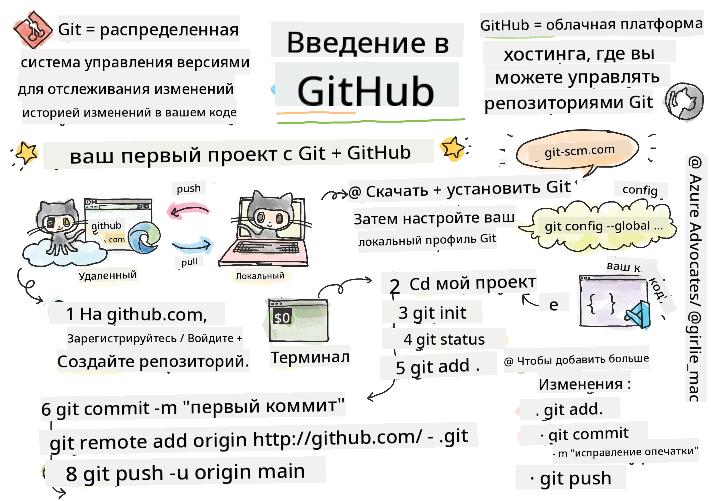
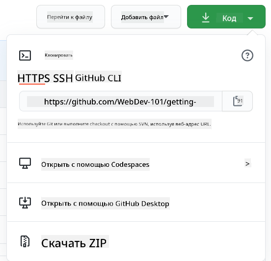

<!--
CO_OP_TRANSLATOR_METADATA:
{
  "original_hash": "05666cecb8983a72cf0ce1d18932b5b7",
  "translation_date": "2025-08-25T22:42:30+00:00",
  "source_file": "1-getting-started-lessons/2-github-basics/README.md",
  "language_code": "ru"
}
-->
# Введение в GitHub

Этот урок охватывает основы GitHub — платформы для размещения и управления изменениями в вашем коде.


> Скетчноут от [Tomomi Imura](https://twitter.com/girlie_mac)

## Викторина перед лекцией
[Викторина перед лекцией](https://ff-quizzes.netlify.app/web/quiz/3)

## Введение

В этом уроке мы рассмотрим:

- отслеживание работы на вашем компьютере
- совместную работу над проектами с другими
- как вносить вклад в проекты с открытым исходным кодом

### Предварительные требования

Перед началом убедитесь, что Git установлен. В терминале введите:  
`git --version`

Если Git не установлен, [скачайте Git](https://git-scm.com/downloads). Затем настройте локальный профиль Git в терминале:
* `git config --global user.name "ваше-имя"`
* `git config --global user.email "ваш-email"`

Чтобы проверить, настроен ли уже Git, введите:
`git config --list`

Вам также понадобится аккаунт на GitHub, текстовый редактор (например, Visual Studio Code) и доступ к терминалу (или командной строке).

Перейдите на [github.com](https://github.com/), создайте аккаунт, если у вас его еще нет, или войдите и заполните свой профиль.

✅ GitHub — не единственное хранилище кода в мире; есть и другие, но GitHub — самое известное.

### Подготовка

Вам понадобится папка с проектом на вашем локальном компьютере (ноутбуке или ПК) и публичное хранилище на GitHub, которое послужит примером того, как вносить вклад в проекты других.

---

## Управление кодом

Предположим, у вас есть локальная папка с проектом, и вы хотите начать отслеживать свой прогресс с помощью git — системы контроля версий. Некоторые сравнивают использование git с написанием любовного письма самому себе в будущем. Читая свои сообщения о коммитах через дни, недели или месяцы, вы сможете вспомнить, почему приняли то или иное решение, или "откатить" изменения — при условии, что вы пишете хорошие сообщения о коммитах.

### Задание: Создайте репозиторий и зафиксируйте код  

> Посмотрите видео
> 
> [](https://www.youtube.com/watch?v=9R31OUPpxU4)

1. **Создайте репозиторий на GitHub**. На GitHub.com, в разделе репозиториев или в верхнем правом углу навигационной панели, найдите кнопку **new repo**.

   1. Дайте вашему репозиторию (папке) имя.
   1. Выберите **create repository**.

1. **Перейдите в рабочую папку**. В терминале переключитесь на папку (также известную как директория), которую вы хотите начать отслеживать. Введите:

   ```bash
   cd [name of your folder]
   ```

1. **Инициализируйте git-репозиторий**. В вашем проекте введите:

   ```bash
   git init
   ```

1. **Проверьте статус**. Чтобы проверить статус вашего репозитория, введите:

   ```bash
   git status
   ```

   Вывод может выглядеть примерно так:

   ```output
   Changes not staged for commit:
   (use "git add <file>..." to update what will be committed)
   (use "git checkout -- <file>..." to discard changes in working directory)

        modified:   file.txt
        modified:   file2.txt
   ```

   Обычно команда `git status` сообщает вам, какие файлы готовы к _сохранению_ в репозитории или содержат изменения, которые вы, возможно, захотите зафиксировать.

1. **Добавьте все файлы для отслеживания**  
   Это также называется постановкой файлов в область подготовки.

   ```bash
   git add .
   ```

   Аргумент `git add` плюс `.` указывает, что все ваши файлы и изменения будут отслеживаться.

1. **Добавьте выбранные файлы для отслеживания**

   ```bash
   git add [file or folder name]
   ```

   Это позволяет добавлять только выбранные файлы в область подготовки, если вы не хотите фиксировать все файлы сразу.

1. **Уберите все файлы из области подготовки**

   ```bash
   git reset
   ```

   Эта команда позволяет убрать все файлы из области подготовки сразу.

1. **Уберите конкретный файл из области подготовки**

   ```bash
   git reset [file or folder name]
   ```

   Эта команда позволяет убрать из области подготовки только конкретный файл, который вы не хотите включать в следующий коммит.

1. **Сохраните свою работу**. На этом этапе вы добавили файлы в так называемую _область подготовки_. Это место, где Git отслеживает ваши файлы. Чтобы сделать изменения постоянными, вам нужно _зафиксировать_ файлы. Для этого создайте _коммит_ с помощью команды `git commit`. Коммит представляет собой точку сохранения в истории вашего репозитория. Введите следующую команду, чтобы создать _коммит_:

   ```bash
   git commit -m "first commit"
   ```

   Это зафиксирует все ваши файлы с сообщением "first commit". В будущем старайтесь давать более описательные сообщения, чтобы передать, какие изменения вы внесли.

1. **Свяжите локальный репозиторий Git с GitHub**. Репозиторий Git полезен на вашем компьютере, но в какой-то момент вы захотите создать резервную копию своих файлов где-то еще и пригласить других людей работать с вами над вашим репозиторием. Одно из лучших мест для этого — GitHub. Помните, что мы уже создали репозиторий на GitHub, поэтому нам нужно только связать локальный репозиторий Git с GitHub. Команда `git remote add` сделает это. Введите следующую команду:

   > Примечание: перед вводом команды перейдите на страницу вашего репозитория на GitHub, чтобы найти URL репозитория. Вы будете использовать его в следующей команде. Замените ```https://github.com/username/repository_name.git``` на ваш URL GitHub.

   ```bash
   git remote add origin https://github.com/username/repository_name.git
   ```

   Это создаст _удаленный репозиторий_ с именем "origin", указывающий на репозиторий GitHub, который вы создали ранее.

1. **Отправьте локальные файлы на GitHub**. До сих пор вы создали _связь_ между локальным репозиторием и репозиторием GitHub. Давайте отправим эти файлы на GitHub с помощью следующей команды `git push`:

   > Примечание: имя вашей ветки по умолчанию может отличаться от ```main```.

   ```bash
   git push -u origin main
   ```

   Это отправит ваши коммиты из ветки "main" на GitHub.

2. **Добавьте больше изменений**. Если вы хотите продолжить вносить изменения и отправлять их на GitHub, вам нужно будет использовать следующие три команды:

   ```bash
   git add .
   git commit -m "type your commit message here"
   git push
   ```

   > Совет: возможно, вы захотите использовать файл `.gitignore`, чтобы предотвратить появление на GitHub файлов, которые вы не хотите отслеживать, например, заметок, которые вы храните в той же папке, но которые не должны быть в публичном репозитории. Вы можете найти шаблоны для файлов `.gitignore` на странице [.gitignore templates](https://github.com/github/gitignore).

#### Сообщения о коммитах

Отличная строка темы для коммита должна завершать следующее предложение:  
Если применить, этот коммит <ваша строка темы здесь>.

Для темы используйте повелительное наклонение в настоящем времени: "изменить", а не "изменил" или "изменяет".  
Как и в теме, в теле (опционально) также используйте повелительное наклонение в настоящем времени. Тело должно включать мотивацию для изменения и контрастировать это с предыдущим поведением. Вы объясняете `почему`, а не `как`.

✅ Потратьте несколько минут, чтобы просмотреть GitHub. Можете ли вы найти действительно отличное сообщение о коммите? А минимальное? Какую информацию, по вашему мнению, наиболее важно и полезно передать в сообщении о коммите?

### Задание: Сотрудничество

Основная причина размещения проектов на GitHub — это возможность сотрудничать с другими разработчиками.

## Работа над проектами с другими

> Посмотрите видео
>
> [](https://www.youtube.com/watch?v=bFCM-PC3cu8)

В вашем репозитории перейдите в `Insights > Community`, чтобы увидеть, как ваш проект соответствует рекомендованным стандартам сообщества.

   Вот несколько вещей, которые могут улучшить ваш репозиторий на GitHub:
   - **Описание**. Добавили ли вы описание для вашего проекта?
   - **README**. Добавили ли вы README? GitHub предоставляет рекомендации по написанию [README](https://docs.github.com/articles/about-readmes/?WT.mc_id=academic-77807-sagibbon).
   - **Руководство по вкладу**. Есть ли у вашего проекта [руководство по вкладу](https://docs.github.com/articles/setting-guidelines-for-repository-contributors/?WT.mc_id=academic-77807-sagibbon)?
   - **Кодекс поведения**. Есть ли [Кодекс поведения](https://docs.github.com/articles/adding-a-code-of-conduct-to-your-project/)?
   - **Лицензия**. И, возможно, самое важное — [лицензия](https://docs.github.com/articles/adding-a-license-to-a-repository/)?

Все эти ресурсы помогут новым участникам команды быстрее освоиться. Обычно это те вещи, на которые новые участники обращают внимание, прежде чем даже взглянуть на ваш код, чтобы понять, стоит ли им тратить свое время на ваш проект.

✅ Файлы README, хотя их подготовка занимает время, часто игнорируются занятыми мейнтейнерами. Можете ли вы найти пример особенно описательного README? Примечание: существуют [инструменты для создания хороших README](https://www.makeareadme.com/), которые вы можете попробовать.

### Задание: Объедините код

Документы по вкладу помогают людям вносить изменения в проект. Они объясняют, какие типы вкладов вы ищете и как работает процесс. Участникам потребуется пройти несколько шагов, чтобы внести изменения в ваш репозиторий на GitHub:

1. **Форк вашего репозитория**. Скорее всего, вы захотите, чтобы люди _форкали_ ваш проект. Форк означает создание копии вашего репозитория в их профиле на GitHub.
1. **Клонирование**. После этого они клонируют проект на свой локальный компьютер.
1. **Создание ветки**. Вы захотите попросить их создать _ветку_ для своей работы.
1. **Сосредоточение изменений на одной области**. Попросите участников сосредоточить свои изменения на одной вещи за раз — так вероятность того, что вы сможете _объединить_ их работу, будет выше. Представьте, что они исправляют баг, добавляют новую функцию и обновляют несколько тестов — что, если вы хотите или можете реализовать только 2 из 3 или 1 из 3 изменений?

✅ Представьте ситуацию, в которой ветки особенно важны для написания и выпуска качественного кода. Какие случаи использования вы можете придумать?

> Примечание: будьте примером для подражания и создавайте ветки для своей работы. Любые коммиты, которые вы делаете, будут сделаны в ветке, в которой вы сейчас находитесь. Используйте `git status`, чтобы увидеть, в какой ветке вы находитесь.

Давайте рассмотрим рабочий процесс участника. Предположим, участник уже _форкнул_ и _клонировал_ репозиторий, так что у него есть готовый репозиторий Git на локальном компьютере:

1. **Создайте ветку**. Используйте команду `git branch`, чтобы создать ветку, которая будет содержать изменения, которые они хотят внести:

   ```bash
   git branch [branch-name]
   ```

1. **Переключитесь на рабочую ветку**. Переключитесь на указанную ветку и обновите рабочую директорию с помощью `git switch`:

   ```bash
   git switch [branch-name]
   ```

1. **Работайте**. На этом этапе вы можете вносить изменения. Не забудьте сообщить об этом Git с помощью следующих команд:

   ```bash
   git add .
   git commit -m "my changes"
   ```

   Убедитесь, что вы дали вашему коммиту хорошее имя, как для себя, так и для мейнтейнера репозитория, которому вы помогаете.

1. **Объедините свою работу с веткой `main`**. В какой-то момент вы завершите работу и захотите объединить свои изменения с веткой `main`. Ветка `main` могла измениться за это время, поэтому сначала обновите ее до последней версии с помощью следующих команд:

   ```bash
   git switch main
   git pull
   ```

   На этом этапе убедитесь, что любые _конфликты_, ситуации, когда Git не может легко _объединить_ изменения, происходят в вашей рабочей ветке. Поэтому выполните следующие команды:

   ```bash
   git switch [branch_name]
   git merge main
   ```

   Это принесет все изменения из `main` в вашу ветку, и, надеемся, вы сможете продолжить. Если нет, VS Code подскажет, где Git _запутался_, и вы просто измените затронутые файлы, чтобы указать, какое содержимое наиболее точное.

1. **Отправьте свою работу на GitHub**. Отправка вашей работы на GitHub включает два действия: отправку вашей ветки в ваш репозиторий и открытие PR (Pull Request).

   ```bash
   git push --set-upstream origin [branch-name]
   ```

   Эта команда создаст ветку в вашем форкнутом репозитории.

1. **Откройте PR**. Затем вы захотите открыть PR. Для этого перейдите в форкнутый репозиторий на GitHub. Вы увидите уведомление, предлагающее создать новый PR. Нажмите на него, и вы попадете в интерфейс, где сможете изменить заголовок сообщения коммита, дать ему более подходящее описание. Теперь мейнтейнер репозитория, который вы форкнули, увидит этот PR, и, будем надеяться, оценит и _объединит_ ваш PR. Теперь вы — участник, ура :)

1. **Очистите**. Считается хорошей практикой _очищать_ после успешного объединения PR. Вы захотите удалить как локальную ветку, так и ветку, которую вы отправили на GitHub. Сначала удалите ее локально с помощью следующей команды:

   ```bash
   git branch -d [branch-name]
   ```
Убедитесь, что вы перейдете на страницу GitHub для форкнутого репозитория и удалите удаленную ветку, которую вы только что запушили.

`Pull request` кажется немного странным термином, потому что на самом деле вы хотите отправить свои изменения в проект. Но мейнтейнер (владелец проекта) или основная команда должны рассмотреть ваши изменения перед их слиянием с "главной" веткой проекта, так что вы, по сути, запрашиваете решение о внесении изменений у мейнтейнера.

Pull request — это место для сравнения и обсуждения различий, внесенных в ветку, с помощью обзоров, комментариев, интегрированных тестов и других инструментов. Хороший pull request следует примерно тем же правилам, что и сообщение коммита. Вы можете добавить ссылку на задачу в трекере задач, если ваша работа, например, исправляет проблему. Это делается с помощью символа `#`, за которым следует номер вашей задачи. Например, `#97`.

🤞Держим кулачки, чтобы все проверки прошли успешно, и владелец(ы) проекта слили ваши изменения в проект🤞

Обновите текущую локальную рабочую ветку всеми новыми коммитами из соответствующей удаленной ветки на GitHub:

`git pull`

## Как внести вклад в open source

Для начала давайте найдем репозиторий (или **репо**) на GitHub, который вас интересует и в который вы хотели бы внести изменения. Вам нужно будет скопировать его содержимое на свой компьютер.

✅ Хороший способ найти репозитории для новичков — это [поиск по тегу 'good-first-issue'](https://github.blog/2020-01-22-browse-good-first-issues-to-start-contributing-to-open-source/).



Существует несколько способов копирования кода. Один из них — "клонировать" содержимое репозитория, используя HTTPS, SSH или GitHub CLI (интерфейс командной строки).

Откройте терминал и клонируйте репозиторий следующим образом:
`git clone https://github.com/ProjectURL`

Чтобы работать над проектом, перейдите в нужную папку:
`cd ProjectURL`

Вы также можете открыть весь проект, используя [Codespaces](https://github.com/features/codespaces), встроенный редактор кода / облачную среду разработки от GitHub, или [GitHub Desktop](https://desktop.github.com/).

Наконец, вы можете скачать код в виде архива.

### Еще несколько интересных вещей о GitHub

Вы можете поставить звезду, подписаться на обновления или "форкнуть" любой публичный репозиторий на GitHub. Найти свои отмеченные звездами репозитории можно в выпадающем меню в правом верхнем углу. Это как закладки, но для кода.

У проектов есть трекер задач, чаще всего на GitHub во вкладке "Issues", если не указано иное, где люди обсуждают проблемы, связанные с проектом. А во вкладке Pull Requests обсуждаются и рецензируются изменения, которые находятся в процессе.

У проектов также могут быть обсуждения на форумах, в почтовых рассылках или в чатах, таких как Slack, Discord или IRC.

✅ Осмотритесь в вашем новом репозитории на GitHub и попробуйте сделать несколько вещей, например, изменить настройки, добавить информацию в репозиторий или создать проект (например, Канбан-доску). Возможностей много!

---

## 🚀 Задание

Работайте в паре с другом над кодом друг друга. Создайте проект совместно, форкните код, создайте ветки и объедините изменения.

## Викторина после лекции
[Викторина после лекции](https://ff-quizzes.netlify.app/web/quiz/4)

## Обзор и самостоятельное изучение

Прочитайте больше о [вкладе в open source программное обеспечение](https://opensource.guide/how-to-contribute/#how-to-submit-a-contribution).

[Шпаргалка по Git](https://training.github.com/downloads/github-git-cheat-sheet/).

Практика, практика, практика. GitHub предлагает отличные учебные материалы на [skills.github.com](https://skills.github.com):

- [Первая неделя на GitHub](https://skills.github.com/#first-week-on-github)

Вы также найдете более продвинутые курсы.

## Задание

Пройдите курс [Первая неделя на GitHub](https://skills.github.com/#first-week-on-github)

**Отказ от ответственности**:  
Этот документ был переведен с использованием сервиса автоматического перевода [Co-op Translator](https://github.com/Azure/co-op-translator). Хотя мы стремимся к точности, пожалуйста, учитывайте, что автоматические переводы могут содержать ошибки или неточности. Оригинальный документ на его родном языке следует считать авторитетным источником. Для получения критически важной информации рекомендуется профессиональный перевод человеком. Мы не несем ответственности за любые недоразумения или неправильные интерпретации, возникающие в результате использования данного перевода.