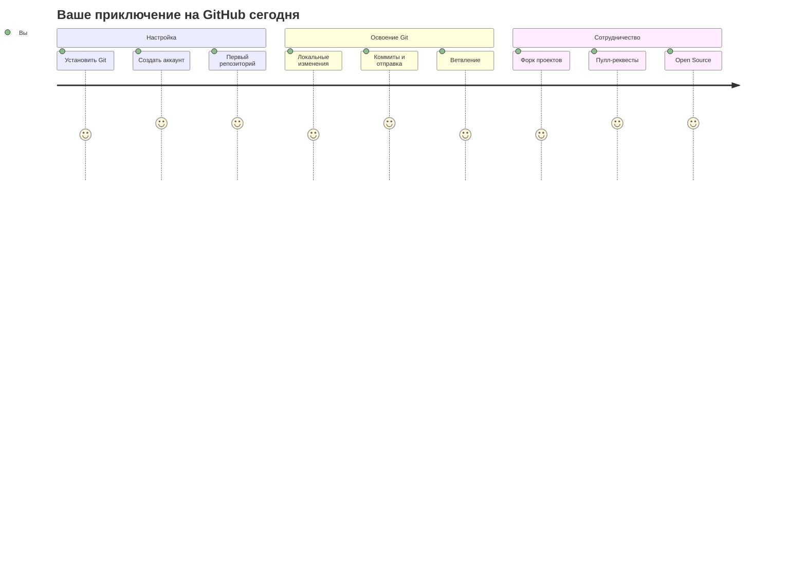
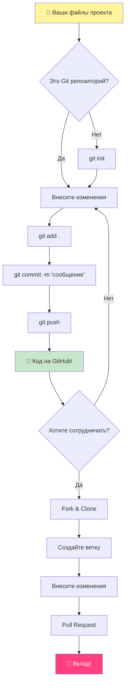
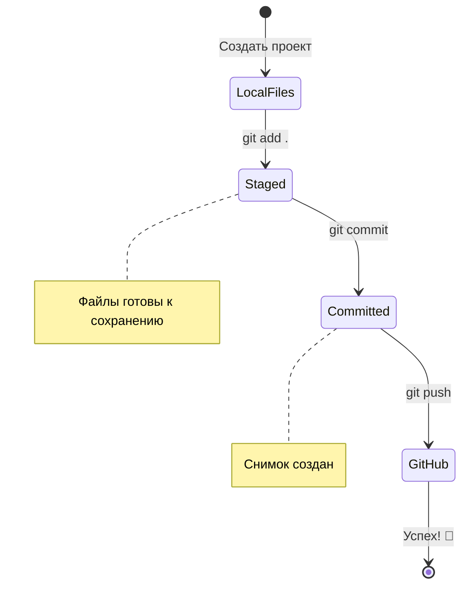
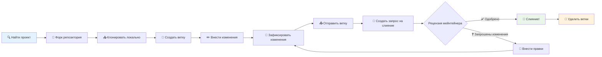
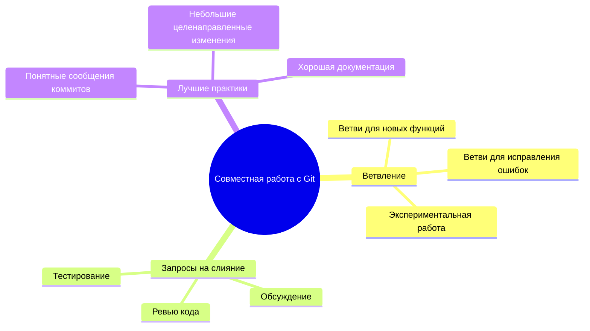
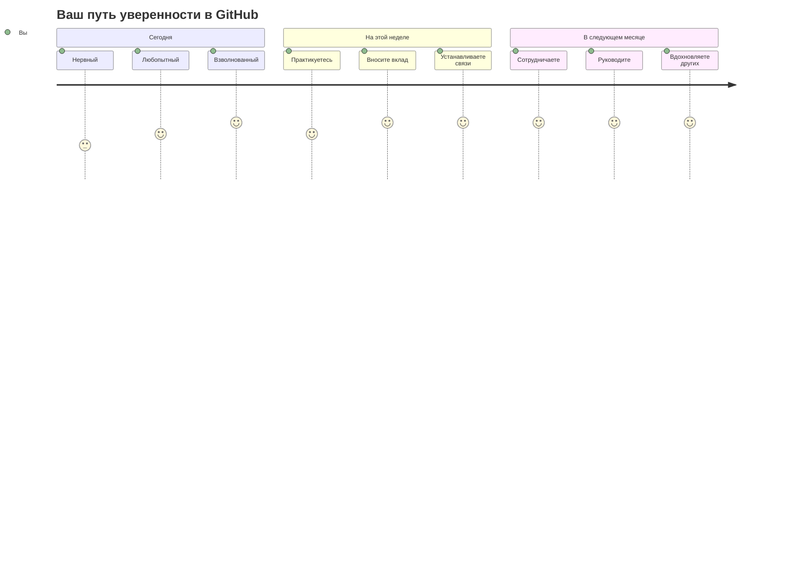

<!--
CO_OP_TRANSLATOR_METADATA:
{
  "original_hash": "5c383cc2cc23bb164b06417d1c107a44",
  "translation_date": "2025-11-25T17:29:50+00:00",
  "source_file": "1-getting-started-lessons/2-github-basics/README.md",
  "language_code": "ru"
}
-->
# Введение в GitHub

Привет, будущий разработчик! 👋 Готов присоединиться к миллионам программистов по всему миру? Я искренне рад познакомить тебя с GitHub – представь это как социальную сеть для программистов, только вместо фотографий обедов мы делимся кодом и создаем невероятные вещи вместе!

Вот что меня поражает: каждое приложение на твоем телефоне, каждый сайт, который ты посещаешь, и большинство инструментов, которые ты будешь изучать, были созданы командами разработчиков, сотрудничающих на платформах вроде GitHub. То музыкальное приложение, которое ты любишь? Кто-то вроде тебя внес в него свой вклад. Та игра, от которой ты не можешь оторваться? Да, скорее всего, она была создана с помощью GitHub. А теперь ТЫ научишься быть частью этого удивительного сообщества!

Я знаю, что сначала это может показаться сложным – честно, я помню, как смотрел на свою первую страницу GitHub и думал: "Что это вообще значит?" Но вот в чем дело: каждый разработчик начинал именно с того места, где ты сейчас. К концу этого урока у тебя будет свой собственный репозиторий на GitHub (представь это как личную витрину проектов в облаке), и ты узнаешь, как сохранять свою работу, делиться ею с другими и даже вносить вклад в проекты, которыми пользуются миллионы людей.

Мы пройдем этот путь вместе, шаг за шагом. Без спешки, без давления – только ты, я и несколько действительно крутых инструментов, которые скоро станут твоими лучшими друзьями!


> Скетчноут от [Tomomi Imura](https://twitter.com/girlie_mac)


## Тест перед лекцией
[Тест перед лекцией](https://ff-quizzes.netlify.app)

## Введение

Прежде чем мы погрузимся в действительно увлекательные вещи, давай подготовим твой компьютер для магии GitHub! Представь это как организацию своих художественных принадлежностей перед созданием шедевра – наличие нужных инструментов делает все намного проще и гораздо веселее.

Я проведу тебя через каждый шаг настройки лично, и обещаю, это не так уж страшно, как может показаться на первый взгляд. Если что-то сразу не получается, это абсолютно нормально! Я помню, как настраивал свою первую среду разработки и чувствовал себя так, будто пытаюсь читать древние иероглифы. Каждый разработчик был именно там, где ты сейчас, задаваясь вопросом, правильно ли он все делает. Спойлер: если ты здесь и учишься, ты уже делаешь все правильно! 🌟

В этом уроке мы рассмотрим:

- отслеживание работы на твоем компьютере
- работу над проектами с другими
- как вносить вклад в проекты с открытым исходным кодом

### Предварительные требования

Давай подготовим твой компьютер для магии GitHub! Не переживай – эту настройку нужно сделать только один раз, и потом ты будешь готов ко всему своему кодерскому пути.

Итак, начнем с основы! Сначала нужно проверить, установлен ли Git на твоем компьютере. Git – это как суперумный помощник, который запоминает каждое изменение, которое ты вносишь в код – гораздо лучше, чем постоянно нажимать Ctrl+S каждые две секунды (мы все там были!).

Давай проверим, установлен ли Git, введя эту волшебную команду в терминале:
`git --version`

Если Git еще не установлен, не переживай! Просто зайди на [скачать Git](https://git-scm.com/downloads) и установи его. После установки нужно правильно познакомить Git с тобой:

> 💡 **Первоначальная настройка**: Эти команды говорят Git, кто ты. Эта информация будет прикреплена к каждому коммиту, который ты сделаешь, так что выбери имя и email, которые ты готов публично показывать.

```bash
git config --global user.name "your-name"
git config --global user.email "your-email"
```

Чтобы проверить, настроен ли Git, можно ввести:
```bash
git config --list
```

Тебе также понадобится аккаунт на GitHub, редактор кода (например, Visual Studio Code), и нужно будет открыть терминал (или командную строку).

Перейди на [github.com](https://github.com/) и создай аккаунт, если у тебя его еще нет, или войди и заполни свой профиль.

💡 **Современный совет**: Рассмотри возможность настройки [SSH-ключей](https://docs.github.com/en/authentication/connecting-to-github-with-ssh) или использования [GitHub CLI](https://cli.github.com/) для более удобной аутентификации без паролей.

✅ GitHub – не единственный репозиторий кода в мире; есть и другие, но GitHub – самый известный.

### Подготовка

Тебе понадобится папка с проектом кода на твоем локальном компьютере (ноутбуке или ПК) и публичный репозиторий на GitHub, который будет служить примером того, как вносить вклад в проекты других.

### Сохранение твоего кода в безопасности

Давай поговорим о безопасности – но не переживай, мы не будем перегружать тебя страшными вещами! Представь эти практики безопасности как запирание машины или дома. Это простые привычки, которые становятся естественными и защищают твою работу.

Мы покажем тебе современные, безопасные способы работы с GitHub с самого начала. Таким образом, ты разовьешь хорошие привычки, которые будут полезны на протяжении всей твоей карьеры программиста.

При работе с GitHub важно следовать лучшим практикам безопасности:

| Область безопасности | Лучшая практика | Почему это важно |
|-----------------------|-----------------|------------------|
| **Аутентификация** | Используй SSH-ключи или персональные токены доступа | Пароли менее безопасны и постепенно выводятся из использования |
| **Двухфакторная аутентификация** | Включи 2FA в своем аккаунте GitHub | Добавляет дополнительный уровень защиты аккаунта |
| **Безопасность репозитория** | Никогда не коммить чувствительную информацию | API-ключи и пароли не должны быть в публичных репозиториях |
| **Управление зависимостями** | Включи Dependabot для обновлений | Обеспечивает безопасность и актуальность твоих зависимостей |

> ⚠️ **Критическое напоминание о безопасности**: Никогда не коммить API-ключи, пароли или другую чувствительную информацию в любой репозиторий. Используй переменные окружения и файлы `.gitignore` для защиты данных.

**Современная настройка аутентификации:**

```bash
# Генерация SSH-ключа (современный алгоритм ed25519)
ssh-keygen -t ed25519 -C "your_email@example.com"

# Настройка Git для использования SSH
git remote set-url origin git@github.com:username/repository.git
```

> 💡 **Совет профессионала**: SSH-ключи избавляют от необходимости постоянно вводить пароли и более безопасны, чем традиционные методы аутентификации.

---

## Управление кодом как профессионал

А теперь начинается самое интересное! 🎉 Мы собираемся научиться отслеживать и управлять твоим кодом, как это делают профессионалы, и честно говоря, это одна из моих любимых тем для обучения, потому что она действительно меняет игру.

Представь: ты пишешь удивительную историю и хочешь отслеживать каждый черновик, каждое блестящее редактирование и каждое "Ого, это гениально!" на протяжении всего процесса. Именно это Git делает для твоего кода! Это как невероятная записная книжка-путешественник во времени, которая запоминает ВСЕ – каждое нажатие клавиши, каждое изменение, каждое "ой, это все сломало", которое ты можешь мгновенно отменить.

Признаюсь – сначала это может показаться сложным. Когда я начинал, я думал: "Почему я не могу просто сохранять свои файлы, как обычно?" Но поверь мне: как только ты поймешь Git (а ты поймешь!), у тебя будет момент озарения, когда ты подумаешь: "Как я вообще кодил без этого?" Это как открыть для себя способность летать, когда ты всю жизнь ходил пешком!

Допустим, у тебя есть папка с проектом кода на локальном компьютере, и ты хочешь начать отслеживать свой прогресс с помощью git – системы контроля версий. Некоторые сравнивают использование git с написанием любовного письма своему будущему "я". Читая свои сообщения коммитов через дни, недели или месяцы, ты сможешь вспомнить, почему принял то или иное решение, или "откатить" изменение – конечно, если ты пишешь хорошие сообщения коммитов.


### Задача: Создай свой первый репозиторий!

> 🎯 **Твоя миссия (и я так рад за тебя!)**: Мы вместе создадим твой первый репозиторий на GitHub! К тому моменту, как мы закончим, у тебя будет свой уголок в интернете, где будет жить твой код, и ты сделаешь свой первый "коммит" (это разработческое слово для сохранения работы умным способом).
>
> Это действительно особенный момент – ты официально присоединяешься к глобальному сообществу разработчиков! Я до сих пор помню восторг от создания своего первого репозитория и мысль: "Вау, я действительно это делаю!"

Давай пройдем через это приключение вместе, шаг за шагом. Не торопись с каждым этапом – здесь нет приза за скорость, и я обещаю, что каждый шаг будет понятен. Помни, каждый кодер, которым ты восхищаешься, когда-то сидел именно там, где ты сейчас, готовясь создать свой первый репозиторий. Как это круто?

> Посмотри видео
> 
> [](https://www.youtube.com/watch?v=9R31OUPpxU4)

**Давай сделаем это вместе:**

1. **Создай свой репозиторий на GitHub**. Перейди на GitHub.com и найди ярко-зеленую кнопку **New** (или знак **+** в правом верхнем углу). Нажми на нее и выбери **New repository**.

   Вот что нужно сделать:
   1. Дай своему репозиторию имя – выбери что-то значимое для тебя!
   1. Добавь описание, если хочешь (это поможет другим понять, о чем твой проект)
   1. Реши, хочешь ли ты сделать его публичным (все смогут его видеть) или приватным (только для тебя)
   1. Я рекомендую поставить галочку, чтобы добавить файл README – это как главная страница твоего проекта
   1. Нажми **Create repository** и празднуй – ты только что создал свой первый репозиторий! 🎉

2. **Перейди в папку своего проекта**. Теперь откроем твой терминал (не переживай, он не так страшен, как выглядит!). Нам нужно указать компьютеру, где находятся файлы твоего проекта. Введи эту команду:

   ```bash
   cd [name of your folder]
   ```

   **Что мы здесь делаем:**
   - Мы говорим компьютеру: "Эй, отведи меня в папку моего проекта"
   - Это как открыть определенную папку на рабочем столе, только мы делаем это текстовыми командами
   - Замени `[name of your folder]` на фактическое имя папки твоего проекта

3. **Преврати свою папку в репозиторий Git**. Вот где начинается магия! Введи:

   ```bash
   git init
   ```

   **Вот что только что произошло (довольно круто!):**
   - Git создал скрытую папку `.git` в твоем проекте – ты ее не увидишь, но она там!
   - Твоя обычная папка теперь "репозиторий", который может отслеживать каждое изменение, которое ты делаешь
   - Представь это как придание твоей папке суперспособностей, чтобы запоминать все

4. **Проверь, что происходит**. Давай посмотрим, что Git думает о твоем проекте прямо сейчас:

   ```bash
   git status
   ```

   **Понимание того, что говорит Git:**
   
   Ты можешь увидеть что-то вроде этого:

   ```output
   Changes not staged for commit:
   (use "git add <file>..." to update what will be committed)
   (use "git restore <file>..." to discard changes in working directory)

        modified:   file.txt
        modified:   file2.txt
   ```

   **Не паникуй! Вот что это значит:**
   - Файлы в **красном** – это файлы, которые изменены, но еще не готовы к сохранению
   - Файлы в **зеленом** (когда ты их увидишь) готовы к сохранению
   - Git помогает, говоря тебе, что именно ты можешь сделать дальше

   > 💡 **Совет профессионала**: Команда `git status` – твой лучший друг! Используй ее всякий раз, когда ты не уверен, что происходит. Это как спросить Git: "Эй, какая сейчас ситуация?"

5. **Подготовь свои файлы к сохранению** (это называется "стейджинг"):

   ```bash
   git add .
   ```

   **Что мы только что сделали:**
   - Мы сказали Git: "Эй, я хочу включить ВСЕ мои файлы в следующее сохранение"
   - `.` – это как сказать "все в этой папке"
   - Теперь твои файлы "стейджированы" и готовы к следующему шагу

   **Хочешь быть более избирательным?** Ты можешь добавить только определенные файлы:

   ```bash
   git add [file or folder name]
   ```

   **Почему ты можешь захотеть сделать это?**
   - Иногда ты хочешь сохранять связанные изменения вместе
   - Это помогает организовать твою работу в логические блоки
   - Делает проще понять, что изменилось и когда

   **Передумал?** Не переживай! Ты можешь убрать файлы из стейджа вот так:

   ```bash
   # Убрать все из индекса
   git reset
   
   # Убрать из индекса только один файл
   git reset [file name]
   ```

   Не переживай – это не удаляет твою работу, это просто убирает файлы из "готовых к сохранению".

6. **Сохрани свою работу навсегда** (сделай свой первый коммит!):

   ```bash
   git commit -m "first commit"
   ```

   **🎉 Поздравляю! Ты только что сделал свой первый коммит!**
   
   **Вот что только что произошло:**
   - Git сделал "снимок" всех твоих стейджированных файлов в этот момент
   - Твое сообщение коммита "first commit" объясняет, о чем эта точка сохранения
   - Git дал этому снимку уникальный ID, чтобы ты всегда мог его найти
   - Ты официально начал отслеживать историю своего проекта!

   > 💡 **Будущие сообщения коммитов**: Для следующих коммитов будь более описательным! Вместо "обновил что-то" попробуй "Добавил контактную форму на главную страницу" или "Исправил баг в меню навигации". Твое будущее "я" скажет тебе спасибо!

7. **Подключи свой локальный проект к GitHub**. Сейчас твой проект существует только на твоем компьютере. Давай подключим его к твоему репозиторию на GitHub, чтобы ты мог поделиться им с миром!

   Сначала перейди на страницу своего репозитория на GitHub и скопируй URL. Затем вернись сюда и введи:

   ```bash
   git remote add origin https://github.com/username/repository_name.git
   ```
   
   (Замени этот URL на фактический URL твоего репозитория!)

   **Что мы только что сделали:**
   - Мы создали связь между вашим локальным проектом и репозиторием на GitHub.
   - "Origin" — это просто прозвище для вашего репозитория на GitHub, как добавление контакта в телефон.
   - Теперь ваш локальный Git знает, куда отправлять ваш код, когда вы будете готовы поделиться им.

   💡 **Проще способ**: Если у вас установлен GitHub CLI, вы можете сделать это одной командой:
   ```bash
   gh repo create my-repo --public --push --source=.
   ```

8. **Отправьте ваш код на GitHub** (вот он, важный момент!):

   ```bash
   git push -u origin main
   ```

   **🚀 Это оно! Вы загружаете ваш код на GitHub!**
   
   **Что происходит:**
   - Ваши коммиты отправляются с вашего компьютера на GitHub.
   - Флаг `-u` устанавливает постоянное соединение, чтобы в будущем было проще отправлять изменения.
   - "main" — это название вашей основной ветки (как главная папка).
   - После этого для будущих загрузок достаточно просто ввести `git push`!

   💡 **Быстрая заметка**: Если ваша ветка называется иначе (например, "master"), используйте это название. Вы можете проверить это с помощью команды `git branch --show-current`.

9. **Ваш новый ежедневный ритм кодинга** (вот где это становится увлекательным!):

   С этого момента, когда вы вносите изменения в проект, у вас есть простой трехшаговый процесс:

   ```bash
   git add .
   git commit -m "describe what you changed"
   git push
   ```

   **Это становится вашим сердцебиением кодинга:**
   - Внесите потрясающие изменения в ваш код ✨
   - Добавьте их с помощью `git add` ("Эй, Git, обрати внимание на эти изменения!")
   - Сохраните их с помощью `git commit` и описательного сообщения (будущий вы скажет вам спасибо!)
   - Поделитесь ими с миром, используя `git push` 🚀
   - Повторяйте снова и снова – серьезно, это становится таким же естественным, как дыхание!

   Мне нравится этот рабочий процесс, потому что он похож на создание множества точек сохранения в видеоигре. Сделали изменение, которое вам нравится? Закоммитьте его! Хотите попробовать что-то рискованное? Без проблем – вы всегда можете вернуться к последнему коммиту, если что-то пойдет не так!

   > 💡 **Совет**: Возможно, вы захотите использовать файл `.gitignore`, чтобы предотвратить появление на GitHub файлов, которые вы не хотите отслеживать, например, файла с заметками, который вы храните в той же папке, но который не должен быть в публичном репозитории. Вы можете найти шаблоны для файлов `.gitignore` на странице [.gitignore templates](https://github.com/github/gitignore) или создать его с помощью [gitignore.io](https://www.toptal.com/developers/gitignore).

### 🧠 **Первый репозиторий: как это было?**

**Возьмите минуту, чтобы отпраздновать и подумать:**
- Каково было увидеть ваш код на GitHub впервые?
- Какой шаг показался самым запутанным, а какой – неожиданно простым?
- Можете ли вы объяснить разницу между `git add`, `git commit` и `git push` своими словами?


> **Помните**: Даже опытные разработчики иногда забывают точные команды. Чтобы этот рабочий процесс стал автоматическим, требуется практика – вы на правильном пути!

#### Современные рабочие процессы с Git

Рассмотрите возможность внедрения этих современных практик:

- **Conventional Commits**: Используйте стандартизированный формат сообщений коммитов, например, `feat:`, `fix:`, `docs:` и т.д. Подробнее на [conventionalcommits.org](https://www.conventionalcommits.org/)
- **Атомарные коммиты**: Каждый коммит должен представлять собой одно логическое изменение.
- **Частые коммиты**: Делайте коммиты часто с описательными сообщениями, а не редкие и крупные.

#### Сообщения коммитов

Отличная строка темы коммита завершает следующее предложение:
Если применить, этот коммит <ваша строка темы здесь>

Для темы используйте повелительное наклонение в настоящем времени: "изменить", а не "изменил" или "изменяет". 
Как и в теме, в теле (опционально) также используйте повелительное наклонение в настоящем времени. Тело должно включать мотивацию для изменения и контрастировать это с предыдущим поведением. Вы объясняете `почему`, а не `как`.

✅ Потратьте несколько минут, чтобы поискать на GitHub. Можете ли вы найти действительно отличное сообщение коммита? А минимальное? Какую информацию, по вашему мнению, важно и полезно передать в сообщении коммита?

## Работа с другими (самая интересная часть!)

Держитесь крепче, потому что ЗДЕСЬ GitHub становится абсолютно волшебным! 🪄 Вы освоили управление своим кодом, а теперь мы погружаемся в мою абсолютную любимую часть – сотрудничество с удивительными людьми со всего мира.

Представьте: вы просыпаетесь завтра и видите, что кто-то в Токио улучшил ваш код, пока вы спали. Затем кто-то в Берлине исправляет баг, с которым вы застряли. К обеду разработчик из Сан-Паулу добавляет функцию, о которой вы даже не думали. Это не научная фантастика – это просто вторник во вселенной GitHub!

Что меня действительно вдохновляет, так это то, что навыки сотрудничества, которые вы собираетесь освоить, – это ТОЧНО такие же рабочие процессы, которые ежедневно используют команды в Google, Microsoft и ваших любимых стартапах. Вы не просто изучаете крутой инструмент – вы изучаете секретный язык, который позволяет всему миру программного обеспечения работать вместе.

Серьезно, как только вы испытаете восторг от того, что кто-то объединяет ваш первый pull request, вы поймете, почему разработчики так увлечены open source. Это как быть частью самого большого и креативного командного проекта в мире!

> Посмотрите видео
>
> [](https://www.youtube.com/watch?v=bFCM-PC3cu8)

Основная причина размещения проектов на GitHub – это возможность сотрудничать с другими разработчиками.


В вашем репозитории перейдите в `Insights > Community`, чтобы увидеть, как ваш проект соответствует рекомендованным стандартам сообщества.

Хотите, чтобы ваш репозиторий выглядел профессионально и привлекательно? Зайдите в ваш репозиторий и нажмите на `Insights > Community`. Эта классная функция показывает, как ваш проект соответствует тому, что сообщество GitHub считает "хорошими практиками репозитория".

> 🎯 **Сделайте ваш проект ярким**: Хорошо организованный репозиторий с качественной документацией – это как чистая, гостеприимная витрина. Это показывает людям, что вы заботитесь о своей работе, и побуждает других захотеть внести свой вклад!

**Что делает репозиторий отличным:**

| Что добавить | Почему это важно | Что это дает вам |
|-------------|-------------------|---------------------|
| **Описание** | Первое впечатление имеет значение! | Люди сразу понимают, что делает ваш проект |
| **README** | Главная страница вашего проекта | Как дружелюбный гид для новых посетителей |
| **Руководство по вкладу** | Показывает, что вы приветствуете помощь | Люди знают, как именно они могут помочь вам |
| **Кодекс поведения** | Создает дружелюбное пространство | Все чувствуют себя желанными участниками |
| **Лицензия** | Юридическая ясность | Другие знают, как они могут использовать ваш код |
| **Политика безопасности** | Показывает вашу ответственность | Демонстрирует профессиональные практики |

> 💡 **Совет профессионала**: GitHub предоставляет шаблоны для всех этих файлов. При создании нового репозитория отметьте галочки, чтобы автоматически сгенерировать эти файлы.

**Современные функции GitHub для изучения:**

🤖 **Автоматизация и CI/CD:**
- **GitHub Actions** для автоматического тестирования и развертывания
- **Dependabot** для автоматического обновления зависимостей

💬 **Сообщество и управление проектами:**
- **GitHub Discussions** для обсуждений сообщества вне рамок задач
- **GitHub Projects** для управления проектами в стиле канбан
- **Правила защиты веток** для обеспечения стандартов качества кода

Все эти ресурсы помогут в адаптации новых членов команды. И именно на такие вещи обычно обращают внимание новые участники, прежде чем даже взглянуть на ваш код, чтобы понять, стоит ли им тратить свое время на ваш проект.

✅ README-файлы, хотя их подготовка занимает время, часто игнорируются занятыми мейнтейнерами. Можете ли вы найти пример особенно описательного README? Примечание: существуют [инструменты для создания хороших README](https://www.makeareadme.com/), которые вам могут понравиться.

### Задача: Объедините немного кода

Документация для участников помогает людям вносить вклад в проект. Она объясняет, какие типы вкладов вы ищете и как работает процесс. Участникам нужно будет пройти несколько шагов, чтобы внести вклад в ваш репозиторий на GitHub:

1. **Форк репозитория**. Скорее всего, вы захотите, чтобы люди _форкали_ ваш проект. Форк – это создание копии вашего репозитория в их профиле на GitHub.
1. **Клонирование**. После этого они клонируют проект на свой локальный компьютер.
1. **Создание ветки**. Вы захотите попросить их создать _ветку_ для своей работы.
1. **Сфокусируйтесь на одной области**. Попросите участников сосредоточить свои изменения на чем-то одном – так шансы, что вы сможете _объединить_ их работу, будут выше. Представьте, что они исправляют баг, добавляют новую функцию и обновляют несколько тестов – что, если вы хотите или можете реализовать только 2 из 3 или 1 из 3 изменений?

✅ Представьте ситуацию, где ветки особенно важны для написания и выпуска качественного кода. Какие случаи использования вы можете придумать?

> Заметьте, будьте тем изменением, которое вы хотите видеть в мире, и создавайте ветки для своей работы тоже. Любые коммиты, которые вы делаете, будут сделаны в ветке, в которой вы сейчас находитесь. Используйте `git status`, чтобы увидеть, в какой ветке вы находитесь.

Давайте пройдемся по рабочему процессу участника. Предположим, участник уже _форкнул_ и _клонировал_ репозиторий, так что у него есть готовый к работе Git-репозиторий на локальной машине:

1. **Создайте ветку**. Используйте команду `git branch`, чтобы создать ветку, которая будет содержать изменения, которые они хотят внести:

   ```bash
   git branch [branch-name]
   ```

   > 💡 **Современный подход**: Вы также можете создать и переключиться на новую ветку одной командой:
   ```bash
   git switch -c [branch-name]
   ```

1. **Переключитесь на рабочую ветку**. Переключитесь на указанную ветку и обновите рабочую директорию с помощью `git switch`:

   ```bash
   git switch [branch-name]
   ```

   > 💡 **Современная заметка**: `git switch` – это современная замена `git checkout` при смене веток. Она более понятна и безопасна для новичков.

1. **Работайте**. На этом этапе вы хотите внести свои изменения. Не забудьте сообщить об этом Git с помощью следующих команд:

   ```bash
   git add .
   git commit -m "my changes"
   ```

   > ⚠️ **Качество сообщения коммита**: Убедитесь, что вы дали вашему коммиту хорошее название, как для себя, так и для мейнтейнера репозитория, которому вы помогаете. Будьте конкретны в том, что вы изменили!

1. **Объедините вашу работу с веткой `main`**. В какой-то момент вы завершите работу и захотите объединить свои изменения с веткой `main`. Ветка `main` могла измениться за это время, поэтому сначала обновите ее до последней версии с помощью следующих команд:

   ```bash
   git switch main
   git pull
   ```

   На этом этапе вы хотите убедиться, что любые _конфликты_, ситуации, когда Git не может легко _объединить_ изменения, происходят в вашей рабочей ветке. Поэтому выполните следующие команды:

   ```bash
   git switch [branch_name]
   git merge main
   ```

   Команда `git merge main` объединит все изменения из `main` в вашу ветку. Надеемся, вы сможете просто продолжить. Если нет, VS Code покажет вам, где Git _запутался_, и вы просто измените затронутые файлы, чтобы указать, какое содержимое наиболее точное.

   💡 **Современная альтернатива**: Рассмотрите использование `git rebase` для более чистой истории:
   ```bash
   git rebase main
   ```
   Это воспроизводит ваши коммиты поверх последней ветки main, создавая линейную историю.

1. **Отправьте вашу работу на GitHub**. Отправка вашей работы на GitHub означает две вещи: отправку вашей ветки в ваш репозиторий и затем открытие PR (Pull Request).

   ```bash
   git push --set-upstream origin [branch-name]
   ```

   Команда выше создает ветку в вашем форкнутом репозитории.

### 🤝 **Проверка навыков сотрудничества: готовы работать с другими?**

**Давайте посмотрим, как вы чувствуете себя в отношении сотрудничества:**
- Понятна ли вам теперь идея форков и pull request?
- Что из работы с ветками вы хотите попрактиковать больше всего?
- Насколько комфортно вы чувствуете себя, внося вклад в чужой проект?


> **Уверенность**: Каждый разработчик, которым вы восхищаетесь, когда-то нервничал из-за своего первого pull request. Сообщество GitHub невероятно дружелюбно к новичкам!

1. **Откройте PR**. Далее вы захотите открыть PR. Для этого перейдите в форкнутый репозиторий на GitHub. Вы увидите уведомление, предлагающее создать новый PR, нажмите на него, и вы попадете в интерфейс, где сможете изменить заголовок сообщения коммита, дать ему более подходящее описание. Теперь мейнтейнер репозитория, который вы форкнули, увидит этот PR и, _надеемся_, оценит и _объединит_ ваш PR. Теперь вы – участник, ура :)

   💡 **Современный совет**: Вы также можете создавать PR с помощью GitHub CLI:
   ```bash
   gh pr create --title "Your PR title" --body "Description of changes"
   ```

   🔧 **Лучшие практики для PR**:
   - Ссылайтесь на связанные задачи, используя ключевые слова, такие как "Fixes #123".
   - Добавляйте скриншоты для изменений в интерфейсе.
   - Запрашивайте конкретных рецензентов.
   - Используйте черновые PR для работы в процессе.
   - Убедитесь, что все проверки CI пройдены перед запросом рецензии.
1. **Очистка**. Считается хорошей практикой _очищать_ после успешного слияния PR. Вам нужно очистить как локальную ветку, так и ветку, которую вы отправили на GitHub. Сначала удалим её локально с помощью следующей команды:

   ```bash
   git branch -d [branch-name]
   ```

   Затем перейдите на страницу форкнутого репозитория на GitHub и удалите удалённую ветку, которую вы только что отправили.

`Pull request` может показаться странным термином, ведь на самом деле вы хотите отправить свои изменения в проект. Но владелец проекта или основная команда должны рассмотреть ваши изменения перед их слиянием с "основной" веткой проекта, так что вы фактически запрашиваете решение о внесении изменений у владельца.

Pull request — это место, где можно сравнить и обсудить изменения, внесённые в ветку, с помощью обзоров, комментариев, интегрированных тестов и других инструментов. Хороший pull request следует примерно тем же правилам, что и сообщение коммита. Вы можете добавить ссылку на задачу в трекере задач, если ваша работа, например, исправляет проблему. Это делается с помощью `#`, за которым следует номер вашей задачи. Например, `#97`.

🤞Держим кулачки, чтобы все проверки прошли успешно и владелец проекта(ов) объединил ваши изменения с проектом🤞

Обновите текущую локальную рабочую ветку, добавив все новые коммиты из соответствующей удалённой ветки на GitHub:

`git pull`

## Вклад в Open Source (Ваш шанс внести изменения!)

Готовы к чему-то, что вас абсолютно поразит? 🤯 Давайте поговорим о вкладе в проекты с открытым исходным кодом – у меня мурашки от мысли поделиться этим с вами!

Это ваш шанс стать частью чего-то по-настоящему удивительного. Представьте, что вы улучшаете инструменты, которыми ежедневно пользуются миллионы разработчиков, или исправляете ошибку в приложении, которое любят ваши друзья. Это не просто мечта – это то, что означает вклад в open source!

Вот что вызывает у меня восторг каждый раз, когда я думаю об этом: каждый инструмент, с которым вы учитесь работать – ваш редактор кода, фреймворки, которые мы будем изучать, даже браузер, в котором вы читаете это – начался с того, что кто-то, точно такой же, как вы, сделал свой первый вклад. Тот гениальный разработчик, который создал ваше любимое расширение для VS Code? Когда-то он был новичком, нажимая "создать pull request" с дрожащими руками, точно так же, как вы собираетесь сделать.

И вот самая красивая часть: сообщество open source – это как самый большой групповой объятие в интернете. Большинство проектов активно ищут новичков и имеют задачи с тегом "good first issue", специально для таких, как вы! Владельцы проектов искренне радуются, когда видят новых участников, потому что помнят свои первые шаги.

```mermaid
flowchart TD
    A[🔍 Исследовать GitHub] --> B[🏷️ Найти "good first issue"]
    B --> C[📖 Прочитать Руководство по Вкладу]
    C --> D[🍴 Форкнуть Репозиторий]
    D --> E[💻 Настроить Локальную Среду]
    E --> F[🌿 Создать Ветку для Функции]
    F --> G[✨ Внести Свой Вклад]
    G --> H[🧪 Протестировать Изменения]
    H --> I[📝 Написать Понятный Коммит]
    I --> J[📤 Запушить и Создать PR]
    J --> K[💬 Взаимодействовать с Обратной Связью]
    K --> L[🎉 Слияние! Вы Становитесь Контрибьютором!]
    L --> M[🌟 Найти Следующую Задачу]
    
    style A fill:#e1f5fe
    style L fill:#c8e6c9
    style M fill:#fff59d
```
Вы не просто учитесь кодировать – вы готовитесь присоединиться к глобальной семье создателей, которые каждый день думают: "Как мы можем сделать цифровой мир немного лучше?" Добро пожаловать в клуб! 🌟

Сначала найдите репозиторий (или **repo**) на GitHub, который вас интересует и в который вы хотите внести изменения. Вам нужно будет скопировать его содержимое на свой компьютер.

✅ Хороший способ найти репозитории, подходящие для новичков, – [искать по тегу 'good-first-issue'](https://github.blog/2020-01-22-browse-good-first-issues-to-start-contributing-to-open-source/).


Существует несколько способов копирования кода. Один из них – "клонировать" содержимое репозитория, используя HTTPS, SSH или GitHub CLI (Command Line Interface).

Откройте терминал и клонируйте репозиторий следующим образом:
```bash
# Использование HTTPS
git clone https://github.com/ProjectURL

# Использование SSH (требуется настройка SSH-ключа)
git clone git@github.com:username/repository.git

# Использование GitHub CLI
gh repo clone username/repository
```

Чтобы работать над проектом, перейдите в нужную папку:
`cd ProjectURL`

Вы также можете открыть весь проект, используя:
- **[GitHub Codespaces](https://github.com/features/codespaces)** – облачная среда разработки GitHub с VS Code в браузере
- **[GitHub Desktop](https://desktop.github.com/)** – графическое приложение для операций с Git  
- **[GitHub.dev](https://github.dev)** – нажмите клавишу `.` на любом репозитории GitHub, чтобы открыть VS Code в браузере
- **VS Code** с расширением GitHub Pull Requests

Наконец, вы можете скачать код в виде архива.

### Несколько интересных вещей о GitHub

Вы можете поставить звёздочку, подписаться и/или "форкнуть" любой публичный репозиторий на GitHub. Вы найдёте свои отмеченные звёздочкой репозитории в выпадающем меню в правом верхнем углу. Это как закладки, но для кода.

У проектов есть трекер задач, чаще всего на GitHub во вкладке "Issues", если не указано иначе, где люди обсуждают проблемы, связанные с проектом. А вкладка Pull Requests – это место, где обсуждаются и проверяются изменения, которые находятся в процессе.

У проектов также могут быть обсуждения на форумах, в списках рассылки или чатах, таких как Slack, Discord или IRC.

🔧 **Современные функции GitHub**:
- **GitHub Discussions** – встроенный форум для обсуждений сообщества
- **GitHub Sponsors** – финансовая поддержка владельцев проектов  
- **Вкладка Security** – отчёты о уязвимостях и рекомендации по безопасности
- **Вкладка Actions** – автоматизированные рабочие процессы и CI/CD пайплайны
- **Вкладка Insights** – аналитика о участниках, коммитах и состоянии проекта
- **Вкладка Projects** – встроенные инструменты управления проектами на GitHub

✅ Осмотритесь в своём новом репозитории на GitHub и попробуйте сделать несколько вещей, например, изменить настройки, добавить информацию в репозиторий, создать проект (например, доску Kanban) и настроить GitHub Actions для автоматизации. Возможностей много!

---

## 🚀 Задание 

Ну что, пора испытать ваши новые суперспособности на GitHub! 🚀 Вот задание, которое поможет вам всё понять и закрепить:

Возьмите друга (или того члена семьи, который всегда спрашивает, чем вы занимаетесь с этим "компьютерным делом") и отправьтесь в совместное кодовое приключение! Здесь начинается настоящая магия – создайте проект, пусть ваш друг его форкнет, создайте несколько веток и объедините изменения, как настоящие профессионалы.

Не буду скрывать – вы, скорее всего, будете смеяться (особенно когда оба попробуете изменить одну и ту же строку), возможно, немного запутаетесь, но обязательно испытаете те удивительные моменты "ага!", которые делают весь процесс обучения стоящим. А ещё есть что-то особенное в том, чтобы разделить первый успешный merge с кем-то – это как маленький праздник того, как далеко вы продвинулись!

Ещё нет кодового друга? Не переживайте! Сообщество GitHub полно невероятно дружелюбных людей, которые помнят, каково это быть новичком. Ищите репозитории с меткой "good first issue" – это как приглашение: "Эй, новички, приходите учиться с нами!" Как это круто?

## Викторина после лекции
[Викторина после лекции](https://ff-quizzes.netlify.app/web/en/)

## Обзор и продолжение обучения

Ух ты! 🎉 Посмотрите на себя – вы только что освоили основы GitHub, как настоящий чемпион! Если ваш мозг сейчас немного перегружен, это абсолютно нормально и даже хороший знак. Вы только что узнали инструменты, на освоение которых у меня ушли недели, когда я начинал.

Git и GitHub невероятно мощные (серьёзно мощные), и каждый разработчик, которого я знаю – включая тех, кто сейчас кажется волшебником – должен был практиковаться и немного путаться, прежде чем всё стало понятно. Тот факт, что вы прошли этот урок, означает, что вы уже на пути к освоению одних из самых важных инструментов в арсенале разработчика.

Вот несколько отличных ресурсов, которые помогут вам практиковаться и стать ещё круче:

- [Руководство по внесению вклада в open source](https://opensource.guide/how-to-contribute/#how-to-submit-a-contribution) – ваш путеводитель к тому, чтобы изменить мир
- [Шпаргалка по Git](https://training.github.com/downloads/github-git-cheat-sheet/) – держите её под рукой для быстрого доступа!

И помните: практика делает прогресс, а не совершенство! Чем больше вы используете Git и GitHub, тем естественнее это становится. GitHub создал несколько потрясающих интерактивных курсов, которые позволяют вам практиковаться в безопасной среде:

- [Введение в GitHub](https://github.com/skills/introduction-to-github)
- [Общение с использованием Markdown](https://github.com/skills/communicate-using-markdown)  
- [GitHub Pages](https://github.com/skills/github-pages)
- [Управление конфликтами слияния](https://github.com/skills/resolve-merge-conflicts)

**Чувствуете себя авантюристом? Ознакомьтесь с этими современными инструментами:**
- [Документация GitHub CLI](https://cli.github.com/manual/) – для тех, кто хочет почувствовать себя мастером командной строки
- [Документация GitHub Codespaces](https://docs.github.com/en/codespaces) – кодируйте в облаке!
- [Документация GitHub Actions](https://docs.github.com/en/actions) – автоматизируйте всё
- [Лучшие практики Git](https://www.atlassian.com/git/tutorials/comparing-workflows) – улучшите свой рабочий процесс 

## Задание с GitHub Copilot Agent 🚀

Используйте режим Agent, чтобы выполнить следующее задание:

**Описание:** Создайте совместный проект веб-разработки, который демонстрирует полный рабочий процесс GitHub, изученный в этом уроке. Это задание поможет вам попрактиковаться в создании репозиториев, функциях совместной работы и современных рабочих процессах Git в реальном сценарии.

**Задание:** Создайте новый публичный репозиторий GitHub для простого проекта "Ресурсы веб-разработки". Репозиторий должен включать хорошо структурированный файл README.md, перечисляющий полезные инструменты и ресурсы для веб-разработки, организованные по категориям (HTML, CSS, JavaScript и т.д.). Настройте репозиторий с соблюдением стандартов сообщества, включая лицензию, рекомендации по внесению вклада и кодекс поведения. Создайте как минимум две ветки для функций: одну для добавления ресурсов CSS и другую для ресурсов JavaScript. Сделайте коммиты в каждую ветку с описательными сообщениями коммитов, затем создайте pull requests для слияния изменений обратно в main. Включите функции GitHub, такие как Issues, Discussions, и настройте базовый рабочий процесс GitHub Actions для автоматических проверок.

## Задание 

Ваша миссия, если вы решите её принять: Пройдите курс [Введение в GitHub](https://github.com/skills/introduction-to-github) на GitHub Skills. Этот интерактивный курс позволит вам попрактиковаться во всём, что вы узнали, в безопасной, управляемой среде. А ещё вы получите классный значок, когда закончите! 🏅

**Готовы к новым вызовам?**
- Настройте SSH-аутентификацию для своей учётной записи GitHub (больше никаких паролей!)
- Попробуйте использовать GitHub CLI для ежедневных операций с Git
- Создайте репозиторий с рабочим процессом GitHub Actions
- Исследуйте GitHub Codespaces, открыв этот самый репозиторий в облачном редакторе

---

## 🚀 Ваш таймлайн освоения GitHub

### ⚡ **Что вы можете сделать за следующие 5 минут**
- [ ] Поставьте звёздочку этому репозиторию и ещё 3 проектам, которые вас интересуют
- [ ] Настройте двухфакторную аутентификацию для своей учётной записи GitHub
- [ ] Создайте простой README для своего первого репозитория
- [ ] Подпишитесь на 5 разработчиков, чья работа вас вдохновляет

### 🎯 **Что вы можете достичь за час**
- [ ] Пройдите викторину после урока и подумайте о своём пути на GitHub
- [ ] Настройте SSH-ключи для аутентификации на GitHub без паролей
- [ ] Сделайте свой первый значимый коммит с отличным сообщением коммита
- [ ] Исследуйте вкладку "Explore" на GitHub, чтобы найти популярные проекты
- [ ] Попрактикуйтесь в форке репозитория и внесении небольших изменений

### 📅 **Ваш недельный GitHub-приключение**
- [ ] Пройдите курсы GitHub Skills (Введение в GitHub, Markdown)
- [ ] Сделайте свой первый pull request в проект с открытым исходным кодом
- [ ] Настройте сайт GitHub Pages, чтобы показать свою работу
- [ ] Присоединитесь к обсуждениям на GitHub в интересующих вас проектах
- [ ] Создайте репозиторий с соблюдением стандартов сообщества (README, Лицензия и т.д.)
- [ ] Попробуйте GitHub Codespaces для облачной разработки

### 🌟 **Ваш месячный путь трансформации**
- [ ] Внесите вклад в 3 разных проекта с открытым исходным кодом
- [ ] Наставьте кого-то нового на GitHub (передайте знания!)
- [ ] Настройте автоматизированные рабочие процессы с GitHub Actions
- [ ] Создайте портфолио, демонстрирующее ваши вклады на GitHub
- [ ] Участвуйте в Hacktoberfest или подобных мероприятиях сообщества
- [ ] Станьте владельцем собственного проекта, в который другие будут вносить вклад

### 🎓 **Итоговая проверка освоения GitHub**

**Отпразднуйте, как далеко вы продвинулись:**
- Что вам больше всего нравится в использовании GitHub?
- Какая функция совместной работы вас больше всего вдохновляет?
- Насколько уверенно вы чувствуете себя в отношении вклада в open source?
- Какой первый проект вы хотите поддержать?


> 🌍 **Добро пожаловать в глобальное сообщество разработчиков!** Теперь у вас есть инструменты для сотрудничества с миллионами разработчиков по всему миру. Ваш первый вклад может показаться небольшим, но помните – каждый крупный проект с открытым исходным кодом начался с того, что кто-то сделал свой первый коммит. Вопрос не в том, окажете ли вы влияние, а в том, какой удивительный проект первым получит выгоду от вашего уникального взгляда! 🚀

Помните: каждый эксперт когда-то был новичком. У вас всё получится! 💪

---

<!-- CO-OP TRANSLATOR DISCLAIMER START -->
**Отказ от ответственности**:  
Этот документ был переведен с использованием сервиса автоматического перевода [Co-op Translator](https://github.com/Azure/co-op-translator). Хотя мы стремимся к точности, пожалуйста, учитывайте, что автоматические переводы могут содержать ошибки или неточности. Оригинальный документ на его родном языке следует считать авторитетным источником. Для получения критически важной информации рекомендуется профессиональный перевод человеком. Мы не несем ответственности за любые недоразумения или неправильные интерпретации, возникшие в результате использования данного перевода.
<!-- CO-OP TRANSLATOR DISCLAIMER END -->