<!--
CO_OP_TRANSLATOR_METADATA:
{
  "original_hash": "7f2c48e04754724123ea100a822765e5",
  "translation_date": "2025-11-03T23:15:50+00:00",
  "source_file": "1-getting-started-lessons/3-accessibility/README.md",
  "language_code": "ru"
}
-->
# Создание доступных веб-страниц

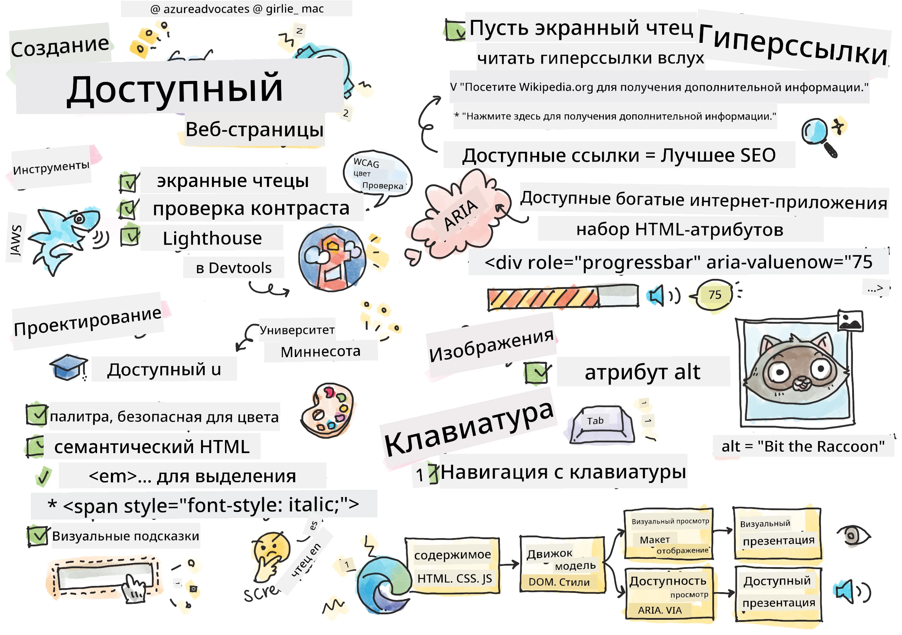
> Скетчноут от [Tomomi Imura](https://twitter.com/girlie_mac)

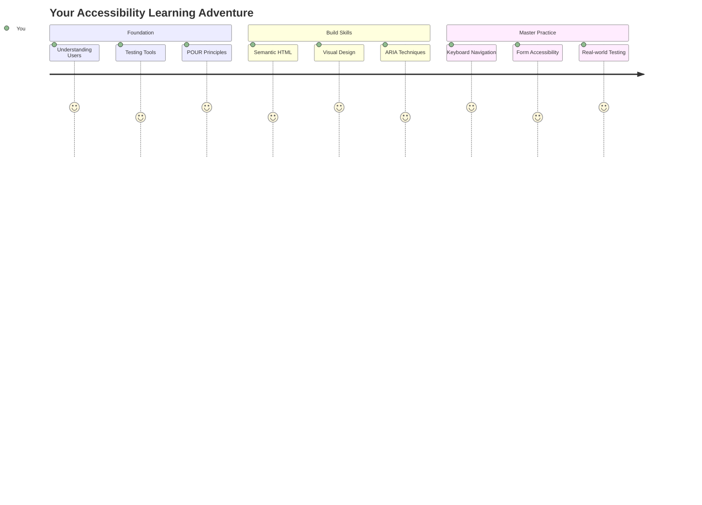

## Викторина перед лекцией
[Викторина перед лекцией](https://ff-quizzes.netlify.app/web/)

> Сила Интернета заключается в его универсальности. Доступ для всех, независимо от ограничений, является важным аспектом.
>
> \- Сэр Тимоти Бернерс-Ли, директор W3C и изобретатель Всемирной паутины

Вот что может вас удивить: создавая доступные веб-сайты, вы помогаете не только людям с ограниченными возможностями, но и делаете Интернет лучше для всех!

Вы когда-нибудь замечали пандусы на углах улиц? Они изначально были разработаны для инвалидных колясок, но теперь помогают людям с детскими колясками, курьерам с тележками, путешественникам с чемоданами на колесах и даже велосипедистам. Именно так работает доступный веб-дизайн — решения, которые помогают одной группе, часто оказываются полезными для всех. Здорово, правда?

В этом уроке мы изучим, как создавать веб-сайты, которые действительно подходят для всех, независимо от того, как они пользуются Интернетом. Вы узнаете практические техники, которые уже встроены в веб-стандарты, попробуете инструменты тестирования и увидите, как доступность делает ваши сайты более удобными для всех пользователей.

К концу урока вы будете уверенно включать доступность в свой рабочий процесс разработки. Готовы узнать, как продуманные дизайнерские решения могут открыть Интернет для миллиардов пользователей? Давайте начнем!

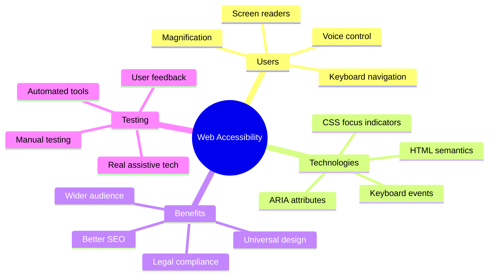

> Вы можете пройти этот урок на [Microsoft Learn](https://docs.microsoft.com/learn/modules/web-development-101/accessibility/?WT.mc_id=academic-77807-sagibbon)!

## Понимание вспомогательных технологий

Прежде чем мы перейдем к кодированию, давайте немного разберемся, как люди с различными возможностями на самом деле взаимодействуют с Интернетом. Это не просто теория — понимание реальных моделей навигации сделает вас гораздо лучшим разработчиком!

Вспомогательные технологии — это удивительные инструменты, которые помогают людям с ограниченными возможностями взаимодействовать с веб-сайтами так, как вы даже не могли себе представить. Как только вы поймете, как работают эти технологии, создание доступных веб-опытов станет гораздо более интуитивным. Это как научиться видеть свой код глазами другого человека.

### Читатели экрана

[Читатели экрана](https://en.wikipedia.org/wiki/Screen_reader) — это довольно сложные технологии, которые преобразуют цифровой текст в речь или вывод на шрифт Брайля. Хотя они в основном используются людьми с нарушениями зрения, они также очень полезны для пользователей с нарушениями обучения, такими как дислексия.

Я люблю думать о читателе экрана как о очень умном рассказчике, который читает вам книгу. Он читает контент вслух в логическом порядке, объявляет интерактивные элементы, такие как «кнопка» или «ссылка», и предоставляет клавиатурные сокращения для перемещения по странице. Но вот в чем дело — читатели экрана могут работать только если мы создаем веб-сайты с правильной структурой и содержательным контентом. Здесь вы вступаете в игру как разработчик!

**Популярные читатели экрана на разных платформах:**
- **Windows**: [NVDA](https://www.nvaccess.org/about-nvda/) (бесплатный и самый популярный), [JAWS](https://webaim.org/articles/jaws/), [Narrator](https://support.microsoft.com/windows/complete-guide-to-narrator-e4397a0d-ef4f-b386-d8ae-c172f109bdb1/?WT.mc_id=academic-77807-sagibbon) (встроенный)
- **macOS/iOS**: [VoiceOver](https://support.apple.com/guide/voiceover/welcome/10) (встроенный и очень функциональный)
- **Android**: [TalkBack](https://support.google.com/accessibility/android/answer/6283677) (встроенный)
- **Linux**: [Orca](https://wiki.gnome.org/Projects/Orca) (бесплатный и с открытым исходным кодом)

**Как читатели экрана взаимодействуют с веб-контентом:**

Читатели экрана предоставляют несколько методов навигации, которые делают просмотр эффективным для опытных пользователей:
- **Последовательное чтение**: Читает контент сверху вниз, как при чтении книги
- **Навигация по ориентирам**: Перемещение между разделами страницы (заголовок, навигация, основной контент, подвал)
- **Навигация по заголовкам**: Перемещение между заголовками для понимания структуры страницы
- **Списки ссылок**: Генерация списка всех ссылок для быстрого доступа
- **Элементы управления формами**: Перемещение непосредственно между полями ввода и кнопками

> 💡 **Вот что меня удивило**: 68% пользователей читателей экрана в основном ориентируются по заголовкам ([WebAIM Survey](https://webaim.org/projects/screenreadersurvey9/#finding)). Это означает, что ваша структура заголовков — это как дорожная карта для пользователей. Если вы сделаете ее правильно, вы буквально помогаете людям быстрее находить нужный контент!

### Построение рабочего процесса тестирования

Хорошая новость — эффективное тестирование доступности не обязательно должно быть сложным! Вам нужно будет сочетать автоматизированные инструменты (они отлично выявляют очевидные проблемы) с ручным тестированием. Вот систематический подход, который, как я обнаружил, позволяет выявить большинство проблем, не занимая весь ваш день:

**Основной рабочий процесс ручного тестирования:**

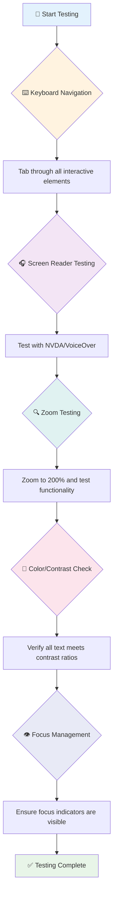

**Пошаговый контрольный список тестирования:**
1. **Навигация с клавиатуры**: Используйте только Tab, Shift+Tab, Enter, Space и клавиши со стрелками
2. **Тестирование с читателем экрана**: Включите NVDA, VoiceOver или Narrator и попробуйте навигацию с закрытыми глазами
3. **Тестирование увеличения**: Проверьте на уровнях увеличения 200% и 400%
4. **Проверка контраста цветов**: Проверьте весь текст и элементы интерфейса
5. **Тестирование индикатора фокуса**: Убедитесь, что все интерактивные элементы имеют видимые состояния фокуса

✅ **Начните с Lighthouse**: Откройте инструменты разработчика в браузере, выполните аудит доступности с помощью Lighthouse, а затем используйте результаты для определения областей ручного тестирования.

### Инструменты увеличения и масштабирования

Вы знаете, как иногда увеличиваете текст на телефоне, если он слишком мелкий, или щуритесь на экране ноутбука при ярком солнечном свете? Многие пользователи ежедневно полагаются на инструменты увеличения, чтобы сделать контент читаемым. Это включает людей с нарушениями зрения, пожилых людей и всех, кто когда-либо пытался читать сайт на улице.

Современные технологии увеличения вышли за рамки простого увеличения. Понимание того, как работают эти инструменты, поможет вам создавать адаптивные дизайны, которые остаются функциональными и привлекательными на любом уровне увеличения.

**Современные возможности увеличения в браузерах:**
- **Увеличение страницы**: Пропорционально масштабирует весь контент (текст, изображения, макет) — это предпочтительный метод
- **Только текст**: Увеличивает размер шрифта, сохраняя исходный макет
- **Увеличение с помощью жестов**: Поддержка мобильных устройств для временного увеличения
- **Поддержка браузеров**: Все современные браузеры поддерживают увеличение до 500% без нарушения функциональности

**Специализированное программное обеспечение для увеличения:**
- **Windows**: [Magnifier](https://support.microsoft.com/windows/use-magnifier-to-make-things-on-the-screen-easier-to-see-414948ba-8b1c-d3bd-8615-0e5e32204198) (встроенный), [ZoomText](https://www.freedomscientific.com/training/zoomtext/getting-started/)
- **macOS/iOS**: [Zoom](https://www.apple.com/accessibility/mac/vision/) (встроенный с расширенными функциями)

> ⚠️ **Дизайнерское соображение**: WCAG требует, чтобы контент оставался функциональным при увеличении до 200%. На этом уровне горизонтальная прокрутка должна быть минимальной, а все интерактивные элементы должны оставаться доступными.

✅ **Проверьте свой адаптивный дизайн**: Увеличьте браузер до 200% и 400%. Адаптируется ли ваш макет? Можно ли по-прежнему пользоваться всеми функциями без чрезмерной прокрутки?

## Современные инструменты тестирования доступности

Теперь, когда вы понимаете, как люди взаимодействуют с Интернетом с помощью вспомогательных технологий, давайте изучим инструменты, которые помогут вам создавать и тестировать доступные веб-сайты.

Думайте об этом так: автоматизированные инструменты отлично выявляют очевидные проблемы (например, отсутствие альтернативного текста), а ручное тестирование помогает убедиться, что ваш сайт удобен в реальном использовании. Вместе они дают уверенность, что ваши сайты работают для всех.

### Тестирование контраста цветов

Вот хорошая новость: контраст цветов — одна из самых распространенных проблем доступности, но она также одна из самых простых для исправления. Хороший контраст полезен для всех — от пользователей с нарушениями зрения до людей, пытающихся читать свои телефоны на пляже.

**Требования WCAG к контрасту:**

| Тип текста | WCAG AA (минимум) | WCAG AAA (улучшенный) |
|-----------|-------------------|---------------------|
| **Обычный текст** (менее 18pt) | Контрастное соотношение 4.5:1 | Контрастное соотношение 7:1 |
| **Крупный текст** (18pt+ или 14pt+ жирный) | Контрастное соотношение 3:1 | Контрастное соотношение 4.5:1 |
| **Элементы интерфейса** (кнопки, границы форм) | Контрастное соотношение 3:1 | Контрастное соотношение 3:1 |

**Основные инструменты тестирования:**
- [Colour Contrast Analyser](https://www.tpgi.com/color-contrast-checker/) — настольное приложение с выбором цвета
- [WebAIM Contrast Checker](https://webaim.org/resources/contrastchecker/) — веб-приложение с мгновенной обратной связью
- [Stark](https://www.getstark.co/) — плагин для инструментов дизайна Figma, Sketch, Adobe XD
- [Accessible Colors](https://accessible-colors.com/) — поиск доступных цветовых палитр

✅ **Создавайте лучшие цветовые палитры**: Начните с цветов вашего бренда и используйте проверку контраста для создания доступных вариаций. Документируйте их как доступные цветовые токены вашей системы дизайна.

### Комплексный аудит доступности

Наиболее эффективное тестирование доступности сочетает несколько подходов. Ни один инструмент не выявляет все проблемы, поэтому создание рутины тестирования с использованием различных методов обеспечивает тщательную проверку.

**Тестирование в браузере (встроено в инструменты разработчика):**
- **Chrome/Edge**: Аудит доступности Lighthouse + панель доступности
- **Firefox**: Инспектор доступности с подробным представлением дерева
- **Safari**: Вкладка аудита в Web Inspector с симуляцией VoiceOver

**Профессиональные расширения для тестирования:**
- [axe DevTools](https://www.deque.com/axe/devtools/) — стандарт автоматизированного тестирования в отрасли
- [WAVE](https://wave.webaim.org/extension/) — визуальная обратная связь с выделением ошибок
- [Accessibility Insights](https://accessibilityinsights.io/) — комплексный набор инструментов тестирования от Microsoft

**Интеграция командной строки и CI/CD:**
- [axe-core](https://github.com/dequelabs/axe-core) — библиотека JavaScript для автоматизированного тестирования
- [Pa11y](https://pa11y.org/) — инструмент тестирования доступности командной строки
- [Lighthouse CI](https://github.com/GoogleChrome/lighthouse-ci) — автоматизированная оценка доступности

> 🎯 **Цель тестирования**: Стремитесь к оценке доступности Lighthouse 95+ в качестве базового уровня. Помните, что автоматизированные инструменты выявляют только около 30-40% проблем доступности — ручное тестирование по-прежнему необходимо!

### 🧠 **Проверка навыков тестирования: готовы искать проблемы?**

**Давайте проверим, как вы относитесь к тестированию доступности:**
- Какой метод тестирования кажется вам наиболее доступным на данный момент?
- Можете ли вы представить себе использование только клавиатуры для навигации в течение целого дня?
- С какой проблемой доступности вы лично сталкивались в Интернете?

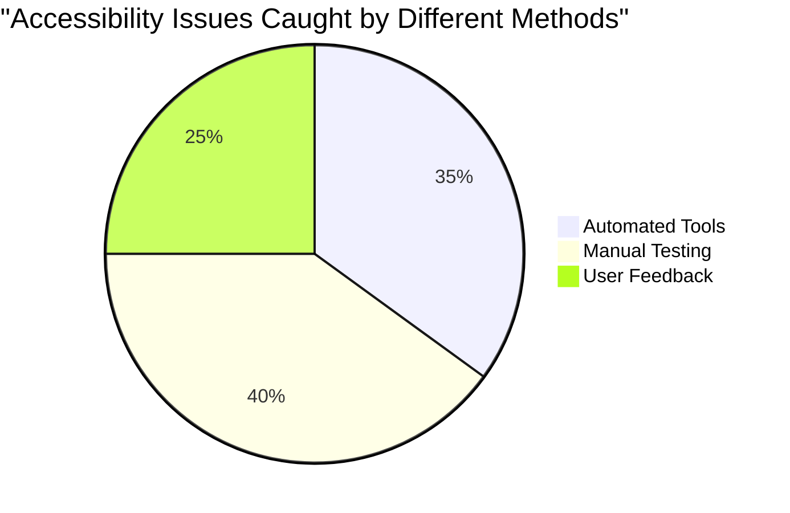

> **Уверенность**: Профессиональные тестировщики доступности используют именно эту комбинацию методов. Вы изучаете практики, принятые в отрасли!

## Создание доступности с самого начала

Ключ к успеху в обеспечении доступности — это включение ее в основу с самого начала. Знаю, заманчиво думать: «Я добавлю доступность позже», но это все равно, что пытаться добавить пандус к дому после его постройки. Возможно? Да. Легко? Не совсем.

Думайте о доступности как о планировании дома — гораздо проще включить доступность для инвалидных колясок в первоначальные архитектурные планы, чем переделывать все позже.

### Принципы POUR: основа вашей доступности

Руководство по доступности веб-контента (WCAG) основано на четырех основных принципах, которые образуют аббревиатуру POUR. Не переживайте — это не скучные академические концепции! На самом деле, это практические рекомендации для создания контента, который подходит всем.

Как только вы освоите принципы POUR, принятие решений о доступности станет гораздо более интуитивным. Это как иметь мысленный контрольный список, который направляет ваши дизайнерские решения. Давайте разберем их:

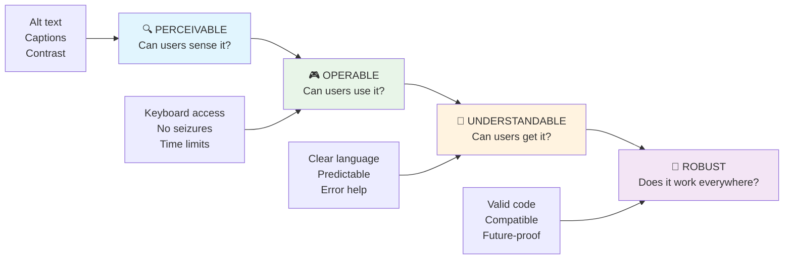

**🔍 Воспринимаемость**: Информация должна быть представлена так, чтобы пользователи могли воспринимать ее через доступные им органы чувств

- Предоставляйте текстовые альтернативы для нетекстового контента (изображения, видео, аудио)
- Обеспечивайте достаточный контраст цветов для всего текста и элементов интерфейса
- Предлагайте субтитры и расшифровки для мультимедийного контента
- Разрабатывайте контент, который остается функциональным при увеличении до 200%
- Используйте несколько сенсорных характеристик (не только цвет) для передачи информации

**🎮 Оперативность**: Все элементы интерфейса должны быть доступны через доступные методы ввода

- Сделайте всю функциональность доступной через навигацию с клавиатуры
- Предоставьте пользователям достаточно времени для чтения и взаимодействия с контентом
- Избегайте контента, вызывающего приступы или вестибулярные расстройства
- Помогайте пользователям эффективно ориентироваться с помощью четкой структуры и ориентиров
- Убедитесь, что интерактивные элементы имеют достаточные размеры (минимум 44px)

**📖 Понятность**: Информация и работа интерфейса должны быть ясными и понятными

- Используйте четкий, простой язык, подходящий для вашей аудитории
- Убедитесь, что контент отображается и работает предсказуемо и последовательно
- Предоставляйте четкие инструкции и сообщения об ошибках для ввода данных пользователем
- Помогайте пользователям понимать и исправлять ошибки в формах
- Организуйте контент с логическим порядком чтения и иерархией информации

**💪 Надежность**: Контент должен работать надежно на разных технологиях и вспомогательных устройствах

- **Используйте валидный, семантический HTML как основу**
- **Обеспечьте совместимость с текущими и будущими вспомогательными технологиями**
- **Следуйте веб-стандартам и лучшим практикам разметки**
- **Тестируйте на разных браузерах, устройствах и вспомогательных средствах**
- **Структурируйте контент так, чтобы он оставался доступным, даже если продвинутые функции не поддерживаются**

### 🎯 **Проверка принципов POUR: Закрепляем материал**

**Краткое размышление о базовых принципах:**
- Можете ли вы вспомнить функцию веб-сайта, которая нарушает каждый из принципов POUR?
- Какой принцип кажется вам наиболее естественным как разработчику?
- Как эти принципы могут улучшить дизайн для всех, а не только для пользователей с ограниченными возможностями?

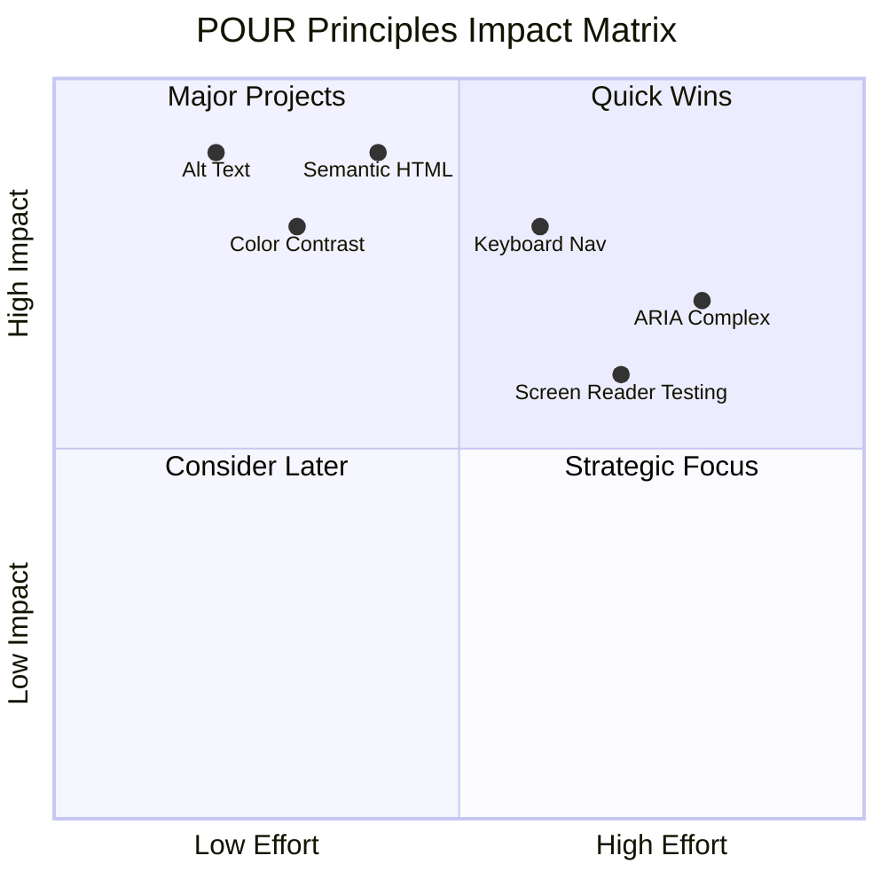

> **Помните**: Начинайте с улучшений, которые требуют минимальных усилий, но дают максимальный эффект. Семантический HTML и текстовые описания (alt text) обеспечивают наибольший прирост доступности при минимальных затратах!

## Создание доступного визуального дизайна

Хороший визуальный дизайн и доступность идут рука об руку. Когда вы проектируете с учетом доступности, часто оказывается, что эти ограничения приводят к более чистым и элегантным решениям, которые полезны для всех пользователей.

Давайте рассмотрим, как создавать визуально привлекательные дизайны, которые подходят всем, независимо от их зрительных способностей или условий, в которых они просматривают ваш контент.

### Стратегии цветового и визуального дизайна

Цвет — мощный инструмент коммуникации, но он никогда не должен быть единственным способом передачи важной информации. Дизайн, выходящий за рамки использования цвета, создает более надежные и инклюзивные впечатления, которые работают в любых ситуациях.

**Дизайн с учетом различий в цветовом восприятии:**

Примерно 8% мужчин и 0,5% женщин имеют какие-либо нарушения цветового восприятия (часто называемые "цветовой слепотой"). Наиболее распространенные типы:
- **Дейтеранопия**: Трудности в различении красного и зеленого
- **Протанопия**: Красный цвет кажется более тусклым
- **Тританопия**: Трудности с синим и желтым (редко)

**Инклюзивные стратегии использования цвета:**

```css
/* ❌ Bad: Using only color to indicate status */
.error { color: red; }
.success { color: green; }

/* ✅ Good: Color plus icons and context */
.error {
  color: #d32f2f;
  border-left: 4px solid #d32f2f;
}
.error::before {
  content: "⚠️";
  margin-right: 8px;
}

.success {
  color: #2e7d32;
  border-left: 4px solid #2e7d32;
}
.success::before {
  content: "✅";
  margin-right: 8px;
}
```

**За пределами базовых требований к контрасту:**
- Тестируйте свои цветовые решения с помощью симуляторов цветовой слепоты
- Используйте узоры, текстуры или формы вместе с цветовой кодировкой
- Убедитесь, что интерактивные состояния остаются различимыми без использования цвета
- Проверьте, как ваш дизайн выглядит в режиме высокого контраста

✅ **Проверьте доступность цветов**: Используйте инструменты, такие как [Coblis](https://www.color-blindness.com/coblis-color-blindness-simulator/), чтобы увидеть, как ваш сайт выглядит для пользователей с различными типами цветового восприятия.

### Индикаторы фокуса и дизайн взаимодействия

Индикаторы фокуса — это цифровой эквивалент курсора, который показывает пользователям клавиатуры, где они находятся на странице. Хорошо разработанные индикаторы фокуса улучшают взаимодействие для всех, делая его понятным и предсказуемым.

**Современные лучшие практики для индикаторов фокуса:**

```css
/* Enhanced focus styles that work across browsers */
button:focus-visible {
  outline: 2px solid #0066cc;
  outline-offset: 2px;
  box-shadow: 0 0 0 4px rgba(0, 102, 204, 0.25);
}

/* Remove focus outline for mouse users, preserve for keyboard users */
button:focus:not(:focus-visible) {
  outline: none;
}

/* Focus-within for complex components */
.card:focus-within {
  box-shadow: 0 0 0 3px rgba(74, 144, 164, 0.5);
  border-color: #4A90A4;
}

/* Ensure focus indicators meet contrast requirements */
.custom-focus:focus-visible {
  outline: 3px solid #ffffff;
  outline-offset: 2px;
  box-shadow: 0 0 0 6px #000000;
}
```

**Требования к индикаторам фокуса:**
- **Видимость**: Должен иметь контрастность не менее 3:1 с окружающими элементами
- **Ширина**: Минимальная толщина 2px вокруг всего элемента
- **Сохранение**: Должен оставаться видимым, пока фокус не переместится
- **Различие**: Должен визуально отличаться от других состояний интерфейса

> 💡 **Совет по дизайну**: Отличные индикаторы фокуса часто используют комбинацию обводки, теней и изменения цвета для обеспечения видимости на разных фонах и в разных контекстах.

✅ **Проверьте индикаторы фокуса**: Перемещайтесь по вашему сайту с помощью клавиши Tab и отметьте элементы с четкими индикаторами фокуса. Есть ли элементы, которые трудно увидеть или которые полностью отсутствуют?

### Семантический HTML: основа доступности

Семантический HTML — это как GPS для вспомогательных технологий на вашем сайте. Используя правильные HTML-элементы для их предназначения, вы предоставляете экранным считывателям, клавиатурам и другим инструментам подробную карту для эффективной навигации.

Вот аналогия, которая мне действительно помогла: семантический HTML — это разница между хорошо организованной библиотекой с четкими категориями и полезными указателями и складом, где книги разбросаны случайным образом. В обоих местах есть одни и те же книги, но где вы предпочли бы искать что-то? Именно!

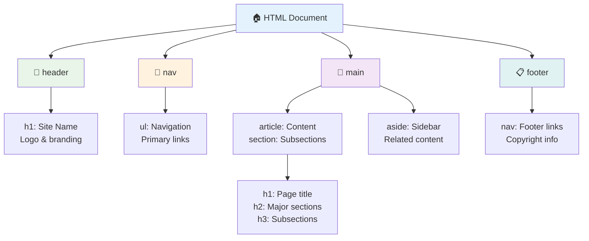

**Основные элементы структуры доступной страницы:**

```html
<!-- Landmark elements provide page navigation structure -->
<header>
  <h1>Your Site Name</h1>
  <nav aria-label="Main navigation">
    <ul>
      <li><a href="/home">Home</a></li>
      <li><a href="/about">About</a></li>
      <li><a href="/services">Services</a></li>
    </ul>
  </nav>
</header>

<main>
  <article>
    <header>
      <h1>Article Title</h1>
      <p>Published on <time datetime="2024-10-14">October 14, 2024</time></p>
    </header>
    
    <section>
      <h2>First Section</h2>
      <p>Content that relates to this section...</p>
    </section>
    
    <section>
      <h2>Second Section</h2>
      <p>More related content...</p>
    </section>
  </article>
  
  <aside>
    <h2>Related Links</h2>
    <nav aria-label="Related articles">
      <ul>
        <li><a href="/related-1">First related article</a></li>
        <li><a href="/related-2">Second related article</a></li>
      </ul>
    </nav>
  </aside>
</main>

<footer>
  <p>&copy; 2024 Your Site Name. All rights reserved.</p>
  <nav aria-label="Footer links">
    <ul>
      <li><a href="/privacy">Privacy Policy</a></li>
      <li><a href="/contact">Contact Us</a></li>
    </ul>
  </nav>
</footer>
```

**Почему семантический HTML трансформирует доступность:**

| Семантический элемент | Назначение | Преимущества для экранных считывателей |
|-----------------------|------------|---------------------------------------|
| `<header>` | Заголовок страницы или раздела | "Область баннера" - быстрая навигация к началу |
| `<nav>` | Навигационные ссылки | "Область навигации" - список разделов навигации |
| `<main>` | Основной контент страницы | "Область основного контента" - переход прямо к содержимому |
| `<article>` | Самостоятельный контент | Обозначает границы статьи |
| `<section>` | Группы тематического контента | Обеспечивает структуру контента |
| `<aside>` | Связанный контент боковой панели | "Дополнительная область" |
| `<footer>` | Нижний колонтитул страницы или раздела | "Область информации о содержимом" |

**Суперспособности экранных считывателей с семантическим HTML:**
- **Навигация по областям**: Мгновенный переход между основными разделами страницы
- **Контур заголовков**: Генерация оглавления из структуры заголовков
- **Списки элементов**: Создание списков всех ссылок, кнопок или элементов формы
- **Осознание контекста**: Понимание связей между разделами контента

> 🎯 **Быстрый тест**: Попробуйте навигацию по вашему сайту с помощью экранного считывателя, используя сокращения для областей (D для области, H для заголовка, K для ссылки в NVDA/JAWS). Логична ли навигация?

### 🏗️ **Проверка мастерства семантического HTML: Создание прочных основ**

**Оценим ваше понимание семантики:**
- Можете ли вы определить области на веб-странице, просто взглянув на HTML?
- Как бы вы объяснили разницу между `<section>` и `<div>` другу?
- Что вы проверите в первую очередь, если пользователь экранного считывателя сообщит о проблемах с навигацией?

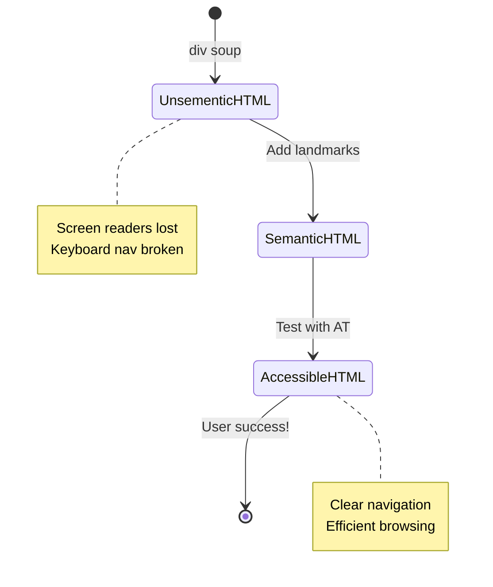

> **Совет профессионала**: Хороший семантический HTML автоматически решает около 70% проблем с доступностью. Освойте эту основу, и вы будете на верном пути!

✅ **Проверьте свою семантическую структуру**: Используйте панель доступности в инструментах разработчика вашего браузера, чтобы просмотреть дерево доступности и убедиться, что ваша разметка создает логическую структуру.

### Иерархия заголовков: создание логического контура контента

Заголовки абсолютно необходимы для доступного контента — они как позвоночник, который все держит вместе. Пользователи экранных считывателей сильно зависят от заголовков, чтобы понять и навигировать ваш контент. Представьте, что это как предоставление оглавления для вашей страницы.

**Золотое правило для заголовков:**
Никогда не пропускайте уровни. Всегда двигайтесь логически от `<h1>` к `<h2>` к `<h3>` и так далее. Помните, как вы делали планы в школе? Это тот же принцип — вы бы не перескакивали с "I. Основной пункт" сразу на "C. Подподпункт", минуя "A. Подпункт", верно?

**Пример идеальной структуры заголовков:**

```html
<!-- ✅ Excellent: Logical, hierarchical progression -->
<main>
  <h1>Complete Guide to Web Accessibility</h1>
  
  <section>
    <h2>Understanding Screen Readers</h2>
    <p>Introduction to screen reader technology...</p>
    
    <h3>Popular Screen Reader Software</h3>
    <p>NVDA, JAWS, and VoiceOver comparison...</p>
    
    <h3>Testing with Screen Readers</h3>
    <p>Step-by-step testing instructions...</p>
  </section>
  
  <section>
    <h2>Color and Contrast Guidelines</h2>
    <p>Designing with sufficient contrast...</p>
    
    <h3>WCAG Contrast Requirements</h3>
    <p>Understanding the different contrast levels...</p>
    
    <h3>Testing Tools and Techniques</h3>
    <p>Tools for verifying contrast ratios...</p>
  </section>
</main>
```

```html
<!-- ❌ Problematic: Skipping levels, inconsistent structure -->
<h1>Page Title</h1>
<h3>Subsection</h3> <!-- Skipped h2 -->
<h2>This should come before h3</h2>
<h1>Another main heading?</h1> <!-- Multiple h1s -->
```

**Лучшие практики для заголовков:**
- **Один `<h1>` на страницу**: Обычно это главный заголовок страницы или основного контента
- **Логическая последовательность**: Никогда не пропускайте уровни (h1 → h2 → h3, а не h1 → h3)
- **Описательный контент**: Заголовки должны быть понятными вне контекста
- **Визуальное оформление с помощью CSS**: Используйте CSS для внешнего вида, а уровни HTML для структуры

**Статистика навигации экранных считывателей:**
- 68% пользователей экранных считывателей используют заголовки для навигации ([WebAIM Survey](https://webaim.org/projects/screenreadersurvey9/#finding))
- Пользователи ожидают найти логичную структуру заголовков
- Заголовки обеспечивают самый быстрый способ понять структуру страницы

> 💡 **Совет профессионала**: Используйте расширения браузера, такие как "HeadingsMap", чтобы визуализировать структуру заголовков. Она должна читаться как хорошо организованное оглавление.

✅ **Проверьте структуру заголовков**: Используйте навигацию по заголовкам экранного считывателя (клавиша H в NVDA), чтобы перемещаться по заголовкам. Логично ли их расположение?

### Продвинутые техники визуальной доступности

Помимо базовых принципов контраста и цвета, существуют сложные методы, которые помогают создавать действительно инклюзивные визуальные впечатления. Эти методы обеспечивают работу вашего контента в различных условиях просмотра и с использованием вспомогательных технологий.

**Основные стратегии визуальной коммуникации:**

- **Мультимодальная обратная связь**: Сочетание визуальных, текстовых и иногда аудиоподсказок
- **Постепенное раскрытие информации**: Представление информации небольшими порциями
- **Последовательные шаблоны взаимодействия**: Использование знакомых конвенций пользовательского интерфейса
- **Адаптивная типографика**: Масштабирование текста для разных устройств
- **Состояния загрузки и ошибок**: Предоставление четкой обратной связи для всех действий пользователя

**CSS-утилиты для улучшенной доступности:**

```css
/* Screen reader only text - visually hidden but accessible */
.sr-only {
  position: absolute;
  width: 1px;
  height: 1px;
  padding: 0;
  margin: -1px;
  overflow: hidden;
  clip: rect(0, 0, 0, 0);
  white-space: nowrap;
  border: 0;
}

/* Skip link for keyboard navigation */
.skip-link {
  position: absolute;
  top: -40px;
  left: 6px;
  background: #000000;
  color: #ffffff;
  padding: 8px 16px;
  text-decoration: none;
  border-radius: 4px;
  font-weight: bold;
  transition: top 0.3s ease;
  z-index: 1000;
}

.skip-link:focus {
  top: 6px;
}

/* Reduced motion respect */
@media (prefers-reduced-motion: reduce) {
  .skip-link {
    transition: none;
  }
  
  * {
    animation-duration: 0.01ms !important;
    animation-iteration-count: 1 !important;
    transition-duration: 0.01ms !important;
  }
}

/* High contrast mode support */
@media (prefers-contrast: high) {
  .button {
    border: 2px solid;
  }
}
```

> 🎯 **Шаблон доступности**: "Ссылка для пропуска" необходима для пользователей клавиатуры. Она должна быть первым фокусируемым элементом на вашей странице и позволять перейти прямо к основному контенту.

✅ **Реализуйте пропуск навигации**: Добавьте ссылки для пропуска на ваши страницы и протестируйте их, нажав Tab сразу после загрузки страницы. Они должны появляться и позволять перейти к основному контенту.

## Создание значимого текста ссылок

Ссылки — это, по сути, магистрали интернета, но плохо написанный текст ссылок — это как дорожные знаки, на которых написано просто "Место", вместо "Центр Чикаго". Не очень полезно, правда?

Вот что меня удивило, когда я впервые узнал об этом: экранные считыватели могут извлечь все ссылки с страницы и показать их в виде одного большого списка. Представьте, что вам дали каталог всех ссылок на вашей странице. Будет ли каждая из них понятна сама по себе? Это тест, который должен пройти ваш текст ссылок!

### Понимание паттернов навигации по ссылкам

Экранные считыватели предлагают мощные функции навигации по ссылкам, которые зависят от хорошо написанного текста ссылок:

**Методы навигации по ссылкам:**
- **Последовательное чтение**: Ссылки читаются в контексте как часть потока контента
- **Генерация списка ссылок**: Все ссылки страницы собираются в поисковый каталог
- **Быстрая навигация**: Переход между ссылками с помощью горячих клавиш (K в NVDA)
- **Функция поиска**: Поиск конкретных ссылок по частичному тексту

**Почему контекст важен:**
Когда пользователи экранных считывателей создают список ссылок, они видят что-то вроде этого:
- "Скачать отчет"
- "Узнать больше"
- "Нажмите здесь"
- "Политика конфиденциальности"
- "Нажмите здесь"

Только две из этих ссылок предоставляют полезную информацию вне контекста!

> 📊 **Влияние на пользователя**: Пользователи экранных считывателей просматривают списки ссылок, чтобы быстро понять содержание страницы. Общий текст ссылок заставляет их возвращаться к контексту каждой ссылки, значительно замедляя процесс просмотра.

### Распространенные ошибки в тексте ссылок, которых следует избегать

Понимание того, что не работает, помогает распознать и исправить проблемы доступности в существующем контенте.

**❌ Общий текст ссылок, не предоставляющий контекста:**

```html
<!-- Meaningless when read from a link list -->
<p>Our sustainability efforts are detailed in our recent report. 
   <a href="/sustainability-2024.pdf">Click here</a> to view it.</p>

<!-- Repeated generic text throughout the page -->
<div class="article-card">
  <h3>Web Accessibility Guide</h3>
  <p>Learn the fundamentals...</p>
  <a href="/accessibility-guide">Read more</a>
</div>
<div class="article-card">
  <h3>Color Contrast Tips</h3>
  <p>Improve your design...</p>
  <a href="/color-contrast">Read more</a>
</div>

<!-- URLs as link text (difficult for screen readers to announce) -->
<p>Visit https://www.w3.org/WAI/WCAG21/quickref/ for WCAG guidelines.</p>

<!-- Vague action words -->
<a href="/contact">Go</a> | <a href="/about">See</a> | <a href="/help">View</a>
```

**Почему эти шаблоны не работают:**
- **"Нажмите здесь"** ничего не говорит пользователю о назначении ссылки
- **"Узнать больше"**, повторяющееся несколько раз, вызывает путаницу
- **Сырые URL** трудно произносить экранным считывателям
- **Одиночные слова**, такие как "Перейти" или "Смотреть", не имеют описательного контекста

### Написание отличного текста ссылок

Описательный текст ссылок полезен всем — пользователи с нормальным зрением могут быстро просканировать ссылки, а пользователи экранных считывателей сразу понимают назначения.

**✅ Примеры четкого, описательного текста ссылок:**

```html
<!-- Descriptive text that explains the destination -->
<p>Our comprehensive <a href="/sustainability-2024.pdf">2024 sustainability report (PDF, 2.1MB)</a> details our environmental initiatives.</p>

<!-- Specific, unique link text for each card -->
<div class="article-card">
  <h3>Web Accessibility Guide</h3>
  <p>Learn the fundamentals of inclusive design...</p>
  <a href="/accessibility-guide">Read our complete web accessibility guide</a>
</div>
<div class="article-card">
  <h3>Color Contrast Tips</h3>
  <p>Improve your design with better color choices...</p>
  <a href="/color-contrast">Explore color contrast best practices</a>
</div>

<!-- Meaningful text instead of raw URLs -->
<p>The <a href="https://www.w3.org/WAI/WCAG21/quickref/">WCAG 2.1 Quick Reference guide</a> provides comprehensive accessibility guidelines.</p>

<!-- Descriptive action links -->
<a href="/contact">Contact our support team</a> | 
<a href="/about">About our company</a> | 
<a href="/help">Get help with your account</a>
```

**Лучшие практики текста ссылок:**
- **Будьте конкретными**: "Скачать квартальный финансовый отчет" вместо "Скачать"
- **Указывайте тип файла и размер**: "(PDF, 1.2MB)" для загружаемых файлов
- **Упоминайте, если ссылки открываются внешне**: "(открывается в новом окне)" при необходимости
- **Используйте активный язык**: "Свяжитесь с нами" вместо "Страница контактов"
- **Сохраняйте краткость**: Стремитесь к 2-8 словам, если это возможно

### Продвинутые паттерны доступности ссылок

Иногда ограничения визуального дизайна или технические требования требуют особых решений. Вот сложные техники для распространенных сложных сценариев:

**Использование ARIA для улучшенного контекста:**

```html
<!-- When button text must be short but needs more context -->
<a href="/report.pdf" 
   aria-label="Download 2024 annual financial report, PDF format, 2.3MB">
  Download Report
</a>

<!-- When the full context comes from surrounding content -->
<h3 id="sustainability-heading">Sustainability Initiative</h3>
<p>Our efforts to reduce environmental impact...</p>
<a href="/sustainability-details" 
   aria-labelledby="sustainability-heading"
   aria-describedby="sustainability-summary">
  Learn more
</a>
<p id="sustainability-summary">Detailed breakdown of our 2024 environmental goals and achievements</p>
```

**Указание типов файлов и внешних направлений:**

```html
<!-- Method 1: Include information in visible link text -->
<a href="/annual-report.pdf">
  Download our 2024 annual report (PDF, 2.3MB)
</a>

<!-- Method 2: Use screen reader-only text for file details -->
<a href="/annual-report.pdf">
  Download our 2024 annual report
  <span class="sr-only">(PDF format, 2.3MB)</span>
</a>

<!-- Method 3: External link indication -->
<a href="https://example.com" 
   target="_blank" 
   aria-describedby="external-link-warning">
  Visit external resource
</a>
<span id="external-link-warning" class="sr-only">
  (opens in new window)
</span>

<!-- Method 4: Using CSS for visual indicators -->
<a href="https://example.com" class="external-link">
  External resource
</a>
```

```css
/* Visual indicator for external links */
.external-link::after {
  content: " ↗";
  font-size: 0.8em;
  color: #666;
}

/* Screen reader announcement for external links */
.external-link::before {
  content: "External link: ";
  position: absolute;
  left: -10000px;
  width: 1px;
  height: 1px;
  overflow: hidden;
}
```

> ⚠️ **Важно**: При использовании `target="_blank"` всегда информируйте пользователей о том, что ссылка открывается в новом окне или вкладке. Неожиданные изменения навигации могут быть дезориентирующими.

✅ **Проверьте контекст ссылок**: Используйте инструменты разработчика вашего браузера, чтобы создать список всех ссылок на вашей странице. Понятно ли назначение каждой ссылки без окружающего контекста?

## ARIA: Усиление доступности HTML

[Доступные богатые интернет-приложения (ARIA)](https://developer.mozilla.org/docs/Web/Accessibility/ARIA) — это как универсальный переводчик между вашими сложными веб-приложениями и вспомогательными технологиями. Когда HTML сам по себе не может выразить все, что делают ваши интерактивные компоненты, ARIA заполняет эти пробелы.

Я люблю думать о ARIA как о добавлении полезных аннотаций к вашему HTML — как о сценических указаниях в сценарии пьесы, которые помогают актерам понять свои роли и отношения.

**Самое важное правило о ARIA**: Всегда используйте семантический HTML в первую очередь, а затем добавляйте ARIA для его улучшения. Думайте о ARIA как о приправе, а не о главном блюде. Она должна уточнять и улучшать структуру HTML, а не заменять ее. Сначала сделайте правильную основу!

### Стратегическое внедрение ARIA

ARIA мощна, но с большой силой приходит большая ответственность. Неправильное использование ARIA может ухудшить доступность больше, чем ее отсутствие. Вот когда и как использовать ее эффективно:

**✅ Используйте ARIA, когда:**
- Создаете пользовательские интерактивные виджеты (аккордеоны, вкладки, карусели)
- Разрабатываете динамический контент, который изменяется без перезагрузки страницы
- Предоставляете дополнительный контекст для сложных связей в интерфейсе
- Указываете состояния загрузки или обновления живого контента
- Создаете интерфейсы приложений с пользовательскими элементами управления

**❌ Избегайте ARIA, когда:**
- Стандартные HTML-элементы уже предоставляют необходимые семантики
- Вы не уверены, как правильно ее реализовать
- Она дублирует информацию, уже предоставленную семантическим HTML
- Вы не тестировали с реальными вспомогательными технологиями

> 🎯 **Золотое правило ARIA**: "Не изменяйте семантику, если в этом нет крайней необходимости, всегда обеспечивайте доступность с клавиатуры и тестируйте с реальными вспомогательными технологиями."
**Пять категорий ARIA:**

1. **Роли**: Что это за элемент? (`button`, `tab`, `dialog`)
2. **Свойства**: Какие у него характеристики? (`aria-required`, `aria-haspopup`)
3. **Состояния**: Какое у него текущее состояние? (`aria-expanded`, `aria-checked`)
4. **Ориентиры**: Где он находится в структуре страницы? (`banner`, `navigation`, `main`)
5. **Живые регионы**: Как следует объявлять изменения? (`aria-live`, `aria-atomic`)

### Основные шаблоны ARIA для современных веб-приложений

Эти шаблоны решают наиболее распространенные проблемы доступности в интерактивных веб-приложениях:

**Именование и описание элементов:**

```html
<!-- aria-label: Provides accessible name when visible text isn't sufficient -->
<button aria-label="Close newsletter subscription dialog">×</button>

<!-- aria-labelledby: References existing text as the accessible name -->
<section aria-labelledby="news-heading">
  <h2 id="news-heading">Latest News</h2>
  <!-- news content -->
</section>

<!-- aria-describedby: Links to additional descriptive text -->
<input type="password" 
       aria-describedby="pwd-requirements pwd-strength"
       required>
<div id="pwd-requirements">
  Password must contain at least 8 characters, including uppercase, lowercase, and numbers.
</div>
<div id="pwd-strength" aria-live="polite">
  <!-- Dynamic password strength indicator -->
</div>
```

**Живые регионы для динамического контента:**

```html
<!-- Polite announcements (don't interrupt current speech) -->
<div aria-live="polite" id="status-updates">
  <!-- Status messages appear here -->
</div>

<!-- Assertive announcements (interrupt and announce immediately) -->
<div aria-live="assertive" id="urgent-alerts">
  <!-- Error messages and critical alerts -->
</div>

<!-- Loading states with live regions -->
<button id="submit-btn" aria-describedby="loading-status">
  Submit Application
</button>
<div id="loading-status" aria-live="polite" aria-atomic="true">
  <!-- "Processing your application..." appears here -->
</div>
```

**Пример интерактивного виджета (аккордеон):**

```html
<div class="accordion">
  <h3>
    <button aria-expanded="false" 
            aria-controls="panel-1" 
            id="accordion-trigger-1"
            class="accordion-trigger">
      Accessibility Guidelines
    </button>
  </h3>
  <div id="panel-1" 
       role="region"
       aria-labelledby="accordion-trigger-1" 
       hidden>
    <p>WCAG 2.1 provides comprehensive guidelines...</p>
  </div>
</div>
```

```javascript
// JavaScript to manage accordion state
function toggleAccordion(trigger) {
  const panel = document.getElementById(trigger.getAttribute('aria-controls'));
  const isExpanded = trigger.getAttribute('aria-expanded') === 'true';
  
  // Toggle states
  trigger.setAttribute('aria-expanded', !isExpanded);
  panel.hidden = isExpanded;
  
  // Announce change to screen readers
  const status = document.getElementById('status-updates');
  status.textContent = isExpanded ? 'Section collapsed' : 'Section expanded';
}
```

### Лучшие практики реализации ARIA

ARIA обладает мощными возможностями, но требует тщательной реализации. Следование этим рекомендациям поможет гарантировать, что ARIA улучшает, а не ухудшает доступность:

**🛡️ Основные принципы:**

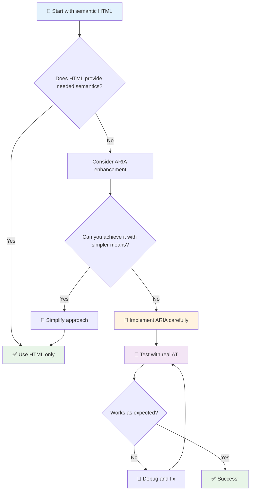

1. **Сначала семантический HTML**: Всегда предпочитайте `<button>` вместо `<div role="button">`
2. **Не нарушайте семантику**: Никогда не переопределяйте существующее значение HTML (избегайте `<h1 role="button">`)
3. **Сохраняйте доступность с клавиатуры**: Все интерактивные элементы ARIA должны быть полностью доступны с клавиатуры
4. **Тестируйте с реальными пользователями**: Поддержка ARIA значительно варьируется между технологиями для людей с ограниченными возможностями
5. **Начинайте с простого**: Сложные реализации ARIA чаще всего содержат ошибки

**🔍 Рабочий процесс тестирования:**

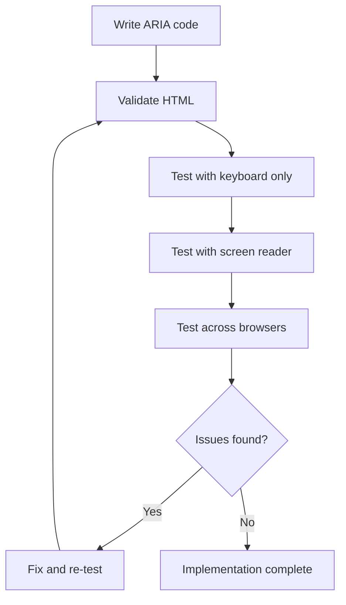

**🚫 Распространенные ошибки ARIA, которых следует избегать:**

- **Противоречивая информация**: Не противоречьте семантике HTML
- **Чрезмерное использование меток**: Слишком много информации ARIA перегружает пользователей
- **Статическая ARIA**: Необновление состояний ARIA при изменении контента
- **Непроверенные реализации**: ARIA, которая работает в теории, но не работает на практике
- **Отсутствие поддержки клавиатуры**: Роли ARIA без соответствующих взаимодействий с клавиатурой

> 💡 **Ресурсы для тестирования**: Используйте инструменты, такие как [accessibility-checker](https://www.npmjs.com/package/accessibility-checker) для автоматической проверки ARIA, но всегда тестируйте с реальными экранными считывателями для полного опыта.

### 🎭 **Проверка навыков ARIA: готовы к сложным взаимодействиям?**

**Оцените свою уверенность в ARIA:**
- Когда вы выберете ARIA вместо семантического HTML? (Подсказка: почти никогда!)
- Можете ли вы объяснить, почему `<div role="button">` обычно хуже, чем `<button>`?
- Что самое важное помнить о тестировании ARIA?

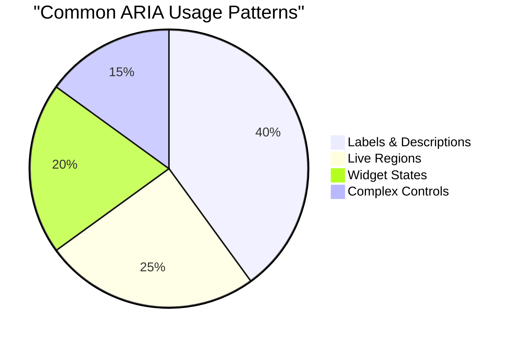

> **Ключевая идея**: Большинство использования ARIA связано с метками и описанием элементов. Сложные шаблоны виджетов встречаются гораздо реже, чем вы думаете!

✅ **Учитесь у экспертов**: Изучите [ARIA Authoring Practices Guide](https://w3c.github.io/aria-practices/) для проверенных шаблонов и реализаций сложных интерактивных виджетов.

## Делаем изображения и медиа доступными

Визуальный и аудиоконтент являются важной частью современных веб-ресурсов, но они могут создавать барьеры, если реализованы небрежно. Цель — обеспечить, чтобы информация и эмоциональное воздействие вашего медиа достигали каждого пользователя. Как только вы освоите это, это станет естественным.

Разные типы медиа требуют разных подходов к доступности. Это как готовка — вы не будете готовить нежную рыбу так же, как сочный стейк. Понимание этих различий помогает выбрать правильное решение для каждой ситуации.

### Стратегическая доступность изображений

Каждое изображение на вашем сайте имеет свою цель. Понимание этой цели помогает писать лучший альтернативный текст и создавать более инклюзивные впечатления.

**Четыре типа изображений и их стратегии для альтернативного текста:**

**Информативные изображения** - передают важную информацию:
```html

```

**Декоративные изображения** - исключительно визуальные, без информационной ценности:
```html

```

**Функциональные изображения** - служат кнопками или элементами управления:
```html
<button>
  
</button>
```

**Сложные изображения** - графики, диаграммы, инфографика:
```html

<div id="chart-description">
  <p>Detailed description: Sales data shows a steady increase across all quarters...</p>
</div>
```

### Доступность видео и аудио

**Требования к видео:**
- **Субтитры**: Текстовая версия устного контента и звуковых эффектов
- **Аудиоописания**: Озвучивание визуальных элементов для незрячих пользователей
- **Транскрипты**: Полный текстовый вариант всего аудио- и видеоконтента

```html
<video controls>
  <source src="video.mp4" type="video/mp4">
  <track kind="captions" src="captions.vtt" srclang="en" label="English">
  <track kind="descriptions" src="descriptions.vtt" srclang="en" label="Audio descriptions">
</video>
```

**Требования к аудио:**
- **Транскрипты**: Текстовая версия всего устного контента
- **Визуальные индикаторы**: Для аудиоконтента предоставьте визуальные подсказки

### Современные техники работы с изображениями

**Использование CSS для декоративных изображений:**
```css
.hero-section {
  background-image: url('decorative-hero.jpg');
  /* Decorative images in CSS don't need alt text */
}
```

**Адаптивные изображения с доступностью:**
```html
<picture>
  <source media="(min-width: 800px)" srcset="large-chart.png">
  <source media="(min-width: 400px)" srcset="medium-chart.png">
  
</picture>
```

✅ **Тестируйте доступность изображений**: Используйте экранный считыватель для навигации по странице с изображениями. Получаете ли вы достаточно информации, чтобы понять контент?

## Навигация с клавиатуры и управление фокусом

Многие пользователи полностью используют клавиатуру для навигации по вебу. Это включает людей с двигательными ограничениями, опытных пользователей, которые считают клавиатуру быстрее мыши, и тех, у кого сломалась мышь. Убедитесь, что ваш сайт хорошо работает с вводом с клавиатуры — это важно и часто делает ваш сайт более удобным для всех.

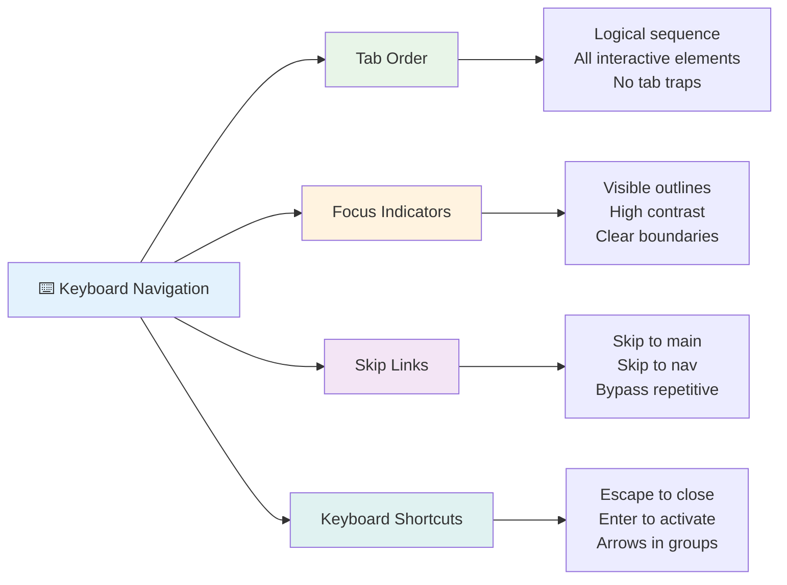

### Основные шаблоны навигации с клавиатуры

**Стандартные взаимодействия с клавиатурой:**
- **Tab**: Перемещение фокуса вперед через интерактивные элементы
- **Shift + Tab**: Перемещение фокуса назад
- **Enter**: Активация кнопок и ссылок
- **Space**: Активация кнопок, установка галочек в чекбоксах
- **Стрелки**: Навигация внутри групп компонентов (радиокнопки, меню)
- **Escape**: Закрытие модальных окон, выпадающих списков или отмена операций

### Лучшие практики управления фокусом

**Видимые индикаторы фокуса:**
```css
/* Ensure focus is always visible */
button:focus-visible {
  outline: 2px solid #4A90A4;
  outline-offset: 2px;
}

/* Custom focus styles for different components */
.card:focus-within {
  box-shadow: 0 0 0 3px rgba(74, 144, 164, 0.5);
}
```

**Ссылки для пропуска для эффективной навигации:**
```html
<a href="#main-content" class="skip-link">Skip to main content</a>
<a href="#navigation" class="skip-link">Skip to navigation</a>

<nav id="navigation">
  <!-- navigation content -->
</nav>
<main id="main-content">
  <!-- main content -->
</main>
```

**Правильный порядок табуляции:**
```html
<!-- Use semantic HTML for natural tab order -->
<form>
  <label for="name">Name:</label>
  <input type="text" id="name" tabindex="0">
  
  <label for="email">Email:</label>
  <input type="email" id="email" tabindex="0">
  
  <button type="submit" tabindex="0">Submit</button>
</form>
```

### Захват фокуса в модальных окнах

При открытии модальных диалогов фокус должен быть захвачен внутри модального окна:

```javascript
// Modern focus trap implementation
function trapFocus(element) {
  const focusableElements = element.querySelectorAll(
    'button, [href], input, select, textarea, [tabindex]:not([tabindex="-1"])'
  );
  
  const firstElement = focusableElements[0];
  const lastElement = focusableElements[focusableElements.length - 1];

  element.addEventListener('keydown', (e) => {
    if (e.key === 'Tab') {
      if (e.shiftKey && document.activeElement === firstElement) {
        e.preventDefault();
        lastElement.focus();
      } else if (!e.shiftKey && document.activeElement === lastElement) {
        e.preventDefault();
        firstElement.focus();
      }
    }
    
    if (e.key === 'Escape') {
      closeModal();
    }
  });
  
  // Focus first element when modal opens
  firstElement.focus();
}
```

✅ **Тестируйте навигацию с клавиатуры**: Попробуйте навигацию по вашему сайту, используя только клавишу Tab. Можете ли вы добраться до всех интерактивных элементов? Логичен ли порядок фокуса? Хорошо ли видны индикаторы фокуса?

## Доступность форм

Формы являются важной частью взаимодействия с пользователем и требуют особого внимания к доступности.

### Ассоциация меток и элементов управления формой

**Каждый элемент управления формой должен иметь метку:**
```html
<!-- Explicit labeling (preferred) -->
<label for="username">Username:</label>
<input type="text" id="username" name="username" required>

<!-- Implicit labeling -->
<label>
  Password:
  <input type="password" name="password" required>
</label>

<!-- Using aria-label when visual label isn't desired -->
<input type="search" aria-label="Search products" placeholder="Search...">
```

### Обработка ошибок и валидация

**Доступные сообщения об ошибках:**
```html
<label for="email">Email Address:</label>
<input type="email" id="email" name="email" 
       aria-describedby="email-error" 
       aria-invalid="true" required>
<div id="email-error" role="alert">
  Please enter a valid email address
</div>
```

**Лучшие практики валидации форм:**
- Используйте `aria-invalid` для указания на недействительные поля
- Предоставляйте четкие, конкретные сообщения об ошибках
- Используйте `role="alert"` для важных объявлений об ошибках
- Показывайте ошибки как сразу, так и при отправке формы

### Поля и группировка

**Группируйте связанные элементы управления формой:**
```html
<fieldset>
  <legend>Shipping Address</legend>
  <label for="street">Street Address:</label>
  <input type="text" id="street" name="street">
  
  <label for="city">City:</label>
  <input type="text" id="city" name="city">
</fieldset>

<fieldset>
  <legend>Preferred Contact Method</legend>
  <input type="radio" id="contact-email" name="contact" value="email">
  <label for="contact-email">Email</label>
  
  <input type="radio" id="contact-phone" name="contact" value="phone">
  <label for="contact-phone">Phone</label>
</fieldset>
```

## Ваш путь к доступности: основные выводы

Поздравляем! Вы только что получили базовые знания для создания действительно инклюзивных веб-ресурсов. Это действительно захватывающе! Доступность веба — это не просто выполнение требований, это признание разнообразных способов взаимодействия людей с цифровым контентом и проектирование для этой удивительной сложности.

Теперь вы часть растущего сообщества разработчиков, которые понимают, что хороший дизайн работает для всех. Добро пожаловать в клуб!

**🎯 Ваш набор инструментов для доступности теперь включает:**

| Основной принцип | Реализация | Влияние |
|------------------|------------|---------|
| **Семантический HTML** | Используйте правильные HTML-элементы для их предназначения | Экранные считыватели могут эффективно навигировать, клавиатуры работают автоматически |
| **Инклюзивный визуальный дизайн** | Достаточный контраст, осмысленное использование цветов, видимые индикаторы фокуса | Понятно для всех в любых условиях освещения |
| **Описательный контент** | Осмысленный текст ссылок, альтернативный текст, заголовки | Пользователи понимают контент без визуального контекста |
| **Доступность с клавиатуры** | Порядок табуляции, горячие клавиши, управление фокусом | Двигательная доступность и эффективность для опытных пользователей |
| **Улучшение с помощью ARIA** | Стратегическое использование для заполнения семантических пробелов | Сложные приложения работают с технологиями для людей с ограниченными возможностями |
| **Комплексное тестирование** | Автоматизированные инструменты + ручная проверка + тестирование с реальными пользователями | Выявление проблем до того, как они повлияют на пользователей |

**🚀 Ваши следующие шаги:**

1. **Внедряйте доступность в рабочий процесс**: Сделайте тестирование естественной частью процесса разработки
2. **Учитесь у реальных пользователей**: Получайте отзывы от людей, использующих технологии для людей с ограниченными возможностями
3. **Будьте в курсе**: Техники доступности развиваются вместе с новыми технологиями и стандартами
4. **Пропагандируйте инклюзивность**: Делитесь своими знаниями и делайте доступность приоритетом команды

> 💡 **Помните**: Ограничения доступности часто приводят к инновационным, элегантным решениям, которые приносят пользу всем. Пандусы, субтитры и голосовое управление начинались как функции доступности и стали общепринятыми улучшениями.

**Бизнес-аргументы очевидны**: Доступные веб-сайты охватывают больше пользователей, лучше ранжируются в поисковых системах, имеют более низкие затраты на обслуживание и избегают юридических рисков. Но честно? Настоящая причина заботиться о доступности гораздо глубже. Доступные веб-сайты воплощают лучшие ценности интернета — открытость, инклюзивность и идею о том, что каждый заслуживает равного доступа к информации.

Теперь вы готовы строить инклюзивный веб будущего. Каждый доступный сайт, который вы создаете, делает интернет более гостеприимным местом для всех. Это действительно удивительно, если задуматься!

## Дополнительные ресурсы

Продолжайте изучение доступности с этими важными ресурсами:

**📚 Официальные стандарты и руководства:**
- [WCAG 2.1 Guidelines](https://www.w3.org/WAI/WCAG21/quickref/) - Официальный стандарт доступности с кратким справочником
- [ARIA Authoring Practices Guide](https://w3c.github.io/aria-practices/) - Комплексные шаблоны для интерактивных виджетов
- [WebAIM Guidelines](https://webaim.org/) - Практическое, дружелюбное руководство по доступности

**🛠️ Инструменты и ресурсы для тестирования:**
- [axe DevTools](https://www.deque.com/axe/devtools/) - Стандартное тестирование доступности в отрасли
- [A11y Project Checklist](https://www.a11yproject.com/checklist/) - Пошаговая проверка доступности
- [Accessibility Insights](https://accessibilityinsights.io/) - Комплексный набор инструментов тестирования от Microsoft
- [Color Oracle](https://colororacle.org/) - Симулятор дальтонизма для тестирования дизайна

**🎓 Обучение и сообщество:**
- [WebAIM Screen Reader Survey](https://webaim.org/projects/screenreadersurvey9/) - Предпочтения и поведение реальных пользователей
- [Inclusive Components](https://inclusive-components.design/) - Современные шаблоны доступных компонентов
- [A11y Coffee](https://a11y.coffee/) - Быстрые советы и идеи по доступности
- [Web Accessibility Initiative (WAI)](https://www.w3.org/WAI/) - Комплексные ресурсы по доступности от W3C

**🎥 Практическое обучение:**
- [Accessibility Developer Guide](https://www.accessibility-developer-guide.com/) - Практическое руководство по реализации
- [Deque University](https://dequeuniversity.com/) - Профессиональные курсы по доступности

## Вызов GitHub Copilot Agent 🚀

Используйте режим Agent для выполнения следующего задания:

**Описание:** Создайте компонент модального диалогового окна с доступностью, демонстрирующий правильное управление фокусом, атрибуты ARIA и шаблоны навигации с клавиатуры.

**Задание:** Создайте полный компонент модального диалогового окна с HTML, CSS и JavaScript, который включает: правильный захват фокуса, закрытие по клавише ESC, закрытие при клике вне окна, атрибуты ARIA для экранных считывателей и видимые индикаторы фокуса. Модальное окно должно содержать форму с правильными метками и обработкой ошибок. Убедитесь, что компонент соответствует стандартам WCAG 2.1 AA.


## 🚀 Вызов

Возьмите этот HTML и перепишите его, чтобы он был максимально доступным, используя изученные стратегии.

```html
<!DOCTYPE html>
<html lang="en">
  <head>
    <meta charset="UTF-8">
    <meta name="viewport" content="width=device-width, initial-scale=1.0">
    <title>Turtle Ipsum - The World's Premier Turtle Fan Club</title>
    <link href='../assets/style.css' rel='stylesheet' type='text/css'>
  </head>
  <body>
    <header class="site-header">
      <h1 class="site-title">Turtle Ipsum</h1>
      <p class="site-subtitle">The World's Premier Turtle Fan Club</p>
    </header>
    
    <nav class="main-nav" aria-label="Main navigation">
      <h2 class="nav-header">Resources</h2>
      <ul class="nav-list">
        <li><a href="https://www.youtube.com/watch?v=CMNry4PE93Y">"I like turtles" video</a></li>
        <li><a href="https://en.wikipedia.org/wiki/Turtle">Basic turtle information</a></li>
        <li><a href="https://en.wikipedia.org/wiki/Turtles_(chocolate)">Chocolate turtles candy</a></li>
      </ul>
    </nav>
    
    <main class="main-content">
      <article>
        <h1>Welcome to Turtle Ipsum</h1>
        <p class="intro">
          <a href="/about">Learn more about our turtle community</a> and discover fascinating facts about these amazing creatures.
        </p>
        <p class="article-text">
          Turtle ipsum dolor sit amet, consectetur adipiscing elit, sed do eiusmod tempor incididunt ut labore et dolore magna aliqua. Ut enim ad minim veniam, quis nostrud exercitation ullamco laboris nisi ut aliquip ex ea commodo consequat. Duis aute irure dolor in reprehenderit in voluptate velit esse cillum dolore eu fugiat nulla pariatur. Excepteur sint occaecat cupidatat non proident, sunt in culpa qui officia deserunt mollit anim id est laborum.
        </p>
      </article>
    </main>
    
    <footer class="footer">
      <section class="newsletter-signup">
        <h2>Stay Updated</h2>
        <button type="button" onclick="showNewsletterForm()">Sign up for turtle news</button>
      </section>
      
      <nav class="footer-nav" aria-label="Footer navigation">
        <h2>Site Pages</h2>
        <ul>
          <li><a href="../">Home</a></li>
          <li><a href="../semantic">Semantic HTML example</a></li>
        </ul>
      </nav>
      
      <p class="footer-copyright">&copy; 2024 Instrument. All rights reserved.</p>
    </footer>
  </body>
</html>
```

**Основные улучшения:**
- Добавлена правильная семантическая структура HTML
- Исправлена иерархия заголовков (один h1, логическая последовательность)
- Добавлен осмысленный текст ссылок вместо "нажмите здесь"
- Включены правильные ARIA-метки для навигации
- Добавлен атрибут lang и правильные мета-теги
- Использован элемент button для интерактивных элементов
- Структурирован контент футера с использованием правильных ориентиров

## Викторина после лекции
[Викторина после лекции](https://ff-quizzes.netlify.app/web/en/)

## Обзор и самостоятельное изучение

Во многих странах существуют законы, касающиеся требований доступности. Ознакомьтесь с законами о доступности в вашей стране. Что охватывается, а что нет? Пример — [этот сайт правительства](https://accessibility.blog.gov.uk/).

## Задание
 
[Анализ недоступного веб-сайта](assignment.md)

Авторы: [Turtle Ipsum](https://github.com/Instrument/semantic-html-sample) от Instrument

---

## 🚀 Таймлайн вашего мастерства в доступности

### ⚡ **Что можно сделать за следующие 5 минут**
- [ ] Установите расширение axe DevTools в вашем браузере
- [ ] Проведите аудит доступности Lighthouse на вашем любимом сайте
- [ ] Попробуйте навигацию по любому сайту, используя только клавишу Tab
- [ ] Протестируйте встроенный экранный считыватель вашего браузера (Narrator/VoiceOver)

### 🎯 **Что можно достичь за час**
- [ ] Пройдите викторину после урока и обдумайте полученные знания о доступности
- [ ] Попрактикуйтесь в написании осмысленного альтернативного текста для 10 различных изображений
- [ ] Проведите аудит структуры заголовков сайта с помощью расширения HeadingsMap
- [ ] Исправьте проблемы доступности, найденные в HTML из вызова
- [ ] Проверьте контрастность цветов в вашем текущем проекте с помощью инструмента WebAIM

### 📅 **Ваш недельный путь к доступности**
- [ ] Выполните задание по анализу недоступного веб-сайта
- [ ] Настройте свою среду разработки с инструментами тестирования доступности
- [ ] Попрактиковаться в навигации с клавиатуры на 5 разных сложных сайтах  
- [ ] Создать простую форму с правильными метками, обработкой ошибок и ARIA  
- [ ] Присоединиться к сообществу по доступности (A11y Slack, форум WebAIM)  
- [ ] Посмотреть, как реальные пользователи с ограниченными возможностями работают с сайтами (на YouTube есть отличные примеры)  

### 🌟 **Ваш месячный путь трансформации**  
- [ ] Интегрировать тестирование доступности в ваш процесс разработки  
- [ ] Внести вклад в проект с открытым исходным кодом, исправив проблемы с доступностью  
- [ ] Провести тестирование удобства использования с человеком, который использует вспомогательные технологии  
- [ ] Создать библиотеку доступных компонентов для вашей команды  
- [ ] Пропагандировать доступность на рабочем месте или в сообществе  
- [ ] Наставлять новичков в концепциях доступности  

### 🏆 **Итоговая проверка: Чемпион доступности**  

**Отпразднуйте ваш путь к доступности:**  
- Что вас больше всего удивило в том, как люди используют интернет?  
- Какой принцип доступности больше всего соответствует вашему стилю разработки?  
- Как изучение доступности изменило ваше восприятие дизайна?  
- Какое первое улучшение доступности вы хотите внести в реальный проект?  

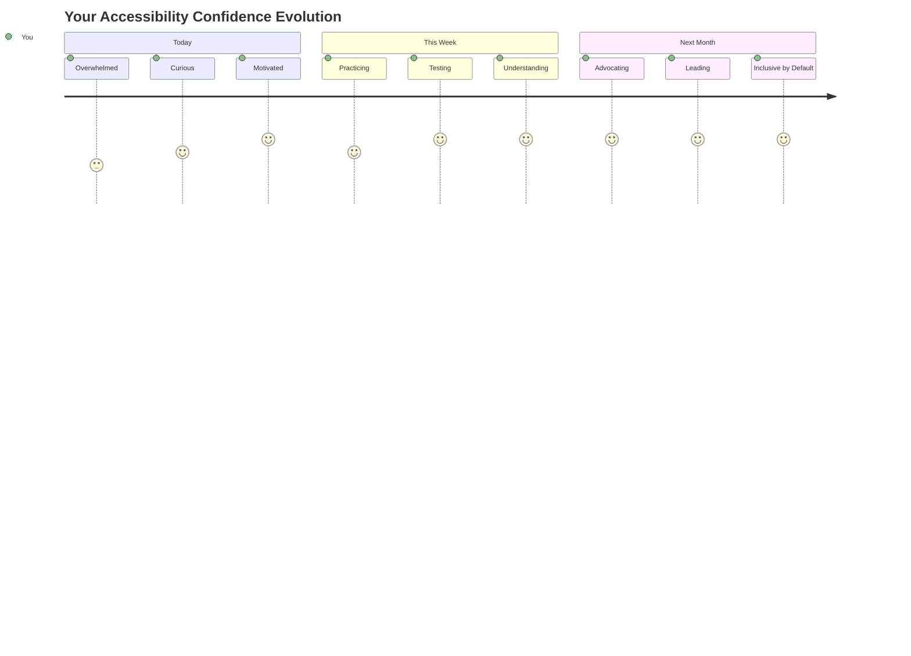
  
> 🌍 **Теперь вы чемпион доступности!** Вы понимаете, что отличные веб-опыты должны быть доступны всем, независимо от того, как они взаимодействуют с интернетом. Каждая доступная функция, которую вы создаете, делает интернет более инклюзивным. Интернет нуждается в разработчиках, таких как вы, которые видят доступность не как ограничение, а как возможность создавать лучшие опыты для всех пользователей. Добро пожаловать в движение! 🎉  

---

**Отказ от ответственности**:  
Этот документ был переведен с использованием сервиса автоматического перевода [Co-op Translator](https://github.com/Azure/co-op-translator). Несмотря на наши усилия обеспечить точность, автоматические переводы могут содержать ошибки или неточности. Оригинальный документ на его родном языке следует считать авторитетным источником. Для получения критически важной информации рекомендуется профессиональный перевод человеком. Мы не несем ответственности за любые недоразумения или неправильные интерпретации, возникающие в результате использования данного перевода.