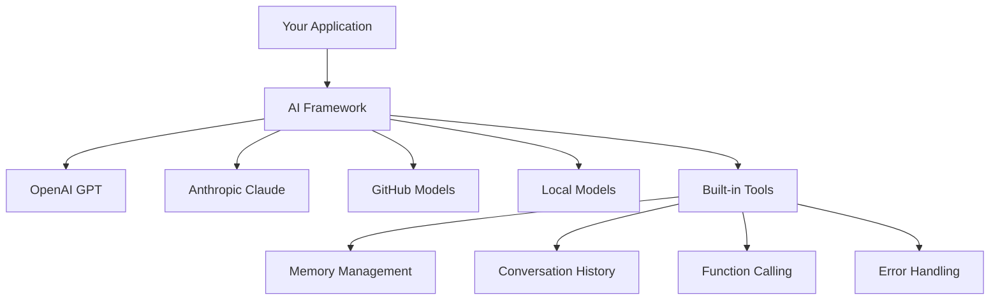
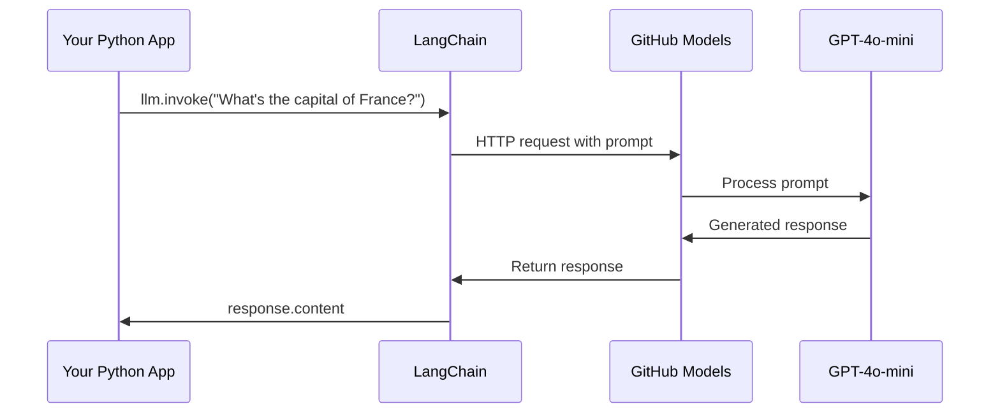
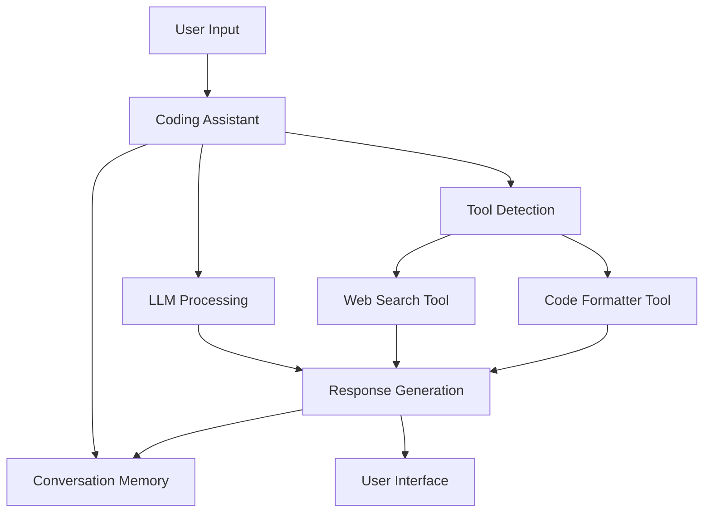
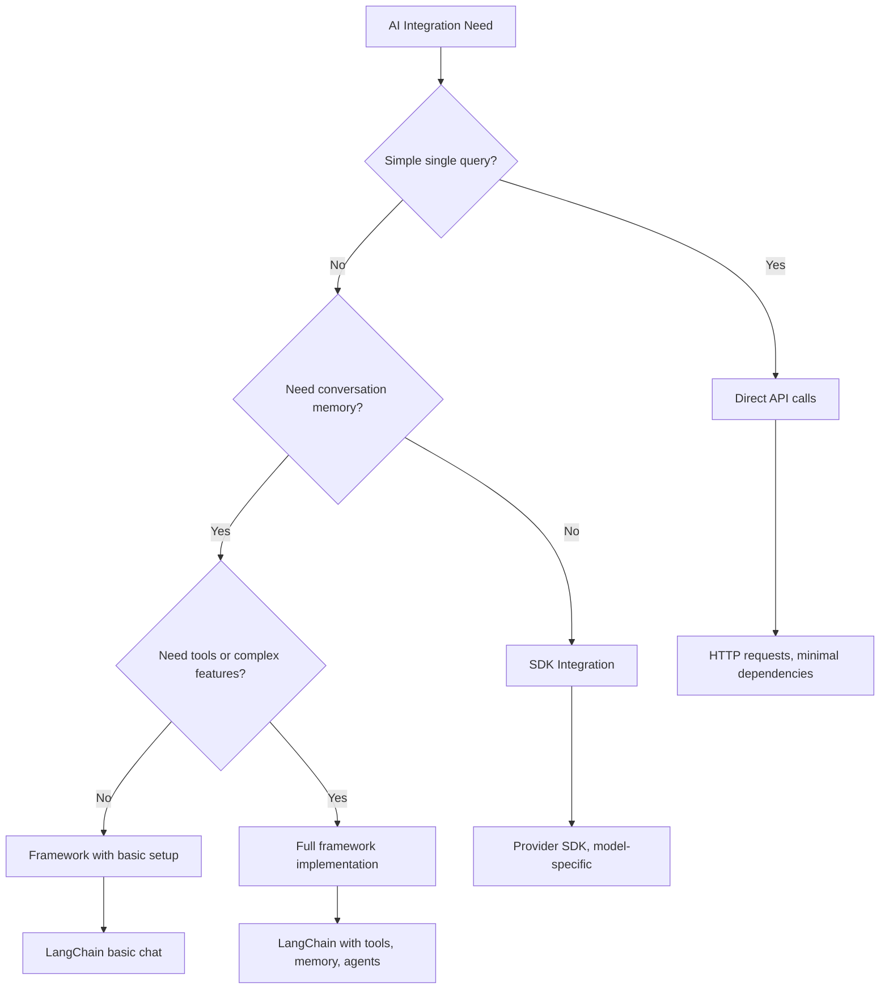

<!--
CO_OP_TRANSLATOR_METADATA:
{
  "original_hash": "e2c4ae5688e34b4b8b09d52aec56c79e",
  "translation_date": "2025-10-22T22:16:07+00:00",
  "source_file": "10-ai-framework-project/README.md",
  "language_code": "ru"
}
-->
# Фреймворк для ИИ

Чувствуете себя подавленным, пытаясь создать приложения на основе ИИ с нуля? Вы не одиноки! Фреймворки для ИИ — это как швейцарский нож для разработки ИИ: мощные инструменты, которые экономят ваше время и избавляют от головной боли при создании интеллектуальных приложений. Представьте себе фреймворк ИИ как хорошо организованную библиотеку: он предоставляет готовые компоненты, стандартизированные API и умные абстракции, чтобы вы могли сосредоточиться на решении задач, а не на деталях реализации.

В этом уроке мы рассмотрим, как фреймворки, такие как LangChain, могут превратить сложные задачи интеграции ИИ в чистый и понятный код. Вы узнаете, как справляться с реальными вызовами, такими как отслеживание разговоров, реализация вызова инструментов и управление различными моделями ИИ через единый интерфейс.

К концу урока вы будете знать, когда стоит использовать фреймворки вместо прямых вызовов API, как эффективно применять их абстракции и как создавать приложения на основе ИИ, готовые к использованию в реальном мире. Давайте узнаем, что фреймворки для ИИ могут сделать для ваших проектов.

## Почему стоит выбрать фреймворк?

Итак, вы готовы создать приложение на основе ИИ — здорово! Но вот в чем дело: у вас есть несколько разных путей, которыми можно пойти, и у каждого из них есть свои плюсы и минусы. Это как выбирать между ходьбой, велосипедом или машиной, чтобы добраться до места — все они приведут вас к цели, но опыт (и усилия) будут совершенно разными.

Давайте разберем три основных способа интеграции ИИ в ваши проекты:

| Подход | Преимущества | Лучшее применение | Особенности |
|--------|--------------|-------------------|-------------|
| **Прямые HTTP-запросы** | Полный контроль, отсутствие зависимостей | Простые запросы, изучение основ | Более многословный код, ручная обработка ошибок |
| **Интеграция SDK** | Меньше шаблонного кода, оптимизация под конкретные модели | Приложения с одной моделью | Ограничено конкретными провайдерами |
| **Фреймворки для ИИ** | Единый API, встроенные абстракции | Приложения с несколькими моделями, сложные рабочие процессы | Кривая обучения, возможная чрезмерная абстракция |

### Преимущества фреймворков на практике



**Почему фреймворки важны:**
- **Объединяют** нескольких провайдеров ИИ в одном интерфейсе
- **Автоматически обрабатывают** память разговоров
- **Предоставляют** готовые инструменты для распространенных задач, таких как встраивания и вызов функций
- **Управляют** обработкой ошибок и логикой повторных попыток
- **Преобразуют** сложные рабочие процессы в понятные вызовы методов

> 💡 **Полезный совет**: Используйте фреймворки, когда переключаетесь между различными моделями ИИ или создаете сложные функции, такие как агенты, память или вызов инструментов. Используйте прямые API, когда изучаете основы или создаете простые, узконаправленные приложения.

**Итог**: Как выбор между специализированными инструментами мастера и полноценной мастерской, все зависит от задачи. Фреймворки отлично подходят для сложных, насыщенных функциями приложений, а прямые API — для простых случаев использования.

## Введение

В этом уроке мы научимся:

- Использовать общий фреймворк для ИИ.
- Решать распространенные проблемы, такие как разговоры в чате, использование инструментов, память и контекст.
- Использовать это для создания приложений на основе ИИ.

## Ваш первый запрос к ИИ

Начнем с основ, создав ваше первое приложение на основе ИИ, которое отправляет вопрос и получает ответ. Как Архимед, открывший принцип вытеснения в своей ванне, иногда самые простые наблюдения приводят к самым мощным открытиям — и фреймворки делают эти открытия доступными.

### Настройка LangChain с моделями GitHub

Мы будем использовать LangChain для подключения к моделям GitHub, что довольно удобно, так как это дает вам бесплатный доступ к различным моделям ИИ. Лучшая часть? Вам нужно всего лишь несколько простых параметров конфигурации, чтобы начать:

```python
from langchain_openai import ChatOpenAI
import os

llm = ChatOpenAI(
    api_key=os.environ["GITHUB_TOKEN"],
    base_url="https://models.github.ai/inference",
    model="openai/gpt-4o-mini",
)

# Send a simple prompt
response = llm.invoke("What's the capital of France?")
print(response.content)
```

**Разберем, что здесь происходит:**
- **Создается** клиент LangChain с использованием класса `ChatOpenAI` — это ваш доступ к ИИ!
- **Настраивается** подключение к моделям GitHub с вашим токеном аутентификации
- **Указывается**, какую модель ИИ использовать (`gpt-4o-mini`) — представьте, что вы выбираете своего помощника ИИ
- **Отправляется** ваш вопрос с помощью метода `invoke()` — здесь происходит магия
- **Извлекается** и отображается ответ — и voilà, вы общаетесь с ИИ!

> 🔧 **Примечание по настройке**: Если вы используете GitHub Codespaces, вам повезло — `GITHUB_TOKEN` уже настроен! Работаете локально? Не переживайте, вам просто нужно создать персональный токен доступа с нужными разрешениями.

**Ожидаемый результат:**
```text
The capital of France is Paris.
```



## Создание разговорного ИИ

Первый пример демонстрирует основы, но это всего лишь один обмен — вы задаете вопрос, получаете ответ, и на этом все. В реальных приложениях вы хотите, чтобы ваш ИИ запоминал, о чем вы говорили, как Ватсон и Холмс строили свои расследовательские беседы со временем.

Вот где LangChain становится особенно полезным. Он предоставляет различные типы сообщений, которые помогают структурировать разговоры и позволяют придать вашему ИИ личность. Вы будете создавать чаты, которые сохраняют контекст и характер.

### Понимание типов сообщений

Представьте эти типы сообщений как разные "роли", которые участники играют в разговоре. LangChain использует различные классы сообщений, чтобы отслеживать, кто что говорит:

| Тип сообщения | Назначение | Пример использования |
|---------------|------------|----------------------|
| `SystemMessage` | Определяет личность и поведение ИИ | "Вы — полезный помощник по программированию" |
| `HumanMessage` | Представляет ввод пользователя | "Объясните, как работают функции" |
| `AIMessage` | Сохраняет ответы ИИ | Предыдущие ответы ИИ в разговоре |

### Создание вашего первого разговора

Давайте создадим разговор, где наш ИИ принимает определенную роль. Пусть он воплотит капитана Пикарда — персонажа, известного своей дипломатической мудростью и лидерскими качествами:

```python
messages = [
    SystemMessage(content="You are Captain Picard of the Starship Enterprise"),
    HumanMessage(content="Tell me about you"),
]
```

**Разберем настройку этого разговора:**
- **Устанавливает** роль и личность ИИ через `SystemMessage`
- **Предоставляет** начальный запрос пользователя через `HumanMessage`
- **Создает** основу для многократного обмена сообщениями

Полный код для этого примера выглядит так:

```python
from langchain_core.messages import HumanMessage, SystemMessage
from langchain_openai import ChatOpenAI
import os

llm = ChatOpenAI(
    api_key=os.environ["GITHUB_TOKEN"],
    base_url="https://models.github.ai/inference",
    model="openai/gpt-4o-mini",
)

messages = [
    SystemMessage(content="You are Captain Picard of the Starship Enterprise"),
    HumanMessage(content="Tell me about you"),
]


# works
response  = llm.invoke(messages)
print(response.content)
```

Вы должны увидеть результат, похожий на:

```text
I am Captain Jean-Luc Picard, the commanding officer of the USS Enterprise (NCC-1701-D), a starship in the United Federation of Planets. My primary mission is to explore new worlds, seek out new life and new civilizations, and boldly go where no one has gone before. 

I believe in the importance of diplomacy, reason, and the pursuit of knowledge. My crew is diverse and skilled, and we often face challenges that test our resolve, ethics, and ingenuity. Throughout my career, I have encountered numerous species, grappled with complex moral dilemmas, and have consistently sought peaceful solutions to conflicts.

I hold the ideals of the Federation close to my heart, believing in the importance of cooperation, understanding, and respect for all sentient beings. My experiences have shaped my leadership style, and I strive to be a thoughtful and just captain. How may I assist you further?
```

Чтобы сохранить непрерывность разговора (вместо сброса контекста каждый раз), вам нужно продолжать добавлять ответы в список сообщений. Как устные традиции, которые сохраняли истории через поколения, этот подход создает долговременную память:

```python
from langchain_core.messages import HumanMessage, SystemMessage
from langchain_openai import ChatOpenAI
import os

llm = ChatOpenAI(
    api_key=os.environ["GITHUB_TOKEN"],
    base_url="https://models.github.ai/inference",
    model="openai/gpt-4o-mini",
)

messages = [
    SystemMessage(content="You are Captain Picard of the Starship Enterprise"),
    HumanMessage(content="Tell me about you"),
]


# works
response  = llm.invoke(messages)

print(response.content)

print("---- Next ----")

messages.append(response)
messages.append(HumanMessage(content="Now that I know about you, I'm Chris, can I be in your crew?"))

response  = llm.invoke(messages)

print(response.content)

```

Довольно здорово, правда? Что здесь происходит: мы вызываем LLM дважды — сначала только с нашими первоначальными двумя сообщениями, а затем снова с полной историей разговора. Это как если бы ИИ действительно следил за нашей беседой!

Когда вы выполните этот код, вы получите второй ответ, который будет звучать примерно так:

```text
Welcome aboard, Chris! It's always a pleasure to meet those who share a passion for exploration and discovery. While I cannot formally offer you a position on the Enterprise right now, I encourage you to pursue your aspirations. We are always in need of talented individuals with diverse skills and backgrounds. 

If you are interested in space exploration, consider education and training in the sciences, engineering, or diplomacy. The values of curiosity, resilience, and teamwork are crucial in Starfleet. Should you ever find yourself on a starship, remember to uphold the principles of the Federation: peace, understanding, and respect for all beings. Your journey can lead you to remarkable adventures, whether in the stars or on the ground. Engage!
```

Я приму это за "возможно" ;)

## Потоковые ответы

Вы когда-нибудь замечали, как ChatGPT "пишет" свои ответы в реальном времени? Это потоковая передача в действии. Как наблюдать за работой искусного каллиграфа — видеть, как символы появляются штрих за штрихом, а не материализуются мгновенно — потоковая передача делает взаимодействие более естественным и обеспечивает немедленную обратную связь.

### Реализация потоковой передачи с LangChain

```python
from langchain_openai import ChatOpenAI
import os

llm = ChatOpenAI(
    api_key=os.environ["GITHUB_TOKEN"],
    base_url="https://models.github.ai/inference",
    model="openai/gpt-4o-mini",
    streaming=True
)

# Stream the response
for chunk in llm.stream("Write a short story about a robot learning to code"):
    print(chunk.content, end="", flush=True)
```

**Почему потоковая передача крута:**
- **Показывает** контент по мере его создания — больше никакого неловкого ожидания!
- **Создает ощущение**, что что-то действительно происходит
- **Кажется** быстрее, даже если технически это не так
- **Позволяет** пользователям начать чтение, пока ИИ еще "думает"

> 💡 **Совет по пользовательскому опыту**: Потоковая передача особенно полезна, когда вы имеете дело с длинными ответами, такими как объяснения кода, творческое письмо или подробные учебные материалы. Вашим пользователям понравится видеть прогресс, а не смотреть на пустой экран!

## Шаблоны запросов

Шаблоны запросов работают как риторические структуры, используемые в классической ораторской речи — подумайте, как Цицерон адаптировал свои речевые модели для разных аудиторий, сохраняя при этом одну и ту же убедительную основу. Они позволяют создавать повторно используемые запросы, где вы можете заменять различные части информации, не переписывая все с нуля. Как только вы настроите шаблон, вам останется только заполнять переменные нужными значениями.

### Создание повторно используемых запросов

```python
from langchain_core.prompts import ChatPromptTemplate

# Define a template for code explanations
template = ChatPromptTemplate.from_messages([
    ("system", "You are an expert programming instructor. Explain concepts clearly with examples."),
    ("human", "Explain {concept} in {language} with a practical example for {skill_level} developers")
])

# Use the template with different values
questions = [
    {"concept": "functions", "language": "JavaScript", "skill_level": "beginner"},
    {"concept": "classes", "language": "Python", "skill_level": "intermediate"},
    {"concept": "async/await", "language": "JavaScript", "skill_level": "advanced"}
]

for question in questions:
    prompt = template.format_messages(**question)
    response = llm.invoke(prompt)
    print(f"Topic: {question['concept']}\n{response.content}\n---\n")
```

**Почему вам понравится использовать шаблоны:**
- **Сохраняет** ваши запросы последовательными по всему приложению
- **Больше никакой** путаницы со строками — только чистые, простые переменные
- **Ваш ИИ** ведет себя предсказуемо, потому что структура остается неизменной
- **Обновления** становятся проще — измените шаблон один раз, и он исправится везде

## Структурированный вывод

Когда-нибудь раздражались, пытаясь разобрать ответы ИИ, которые возвращаются в виде неструктурированного текста? Структурированный вывод — это как научить ваш ИИ следовать систематическому подходу, который использовал Линней для классификации биологических видов — организованный, предсказуемый и удобный в работе. Вы можете запросить JSON, определенные структуры данных или любой нужный вам формат.

### Определение схем вывода

```python
from langchain_core.prompts import ChatPromptTemplate
from langchain_core.output_parsers import JsonOutputParser
from pydantic import BaseModel, Field

class CodeReview(BaseModel):
    score: int = Field(description="Code quality score from 1-10")
    strengths: list[str] = Field(description="List of code strengths")
    improvements: list[str] = Field(description="List of suggested improvements")
    overall_feedback: str = Field(description="Summary feedback")

# Set up the parser
parser = JsonOutputParser(pydantic_object=CodeReview)

# Create prompt with format instructions
prompt = ChatPromptTemplate.from_messages([
    ("system", "You are a code reviewer. {format_instructions}"),
    ("human", "Review this code: {code}")
])

# Format the prompt with instructions
chain = prompt | llm | parser

# Get structured response
code_sample = """
def calculate_average(numbers):
    return sum(numbers) / len(numbers)
"""

result = chain.invoke({
    "code": code_sample,
    "format_instructions": parser.get_format_instructions()
})

print(f"Score: {result['score']}")
print(f"Strengths: {', '.join(result['strengths'])}")
```

**Почему структурированный вывод — это прорыв:**
- **Больше никакой** догадки, в каком формате вы получите ответ — он всегда одинаковый
- **Легко интегрируется** с вашими базами данных и API без лишней работы
- **Обнаруживает** странные ответы ИИ до того, как они сломают ваше приложение
- **Делает** ваш код чище, потому что вы точно знаете, с чем работаете

## Вызов инструментов

Теперь мы подошли к одной из самых мощных функций: инструменты. Это то, как вы даете вашему ИИ практические возможности, выходящие за рамки разговора. Как средневековые гильдии разрабатывали специализированные инструменты для конкретных ремесел, вы можете оснастить ваш ИИ целенаправленными инструментами. Вы описываете, какие инструменты доступны, и когда кто-то запрашивает что-то подходящее, ваш ИИ может действовать.

### Использование Python

Добавим несколько инструментов следующим образом:

```python
from typing_extensions import Annotated, TypedDict

class add(TypedDict):
    """Add two integers."""

    # Annotations must have the type and can optionally include a default value and description (in that order).
    a: Annotated[int, ..., "First integer"]
    b: Annotated[int, ..., "Second integer"]

tools = [add]

functions = {
    "add": lambda a, b: a + b
}
```

Что здесь происходит? Мы создаем чертеж для инструмента под названием `add`. Наследуя от `TypedDict` и используя типы `Annotated` для `a` и `b`, мы даем LLM четкое представление о том, что делает этот инструмент и что ему нужно. Словарь `functions` — это как наш набор инструментов, который говорит нашему коду, что делать, когда ИИ решает использовать определенный инструмент.

Давайте посмотрим, как мы вызываем LLM с этим инструментом:

```python
llm = ChatOpenAI(
    api_key=os.environ["GITHUB_TOKEN"],
    base_url="https://models.github.ai/inference",
    model="openai/gpt-4o-mini",
)

llm_with_tools = llm.bind_tools(tools)
```

Здесь мы вызываем `bind_tools` с массивом `tools`, и таким образом LLM `llm_with_tools` теперь знает об этом инструменте.

Чтобы использовать этот новый LLM, мы можем написать следующий код:

```python
query = "What is 3 + 12?"

res = llm_with_tools.invoke(query)
if(res.tool_calls):
    for tool in res.tool_calls:
        print("TOOL CALL: ", functions[tool["name"]](../../../10-ai-framework-project/**tool["args"]))
print("CONTENT: ",res.content)
```

Теперь, вызывая `invoke` на этом новом LLM, который имеет инструменты, мы можем увидеть, что свойство `tool_calls` заполнено. Если это так, любой идентифицированный инструмент имеет свойства `name` и `args`, которые определяют, какой инструмент следует вызвать и с какими аргументами. Полный код выглядит так:

```python
from langchain_core.messages import HumanMessage, SystemMessage
from langchain_openai import ChatOpenAI
import os
from typing_extensions import Annotated, TypedDict

class add(TypedDict):
    """Add two integers."""

    # Annotations must have the type and can optionally include a default value and description (in that order).
    a: Annotated[int, ..., "First integer"]
    b: Annotated[int, ..., "Second integer"]

tools = [add]

functions = {
    "add": lambda a, b: a + b
}

llm = ChatOpenAI(
    api_key=os.environ["GITHUB_TOKEN"],
    base_url="https://models.github.ai/inference",
    model="openai/gpt-4o-mini",
)

llm_with_tools = llm.bind_tools(tools)

query = "What is 3 + 12?"

res = llm_with_tools.invoke(query)
if(res.tool_calls):
    for tool in res.tool_calls:
        print("TOOL CALL: ", functions[tool["name"]](../../../10-ai-framework-project/**tool["args"]))
print("CONTENT: ",res.content)
```

Запустив этот код, вы должны увидеть результат, похожий на:

```text
TOOL CALL:  15
CONTENT: 
```

ИИ проанализировал "Что такое 3 + 12" и распознал это как задачу для инструмента `add`. Как опытный библиотекарь знает, к какому источнику обратиться в зависимости от типа заданного вопроса, он сделал это определение, исходя из названия инструмента, его описания и спецификаций полей. Результат 15 получен благодаря выполнению инструмента из нашего словаря `functions`:

```python
print("TOOL CALL: ", functions[tool["name"]](../../../10-ai-framework-project/**tool["args"]))
```

### Более интересный инструмент, вызывающий веб-API

Сложение чисел демонстрирует концепцию, но реальные инструменты обычно выполняют более сложные операции, такие как вызов веб-API. Давайте расширим наш пример, чтобы ИИ мог получать контент из интернета — как телеграфисты когда-то соединяли удаленные точки:

```python
class joke(TypedDict):
    """Tell a joke."""

    # Annotations must have the type and can optionally include a default value and description (in that order).
    category: Annotated[str, ..., "The joke category"]

def get_joke(category: str) -> str:
    response = requests.get(f"https://api.chucknorris.io/jokes/random?category={category}", headers={"Accept": "application/json"})
    if response.status_code == 200:
        return response.json().get("value", f"Here's a {category} joke!")
    return f"Here's a {category} joke!"

functions = {
    "add": lambda a, b: a + b,
    "joke": lambda category: get_joke(category)
}

query = "Tell me a joke about animals"

# the rest of the code is the same
```

Теперь, если вы выполните этот код, вы получите ответ, похожий на:

```text
TOOL CALL:  Chuck Norris once rode a nine foot grizzly bear through an automatic car wash, instead of taking a shower.
CONTENT:  
```

Вот полный код:

```python
from langchain_openai import ChatOpenAI
import requests
import os
from typing_extensions import Annotated, TypedDict

class add(TypedDict):
    """Add two integers."""

    # Annotations must have the type and can optionally include a default value and description (in that order).
    a: Annotated[int, ..., "First integer"]
    b: Annotated[int, ..., "Second integer"]

class joke(TypedDict):
    """Tell a joke."""

    # Annotations must have the type and can optionally include a default value and description (in that order).
    category: Annotated[str, ..., "The joke category"]

tools = [add, joke]

def get_joke(category: str) -> str:
    response = requests.get(f"https://api.chucknorris.io/jokes/random?category={category}", headers={"Accept": "application/json"})
    if response.status_code == 200:
        return response.json().get("value", f"Here's a {category} joke!")
    return f"Here's a {category} joke!"

functions = {
    "add": lambda a, b: a + b,
    "joke": lambda category: get_joke(category)
}

llm = ChatOpenAI(
    api_key=os.environ["GITHUB_TOKEN"],
    base_url="https://models.github.ai/inference",
    model="openai/gpt-4o-mini",
)

llm_with_tools = llm.bind_tools(tools)

query = "Tell me a joke about animals"

res = llm_with_tools.invoke(query)
if(res.tool_calls):
    for tool in res.tool_calls:
        # print("TOOL CALL: ", tool)
        print("TOOL CALL: ", functions[tool["name"]](../../../10-ai-framework-project/**tool["args"]))
print("CONTENT: ",res.content)
```

## Встраивания и обработка документов

Встраивания представляют собой одно из самых элегантных решений в современном ИИ. Представьте, что вы можете взять любой текст и преобразовать его в числовые координаты, которые отражают его смысл. Именно это делают встраивания — они преобразуют текст в точки в многомерном пространстве, где схожие концепции группируются вместе. Это как система координат для идей, напоминающая, как Менделеев организовал периодическую таблицу по атомным свойствам.

### Создание и использование встраиваний

```python
from langchain_openai import OpenAIEmbeddings
from langchain_community.vectorstores import FAISS
from langchain_community.document_loaders import TextLoader
from langchain.text_splitter import CharacterTextSplitter

# Initialize embeddings
embeddings = OpenAIEmbeddings(
    api_key=os.environ["GITHUB_TOKEN"],
    base_url="https://models.github.ai/inference",
    model="text-embedding-3-small"
)

# Load and split documents
loader = TextLoader("documentation.txt")
documents = loader.load()

text_splitter = CharacterTextSplitter(chunk_size=1000, chunk_overlap=0)
texts = text_splitter.split_documents(documents)

# Create vector store
vectorstore = FAISS.from_documents(texts, embeddings)

# Perform similarity search
query = "How do I handle user authentication?"
similar_docs = vectorstore.similarity_search(query, k=3)

for doc in similar_docs:
    print(f"Relevant content: {doc.page_content[:200]}...")
```

### Загрузчики документов для различных форматов

```python
from langchain_community.document_loaders import (
    PyPDFLoader,
    CSVLoader,
    JSONLoader,
    WebBaseLoader
)

# Load different document types
pdf_loader = PyPDFLoader("manual.pdf")
csv_loader = CSVLoader("data.csv")
json_loader = JSONLoader("config.json")
web_loader = WebBaseLoader("https://example.com/docs")

# Process all documents
all_documents = []
for loader in [pdf_loader, csv_loader, json_loader, web_loader]:
    docs = loader.load()
    all_documents.extend(docs)
```

**Что можно делать с встраиваниями:**
- **Создавать** поиск, который действительно понимает, что вы имеете в виду, а не просто совпадение ключевых слов
- **Создавать** ИИ, который может отвечать на вопросы о ваших документах
- **Создавать** рекомендательные системы, предлагающие действительно релевантный контент
- **Автоматически** организовывать и классифицировать ваш контент

## Создание полноценного приложения на основе ИИ

Теперь мы интегрируем все, что вы узнали, в комплексное приложение — помощник по программированию, который может отвечать на вопросы, использовать инструменты и сохранять память разговора. Как печатный пресс объединил существующие технологии (подвижный шрифт, чернила, бумагу и пресс) в нечто преобразующее, мы объединим наши компоненты ИИ в нечто практичное и полезное.

### Пример полного приложения

```python
from langchain_openai import ChatOpenAI, OpenAIEmbeddings
from langchain_core.prompts import ChatPromptTemplate
from langchain_core.messages import HumanMessage, SystemMessage, AIMessage
from langchain_community.vectorstores import FAISS
from typing_extensions import Annotated, TypedDict
import os
import requests

class CodingAssistant:
    def __init__(self):
        self.llm = ChatOpenAI(
            api_key=os.environ["GITHUB_TOKEN"],
            base_url="https://models.github.ai/inference",
            model="openai/gpt-4o-mini"
        )
        
        self.conversation_history = [
            SystemMessage(content="""You are an expert coding assistant. 
            Help users learn programming concepts, debug code, and write better software.
            Use tools when needed and maintain a helpful, encouraging tone.""")
        ]
        
        # Define tools
        self.setup_tools()
    
    def setup_tools(self):
        class web_search(TypedDict):
            """Search for programming documentation or examples."""
            query: Annotated[str, "Search query for programming help"]
        
        class code_formatter(TypedDict):
            """Format and validate code snippets."""
            code: Annotated[str, "Code to format"]
            language: Annotated[str, "Programming language"]
        
        self.tools = [web_search, code_formatter]
        self.llm_with_tools = self.llm.bind_tools(self.tools)
    
    def chat(self, user_input: str):
        # Add user message to conversation
        self.conversation_history.append(HumanMessage(content=user_input))
        
        # Get AI response
        response = self.llm_with_tools.invoke(self.conversation_history)
        
        # Handle tool calls if any
        if response.tool_calls:
            for tool_call in response.tool_calls:
                tool_result = self.execute_tool(tool_call)
                print(f"🔧 Tool used: {tool_call['name']}")
                print(f"📊 Result: {tool_result}")
        
        # Add AI response to conversation
        self.conversation_history.append(response)
        
        return response.content
    
    def execute_tool(self, tool_call):
        tool_name = tool_call['name']
        args = tool_call['args']
        
        if tool_name == 'web_search':
            return f"Found documentation for: {args['query']}"
        elif tool_name == 'code_formatter':
            return f"Formatted {args['language']} code: {args['code'][:50]}..."
        
        return "Tool execution completed"

# Usage example
assistant = CodingAssistant()

print("🤖 Coding Assistant Ready! Type 'quit' to exit.\n")

while True:
    user_input = input("You: ")
    if user_input.lower() == 'quit':
        break
    
    response = assistant.chat(user_input)
    print(f"🤖 Assistant: {response}\n")
```

**Архитектура приложения:**



**Ключевые функции, которые мы реализовали:**
- **Запоминает** весь ваш разговор для сохранения контекста
- **Выполняет действия** через вызов инструментов, а не только разговор
- **Следует** предсказуемым шаблонам взаимодействия
- **Автоматически управляет** обработкой ошибок и сложными рабочими процессами

## Задание: Создайте собственного помощника для изучения программирования

**Цель**: Создать приложение на основе ИИ, которое помогает студентам изучать программирование, предоставляя объяснения, примеры кода и интерактивные викторины.

### Требования

**Основные функции (обязательные):**
1. **Интерфейс для общения**: Реализуйте систему чата, которая сохраняет контекст в течение нескольких вопросов.
2. **Образовательные инструменты**: Создайте как минимум два инструмента для обучения:
   - Инструмент объяснения кода
   - Генератор викторин по концепциям
3. **Персонализированное обучение**: Используйте системные сообщения для адаптации ответов к различным уровням навыков
4. **Форматирование ответов**: Реализуйте структурированный вывод для вопросов викторины

### Этапы реализации

**Шаг 1: Настройте окружение**
```bash
pip install langchain langchain-openai
```

**Шаг 2: Базовая функциональность чата**
- Создайте класс `StudyAssistant`
- Реализуйте память беседы
- Добавьте конфигурацию личности для образовательной поддержки

**Шаг 3: Добавьте образовательные инструменты**
- **Объяснение кода**: Разбивает код на понятные части
- **Генератор викторин**: Создает вопросы по концепциям программирования
- **Трекер прогресса**: Отслеживает изученные темы

**Шаг 4: Расширенные функции (опционально)**
- Реализуйте потоковые ответы для улучшения пользовательского опыта
- Добавьте загрузку документов для включения учебных материалов
- Создайте эмбеддинги для поиска контента на основе сходства

### Критерии оценки

| Функция | Отлично (4) | Хорошо (3) | Удовлетворительно (2) | Требует доработки (1) |
|---------|-------------|------------|-----------------------|-----------------------|
| **Поток беседы** | Естественные, контекстно-осведомленные ответы | Хорошее сохранение контекста | Базовая беседа | Нет памяти между обменами |
| **Интеграция инструментов** | Несколько полезных инструментов работают безупречно | 2+ инструмента реализованы корректно | 1-2 базовых инструмента | Инструменты не работают |
| **Качество кода** | Чистый, хорошо документированный, с обработкой ошибок | Хорошая структура, частичная документация | Базовая функциональность работает | Плохая структура, отсутствие обработки ошибок |
| **Образовательная ценность** | Действительно полезно для обучения, адаптивно | Хорошая поддержка обучения | Базовые объяснения | Ограниченная образовательная ценность |

### Пример структуры кода

```python
class StudyAssistant:
    def __init__(self, skill_level="beginner"):
        # Initialize LLM, tools, and conversation memory
        pass
    
    def explain_code(self, code, language):
        # Tool: Explain how code works
        pass
    
    def generate_quiz(self, topic, difficulty):
        # Tool: Create practice questions
        pass
    
    def chat(self, user_input):
        # Main conversation interface
        pass

# Example usage
assistant = StudyAssistant(skill_level="intermediate")
response = assistant.chat("Explain how Python functions work")
```

**Дополнительные задачи:**
- Добавьте возможность голосового ввода/вывода
- Реализуйте веб-интерфейс с использованием Streamlit или Flask
- Создайте базу знаний из учебных материалов с помощью эмбеддингов
- Добавьте отслеживание прогресса и персонализированные пути обучения

## Резюме

🎉 Вы освоили основы разработки AI-фреймворков и научились создавать сложные AI-приложения с использованием LangChain. Как после завершения полноценного обучения, вы приобрели внушительный набор навыков. Давайте подведем итоги.

### Чему вы научились

**Основные концепции фреймворка:**
- **Преимущества фреймворков**: Понимание, когда стоит выбирать фреймворки вместо прямых вызовов API
- **Основы LangChain**: Настройка и конфигурация подключений к AI-моделям
- **Типы сообщений**: Использование `SystemMessage`, `HumanMessage` и `AIMessage` для структурированных бесед

**Расширенные функции:**
- **Вызов инструментов**: Создание и интеграция пользовательских инструментов для расширения возможностей AI
- **Память беседы**: Сохранение контекста в течение нескольких обменов
- **Потоковые ответы**: Реализация доставки ответов в реальном времени
- **Шаблоны подсказок**: Создание повторно используемых, динамических подсказок
- **Структурированный вывод**: Обеспечение последовательных, парсируемых ответов AI
- **Эмбеддинги**: Создание семантического поиска и обработки документов

**Практическое применение:**
- **Создание полноценных приложений**: Комбинирование множества функций в готовые к использованию приложения
- **Обработка ошибок**: Реализация надежного управления ошибками и проверки
- **Интеграция инструментов**: Создание пользовательских инструментов, расширяющих возможности AI

### Основные выводы

> 🎯 **Запомните**: AI-фреймворки, такие как LangChain, — это ваши лучшие друзья, скрывающие сложность и наполненные функциями. Они идеально подходят, если вам нужна память беседы, вызов инструментов или работа с несколькими AI-моделями без потери рассудка.

**Рамки принятия решений для интеграции AI:**



### Что дальше?

**Начните создавать прямо сейчас:**
- Возьмите эти концепции и создайте что-то, что вас вдохновляет!
- Экспериментируйте с различными AI-моделями через LangChain — это как игровая площадка для моделей AI
- Создавайте инструменты, которые решают реальные проблемы в вашей работе или проектах

**Готовы к следующему уровню?**
- **AI-агенты**: Создавайте AI-системы, которые могут планировать и выполнять сложные задачи самостоятельно
- **RAG (Генерация с дополнением поиска)**: Объедините AI с вашими собственными базами знаний для мощных приложений
- **Мультимодальный AI**: Работайте с текстом, изображениями и аудио одновременно — возможности безграничны!
- **Развертывание в продакшн**: Узнайте, как масштабировать ваши AI-приложения и следить за их работой в реальном мире

**Присоединяйтесь к сообществу:**
- Сообщество LangChain отлично подходит для того, чтобы быть в курсе событий и изучать лучшие практики
- GitHub Models предоставляет доступ к передовым возможностям AI — идеально для экспериментов
- Продолжайте практиковаться с различными сценариями использования — каждый проект научит вас чему-то новому

Теперь у вас есть знания, чтобы создавать интеллектуальные, разговорные приложения, которые помогут людям решать реальные задачи. Как мастера эпохи Возрождения, сочетавшие художественное видение с техническими навыками, вы можете объединить возможности AI с практическим применением. Вопрос в том: что вы создадите? 🚀

## Вызов GitHub Copilot Agent 🚀

Используйте режим Agent, чтобы выполнить следующий вызов:

**Описание:** Создайте продвинутого AI-помощника для проверки кода, который объединяет несколько функций LangChain, включая вызов инструментов, структурированный вывод и память беседы, чтобы предоставлять всестороннюю обратную связь по отправленным кодам.

**Подсказка:** Создайте класс CodeReviewAssistant, который реализует:
1. Инструмент для анализа сложности кода и предложений по улучшению
2. Инструмент для проверки кода на соответствие лучшим практикам
3. Структурированный вывод с использованием моделей Pydantic для согласованного формата обзора
4. Память беседы для отслеживания сеансов проверки
5. Основной интерфейс чата, способный обрабатывать отправку кода и предоставлять подробные, практические рекомендации

Помощник должен уметь проверять код на нескольких языках программирования, сохранять контекст в течение нескольких отправок кода в одном сеансе и предоставлять как итоговые оценки, так и подробные предложения по улучшению.

Узнайте больше о [режиме Agent](https://code.visualstudio.com/blogs/2025/02/24/introducing-copilot-agent-mode) здесь.

---

**Отказ от ответственности**:  
Этот документ был переведен с использованием сервиса автоматического перевода [Co-op Translator](https://github.com/Azure/co-op-translator). Несмотря на наши усилия обеспечить точность, автоматические переводы могут содержать ошибки или неточности. Оригинальный документ на его родном языке следует считать авторитетным источником. Для получения критически важной информации рекомендуется профессиональный перевод человеком. Мы не несем ответственности за любые недоразумения или неправильные интерпретации, возникающие в результате использования данного перевода.