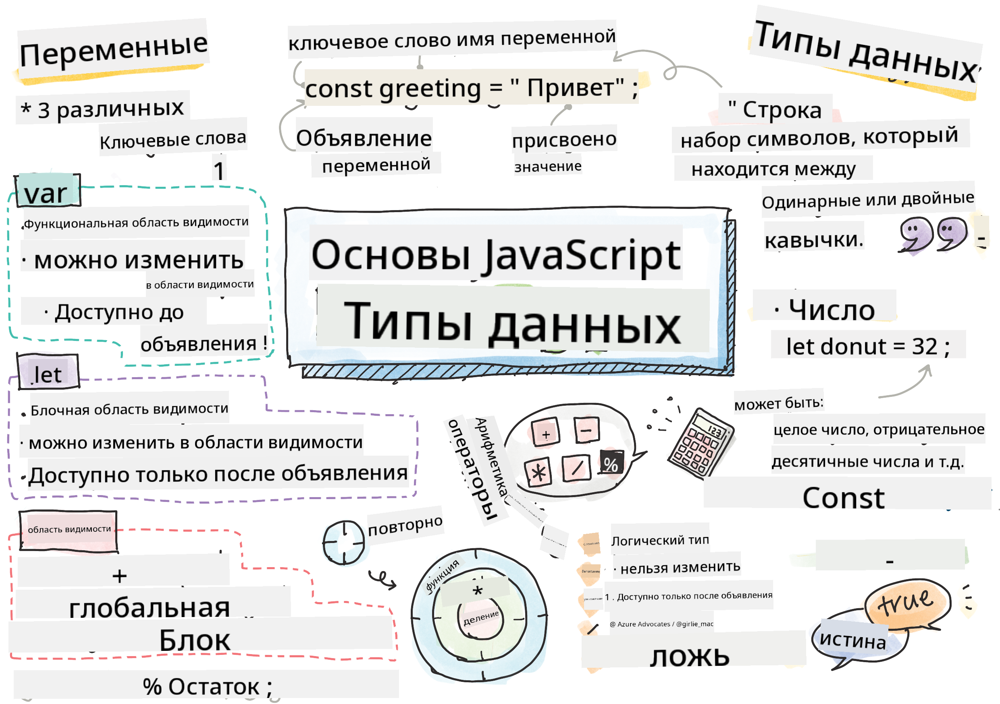

<!--
CO_OP_TRANSLATOR_METADATA:
{
  "original_hash": "fc6aef8ecfdd5b0ad2afa6e6ba52bfde",
  "translation_date": "2025-08-25T21:51:15+00:00",
  "source_file": "2-js-basics/1-data-types/README.md",
  "language_code": "ru"
}
-->
# Основы JavaScript: Типы данных


> Скетчноут от [Tomomi Imura](https://twitter.com/girlie_mac)

## Викторина перед лекцией
[Викторина перед лекцией](https://ashy-river-0debb7803.1.azurestaticapps.net/quiz/7)

Этот урок охватывает основы JavaScript — языка, который обеспечивает интерактивность в вебе.

> Вы можете пройти этот урок на [Microsoft Learn](https://docs.microsoft.com/learn/modules/web-development-101-variables/?WT.mc_id=academic-77807-sagibbon)!

[](https://youtube.com/watch?v=JNIXfGiDWM8 "Переменные в JavaScript")

[](https://youtube.com/watch?v=AWfA95eLdq8 "Типы данных в JavaScript")

> 🎥 Нажмите на изображения выше, чтобы посмотреть видео о переменных и типах данных.

Давайте начнем с переменных и типов данных, которые их наполняют!

## Переменные

Переменные хранят значения, которые можно использовать и изменять в вашем коде.

Создание и **объявление** переменной имеет следующий синтаксис **[ключевое слово] [имя]**. Оно состоит из двух частей:

- **Ключевое слово**. Ключевыми словами могут быть `let` или `var`.  

✅ Ключевое слово `let` было введено в ES6 и предоставляет вашей переменной так называемую _блочную область видимости_. Рекомендуется использовать `let` вместо `var`. Мы рассмотрим блочные области видимости более подробно в следующих частях.

- **Имя переменной**, это имя, которое вы выбираете сами.

### Задание - работа с переменными

1. **Объявите переменную**. Давайте объявим переменную, используя ключевое слово `let`:

    ```javascript
    let myVariable;
    ```

   `myVariable` теперь объявлена с использованием ключевого слова `let`. В данный момент она не имеет значения.

1. **Присвойте значение**. Сохраните значение в переменной с помощью оператора `=`, за которым следует ожидаемое значение.

    ```javascript
    myVariable = 123;
    ```

   > Примечание: использование `=` в этом уроке означает, что мы используем "оператор присваивания", который устанавливает значение переменной. Это не обозначает равенство.

   `myVariable` теперь *инициализирована* со значением 123.

1. **Рефакторинг**. Замените ваш код следующим выражением.

    ```javascript
    let myVariable = 123;
    ```

    Выше приведен пример _явной инициализации_, когда переменная объявляется и ей одновременно присваивается значение.

1. **Измените значение переменной**. Измените значение переменной следующим образом:

   ```javascript
   myVariable = 321;
   ```

   После того как переменная объявлена, вы можете изменить ее значение в любой момент вашего кода с помощью оператора `=` и нового значения.

   ✅ Попробуйте! Вы можете писать JavaScript прямо в вашем браузере. Откройте окно браузера и перейдите в инструменты разработчика. В консоли вы найдете приглашение; введите `let myVariable = 123`, нажмите Enter, затем введите `myVariable`. Что происходит? Обратите внимание, что вы узнаете больше об этих концепциях в последующих уроках.

## Константы

Объявление и инициализация константы следуют тем же принципам, что и переменной, за исключением ключевого слова `const`. Константы обычно объявляются с использованием заглавных букв.

```javascript
const MY_VARIABLE = 123;
```

Константы похожи на переменные, но имеют два исключения:

- **Должны иметь значение**. Константы должны быть инициализированы, иначе при выполнении кода произойдет ошибка.
- **Ссылка не может быть изменена**. Ссылка константы не может быть изменена после инициализации, иначе при выполнении кода произойдет ошибка. Рассмотрим два примера:
   - **Простое значение**. Следующее НЕ допускается:
   
      ```javascript
      const PI = 3;
      PI = 4; // not allowed
      ```
 
   - **Ссылка на объект защищена**. Следующее НЕ допускается.
   
      ```javascript
      const obj = { a: 3 };
      obj = { b: 5 } // not allowed
      ```

    - **Значение объекта не защищено**. Следующее ДОПУСКАЕТСЯ:
    
      ```javascript
      const obj = { a: 3 };
      obj.a = 5;  // allowed
      ```

      В приведенном выше примере вы изменяете значение объекта, но не саму ссылку, что делает это допустимым.

   > Примечание: `const` означает, что ссылка защищена от переназначения. Однако значение не является _неизменяемым_ и может изменяться, особенно если это сложная структура, такая как объект.

## Типы данных

Переменные могут хранить множество различных типов значений, таких как числа и текст. Эти различные типы значений известны как **тип данных**. Типы данных являются важной частью разработки программного обеспечения, так как они помогают разработчикам принимать решения о том, как должен быть написан код и как должно работать программное обеспечение. Кроме того, некоторые типы данных имеют уникальные особенности, которые помогают преобразовывать или извлекать дополнительную информацию из значения.

✅ Типы данных также называются примитивами данных JavaScript, так как они являются базовыми типами данных, предоставляемыми языком. Существует 7 примитивных типов данных: string, number, bigint, boolean, undefined, null и symbol. Потратьте минуту, чтобы визуализировать, что каждый из этих примитивов может представлять. Что такое `zebra`? А `0`? `true`?

### Числа

В предыдущем разделе значение `myVariable` было числовым типом данных.

`let myVariable = 123;`

Переменные могут хранить все типы чисел, включая десятичные или отрицательные числа. Числа также могут использоваться с арифметическими операторами, которые будут рассмотрены в [следующем разделе](../../../../2-js-basics/1-data-types).

### Арифметические операторы

Существует несколько типов операторов для выполнения арифметических функций, некоторые из них перечислены ниже:

| Символ | Описание                                                                 | Пример                           |
| ------ | ------------------------------------------------------------------------ | -------------------------------- |
| `+`    | **Сложение**: вычисляет сумму двух чисел                                 | `1 + 2 //ожидаемый ответ 3`      |
| `-`    | **Вычитание**: вычисляет разницу двух чисел                              | `1 - 2 //ожидаемый ответ -1`     |
| `*`    | **Умножение**: вычисляет произведение двух чисел                         | `1 * 2 //ожидаемый ответ 2`      |
| `/`    | **Деление**: вычисляет частное двух чисел                                | `1 / 2 //ожидаемый ответ 0.5`    |
| `%`    | **Остаток**: вычисляет остаток от деления двух чисел                     | `1 % 2 //ожидаемый ответ 1`      |

✅ Попробуйте! Попробуйте выполнить арифметическую операцию в консоли вашего браузера. Удивляют ли вас результаты?

### Строки

Строки — это наборы символов, заключенные в одинарные или двойные кавычки.

- `'Это строка'`
- `"Это тоже строка"`
- `let myString = 'Это строковое значение, сохраненное в переменной';`

Не забудьте использовать кавычки при написании строки, иначе JavaScript предположит, что это имя переменной.

### Форматирование строк

Строки являются текстовыми и время от времени требуют форматирования.

Чтобы **объединить** две или более строки, или соединить их вместе, используйте оператор `+`.

```javascript
let myString1 = "Hello";
let myString2 = "World";

myString1 + myString2 + "!"; //HelloWorld!
myString1 + " " + myString2 + "!"; //Hello World!
myString1 + ", " + myString2 + "!"; //Hello, World!

```

✅ Почему в JavaScript `1 + 1 = 2`, а `'1' + '1' = 11?` Подумайте об этом. А как насчет `'1' + 1`?

**Шаблонные литералы** — это еще один способ форматирования строк, но вместо кавычек используется обратная кавычка. Все, что не является простым текстом, должно быть помещено в плейсхолдеры `${ }`. Это включает любые переменные, которые могут быть строками.

```javascript
let myString1 = "Hello";
let myString2 = "World";

`${myString1} ${myString2}!` //Hello World!
`${myString1}, ${myString2}!` //Hello, World!
```

Вы можете достичь своих целей форматирования любым методом, но шаблонные литералы будут учитывать пробелы и переносы строк.

✅ Когда вы бы использовали шаблонный литерал вместо обычной строки?

### Булевы значения

Булевы значения могут быть только двух типов: `true` или `false`. Булевы значения помогают принимать решения о том, какие строки кода должны выполняться при выполнении определенных условий. Во многих случаях [операторы](../../../../2-js-basics/1-data-types) помогают установить значение булевой переменной, и вы часто будете замечать и писать переменные, которые инициализируются или их значения обновляются с помощью оператора.

- `let myTrueBool = true`
- `let myFalseBool = false`

✅ Переменная может считаться "истинной", если она оценивается как булевое значение `true`. Интересно, что в JavaScript [все значения считаются истинными, если они не определены как ложные](https://developer.mozilla.org/docs/Glossary/Truthy).

---

## 🚀 Задание

JavaScript известен своими неожиданными способами обработки типов данных. Проведите небольшое исследование этих "подводных камней". Например: чувствительность к регистру может стать проблемой! Попробуйте это в вашей консоли: `let age = 1; let Age = 2; age == Age` (результат `false` — почему?). Какие еще подводные камни вы можете найти?

## Викторина после лекции
[Викторина после лекции](https://ashy-river-0debb7803.1.azurestaticapps.net/quiz/8)

## Обзор и самостоятельное изучение

Посмотрите [этот список упражнений по JavaScript](https://css-tricks.com/snippets/javascript/) и попробуйте одно из них. Что вы узнали?

## Задание

[Практика типов данных](assignment.md)

**Отказ от ответственности**:  
Этот документ был переведен с использованием сервиса автоматического перевода [Co-op Translator](https://github.com/Azure/co-op-translator). Несмотря на наши усилия обеспечить точность, автоматические переводы могут содержать ошибки или неточности. Оригинальный документ на его родном языке следует считать авторитетным источником. Для получения критически важной информации рекомендуется профессиональный перевод человеком. Мы не несем ответственности за любые недоразумения или неправильные интерпретации, возникающие в результате использования данного перевода.