<!--
CO_OP_TRANSLATOR_METADATA:
{
  "original_hash": "672b0bb6e8b431075f3bdb7130590d2d",
  "translation_date": "2025-11-03T23:11:17+00:00",
  "source_file": "2-js-basics/1-data-types/README.md",
  "language_code": "ru"
}
-->
# Основы JavaScript: Типы данных


> Скетчноут от [Tomomi Imura](https://twitter.com/girlie_mac)

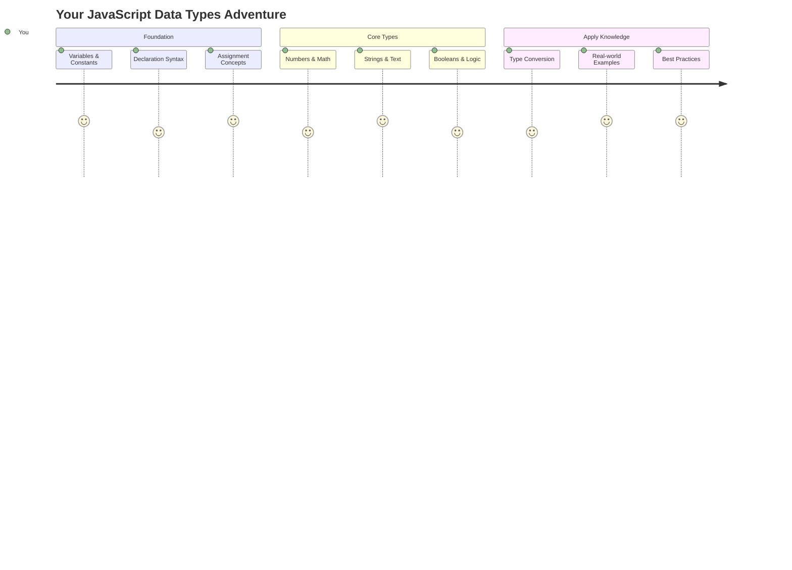

Типы данных — это одна из фундаментальных концепций в JavaScript, с которой вы столкнетесь в каждой программе, которую напишете. Представьте типы данных как систему классификации, которую использовали древние библиотекари в Александрии — у них были отдельные места для свитков с поэзией, математикой и историческими записями. JavaScript организует информацию аналогичным образом, разделяя данные на разные категории.

В этом уроке мы изучим основные типы данных, которые делают JavaScript функциональным. Вы узнаете, как работать с числами, текстом, значениями true/false и поймете, почему выбор правильного типа данных важен для ваших программ. Эти концепции могут показаться абстрактными сначала, но с практикой они станут для вас естественными.

Понимание типов данных сделает все остальное в JavaScript гораздо понятнее. Как архитекторам нужно знать свойства различных строительных материалов перед созданием собора, так и эти основы будут поддерживать все, что вы создадите в будущем.

## Предварительный тест
[Предварительный тест](https://ff-quizzes.netlify.app/web/)

Этот урок охватывает основы JavaScript — языка, который обеспечивает интерактивность в интернете.

> Вы можете пройти этот урок на [Microsoft Learn](https://docs.microsoft.com/learn/modules/web-development-101-variables/?WT.mc_id=academic-77807-sagibbon)!

[](https://youtube.com/watch?v=JNIXfGiDWM8 "Переменные в JavaScript")

[](https://youtube.com/watch?v=AWfA95eLdq8 "Типы данных в JavaScript")

> 🎥 Нажмите на изображения выше, чтобы посмотреть видео о переменных и типах данных

Начнем с переменных и типов данных, которые их наполняют!

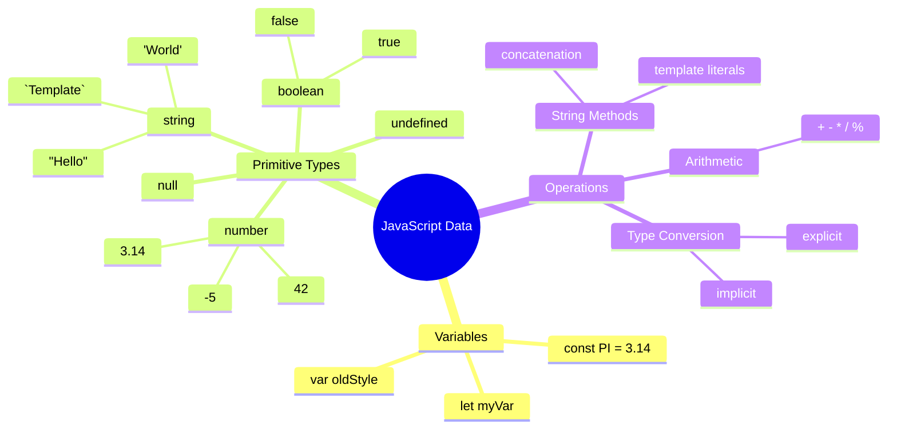

## Переменные

Переменные — это фундаментальные строительные блоки программирования. Как банки с этикетками, которые средневековые алхимики использовали для хранения различных веществ, переменные позволяют хранить информацию и давать ей описательное имя, чтобы вы могли ссылаться на нее позже. Нужно запомнить возраст человека? Сохраните его в переменной `age`. Хотите запомнить имя пользователя? Сохраните его в переменной `userName`.

Мы сосредоточимся на современном подходе к созданию переменных в JavaScript. Методы, которые вы изучите здесь, представляют собой годы эволюции языка и лучшие практики, разработанные сообществом программистов.

Создание и **объявление** переменной имеет следующий синтаксис **[ключевое слово] [имя]**. Оно состоит из двух частей:

- **Ключевое слово**. Используйте `let` для переменных, которые могут изменяться, или `const` для значений, которые остаются неизменными.
- **Имя переменной**, это описательное имя, которое вы выбираете сами.

✅ Ключевое слово `let` было введено в ES6 и дает вашей переменной так называемую _блочную область видимости_. Рекомендуется использовать `let` или `const` вместо устаревшего ключевого слова `var`. Мы рассмотрим блочные области видимости более подробно в следующих частях.

### Задание - работа с переменными

1. **Объявите переменную**. Начнем с создания нашей первой переменной:

    ```javascript
    let myVariable;
    ```

   **Что это делает:**
   - Это говорит JavaScript создать место для хранения под названием `myVariable`
   - JavaScript выделяет место в памяти для этой переменной
   - Переменная пока не имеет значения (undefined)

2. **Присвойте значение**. Теперь положим что-то в нашу переменную:

    ```javascript
    myVariable = 123;
    ```

   **Как работает присваивание:**
   - Оператор `=` присваивает значение 123 нашей переменной
   - Переменная теперь содержит это значение вместо undefined
   - Вы можете ссылаться на это значение в своем коде, используя `myVariable`

   > Примечание: использование `=` в этом уроке означает, что мы используем "оператор присваивания", чтобы задать значение переменной. Это не обозначает равенство.

3. **Сделайте это умным способом**. На самом деле, давайте объединим эти два шага:

    ```javascript
    let myVariable = 123;
    ```

    **Этот подход более эффективен:**
    - Вы объявляете переменную и присваиваете ей значение в одном выражении
    - Это стандартная практика среди разработчиков
    - Это сокращает длину кода, сохраняя его ясность

4. **Передумайте**. Что если мы захотим сохранить другое число?

   ```javascript
   myVariable = 321;
   ```

   **Понимание переназначения:**
   - Переменная теперь содержит 321 вместо 123
   - Предыдущее значение заменяется — переменные хранят только одно значение за раз
   - Эта изменяемость — ключевая характеристика переменных, объявленных с помощью `let`

   ✅ Попробуйте! Вы можете писать JavaScript прямо в своем браузере. Откройте окно браузера и перейдите в инструменты разработчика. В консоли вы найдете приглашение; введите `let myVariable = 123`, нажмите Enter, затем введите `myVariable`. Что происходит? Обратите внимание, вы узнаете больше об этих концепциях в следующих уроках.

### 🧠 **Проверка мастерства переменных: освоение**

**Посмотрим, как вы чувствуете себя с переменными:**
- Можете ли вы объяснить разницу между объявлением и присваиванием переменной?
- Что произойдет, если вы попытаетесь использовать переменную до ее объявления?
- Когда вы выберете `let` вместо `const` для переменной?

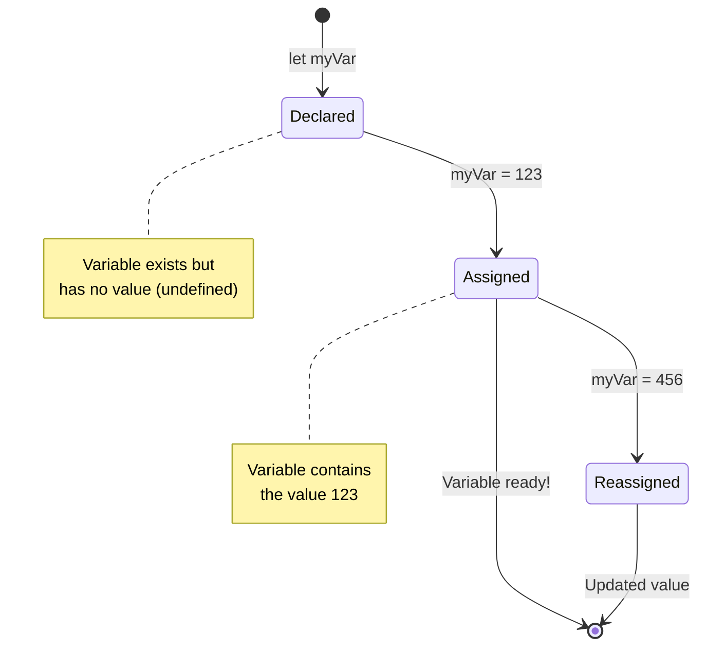

> **Быстрый совет**: Представьте переменные как коробки для хранения с этикетками. Вы создаете коробку (`let`), кладете в нее что-то (`=`), и позже можете заменить содержимое, если нужно!

## Константы

Иногда вам нужно сохранить информацию, которая не должна изменяться во время выполнения программы. Представьте константы как математические принципы, установленные Евклидом в древней Греции — однажды доказанные и задокументированные, они остаются неизменными для всех будущих ссылок.

Константы работают аналогично переменным, но с важным ограничением: после присвоения значения его нельзя изменить. Эта неизменяемость помогает предотвратить случайные изменения критических значений в вашей программе.

Объявление и инициализация константы следуют тем же принципам, что и переменные, за исключением ключевого слова `const`. Константы обычно объявляются с использованием заглавных букв.

```javascript
const MY_VARIABLE = 123;
```

**Что делает этот код:**
- **Создает** константу с именем `MY_VARIABLE` со значением 123
- **Использует** соглашение об именовании заглавными буквами для констант
- **Предотвращает** любые будущие изменения этого значения

У констант есть два основных правила:

- **Вы должны сразу присвоить им значение** — пустые константы не допускаются!
- **Вы никогда не сможете изменить это значение** — JavaScript выдаст ошибку, если вы попробуете. Давайте посмотрим, что я имею в виду:

   **Простое значение** - Следующее НЕ допускается:
   
      ```javascript
      const PI = 3;
      PI = 4; // не допускается
      ```

   **Что нужно помнить:**
   - **Попытки** переназначить константу вызовут ошибку
   - **Защищает** важные значения от случайных изменений
   - **Обеспечивает** неизменность значения в вашей программе
 
   **Ссылка на объект защищена** - Следующее НЕ допускается:
   
      ```javascript
      const obj = { a: 3 };
      obj = { b: 5 } // не допускается
      ```

   **Понимание этих концепций:**
   - **Предотвращает** замену всего объекта новым
   - **Защищает** ссылку на исходный объект
   - **Сохраняет** идентичность объекта в памяти

    **Значение объекта не защищено** - Следующее ДОПУСКАЕТСЯ:
    
      ```javascript
      const obj = { a: 3 };
      obj.a = 5;  // допускается
      ```

      **Разбор того, что здесь происходит:**
      - **Изменяет** значение свойства внутри объекта
      - **Сохраняет** ту же ссылку на объект
      - **Демонстрирует**, что содержимое объекта может изменяться, пока ссылка остается неизменной

   > Примечание: `const` означает, что ссылка защищена от переназначения. Однако значение не является _неизменяемым_ и может изменяться, особенно если это сложная структура, такая как объект.

## Типы данных

JavaScript организует информацию в разные категории, называемые типами данных. Эта концепция напоминает, как древние ученые классифицировали знания — Аристотель различал разные типы рассуждений, понимая, что логические принципы нельзя одинаково применять к поэзии, математике и естественной философии.

Типы данных важны, потому что разные операции работают с разными видами информации. Так же, как нельзя выполнять арифметические действия с именем человека или упорядочивать алфавитно математическое уравнение, JavaScript требует соответствующего типа данных для каждой операции. Понимание этого предотвращает ошибки и делает ваш код более надежным.

Переменные могут хранить множество различных типов значений, таких как числа и текст. Эти различные типы значений известны как **тип данных**. Типы данных являются важной частью разработки программного обеспечения, так как помогают разработчикам принимать решения о том, как должен быть написан код и как должно работать программное обеспечение. Кроме того, некоторые типы данных имеют уникальные особенности, которые помогают преобразовывать или извлекать дополнительную информацию из значения.

✅ Типы данных также называются примитивами данных JavaScript, так как они являются низкоуровневыми типами данных, предоставляемыми языком. Существует 7 примитивных типов данных: string, number, bigint, boolean, undefined, null и symbol. Потратьте минуту, чтобы визуализировать, что каждый из этих примитивов может представлять. Что такое `zebra`? А `0`? `true`?

### Числа

Числа — это самый простой тип данных в JavaScript. Независимо от того, работаете ли вы с целыми числами, такими как 42, десятичными числами, такими как 3.14, или отрицательными числами, такими как -5, JavaScript обрабатывает их одинаково.

Помните нашу переменную из предыдущего примера? Те 123, которые мы сохранили, на самом деле были числовым типом данных:

```javascript
let myVariable = 123;
```

**Ключевые характеристики:**
- JavaScript автоматически распознает числовые значения
- Вы можете выполнять математические операции с этими переменными
- Не требуется явного указания типа

Переменные могут хранить все типы чисел, включая десятичные или отрицательные числа. Числа также могут использоваться с арифметическими операторами, которые будут рассмотрены в [следующем разделе](../../../../2-js-basics/1-data-types).

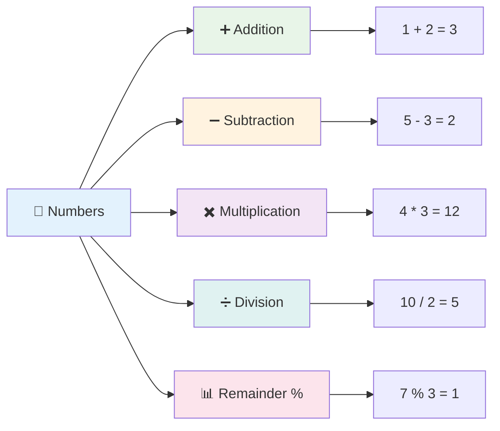

### Арифметические операторы

Арифметические операторы позволяют выполнять математические вычисления в JavaScript. Эти операторы следуют тем же принципам, которые математики использовали веками — те же символы, которые появились в трудах ученых, таких как Аль-Хорезми, разработавший алгебраическую нотацию.

Операторы работают так, как вы ожидаете от традиционной математики: плюс для сложения, минус для вычитания и так далее.

Существует несколько типов операторов, которые можно использовать при выполнении арифметических функций, и некоторые из них перечислены здесь:

| Символ | Описание                                                                 | Пример                           |
| ------ | ------------------------------------------------------------------------ | -------------------------------- |
| `+`    | **Сложение**: вычисляет сумму двух чисел                                | `1 + 2 //ожидаемый ответ 3`      |
| `-`    | **Вычитание**: вычисляет разницу двух чисел                             | `1 - 2 //ожидаемый ответ -1`     |
| `*`    | **Умножение**: вычисляет произведение двух чисел                        | `1 * 2 //ожидаемый ответ 2`      |
| `/`    | **Деление**: вычисляет частное двух чисел                               | `1 / 2 //ожидаемый ответ 0.5`    |
| `%`    | **Остаток**: вычисляет остаток от деления двух чисел                    | `1 % 2 //ожидаемый ответ 1`      |

✅ Попробуйте! Попробуйте выполнить арифметическую операцию в консоли вашего браузера. Удивляют ли вас результаты?

### 🧮 **Проверка математических навыков: уверенные вычисления**

**Проверьте свое понимание арифметики:**
- В чем разница между `/` (деление) и `%` (остаток)?
- Можете ли вы предсказать, чему равно `10 % 3`? (Подсказка: это не 3.33...)
- Почему оператор остатка может быть полезен в программировании?

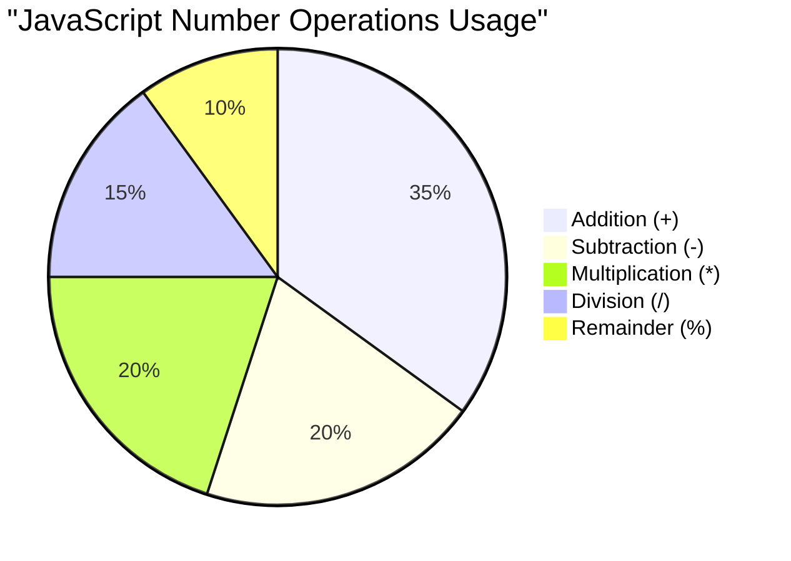

> **Практическое применение**: Оператор остатка (%) очень полезен для проверки четности/нечетности чисел, создания шаблонов или циклического перебора массивов!

### Строки

В JavaScript текстовые данные представлены в виде строк. Термин "строка" происходит от концепции символов, соединенных в последовательности, как монахи в средневековых монастырях соединяли буквы, чтобы формировать слова и предложения в своих рукописях.

Строки являются основой веб-разработки. Каждый текст, отображаемый на сайте — имена пользователей, метки кнопок, сообщения об ошибках, контент — обрабатывается как строковые данные. Понимание строк необходимо для создания функциональных пользовательских интерфейсов.

Строки — это наборы символов, заключенные в одинарные или двойные кавычки.

```javascript
'This is a string'
"This is also a string"
let myString = 'This is a string value stored in a variable';
```

**Понимание этих концепций:**
- **Использует** либо одинарные кавычки `'`, либо двойные кавычки `"` для определения строк
- **Хранит** текстовые данные, которые могут включать буквы, числа и символы
- **Присваивает** строковые значения переменным для последующего использования
- **Требует** кавычек для отличия текста от имен переменных

Не забудьте использовать кавычки при написании строки, иначе JavaScript предположит, что это имя переменной.

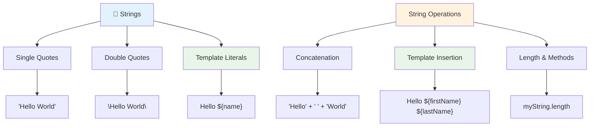

### Форматирование строк

Манипуляция строками позволяет объединять текстовые элементы, включать переменные и создавать динамический контент, который реагирует на состояние программы. Этот метод позволяет программно конструировать текст.

Часто вам нужно объединить несколько строк вместе — этот процесс называется конкатенацией.
Чтобы **объединить** две или более строки, или соединить их вместе, используйте оператор `+`.

```javascript
let myString1 = "Hello";
let myString2 = "World";

myString1 + myString2 + "!"; //HelloWorld!
myString1 + " " + myString2 + "!"; //Hello World!
myString1 + ", " + myString2 + "!"; //Hello, World!
```

**Шаг за шагом, что происходит:**
- **Объединяет** несколько строк с помощью оператора `+`
- **Соединяет** строки напрямую без пробелов в первом примере
- **Добавляет** пробелы `" "` между строками для удобства чтения
- **Вставляет** знаки препинания, такие как запятые, для правильного форматирования

✅ Почему в JavaScript `1 + 1 = 2`, а `'1' + '1' = 11`? Подумайте. А как насчет `'1' + 1`?

**Шаблонные литералы** — это другой способ форматирования строк, вместо кавычек используется обратный апостроф. Все, что не является обычным текстом, должно быть помещено в плейсхолдеры `${ }`. Это включает любые переменные, которые могут быть строками.

```javascript
let myString1 = "Hello";
let myString2 = "World";

`${myString1} ${myString2}!` //Hello World!
`${myString1}, ${myString2}!` //Hello, World!
```

**Давайте разберем каждую часть:**
- **Использует** обратные апострофы `` ` `` вместо обычных кавычек для создания шаблонных литералов
- **Встраивает** переменные напрямую с помощью синтаксиса плейсхолдера `${}`
- **Сохраняет** пробелы и форматирование точно так, как написано
- **Предоставляет** более удобный способ создания сложных строк с переменными

Вы можете достичь своих целей форматирования любым методом, но шаблонные литералы сохраняют пробелы и переносы строк.

✅ Когда вы бы использовали шаблонный литерал вместо обычной строки?

### 🔤 **Проверка мастерства работы со строками: уверенность в манипуляции текстом**

**Оцените свои навыки работы со строками:**
- Можете ли вы объяснить, почему `'1' + '1'` равно `'11'`, а не `2`?
- Какой метод работы со строками вы считаете более удобным: конкатенация или шаблонные литералы?
- Что произойдет, если вы забудете кавычки вокруг строки?

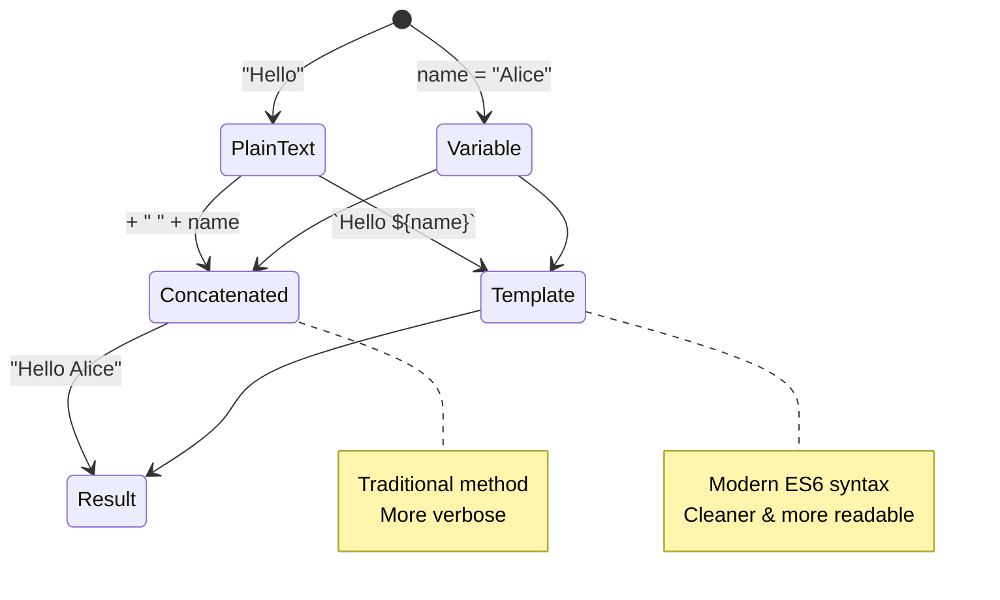

> **Совет профессионала**: Шаблонные литералы обычно предпочтительнее для создания сложных строк, так как они более читаемы и отлично справляются с многострочными строками!

### Булевы значения

Булевы значения представляют собой самую простую форму данных: они могут содержать только одно из двух значений – `true` или `false`. Эта система двоичной логики восходит к работам Джорджа Буля, математика XIX века, который разработал булеву алгебру.

Несмотря на свою простоту, булевы значения являются основой логики программирования. Они позволяют вашему коду принимать решения на основе условий – например, вошел ли пользователь в систему, была ли нажата кнопка или выполнены ли определенные критерии.

Булевы значения могут быть только двух типов: `true` или `false`. Они помогают определить, какие строки кода должны выполняться при выполнении определенных условий. Во многих случаях [операторы](../../../../2-js-basics/1-data-types) помогают установить значение булевой переменной, и вы часто будете замечать и писать переменные, которые инициализируются или их значения обновляются с помощью оператора.

```javascript
let myTrueBool = true;
let myFalseBool = false;
```

**В приведенном выше примере мы:**
- **Создали** переменную, которая хранит булево значение `true`
- **Показали**, как хранить булево значение `false`
- **Использовали** точные ключевые слова `true` и `false` (без кавычек)
- **Подготовили** эти переменные для использования в условных операторах

✅ Переменная может считаться "истинной" (truthy), если она оценивается как булево значение `true`. Интересно, что в JavaScript [все значения считаются истинными, если они не определены как ложные](https://developer.mozilla.org/docs/Glossary/Truthy).

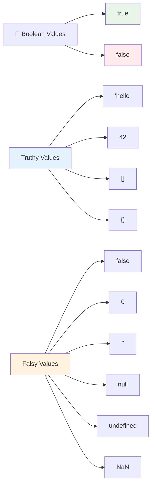

### 🎯 **Проверка логики булевых значений: навыки принятия решений**

**Проверьте свое понимание булевых значений:**
- Почему, по вашему мнению, в JavaScript существуют значения "истинности" и "ложности" помимо просто `true` и `false`?
- Можете ли вы предсказать, какие из этих значений являются ложными: `0`, `"0"`, `[]`, `"false"`?
- Как булевы значения могут быть полезны для управления потоком программы?

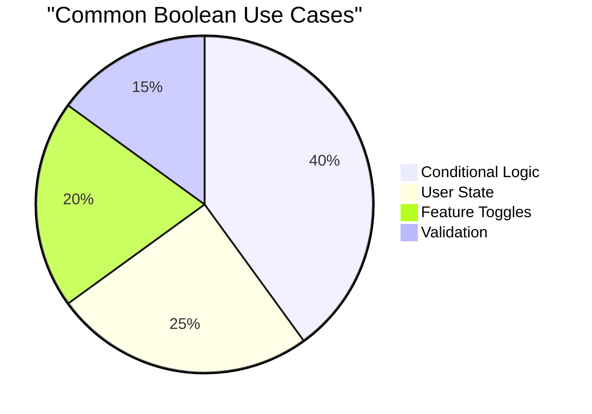

> **Помните**: В JavaScript только 6 значений являются ложными: `false`, `0`, `""`, `null`, `undefined` и `NaN`. Все остальное считается истинным!

---

## 📊 **Резюме вашего инструментария типов данных**

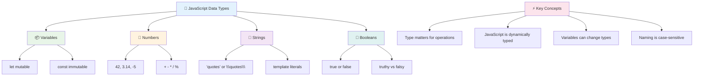

## Вызов GitHub Copilot Agent 🚀

Используйте режим Agent, чтобы выполнить следующий вызов:

**Описание:** Создайте менеджер персональной информации, который демонстрирует все типы данных JavaScript, изученные в этом уроке, при работе с реальными сценариями данных.

**Задание:** Напишите программу на JavaScript, которая создает объект профиля пользователя, содержащий: имя человека (строка), возраст (число), статус студента (булево значение), любимые цвета в виде массива и объект адреса с улицей, городом и почтовым индексом. Включите функции для отображения информации профиля и обновления отдельных полей. Обязательно продемонстрируйте конкатенацию строк, шаблонные литералы, арифметические операции с возрастом и булеву логику для статуса студента.

Узнайте больше о [режиме Agent](https://code.visualstudio.com/blogs/2025/02/24/introducing-copilot-agent-mode) здесь.

## 🚀 Вызов

JavaScript имеет некоторые особенности, которые могут удивить разработчиков. Вот классический пример для изучения: попробуйте ввести это в консоли вашего браузера: `let age = 1; let Age = 2; age == Age` и посмотрите результат. Он возвращает `false` – можете ли вы определить, почему?

Это один из многих аспектов поведения JavaScript, которые стоит понять. Знание этих особенностей поможет вам писать более надежный код и эффективно устранять ошибки.

## Викторина после лекции
[Викторина после лекции](https://ff-quizzes.netlify.app)

## Обзор и самостоятельное изучение

Посмотрите [этот список упражнений по JavaScript](https://css-tricks.com/snippets/javascript/) и попробуйте одно из них. Что вы узнали?

## Задание

[Практика типов данных](assignment.md)

## 🚀 Ваш таймлайн освоения типов данных JavaScript

### ⚡ **Что вы можете сделать за следующие 5 минут**
- [ ] Откройте консоль браузера и создайте 3 переменные с разными типами данных
- [ ] Попробуйте вызов: `let age = 1; let Age = 2; age == Age` и выясните, почему это `false`
- [ ] Попрактикуйтесь в конкатенации строк с вашим именем и любимым числом
- [ ] Проверьте, что произойдет, если вы добавите число к строке

### 🎯 **Что вы можете достичь за этот час**
- [ ] Пройдите викторину после урока и разберитесь с любыми непонятными концепциями
- [ ] Создайте мини-калькулятор, который складывает, вычитает, умножает и делит два числа
- [ ] Постройте простой форматировщик имени с использованием шаблонных литералов
- [ ] Исследуйте различия между операторами сравнения `==` и `===`
- [ ] Попрактикуйтесь в преобразовании между различными типами данных

### 📅 **Ваш недельный фундамент JavaScript**
- [ ] Выполните задание с уверенностью и творческим подходом
- [ ] Создайте объект профиля пользователя, используя все изученные типы данных
- [ ] Попрактикуйтесь с [упражнениями по JavaScript от CSS-Tricks](https://css-tricks.com/snippets/javascript/)
- [ ] Постройте простой валидатор формы, используя булеву логику
- [ ] Экспериментируйте с массивами и объектами (предварительный просмотр следующих уроков)
- [ ] Присоединитесь к сообществу JavaScript и задавайте вопросы о типах данных

### 🌟 **Ваш месячный путь трансформации**
- [ ] Интегрируйте знания о типах данных в более крупные программные проекты
- [ ] Поймите, когда и почему использовать каждый тип данных в реальных приложениях
- [ ] Помогайте другим новичкам понять основы JavaScript
- [ ] Постройте небольшое приложение, которое управляет различными типами пользовательских данных
- [ ] Изучите сложные концепции типов данных, такие как приведение типов и строгая эквивалентность
- [ ] Вносите вклад в проекты с открытым исходным кодом на JavaScript, улучшая документацию

### 🧠 **Итоговая проверка мастерства типов данных**

**Отпразднуйте свои основы JavaScript:**
- Какой тип данных удивил вас больше всего своим поведением?
- Насколько комфортно вы чувствуете себя, объясняя переменные и константы другу?
- Что самое интересное вы узнали о системе типов JavaScript?
- Какое реальное приложение вы можете представить, используя эти основы?

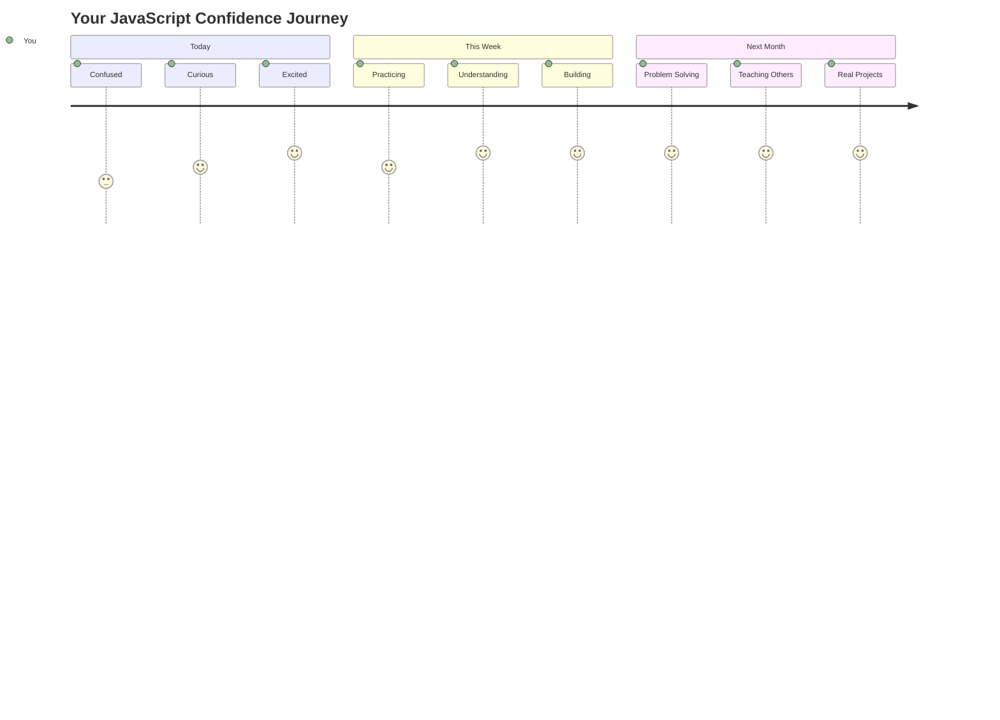

> 💡 **Вы заложили основу!** Понимание типов данных — это как изучение алфавита перед написанием рассказов. Каждая программа на JavaScript, которую вы когда-либо напишете, будет использовать эти фундаментальные концепции. Теперь у вас есть строительные блоки для создания интерактивных веб-сайтов, динамических приложений и решения реальных задач с помощью кода. Добро пожаловать в удивительный мир JavaScript! 🎉

---

**Отказ от ответственности**:  
Этот документ был переведен с использованием сервиса автоматического перевода [Co-op Translator](https://github.com/Azure/co-op-translator). Несмотря на наши усилия обеспечить точность перевода, автоматические переводы могут содержать ошибки или неточности. Оригинальный документ на его родном языке следует считать авторитетным источником. Для получения критически важной информации рекомендуется профессиональный перевод человеком. Мы не несем ответственности за любые недоразумения или неправильные интерпретации, возникшие в результате использования данного перевода.