# Основы JavaScript: Методы и функции

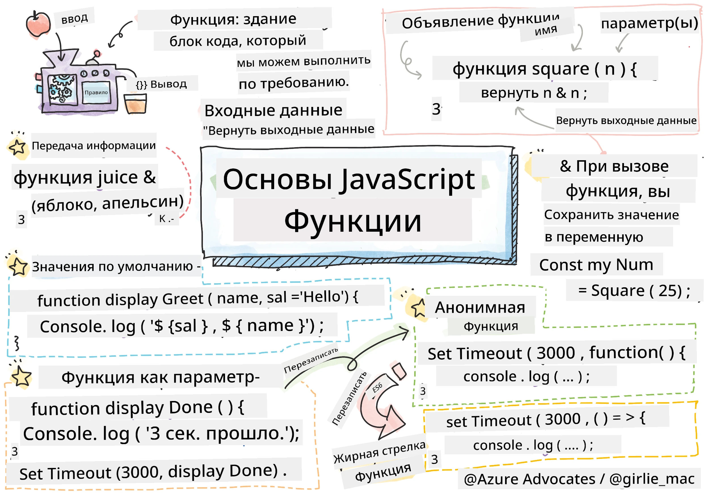
> Скетчноут от [Tomomi Imura](https://twitter.com/girlie_mac)

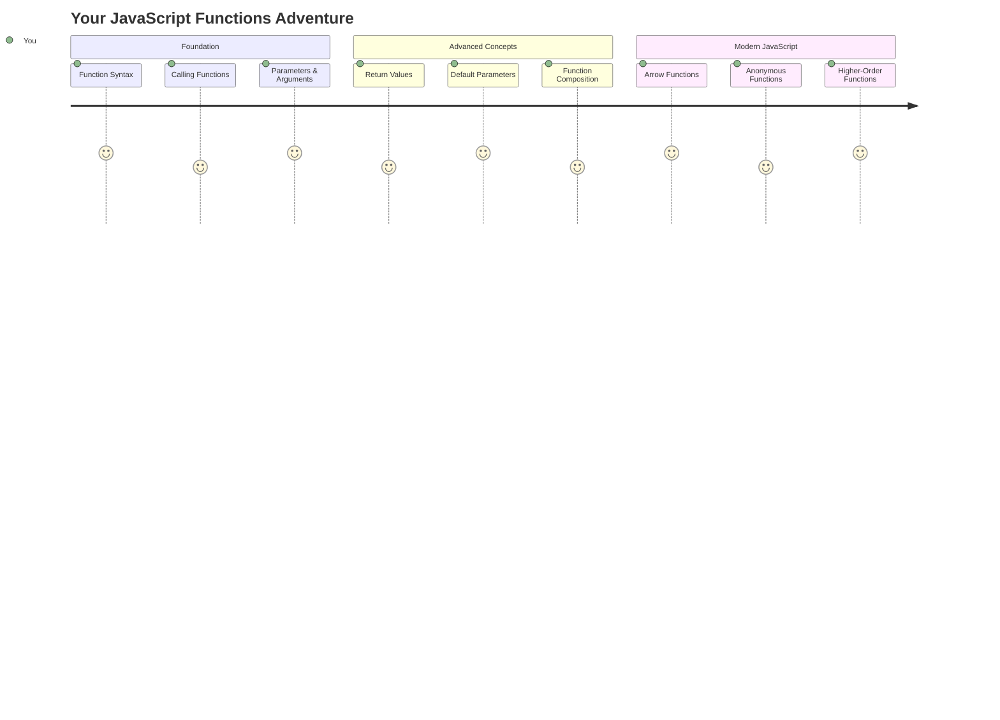

## Викторина перед лекцией
[Викторина перед лекцией](https://ff-quizzes.netlify.app)

Повторение одного и того же кода снова и снова — одна из самых распространенных проблем в программировании. Функции решают эту проблему, позволяя упаковать код в блоки, которые можно использовать повторно. Представьте функции как стандартизированные детали, которые сделали революцию на конвейере Генри Форда — создав надежный компонент, вы можете использовать его где угодно, не создавая заново.

Функции позволяют объединить части кода, чтобы использовать их в разных местах программы. Вместо того чтобы копировать и вставлять одну и ту же логику, вы можете создать функцию один раз и вызывать ее по мере необходимости. Такой подход упрощает организацию кода и делает его обновление гораздо проще.

В этом уроке вы научитесь создавать собственные функции, передавать им информацию и получать полезные результаты. Вы узнаете разницу между функциями и методами, изучите современные подходы к синтаксису и увидите, как функции могут взаимодействовать друг с другом. Мы будем изучать эти концепции шаг за шагом.

[](https://youtube.com/watch?v=XgKsD6Zwvlc "Методы и функции")

> 🎥 Нажмите на изображение выше, чтобы посмотреть видео о методах и функциях.

> Вы можете пройти этот урок на [Microsoft Learn](https://docs.microsoft.com/learn/modules/web-development-101-functions/?WT.mc_id=academic-77807-sagibbon)!

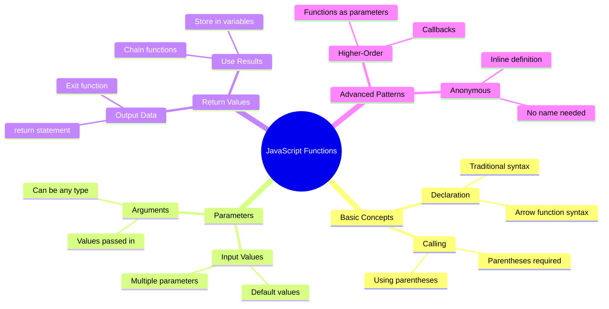

## Функции

Функция — это автономный блок кода, выполняющий определенную задачу. Она инкапсулирует логику, которую можно выполнить в любое время.

Вместо того чтобы писать один и тот же код несколько раз в программе, вы можете упаковать его в функцию и вызывать эту функцию по мере необходимости. Такой подход упрощает код и делает его обновление гораздо проще. Представьте себе сложность обслуживания, если вам нужно изменить логику, разбросанную по 20 различным местам в вашем коде.

Очень важно давать функциям описательные названия. Хорошо названная функция четко передает свою цель — когда вы видите `cancelTimer()`, вы сразу понимаете, что она делает, так же как четко обозначенная кнопка говорит вам, что произойдет при ее нажатии.

## Создание и вызов функции

Давайте рассмотрим, как создать функцию. Синтаксис следует определенному шаблону:

```javascript
function nameOfFunction() { // function definition
 // function definition/body
}
```

Разберем это:
- Ключевое слово `function` говорит JavaScript: "Эй, я создаю функцию!"
- `nameOfFunction` — это место, где вы даете вашей функции описательное название
- Круглые скобки `()` — это место, где можно добавить параметры (мы скоро к этому вернемся)
- Фигурные скобки `{}` содержат фактический код, который выполняется при вызове функции

Давайте создадим простую функцию приветствия, чтобы увидеть это в действии:

```javascript
function displayGreeting() {
  console.log('Hello, world!');
}
```

Эта функция выводит "Hello, world!" в консоль. После того как вы ее определили, вы можете использовать ее столько раз, сколько нужно.

Чтобы выполнить (или "вызвать") вашу функцию, напишите ее имя, за которым следуют круглые скобки. JavaScript позволяет вам определить функцию до или после ее вызова — движок JavaScript сам обработает порядок выполнения.

```javascript
// calling our function
displayGreeting();
```

Когда вы выполните эту строку, она выполнит весь код внутри вашей функции `displayGreeting`, отображая "Hello, world!" в консоли вашего браузера. Вы можете вызывать эту функцию многократно.

### 🧠 **Проверка основ функций: создание первых функций**

**Давайте проверим, как вы усвоили основы функций:**
- Можете ли вы объяснить, почему мы используем фигурные скобки `{}` в определении функций?
- Что произойдет, если вы напишете `displayGreeting` без круглых скобок?
- Почему может быть полезно вызывать одну и ту же функцию несколько раз?

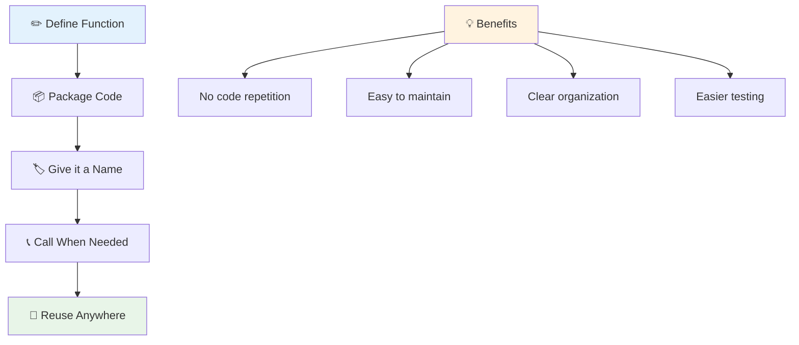

> **Примечание:** На протяжении этих уроков вы использовали **методы**. `console.log()` — это метод, по сути, функция, которая принадлежит объекту `console`. Основное различие заключается в том, что методы привязаны к объектам, а функции существуют независимо. Многие разработчики используют эти термины взаимозаменяемо в неформальных беседах.

### Лучшие практики для функций

Вот несколько советов, которые помогут вам писать отличные функции:

- Давайте вашим функциям четкие, описательные названия — ваш будущий "я" скажет вам спасибо!
- Используйте **camelCase** для названий из нескольких слов (например, `calculateTotal` вместо `calculate_total`)
- Сосредоточьтесь на том, чтобы каждая функция выполняла одну задачу хорошо

## Передача информации в функцию

Наша функция `displayGreeting` ограничена — она может отображать только "Hello, world!" для всех. Параметры позволяют сделать функции более гибкими и полезными.

**Параметры** работают как заполнители, куда можно вставлять разные значения каждый раз, когда вы используете функцию. Таким образом, одна и та же функция может работать с разной информацией при каждом вызове.

Вы перечисляете параметры внутри круглых скобок при определении функции, разделяя несколько параметров запятыми:

```javascript
function name(param, param2, param3) {

}
```

Каждый параметр работает как заполнитель — когда кто-то вызывает вашу функцию, он предоставляет фактические значения, которые вставляются в эти места.

Давайте обновим нашу функцию приветствия, чтобы она принимала имя человека:

```javascript
function displayGreeting(name) {
  const message = `Hello, ${name}!`;
  console.log(message);
}
```

Обратите внимание, как мы используем обратные кавычки (`` ` ``) и `${}` для вставки имени прямо в сообщение — это называется шаблонной строкой, и это очень удобный способ создавать строки с переменными.

Теперь, вызывая нашу функцию, мы можем передать любое имя:

```javascript
displayGreeting('Christopher');
// displays "Hello, Christopher!" when run
```

JavaScript берет строку `'Christopher'`, присваивает ее параметру `name` и создает персонализированное сообщение "Hello, Christopher!"

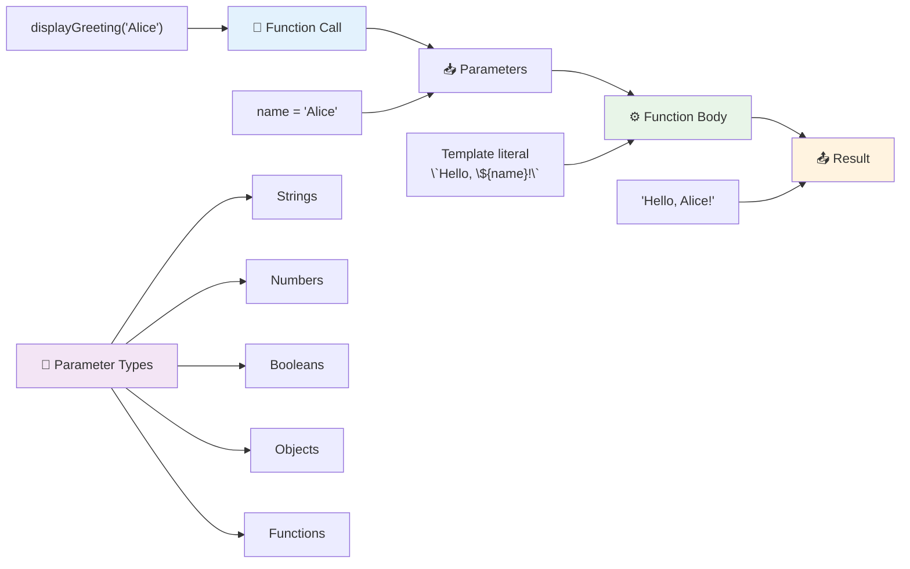

## Значения по умолчанию

Что если мы хотим сделать некоторые параметры необязательными? Здесь на помощь приходят значения по умолчанию!

Предположим, мы хотим, чтобы люди могли настроить слово приветствия, но если они его не укажут, мы просто используем "Hello" как запасной вариант. Вы можете установить значения по умолчанию, используя знак равенства, как при установке переменной:

```javascript
function displayGreeting(name, salutation='Hello') {
  console.log(`${salutation}, ${name}`);
}
```

Здесь `name` все еще обязателен, но `salutation` имеет резервное значение `'Hello'`, если никто не предоставит другое приветствие.

Теперь мы можем вызвать эту функцию двумя способами:

```javascript
displayGreeting('Christopher');
// displays "Hello, Christopher"

displayGreeting('Christopher', 'Hi');
// displays "Hi, Christopher"
```

В первом вызове JavaScript использует значение по умолчанию "Hello", так как мы не указали приветствие. Во втором вызове используется наше собственное "Hi". Эта гибкость делает функции адаптируемыми к различным сценариям.

### 🎛️ **Проверка параметров: делаем функции гибкими**

**Проверьте ваше понимание параметров:**
- В чем разница между параметром и аргументом?
- Почему значения по умолчанию полезны в реальном программировании?
- Можете ли вы предсказать, что произойдет, если передать больше аргументов, чем параметров?

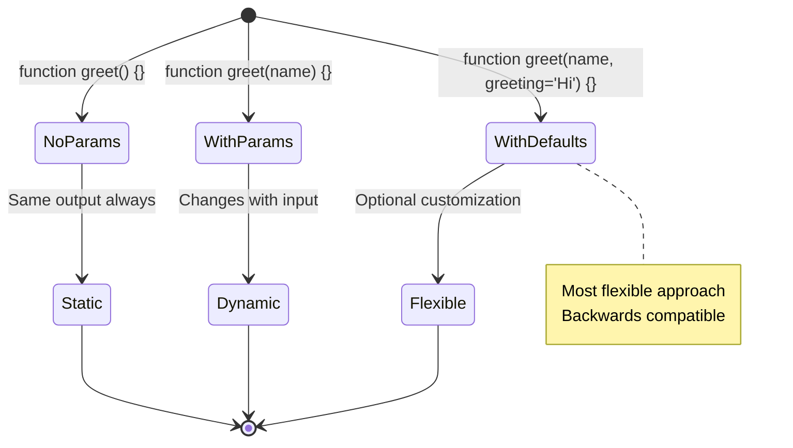

> **Полезный совет**: Значения по умолчанию делают ваши функции более удобными для пользователя. Пользователи могут быстро начать работу с разумными значениями по умолчанию, но при необходимости все равно могут настроить их!

## Возвращаемые значения

Наши функции до сих пор просто выводили сообщения в консоль, но что, если вы хотите, чтобы функция что-то вычисляла и возвращала результат?

Вот где вступают в игру **возвращаемые значения**. Вместо того чтобы просто что-то отображать, функция может вернуть значение, которое вы можете сохранить в переменной или использовать в других частях вашего кода.

Чтобы вернуть значение, используйте ключевое слово `return`, за которым следует то, что вы хотите вернуть:

```javascript
return myVariable;
```

Вот что важно: когда функция достигает оператора `return`, она немедленно прекращает выполнение и возвращает это значение тому, кто вызвал функцию.

Давайте изменим нашу функцию приветствия, чтобы она возвращала сообщение вместо его вывода:

```javascript
function createGreetingMessage(name) {
  const message = `Hello, ${name}`;
  return message;
}
```

Теперь вместо вывода приветствия эта функция создает сообщение и передает его нам.

Чтобы использовать возвращенное значение, мы можем сохранить его в переменной, как любое другое значение:

```javascript
const greetingMessage = createGreetingMessage('Christopher');
```

Теперь `greetingMessage` содержит "Hello, Christopher", и мы можем использовать его где угодно в нашем коде — чтобы отобразить его на веб-странице, включить в электронное письмо или передать другой функции.

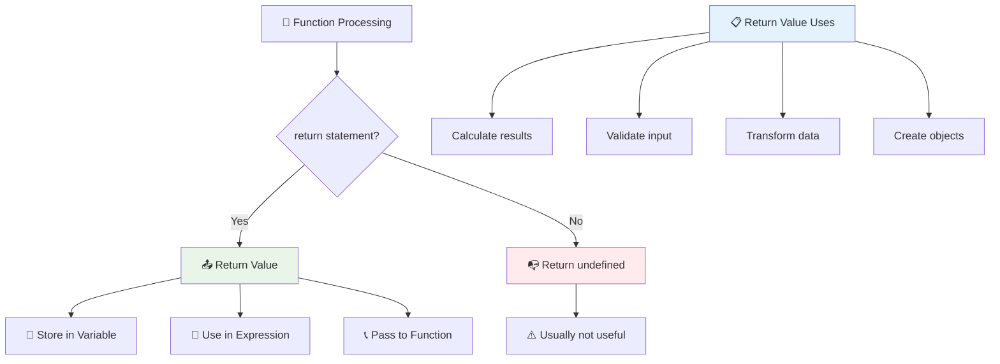

### 🔄 **Проверка возвращаемых значений: получаем результаты**

**Оцените ваше понимание возвращаемых значений:**
- Что происходит с кодом после оператора `return` в функции?
- Почему возвращение значений часто лучше, чем просто вывод в консоль?
- Может ли функция возвращать разные типы значений (строка, число, логическое значение)?

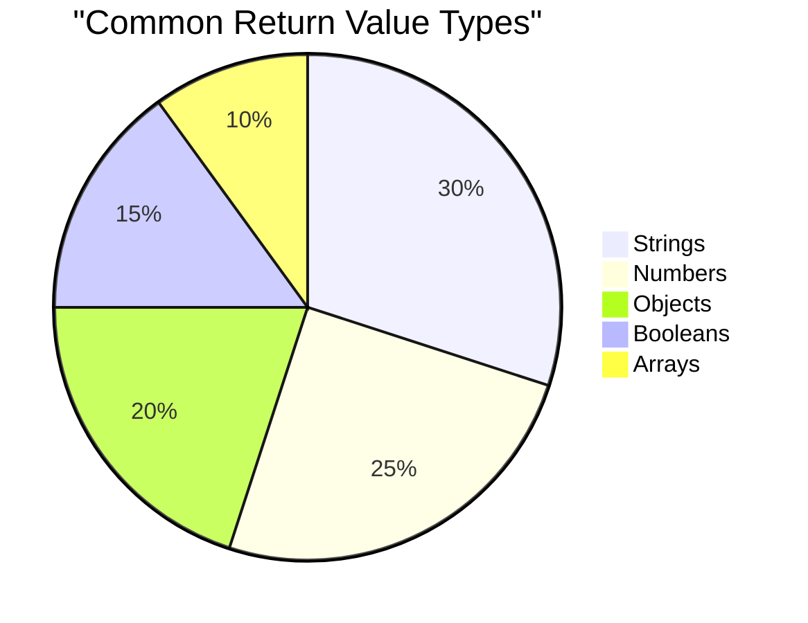

> **Ключевая идея**: Функции, которые возвращают значения, более универсальны, так как вызывающий код решает, что делать с результатом. Это делает ваш код более модульным и удобным для повторного использования!

## Функции как параметры для функций

Функции могут передаваться как параметры другим функциям. Хотя эта концепция может показаться сложной на первый взгляд, это мощная возможность, которая позволяет создавать гибкие шаблоны программирования.

Этот шаблон очень распространен, когда вы хотите сказать: "когда что-то произойдет, сделай это". Например, "когда таймер закончится, выполните этот код" или "когда пользователь нажмет кнопку, вызовите эту функцию".

Давайте рассмотрим `setTimeout`, встроенную функцию, которая ждет определенное время, а затем выполняет некоторый код. Мы должны указать ей, какой код выполнить — идеальный случай для передачи функции!

Попробуйте этот код — через 3 секунды вы увидите сообщение:

```javascript
function displayDone() {
  console.log('3 seconds has elapsed');
}
// timer value is in milliseconds
setTimeout(displayDone, 3000);
```

Обратите внимание, как мы передаем `displayDone` (без круглых скобок) в `setTimeout`. Мы не вызываем функцию сами — мы передаем ее `setTimeout` и говорим: "вызови это через 3 секунды".

### Анонимные функции

Иногда вам нужна функция только для одного действия, и вы не хотите давать ей имя. Подумайте — если вы используете функцию только один раз, зачем загромождать код лишним именем?

JavaScript позволяет создавать **анонимные функции** — функции без имени, которые можно определить прямо там, где они нужны.

Вот как мы можем переписать наш пример с таймером, используя анонимную функцию:

```javascript
setTimeout(function() {
  console.log('3 seconds has elapsed');
}, 3000);
```

Это достигает того же результата, но функция определяется прямо внутри вызова `setTimeout`, исключая необходимость в отдельном объявлении функции.

### Функции-стрелки

Современный JavaScript предлагает еще более краткий способ написания функций, называемый **функциями-стрелками**. Они используют `=>` (что похоже на стрелку — согласны?) и очень популярны среди разработчиков.

Функции-стрелки позволяют пропустить ключевое слово `function` и писать более лаконичный код.

Вот наш пример с таймером, используя функцию-стрелку:

```javascript
setTimeout(() => {
  console.log('3 seconds has elapsed');
}, 3000);
```

`()` — это место, где могли бы быть параметры (в данном случае пусто), затем идет стрелка `=>`, и, наконец, тело функции в фигурных скобках. Это обеспечивает ту же функциональность с более кратким синтаксисом.

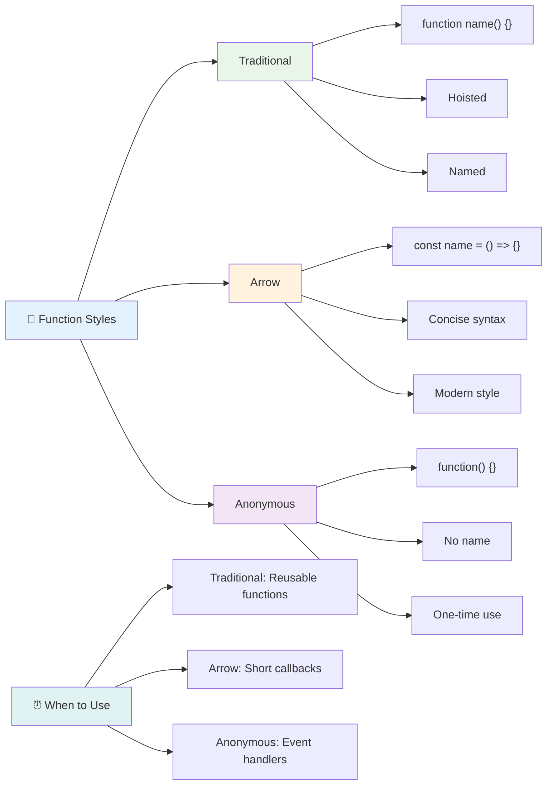

### Когда использовать каждый подход

Когда следует использовать каждый подход? Практическое правило: если вы будете использовать функцию несколько раз, дайте ей имя и определите отдельно. Если она предназначена для одного конкретного использования, рассмотрите анонимную функцию. Оба подхода — функции-стрелки и традиционный синтаксис — являются допустимыми, хотя функции-стрелки широко распространены в современных кодовых базах JavaScript.

### 🎨 **Проверка стилей функций: выбор подходящего синтаксиса**

**Проверьте ваше понимание синтаксиса:**
- Когда вы можете предпочесть функции-стрелки традиционному синтаксису?
- Какое основное преимущество анонимных функций?
- Можете ли вы придумать ситуацию, когда именованная функция лучше, чем анонимная?

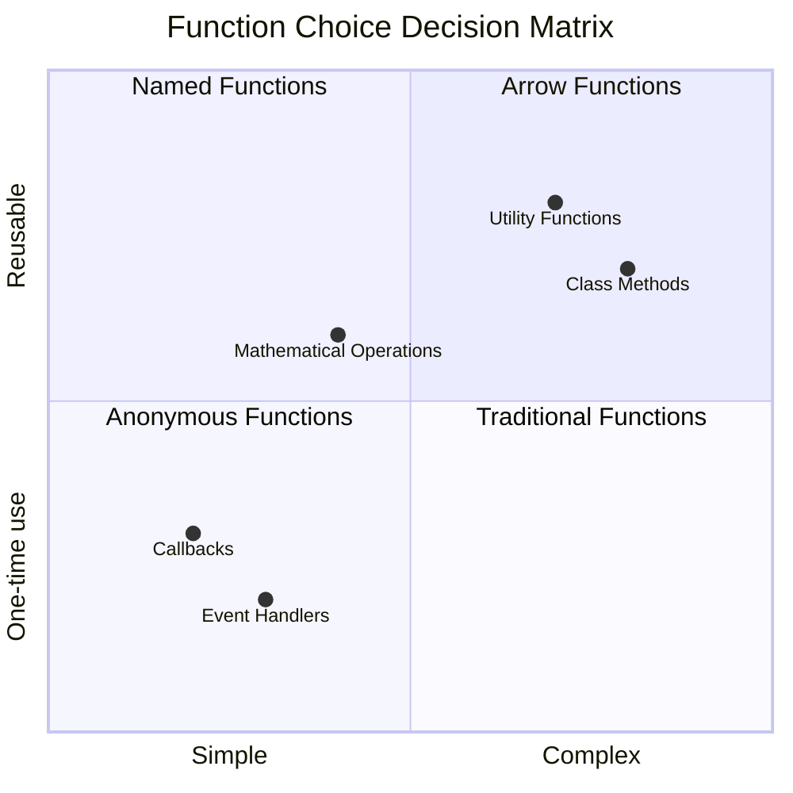

> **Современная тенденция**: Функции-стрелки становятся стандартным выбором для многих разработчиков благодаря их лаконичному синтаксису, но традиционные функции все еще находят свое место!

---


## 🚀 Задание

Можете ли вы сформулировать в одном предложении разницу между функциями и методами? Попробуйте!

## Задание GitHub Copilot Agent 🚀

Используйте режим Agent, чтобы выполнить следующее задание:

**Описание:** Создайте библиотеку утилит математических функций, демонстрирующую различные концепции функций, рассмотренные в этом уроке, включая параметры, значения по умолчанию, возвращаемые значения и функции-стрелки.

**Задание:** Создайте JavaScript-файл под названием `mathUtils.js`, который содержит следующие функции:
1. Функция `add`, принимающая два параметра и возвращающая их сумму
2. Функция `multiply` с параметрами по умолчанию (второй параметр по умолчанию равен 1)
3. Функция-стрелка `square`, принимающая число и возвращающая его квадрат
4. Функция `calculate`, принимающая другую функцию в качестве параметра и два числа, затем применяющая функцию к этим числам
5. Продемонстрируйте вызов каждой функции с соответствующими тестовыми случаями

Узнайте больше о [режиме Agent](https://code.visualstudio.com/blogs/2025/02/24/introducing-copilot-agent-mode) здесь.

## Викторина после лекции
[Викторина после лекции](https://ff-quizzes.netlify.app)

## Обзор и самостоятельное изучение

Стоит [почитать немного больше о функциях-стрелках](https://developer.mozilla.org/docs/Web/JavaScript/Reference/Functions/Arrow_functions), так как они все чаще используются в кодовых базах. Попробуйте написать функцию, а затем переписать ее с использованием этого синтаксиса.

## Задание

[Веселимся с функциями](assignment.md)

---

## 🧰 **Резюме вашего инструментария функций JavaScript**

```mermaid
graph TD
    A["🎯 JavaScript Functions"] --> B["📋 Function Declaration"]
    A --> C["📥 Parameters"]
    A --> D["📤 Return Values"]
    A --> E["🎨 Modern Syntax"]
    
    B --> B1["function name() {}"]
    B --> B2["Descriptive naming"]
    B --> B3["Reusable code blocks"]
    
    C --> C1["Input data"]
    C --> C2["Default values"]
    C --> C3["Multiple parameters"]
    
    D --> D1["return statement"]
    D --> D2["Exit function"]
    D --> D3["Pass data back"]
    
    E --> E1["Arrow functions: () =>"]
    E --> E2["Anonymous functions"]
    E --> E3["Higher-order functions"]
    
    F["⚡ Key Benefits"] --> F1["Code reusability"]
    F --> F2["Better organization"]
    F --> F3["Easier testing"]
    F --> F4["Modular design"]
    
    style A fill:#e3f2fd
    style B fill:#e8f5e8
    style C fill:#fff3e0
    style D fill:#f3e5f5
    style E fill:#e0f2f1
    style F fill:#fce4ec
```

---

## 🚀 Ваш таймлайн освоения функций JavaScript

### ⚡ **Что вы можете сделать за следующие 5 минут**
- [ ] Напишите простую функцию, которая возвращает ваше любимое число
- [ ] Создайте функцию с двумя параметрами, которая складывает их вместе
- [ ] Попробуйте преобразовать традиционную функцию в синтаксис стрелочной функции  
- [ ] Практикуйте задачу: объясните разницу между функциями и методами  

### 🎯 **Что можно успеть за этот час**  
- [ ] Пройти тест после урока и разобрать непонятные моменты  
- [ ] Создать библиотеку математических утилит из задания GitHub Copilot  
- [ ] Написать функцию, которая принимает другую функцию в качестве параметра  
- [ ] Попрактиковаться в написании функций с параметрами по умолчанию  
- [ ] Поэкспериментировать с шаблонными литералами в возвращаемых значениях функций  

### 📅 **Ваш недельный путь к мастерству функций**  
- [ ] Выполнить задание "Веселье с функциями" творчески  
- [ ] Оптимизировать повторяющийся код, преобразовав его в переиспользуемые функции  
- [ ] Создать небольшой калькулятор, используя только функции (без глобальных переменных)  
- [ ] Практиковать стрелочные функции с методами массива, такими как `map()` и `filter()`  
- [ ] Создать коллекцию утилитарных функций для выполнения общих задач  
- [ ] Изучить функции высшего порядка и концепции функционального программирования  

### 🌟 **Ваш месячный путь к трансформации**  
- [ ] Освоить сложные концепции функций, такие как замыкания и области видимости  
- [ ] Создать проект, который активно использует композицию функций  
- [ ] Внести вклад в open source, улучшив документацию по функциям  
- [ ] Научить кого-то другому синтаксису функций и их стилям  
- [ ] Изучить парадигмы функционального программирования в JavaScript  
- [ ] Создать личную библиотеку переиспользуемых функций для будущих проектов  

### 🏆 **Итоговая проверка мастерства функций**

**Отпразднуйте свое мастерство в функциях:**  
- Какая самая полезная функция, которую вы создали?  
- Как изучение функций изменило ваше представление о структуре кода?  
- Какой синтаксис функций вы предпочитаете и почему?  
- Какую реальную проблему вы бы решили, написав функцию?  

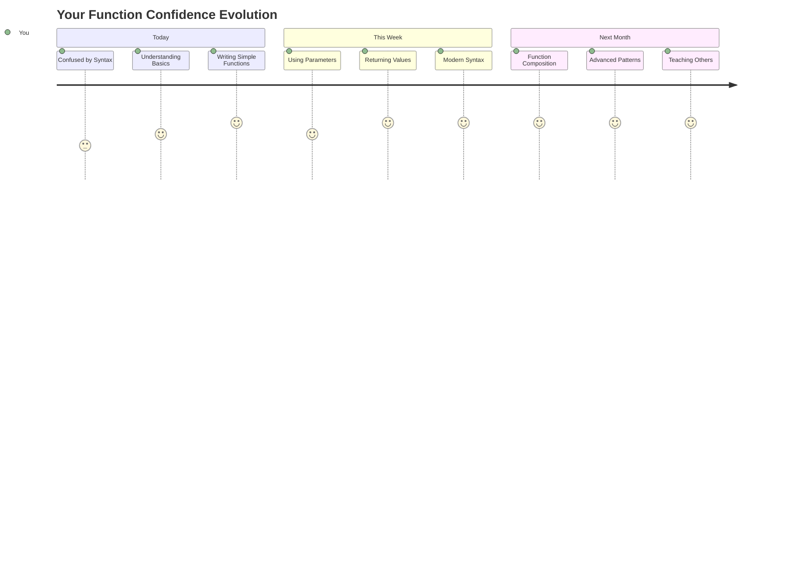
  
> 🎉 **Вы освоили одну из самых мощных концепций программирования!** Функции — это строительные блоки больших программ. Каждое приложение, которое вы когда-либо создадите, будет использовать функции для организации, повторного использования и структурирования кода. Теперь вы понимаете, как упаковывать логику в переиспользуемые компоненты, что делает вас более эффективным и продуктивным программистом. Добро пожаловать в мир модульного программирования! 🚀  

---

**Отказ от ответственности**:  
Этот документ был переведен с использованием сервиса автоматического перевода [Co-op Translator](https://github.com/Azure/co-op-translator). Несмотря на наши усилия обеспечить точность, автоматические переводы могут содержать ошибки или неточности. Оригинальный документ на его родном языке следует считать авторитетным источником. Для получения критически важной информации рекомендуется профессиональный перевод человеком. Мы не несем ответственности за любые недоразумения или неправильные интерпретации, возникающие в результате использования данного перевода.