<!--
CO_OP_TRANSLATOR_METADATA:
{
  "original_hash": "c688385d15dd3645e924ea0ffee8967f",
  "translation_date": "2025-11-03T23:13:01+00:00",
  "source_file": "2-js-basics/3-making-decisions/README.md",
  "language_code": "ru"
}
-->
# Основы JavaScript: принятие решений

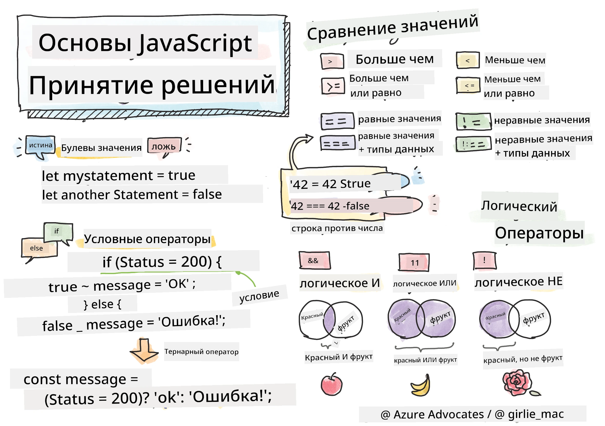

> Скетчноут от [Tomomi Imura](https://twitter.com/girlie_mac)

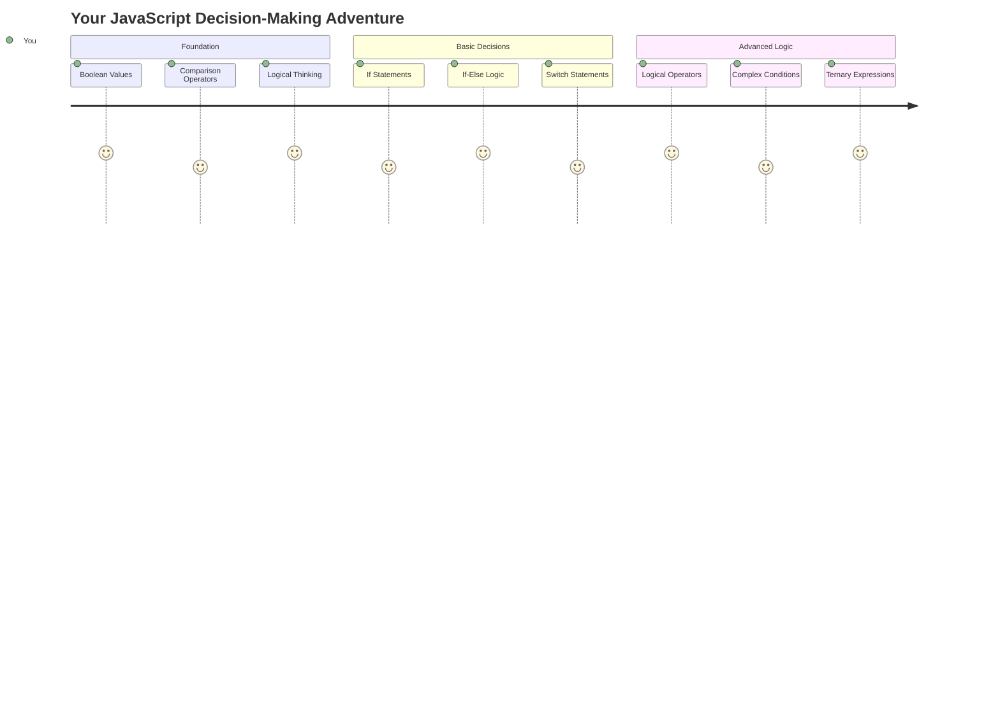

Вы когда-нибудь задумывались, как приложения принимают умные решения? Например, как навигационная система выбирает самый быстрый маршрут или как термостат решает, когда включить отопление? Это фундаментальная концепция принятия решений в программировании.

Точно так же, как Аналитическая машина Чарльза Бэббиджа была разработана для выполнения различных последовательностей операций в зависимости от условий, современные программы на JavaScript должны принимать решения, основываясь на изменяющихся обстоятельствах. Эта способность ветвиться и принимать решения превращает статичный код в отзывчивые, интеллектуальные приложения.

В этом уроке вы узнаете, как реализовать условную логику в своих программах. Мы изучим условные операторы, операторы сравнения и логические выражения, которые позволяют вашему коду оценивать ситуации и реагировать соответствующим образом.

## Тест перед лекцией

[Тест перед лекцией](https://ff-quizzes.netlify.app/web/quiz/11)

Способность принимать решения и управлять потоком программы является фундаментальным аспектом программирования. В этом разделе рассматривается, как управлять путем выполнения ваших программ на JavaScript с использованием булевых значений и условной логики.

[](https://youtube.com/watch?v=SxTp8j-fMMY "Принятие решений")

> 🎥 Нажмите на изображение выше, чтобы посмотреть видео о принятии решений.

> Вы можете пройти этот урок на [Microsoft Learn](https://docs.microsoft.com/learn/modules/web-development-101-if-else/?WT.mc_id=academic-77807-sagibbon)!

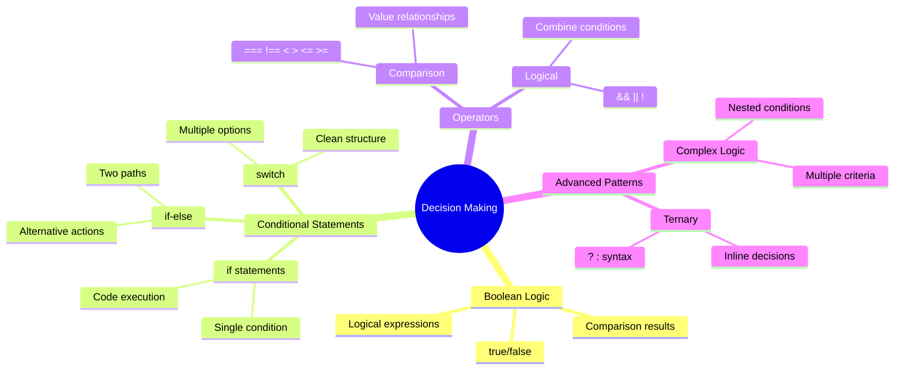

## Краткий обзор булевых значений

Перед изучением принятия решений давайте вспомним булевые значения из нашего предыдущего урока. Названные в честь математика Джорджа Буля, эти значения представляют собой бинарные состояния – либо `true`, либо `false`. Никакой двусмысленности, никакой середины.

Эти бинарные значения составляют основу всей вычислительной логики. Каждое решение, которое принимает ваша программа, в конечном итоге сводится к булевой оценке.

Создание булевых переменных довольно просто:

```javascript
let myTrueBool = true;
let myFalseBool = false;
```

Это создает две переменные с явными булевыми значениями.

✅ Булевые значения названы в честь английского математика, философа и логика Джорджа Буля (1815–1864).

## Операторы сравнения и булевые значения

На практике вы редко будете задавать булевые значения вручную. Вместо этого вы будете генерировать их, оценивая условия: «Это число больше другого?» или «Эти значения равны?»

Операторы сравнения позволяют выполнять такие оценки. Они сравнивают значения и возвращают булевые результаты на основе отношений между операндами.

| Символ | Описание                                                                                                                                                   | Пример             |
| ------ | ---------------------------------------------------------------------------------------------------------------------------------------------------------- | ------------------ |
| `<`    | **Меньше чем**: сравнивает два значения и возвращает булевое значение `true`, если значение слева меньше значения справа                                   | `5 < 6 // true`    |
| `<=`   | **Меньше или равно**: сравнивает два значения и возвращает булевое значение `true`, если значение слева меньше или равно значению справа                   | `5 <= 6 // true`   |
| `>`    | **Больше чем**: сравнивает два значения и возвращает булевое значение `true`, если значение слева больше значения справа                                   | `5 > 6 // false`   |
| `>=`   | **Больше или равно**: сравнивает два значения и возвращает булевое значение `true`, если значение слева больше или равно значению справа                   | `5 >= 6 // false`  |
| `===`  | **Строгое равенство**: сравнивает два значения и возвращает булевое значение `true`, если значения справа и слева равны И имеют одинаковый тип данных      | `5 === 6 // false` |
| `!==`  | **Неравенство**: сравнивает два значения и возвращает противоположное булевое значение тому, что вернул бы оператор строгого равенства                    | `5 !== 6 // true`  |

✅ Проверьте свои знания, написав несколько сравнений в консоли браузера. Удивил ли вас какой-либо возвращенный результат?

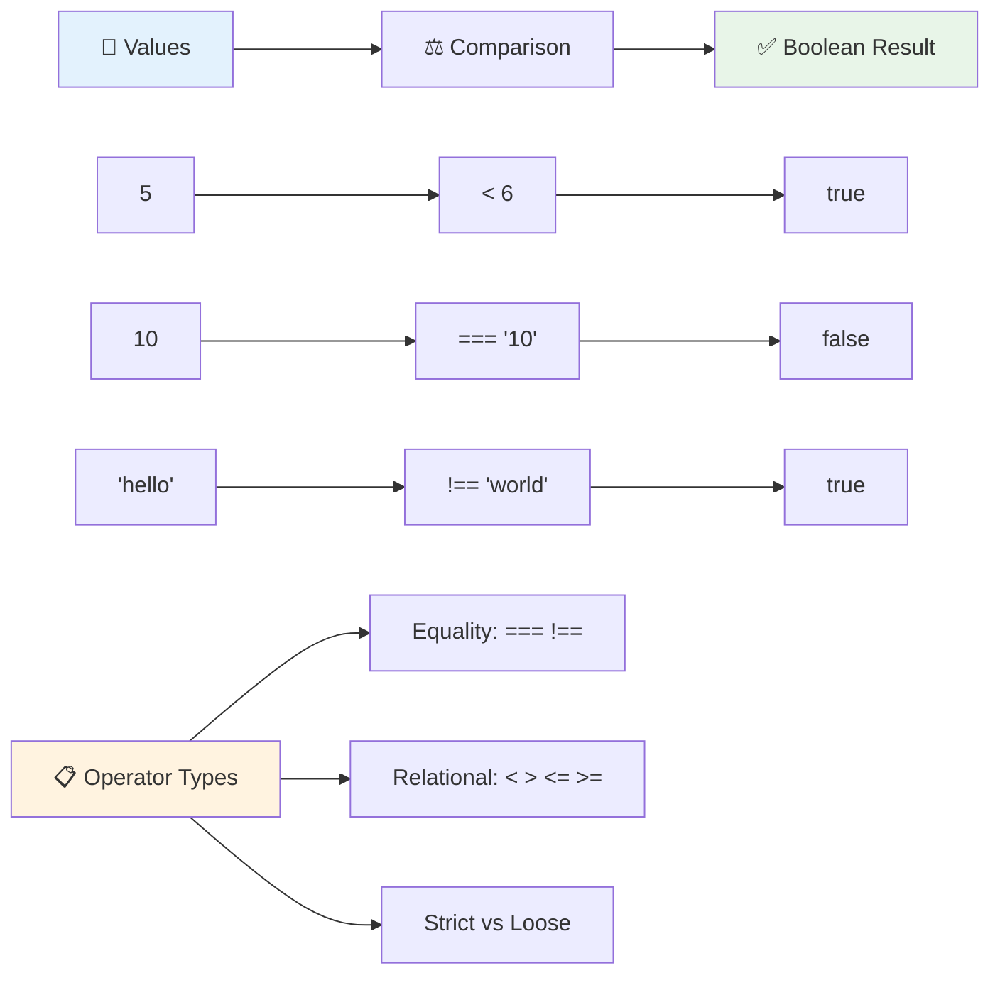

### 🧠 **Проверка мастерства сравнения: понимание булевой логики**

**Проверьте свое понимание сравнения:**
- Почему, по вашему мнению, `===` (строгое равенство) обычно предпочтительнее, чем `==` (нестрогое равенство)?
- Можете ли вы предсказать, что вернет `5 === '5'`? А как насчет `5 == '5'`?
- В чем разница между `!==` и `!=`?

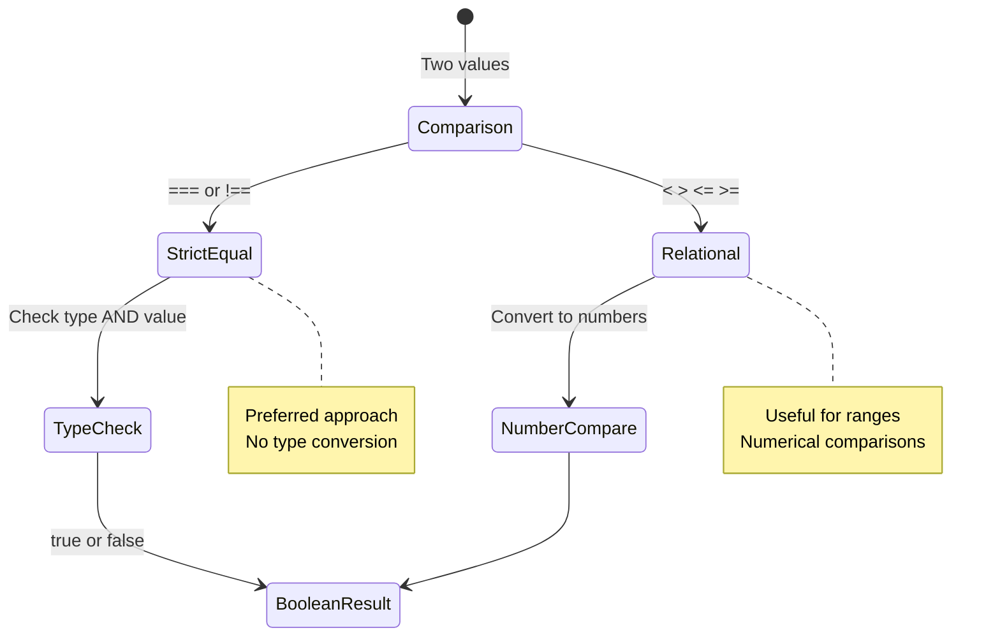

> **Полезный совет**: Всегда используйте `===` и `!==` для проверки равенства, если вам не нужно специально преобразовывать типы. Это предотвращает неожиданное поведение!

## Оператор if

Оператор `if` похож на вопрос в вашем коде. «Если это условие истинно, то сделай это». Это, вероятно, самый важный инструмент, который вы будете использовать для принятия решений в JavaScript.

Вот как это работает:

```javascript
if (condition) {
  // Condition is true. Code in this block will run.
}
```

Условие помещается в круглые скобки, и если оно равно `true`, JavaScript выполняет код внутри фигурных скобок. Если оно равно `false`, JavaScript просто пропускает весь этот блок.

Вы часто будете использовать операторы сравнения для создания этих условий. Давайте посмотрим практический пример:

```javascript
let currentMoney = 1000;
let laptopPrice = 800;

if (currentMoney >= laptopPrice) {
  // Condition is true. Code in this block will run.
  console.log("Getting a new laptop!");
}
```

Поскольку `1000 >= 800` оценивается как `true`, код внутри блока выполняется, выводя в консоль «Покупаю новый ноутбук!».

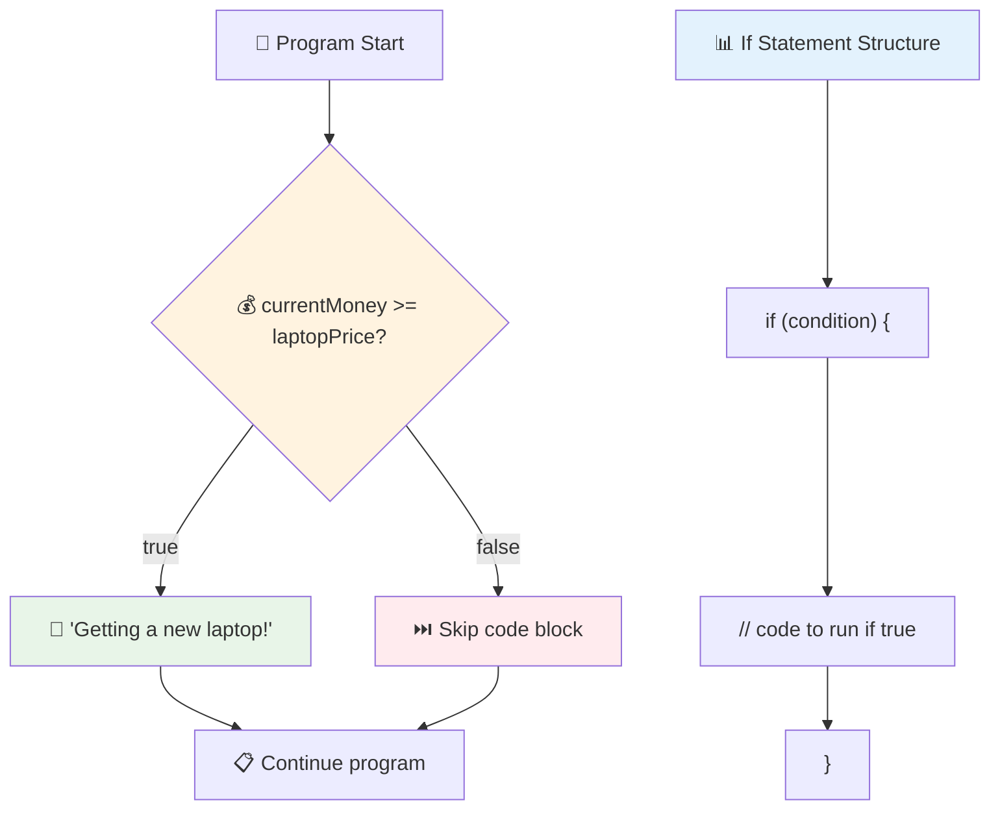

## Оператор if..else

Но что, если вы хотите, чтобы ваша программа делала что-то другое, когда условие ложно? Вот тут-то и появляется `else` – это как запасной план.

Оператор `else` дает вам возможность сказать: «Если это условие не истинно, сделай вместо этого что-то другое».

```javascript
let currentMoney = 500;
let laptopPrice = 800;

if (currentMoney >= laptopPrice) {
  // Condition is true. Code in this block will run.
  console.log("Getting a new laptop!");
} else {
  // Condition is false. Code in this block will run.
  console.log("Can't afford a new laptop, yet!");
}
```

Теперь, поскольку `500 >= 800` равно `false`, JavaScript пропускает первый блок и вместо этого выполняет блок `else`. В консоли вы увидите: «Пока не могу позволить себе новый ноутбук!».

✅ Проверьте свое понимание этого кода и следующего кода, запустив его в консоли браузера. Измените значения переменных currentMoney и laptopPrice, чтобы изменить возвращаемый `console.log()`.

### 🎯 **Проверка логики if-else: ветвление путей**

**Оцените свое понимание условной логики:**
- Что произойдет, если `currentMoney` будет точно равен `laptopPrice`?
- Можете ли вы придумать реальную ситуацию, где логика if-else была бы полезна?
- Как вы могли бы расширить это, чтобы учитывать несколько диапазонов цен?

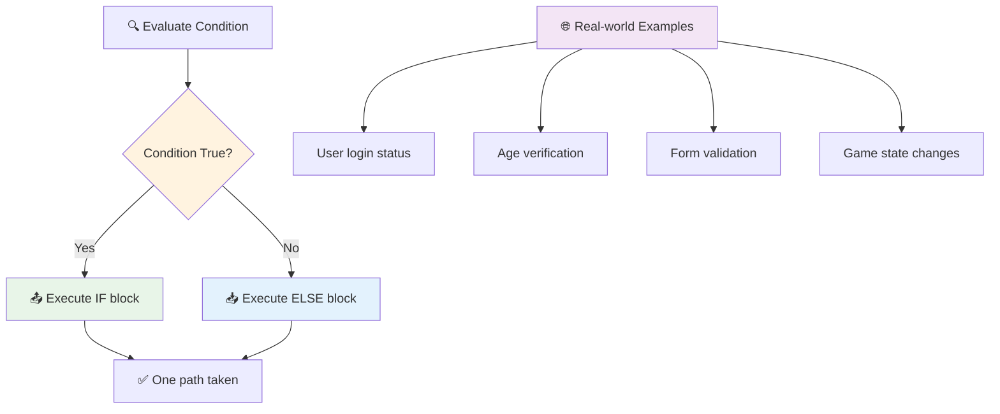

> **Ключевая идея**: If-else гарантирует, что будет выбран только один путь. Это гарантирует, что ваша программа всегда будет реагировать на любое условие!

## Оператор switch

Иногда вам нужно сравнить одно значение с несколькими вариантами. Хотя вы могли бы связать несколько операторов `if..else`, такой подход становится громоздким. Оператор `switch` предоставляет более чистую структуру для обработки нескольких дискретных значений.

Концепция напоминает механические переключающие системы, использовавшиеся в ранних телефонных станциях – одно входное значение определяет, какой конкретный путь выполнения будет выбран.

```javascript
switch (expression) {
  case x:
    // code block
    break;
  case y:
    // code block
    break;
  default:
    // code block
}
```

Вот как это устроено:
- JavaScript оценивает выражение один раз
- Оно просматривает каждый `case`, чтобы найти совпадение
- Когда оно находит совпадение, выполняется соответствующий блок кода
- `break` говорит JavaScript остановиться и выйти из switch
- Если ни один из случаев не совпадает, выполняется блок `default` (если он есть)

```javascript
// Program using switch statement for day of week
let dayNumber = 2;
let dayName;

switch (dayNumber) {
  case 1:
    dayName = "Monday";
    break;
  case 2:
    dayName = "Tuesday";
    break;
  case 3:
    dayName = "Wednesday";
    break;
  default:
    dayName = "Unknown day";
    break;
}
console.log(`Today is ${dayName}`);
```

В этом примере JavaScript видит, что `dayNumber` равен `2`, находит совпадающий `case 2`, устанавливает `dayName` как «Вторник», а затем выходит из switch. Результат? В консоли отображается «Сегодня вторник».

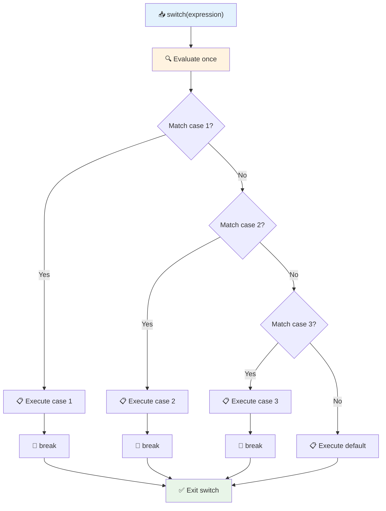

✅ Проверьте свое понимание этого кода и следующего кода, запустив его в консоли браузера. Измените значения переменной a, чтобы изменить возвращаемый `console.log()`.

### 🔄 **Мастерство switch: множество вариантов**

**Проверьте свое понимание switch:**
- Что произойдет, если вы забудете оператор `break`?
- Когда вы бы использовали `switch` вместо нескольких операторов if-else?
- Почему блок `default` полезен, даже если вы думаете, что учли все возможности?

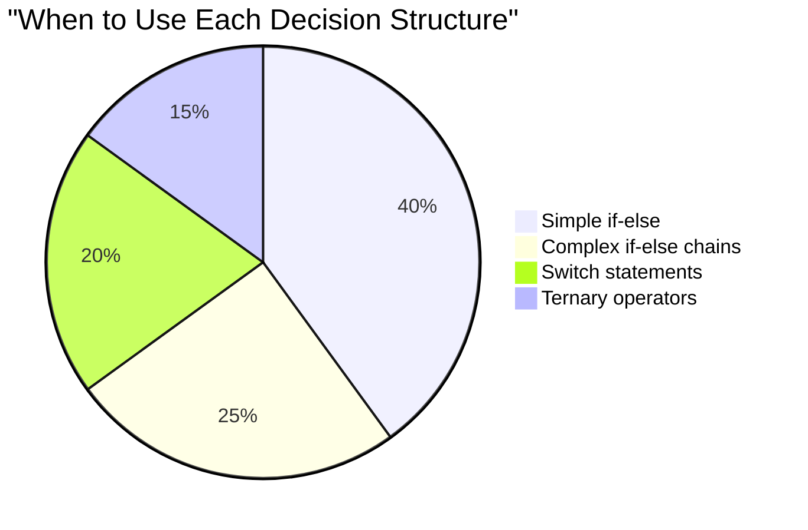

> **Лучший подход**: Используйте `switch`, когда сравниваете одну переменную с несколькими конкретными значениями. Используйте `if-else` для проверки диапазонов или сложных условий!

## Логические операторы и булевые значения

Сложные решения часто требуют оценки нескольких условий одновременно. Точно так же, как булева алгебра позволяет математикам комбинировать логические выражения, программирование предоставляет логические операторы для соединения нескольких булевых условий.

Эти операторы позволяют создавать сложную условную логику, комбинируя простые оценки true/false.

| Символ | Описание                                                                                     | Пример                                                                 |
| ------ | -------------------------------------------------------------------------------------------- | --------------------------------------------------------------------- |
| `&&`   | **Логическое И**: сравнивает два булевых выражения. Возвращает true **только**, если обе стороны истинны | `(5 > 3) && (5 < 10) // Обе стороны истинны. Возвращает true` |
| `\|\|` | **Логическое ИЛИ**: сравнивает два булевых выражения. Возвращает true, если хотя бы одна сторона истинна | `(5 > 10) \|\| (5 < 10) // Одна сторона ложна, другая истинна. Возвращает true` |
| `!`    | **Логическое НЕ**: возвращает противоположное значение булевого выражения                     | `!(5 > 10) // 5 не больше 10, поэтому "!" делает это истинным`         |

Эти операторы позволяют комбинировать условия полезными способами:
- И (`&&`) означает, что оба условия должны быть истинными
- ИЛИ (`||`) означает, что хотя бы одно условие должно быть истинным  
- НЕ (`!`) переворачивает true на false (и наоборот)

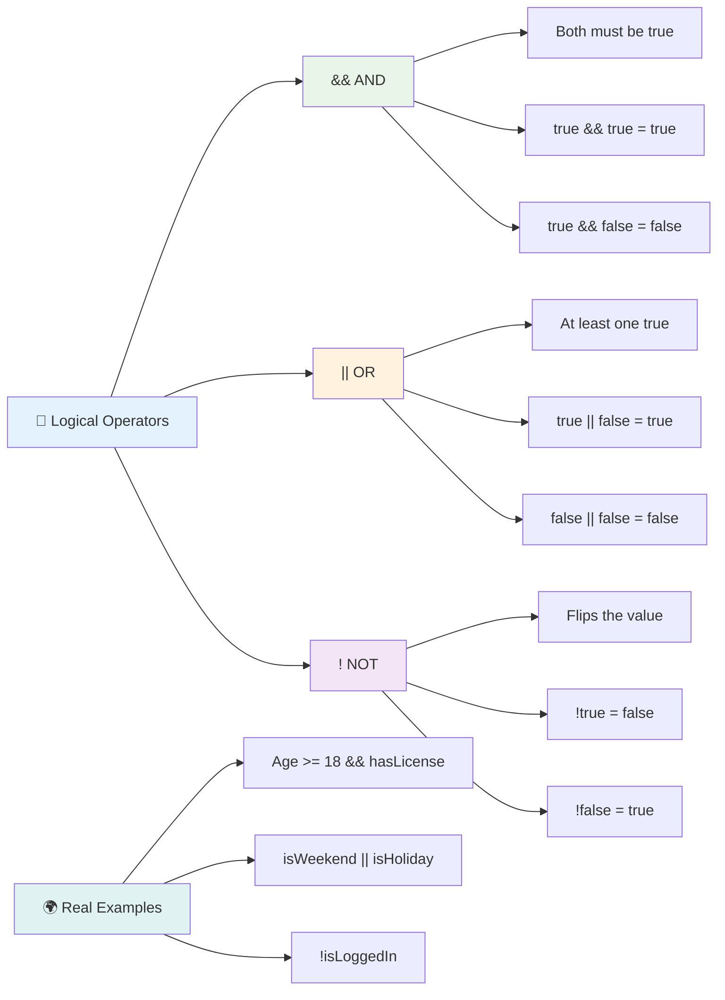

## Условия и решения с логическими операторами

Давайте посмотрим, как эти логические операторы работают на более реалистичном примере:

```javascript
let currentMoney = 600;
let laptopPrice = 800;
let laptopDiscountPrice = laptopPrice - (laptopPrice * 0.2); // Laptop price at 20 percent off

if (currentMoney >= laptopPrice || currentMoney >= laptopDiscountPrice) {
  // Condition is true. Code in this block will run.
  console.log("Getting a new laptop!");
} else {
  // Condition is false. Code in this block will run.
  console.log("Can't afford a new laptop, yet!");
}
```

В этом примере: мы рассчитываем цену со скидкой 20% (640), затем оцениваем, покрывают ли наши доступные средства либо полную цену, либо цену со скидкой. Поскольку 600 соответствует порогу цены со скидкой 640, условие оценивается как true.

### 🧮 **Проверка логических операторов: комбинирование условий**

**Проверьте свое понимание логических операторов:**
- В выражении `A && B`, что произойдет, если A ложно? Будет ли B вообще оцениваться?
- Можете ли вы придумать ситуацию, где вам понадобятся все три оператора (&&, ||, !)?
- В чем разница между `!user.isActive` и `user.isActive !== true`?

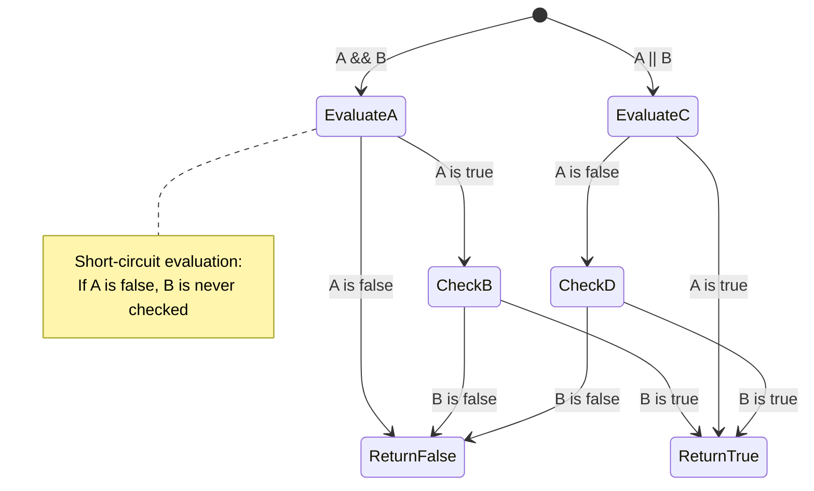

> **Совет по производительности**: JavaScript использует «короткое замыкание» - в `A && B`, если A ложно, B даже не оценивается. Используйте это в своих интересах!

### Оператор отрицания

Иногда проще думать о том, когда что-то НЕ является истинным. Например, вместо того, чтобы спрашивать «Пользователь вошел в систему?», вы можете спросить «Пользователь НЕ вошел в систему?» Оператор восклицательного знака (`!`) переворачивает логику за вас.

```javascript
if (!condition) {
  // runs if condition is false
} else {
  // runs if condition is true
}
```

Оператор `!` похож на выражение «наоборот...» – если что-то истинно, `!` делает это ложным, и наоборот.

### Тернарные выражения

Для простых условных присваиваний JavaScript предоставляет **тернарный оператор**. Этот лаконичный синтаксис позволяет записывать условное выражение в одной строке, что полезно, когда нужно присвоить одно из двух значений на основе условия.

```javascript
let variable = condition ? returnThisIfTrue : returnThisIfFalse;
```

Это читается как вопрос: «Это условие истинно? Если да, используйте это значение. Если нет, используйте то значение».

Ниже приведен более наглядный пример:

```javascript
let firstNumber = 20;
let secondNumber = 10;
let biggestNumber = firstNumber > secondNumber ? firstNumber : secondNumber;
```

✅ Потратьте минуту, чтобы несколько раз прочитать этот код. Понимаете ли вы, как работают эти операторы?

Вот что говорит эта строка: «`firstNumber` больше, чем `secondNumber`? Если да, поместите `firstNumber` в `biggestNumber`. Если нет, поместите `secondNumber` в `biggestNumber`».

Тернарный оператор – это просто более короткий способ записать традиционный оператор `if..else`:

```javascript
let biggestNumber;
if (firstNumber > secondNumber) {
  biggestNumber = firstNumber;
} else {
  biggestNumber = secondNumber;
}
```

Оба подхода дают идентичные результаты. Тернарный оператор предлагает краткость, в то время как традиционная структура if-else может быть более читаемой для сложных условий.

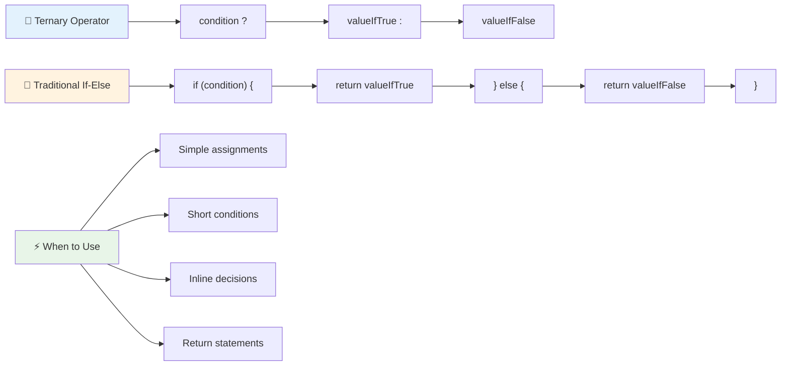

---


## 🚀 Задание

Создайте программу, которая сначала написана с использованием логических операторов, а затем перепишите ее, используя тернарное выражение. Какой синтаксис вам больше нравится?

---

## Вызов GitHub Copilot Agent 🚀

Используйте режим Agent, чтобы выполнить следующее задание:

**Описание:** Создайте комплексный калькулятор оценок, который демонстрирует несколько концепций принятия решений из этого урока, включая операторы if-else, switch, логические операторы и тернарные выражения.

**Задание:** Напишите программу на JavaScript, которая принимает числовую оценку студента (0-100) и определяет его буквенную оценку, используя следующие критерии:
- A: 90-100
- B: 80-89  
- C: 70-79
- D: 60-69
- F: ниже 60

Требования:
1. Используйте оператор if-else для определения буквенной оценки
2. Используйте логические операторы, чтобы проверить, прошел ли студент (оценка >= 60) И имеет ли он отличные результаты (оценка >= 90).
3. Используйте оператор switch, чтобы дать конкретную обратную связь для каждой буквенной оценки.
4. Используйте тернарный оператор, чтобы определить, может ли студент перейти на следующий курс (оценка >= 70).
5. Включите проверку ввода, чтобы убедиться, что оценка находится в диапазоне от 0 до 100.

Протестируйте вашу программу с различными оценками, включая крайние случаи, такие как 59, 60, 89, 90, и недопустимые значения.

Узнайте больше о [режиме агента](https://code.visualstudio.com/blogs/2025/02/24/introducing-copilot-agent-mode) здесь.


## Викторина после лекции

[Викторина после лекции](https://ff-quizzes.netlify.app/web/quiz/12)

## Обзор и самостоятельное изучение

Узнайте больше о множестве доступных операторов [на MDN](https://developer.mozilla.org/docs/Web/JavaScript/Reference/Operators).

Изучите замечательный [справочник по операторам](https://joshwcomeau.com/operator-lookup/) от Джоша Комо!

## Задание

[Операторы](assignment.md)

---

## 🧠 **Резюме вашего инструментария для принятия решений**

```mermaid
graph TD
    A["🎯 JavaScript Decisions"] --> B["🔍 Boolean Logic"]
    A --> C["📊 Conditional Statements"]
    A --> D["🔗 Logical Operators"]
    A --> E["⚡ Advanced Patterns"]
    
    B --> B1["true/false values"]
    B --> B2["Comparison operators"]
    B --> B3["Truthiness concepts"]
    
    C --> C1["if statements"]
    C --> C2["if-else chains"]
    C --> C3["switch statements"]
    
    D --> D1["&& (AND)"]
    D --> D2["|| (OR)"]
    D --> D3["! (NOT)"]
    
    E --> E1["Ternary operator"]
    E --> E2["Short-circuit evaluation"]
    E --> E3["Complex conditions"]
    
    F["💡 Key Principles"] --> F1["Clear readable conditions"]
    F --> F2["Consistent comparison style"]
    F --> F3["Proper operator precedence"]
    F --> F4["Efficient evaluation order"]
    
    style A fill:#e3f2fd
    style B fill:#e8f5e8
    style C fill:#fff3e0
    style D fill:#f3e5f5
    style E fill:#e0f2f1
    style F fill:#fce4ec
```

---

## 🚀 Ваш график освоения принятия решений в JavaScript

### ⚡ **Что вы можете сделать за следующие 5 минут**
- [ ] Попрактиковаться с операторами сравнения в консоли браузера
- [ ] Написать простое условие if-else, проверяющее ваш возраст
- [ ] Попробовать задачу: переписать if-else с использованием тернарного оператора
- [ ] Проверить, что происходит с различными "истинными" и "ложными" значениями

### 🎯 **Что вы можете достичь за этот час**
- [ ] Пройти викторину после урока и пересмотреть непонятные концепции
- [ ] Создать комплексный калькулятор оценок из задания GitHub Copilot
- [ ] Построить простой дерево решений для реальной ситуации (например, выбор одежды)
- [ ] Попрактиковаться в объединении нескольких условий с логическими операторами
- [ ] Поэкспериментировать с операторами switch для различных случаев

### 📅 **Ваш недельный путь к освоению логики**
- [ ] Завершить задание по операторам с творческими примерами
- [ ] Создать мини-приложение викторины, используя различные условные структуры
- [ ] Создать валидатор формы, проверяющий несколько условий ввода
- [ ] Попрактиковаться с упражнениями из [справочника по операторам](https://joshwcomeau.com/operator-lookup/) Джоша Комо
- [ ] Переписать существующий код, используя более подходящие условные структуры
- [ ] Изучить короткую оценку (short-circuit evaluation) и её влияние на производительность

### 🌟 **Ваш месячный путь к трансформации**
- [ ] Освоить сложные вложенные условия и поддерживать читаемость кода
- [ ] Создать приложение с продвинутой логикой принятия решений
- [ ] Внести вклад в open source, улучшая условную логику в существующих проектах
- [ ] Обучить кого-то другому различным условным структурам и их применению
- [ ] Исследовать подходы функционального программирования к условной логике
- [ ] Создать личный справочник по лучшим практикам условной логики

### 🏆 **Итоговая проверка вашего мастерства принятия решений**

**Отпразднуйте ваше мастерство логического мышления:**
- Какую самую сложную логику принятия решений вы успешно реализовали?
- Какая условная структура кажется вам наиболее естественной и почему?
- Как изучение логических операторов изменило ваш подход к решению задач?
- Какое реальное приложение могло бы выиграть от сложной логики принятия решений?

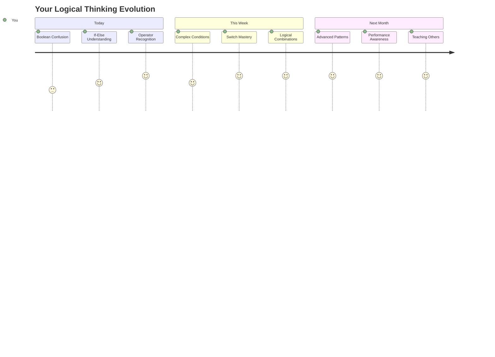

> 🧠 **Вы освоили искусство цифрового принятия решений!** Каждое интерактивное приложение опирается на условную логику, чтобы разумно реагировать на действия пользователя и изменяющиеся условия. Теперь вы понимаете, как заставить ваши программы думать, оценивать и выбирать подходящие ответы. Эта логическая основа будет двигать каждое динамическое приложение, которое вы создадите! 🎉

---

**Отказ от ответственности**:  
Этот документ был переведен с использованием сервиса автоматического перевода [Co-op Translator](https://github.com/Azure/co-op-translator). Хотя мы стремимся к точности, пожалуйста, учитывайте, что автоматические переводы могут содержать ошибки или неточности. Оригинальный документ на его родном языке следует считать авторитетным источником. Для получения критически важной информации рекомендуется профессиональный перевод человеком. Мы не несем ответственности за любые недоразумения или неправильные интерпретации, возникающие в результате использования данного перевода.