<!--
CO_OP_TRANSLATOR_METADATA:
{
  "original_hash": "1710a50a519a6e4a1b40a5638783018d",
  "translation_date": "2025-11-03T23:12:27+00:00",
  "source_file": "2-js-basics/4-arrays-loops/README.md",
  "language_code": "ru"
}
-->
# Основы JavaScript: Массивы и циклы

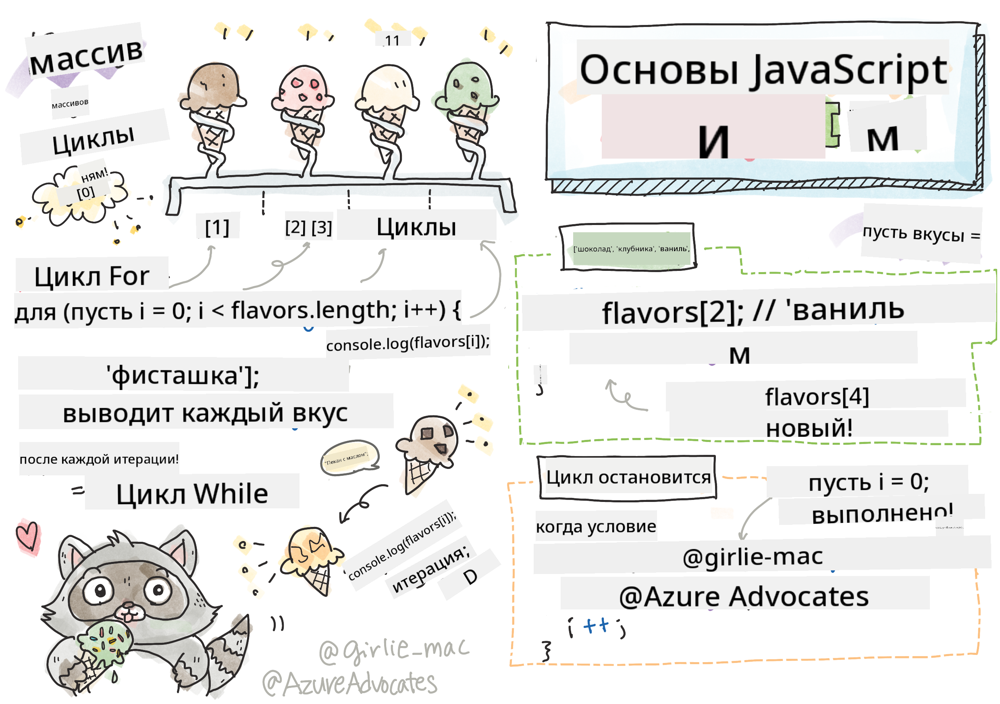
> Скетчноут от [Tomomi Imura](https://twitter.com/girlie_mac)

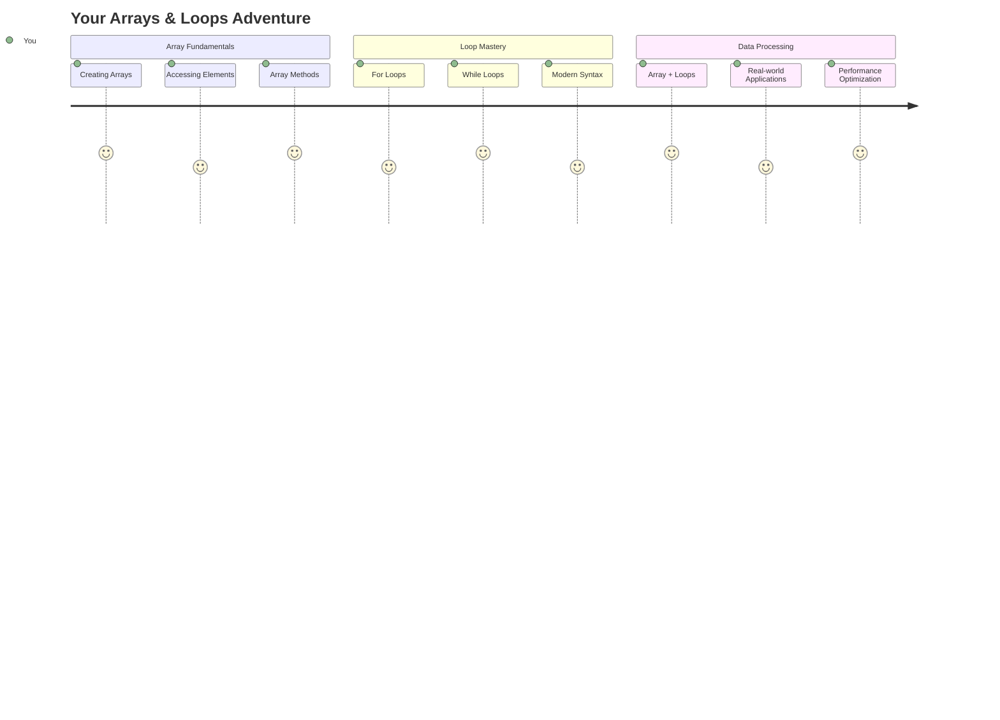

## Викторина перед лекцией
[Викторина перед лекцией](https://ff-quizzes.netlify.app/web/quiz/13)

Задумывались ли вы, как сайты отслеживают товары в корзине или отображают список ваших друзей? Здесь на помощь приходят массивы и циклы. Массивы — это как цифровые контейнеры, которые хранят несколько элементов информации, а циклы позволяют работать с этими данными эффективно, без повторяющегося кода.

Вместе эти два понятия составляют основу для обработки информации в ваших программах. Вы научитесь переходить от ручного написания каждого шага к созданию умного, эффективного кода, который может обрабатывать сотни или даже тысячи элементов быстро.

К концу этого урока вы поймете, как выполнять сложные задачи с данными всего за несколько строк кода. Давайте изучим эти важные концепции программирования.

[](https://youtube.com/watch?v=1U4qTyq02Xw "Массивы")

[](https://www.youtube.com/watch?v=Eeh7pxtTZ3k "Циклы")

> 🎥 Нажмите на изображения выше, чтобы посмотреть видео о массивах и циклах.

> Вы можете пройти этот урок на [Microsoft Learn](https://docs.microsoft.com/learn/modules/web-development-101-arrays/?WT.mc_id=academic-77807-sagibbon)!

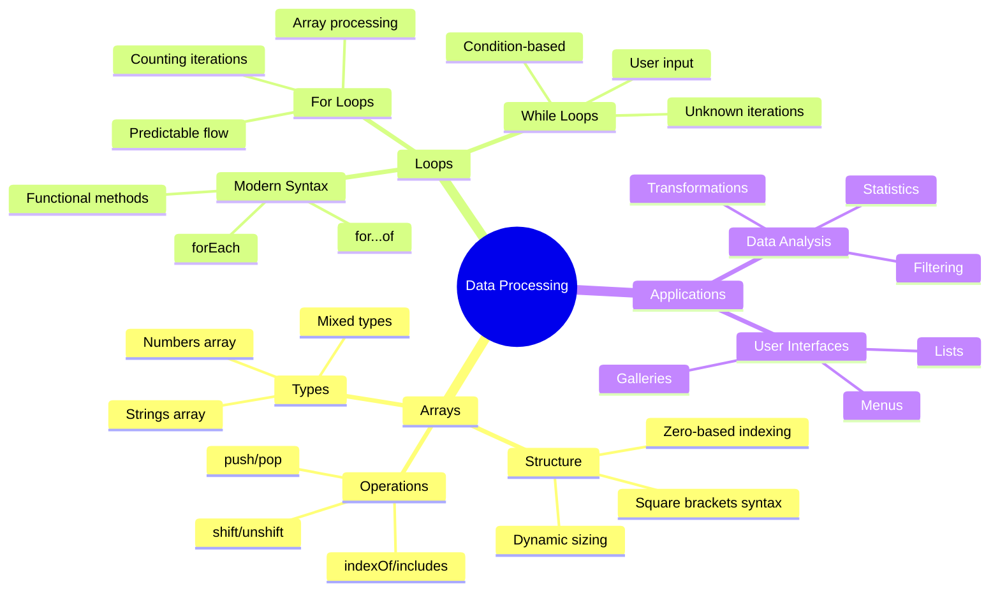

## Массивы

Представьте массивы как цифровой шкаф для документов — вместо хранения одного документа в каждом ящике, вы можете организовать несколько связанных элементов в одном структурированном контейнере. В терминах программирования массивы позволяют хранить несколько элементов информации в одном организованном пакете.

Будь то создание фотогалереи, управление списком задач или отслеживание рекордов в игре, массивы обеспечивают основу для организации данных. Давайте посмотрим, как они работают.

✅ Массивы повсюду! Можете ли вы придумать реальный пример массива, например, массив солнечных панелей?

### Создание массивов

Создать массив очень просто — просто используйте квадратные скобки!

```javascript
// Empty array - like an empty shopping cart waiting for items
const myArray = [];
```

**Что здесь происходит?**
Вы только что создали пустой контейнер, используя квадратные скобки `[]`. Представьте это как пустую полку в библиотеке — она готова хранить любые книги, которые вы хотите там организовать.

Вы также можете заполнить массив начальными значениями сразу:

```javascript
// Your ice cream shop's flavor menu
const iceCreamFlavors = ["Chocolate", "Strawberry", "Vanilla", "Pistachio", "Rocky Road"];

// A user's profile info (mixing different types of data)
const userData = ["John", 25, true, "developer"];

// Test scores for your favorite class
const scores = [95, 87, 92, 78, 85];
```

**Интересные моменты:**
- Вы можете хранить текст, числа или даже значения true/false в одном массиве
- Просто разделяйте каждый элемент запятой — легко!
- Массивы идеально подходят для хранения связанных данных вместе

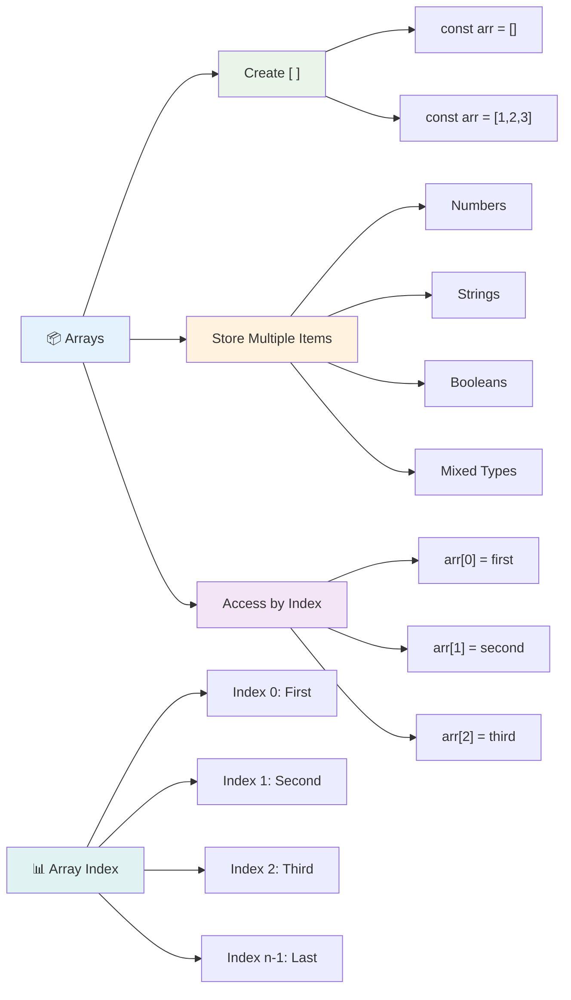

### Индексация массивов

Вот что может показаться необычным сначала: массивы нумеруют свои элементы, начиная с 0, а не с 1. Этот подход с нулевой индексацией связан с тем, как работает память компьютера — это программная традиция, существующая с ранних дней языков программирования, таких как C. Каждое место в массиве получает свой номер адреса, называемый **индексом**.

| Индекс | Значение | Описание |
|-------|-------|-------------|
| 0 | "Шоколад" | Первый элемент |
| 1 | "Клубника" | Второй элемент |
| 2 | "Ваниль" | Третий элемент |
| 3 | "Фисташка" | Четвертый элемент |
| 4 | "Рокки Роуд" | Пятый элемент |

✅ Вас удивляет, что массивы начинают с нулевого индекса? В некоторых языках программирования индексы начинаются с 1. Это интересная история, о которой можно [прочитать на Википедии](https://en.wikipedia.org/wiki/Zero-based_numbering).

**Доступ к элементам массива:**

```javascript
const iceCreamFlavors = ["Chocolate", "Strawberry", "Vanilla", "Pistachio", "Rocky Road"];

// Access individual elements using bracket notation
console.log(iceCreamFlavors[0]); // "Chocolate" - first element
console.log(iceCreamFlavors[2]); // "Vanilla" - third element
console.log(iceCreamFlavors[4]); // "Rocky Road" - last element
```

**Разберем, что здесь происходит:**
- **Использует** нотацию квадратных скобок с номером индекса для доступа к элементам
- **Возвращает** значение, хранящееся в указанной позиции массива
- **Начинает** счет с 0, делая первый элемент индексом 0

**Изменение элементов массива:**

```javascript
// Change an existing value
iceCreamFlavors[4] = "Butter Pecan";
console.log(iceCreamFlavors[4]); // "Butter Pecan"

// Add a new element at the end
iceCreamFlavors[5] = "Cookie Dough";
console.log(iceCreamFlavors[5]); // "Cookie Dough"
```

**В приведенном выше примере мы:**
- **Изменили** элемент с индексом 4 с "Рокки Роуд" на "Масляный Пекан"
- **Добавили** новый элемент "Тесто для печенья" с индексом 5
- **Автоматически увеличили** длину массива при добавлении за пределы текущих границ

### Длина массива и основные методы

Массивы имеют встроенные свойства и методы, которые упрощают работу с данными.

**Определение длины массива:**

```javascript
const iceCreamFlavors = ["Chocolate", "Strawberry", "Vanilla", "Pistachio", "Rocky Road"];
console.log(iceCreamFlavors.length); // 5

// Length updates automatically as array changes
iceCreamFlavors.push("Mint Chip");
console.log(iceCreamFlavors.length); // 6
```

**Основные моменты:**
- **Возвращает** общее количество элементов в массиве
- **Обновляется** автоматически при добавлении или удалении элементов
- **Предоставляет** динамический счетчик, полезный для циклов и проверки

**Основные методы массива:**

```javascript
const fruits = ["apple", "banana", "orange"];

// Add elements
fruits.push("grape");           // Adds to end: ["apple", "banana", "orange", "grape"]
fruits.unshift("strawberry");   // Adds to beginning: ["strawberry", "apple", "banana", "orange", "grape"]

// Remove elements
const lastFruit = fruits.pop();        // Removes and returns "grape"
const firstFruit = fruits.shift();     // Removes and returns "strawberry"

// Find elements
const index = fruits.indexOf("banana"); // Returns 1 (position of "banana")
const hasApple = fruits.includes("apple"); // Returns true
```

**Понимание этих методов:**
- **Добавляет** элементы с помощью `push()` (в конец) и `unshift()` (в начало)
- **Удаляет** элементы с помощью `pop()` (с конца) и `shift()` (с начала)
- **Находит** элементы с помощью `indexOf()` и проверяет наличие с помощью `includes()`
- **Возвращает** полезные значения, такие как удаленные элементы или индексы позиций

✅ Попробуйте сами! Используйте консоль вашего браузера, чтобы создать и изменить массив собственного создания.

### 🧠 **Проверка основ массива: Организация данных**

**Проверьте свое понимание массивов:**
- Почему, по вашему мнению, массивы начинают счет с 0, а не с 1?
- Что произойдет, если вы попытаетесь получить доступ к индексу, который не существует (например, `arr[100]` в массиве из 5 элементов)?
- Можете ли вы придумать три сценария из реальной жизни, где массивы были бы полезны?

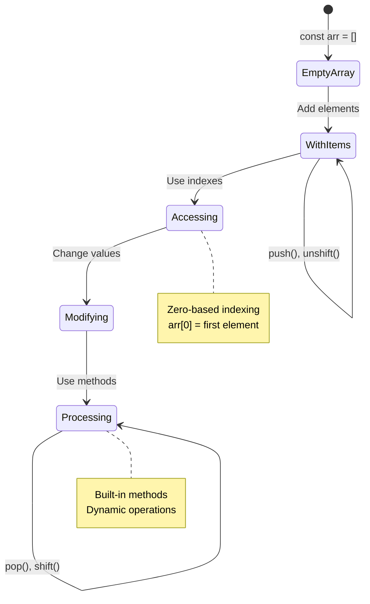

> **Инсайт из реальной жизни**: Массивы повсюду в программировании! Ленты социальных сетей, корзины покупок, фотогалереи, песни в плейлисте — все это массивы за кулисами!

## Циклы

Представьте наказание из романов Чарльза Диккенса, где ученики должны были многократно писать строки на доске. А теперь представьте, что вы можете просто сказать кому-то: "Напиши это предложение 100 раз", и оно будет выполнено автоматически. Именно это делают циклы для вашего кода.

Циклы — это как иметь неутомимого помощника, который может повторять задачи без ошибок. Будь то проверка каждого элемента в корзине покупок или отображение всех фотографий в альбоме, циклы эффективно справляются с повторением.

JavaScript предоставляет несколько типов циклов на выбор. Давайте рассмотрим каждый из них и поймем, когда их использовать.

```mermaid
flowchart TD
    A["🔄 Loop Types"] --> B["For Loop"]
    A --> C["While Loop"]
    A --> D["For...of Loop"]
    A --> E["forEach Method"]
    
    B --> B1["Known iterations"]
    B --> B2["Counter-based"]
    B --> B3["for(init; condition; increment)"]
    
    C --> C1["Unknown iterations"]
    C --> C2["Condition-based"]
    C --> C3["while(condition)"]
    
    D --> D1["Modern ES6+"]
    D --> D2["Array iteration"]
    D --> D3["for(item of array)"]
    
    E --> E1["Functional style"]
    E --> E2["Array method"]
    E --> E3["array.forEach(callback)"]
    
    F["⏰ When to Use"] --> F1["For: Counting, indexes"]
    F --> F2["While: User input, searching"]
    F --> F3["For...of: Simple iteration"]
    F --> F4["forEach: Functional programming"]
    
    style A fill:#e3f2fd
    style B fill:#e8f5e8
    style C fill:#fff3e0
    style D fill:#f3e5f5
    style E fill:#e0f2f1
    style F fill:#fce4ec
```

### Цикл For

Цикл `for` похож на установку таймера — вы точно знаете, сколько раз хотите, чтобы что-то произошло. Он супер организован и предсказуем, что делает его идеальным для работы с массивами или подсчета чего-либо.

**Структура цикла For:**

| Компонент | Назначение | Пример |
|-----------|---------|----------|
| **Инициализация** | Устанавливает начальную точку | `let i = 0` |
| **Условие** | Когда продолжать | `i < 10` |
| **Инкремент** | Как обновлять | `i++` |

```javascript
// Counting from 0 to 9
for (let i = 0; i < 10; i++) {
  console.log(`Count: ${i}`);
}

// More practical example: processing scores
const testScores = [85, 92, 78, 96, 88];
for (let i = 0; i < testScores.length; i++) {
  console.log(`Student ${i + 1}: ${testScores[i]}%`);
}
```

**Шаг за шагом, вот что происходит:**
- **Инициализирует** переменную счетчика `i` со значением 0 в начале
- **Проверяет** условие `i < 10` перед каждой итерацией
- **Выполняет** блок кода, если условие истинно
- **Увеличивает** `i` на 1 после каждой итерации с помощью `i++`
- **Останавливается**, когда условие становится ложным (когда `i` достигает 10)

✅ Запустите этот код в консоли браузера. Что произойдет, если вы внесете небольшие изменения в счетчик, условие или выражение итерации? Можете ли вы заставить его работать в обратном порядке, создавая обратный отсчет?

### 🗓️ **Проверка мастерства цикла For: Контролируемое повторение**

**Оцените свое понимание цикла for:**
- Какие три части составляют цикл for, и что делает каждая из них?
- Как бы вы прошли по массиву в обратном порядке?
- Что произойдет, если вы забудете часть инкремента (`i++`)?

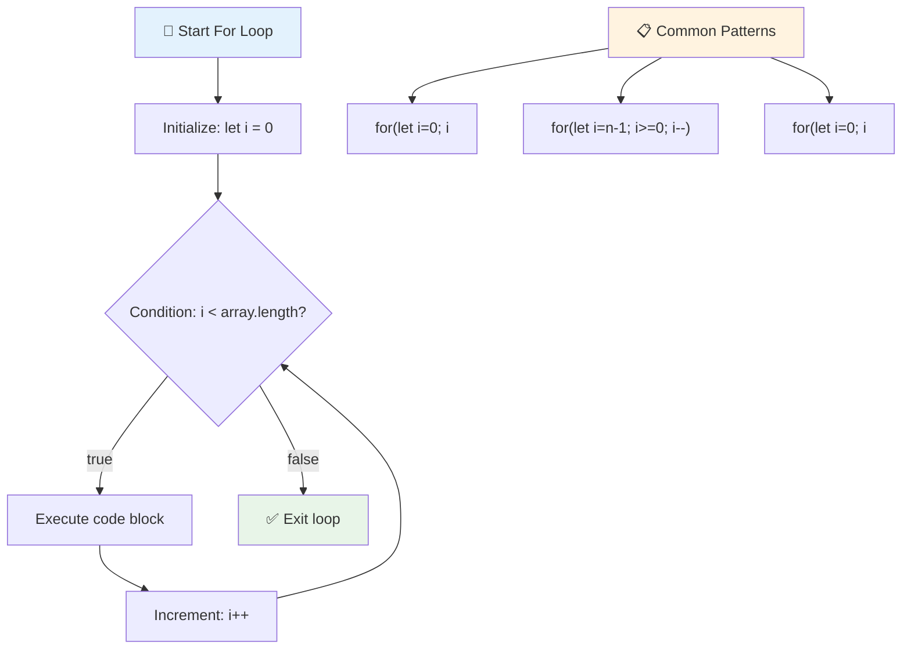

> **Мудрость циклов**: Циклы for идеально подходят, когда вы точно знаете, сколько раз нужно повторить что-то. Это самый распространенный выбор для обработки массивов!

### Цикл While

Цикл `while` похож на фразу "продолжай делать это, пока..." — вы можете не знать точно, сколько раз он будет выполняться, но знаете, когда остановиться. Он идеально подходит для таких задач, как запрос ввода от пользователя, пока он не предоставит нужные данные, или поиск в данных, пока не найдете то, что ищете.

**Характеристики цикла While:**
- **Продолжает** выполнение, пока условие истинно
- **Требует** ручного управления любыми переменными счетчика
- **Проверяет** условие перед каждой итерацией
- **Рискует** бесконечным циклом, если условие никогда не станет ложным

```javascript
// Basic counting example
let i = 0;
while (i < 10) {
  console.log(`While count: ${i}`);
  i++; // Don't forget to increment!
}

// More practical example: processing user input
let userInput = "";
let attempts = 0;
const maxAttempts = 3;

while (userInput !== "quit" && attempts < maxAttempts) {
  userInput = prompt(`Enter 'quit' to exit (attempt ${attempts + 1}):`);
  attempts++;
}

if (attempts >= maxAttempts) {
  console.log("Maximum attempts reached!");
}
```

**Понимание этих примеров:**
- **Управляет** переменной счетчика `i` вручную внутри тела цикла
- **Увеличивает** счетчик, чтобы предотвратить бесконечные циклы
- **Демонстрирует** практическое использование с вводом пользователя и ограничением попыток
- **Включает** механизмы безопасности для предотвращения бесконечного выполнения

### ♾️ **Проверка мудрости цикла While: Повторение на основе условий**

**Проверьте свое понимание цикла while:**
- Какова основная опасность при использовании циклов while?
- Когда вы выбрали бы цикл while вместо цикла for?
- Как можно предотвратить бесконечные циклы?

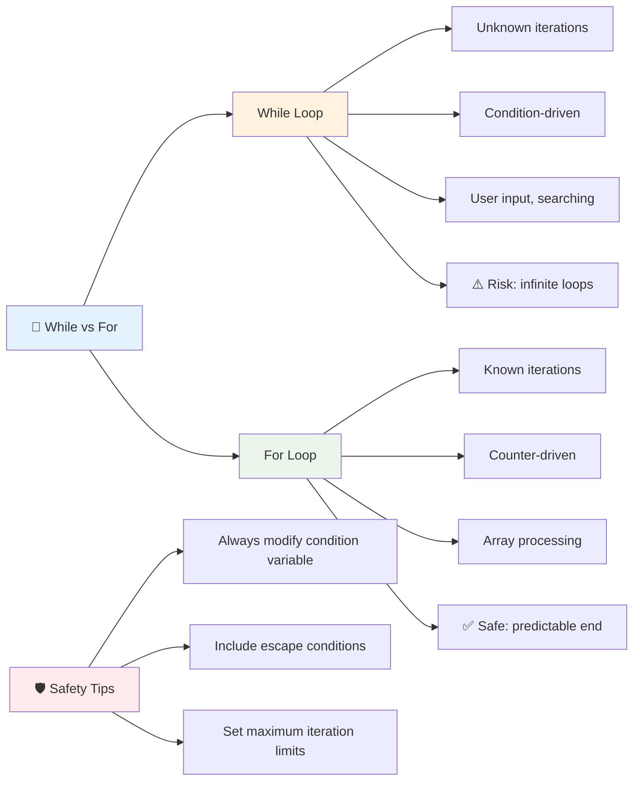

> **Безопасность прежде всего**: Циклы while мощные, но требуют тщательного управления условиями. Всегда убедитесь, что ваше условие цикла в конечном итоге станет ложным!

### Современные альтернативы циклов

JavaScript предлагает современный синтаксис циклов, который может сделать ваш код более читаемым и менее склонным к ошибкам.

**Цикл For...of (ES6+):**

```javascript
const colors = ["red", "green", "blue", "yellow"];

// Modern approach - cleaner and safer
for (const color of colors) {
  console.log(`Color: ${color}`);
}

// Compare with traditional for loop
for (let i = 0; i < colors.length; i++) {
  console.log(`Color: ${colors[i]}`);
}
```

**Основные преимущества for...of:**
- **Устраняет** управление индексами и потенциальные ошибки на единицу
- **Предоставляет** прямой доступ к элементам массива
- **Улучшает** читаемость кода и снижает сложность синтаксиса

**Метод forEach:**

```javascript
const prices = [9.99, 15.50, 22.75, 8.25];

// Using forEach for functional programming style
prices.forEach((price, index) => {
  console.log(`Item ${index + 1}: $${price.toFixed(2)}`);
});

// forEach with arrow functions for simple operations
prices.forEach(price => console.log(`Price: $${price}`));
```

**Что нужно знать о forEach:**
- **Выполняет** функцию для каждого элемента массива
- **Предоставляет** как значение элемента, так и индекс в качестве параметров
- **Не может** быть остановлен преждевременно (в отличие от традиционных циклов)
- **Возвращает** undefined (не создает новый массив)

✅ Почему вы выбрали бы цикл for вместо цикла while? 17 тысяч зрителей задавали тот же вопрос на StackOverflow, и некоторые мнения [могут быть вам интересны](https://stackoverflow.com/questions/39969145/while-loops-vs-for-loops-in-javascript).

### 🎨 **Проверка синтаксиса современных циклов: Осваиваем ES6+**

**Оцените свое понимание современного JavaScript:**
- Каковы преимущества `for...of` по сравнению с традиционными циклами for?
- Когда вы все еще предпочли бы традиционные циклы for?
- В чем разница между `forEach` и `map`?

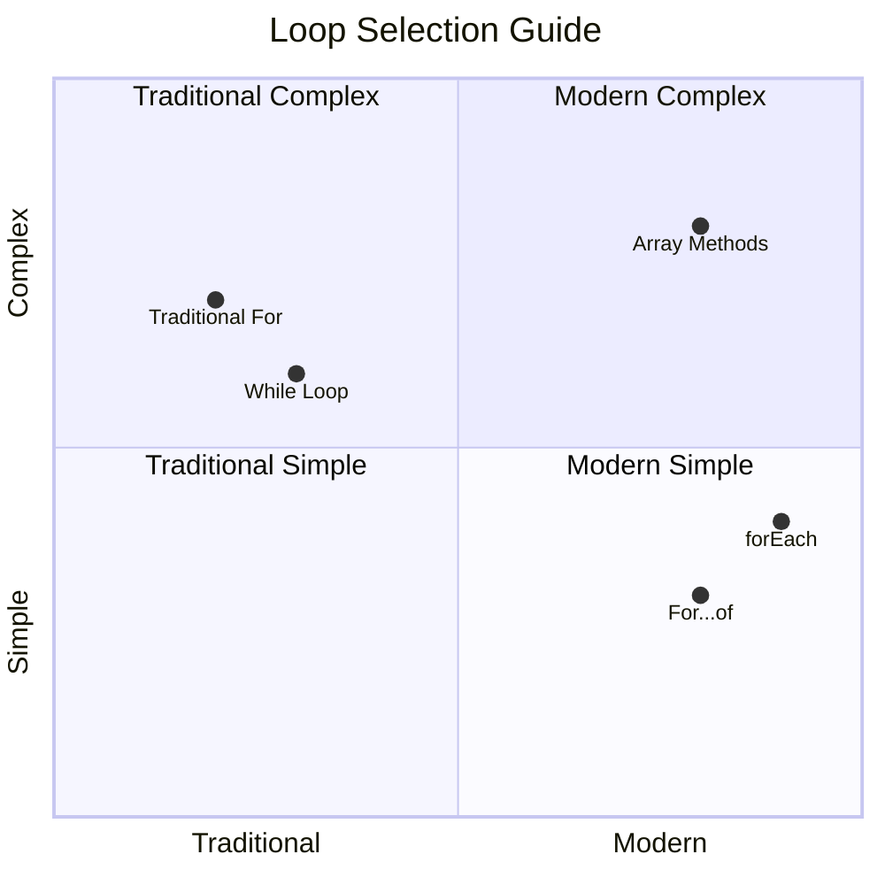

> **Современная тенденция**: Синтаксис ES6+, такой как `for...of` и `forEach`, становится предпочтительным подходом для итерации по массивам, потому что он чище и менее склонен к ошибкам!

## Циклы и массивы

Сочетание массивов с циклами создает мощные возможности обработки данных. Это сочетание является основой многих задач программирования, от отображения списков до вычисления статистики.

**Традиционная обработка массивов:**

```javascript
const iceCreamFlavors = ["Chocolate", "Strawberry", "Vanilla", "Pistachio", "Rocky Road"];

// Classic for loop approach
for (let i = 0; i < iceCreamFlavors.length; i++) {
  console.log(`Flavor ${i + 1}: ${iceCreamFlavors[i]}`);
}

// Modern for...of approach
for (const flavor of iceCreamFlavors) {
  console.log(`Available flavor: ${flavor}`);
}
```

**Давайте разберем каждый подход:**
- **Использует** свойство длины массива для определения границы цикла
- **Получает доступ** к элементам по индексу в традиционных циклах for
- **Предоставляет** прямой доступ к элементам в циклах for...of
- **Обрабатывает** каждый элемент массива ровно один раз

**Пример практической обработки данных:**

```javascript
const studentGrades = [85, 92, 78, 96, 88, 73, 89];
let total = 0;
let highestGrade = studentGrades[0];
let lowestGrade = studentGrades[0];

// Process all grades with a single loop
for (let i = 0; i < studentGrades.length; i++) {
  const grade = studentGrades[i];
  total += grade;
  
  if (grade > highestGrade) {
    highestGrade = grade;
  }
  
  if (grade < lowestGrade) {
    lowestGrade = grade;
  }
}

const average = total / studentGrades.length;
console.log(`Average: ${average.toFixed(1)}`);
console.log(`Highest: ${highestGrade}`);
console.log(`Lowest: ${lowestGrade}`);
```

**Вот как работает этот код:**
- **Инициализирует** переменные для отслеживания суммы и экстремальных значений
- **Обрабатывает** каждую оценку с помощью одного эффективного цикла
- **Накопляет** общий итог для расчета среднего значения
- **Отслеживает** наивысшие и наименьшие значения во время итерации
- **Вычисляет** окончательную статистику после завершения цикла

✅ Экспериментируйте с итерацией по массиву собственного создания в консоли вашего браузера.

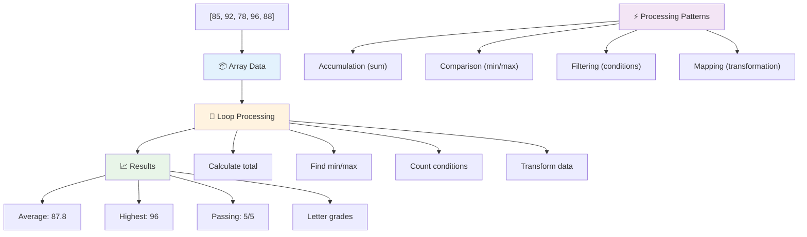

---

## Задача GitHub Copilot Agent 🚀

Используйте режим Agent, чтобы выполнить следующую задачу:

**Описание:** Создайте комплексную функцию обработки данных, которая сочетает массивы и циклы для анализа набора данных и генерации значимых выводов.

**Запрос:** Создайте функцию `analyzeGrades`, которая принимает массив объектов с оценками студентов (каждый содержит свойства name и score) и возвращает объект со статистикой, включая наивысшую оценку, наименьшую оценку, среднюю оценку, количество студентов, которые сдали (score >= 70), и массив имен студентов, которые набрали выше среднего. Используйте как минимум два разных типа циклов в вашем решении.

Узнайте больше о [режиме Agent](https://code.visualstudio.com/blogs/2025/02/24/introducing-copilot-agent-mode) здесь.

## 🚀 Задача
JavaScript предлагает несколько современных методов работы с массивами, которые могут заменить традиционные циклы для выполнения определенных задач. Ознакомьтесь с [forEach](https://developer.mozilla.org/docs/Web/JavaScript/Reference/Global_Objects/Array/forEach), [for-of](https://developer.mozilla.org/docs/Web/JavaScript/Reference/Statements/for...of), [map](https://developer.mozilla.org/docs/Web/JavaScript/Reference/Global_Objects/Array/map), [filter](https://developer.mozilla.org/docs/Web/JavaScript/Reference/Global_Objects/Array/filter) и [reduce](https://developer.mozilla.org/docs/Web/JavaScript/Reference/Global_Objects/Array/reduce).

**Ваше задание:** Перепишите пример с оценками студентов, используя как минимум три различных метода работы с массивами. Обратите внимание, насколько чище и понятнее становится код благодаря современному синтаксису JavaScript.

## Викторина после лекции
[Викторина после лекции](https://ff-quizzes.netlify.app/web/quiz/14)

## Обзор и самостоятельное изучение

Массивы в JavaScript имеют множество встроенных методов, которые чрезвычайно полезны для работы с данными. [Изучите эти методы](https://developer.mozilla.org/docs/Web/JavaScript/Reference/Global_Objects/Array) и попробуйте некоторые из них (например, push, pop, slice и splice) на созданном вами массиве.

## Задание

[Цикл по массиву](assignment.md)

---

## 📊 **Ваш набор инструментов для работы с массивами и циклами**

```mermaid
graph TD
    A["🎯 Arrays & Loops Mastery"] --> B["📦 Array Fundamentals"]
    A --> C["🔄 Loop Types"]
    A --> D["🔗 Data Processing"]
    A --> E["🎨 Modern Techniques"]
    
    B --> B1["Creation: [ ]"]
    B --> B2["Indexing: arr[0]"]
    B --> B3["Methods: push, pop"]
    B --> B4["Properties: length"]
    
    C --> C1["For: Known iterations"]
    C --> C2["While: Condition-based"]
    C --> C3["For...of: Direct access"]
    C --> C4["forEach: Functional"]
    
    D --> D1["Statistics calculation"]
    D --> D2["Data transformation"]
    D --> D3["Filtering & searching"]
    D --> D4["Real-time processing"]
    
    E --> E1["Arrow functions"]
    E --> E2["Method chaining"]
    E --> E3["Destructuring"]
    E --> E4["Template literals"]
    
    F["💡 Key Benefits"] --> F1["Efficient data handling"]
    F --> F2["Reduced code repetition"]
    F --> F3["Scalable solutions"]
    F --> F4["Cleaner syntax"]
    
    style A fill:#e3f2fd
    style B fill:#e8f5e8
    style C fill:#fff3e0
    style D fill:#f3e5f5
    style E fill:#e0f2f1
    style F fill:#fce4ec
```

---

## 🚀 Таймлайн освоения массивов и циклов

### ⚡ **Что можно сделать за следующие 5 минут**
- [ ] Создайте массив ваших любимых фильмов и получите доступ к конкретным элементам
- [ ] Напишите цикл for, который считает от 1 до 10
- [ ] Попробуйте выполнить задание с современными методами работы с массивами из урока
- [ ] Попрактикуйтесь с индексами массива в консоли вашего браузера

### 🎯 **Что можно достичь за час**
- [ ] Пройдите викторину после урока и разберите сложные моменты
- [ ] Создайте комплексный анализатор оценок из задания GitHub Copilot
- [ ] Создайте простой список покупок, который добавляет и удаляет элементы
- [ ] Попрактикуйтесь в преобразовании между различными типами циклов
- [ ] Экспериментируйте с методами массива, такими как `push`, `pop`, `slice` и `splice`

### 📅 **Ваш недельный путь к обработке данных**
- [ ] Выполните задание "Цикл по массиву" с творческими дополнениями
- [ ] Создайте приложение списка дел, используя массивы и циклы
- [ ] Создайте простой калькулятор статистики для числовых данных
- [ ] Попрактикуйтесь с [методами массива на MDN](https://developer.mozilla.org/docs/Web/JavaScript/Reference/Global_Objects/Array)
- [ ] Создайте интерфейс фотогалереи или музыкального плейлиста
- [ ] Изучите функциональное программирование с использованием `map`, `filter` и `reduce`

### 🌟 **Ваш месячный путь трансформации**
- [ ] Освойте продвинутые операции с массивами и оптимизацию производительности
- [ ] Создайте полноценную панель визуализации данных
- [ ] Внесите вклад в проекты с открытым исходным кодом, связанные с обработкой данных
- [ ] Научите кого-то работать с массивами и циклами, используя практические примеры
- [ ] Создайте личную библиотеку функций для обработки данных
- [ ] Изучите алгоритмы и структуры данных, построенные на массивах

### 🏆 **Итоговая проверка мастерства обработки данных**

**Отпразднуйте свое мастерство работы с массивами и циклами:**
- Какую операцию с массивами вы считаете самой полезной для реальных приложений?
- Какой тип цикла кажется вам наиболее естественным и почему?
- Как понимание массивов и циклов изменило ваш подход к организации данных?
- Какую сложную задачу обработки данных вы хотели бы решить дальше?

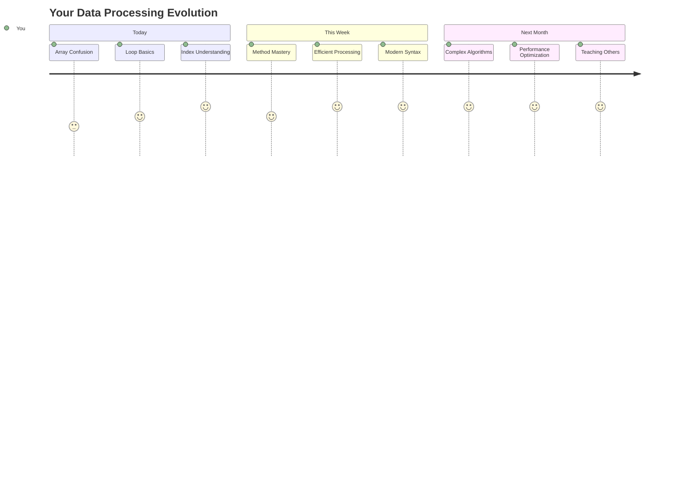

> 📦 **Вы раскрыли силу организации и обработки данных!** Массивы и циклы — это основа почти каждого приложения, которое вы когда-либо создадите. От простых списков до сложного анализа данных — теперь у вас есть инструменты для эффективной и элегантной работы с информацией. Каждый динамический веб-сайт, мобильное приложение и приложение, основанное на данных, опирается на эти фундаментальные концепции. Добро пожаловать в мир масштабируемой обработки данных! 🎉

---

**Отказ от ответственности**:  
Этот документ был переведен с использованием сервиса автоматического перевода [Co-op Translator](https://github.com/Azure/co-op-translator). Несмотря на наши усилия обеспечить точность, автоматические переводы могут содержать ошибки или неточности. Оригинальный документ на его родном языке следует считать авторитетным источником. Для получения критически важной информации рекомендуется профессиональный перевод человеком. Мы не несем ответственности за любые недоразумения или неправильные интерпретации, возникшие в результате использования данного перевода.