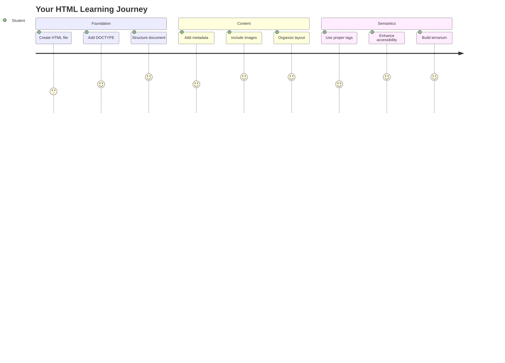
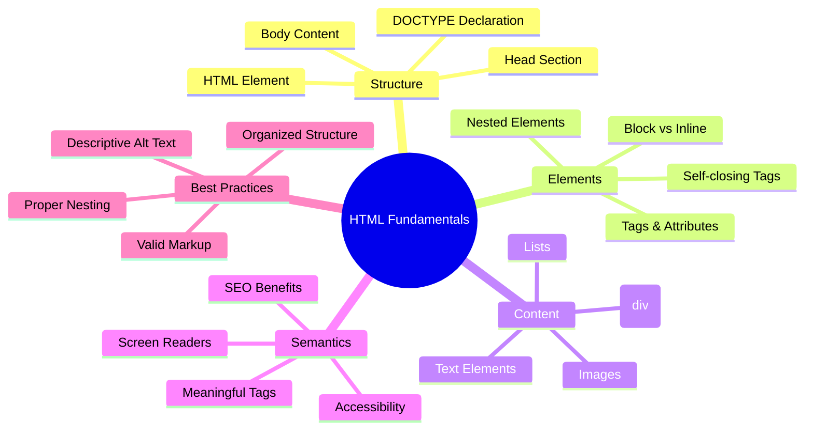
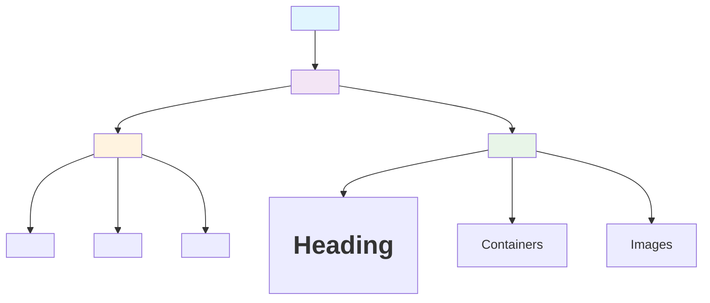
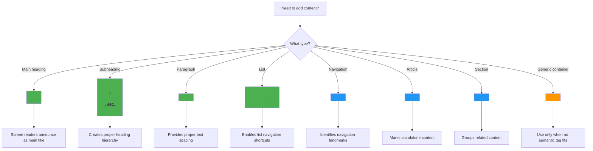
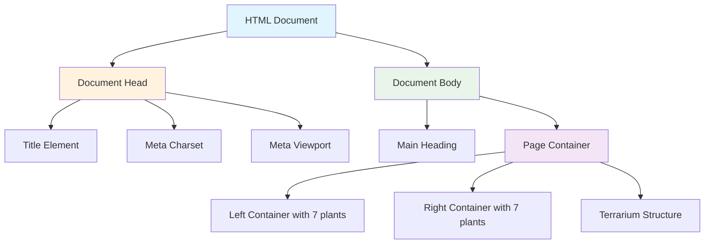
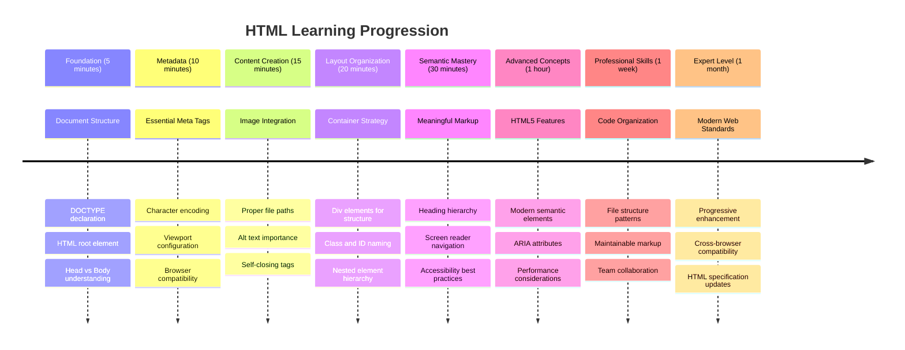

<!--
CO_OP_TRANSLATOR_METADATA:
{
  "original_hash": "3fcfa99c4897e051b558b5eaf1e8cc74",
  "translation_date": "2025-11-03T23:22:42+00:00",
  "source_file": "3-terrarium/1-intro-to-html/README.md",
  "language_code": "ru"
}
-->
# Проект "Террариум", часть 1: Введение в HTML




> Скетчноут от [Tomomi Imura](https://twitter.com/girlie_mac)

HTML, или язык гипертекстовой разметки, является основой каждого веб-сайта, который вы когда-либо посещали. Представьте HTML как скелет, который придает структуру веб-страницам – он определяет, где размещается контент, как он организован и что представляет собой каждый элемент. В то время как CSS позже "оденет" ваш HTML в цвета и макеты, а JavaScript оживит его с помощью интерактивности, HTML обеспечивает основную структуру, которая делает все остальное возможным.

В этом уроке вы создадите HTML-структуру для интерфейса виртуального террариума. Этот практический проект научит вас основным концепциям HTML, одновременно создавая что-то визуально привлекательное. Вы узнаете, как организовывать контент с помощью семантических элементов, работать с изображениями и создавать основу для интерактивного веб-приложения.

К концу урока у вас будет рабочая HTML-страница, отображающая изображения растений в организованных колонках, готовая к стилизации в следующем уроке. Не переживайте, если сначала она будет выглядеть просто – именно так должен выглядеть HTML до того, как CSS добавит визуальный блеск.



## Тест перед лекцией

[Тест перед лекцией](https://ff-quizzes.netlify.app/web/quiz/15)

> 📺 **Смотрите и учитесь**: Ознакомьтесь с полезным видеообзором
> 
> [](https://www.youtube.com/watch?v=1TvxJKBzhyQ)

## Настройка вашего проекта

Прежде чем мы начнем писать HTML-код, давайте настроим рабочее пространство для вашего проекта террариума. Создание организованной структуры файлов с самого начала – это важная привычка, которая будет полезна вам на протяжении всего пути веб-разработки.

### Задание: Создайте структуру проекта

Вы создадите отдельную папку для проекта террариума и добавите ваш первый HTML-файл. Вот два подхода, которые вы можете использовать:

**Вариант 1: Использование Visual Studio Code**
1. Откройте Visual Studio Code
2. Нажмите "File" → "Open Folder" или используйте `Ctrl+K, Ctrl+O` (Windows/Linux) или `Cmd+K, Cmd+O` (Mac)
3. Создайте новую папку с названием `terrarium` и выберите ее
4. В панели Explorer нажмите на значок "New File"
5. Назовите файл `index.html`


**Вариант 2: Использование команд терминала**
```bash
mkdir terrarium
cd terrarium
touch index.html
code index.html
```

**Что делают эти команды:**
- **Создают** новую директорию с названием `terrarium` для вашего проекта
- **Переходят** в директорию террариума
- **Создают** пустой файл `index.html`
- **Открывают** файл в Visual Studio Code для редактирования

> 💡 **Полезный совет**: Имя файла `index.html` имеет особое значение в веб-разработке. Когда кто-то посещает веб-сайт, браузеры автоматически ищут `index.html` как страницу по умолчанию для отображения. Это означает, что URL, например, `https://mysite.com/projects/`, автоматически покажет файл `index.html` из папки `projects`, без необходимости указывать имя файла в URL.

## Понимание структуры HTML-документа

Каждый HTML-документ следует определенной структуре, которую браузеры должны понимать и правильно отображать. Представьте эту структуру как официальное письмо – оно имеет обязательные элементы в определенном порядке, которые помогают получателю (в данном случае браузеру) правильно обработать содержимое.



Давайте начнем с добавления необходимой основы, которая требуется каждому HTML-документу.

### Декларация DOCTYPE и корневой элемент

Первые две строки любого HTML-файла служат "введением" документа для браузера:

```html
<!DOCTYPE html>
<html></html>
```

**Что делает этот код:**
- **Объявляет** тип документа как HTML5 с помощью `<!DOCTYPE html>`
- **Создает** корневой элемент `<html>`, который будет содержать весь контент страницы
- **Устанавливает** современные веб-стандарты для правильного отображения браузером
- **Обеспечивает** единообразное отображение в разных браузерах и на разных устройствах

> 💡 **Совет для VS Code**: Наведите курсор на любой HTML-тег в VS Code, чтобы увидеть полезную информацию из MDN Web Docs, включая примеры использования и сведения о совместимости с браузерами.

> 📚 **Узнайте больше**: Декларация DOCTYPE предотвращает переход браузеров в "режим совместимости", который использовался для поддержки очень старых веб-сайтов. Современная веб-разработка использует простую декларацию `<!DOCTYPE html>`, чтобы обеспечить [отображение в соответствии со стандартами](https://developer.mozilla.org/docs/Web/HTML/Quirks_Mode_and_Standards_Mode).

### 🔄 **Педагогическая проверка**
**Пауза и размышления**: Прежде чем продолжить, убедитесь, что вы понимаете:
- ✅ Почему каждый HTML-документ нуждается в декларации DOCTYPE
- ✅ Что содержит корневой элемент `<html>`
- ✅ Как эта структура помогает браузерам правильно отображать страницы

**Краткий тест для самопроверки**: Можете ли вы объяснить своими словами, что означает "отображение в соответствии со стандартами"?

## Добавление важной метаинформации документа

Секция `<head>` HTML-документа содержит важную информацию, которая нужна браузерам и поисковым системам, но которую посетители не видят непосредственно на странице. Это своего рода "закулисная" информация, которая помогает вашей веб-странице работать правильно и отображаться корректно на разных устройствах и платформах.

Эти метаданные сообщают браузерам, как отображать вашу страницу, какую кодировку символов использовать и как обрабатывать разные размеры экрана – все это важно для создания профессиональных и доступных веб-страниц.

### Задание: Добавьте секцию `<head>` документа

Вставьте эту секцию `<head>` между открывающим и закрывающим тегами `<html>`:

```html
<head>
	<title>Welcome to my Virtual Terrarium</title>
	<meta charset="utf-8" />
	<meta http-equiv="X-UA-Compatible" content="IE=edge" />
	<meta name="viewport" content="width=device-width, initial-scale=1" />
</head>
```

**Разбор того, что делает каждый элемент:**
- **Устанавливает** заголовок страницы, который отображается на вкладках браузера и в результатах поиска
- **Определяет** кодировку символов UTF-8 для правильного отображения текста по всему миру
- **Обеспечивает** совместимость с современными версиями Internet Explorer
- **Настраивает** адаптивный дизайн, устанавливая ширину области просмотра в соответствии с шириной устройства
- **Контролирует** начальный уровень масштабирования для отображения контента в естественном размере

> 🤔 **Подумайте об этом**: Что произойдет, если вы установите мета-тег области просмотра, например, так: `<meta name="viewport" content="width=600">`? Это заставит страницу всегда быть шириной 600 пикселей, нарушая адаптивный дизайн! Узнайте больше о [правильной настройке области просмотра](https://developer.mozilla.org/docs/Web/HTML/Viewport_meta_tag).

## Создание тела документа

Элемент `<body>` содержит весь видимый контент вашей веб-страницы – все, что пользователи увидят и с чем будут взаимодействовать. В то время как секция `<head>` предоставила инструкции браузеру, секция `<body>` содержит фактический контент: текст, изображения, кнопки и другие элементы, которые создают пользовательский интерфейс.

Давайте добавим структуру тела и поймем, как HTML-теги работают вместе для создания содержательного контента.

### Понимание структуры HTML-тегов

HTML использует парные теги для определения элементов. Большинство тегов имеют открывающий тег, например `<p>`, и закрывающий тег, например `</p>`, с содержимым между ними: `<p>Привет, мир!</p>`. Это создает элемент абзаца, содержащий текст "Привет, мир!".

### Задание: Добавьте элемент `<body>`

Обновите ваш HTML-файл, чтобы включить элемент `<body>`:

```html
<!DOCTYPE html>
<html>
	<head>
		<title>Welcome to my Virtual Terrarium</title>
		<meta charset="utf-8" />
		<meta http-equiv="X-UA-Compatible" content="IE=edge" />
		<meta name="viewport" content="width=device-width, initial-scale=1" />
	</head>
	<body></body>
</html>
```

**Что обеспечивает эта полная структура:**
- **Устанавливает** базовую структуру HTML5-документа
- **Включает** важные метаданные для правильного отображения браузером
- **Создает** пустое тело, готовое для вашего видимого контента
- **Следует** современным лучшим практикам веб-разработки

Теперь вы готовы добавить видимые элементы вашего террариума. Мы будем использовать элементы `<div>` как контейнеры для организации различных секций контента и элементы `` для отображения изображений растений.

### Работа с изображениями и контейнерами макета

Изображения в HTML особенные, потому что они используют "самозакрывающиеся" теги. В отличие от элементов, таких как `<p></p>`, которые обрамляют контент, тег `` содержит всю необходимую информацию внутри самого тега, используя атрибуты, такие как `src` для пути к файлу изображения и `alt` для доступности.

Прежде чем добавлять изображения в ваш HTML, вам нужно правильно организовать файлы проекта, создав папку для изображений и добавив графику растений.

**Сначала настройте ваши изображения:**
1. Создайте папку с названием `images` внутри папки вашего проекта террариума
2. Скачайте изображения растений из [папки с решениями](../../../../3-terrarium/solution/images) (всего 14 изображений растений)
3. Скопируйте все изображения растений в вашу новую папку `images`

### Задание: Создайте макет отображения растений

Теперь добавьте изображения растений, организованные в два столбца, между вашими тегами `<body></body>`:

```html
<div id="page">
	<div id="left-container" class="container">
		<div class="plant-holder">
			
		</div>
		<div class="plant-holder">
			
		</div>
		<div class="plant-holder">
			
		</div>
		<div class="plant-holder">
			
		</div>
		<div class="plant-holder">
			
		</div>
		<div class="plant-holder">
			
		</div>
		<div class="plant-holder">
			
		</div>
	</div>
	<div id="right-container" class="container">
		<div class="plant-holder">
			
		</div>
		<div class="plant-holder">
			
		</div>
		<div class="plant-holder">
			
		</div>
		<div class="plant-holder">
			
		</div>
		<div class="plant-holder">
			
		</div>
		<div class="plant-holder">
			
		</div>
		<div class="plant-holder">
			
		</div>
	</div>
</div>
```

**Пошагово, что происходит в этом коде:**
- **Создается** основной контейнер страницы с `id="page"`, чтобы содержать весь контент
- **Устанавливаются** два контейнера для колонок: `left-container` и `right-container`
- **Организуются** 7 растений в левую колонку и 7 растений в правую колонку
- **Обрамляются** каждое изображение растения в div `plant-holder` для индивидуального позиционирования
- **Применяются** согласованные имена классов для стилизации с помощью CSS в следующем уроке
- **Назначаются** уникальные идентификаторы каждому изображению растения для последующего взаимодействия с JavaScript
- **Указываются** правильные пути к файлам в папке изображений

> 🤔 **Подумайте об этом**: Обратите внимание, что все изображения в настоящее время имеют одинаковый текст alt "plant". Это не идеально для доступности. Пользователи экранных читалок будут слышать "plant" 14 раз подряд, не понимая, какое конкретное растение показывает каждое изображение. Можете ли вы придумать более точный и описательный текст alt для каждого изображения?

> 📝 **Типы HTML-элементов**: Элементы `<div>` являются "блочными" и занимают всю ширину, тогда как элементы `<span>` являются "встроенными" и занимают только необходимую ширину. Как вы думаете, что произойдет, если заменить все эти теги `<div>` на теги `<span>`?

### 🔄 **Педагогическая проверка**
**Понимание структуры**: Найдите минутку, чтобы пересмотреть вашу HTML-структуру:
- ✅ Можете ли вы определить основные контейнеры в вашем макете?
- ✅ Понимаете ли вы, почему у каждого изображения есть уникальный идентификатор?
- ✅ Как бы вы описали назначение div `plant-holder`?

**Визуальная проверка**: Откройте ваш HTML-файл в браузере. Вы должны увидеть:
- Базовый список изображений растений
- Изображения, организованные в два столбца
- Простой, не стилизованный макет

**Помните**: Этот простой вид – именно то, как должен выглядеть HTML до стилизации с помощью CSS!

С добавленной разметкой растения появятся на экране, хотя пока они не будут выглядеть изящно – для этого предназначен CSS в следующем уроке! На данный момент у вас есть надежная HTML-основа, которая правильно организует ваш контент и следует лучшим практикам доступности.

## Использование семантического HTML для доступности

Семантический HTML означает выбор HTML-элементов на основе их значения и назначения, а не только их внешнего вида. Используя семантическую разметку, вы передаете структуру и смысл вашего контента браузерам, поисковым системам и вспомогательным технологиям, таким как экранные читалки.



Этот подход делает ваши веб-сайты более доступными для пользователей с ограниченными возможностями и помогает поисковым системам лучше понимать ваш контент. Это фундаментальный принцип современной веб-разработки, который создает лучшие впечатления для всех.

### Добавление семантического заголовка страницы

Давайте добавим правильный заголовок на вашу страницу террариума. Вставьте эту строку сразу после открывающего тега `<body>`:

```html
<h1>My Terrarium</h1>
```

**Почему важна семантическая разметка:**
- **Помогает** экранным читалкам ориентироваться и понимать структуру страницы
- **Улучшает** поисковую оптимизацию (SEO), уточняя иерархию контента
- **Повышает** доступность для пользователей с нарушениями зрения или когнитивными особенностями
- **Создает** лучшие пользовательские впечатления на всех устройствах и платформах
- **Следует** веб-стандартам и лучшим практикам профессиональной разработки

**Примеры семантического и несемантического выбора:**

| Назначение | ✅ Семантический выбор | ❌ Несемантический выбор |
|------------|------------------------|--------------------------|
| Основной заголовок | `<h1>Заголовок</h1>` | `<div class="big-text">Заголовок</div>` |
| Навигация | `<nav><ul><li></li></ul></nav>` | `<div class="menu"><div></div></div>` |
| Кнопка | `<button>Нажми меня</button>` | `<span onclick="...">Нажми меня</span>` |
| Контент статьи | `<article><p></p></article>` | `<div class="content"><div></div></div>` |

> 🎥 **Смотрите в действии**: Посмотрите [как экранные читалки взаимодействуют с веб-страницами](https://www.youtube.com/watch?v=OUDV1gqs9GA), чтобы понять, почему семантическая разметка важна для доступности. Обратите внимание, как правильная структура HTML помогает пользователям эффективно ориентироваться.

## Создание контейнера террариума

Теперь давайте добавим HTML-структуру для самого террариума – стеклянного контейнера, где растения будут размещены. Этот раздел демонстрирует важную концепцию: HTML предоставляет структуру, но без стилизации CSS эти элементы пока не будут видны.

Разметка террариума использует описательные имена классов, которые сделают стилизацию CSS интуитивной и удобной для поддержки в следующем уроке.

### Задание: Добавьте структуру террариума

Вставьте эту разметку выше последнего тега `</div>` (перед закрывающим тегом контейнера страницы):

```html
<div id="terrarium">
	<div class="jar-top"></div>
	<div class="jar-walls">
		<div class="jar-glossy-long"></div>
		<div class="jar-glossy-short"></div>
	</div>
	<div class="dirt"></div>
	<div class="jar-bottom"></div>
</div>
```

**Понимание структуры террариума:**
- **Создает** основной контейнер террариума с уникальным идентификатором для стилизации
- **Определяет** отдельные элементы для каждого визуального компонента (верх, стены, земля, низ)
- **Включает** вложенные элементы для эффектов отражения стекла (глянцевые элементы)
- **Использует** описательные имена классов, которые четко указывают назначение каждого элемента
- **Подготавливает** структуру для CSS-стилизации, которая создаст внешний вид стеклянного террариума

> 🤔 **Замечаете что-то?**: Хотя вы добавили эту разметку, на странице ничего нового не появилось! Это прекрасно иллюстрирует, как HTML обеспечивает структуру, а CSS — внешний вид. Эти элементы `<div>` существуют, но пока не имеют визуального оформления — это будет в следующем уроке!



### 🔄 **Педагогическая проверка**
**Мастерство структуры HTML**: Перед тем как двигаться дальше, убедитесь, что вы можете:
- ✅ Объяснить разницу между структурой HTML и визуальным оформлением
- ✅ Определить семантические и несемантические элементы HTML
- ✅ Описать, как правильная разметка улучшает доступность
- ✅ Распознать полную структуру дерева документа

**Проверка понимания**: Попробуйте открыть ваш HTML-файл в браузере с отключенным JavaScript и удаленным CSS. Это покажет чистую семантическую структуру, которую вы создали!

---

## Задание от GitHub Copilot Agent

Используйте режим Agent, чтобы выполнить следующее задание:

**Описание:** Создайте семантическую HTML-структуру для раздела руководства по уходу за растениями, который можно добавить к проекту террариума.

**Подсказка:** Создайте семантический HTML-раздел, включающий основной заголовок "Руководство по уходу за растениями", три подраздела с заголовками "Полив", "Требования к освещению" и "Уход за почвой", каждый из которых содержит абзац информации о уходе за растениями. Используйте правильные семантические HTML-теги, такие как `<section>`, `<h2>`, `<h3>` и `<p>`, чтобы структурировать контент.

Узнайте больше о [режиме Agent](https://code.visualstudio.com/blogs/2025/02/24/introducing-copilot-agent-mode) здесь.

## Задание: История HTML

**Изучение эволюции веба**

HTML значительно эволюционировал с тех пор, как Тим Бернерс-Ли создал первый веб-браузер в CERN в 1990 году. Некоторые старые теги, такие как `<marquee>`, теперь устарели, потому что они плохо работают с современными стандартами доступности и принципами адаптивного дизайна.

**Попробуйте этот эксперимент:**
1. Временно оберните ваш заголовок `<h1>` в тег `<marquee>`: `<marquee><h1>Мой террариум</h1></marquee>`
2. Откройте вашу страницу в браузере и наблюдайте эффект прокрутки
3. Подумайте, почему этот тег был устаревшим (подсказка: подумайте о пользовательском опыте и доступности)
4. Удалите тег `<marquee>` и вернитесь к семантической разметке

**Вопросы для размышления:**
- Как прокручивающийся заголовок может повлиять на пользователей с нарушениями зрения или чувствительностью к движению?
- Какие современные CSS-техники могут достичь аналогичных визуальных эффектов более доступным способом?
- Почему важно использовать текущие веб-стандарты вместо устаревших элементов?

Узнайте больше о [устаревших и deprecated HTML-элементах](https://developer.mozilla.org/docs/Web/HTML/Element#Obsolete_and_deprecated_elements), чтобы понять, как веб-стандарты эволюционируют для улучшения пользовательского опыта.

## Викторина после лекции

[Викторина после лекции](https://ff-quizzes.netlify.app/web/quiz/16)

## Обзор и самостоятельное изучение

**Углубите свои знания HTML**

HTML является основой веба уже более 30 лет, эволюционируя от простого языка разметки документов до сложной платформы для создания интерактивных приложений. Понимание этой эволюции помогает ценить современные веб-стандарты и принимать более обоснованные решения в разработке.

**Рекомендуемые пути обучения:**

1. **История и эволюция HTML**
   - Изучите хронологию от HTML 1.0 до HTML5
   - Узнайте, почему определенные теги были устаревшими (доступность, удобство для мобильных устройств, поддерживаемость)
   - Исследуйте новые функции HTML и предложения

2. **Глубокое изучение семантического HTML**
   - Изучите полный список [семантических элементов HTML5](https://developer.mozilla.org/docs/Web/HTML/Element)
   - Практикуйтесь в определении, когда использовать `<article>`, `<section>`, `<aside>` и `<main>`
   - Узнайте о атрибутах ARIA для улучшенной доступности

3. **Современная веб-разработка**
   - Изучите [создание адаптивных веб-сайтов](https://docs.microsoft.com/learn/modules/build-simple-website/?WT.mc_id=academic-77807-sagibbon) на Microsoft Learn
   - Поймите, как HTML интегрируется с CSS и JavaScript
   - Узнайте о лучших практиках веб-производительности и SEO

**Вопросы для размышления:**
- Какие устаревшие HTML-теги вы обнаружили и почему они были удалены?
- Какие новые функции HTML предлагаются для будущих версий?
- Как семантический HTML способствует доступности и SEO?

### ⚡ **Что можно сделать за следующие 5 минут**
- [ ] Откройте DevTools (F12) и изучите HTML-структуру вашего любимого веб-сайта
- [ ] Создайте простой HTML-файл с базовыми тегами: `<h1>`, `<p>` и ``
- [ ] Проверьте ваш HTML с помощью онлайн-валидатора W3C HTML
- [ ] Попробуйте добавить комментарий в ваш HTML с помощью `<!-- комментарий -->`

### 🎯 **Что можно достичь за час**
- [ ] Пройдите викторину после урока и повторите концепции семантического HTML
- [ ] Создайте простую веб-страницу о себе, используя правильную HTML-структуру
- [ ] Экспериментируйте с различными уровнями заголовков и тегами форматирования текста
- [ ] Добавьте изображения и ссылки, чтобы попрактиковаться в интеграции мультимедиа
- [ ] Исследуйте функции HTML5, которые вы еще не пробовали

### 📅 **Ваш недельный путь изучения HTML**
- [ ] Завершите задание по проекту террариума с семантической разметкой
- [ ] Создайте доступную веб-страницу, используя ARIA-метки и роли
- [ ] Практикуйтесь в создании форм с различными типами ввода
- [ ] Изучите API HTML5, такие как localStorage или геолокация
- [ ] Изучите адаптивные HTML-шаблоны и дизайн, ориентированный на мобильные устройства
- [ ] Ознакомьтесь с HTML-кодом других разработчиков для изучения лучших практик

### 🌟 **Ваш месячный путь к основам веба**
- [ ] Создайте сайт-портфолио, демонстрирующий ваше мастерство HTML
- [ ] Изучите шаблонизацию HTML с помощью фреймворка, такого как Handlebars
- [ ] Внесите вклад в проекты с открытым исходным кодом, улучшая документацию HTML
- [ ] Освойте продвинутые концепции HTML, такие как пользовательские элементы
- [ ] Интегрируйте HTML с CSS-фреймворками и библиотеками JavaScript
- [ ] Наставляйте других, изучающих основы HTML

## 🎯 Ваш график освоения HTML



### 🛠️ Резюме вашего HTML-инструментария

После завершения этого урока у вас есть:
- **Структура документа**: Полное основание HTML5 с правильным DOCTYPE
- **Семантическая разметка**: Значимые теги, которые улучшают доступность и SEO
- **Интеграция изображений**: Правильная организация файлов и практика использования alt-текста
- **Контейнеры для макета**: Стратегическое использование div с описательными именами классов
- **Осведомленность о доступности**: Понимание навигации с помощью экранных читалок
- **Современные стандарты**: Текущие практики HTML5 и знания об устаревших тегах
- **Основа проекта**: Надежная база для CSS-стилизации и интерактивности с JavaScript

**Следующие шаги**: Ваша HTML-структура готова для CSS-стилизации! Семантическая основа, которую вы создали, сделает следующий урок гораздо проще для понимания.

## Задание

[Практикуйте HTML: Создайте макет блога](assignment.md)

---

**Отказ от ответственности**:  
Этот документ был переведен с использованием сервиса автоматического перевода [Co-op Translator](https://github.com/Azure/co-op-translator). Несмотря на наши усилия обеспечить точность, автоматические переводы могут содержать ошибки или неточности. Оригинальный документ на его родном языке следует считать авторитетным источником. Для получения критически важной информации рекомендуется профессиональный перевод человеком. Мы не несем ответственности за любые недоразумения или неправильные интерпретации, возникающие в результате использования данного перевода.