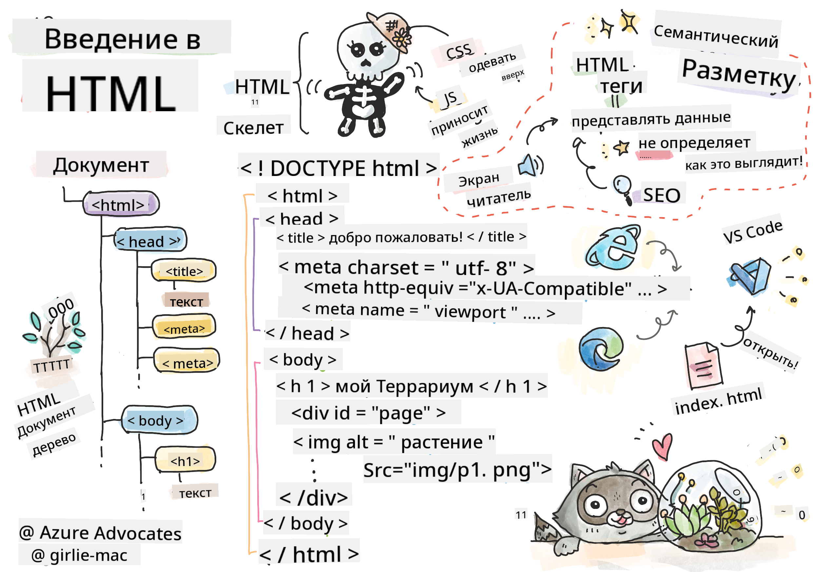
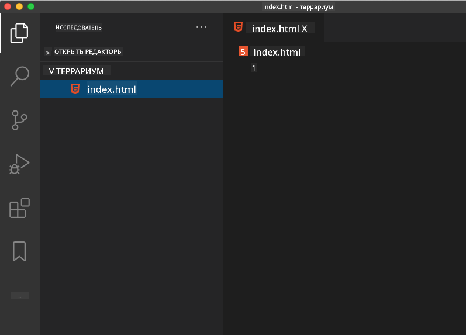

<!--
CO_OP_TRANSLATOR_METADATA:
{
  "original_hash": "46a0639e719b9cf1dfd062aa24cad639",
  "translation_date": "2025-08-25T21:05:32+00:00",
  "source_file": "3-terrarium/1-intro-to-html/README.md",
  "language_code": "ru"
}
-->
# Проект "Террариум", Часть 1: Введение в HTML

  
> Скетчноут от [Tomomi Imura](https://twitter.com/girlie_mac)

## Предварительный тест

[Предварительный тест](https://ashy-river-0debb7803.1.azurestaticapps.net/quiz/15)

> Посмотрите видео

> 
> [](https://www.youtube.com/watch?v=1TvxJKBzhyQ)

### Введение

HTML, или язык гипертекстовой разметки, — это "скелет" веба. Если CSS "одевает" ваш HTML, а JavaScript оживляет его, то HTML — это тело вашего веб-приложения. Синтаксис HTML даже отражает эту идею, так как включает теги "head", "body" и "footer".

В этом уроке мы будем использовать HTML для создания "скелета" интерфейса нашего виртуального террариума. Он будет включать заголовок и три колонки: правую и левую, где будут находиться перетаскиваемые растения, и центральную область, которая станет стеклянным террариумом. К концу этого урока вы сможете увидеть растения в колонках, но интерфейс будет выглядеть немного странно; не переживайте, в следующем разделе вы добавите стили CSS, чтобы улучшить внешний вид.

### Задание

На вашем компьютере создайте папку с названием 'terrarium', а внутри нее файл с именем 'index.html'. Вы можете сделать это в Visual Studio Code, открыв новое окно VS Code, нажав "открыть папку" и выбрав вашу новую папку. Затем нажмите на маленькую кнопку "файл" в панели проводника и создайте новый файл:



Или

Используйте эти команды в git bash:
* `mkdir terrarium`
* `cd terrarium`
* `touch index.html`
* `code index.html` или `nano index.html`

> Файлы index.html указывают браузеру, что это файл по умолчанию в папке; URL-адреса, такие как `https://anysite.com/test`, могут быть построены с использованием структуры папок, включающей папку с именем `test` и файлом `index.html` внутри; `index.html` не обязательно должен отображаться в URL.

---

## Doctype и теги html

Первая строка HTML-файла — это его doctype. Это может показаться неожиданным, но эта строка должна быть в самом верху файла, так как она сообщает старым браузерам, что страница должна отображаться в стандартном режиме, следуя текущей спецификации HTML.

> Подсказка: в VS Code вы можете навести курсор на тег, чтобы получить информацию о его использовании из справочников MDN.

Вторая строка должна быть открывающим тегом `<html>`, за которым сразу следует его закрывающий тег `</html>`. Эти теги являются корневыми элементами вашего интерфейса.

### Задание

Добавьте эти строки в начало вашего файла `index.html`:

```HTML
<!DOCTYPE html>
<html></html>
```

✅ Существуют разные режимы, которые можно определить, задав Doctype с помощью строки запроса: [Quirks Mode и Standards Mode](https://developer.mozilla.org/docs/Web/HTML/Quirks_Mode_and_Standards_Mode). Эти режимы использовались для поддержки очень старых браузеров, которые сейчас практически не используются (Netscape Navigator 4 и Internet Explorer 5). Вы можете придерживаться стандартного объявления doctype.

---

## 'Head' документа

Область 'head' HTML-документа включает важную информацию о вашей веб-странице, также известную как [метаданные](https://developer.mozilla.org/docs/Web/HTML/Element/meta). В нашем случае мы указываем веб-серверу, на который будет отправлена эта страница, следующие четыре вещи:

-   заголовок страницы
-   метаданные страницы, включая:
    -   'character set', указывающий, какая кодировка символов используется на странице
    -   информацию о браузере, включая `x-ua-compatible`, который указывает, что поддерживается браузер IE=edge
    -   информацию о том, как должен вести себя viewport при загрузке. Установка начального масштаба viewport в 1 контролирует уровень масштабирования при первой загрузке страницы.

### Задание

Добавьте блок 'head' в ваш документ между открывающим и закрывающим тегами `<html>`.

```html
<head>
	<title>Welcome to my Virtual Terrarium</title>
	<meta charset="utf-8" />
	<meta http-equiv="X-UA-Compatible" content="IE=edge" />
	<meta name="viewport" content="width=device-width, initial-scale=1" />
</head>
```

✅ Что произойдет, если вы установите мета-тег viewport, например, так: `<meta name="viewport" content="width=600">`? Узнайте больше о [viewport](https://developer.mozilla.org/docs/Web/HTML/Viewport_meta_tag).

---

## `Body` документа

### Теги HTML

В HTML вы добавляете теги в ваш .html файл, чтобы создавать элементы веб-страницы. Каждый тег обычно имеет открывающий и закрывающий теги, например: `<p>hello</p>` для обозначения абзаца. Создайте тело вашего интерфейса, добавив набор тегов `<body>` внутри пары тегов `<html>`; теперь ваша разметка выглядит так:

### Задание

```html
<!DOCTYPE html>
<html>
	<head>
		<title>Welcome to my Virtual Terrarium</title>
		<meta charset="utf-8" />
		<meta http-equiv="X-UA-Compatible" content="IE=edge" />
		<meta name="viewport" content="width=device-width, initial-scale=1" />
	</head>
	<body></body>
</html>
```

Теперь вы можете начать создавать вашу страницу. Обычно для создания отдельных элементов на странице используются теги `<div>`. Мы создадим серию элементов `<div>`, которые будут содержать изображения.

### Изображения

Один из тегов HTML, который не требует закрывающего тега, — это ``, так как он имеет элемент `src`, содержащий всю информацию, необходимую для отображения элемента на странице.

Создайте папку в вашем приложении с названием `images` и добавьте туда все изображения из [папки с исходным кодом](../../../../3-terrarium/solution/images); (всего 14 изображений растений).

### Задание

Добавьте эти изображения растений в две колонки между тегами `<body></body>`:

```html
<div id="page">
	<div id="left-container" class="container">
		<div class="plant-holder">
			
		</div>
		<div class="plant-holder">
			
		</div>
		<div class="plant-holder">
			
		</div>
		<div class="plant-holder">
			
		</div>
		<div class="plant-holder">
			
		</div>
		<div class="plant-holder">
			
		</div>
		<div class="plant-holder">
			
		</div>
	</div>
	<div id="right-container" class="container">
		<div class="plant-holder">
			
		</div>
		<div class="plant-holder">
			
		</div>
		<div class="plant-holder">
			
		</div>
		<div class="plant-holder">
			
		</div>
		<div class="plant-holder">
			
		</div>
		<div class="plant-holder">
			
		</div>
		<div class="plant-holder">
			
		</div>
	</div>
</div>
```

> Примечание: Spans vs. Divs. Divs считаются блочными элементами, а Spans — встроенными. Что произойдет, если вы замените эти div на span?

С этой разметкой растения теперь отображаются на экране. Выглядит это пока плохо, так как они еще не стилизованы с помощью CSS, но мы займемся этим в следующем уроке.

Каждое изображение имеет альтернативный текст (alt), который будет отображаться, даже если вы не можете увидеть или отобразить изображение. Это важный атрибут для обеспечения доступности. Узнайте больше о доступности в будущих уроках; пока запомните, что атрибут alt предоставляет альтернативную информацию для изображения, если пользователь по какой-либо причине не может его увидеть (из-за медленного соединения, ошибки в атрибуте src или если пользователь использует экранный диктор).

✅ Обратили ли вы внимание, что у каждого изображения одинаковый alt-тег? Это хорошая практика? Почему или почему нет? Можете ли вы улучшить этот код?

---

## Семантическая разметка

В общем, предпочтительнее использовать осмысленную "семантику" при написании HTML. Что это значит? Это значит, что вы используете HTML-теги для представления типа данных или взаимодействия, для которых они были разработаны. Например, основной заголовок текста на странице должен использовать тег `<h1>`.

Добавьте следующую строку сразу под открывающим тегом `<body>`:

```html
<h1>My Terrarium</h1>
```

Использование семантической разметки, такой как заголовки `<h1>` и ненумерованные списки `<ul>`, помогает экранным дикторам ориентироваться на странице. В общем, кнопки должны быть написаны как `<button>`, а списки — как `<li>`. Хотя _возможно_ использовать специально стилизованные элементы `<span>` с обработчиками кликов для имитации кнопок, для пользователей с ограниченными возможностями лучше, если технологии смогут определить, где на странице находится кнопка, и взаимодействовать с ней, если элемент отображается как кнопка. По этой причине старайтесь использовать семантическую разметку как можно чаще.

✅ Ознакомьтесь с экранным диктором и [тем, как он взаимодействует с веб-страницей](https://www.youtube.com/watch?v=OUDV1gqs9GA). Можете ли вы понять, почему несемантическая разметка может раздражать пользователя?

## Террариум

Последняя часть этого интерфейса включает создание разметки, которая будет стилизована для создания террариума.

### Задание:

Добавьте эту разметку перед последним тегом `</div>`:

```html
<div id="terrarium">
	<div class="jar-top"></div>
	<div class="jar-walls">
		<div class="jar-glossy-long"></div>
		<div class="jar-glossy-short"></div>
	</div>
	<div class="dirt"></div>
	<div class="jar-bottom"></div>
</div>
```

✅ Несмотря на то, что вы добавили эту разметку на экран, вы ничего не видите. Почему?

---

## 🚀Челлендж

Существуют забавные "старые" теги в HTML, которые все еще можно использовать, хотя вы не должны использовать устаревшие теги, такие как [эти теги](https://developer.mozilla.org/docs/Web/HTML/Element#Obsolete_and_deprecated_elements) в вашей разметке. Тем не менее, можете ли вы использовать старый тег `<marquee>`, чтобы заголовок h1 прокручивался горизонтально? (если сделаете это, не забудьте удалить его потом)

## Тест после лекции

[Тест после лекции](https://ashy-river-0debb7803.1.azurestaticapps.net/quiz/16)

## Обзор и самостоятельное изучение

HTML — это "проверенная временем" система строительных блоков, которая помогла создать веб таким, каким мы его знаем сегодня. Узнайте немного о его истории, изучив старые и новые теги. Можете ли вы понять, почему некоторые теги были устаревшими, а другие добавлены? Какие теги могут быть введены в будущем?

Узнайте больше о создании сайтов для веба и мобильных устройств на [Microsoft Learn](https://docs.microsoft.com/learn/modules/build-simple-website/?WT.mc_id=academic-77807-sagibbon).

## Задание

[Попрактикуйтесь в HTML: создайте макет блога](assignment.md)

**Отказ от ответственности**:  
Этот документ был переведен с использованием сервиса автоматического перевода [Co-op Translator](https://github.com/Azure/co-op-translator). Хотя мы стремимся к точности, пожалуйста, учитывайте, что автоматические переводы могут содержать ошибки или неточности. Оригинальный документ на его родном языке следует считать авторитетным источником. Для получения критически важной информации рекомендуется профессиональный перевод человеком. Мы не несем ответственности за любые недоразумения или неправильные интерпретации, возникающие в результате использования данного перевода.