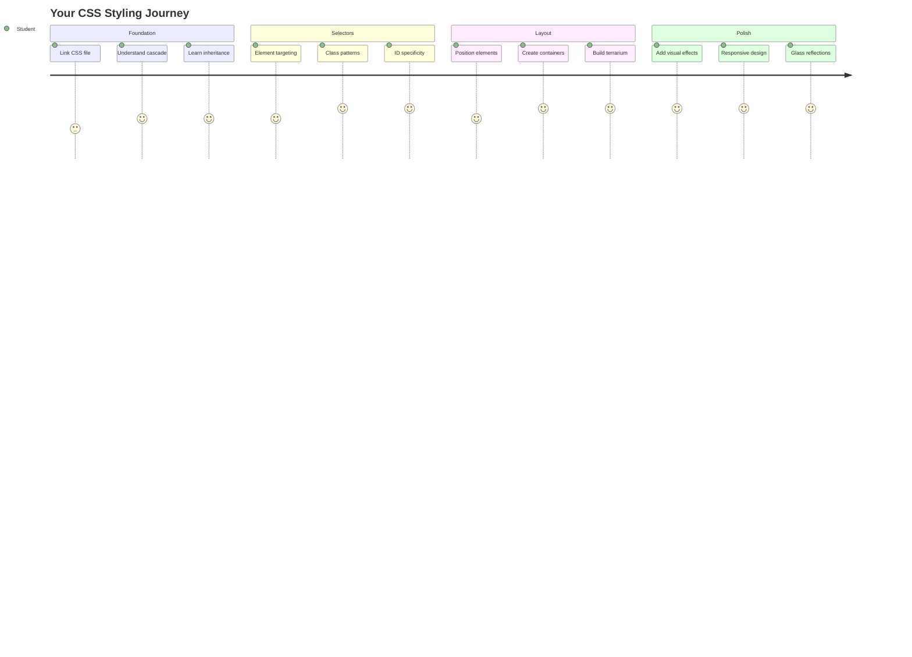
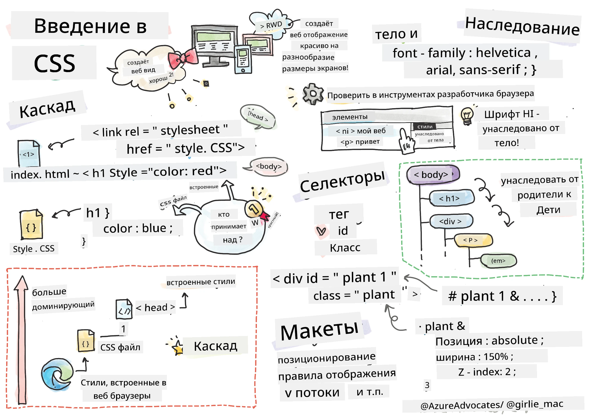
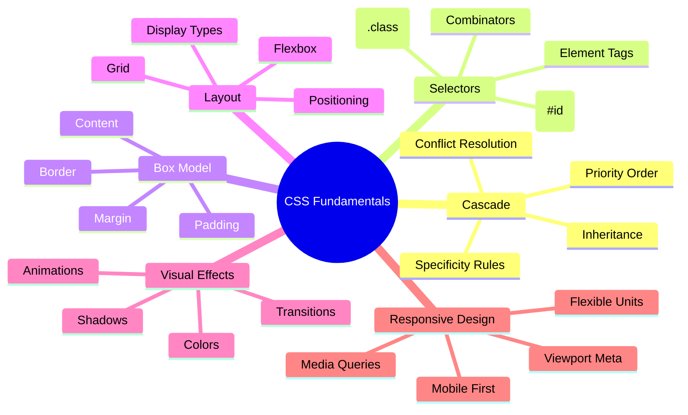
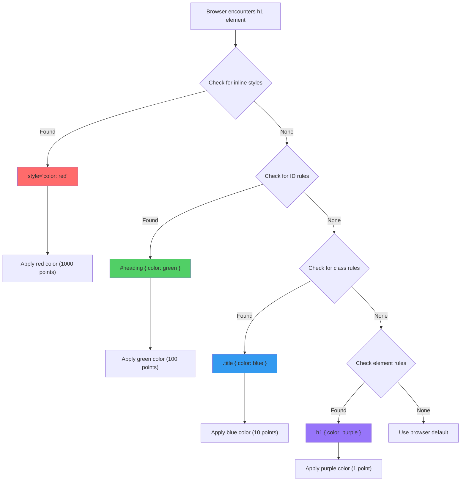
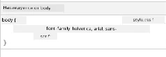
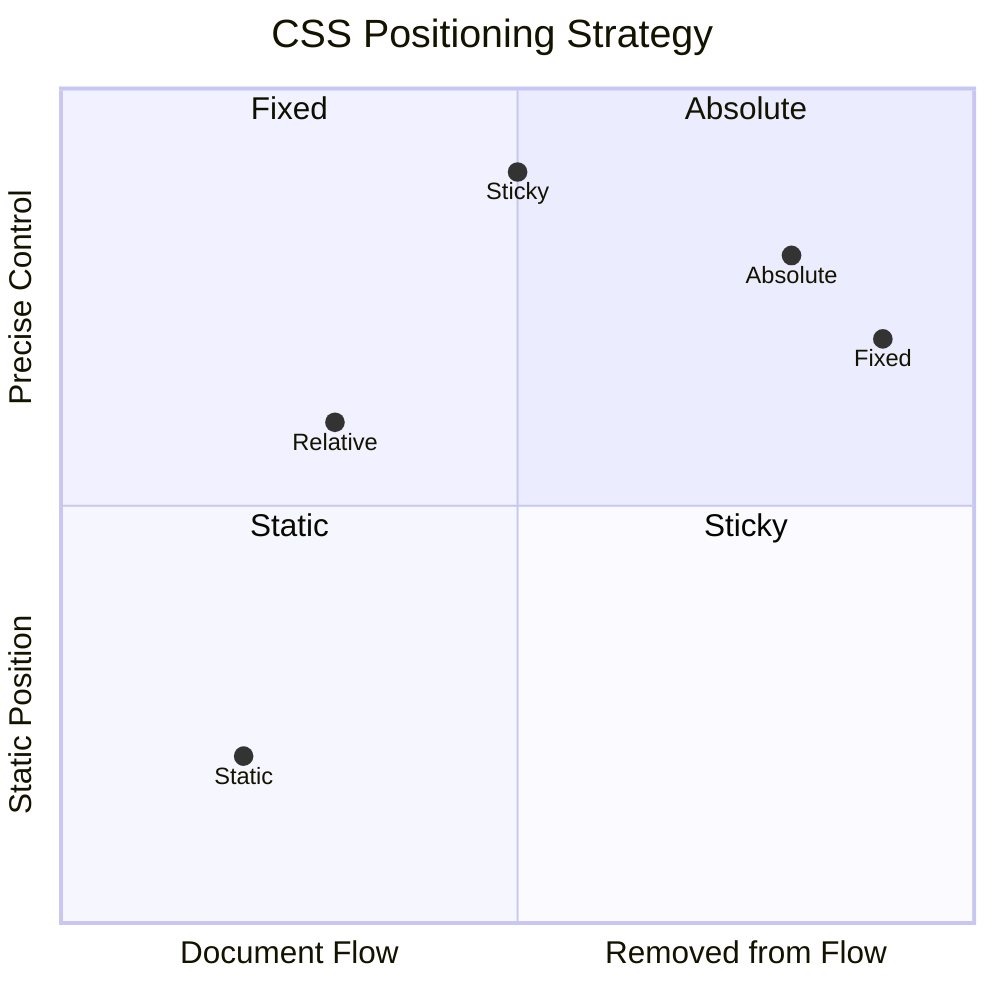
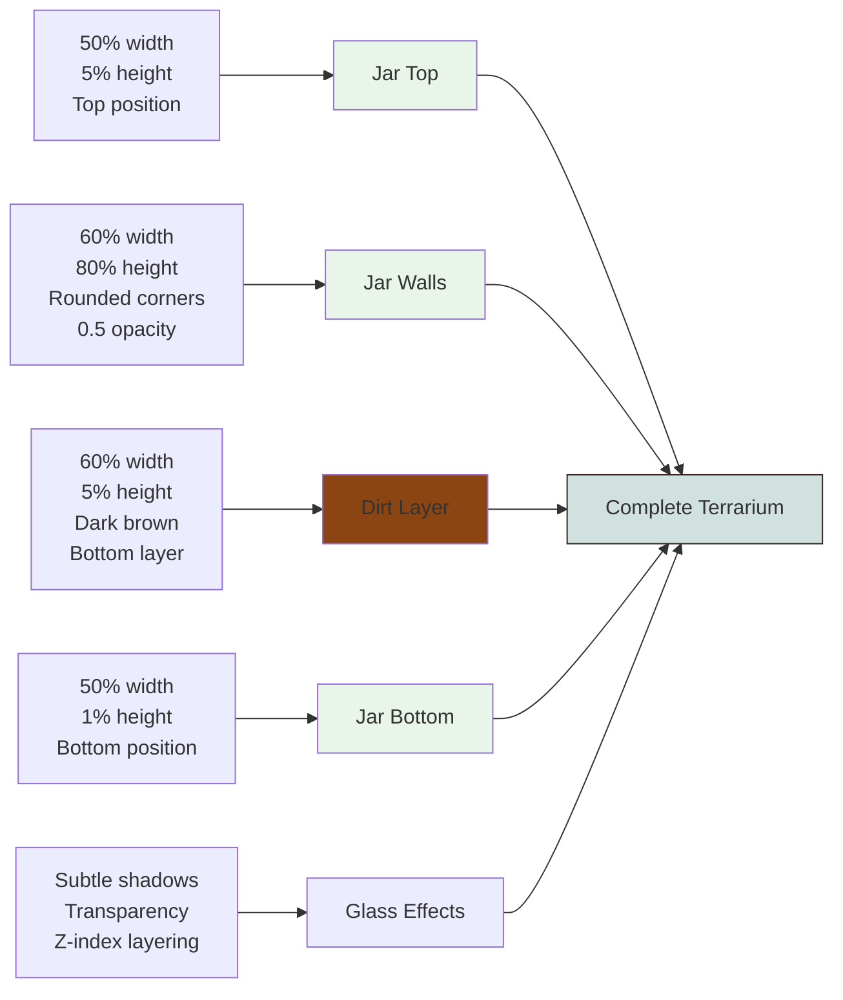
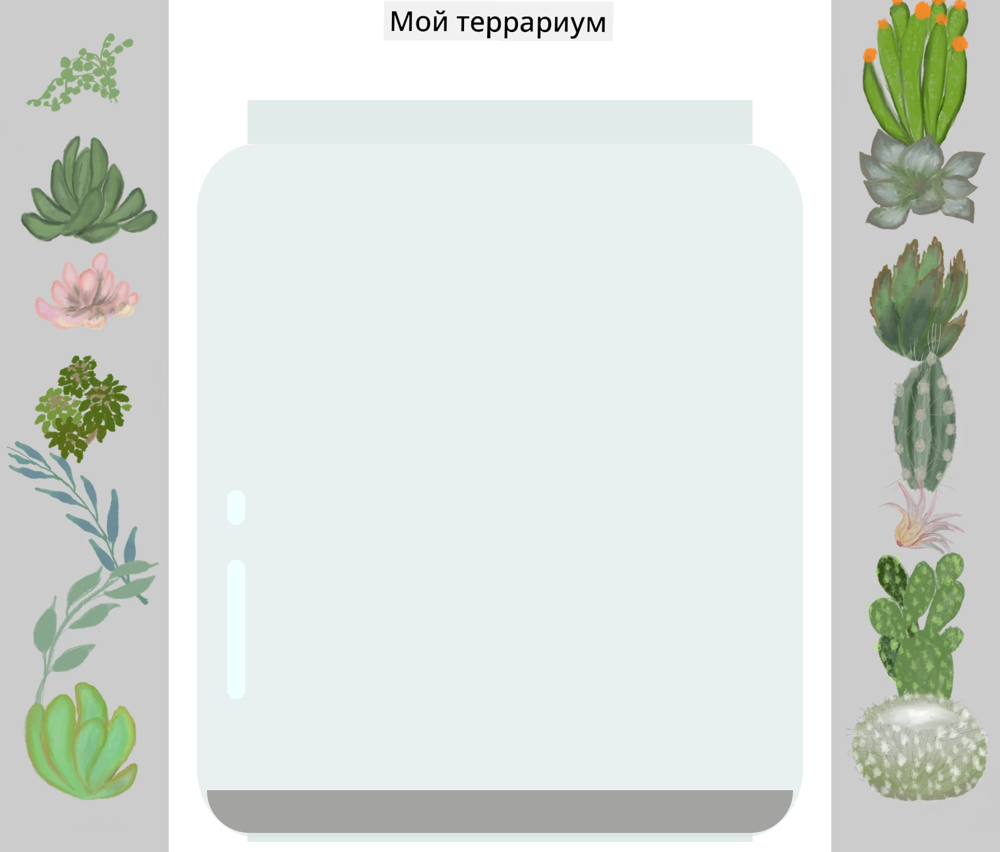
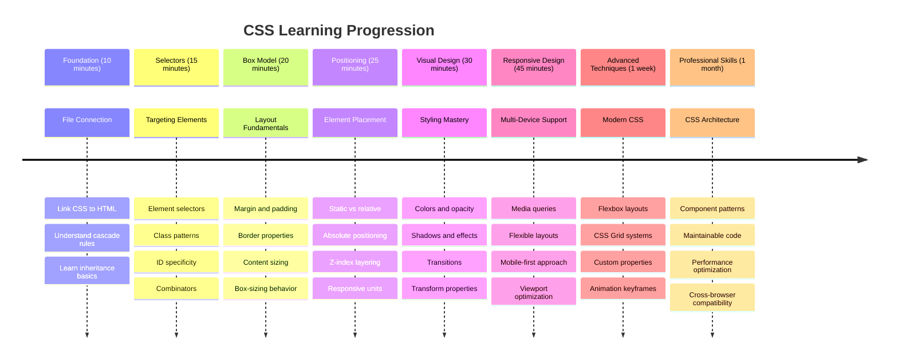

# Проект "Террариум", часть 2: Введение в CSS




> Скетчноут от [Tomomi Imura](https://twitter.com/girlie_mac)

Помните, как ваш HTML-террариум выглядел довольно просто? С помощью CSS мы преобразуем эту простую структуру в нечто визуально привлекательное.

Если HTML — это как строительство каркаса дома, то CSS — это все, что делает его уютным: цвета стен, расстановка мебели, освещение и то, как комнаты соединяются друг с другом. Подумайте, как дворец Версаль начинался как простой охотничий домик, но благодаря вниманию к декору и планировке превратился в одно из самых великолепных зданий мира.

Сегодня мы преобразуем ваш террариум из функционального в изысканный. Вы научитесь точно позиционировать элементы, адаптировать макеты к различным размерам экранов и создавать визуальную привлекательность, которая делает сайты интересными.

К концу этого урока вы увидите, как стратегическое использование CSS-стилей может значительно улучшить ваш проект. Давайте добавим стиль вашему террариуму.



## Предварительный тест

[Предварительный тест](https://ff-quizzes.netlify.app/web/quiz/17)

## Начало работы с CSS

CSS часто воспринимается как инструмент для "украшения", но его назначение гораздо шире. CSS — это как быть режиссером фильма: вы контролируете не только внешний вид, но и движение, взаимодействие и адаптацию к различным ситуациям.

Современный CSS обладает удивительными возможностями. Вы можете писать код, который автоматически адаптирует макеты для телефонов, планшетов и настольных компьютеров. Вы можете создавать плавные анимации, которые привлекают внимание пользователей туда, куда нужно. Результаты могут быть впечатляющими, когда все работает вместе.

> 💡 **Полезный совет**: CSS постоянно развивается, добавляя новые функции и возможности. Всегда проверяйте [CanIUse.com](https://caniuse.com), чтобы убедиться в поддержке браузерами новых функций CSS перед их использованием в производственных проектах.

**Вот что мы сделаем в этом уроке:**
- **Создадим** полный визуальный дизайн для вашего террариума, используя современные техники CSS
- **Изучим** основные концепции, такие как каскадирование, наследование и селекторы CSS
- **Реализуем** стратегии адаптивного позиционирования и макета
- **Построим** контейнер террариума, используя формы и стили CSS

### Предварительные требования

Вы должны завершить создание HTML-структуры для вашего террариума из предыдущего урока и подготовить ее для стилизации.

> 📺 **Видео-ресурс**: Ознакомьтесь с этим полезным видео-обзором
>
> [](https://www.youtube.com/watch?v=6yIdOIV9p1I)

### Настройка файла CSS

Прежде чем начать стилизацию, нам нужно подключить CSS к нашему HTML. Это соединение сообщает браузеру, где найти инструкции по стилизации для нашего террариума.

В папке вашего террариума создайте новый файл с именем `style.css`, затем подключите его в секции `<head>` вашего HTML-документа:

```html
<link rel="stylesheet" href="./style.css" />
```

**Что делает этот код:**
- **Создает** соединение между вашими HTML- и CSS-файлами
- **Сообщает** браузеру загрузить и применить стили из `style.css`
- **Использует** атрибут `rel="stylesheet"`, чтобы указать, что это CSS-файл
- **Ссылается** на путь к файлу через `href="./style.css"`

## Понимание каскада CSS

Задумывались, почему CSS называется "каскадными" таблицами стилей? Стили каскадируют, как водопад, и иногда конфликтуют друг с другом.

Представьте, как работает структура командования в армии: общий приказ может гласить "все войска носят зеленую форму", но конкретный приказ для вашего подразделения может сказать "надеть парадную форму для церемонии". Более конкретная инструкция имеет приоритет. CSS следует аналогичной логике, и понимание этой иерархии делает отладку гораздо проще.

### Эксперимент с приоритетом каскада

Давайте посмотрим на каскад в действии, создав конфликт стилей. Сначала добавьте встроенный стиль в ваш тег `<h1>`:

```html
<h1 style="color: red">My Terrarium</h1>
```

**Что делает этот код:**
- **Применяет** красный цвет непосредственно к элементу `<h1>` с помощью встроенного стиля
- **Использует** атрибут `style` для встраивания CSS прямо в HTML
- **Создает** стиль с самым высоким приоритетом для этого конкретного элемента

Затем добавьте это правило в ваш файл `style.css`:

```css
h1 {
  color: blue;
}
```

**В приведенном выше коде мы:**
- **Определили** правило CSS, которое нацелено на все элементы `<h1>`
- **Установили** цвет текста синим, используя внешний файл стилей
- **Создали** правило с более низким приоритетом по сравнению со встроенными стилями

✅ **Проверка знаний**: Какой цвет отображается в вашем веб-приложении? Почему этот цвет выигрывает? Можете ли вы придумать сценарии, где вам может понадобиться переопределить стили?



> 💡 **Порядок приоритетов CSS (от самого высокого к самому низкому):**
> 1. **Встроенные стили** (атрибут style)
> 2. **ID** (#myId)
> 3. **Классы** (.myClass) и атрибуты
> 4. **Селекторы элементов** (h1, div, p)
> 5. **Стандартные настройки браузера**

## Наследование CSS в действии

Наследование CSS работает как генетика — элементы наследуют определенные свойства от своих родительских элементов. Если вы установите семейство шрифтов для элемента body, весь текст внутри автоматически будет использовать этот же шрифт. Это похоже на то, как характерная форма челюсти семьи Габсбургов проявлялась в поколениях, не будучи специально указана для каждого человека.

Однако не все свойства наследуются. Текстовые стили, такие как шрифты и цвета, наследуются, но свойства макета, такие как отступы и границы, не наследуются. Точно так же, как дети могут наследовать физические черты, но не стиль одежды своих родителей.

### Наблюдение за наследованием шрифтов

Давайте посмотрим на наследование в действии, установив семейство шрифтов для элемента `<body>`:

```css
body {
  font-family: 'Segoe UI', Tahoma, Geneva, Verdana, sans-serif;
}
```

**Разбор того, что происходит:**
- **Устанавливает** семейство шрифтов для всей страницы, нацеливаясь на элемент `<body>`
- **Использует** стек шрифтов с резервными вариантами для лучшей совместимости с браузерами
- **Применяет** современные системные шрифты, которые отлично смотрятся на разных операционных системах
- **Обеспечивает**, что все дочерние элементы наследуют этот шрифт, если он не переопределен

Откройте инструменты разработчика вашего браузера (F12), перейдите на вкладку "Элементы" и проверьте ваш элемент `<h1>`. Вы увидите, что он наследует семейство шрифтов от body:



✅ **Время эксперимента**: Попробуйте установить другие наследуемые свойства для `<body>`, такие как `color`, `line-height` или `text-align`. Что происходит с вашим заголовком и другими элементами?

> 📝 **Наследуемые свойства включают**: `color`, `font-family`, `font-size`, `line-height`, `text-align`, `visibility`
>
> **Не наследуемые свойства включают**: `margin`, `padding`, `border`, `width`, `height`, `position`

### 🔄 **Педагогическая проверка**
**Понимание основ CSS**: Перед переходом к селекторам убедитесь, что вы можете:
- ✅ Объяснить разницу между каскадом и наследованием
- ✅ Предсказать, какой стиль победит в конфликте специфичности
- ✅ Определить, какие свойства наследуются от родительских элементов
- ✅ Правильно подключить CSS-файлы к HTML

**Быстрый тест**: Если у вас есть эти стили, какого цвета будет `<h1>` внутри `<div class="special">`?
```css
div { color: blue; }
.special { color: green; }
h1 { color: red; }
```
*Ответ: Красный (селектор элемента напрямую нацелен на h1)*

## Освоение селекторов CSS

Селекторы CSS — это ваш способ нацеливания на конкретные элементы для стилизации. Они работают как точные указания — вместо того, чтобы сказать "дом", вы можете сказать "синий дом с красной дверью на улице Мэйпл".

CSS предоставляет разные способы быть точным, и выбор правильного селектора — это как выбор подходящего инструмента для задачи. Иногда нужно стилизовать каждую дверь в районе, а иногда только одну конкретную дверь.

### Селекторы элементов (теги)

Селекторы элементов нацеливаются на HTML-элементы по их имени тега. Они идеально подходят для установки базовых стилей, которые применяются ко всей странице:

```css
body {
  font-family: 'Segoe UI', Tahoma, Geneva, Verdana, sans-serif;
  margin: 0;
  padding: 0;
}

h1 {
  color: #3a241d;
  text-align: center;
  font-size: 2.5rem;
  margin-bottom: 1rem;
}
```

**Понимание этих стилей:**
- **Устанавливает** единообразную типографику для всей страницы с помощью селектора `body`
- **Удаляет** стандартные отступы и поля браузера для лучшего контроля
- **Стилизует** все элементы заголовков с цветом, выравниванием и интервалами
- **Использует** единицы `rem` для масштабируемого, доступного размера шрифта

Хотя селекторы элементов хорошо работают для общего стилизования, вам понадобятся более специфичные селекторы для стилизации отдельных компонентов, таких как растения в вашем террариуме.

### Селекторы ID для уникальных элементов

Селекторы ID используют символ `#` и нацеливаются на элементы с определенными атрибутами `id`. Поскольку ID должны быть уникальными на странице, они идеально подходят для стилизации отдельных, особенных элементов, таких как контейнеры для растений слева и справа.

Давайте создадим стили для боковых контейнеров террариума, где будут находиться растения:

```css
#left-container {
  background-color: #f5f5f5;
  width: 15%;
  left: 0;
  top: 0;
  position: absolute;
  height: 100vh;
  padding: 1rem;
  box-sizing: border-box;
}

#right-container {
  background-color: #f5f5f5;
  width: 15%;
  right: 0;
  top: 0;
  position: absolute;
  height: 100vh;
  padding: 1rem;
  box-sizing: border-box;
}
```

**Что делает этот код:**
- **Располагает** контейнеры по краям экрана с помощью абсолютного позиционирования
- **Использует** единицы `vh` (высота окна просмотра) для адаптивной высоты, которая подстраивается под размер экрана
- **Применяет** `box-sizing: border-box`, чтобы отступы включались в общую ширину
- **Удаляет** ненужные единицы `px` из нулевых значений для более чистого кода
- **Устанавливает** мягкий цвет фона, который приятнее для глаз, чем резкий серый

✅ **Задача по качеству кода**: Обратите внимание, как этот CSS нарушает принцип DRY (Don't Repeat Yourself). Можете ли вы оптимизировать его, используя как ID, так и класс?

**Улучшенный подход:**
```html
<div id="left-container" class="container"></div>
<div id="right-container" class="container"></div>
```

```css
.container {
  background-color: #f5f5f5;
  width: 15%;
  top: 0;
  position: absolute;
  height: 100vh;
  padding: 1rem;
  box-sizing: border-box;
}

#left-container {
  left: 0;
}

#right-container {
  right: 0;
}
```

### Селекторы классов для повторяемых стилей

Селекторы классов используют символ `.` и идеально подходят, когда вы хотите применить одни и те же стили к нескольким элементам. В отличие от ID, классы можно использовать повторно в вашем HTML, что делает их идеальными для создания единообразных шаблонов стилизации.

В нашем террариуме каждому растению нужна похожая стилизация, но также индивидуальное позиционирование. Мы будем использовать комбинацию классов для общих стилей и ID для уникального позиционирования.

**Вот структура HTML для каждого растения:**
```html
<div class="plant-holder">
  
</div>
```

**Ключевые элементы объяснены:**
- **Использует** `class="plant-holder"` для единообразной стилизации контейнера для всех растений
- **Применяет** `class="plant"` для общих стилей изображения и поведения
- **Включает** уникальный `id="plant1"` для индивидуального позиционирования и взаимодействия с JavaScript
- **Обеспечивает** описательный текст для доступности экранных читалок

Теперь добавьте эти стили в ваш файл `style.css`:

```css
.plant-holder {
  position: relative;
  height: 13%;
  left: -0.6rem;
}

.plant {
  position: absolute;
  max-width: 150%;
  max-height: 150%;
  z-index: 2;
  transition: transform 0.3s ease;
}

.plant:hover {
  transform: scale(1.05);
}
```

**Разбор этих стилей:**
- **Создает** относительное позиционирование для держателя растения, чтобы установить контекст позиционирования
- **Устанавливает** высоту каждого держателя растения на 13%, чтобы все растения помещались вертикально без прокрутки
- **Смещает** держатели немного влево для лучшего центрирования растений в их контейнерах
- **Позволяет** растениям адаптироваться по размеру с помощью свойств `max-width` и `max-height`
- **Использует** `z-index` для размещения растений поверх других элементов террариума
- **Добавляет** мягкий эффект наведения с переходами CSS для улучшения взаимодействия с пользователем

✅ **Критическое мышление**: Почему нам нужны оба селектора `.plant-holder` и `.plant`? Что произойдет, если мы попробуем использовать только один?

> 💡 **Шаблон дизайна**: Контейнер (`.plant-holder`) управляет макетом и позиционированием, а содержимое (`.plant`) управляет внешним видом и масштабированием. Такое разделение делает код более удобным для поддержки и гибким.

## Понимание позиционирования в CSS

Позиционирование в CSS — это как быть режиссером спектакля: вы решаете, где каждый актер будет стоять и как он будет двигаться по сцене. Некоторые актеры следуют стандартной расстановке, а другие требуют особого позиционирования для драматического эффекта.

Как только вы поймете принципы позиционирования, многие задачи макета станут управляемыми. Нужна панель навигации, которая остается наверху при прокрутке? Позиционирование решает эту задачу. Хотите, чтобы всплывающая подсказка появлялась в определенном месте? Это тоже позиционирование.

### Пять значений позиционирования



| Значение позиционирования | Поведение | Применение |
|---------------------------|-----------|------------|
| `static` | Стандартный поток, игнорирует top/left/right/bottom | Обычная структура документа |
| `relative` | Позиционируется относительно своего нормального положения | Небольшие корректировки, создание контекста позиционирования |
| `absolute` | Позиционируется относительно ближайшего позиционированного предка | Точное размещение, наложения |
| `fixed` | Позиционируется относительно окна просмотра | Панели навигации, плавающие элементы |
| `sticky` | Переключается между относительным и фиксированным в зависимости от прокрутки | Заголовки, которые остаются на месте при прокрутке |

### Позиционирование в нашем террариуме

Наш террариум использует стратегическую комбинацию типов позиционирования для создания желаемого макета:

```css
/* Container positioning */
.container {
  position: absolute; /* Removes from normal flow */
  /* ... other styles ... */
}

/* Plant holder positioning */
.plant-holder {
  position: relative; /* Creates positioning context */
  /* ... other styles ... */
}

/* Plant positioning */
.plant {
  position: absolute; /* Allows precise placement within holder */
  /* ... other styles ... */
}
```

**Понимание стратегии позиционирования:**
- **Абсолютные контейнеры** удаляются из стандартного потока документа и закрепляются по краям экрана
- **Относительные держатели растений** создают контекст позиционирования, оставаясь в потоке документа
- **Абсолютные растения** могут быть точно позиционированы внутри своих относительных контейнеров
- **Эта комбинация** позволяет растениям располагаться вертикально, оставаясь индивидуально позиционируемыми

> 🎯 **Почему это важно**: Элементы `plant` нуждаются в абсолютном позиционировании, чтобы стать перетаскиваемыми в следующем уроке. Абсолютное позиционирование удаляет их из стандартного потока макета, делая возможным взаимодействие "перетащи и отпусти".

✅ **Время эксперимента**: Попробуйте изменить значения позиционирования и наблюдайте за результатами:
- Что произойдет, если вы измените `.container` с `absolute` на `relative`?
- Как изменится макет, если `.plant-holder` использовать `absolute` вместо `relative`?
- Что произойдет, если переключить `.plant` на относительное позиционирование?

### 🔄 **Педагогическая проверка**
**Мастерство позиционирования в CSS**: Сделайте паузу, чтобы проверить свои знания:
- ✅ Можете ли вы объяснить, почему растениям нужно абсолютное позиционирование для функции перетаскивания?
- ✅ Понимаете ли вы, как относительные контейнеры создают контекст позиционирования?
- ✅ Почему боковые контейнеры используют абсолютное позиционирование?
- ✅ Что произойдет, если полностью убрать декларации позиционирования?

**Связь с реальным миром**: Подумайте, как позиционирование в CSS отражает реальный мир:
- **Static**: Книги на полке (естественный порядок)
- **Relative**: Слегка переместить книгу, оставив её на месте
- **Absolute**: Положить закладку на конкретную страницу
- **Fixed**: Липкая заметка, которая остаётся видимой при перелистывании страниц

## Создание террариума с помощью CSS

Теперь мы создадим стеклянную банку, используя только CSS — без изображений или графических редакторов.

Создание реалистичного стекла, теней и эффектов глубины с помощью позиционирования и прозрачности демонстрирует визуальные возможности CSS. Этот подход напоминает, как архитекторы движения Баухаус использовали простые геометрические формы для создания сложных и красивых структур. Освоив эти принципы, вы сможете распознавать CSS-техники, лежащие в основе многих веб-дизайнов.



### Создание компонентов стеклянной банки

Давайте создадим террариумную банку по частям. Каждая часть использует абсолютное позиционирование и размеры, основанные на процентах, для адаптивного дизайна:

```css
.jar-walls {
  height: 80%;
  width: 60%;
  background: #d1e1df;
  border-radius: 1rem;
  position: absolute;
  bottom: 0.5%;
  left: 20%;
  opacity: 0.5;
  z-index: 1;
  box-shadow: inset 0 0 2rem rgba(0, 0, 0, 0.1);
}

.jar-top {
  width: 50%;
  height: 5%;
  background: #d1e1df;
  position: absolute;
  bottom: 80.5%;
  left: 25%;
  opacity: 0.7;
  z-index: 1;
  border-radius: 0.5rem 0.5rem 0 0;
}

.jar-bottom {
  width: 50%;
  height: 1%;
  background: #d1e1df;
  position: absolute;
  bottom: 0;
  left: 25%;
  opacity: 0.7;
  border-radius: 0 0 0.5rem 0.5rem;
}

.dirt {
  width: 60%;
  height: 5%;
  background: #3a241d;
  position: absolute;
  border-radius: 0 0 1rem 1rem;
  bottom: 1%;
  left: 20%;
  opacity: 0.7;
  z-index: -1;
}
```

**Понимание конструкции террариума:**
- **Использует** размеры, основанные на процентах, для масштабирования на всех размерах экрана
- **Позиционирует** элементы абсолютно для точного наложения и выравнивания
- **Применяет** разные значения прозрачности для создания эффекта стеклянной прозрачности
- **Реализует** слои с помощью `z-index`, чтобы растения выглядели внутри банки
- **Добавляет** тонкие тени и изящные закругления углов для более реалистичного вида

### Адаптивный дизайн с использованием процентов

Обратите внимание, что все размеры задаются в процентах, а не фиксированными пикселями:

**Почему это важно:**
- **Обеспечивает** пропорциональное масштабирование террариума на любом размере экрана
- **Сохраняет** визуальные отношения между компонентами банки
- **Гарантирует** единообразный опыт от мобильных телефонов до больших мониторов
- **Позволяет** дизайну адаптироваться без нарушения макета

### Единицы измерения в CSS

Мы используем единицы `rem` для закругления углов, которые масштабируются относительно размера шрифта корневого элемента. Это создает более доступные дизайны, которые учитывают предпочтения пользователей. Узнайте больше о [относительных единицах CSS](https://www.w3.org/TR/css-values-3/#font-relative-lengths) в официальной спецификации.

✅ **Визуальный эксперимент**: Попробуйте изменить эти значения и наблюдайте за эффектами:
- Измените прозрачность банки с 0.5 на 0.8 — как это повлияет на внешний вид стекла?
- Измените цвет земли с `#3a241d` на `#8B4513` — какое визуальное воздействие это окажет?
- Измените `z-index` земли на 2 — что произойдет с наложением слоев?

### 🔄 **Педагогическая проверка**
**Понимание визуального дизайна в CSS**: Убедитесь, что вы усвоили основы визуального CSS:
- ✅ Как размеры, основанные на процентах, создают адаптивный дизайн?
- ✅ Почему прозрачность создает эффект стеклянной прозрачности?
- ✅ Какую роль играет z-index в наложении элементов?
- ✅ Как значения закругления углов создают форму банки?

**Принцип дизайна**: Обратите внимание, как мы создаем сложные визуальные эффекты из простых форм:
1. **Прямоугольники** → **Закругленные прямоугольники** → **Компоненты банки**
2. **Плоские цвета** → **Прозрачность** → **Эффект стекла**
3. **Отдельные элементы** → **Сложная композиция** → **3D-вид**

---

## Вызов GitHub Copilot Agent 🚀

Используйте режим Agent, чтобы выполнить следующий вызов:

**Описание:** Создайте CSS-анимацию, которая заставляет растения в террариуме плавно раскачиваться из стороны в сторону, имитируя эффект естественного ветра. Это поможет вам попрактиковаться в CSS-анимациях, трансформациях и ключевых кадрах, а также улучшить визуальную привлекательность террариума.

**Задание:** Добавьте CSS-анимацию ключевых кадров, чтобы растения в террариуме плавно раскачивались из стороны в сторону. Создайте анимацию, которая слегка вращает каждое растение (на 2-3 градуса) влево и вправо с длительностью 3-4 секунды, и примените её к классу `.plant`. Убедитесь, что анимация повторяется бесконечно и имеет функцию сглаживания для естественного движения.

Узнайте больше о [режиме Agent](https://code.visualstudio.com/blogs/2025/02/24/introducing-copilot-agent-mode) здесь.

## 🚀 Вызов: Добавление отражений на стекле

Готовы улучшить террариум, добавив реалистичные отражения на стекле? Этот прием добавит глубину и реализм дизайну.

Вы создадите тонкие блики, которые имитируют отражение света на стеклянных поверхностях. Этот подход похож на то, как художники эпохи Возрождения, такие как Ян ван Эйк, использовали свет и отражение, чтобы сделать изображенное стекло трехмерным. Вот к чему вы стремитесь:



**Ваше задание:**
- **Создайте** тонкие белые или светлые овальные формы для отражений на стекле
- **Расположите** их стратегически на левой стороне банки
- **Примените** подходящую прозрачность и эффекты размытия для реалистичного отражения света
- **Используйте** `border-radius`, чтобы создать органичные, пузырьковые формы
- **Экспериментируйте** с градиентами или тенями для усиления реализма

## Викторина после лекции

[Викторина после лекции](https://ff-quizzes.netlify.app/web/quiz/18)

## Расширьте свои знания о CSS

CSS может показаться сложным на начальном этапе, но понимание этих основных концепций создаёт прочную основу для освоения более сложных техник.

**Ваши следующие области изучения CSS:**
- **Flexbox** - упрощает выравнивание и распределение элементов
- **CSS Grid** - предоставляет мощные инструменты для создания сложных макетов
- **CSS Variables** - уменьшает повторение и улучшает поддерживаемость
- **Адаптивный дизайн** - гарантирует, что сайты хорошо работают на разных размерах экрана

### Интерактивные обучающие ресурсы

Практикуйте эти концепции с помощью увлекательных, интерактивных игр:
- 🐸 [Flexbox Froggy](https://flexboxfroggy.com/) - Освойте Flexbox через веселые задания
- 🌱 [Grid Garden](https://codepip.com/games/grid-garden/) - Изучите CSS Grid, выращивая виртуальную морковь
- 🎯 [CSS Battle](https://cssbattle.dev/) - Проверьте свои навыки CSS с помощью кодинговых вызовов

### Дополнительное обучение

Для полного изучения основ CSS пройдите этот модуль Microsoft Learn: [Стилизация вашего HTML-приложения с помощью CSS](https://docs.microsoft.com/learn/modules/build-simple-website/4-css-basics/?WT.mc_id=academic-77807-sagibbon)

### ⚡ **Что вы можете сделать за следующие 5 минут**
- [ ] Откройте DevTools и изучите CSS-стили на любом сайте с помощью панели Elements
- [ ] Создайте простой CSS-файл и подключите его к HTML-странице
- [ ] Попробуйте изменить цвета разными способами: hex, RGB и именованные цвета
- [ ] Практикуйте модель коробки, добавляя отступы и поля к div

### 🎯 **Что вы можете достичь за этот час**
- [ ] Пройдите викторину после урока и повторите основы CSS
- [ ] Стилизуйте свою HTML-страницу с помощью шрифтов, цветов и интервалов
- [ ] Создайте простой макет с использованием flexbox или grid
- [ ] Экспериментируйте с CSS-переходами для плавных эффектов
- [ ] Практикуйте адаптивный дизайн с помощью медиа-запросов

### 📅 **Ваш недельный CSS-приключение**
- [ ] Завершите задание по стилизации террариума с творческим подходом
- [ ] Освойте CSS Grid, создавая макет фотогалереи
- [ ] Изучите CSS-анимации, чтобы оживить ваши дизайны
- [ ] Исследуйте препроцессоры CSS, такие как Sass или Less
- [ ] Изучите принципы дизайна и примените их к вашему CSS
- [ ] Анализируйте и воссоздавайте интересные дизайны, которые вы находите в интернете

### 🌟 **Ваш месячный путь к мастерству дизайна**
- [ ] Создайте полный адаптивный дизайн веб-сайта
- [ ] Изучите CSS-in-JS или фреймворки с утилитарным подходом, такие как Tailwind
- [ ] Внесите вклад в проекты с открытым исходным кодом, улучшая CSS
- [ ] Освойте сложные концепции CSS, такие как пользовательские свойства и containment
- [ ] Создайте библиотеки компонентов с модульным CSS
- [ ] Наставляйте других, изучающих CSS, и делитесь знаниями о дизайне

## 🎯 Ваш график освоения CSS



### 🛠️ Резюме вашего CSS-инструментария

После завершения этого урока у вас есть:
- **Понимание каскада**: Как стили наследуются и переопределяются
- **Мастерство селекторов**: Точное нацеливание с помощью элементов, классов и идентификаторов
- **Навыки позиционирования**: Стратегическое размещение и наложение элементов
- **Визуальный дизайн**: Создание эффектов стекла, теней и прозрачности
- **Адаптивные техники**: Макеты на основе процентов, которые адаптируются к любому экрану
- **Организация кода**: Чистая, поддерживаемая структура CSS
- **Современные практики**: Использование относительных единиц и доступных шаблонов дизайна

**Следующие шаги**: Ваш террариум теперь имеет структуру (HTML) и стиль (CSS). В финальном уроке мы добавим интерактивность с помощью JavaScript!

## Задание

[Рефакторинг CSS](assignment.md)

---

**Отказ от ответственности**:  
Этот документ был переведен с использованием сервиса автоматического перевода [Co-op Translator](https://github.com/Azure/co-op-translator). Несмотря на наши усилия обеспечить точность, автоматические переводы могут содержать ошибки или неточности. Оригинальный документ на его родном языке следует считать авторитетным источником. Для получения критически важной информации рекомендуется профессиональный перевод человеком. Мы не несем ответственности за любые недоразумения или неправильные интерпретации, возникающие в результате использования данного перевода.