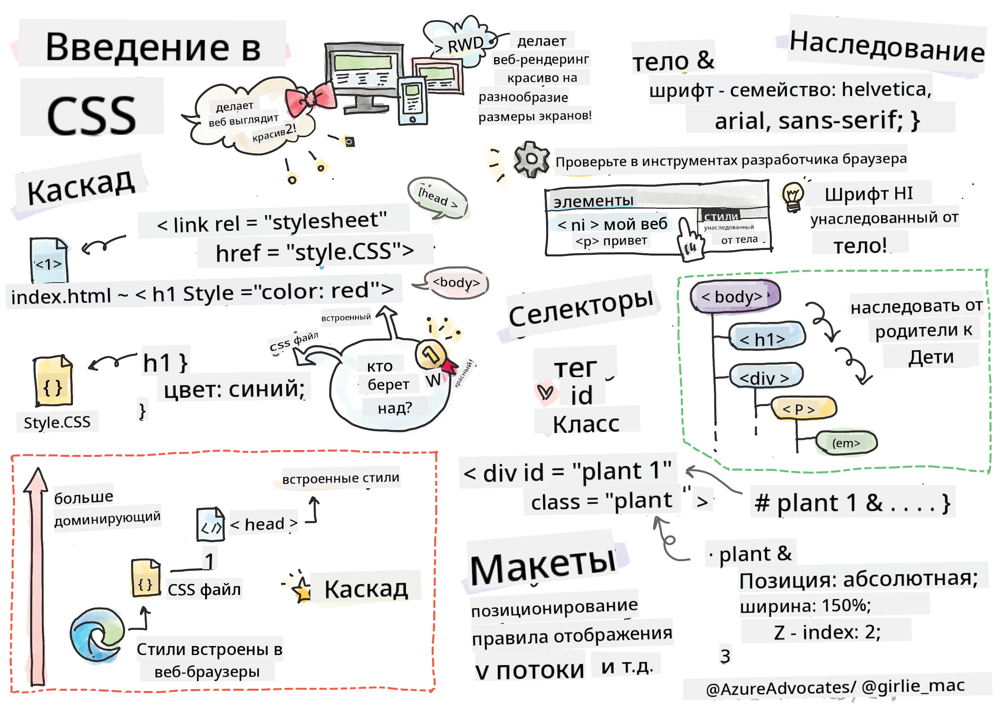
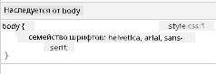

<!--
CO_OP_TRANSLATOR_METADATA:
{
  "original_hash": "acb5ae00cde004304296bb97da8ff4c3",
  "translation_date": "2025-08-28T23:22:25+00:00",
  "source_file": "3-terrarium/2-intro-to-css/README.md",
  "language_code": "ru"
}
-->
# Проект "Террариум", часть 2: Введение в CSS


> Скетчноут от [Tomomi Imura](https://twitter.com/girlie_mac)

## Викторина перед лекцией

[Викторина перед лекцией](https://ff-quizzes.netlify.app/web/quiz/17)

### Введение

CSS, или каскадные таблицы стилей, решают важную задачу веб-разработки: как сделать ваш сайт красивым. Стилизация приложений делает их более удобными и привлекательными; с помощью CSS также можно создать адаптивный веб-дизайн (Responsive Web Design, RWD), который позволяет приложениям выглядеть хорошо на экранах любого размера. CSS — это не только способ улучшить внешний вид приложения; спецификация включает анимации и трансформации, которые позволяют создавать сложные взаимодействия. Рабочая группа CSS помогает поддерживать актуальные спецификации CSS; следить за их работой можно на [сайте World Wide Web Consortium](https://www.w3.org/Style/CSS/members).

> Обратите внимание, CSS — это язык, который постоянно развивается, как и всё в вебе, и не все браузеры поддерживают новые части спецификации. Всегда проверяйте свои реализации, консультируясь с [CanIUse.com](https://caniuse.com).

В этом уроке мы добавим стили к нашему онлайн-террариуму и изучим несколько концепций CSS: каскадирование, наследование, использование селекторов, позиционирование и создание макетов с помощью CSS. В процессе мы создадим макет террариума и сам террариум.

### Предварительные требования

HTML для вашего террариума должен быть готов к стилизации.

> Посмотрите видео

> 
> [](https://www.youtube.com/watch?v=6yIdOIV9p1I)

### Задание

В папке вашего террариума создайте новый файл `style.css`. Импортируйте этот файл в секцию `<head>`:

```html
<link rel="stylesheet" href="./style.css" />
```

---

## Каскадирование

Каскадные таблицы стилей включают идею, что стили "каскадируют", то есть применение стиля определяется его приоритетом. Стили, заданные автором сайта, имеют приоритет над стилями, заданными браузером. Стили, заданные "встроенно" (inline), имеют приоритет над стилями, заданными во внешнем файле стилей.

### Задание

Добавьте встроенный стиль "color: red" к вашему тегу `<h1>`:

```HTML
<h1 style="color: red">My Terrarium</h1>
```

Затем добавьте следующий код в ваш файл `style.css`:

```CSS
h1 {
 color: blue;
}
```

✅ Какой цвет отображается в вашем веб-приложении? Почему? Можете ли вы найти способ переопределить стили? Когда это может быть полезно, а когда нет?

---

## Наследование

Стили наследуются от родительского элемента к дочернему, так что вложенные элементы наследуют стили своих родителей.

### Задание

Установите шрифт для тела документа и проверьте, наследует ли вложенный элемент этот шрифт:

```CSS
body {
	font-family: helvetica, arial, sans-serif;
}
```

Откройте консоль браузера на вкладке 'Elements' и посмотрите шрифт H1. Он наследует шрифт от тела документа, как указано в браузере:



✅ Можете ли вы заставить вложенный стиль наследовать другое свойство?

---

## Селекторы CSS

### Теги

На данный момент ваш файл `style.css` содержит стили только для нескольких тегов, и приложение выглядит довольно странно:

```CSS
body {
	font-family: helvetica, arial, sans-serif;
}

h1 {
	color: #3a241d;
	text-align: center;
}
```

Такой способ стилизации тегов позволяет вам управлять уникальными элементами, но для управления стилями множества растений в вашем террариуме вам нужно использовать селекторы CSS.

### Идентификаторы (Ids)

Добавьте стили для размещения контейнеров слева и справа. Поскольку на экране есть только один левый контейнер и один правый контейнер, им присваиваются идентификаторы в разметке. Чтобы их стилизовать, используйте `#`:

```CSS
#left-container {
	background-color: #eee;
	width: 15%;
	left: 0px;
	top: 0px;
	position: absolute;
	height: 100%;
	padding: 10px;
}

#right-container {
	background-color: #eee;
	width: 15%;
	right: 0px;
	top: 0px;
	position: absolute;
	height: 100%;
	padding: 10px;
}
```

Здесь вы разместили эти контейнеры с абсолютным позиционированием по краям экрана и использовали проценты для их ширины, чтобы они могли адаптироваться к маленьким экранам мобильных устройств.

✅ Этот код довольно повторяется, что нарушает принцип "DRY" (Don't Repeat Yourself). Можете ли вы найти более эффективный способ стилизации этих идентификаторов, возможно, используя идентификатор и класс? Вам нужно будет изменить разметку и переработать CSS:

```html
<div id="left-container" class="container"></div>
```

### Классы

В приведённом выше примере вы стилизовали два уникальных элемента на экране. Если вы хотите, чтобы стили применялись ко многим элементам на экране, вы можете использовать классы CSS. Сделайте это для размещения растений в контейнерах слева и справа.

Обратите внимание, что каждое растение в HTML-разметке имеет комбинацию идентификаторов и классов. Идентификаторы здесь используются JavaScript, который вы добавите позже, чтобы управлять размещением растений в террариуме. Классы же задают всем растениям определённый стиль.

```html
<div class="plant-holder">
	
</div>
```

Добавьте следующее в ваш файл `style.css`:

```CSS
.plant-holder {
	position: relative;
	height: 13%;
	left: -10px;
}

.plant {
	position: absolute;
	max-width: 150%;
	max-height: 150%;
	z-index: 2;
}
```

Примечательно в этом фрагменте смешение относительного и абсолютного позиционирования, о котором мы поговорим в следующем разделе. Обратите внимание на то, как высота задаётся в процентах:

Вы установили высоту держателя растений на 13% — хорошее значение, чтобы все растения отображались в каждом вертикальном контейнере без необходимости прокрутки.

Вы переместили держатель растений влево, чтобы растения были более центрированы в контейнере. У изображений есть большое количество прозрачного фона, чтобы их можно было легче перетаскивать, поэтому их нужно сдвинуть влево, чтобы они лучше вписывались в экран.

Затем самому растению задан максимальная ширина 150%. Это позволяет ему уменьшаться при уменьшении браузера. Попробуйте изменить размер браузера; растения остаются в своих контейнерах, но уменьшаются, чтобы вписаться.

Также примечательно использование z-index, который управляет относительной высотой элемента (чтобы растения находились поверх контейнера и выглядели так, будто они находятся внутри террариума).

✅ Почему вам нужны и держатель растений, и селектор растений в CSS?

## Позиционирование в CSS

Смешивание свойств позиционирования (существуют static, relative, fixed, absolute и sticky позиции) может быть немного сложным, но при правильном использовании оно даёт хороший контроль над элементами на ваших страницах.

Элементы с абсолютным позиционированием размещаются относительно ближайших позиционированных предков, а если их нет, то относительно тела документа.

Элементы с относительным позиционированием размещаются на основе указаний CSS, чтобы сместить их от начальной позиции.

В нашем примере `plant-holder` — это элемент с относительным позиционированием, который размещается внутри контейнера с абсолютным позиционированием. Результат такого поведения заключается в том, что боковые контейнеры закреплены слева и справа, а `plant-holder` вложен, регулируя своё положение внутри боковых контейнеров, создавая пространство для размещения растений в вертикальном ряду.

> Само растение также имеет абсолютное позиционирование, необходимое для того, чтобы сделать его перетаскиваемым, как вы узнаете в следующем уроке.

✅ Попробуйте изменить типы позиционирования боковых контейнеров и держателя растений. Что происходит?

## Макеты в CSS

Теперь вы используете то, что узнали, чтобы создать сам террариум, используя только CSS!

Сначала стилизуйте дочерние элементы `.terrarium` как закруглённый прямоугольник с помощью CSS:

```CSS
.jar-walls {
	height: 80%;
	width: 60%;
	background: #d1e1df;
	border-radius: 1rem;
	position: absolute;
	bottom: 0.5%;
	left: 20%;
	opacity: 0.5;
	z-index: 1;
}

.jar-top {
	width: 50%;
	height: 5%;
	background: #d1e1df;
	position: absolute;
	bottom: 80.5%;
	left: 25%;
	opacity: 0.7;
	z-index: 1;
}

.jar-bottom {
	width: 50%;
	height: 1%;
	background: #d1e1df;
	position: absolute;
	bottom: 0%;
	left: 25%;
	opacity: 0.7;
}

.dirt {
	width: 60%;
	height: 5%;
	background: #3a241d;
	position: absolute;
	border-radius: 0 0 1rem 1rem;
	bottom: 1%;
	left: 20%;
	opacity: 0.7;
	z-index: -1;
}
```

Обратите внимание на использование процентов. Если вы уменьшите размер браузера, вы увидите, как банка также масштабируется. Также обратите внимание на ширину и высоту в процентах для элементов банки и то, как каждый элемент абсолютно позиционируется в центре, закрепляясь внизу окна просмотра.

Мы также используем `rem` для border-radius — длину, зависящую от шрифта. Подробнее об этом типе относительных измерений можно прочитать в [спецификации CSS](https://www.w3.org/TR/css-values-3/#font-relative-lengths).

✅ Попробуйте изменить цвета банки и её прозрачность по сравнению с землёй. Что происходит? Почему?

---

## 🚀Задача

Добавьте "пузырьковый" блеск в левую нижнюю часть банки, чтобы она выглядела как стеклянная. Вы будете стилизовать `.jar-glossy-long` и `.jar-glossy-short`, чтобы они выглядели как отражённый блеск. Вот как это будет выглядеть:


Чтобы пройти викторину после лекции, изучите этот модуль Learn: [Стилизация HTML-приложения с помощью CSS](https://docs.microsoft.com/learn/modules/build-simple-website/4-css-basics/?WT.mc_id=academic-77807-sagibbon)

## Викторина после лекции

[Викторина после лекции](https://ff-quizzes.netlify.app/web/quiz/18)

## Обзор и самостоятельное изучение

CSS кажется обманчиво простым, но при попытке идеально стилизовать приложение для всех браузеров и всех размеров экранов возникают множество сложностей. CSS-Grid и Flexbox — это инструменты, разработанные для того, чтобы сделать задачу более структурированной и надёжной. Узнайте об этих инструментах, играя в [Flexbox Froggy](https://flexboxfroggy.com/) и [Grid Garden](https://codepip.com/games/grid-garden/).

## Задание

[Рефакторинг CSS](assignment.md)

---

**Отказ от ответственности**:  
Этот документ был переведен с помощью сервиса автоматического перевода [Co-op Translator](https://github.com/Azure/co-op-translator). Несмотря на наши усилия обеспечить точность, автоматические переводы могут содержать ошибки или неточности. Оригинальный документ на его родном языке следует считать авторитетным источником. Для получения критически важной информации рекомендуется профессиональный перевод человеком. Мы не несем ответственности за любые недоразумения или неправильные интерпретации, возникшие в результате использования данного перевода.