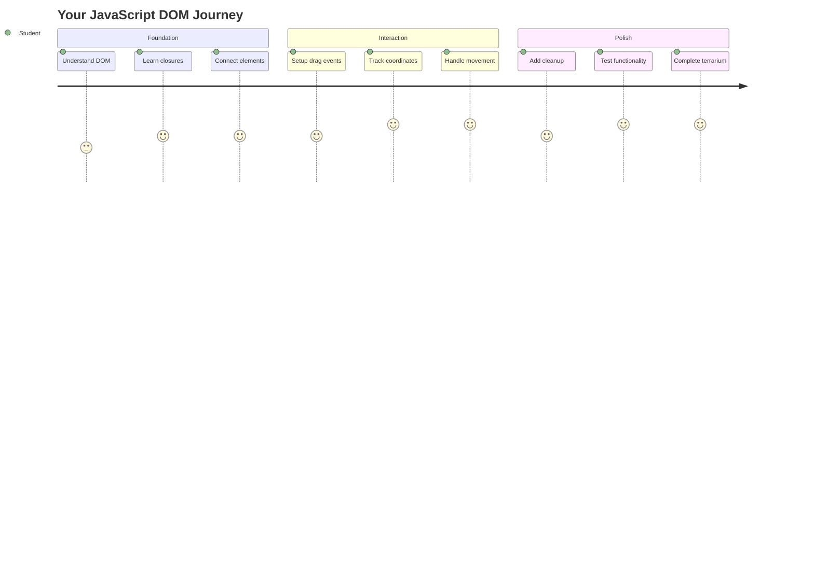
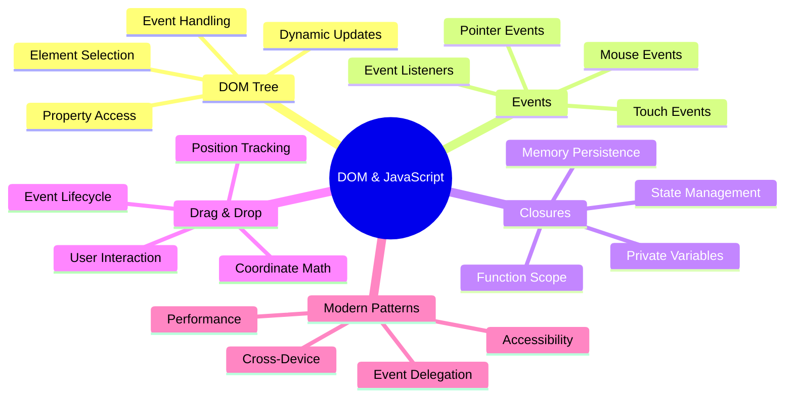
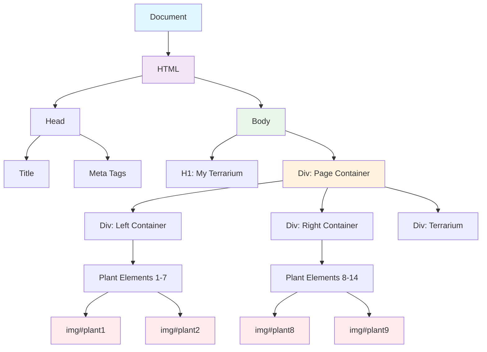
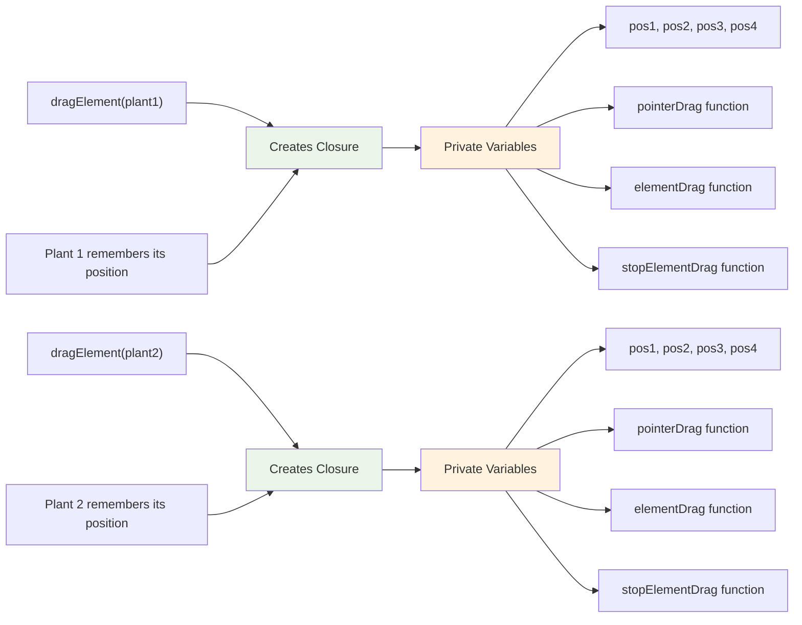
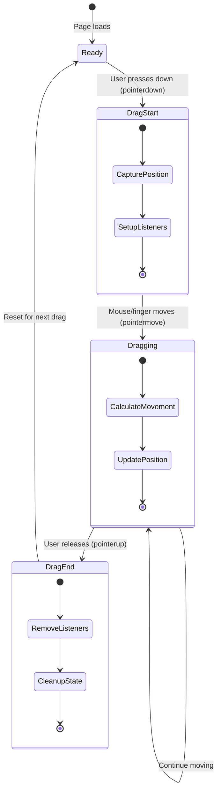
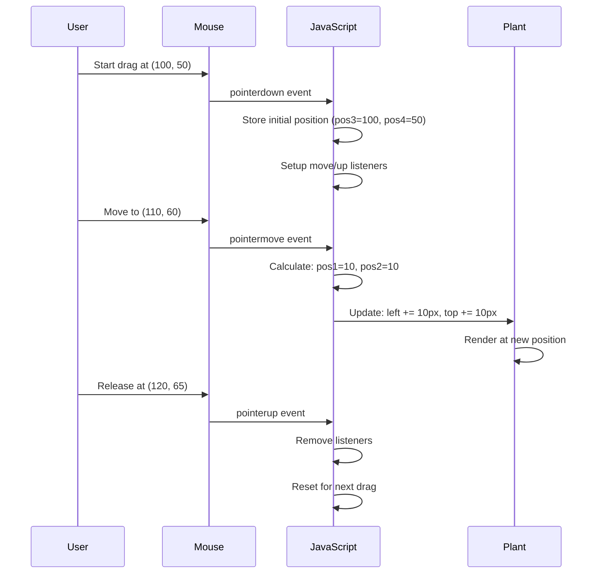
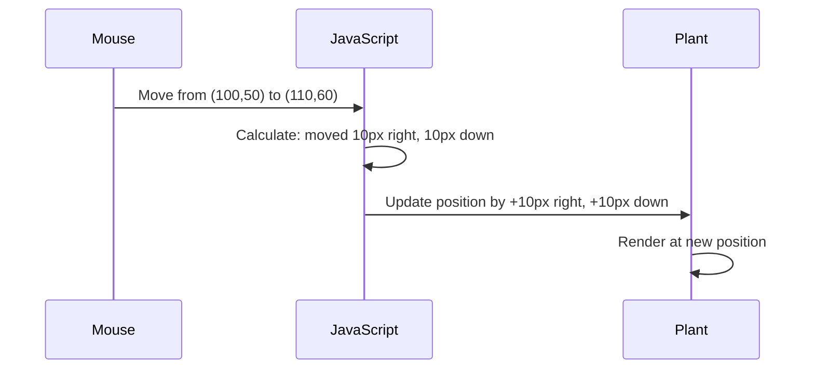
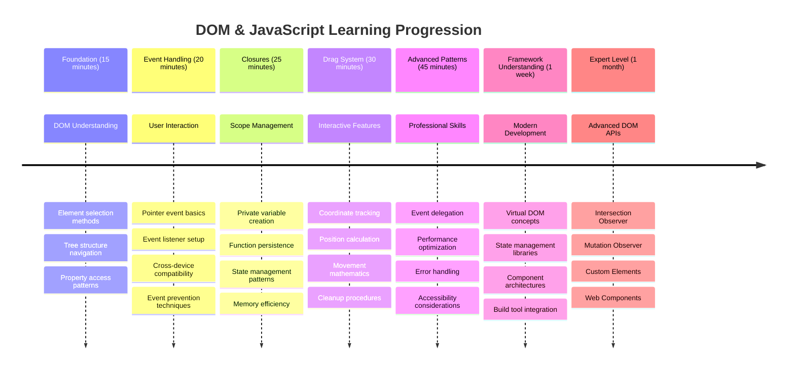

<!--
CO_OP_TRANSLATOR_METADATA:
{
  "original_hash": "973e48ad87d67bf5bb819746c9f8e302",
  "translation_date": "2025-11-03T23:21:09+00:00",
  "source_file": "3-terrarium/3-intro-to-DOM-and-closures/README.md",
  "language_code": "ru"
}
-->
# Проект "Террариум", часть 3: Манипуляции с DOM и замыкания в JavaScript




> Скетчноут от [Tomomi Imura](https://twitter.com/girlie_mac)

Добро пожаловать в одну из самых увлекательных частей веб-разработки — создание интерактивности! Document Object Model (DOM) — это мост между вашим HTML и JavaScript, и сегодня мы используем его, чтобы оживить ваш террариум. Когда Тим Бернерс-Ли создал первый веб-браузер, он представлял себе веб, где документы могли быть динамичными и интерактивными — DOM делает эту мечту реальностью.

Мы также изучим замыкания в JavaScript, которые могут показаться сложными на первый взгляд. Представьте замыкания как "карманы памяти", где ваши функции могут запоминать важную информацию. Это как если бы каждое растение в вашем террариуме имело свою собственную запись данных для отслеживания своего положения. К концу этого урока вы поймете, насколько естественными и полезными они могут быть.

Вот что мы создаем: террариум, где пользователи могут перетаскивать растения куда угодно. Вы изучите техники манипуляции с DOM, которые лежат в основе всего — от загрузки файлов методом drag-and-drop до интерактивных игр. Давайте оживим ваш террариум.



## Тест перед лекцией

[Тест перед лекцией](https://ff-quizzes.netlify.app/web/quiz/19)

## Понимание DOM: ваш путь к интерактивным веб-страницам

Document Object Model (DOM) — это способ, с помощью которого JavaScript взаимодействует с элементами HTML. Когда ваш браузер загружает HTML-страницу, он создает структурированное представление этой страницы в памяти — это и есть DOM. Представьте его как семейное дерево, где каждый HTML-элемент — это член семьи, к которому JavaScript может получить доступ, изменить или переставить.

Манипуляции с DOM превращают статические страницы в интерактивные веб-сайты. Каждый раз, когда вы видите, как кнопка меняет цвет при наведении, контент обновляется без перезагрузки страницы или элементы можно перетаскивать, это работа DOM.




> Представление DOM и HTML-разметки, которая на него ссылается. Автор [Olfa Nasraoui](https://www.researchgate.net/publication/221417012_Profile-Based_Focused_Crawler_for_Social_Media-Sharing_Websites)

**Почему DOM так мощен:**
- **Обеспечивает** структурированный способ доступа к любому элементу на вашей странице
- **Позволяет** обновлять контент без перезагрузки страницы
- **Реагирует** в реальном времени на взаимодействие пользователя, например, клики и перетаскивания
- **Создает** основу для современных интерактивных веб-приложений

## Замыкания в JavaScript: создание организованного и мощного кода

[Замыкание в JavaScript](https://developer.mozilla.org/docs/Web/JavaScript/Closures) — это как создание для функции собственного приватного пространства с постоянной памятью. Представьте, как у вьюрков Дарвина на Галапагосских островах развились специализированные клювы в зависимости от их среды обитания — замыкания работают аналогично, создавая специализированные функции, которые "запоминают" свой контекст, даже после завершения выполнения родительской функции.

В нашем террариуме замыкания помогают каждому растению запоминать свое собственное положение независимо. Этот шаблон широко используется в профессиональной разработке на JavaScript, что делает его важной концепцией для изучения.



> 💡 **Понимание замыканий**: Замыкания — это значимая тема в JavaScript, и многие разработчики используют их годами, прежде чем полностью понять все теоретические аспекты. Сегодня мы сосредоточимся на практическом применении — вы увидите, как замыкания естественным образом возникают при создании наших интерактивных функций. Понимание будет развиваться по мере того, как вы увидите, как они решают реальные задачи.


> Представление DOM и HTML-разметки, которая на него ссылается. Автор [Olfa Nasraoui](https://www.researchgate.net/publication/221417012_Profile-Based_Focused_Crawler_for_Social_Media-Sharing_Websites)

На этом уроке мы завершим наш проект интерактивного террариума, создав JavaScript, который позволит пользователю манипулировать растениями на странице.

## Перед началом: подготовка к успеху

Вам понадобятся ваши файлы HTML и CSS из предыдущих уроков о террариуме — мы собираемся сделать этот статичный дизайн интерактивным. Если вы присоединились впервые, завершение этих уроков сначала предоставит важный контекст.

Вот что мы создадим:
- **Плавное перетаскивание** для всех растений террариума
- **Отслеживание координат**, чтобы растения запоминали свои позиции
- **Полностью интерактивный интерфейс** с использованием чистого JavaScript
- **Чистый и организованный код** с использованием шаблонов замыканий

## Настройка файла JavaScript

Давайте создадим файл JavaScript, который сделает ваш террариум интерактивным.

**Шаг 1: Создайте файл скрипта**

В папке вашего террариума создайте новый файл с именем `script.js`.

**Шаг 2: Свяжите JavaScript с вашим HTML**

Добавьте этот тег `<script>` в секцию `<head>` вашего файла `index.html`:

```html
<script src="./script.js" defer></script>
```

**Почему атрибут `defer` важен:**
- **Обеспечивает**, что ваш JavaScript будет ждать загрузки всего HTML
- **Предотвращает** ошибки, когда JavaScript пытается найти элементы, которые еще не готовы
- **Гарантирует**, что все элементы растений доступны для взаимодействия
- **Обеспечивает** лучшую производительность, чем размещение скриптов внизу страницы

> ⚠️ **Важное замечание**: Атрибут `defer` предотвращает распространенные проблемы с синхронизацией. Без него JavaScript может попытаться получить доступ к элементам HTML до их загрузки, что вызовет ошибки.

---

## Связывание JavaScript с элементами HTML

Прежде чем сделать элементы перетаскиваемыми, JavaScript должен найти их в DOM. Представьте это как систему каталогизации библиотеки — как только у вас есть номер каталога, вы можете найти нужную книгу и получить доступ ко всему ее содержимому.

Мы будем использовать метод `document.getElementById()`, чтобы установить эти связи. Это похоже на точную систему хранения — вы указываете идентификатор, и он находит именно тот элемент, который вам нужен в HTML.

### Включение функции перетаскивания для всех растений

Добавьте этот код в ваш файл `script.js`:

```javascript
// Enable drag functionality for all 14 plants
dragElement(document.getElementById('plant1'));
dragElement(document.getElementById('plant2'));
dragElement(document.getElementById('plant3'));
dragElement(document.getElementById('plant4'));
dragElement(document.getElementById('plant5'));
dragElement(document.getElementById('plant6'));
dragElement(document.getElementById('plant7'));
dragElement(document.getElementById('plant8'));
dragElement(document.getElementById('plant9'));
dragElement(document.getElementById('plant10'));
dragElement(document.getElementById('plant11'));
dragElement(document.getElementById('plant12'));
dragElement(document.getElementById('plant13'));
dragElement(document.getElementById('plant14'));
```

**Что делает этот код:**
- **Находит** каждый элемент растения в DOM, используя его уникальный идентификатор
- **Получает** ссылку на каждый HTML-элемент в JavaScript
- **Передает** каждый элемент в функцию `dragElement` (которую мы создадим далее)
- **Готовит** каждое растение к взаимодействию методом drag-and-drop
- **Связывает** структуру HTML с функциональностью JavaScript

> 🎯 **Почему использовать идентификаторы, а не классы?** Идентификаторы предоставляют уникальные идентификаторы для конкретных элементов, тогда как CSS-классы предназначены для стилизации групп элементов. Когда JavaScript нужно манипулировать отдельными элементами, идентификаторы обеспечивают точность и производительность.

> 💡 **Совет**: Обратите внимание, как мы вызываем `dragElement()` для каждого растения отдельно. Такой подход гарантирует, что каждое растение получит свое собственное независимое поведение при перетаскивании, что важно для плавного взаимодействия с пользователем.

### 🔄 **Проверка понимания**
**Понимание связи с DOM**: Перед переходом к функции перетаскивания убедитесь, что вы можете:
- ✅ Объяснить, как `document.getElementById()` находит элементы HTML
- ✅ Понять, почему мы используем уникальные идентификаторы для каждого растения
- ✅ Описать назначение атрибута `defer` в тегах скрипта
- ✅ Осознать, как JavaScript и HTML связываются через DOM

**Краткий тест**: Что произойдет, если два элемента будут иметь одинаковый идентификатор? Почему `getElementById()` возвращает только один элемент?
*Ответ: Идентификаторы должны быть уникальными; если они дублируются, возвращается только первый элемент.*

---

## Создание замыкания для функции dragElement

Теперь мы создадим основную функцию, которая будет управлять поведением перетаскивания для каждого растения. Это замыкание будет содержать несколько внутренних функций, которые будут работать вместе, чтобы отслеживать движения мыши и обновлять позиции элементов.

Замыкания идеально подходят для этой задачи, так как они позволяют создавать "приватные" переменные, которые сохраняются между вызовами функций, предоставляя каждому растению свою собственную независимую систему отслеживания координат.

### Понимание замыканий на простом примере

Позвольте мне продемонстрировать замыкания на простом примере, чтобы проиллюстрировать концепцию:

```javascript
function createCounter() {
    let count = 0; // This is like a private variable
    
    function increment() {
        count++; // The inner function remembers the outer variable
        return count;
    }
    
    return increment; // We're giving back the inner function
}

const myCounter = createCounter();
console.log(myCounter()); // 1
console.log(myCounter()); // 2
```

**Что происходит в этом шаблоне замыкания:**
- **Создается** приватная переменная `count`, которая существует только внутри этого замыкания
- **Внутренняя функция** может получить доступ и изменить эту внешнюю переменную (механизм замыкания)
- **Когда мы возвращаем** внутреннюю функцию, она сохраняет связь с этими приватными данными
- **Даже после** завершения выполнения `createCounter()`, `count` сохраняется и запоминает свое значение

### Почему замыкания идеально подходят для функции перетаскивания

Для нашего террариума каждое растение должно запоминать свои текущие координаты. Замыкания предоставляют идеальное решение:

**Основные преимущества для нашего проекта:**
- **Сохраняют** приватные переменные положения для каждого растения независимо
- **Хранят** данные о координатах между событиями перетаскивания
- **Предотвращают** конфликты переменных между различными перетаскиваемыми элементами
- **Создают** чистую и организованную структуру кода

> 🎯 **Цель обучения**: Вам не нужно сразу полностью освоить все аспекты замыканий. Сосредоточьтесь на том, как они помогают организовать код и сохранять состояние для нашей функции перетаскивания.



### Создание функции dragElement

Теперь давайте создадим основную функцию, которая будет управлять всей логикой перетаскивания. Добавьте эту функцию ниже объявлений элементов растений:

```javascript
function dragElement(terrariumElement) {
    // Initialize position tracking variables
    let pos1 = 0,  // Previous mouse X position
        pos2 = 0,  // Previous mouse Y position  
        pos3 = 0,  // Current mouse X position
        pos4 = 0;  // Current mouse Y position
    
    // Set up the initial drag event listener
    terrariumElement.onpointerdown = pointerDrag;
}
```

**Понимание системы отслеживания позиций:**
- **`pos1` и `pos2`**: Сохраняют разницу между старыми и новыми позициями мыши
- **`pos3` и `pos4`**: Отслеживают текущие координаты мыши
- **`terrariumElement`**: Конкретный элемент растения, который мы делаем перетаскиваемым
- **`onpointerdown`**: Событие, которое срабатывает, когда пользователь начинает перетаскивание

**Как работает шаблон замыкания:**
- **Создает** приватные переменные положения для каждого элемента растения
- **Сохраняет** эти переменные на протяжении всего процесса перетаскивания
- **Гарантирует**, что каждое растение отслеживает свои собственные координаты независимо
- **Обеспечивает** чистый интерфейс через функцию `dragElement`

### Почему использовать события указателя?

Вы можете задаться вопросом, почему мы используем `onpointerdown`, а не более привычный `onclick`. Вот объяснение:

| Тип события | Лучше всего подходит для | Недостатки |
|-------------|--------------------------|------------|
| `onclick`   | Простые клики по кнопке  | Не подходит для перетаскивания (только клики и отпускания) |
| `onpointerdown` | Мышь и сенсорные устройства | Новое, но уже хорошо поддерживается |
| `onmousedown` | Только мышь на десктопе | Не подходит для мобильных пользователей |

**Почему события указателя идеально подходят для того, что мы создаем:**
- **Отлично работает**, независимо от того, использует ли пользователь мышь, палец или стилус
- **Одинаково ощущается** на ноутбуке, планшете или телефоне
- **Обрабатывает** реальное движение перетаскивания (а не просто клик и отпускание)
- **Создает** плавный опыт, который ожидают пользователи современных веб-приложений

> 💡 **На будущее**: События указателя — это современный способ обработки взаимодействий пользователя. Вместо написания отдельного кода для мыши и сенсорных устройств вы получаете поддержку обоих сразу. Здорово, правда?

### 🔄 **Проверка понимания**
**Понимание обработки событий**: Сделайте паузу, чтобы убедиться, что вы понимаете:
- ✅ Почему мы используем события указателя вместо событий мыши?
- ✅ Как переменные замыкания сохраняются между вызовами функций?
- ✅ Какую роль играет `preventDefault()` в плавном перетаскивании?
- ✅ Почему мы прикрепляем слушатели к документу, а не к отдельным элементам?

**Связь с реальным миром**: Подумайте о интерфейсах drag-and-drop, которые вы используете ежедневно:
- **Загрузка файлов**: Перетаскивание файлов в окно браузера
- **Доски Kanban**: Перемещение задач между колонками
- **Галереи изображений**: Перестановка порядка фотографий
- **Мобильные интерфейсы**: Свайпы и перетаскивание на сенсорных экранах

---

## Функция pointerDrag: захват начала перетаскивания

Когда пользователь нажимает на растение (будь то щелчок мышью или касание пальцем), функция `pointerDrag` начинает работать. Эта функция фиксирует начальные координаты и настраивает систему перетаскивания.

Добавьте эту функцию внутри вашего замыкания `dragElement`, сразу после строки `terrariumElement.onpointerdown = pointerDrag;`:

```javascript
function pointerDrag(e) {
    // Prevent default browser behavior (like text selection)
    e.preventDefault();
    
    // Capture the initial mouse/touch position
    pos3 = e.clientX;  // X coordinate where drag started
    pos4 = e.clientY;  // Y coordinate where drag started
    
    // Set up event listeners for the dragging process
    document.onpointermove = elementDrag;
    document.onpointerup = stopElementDrag;
}
```

**Шаг за шагом, что происходит:**
- **Предотвращает** стандартное поведение браузера, которое может мешать перетаскиванию
- **Фиксирует** точные координаты, где пользователь начал жест перетаскивания
- **Устанавливает** слушатели событий для отслеживания движения
- **Готовит** систему для отслеживания движения мыши/пальца по всему документу

### Понимание предотвращения событий

Строка `e.preventDefault()` имеет решающее значение для плавного перетаскивания:

**Без предотвращения браузеры могут:**
- **Выделять** текст при перетаскивании по странице
- **Вызывать** контекстное меню при щелчке правой кнопкой мыши
- **Мешать** нашему пользовательскому поведению перетаскивания
- **Создавать** визуальные артефакты во время операции перетаскивания

> 🔍 **Эксперимент**: После завершения этого урока попробуйте удалить `e.preventDefault()` и посмотрите, как это повлияет на опыт перетаскивания. Вы быстро поймете, почему эта строка так важна!

### Система отслеживания координат

Свойства `e.clientX` и `e.clientY` предоставляют нам точные координаты мыши/касания:

| Свойство | Что измеряет | Применение |
|----------|--------------|------------|
| `clientX` | Горизонтальное положение относительно области просмотра | Отслеживание движения влево-вправо |
| `clientY` | Вертикальное положение относительно области просмотра | Отслеживание движения вверх-вниз |
**Понимание этих координат:**
- **Обеспечивает** точное позиционирование пикселей
- **Обновляется** в реальном времени, когда пользователь перемещает указатель
- **Остается** неизменным на разных размерах экрана и уровнях масштабирования
- **Позволяет** плавные и отзывчивые взаимодействия при перетаскивании

### Настройка слушателей событий на уровне документа

Обратите внимание, как мы привязываем события перемещения и остановки ко всему `document`, а не только к элементу растения:

```javascript
document.onpointermove = elementDrag;
document.onpointerup = stopElementDrag;
```

**Почему привязываем к документу:**
- **Продолжает** отслеживать, даже если курсор мыши покидает элемент растения
- **Предотвращает** прерывание перетаскивания, если пользователь быстро перемещается
- **Обеспечивает** плавное перетаскивание по всему экрану
- **Обрабатывает** крайние случаи, когда курсор выходит за пределы окна браузера

> ⚡ **Примечание о производительности**: Мы очистим эти слушатели событий на уровне документа, когда перетаскивание завершится, чтобы избежать утечек памяти и проблем с производительностью.

## Завершение системы перетаскивания: движение и очистка

Теперь мы добавим две оставшиеся функции, которые отвечают за фактическое движение при перетаскивании и очистку после завершения перетаскивания. Эти функции работают вместе, чтобы обеспечить плавное и отзывчивое перемещение растений по вашему террариуму.

### Функция elementDrag: отслеживание движения

Добавьте функцию `elementDrag` сразу после закрывающей фигурной скобки `pointerDrag`:

```javascript
function elementDrag(e) {
    // Calculate the distance moved since the last event
    pos1 = pos3 - e.clientX;  // Horizontal distance moved
    pos2 = pos4 - e.clientY;  // Vertical distance moved
    
    // Update the current position tracking
    pos3 = e.clientX;  // New current X position
    pos4 = e.clientY;  // New current Y position
    
    // Apply the movement to the element's position
    terrariumElement.style.top = (terrariumElement.offsetTop - pos2) + 'px';
    terrariumElement.style.left = (terrariumElement.offsetLeft - pos1) + 'px';
}
```

**Понимание математики координат:**
- **`pos1` и `pos2`**: рассчитывают, насколько далеко переместилась мышь с момента последнего обновления
- **`pos3` и `pos4`**: сохраняют текущую позицию мыши для следующего расчета
- **`offsetTop` и `offsetLeft`**: получают текущую позицию элемента на странице
- **Логика вычитания**: перемещает элемент на то же расстояние, на которое переместилась мышь



**Разбор расчета движения:**
1. **Измеряет** разницу между старой и новой позицией мыши
2. **Рассчитывает**, насколько нужно переместить элемент, исходя из движения мыши
3. **Обновляет** свойства CSS позиции элемента в реальном времени
4. **Сохраняет** новую позицию как базовую для следующего расчета движения

### Визуальное представление математики



### Функция stopElementDrag: очистка

Добавьте функцию очистки после закрывающей фигурной скобки `elementDrag`:

```javascript
function stopElementDrag() {
    // Remove the document-level event listeners
    document.onpointerup = null;
    document.onpointermove = null;
}
```

**Почему очистка важна:**
- **Предотвращает** утечки памяти из-за оставшихся слушателей событий
- **Останавливает** поведение перетаскивания, когда пользователь отпускает растение
- **Позволяет** другим элементам быть перетаскиваемыми независимо
- **Сбрасывает** систему для следующей операции перетаскивания

**Что происходит без очистки:**
- Слушатели событий продолжают работать даже после завершения перетаскивания
- Производительность ухудшается из-за накопления неиспользуемых слушателей
- Непредсказуемое поведение при взаимодействии с другими элементами
- Ресурсы браузера расходуются на ненужную обработку событий

### Понимание свойств позиции CSS

Наша система перетаскивания манипулирует двумя ключевыми свойствами CSS:

| Свойство | Что контролирует | Как мы используем |
|----------|------------------|-------------------|
| `top` | Расстояние от верхнего края | Вертикальное позиционирование при перетаскивании |
| `left` | Расстояние от левого края | Горизонтальное позиционирование при перетаскивании |

**Ключевые моменты о свойствах offset:**
- **`offsetTop`**: Текущее расстояние от верхнего края позиционированного родительского элемента
- **`offsetLeft`**: Текущее расстояние от левого края позиционированного родительского элемента
- **Контекст позиционирования**: Эти значения относительны к ближайшему позиционированному предку
- **Обновления в реальном времени**: Изменения происходят сразу, когда мы модифицируем свойства CSS

> 🎯 **Философия дизайна**: Эта система перетаскивания намеренно гибкая – нет "зон сброса" или ограничений. Пользователи могут размещать растения где угодно, получая полный творческий контроль над дизайном террариума.

## Собираем всё вместе: ваша полная система перетаскивания

Поздравляем! Вы только что создали сложную систему перетаскивания с использованием чистого JavaScript. Ваша полная функция `dragElement` теперь содержит мощное замыкание, которое управляет:

**Что делает ваше замыкание:**
- **Сохраняет** приватные переменные позиции для каждого растения независимо
- **Обрабатывает** полный жизненный цикл перетаскивания от начала до конца
- **Обеспечивает** плавное и отзывчивое движение по всему экрану
- **Очищает** ресурсы правильно, чтобы предотвратить утечки памяти
- **Создает** интуитивно понятный и творческий интерфейс для дизайна террариума

### Тестирование вашего интерактивного террариума

Теперь протестируйте ваш интерактивный террариум! Откройте ваш файл `index.html` в веб-браузере и попробуйте функциональность:

1. **Нажмите и удерживайте** любое растение, чтобы начать перетаскивание
2. **Перемещайте мышь или палец** и наблюдайте, как растение плавно следует за движением
3. **Отпустите**, чтобы оставить растение в новом положении
4. **Экспериментируйте** с различными расположениями, чтобы изучить интерфейс

🥇 **Достижение**: Вы создали полностью интерактивное веб-приложение, используя основные концепции, которые профессиональные разработчики используют ежедневно. Эта функциональность перетаскивания использует те же принципы, что и загрузка файлов, доски канбан и многие другие интерактивные интерфейсы.

### 🔄 **Педагогическая проверка**
**Полное понимание системы**: Убедитесь, что вы освоили всю систему перетаскивания:
- ✅ Как замыкания сохраняют независимое состояние для каждого растения?
- ✅ Почему математические расчеты координат необходимы для плавного движения?
- ✅ Что произойдет, если мы забудем очистить слушатели событий?
- ✅ Как этот шаблон масштабируется для более сложных взаимодействий?

**Рефлексия о качестве кода**: Проверьте ваше полное решение:
- **Модульный дизайн**: Каждое растение получает свой собственный экземпляр замыкания
- **Эффективность событий**: Правильная настройка и очистка слушателей
- **Поддержка разных устройств**: Работает на компьютерах и мобильных устройствах
- **Забота о производительности**: Нет утечек памяти или лишних расчетов


---

## Вызов от GitHub Copilot Agent 🚀

Используйте режим Agent, чтобы выполнить следующий вызов:

**Описание:** Улучшите проект террариума, добавив функцию сброса, которая возвращает все растения в их исходные позиции с плавной анимацией.

**Подсказка:** Создайте кнопку сброса, которая при нажатии анимирует все растения обратно в их исходные позиции на боковой панели, используя CSS-переходы. Функция должна сохранять исходные позиции при загрузке страницы и плавно возвращать растения в эти позиции за 1 секунду при нажатии кнопки сброса.

Узнайте больше о [режиме Agent](https://code.visualstudio.com/blogs/2025/02/24/introducing-copilot-agent-mode) здесь.

## 🚀 Дополнительный вызов: расширьте свои навыки

Готовы вывести ваш террариум на новый уровень? Попробуйте реализовать эти улучшения:

**Творческие расширения:**
- **Двойной клик** на растение, чтобы переместить его на передний план (манипуляция z-index)
- **Добавьте визуальную обратную связь**, например, легкое свечение при наведении на растения
- **Реализуйте границы**, чтобы предотвратить перетаскивание растений за пределы террариума
- **Создайте функцию сохранения**, которая запоминает позиции растений с использованием localStorage
- **Добавьте звуковые эффекты** при поднятии и размещении растений

> 💡 **Возможность обучения**: Каждый из этих вызовов научит вас новым аспектам манипуляции DOM, обработки событий и дизайна пользовательского интерфейса.

## Пост-лекционный тест

[Пост-лекционный тест](https://ff-quizzes.netlify.app/web/quiz/20)

## Обзор и самостоятельное изучение: углубление понимания

Вы освоили основы манипуляции DOM и замыканий, но всегда есть что изучить! Вот несколько путей для расширения ваших знаний и навыков.

### Альтернативные подходы к перетаскиванию

Мы использовали события указателя для максимальной гибкости, но веб-разработка предлагает множество подходов:

| Подход | Лучше всего подходит для | Ценность обучения |
|--------|--------------------------|-------------------|
| [HTML Drag and Drop API](https://developer.mozilla.org/docs/Web/API/HTML_Drag_and_Drop_API) | Загрузка файлов, формальные зоны перетаскивания | Понимание возможностей браузера |
| [Touch Events](https://developer.mozilla.org/docs/Web/API/Touch_events) | Взаимодействия, специфичные для мобильных устройств | Шаблоны разработки с приоритетом мобильных устройств |
| Свойства CSS `transform` | Плавные анимации | Техники оптимизации производительности |

### Продвинутые темы манипуляции DOM

**Следующие шаги в вашем обучении:**
- **Делегирование событий**: Эффективная обработка событий для множества элементов
- **Intersection Observer**: Определение, когда элементы входят/выходят из области просмотра
- **Mutation Observer**: Наблюдение за изменениями в структуре DOM
- **Веб-компоненты**: Создание повторно используемых, инкапсулированных элементов интерфейса
- **Концепции виртуального DOM**: Понимание того, как фреймворки оптимизируют обновления DOM

### Основные ресурсы для продолжения обучения

**Техническая документация:**
- [Руководство MDN по событиям указателя](https://developer.mozilla.org/docs/Web/API/Pointer_events) - Полное руководство по событиям указателя
- [Спецификация W3C Pointer Events](https://www.w3.org/TR/pointerevents1/) - Официальная документация стандартов
- [Глубокое погружение в замыкания JavaScript](https://developer.mozilla.org/docs/Web/JavaScript/Closures) - Продвинутые шаблоны замыканий

**Совместимость браузеров:**
- [CanIUse.com](https://caniuse.com/) - Проверка поддержки функций в разных браузерах
- [Данные о совместимости браузеров MDN](https://github.com/mdn/browser-compat-data) - Подробная информация о совместимости

**Возможности для практики:**
- **Создайте** игру-головоломку, используя аналогичные механики перетаскивания
- **Создайте** доску канбан с управлением задачами через перетаскивание
- **Разработайте** галерею изображений с возможностью перетаскивания фотографий
- **Экспериментируйте** с жестами касания для мобильных интерфейсов

> 🎯 **Стратегия обучения**: Лучший способ закрепить эти концепции – практика. Попробуйте создавать вариации интерфейсов с функцией перетаскивания – каждый проект научит вас чему-то новому о взаимодействии с пользователем и манипуляции DOM.

### ⚡ **Что вы можете сделать за следующие 5 минут**
- [ ] Откройте DevTools браузера и введите `document.querySelector('body')` в консоли
- [ ] Попробуйте изменить текст веб-страницы, используя `innerHTML` или `textContent`
- [ ] Добавьте слушатель события клика к любой кнопке или ссылке на веб-странице
- [ ] Исследуйте структуру DOM с помощью панели Elements

### 🎯 **Что вы можете достичь за этот час**
- [ ] Пройдите пост-лекционный тест и повторите концепции манипуляции DOM
- [ ] Создайте интерактивную веб-страницу, реагирующую на клики пользователя
- [ ] Практикуйте обработку событий с различными типами событий (click, mouseover, keypress)
- [ ] Создайте простой список задач или счетчик, используя манипуляцию DOM
- [ ] Исследуйте связь между элементами HTML и объектами JavaScript

### 📅 **Ваш недельный путь изучения JavaScript**
- [ ] Завершите интерактивный проект террариума с функциональностью перетаскивания
- [ ] Освойте делегирование событий для эффективной обработки событий
- [ ] Узнайте о цикле событий и асинхронном JavaScript
- [ ] Практикуйте замыкания, создавая модули с приватным состоянием
- [ ] Исследуйте современные API DOM, такие как Intersection Observer
- [ ] Создайте интерактивные компоненты без использования фреймворков

### 🌟 **Ваш месячный путь к мастерству JavaScript**
- [ ] Создайте сложное одностраничное приложение, используя чистый JavaScript
- [ ] Изучите современный фреймворк (React, Vue или Angular) и сравните его с чистым DOM
- [ ] Внесите вклад в проекты с открытым исходным кодом на JavaScript
- [ ] Освойте продвинутые концепции, такие как веб-компоненты и пользовательские элементы
- [ ] Создавайте производительные веб-приложения с оптимальными шаблонами DOM
- [ ] Обучайте других основам манипуляции DOM и JavaScript

## 🎯 Ваш график освоения JavaScript DOM



### 🛠️ Резюме вашего инструментария JavaScript

После завершения этого урока у вас есть:
- **Мастерство DOM**: Выбор элементов, манипуляция свойствами и навигация по дереву
- **Экспертиза событий**: Обработка взаимодействий на разных устройствах с помощью событий указателя
- **Понимание замыканий**: Управление приватным состоянием и сохранение функций
- **Интерактивные системы**: Полная реализация перетаскивания с нуля
- **Осведомленность о производительности**: Правильная очистка событий и управление памятью
- **Современные шаблоны**: Техники организации кода, используемые в профессиональной разработке
- **Пользовательский опыт**: Создание интуитивно понятных и отзывчивых интерфейсов

**Приобретенные профессиональные навыки**: Вы создали функции, используя те же техники, что и:
- **Доски Trello/канбан**: Перетаскивание карточек между колонками
- **Системы загрузки файлов**: Обработка файлов через перетаскивание
- **Галереи изображений**: Интерфейсы для размещения фотографий
- **Мобильные приложения**: Шаблоны взаимодействия на основе касаний

**Следующий уровень**: Вы готовы изучать современные фреймворки, такие как React, Vue или Angular, которые основываются на этих фундаментальных концепциях манипуляции DOM!

## Задание

[Поработайте немного больше с DOM](assignment.md)

---

**Отказ от ответственности**:  
Этот документ был переведен с использованием сервиса автоматического перевода [Co-op Translator](https://github.com/Azure/co-op-translator). Несмотря на наши усилия обеспечить точность, автоматические переводы могут содержать ошибки или неточности. Оригинальный документ на его родном языке следует считать авторитетным источником. Для получения критически важной информации рекомендуется профессиональный перевод человеком. Мы не несем ответственности за любые недоразумения или неправильные интерпретации, возникающие в результате использования данного перевода.