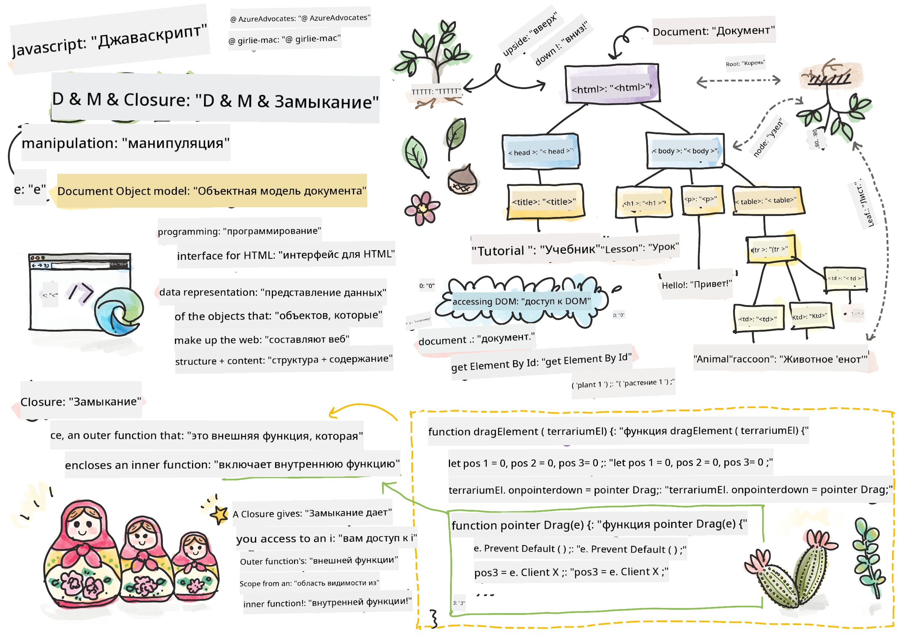
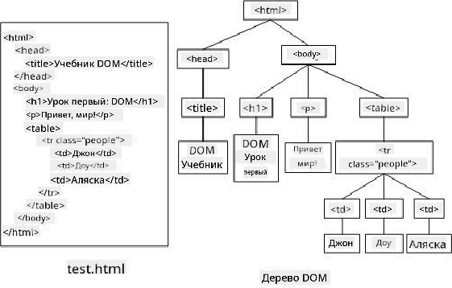
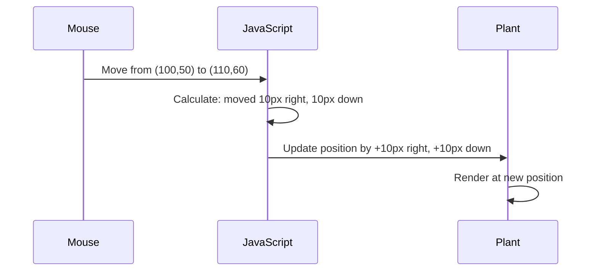

<!--
CO_OP_TRANSLATOR_METADATA:
{
  "original_hash": "bc93f6285423033ebf5b8abeb5282888",
  "translation_date": "2025-10-22T22:20:03+00:00",
  "source_file": "3-terrarium/3-intro-to-DOM-and-closures/README.md",
  "language_code": "ru"
}
-->
# Проект "Террариум", часть 3: Манипуляции с DOM и замыкания в JavaScript


> Скетчноут от [Tomomi Imura](https://twitter.com/girlie_mac)

Добро пожаловать в один из самых увлекательных аспектов веб-разработки — создание интерактивности! Document Object Model (DOM) — это мост между вашим HTML и JavaScript, и сегодня мы используем его, чтобы оживить ваш террариум. Когда Тим Бернерс-Ли создал первый веб-браузер, он представлял себе веб, где документы могли быть динамичными и интерактивными — DOM делает эту мечту реальностью.

Мы также изучим замыкания в JavaScript, которые могут показаться сложными на первый взгляд. Представьте замыкания как "карманы памяти", где ваши функции могут запоминать важную информацию. Это как если бы каждое растение в вашем террариуме имело свою собственную запись данных для отслеживания своего положения. К концу этого урока вы поймете, насколько они естественны и полезны.

Вот что мы создаем: террариум, где пользователи могут перетаскивать растения куда угодно. Вы изучите техники манипуляции с DOM, которые лежат в основе всего — от загрузки файлов методом drag-and-drop до интерактивных игр. Давайте оживим ваш террариум.

## Предварительный тест

[Предварительный тест](https://ff-quizzes.netlify.app/web/quiz/19)

## Понимание DOM: ваш путь к интерактивным веб-страницам

Document Object Model (DOM) — это способ, которым JavaScript взаимодействует с элементами HTML. Когда ваш браузер загружает HTML-страницу, он создает структурированное представление этой страницы в памяти — это и есть DOM. Представьте его как семейное дерево, где каждый HTML-элемент — это член семьи, к которому JavaScript может получить доступ, изменить или переставить.

Манипуляции с DOM превращают статические страницы в интерактивные веб-сайты. Каждый раз, когда вы видите, как кнопка меняет цвет при наведении, контент обновляется без перезагрузки страницы или элементы можно перетаскивать, это работа DOM.



> Представление DOM и HTML-разметки, которая на него ссылается. От [Olfa Nasraoui](https://www.researchgate.net/publication/221417012_Profile-Based_Focused_Crawler_for_Social_Media-Sharing_Websites)

**Что делает DOM мощным:**
- **Предоставляет** структурированный способ доступа к любому элементу на странице
- **Позволяет** обновлять контент без перезагрузки страницы
- **Обеспечивает** мгновенный отклик на взаимодействия пользователя, такие как клики и перетаскивания
- **Создает** основу для современных интерактивных веб-приложений

## Замыкания в JavaScript: создание организованного и мощного кода

[Замыкание в JavaScript](https://developer.mozilla.org/docs/Web/JavaScript/Closures) — это как дать функции её собственное приватное рабочее пространство с постоянной памятью. Представьте, как у вьюрков Дарвина на Галапагосских островах развились специализированные клювы в зависимости от их среды обитания — замыкания работают аналогично, создавая специализированные функции, которые "запоминают" свой контекст даже после завершения выполнения родительской функции.

В нашем террариуме замыкания помогают каждому растению запоминать своё положение независимо. Этот шаблон широко используется в профессиональной разработке на JavaScript, что делает его ценным для изучения.

> 💡 **Понимание замыканий**: Замыкания — это важная тема в JavaScript, и многие разработчики используют их годами, прежде чем полностью понять все теоретические аспекты. Сегодня мы сосредоточимся на практическом применении — вы увидите, как замыкания естественным образом возникают при создании интерактивных функций. Понимание придет, когда вы увидите, как они решают реальные задачи.


> Представление DOM и HTML-разметки, которая на него ссылается. От [Olfa Nasraoui](https://www.researchgate.net/publication/221417012_Profile-Based_Focused_Crawler_for_Social_Media-Sharing_Websites)

В этом уроке мы завершим наш интерактивный проект террариума, создав JavaScript, который позволит пользователю манипулировать растениями на странице.

## Перед началом: подготовка к успеху

Вам понадобятся ваши HTML и CSS файлы из предыдущих уроков о террариуме — мы собираемся сделать этот статический дизайн интерактивным. Если вы присоединились впервые, выполнение тех уроков сначала предоставит важный контекст.

Вот что мы создадим:
- **Плавное перетаскивание** всех растений террариума
- **Отслеживание координат**, чтобы растения запоминали свои позиции
- **Полный интерактивный интерфейс** с использованием чистого JavaScript
- **Чистый, организованный код** с использованием шаблонов замыканий

## Настройка вашего JavaScript-файла

Давайте создадим JavaScript-файл, который сделает ваш террариум интерактивным.

**Шаг 1: Создайте файл скрипта**

В папке вашего террариума создайте новый файл с именем `script.js`.

**Шаг 2: Свяжите JavaScript с вашим HTML**

Добавьте этот тег `<script>` в секцию `<head>` вашего файла `index.html`:

```html
<script src="./script.js" defer></script>
```

**Почему атрибут `defer` важен:**
- **Обеспечивает**, что ваш JavaScript дождется загрузки всего HTML
- **Предотвращает** ошибки, когда JavaScript пытается найти элементы, которые еще не готовы
- **Гарантирует**, что все элементы растений доступны для взаимодействия
- **Обеспечивает** лучшую производительность, чем размещение скриптов внизу страницы

> ⚠️ **Важное замечание**: Атрибут `defer` предотвращает распространенные проблемы с таймингом. Без него JavaScript может попытаться получить доступ к HTML-элементам до их загрузки, что вызовет ошибки.

---

## Связывание JavaScript с элементами HTML

Прежде чем мы сможем сделать элементы перетаскиваемыми, JavaScript должен найти их в DOM. Представьте это как систему каталогизации библиотеки — как только у вас есть номер каталога, вы можете найти именно ту книгу, которая вам нужна, и получить доступ ко всему её содержимому.

Мы будем использовать метод `document.getElementById()`, чтобы установить эти связи. Это как иметь точную систему хранения — вы предоставляете ID, и он находит именно тот элемент, который вам нужен в HTML.

### Включение функции перетаскивания для всех растений

Добавьте этот код в ваш файл `script.js`:

```javascript
// Enable drag functionality for all 14 plants
dragElement(document.getElementById('plant1'));
dragElement(document.getElementById('plant2'));
dragElement(document.getElementById('plant3'));
dragElement(document.getElementById('plant4'));
dragElement(document.getElementById('plant5'));
dragElement(document.getElementById('plant6'));
dragElement(document.getElementById('plant7'));
dragElement(document.getElementById('plant8'));
dragElement(document.getElementById('plant9'));
dragElement(document.getElementById('plant10'));
dragElement(document.getElementById('plant11'));
dragElement(document.getElementById('plant12'));
dragElement(document.getElementById('plant13'));
dragElement(document.getElementById('plant14'));
```

**Что делает этот код:**
- **Находит** каждый элемент растения в DOM, используя его уникальный ID
- **Получает** ссылку на каждый HTML-элемент в JavaScript
- **Передает** каждый элемент в функцию `dragElement` (которую мы создадим далее)
- **Готовит** каждое растение к взаимодействию методом drag-and-drop
- **Связывает** структуру HTML с функциональностью JavaScript

> 🎯 **Почему использовать ID вместо классов?** ID предоставляют уникальные идентификаторы для конкретных элементов, тогда как CSS-классы предназначены для стилизации групп элементов. Когда JavaScript нужно манипулировать отдельными элементами, ID обеспечивают точность и производительность.

> 💡 **Совет**: Обратите внимание, как мы вызываем `dragElement()` для каждого растения отдельно. Такой подход гарантирует, что каждое растение получит своё независимое поведение при перетаскивании, что важно для плавного взаимодействия с пользователем.

---

## Создание замыкания для функции dragElement

Теперь мы создадим основу нашей функции перетаскивания: замыкание, которое управляет поведением перетаскивания для каждого растения. Это замыкание будет содержать несколько внутренних функций, которые будут работать вместе, чтобы отслеживать движения мыши и обновлять положение элемента.

Замыкания идеально подходят для этой задачи, так как они позволяют создавать "приватные" переменные, которые сохраняются между вызовами функций, предоставляя каждому растению свою независимую систему отслеживания координат.

### Понимание замыканий на простом примере

Позвольте мне продемонстрировать замыкания на простом примере, который иллюстрирует концепцию:

```javascript
function createCounter() {
    let count = 0; // This is like a private variable
    
    function increment() {
        count++; // The inner function remembers the outer variable
        return count;
    }
    
    return increment; // We're giving back the inner function
}

const myCounter = createCounter();
console.log(myCounter()); // 1
console.log(myCounter()); // 2
```

**Что происходит в этом шаблоне замыкания:**
- **Создается** приватная переменная `count`, которая существует только внутри этого замыкания
- **Внутренняя функция** может получить доступ и изменить эту внешнюю переменную (механизм замыкания)
- **Когда мы возвращаем** внутреннюю функцию, она сохраняет связь с этими приватными данными
- **Даже после** завершения выполнения `createCounter()`, `count` сохраняется и запоминает своё значение

### Почему замыкания идеально подходят для функции перетаскивания

Для нашего террариума каждое растение должно запоминать свои текущие координаты. Замыкания предоставляют идеальное решение:

**Ключевые преимущества для нашего проекта:**
- **Сохраняют** приватные переменные положения для каждого растения независимо
- **Сохраняют** данные координат между событиями перетаскивания
- **Предотвращают** конфликты переменных между различными перетаскиваемыми элементами
- **Создают** чистую, организованную структуру кода

> 🎯 **Цель обучения**: Вам не нужно сразу полностью освоить все аспекты замыканий. Сосредоточьтесь на том, как они помогают организовать код и сохранять состояние для нашей функции перетаскивания.

### Создание функции dragElement

Теперь давайте создадим основную функцию, которая будет управлять всей логикой перетаскивания. Добавьте эту функцию ниже ваших объявлений элементов растений:

```javascript
function dragElement(terrariumElement) {
    // Initialize position tracking variables
    let pos1 = 0,  // Previous mouse X position
        pos2 = 0,  // Previous mouse Y position  
        pos3 = 0,  // Current mouse X position
        pos4 = 0;  // Current mouse Y position
    
    // Set up the initial drag event listener
    terrariumElement.onpointerdown = pointerDrag;
}
```

**Понимание системы отслеживания положения:**
- **`pos1` и `pos2`**: Хранят разницу между старым и новым положением мыши
- **`pos3` и `pos4`**: Отслеживают текущие координаты мыши
- **`terrariumElement`**: Конкретный элемент растения, который мы делаем перетаскиваемым
- **`onpointerdown`**: Событие, которое срабатывает, когда пользователь начинает перетаскивание

**Как работает шаблон замыкания:**
- **Создает** приватные переменные положения для каждого элемента растения
- **Сохраняет** эти переменные на протяжении всего жизненного цикла перетаскивания
- **Обеспечивает**, что каждое растение отслеживает свои координаты независимо
- **Предоставляет** чистый интерфейс через функцию `dragElement`

### Почему использовать Pointer Events?

Вы можете задаться вопросом, почему мы используем `onpointerdown` вместо более привычного `onclick`. Вот объяснение:

| Тип события | Лучше всего подходит для | Недостаток |
|-------------|--------------------------|------------|
| `onclick`   | Простые клики по кнопке  | Не подходит для перетаскивания (только клики и отпускания) |
| `onpointerdown` | Мышь и сенсорное управление | Более новый, но уже хорошо поддерживается |
| `onmousedown` | Только для мыши на ПК | Не подходит для пользователей мобильных устройств |

**Почему pointer events идеально подходят для того, что мы создаем:**
- **Отлично работают**, независимо от того, использует ли пользователь мышь, палец или стилус
- **Одинаково ощущаются** на ноутбуке, планшете или телефоне
- **Обрабатывают** реальное движение перетаскивания (а не просто клик и отпускание)
- **Создают** плавный опыт, который ожидают пользователи современных веб-приложений

> 💡 **На будущее**: Pointer events — это современный способ обработки взаимодействий пользователя. Вместо написания отдельного кода для мыши и сенсорного управления, вы получаете оба варианта сразу. Здорово, правда?

---

## Функция pointerDrag: захват начала перетаскивания

Когда пользователь нажимает на растение (будь то щелчок мышью или касание пальцем), функция `pointerDrag` начинает работать. Эта функция фиксирует начальные координаты и настраивает систему перетаскивания.

Добавьте эту функцию внутри вашего замыкания `dragElement`, сразу после строки `terrariumElement.onpointerdown = pointerDrag;`:

```javascript
function pointerDrag(e) {
    // Prevent default browser behavior (like text selection)
    e.preventDefault();
    
    // Capture the initial mouse/touch position
    pos3 = e.clientX;  // X coordinate where drag started
    pos4 = e.clientY;  // Y coordinate where drag started
    
    // Set up event listeners for the dragging process
    document.onpointermove = elementDrag;
    document.onpointerup = stopElementDrag;
}
```

**Шаг за шагом, что происходит:**
- **Предотвращает** стандартное поведение браузера, которое может мешать перетаскиванию
- **Фиксирует** точные координаты, где пользователь начал жест перетаскивания
- **Устанавливает** обработчики событий для текущего движения
- **Готовит** систему для отслеживания движения мыши/пальца по всему документу

### Понимание предотвращения событий

Строка `e.preventDefault()` имеет решающее значение для плавного перетаскивания:

**Без предотвращения браузеры могут:**
- **Выделять** текст при перетаскивании по странице
- **Вызывать** контекстные меню при перетаскивании правой кнопкой мыши
- **Мешать** нашему пользовательскому поведению перетаскивания
- **Создавать** визуальные артефакты во время операции перетаскивания

> 🔍 **Эксперимент**: После завершения этого урока попробуйте удалить `e.preventDefault()` и посмотрите, как это повлияет на опыт перетаскивания. Вы быстро поймете, почему эта строка необходима!

### Система отслеживания координат

Свойства `e.clientX` и `e.clientY` предоставляют точные координаты мыши/касания:

| Свойство | Что измеряет | Применение |
|----------|--------------|------------|
| `clientX` | Горизонтальное положение относительно области просмотра | Отслеживание движения влево-вправо |
| `clientY` | Вертикальное положение относительно области просмотра | Отслеживание движения вверх-вниз |

**Понимание этих координат:**
- **Обеспечивает** точную информацию о положении в пикселях
- **Обновляется** в реальном времени при движении указателя
- **Остается** стабильным на разных размерах экрана и уровнях масштабирования
- **Позволяет** создавать плавные, отзывчивые взаимодействия при перетаскивании

### Настройка обработчиков событий на уровне документа

Обратите внимание, как мы прикрепляем события движения и остановки к всему `document`, а не только к элементу растения:

```javascript
document.onpointermove = elementDrag;
document.onpointerup = stopElementDrag;
```

**Почему прикреплять к документу:**
- **Продолжает** отслеживание, даже когда мышь покидает элемент растения
- **Предотвращает** прерывание перетаскивания, если пользователь движется быстро
- **Обеспечивает** плавное перетаскивание по всему экрану
- **Обрабатывает** крайние случаи, когда курсор выходит за пределы окна браузера

> ⚡ **Примечание о производительности**: Мы удалим эти обработчики событий на уровне документа, когда перетаскивание завершится, чтобы избежать утечек памяти и проблем с производительностью.

## Завершение системы перетаскивания: движение и очистка

Теперь мы добавим оставшиеся две функции, которые управляют фактическим движением при перетаскивании и очисткой после завершения перетаскивания. Эти функции работают вместе, чтобы создать плавное и отзывчивое перемещение растений по вашему террариуму.

### Функция elementDrag: отслеживание движения

Добавьте функцию `elementDrag` сразу после закрывающей фигурной скобки функции `pointerDrag`:

```javascript
function elementDrag(e) {
    // Calculate the distance moved since the last event
    pos1 = pos3 - e.clientX;  // Horizontal distance moved
    pos2 = pos4 - e.clientY;  // Vertical distance moved
    
    // Update the current position tracking
    pos3 = e.clientX;  // New current X position
    pos4 = e.clientY;  // New current Y position
    
    // Apply the movement to the element's position
    terrariumElement.style.top = (terrariumElement.offsetTop - pos2) + 'px';
    terrariumElement.style.left = (terrariumElement.offsetLeft - pos1) + 'px';
}
```

**Понимание математики координат:**
- **`pos1` и `pos2`**: Вычисляют, насколько далеко мышь переместилась с момента последнего обновления
- **`pos3` и `pos4`**: Сохраняют текущую позицию мыши для следующего расчета
- **`offsetTop` и `offsetLeft`**: Получают текущую позицию элемента на странице
- **Логика вычитания**: Перемещает элемент на то же расстояние, на которое переместилась мышь

**Разбор расчета движения:**
1. **Измеряет** разницу между старой и новой позицией мыши
2. **Вычисляет**, насколько нужно переместить элемент в зависимости от движения мыши
3. **Обновляет** свойства CSS позиции элемента в реальном времени
4. **Сохраняет** новую позицию как базовую для следующего расчета движения

### Визуальное представление математики



### Функция stopElementDrag: Очистка

Добавьте функцию очистки после закрывающей фигурной скобки `elementDrag`:

```javascript
function stopElementDrag() {
    // Remove the document-level event listeners
    document.onpointerup = null;
    document.onpointermove = null;
}
```

**Почему очистка важна:**
- **Предотвращает** утечки памяти из-за оставшихся слушателей событий
- **Останавливает** поведение перетаскивания, когда пользователь отпускает растение
- **Позволяет** другим элементам перетаскиваться независимо
- **Сбрасывает** систему для следующей операции перетаскивания

**Что происходит без очистки:**
- Слушатели событий продолжают работать даже после остановки перетаскивания
- Производительность ухудшается из-за накопления неиспользуемых слушателей
- Непредсказуемое поведение при взаимодействии с другими элементами
- Ресурсы браузера расходуются на ненужную обработку событий

### Понимание свойств позиции CSS

Наша система перетаскивания управляет двумя ключевыми свойствами CSS:

| Свойство | Что контролирует | Как мы используем |
|----------|------------------|-------------------|
| `top` | Расстояние от верхнего края | Вертикальное позиционирование во время перетаскивания |
| `left` | Расстояние от левого края | Горизонтальное позиционирование во время перетаскивания |

**Основные сведения о свойствах offset:**
- **`offsetTop`**: Текущее расстояние от верхнего края родительского элемента с позицией
- **`offsetLeft`**: Текущее расстояние от левого края родительского элемента с позицией
- **Контекст позиционирования**: Эти значения относительны к ближайшему позиционированному предку
- **Обновления в реальном времени**: Изменения происходят сразу после модификации свойств CSS

> 🎯 **Философия дизайна**: Эта система перетаскивания намеренно гибкая – нет "зон сброса" или ограничений. Пользователи могут размещать растения где угодно, предоставляя полный творческий контроль над дизайном террариума.

## Собираем всё вместе: Полная система перетаскивания

Поздравляем! Вы только что создали сложную систему перетаскивания с использованием чистого JavaScript. Ваша полная функция `dragElement` теперь содержит мощное замыкание, которое управляет:

**Что делает ваше замыкание:**
- **Сохраняет** приватные переменные позиции для каждого растения независимо
- **Обрабатывает** полный жизненный цикл перетаскивания от начала до конца
- **Обеспечивает** плавное и отзывчивое движение по всему экрану
- **Очищает** ресурсы, чтобы предотвратить утечки памяти
- **Создаёт** интуитивно понятный и творческий интерфейс для дизайна террариума

### Тестирование вашего интерактивного террариума

Теперь протестируйте ваш интерактивный террариум! Откройте ваш файл `index.html` в веб-браузере и проверьте функциональность:

1. **Нажмите и удерживайте** любое растение, чтобы начать перетаскивание
2. **Перемещайте мышь или палец**, и растение будет плавно следовать за движением
3. **Отпустите**, чтобы оставить растение в новой позиции
4. **Экспериментируйте** с различными расположениями, чтобы изучить интерфейс

🥇 **Достижение**: Вы создали полностью интерактивное веб-приложение, используя основные концепции, которые профессиональные разработчики используют ежедневно. Эта функциональность перетаскивания основана на тех же принципах, что и загрузка файлов, канбан-доски и многие другие интерактивные интерфейсы.


---

## Вызов GitHub Copilot Agent 🚀

Используйте режим Agent, чтобы выполнить следующий вызов:

**Описание:** Улучшите проект террариума, добавив функцию сброса, которая возвращает все растения в их исходные позиции с плавной анимацией.

**Задание:** Создайте кнопку сброса, которая при нажатии анимирует все растения обратно в их исходные позиции на боковой панели, используя CSS-переходы. Функция должна сохранять исходные позиции при загрузке страницы и плавно возвращать растения на эти позиции за 1 секунду при нажатии кнопки сброса.

Узнайте больше о [режиме Agent](https://code.visualstudio.com/blogs/2025/02/24/introducing-copilot-agent-mode) здесь.

## 🚀 Дополнительный вызов: Расширьте свои навыки

Готовы вывести ваш террариум на новый уровень? Попробуйте реализовать эти улучшения:

**Творческие расширения:**
- **Двойной клик** на растение, чтобы переместить его на передний план (манипуляция z-index)
- **Добавьте визуальную подсказку**, например, легкое свечение при наведении на растения
- **Реализуйте границы**, чтобы предотвратить перетаскивание растений за пределы террариума
- **Создайте функцию сохранения**, которая запоминает позиции растений с использованием localStorage
- **Добавьте звуковые эффекты** для поднятия и размещения растений

> 💡 **Возможность обучения**: Каждый из этих вызовов научит вас новым аспектам манипуляции DOM, обработки событий и дизайна пользовательского интерфейса.

## Викторина после лекции

[Викторина после лекции](https://ff-quizzes.netlify.app/web/quiz/20)

## Обзор и самостоятельное изучение: Углубление знаний

Вы освоили основы манипуляции DOM и замыканий, но всегда есть возможность узнать больше! Вот несколько путей для расширения ваших знаний и навыков.

### Альтернативные подходы к перетаскиванию

Мы использовали события указателя для максимальной гибкости, но веб-разработка предлагает множество подходов:

| Подход | Лучше всего подходит для | Ценность обучения |
|--------|--------------------------|-------------------|
| [HTML Drag and Drop API](https://developer.mozilla.org/docs/Web/API/HTML_Drag_and_Drop_API) | Загрузка файлов, формальные зоны перетаскивания | Понимание возможностей встроенных в браузер |
| [Touch Events](https://developer.mozilla.org/docs/Web/API/Touch_events) | Мобильные взаимодействия | Мобильные паттерны разработки |
| Свойства CSS `transform` | Плавные анимации | Техники оптимизации производительности |

### Продвинутые темы манипуляции DOM

**Следующие шаги в вашем обучении:**
- **Делегирование событий**: Эффективная обработка событий для множества элементов
- **Intersection Observer**: Определение момента, когда элементы появляются/исчезают из области видимости
- **Mutation Observer**: Отслеживание изменений в структуре DOM
- **Веб-компоненты**: Создание повторно используемых, инкапсулированных элементов интерфейса
- **Концепции виртуального DOM**: Понимание того, как фреймворки оптимизируют обновления DOM

### Важные ресурсы для продолжения обучения

**Техническая документация:**
- [Руководство MDN по событиям указателя](https://developer.mozilla.org/docs/Web/API/Pointer_events) - Полное руководство по событиям указателя
- [Спецификация W3C Pointer Events](https://www.w3.org/TR/pointerevents1/) - Официальная документация стандартов
- [Глубокое погружение в замыкания JavaScript](https://developer.mozilla.org/docs/Web/JavaScript/Closures) - Продвинутые паттерны замыканий

**Совместимость браузеров:**
- [CanIUse.com](https://caniuse.com/) - Проверка поддержки функций в разных браузерах
- [Данные о совместимости браузеров MDN](https://github.com/mdn/browser-compat-data) - Подробная информация о совместимости

**Возможности для практики:**
- **Создайте** игру-головоломку, используя похожую механику перетаскивания
- **Разработайте** канбан-доску с управлением задачами через перетаскивание
- **Спроектируйте** галерею изображений с возможностью перетаскивания фотографий
- **Экспериментируйте** с жестами касания для мобильных интерфейсов

> 🎯 **Стратегия обучения**: Лучший способ закрепить эти концепции – практика. Попробуйте создавать вариации интерфейсов с функцией перетаскивания – каждый проект научит вас чему-то новому о взаимодействии с пользователем и манипуляции DOM.

## Задание

[Поработайте немного больше с DOM](assignment.md)

---

**Отказ от ответственности**:  
Этот документ был переведен с использованием сервиса автоматического перевода [Co-op Translator](https://github.com/Azure/co-op-translator). Несмотря на наши усилия обеспечить точность, автоматические переводы могут содержать ошибки или неточности. Оригинальный документ на его родном языке следует считать авторитетным источником. Для получения критически важной информации рекомендуется профессиональный перевод человеком. Мы не несем ответственности за любые недоразумения или неправильные интерпретации, возникающие в результате использования данного перевода.