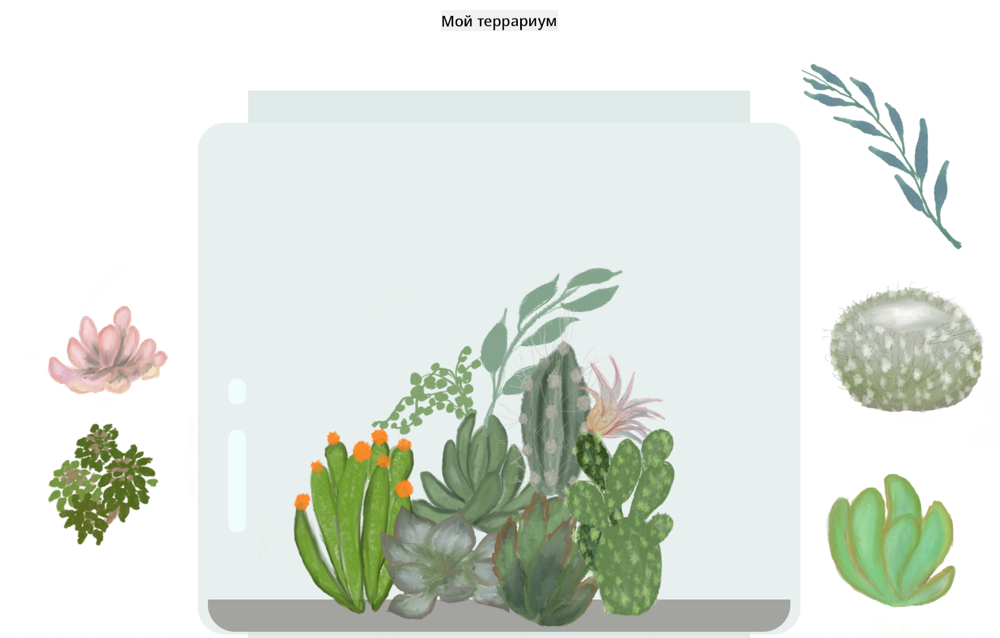

<!--
CO_OP_TRANSLATOR_METADATA:
{
  "original_hash": "7965cd2bc5dc92ad888dc4c6ab2ab70a",
  "translation_date": "2025-08-25T21:03:43+00:00",
  "source_file": "3-terrarium/README.md",
  "language_code": "ru"
}
-->
# Мой террариум: проект для изучения HTML, CSS и работы с DOM с использованием JavaScript 🌵🌱

Небольшая медитация с перетаскиванием элементов. С помощью немного HTML, JS и CSS вы сможете создать веб-интерфейс, стилизовать его и добавить множество взаимодействий на ваш выбор.

# Уроки

1. [Введение в HTML](./1-intro-to-html/README.md)
2. [Введение в CSS](./2-intro-to-css/README.md)
3. [Введение в DOM и замыкания в JS](./3-intro-to-DOM-and-closures/README.md)

## Благодарности

Написано с ♥️ [Джен Лупер](https://www.twitter.com/jenlooper)

Террариум, созданный с помощью CSS, был вдохновлен стеклянной банкой от Якоба Мандры [codepen](https://codepen.io/Rotarepmi/pen/rjpNZY).

Иллюстрации нарисованы вручную [Джен Лупер](http://jenlooper.com) с помощью Procreate.

## Разверните ваш террариум

Вы можете развернуть или опубликовать ваш террариум в интернете, используя Azure Static Web Apps.

1. Сделайте форк этого репозитория

2. Нажмите эту кнопку

3. Пройдите через мастер создания вашего приложения. Убедитесь, что вы установили корень приложения на `/solution` или корень вашей кодовой базы. В этом приложении нет API, так что об этом можно не беспокоиться. В вашем форкнутом репозитории будет создана папка github, которая поможет сервисам сборки Azure Static Web Apps собрать и опубликовать ваше приложение на новом URL.

**Отказ от ответственности**:  
Этот документ был переведен с использованием сервиса автоматического перевода [Co-op Translator](https://github.com/Azure/co-op-translator). Несмотря на наши усилия обеспечить точность, автоматические переводы могут содержать ошибки или неточности. Оригинальный документ на его родном языке следует считать авторитетным источником. Для получения критически важной информации рекомендуется профессиональный перевод человеком. Мы не несем ответственности за любые недоразумения или неправильные интерпретации, возникшие в результате использования данного перевода.