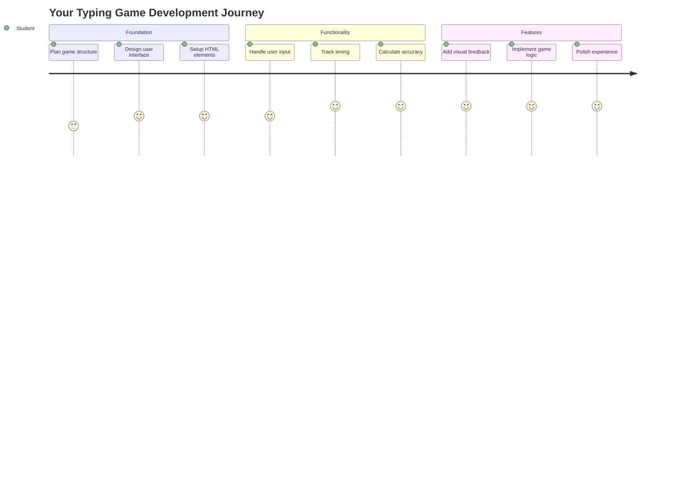
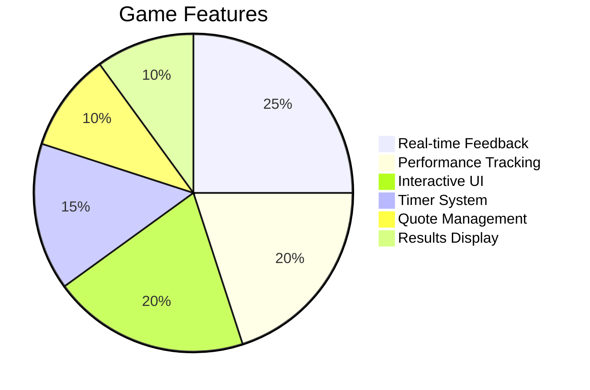
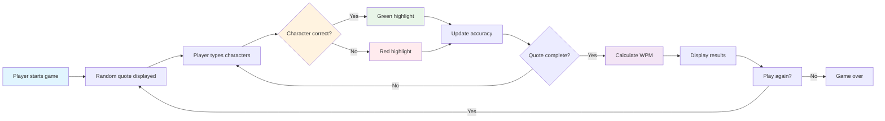
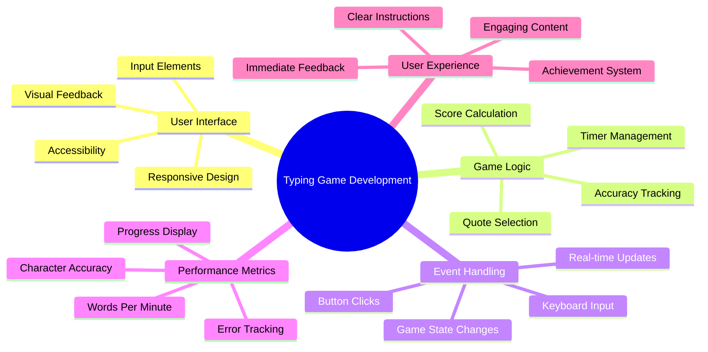
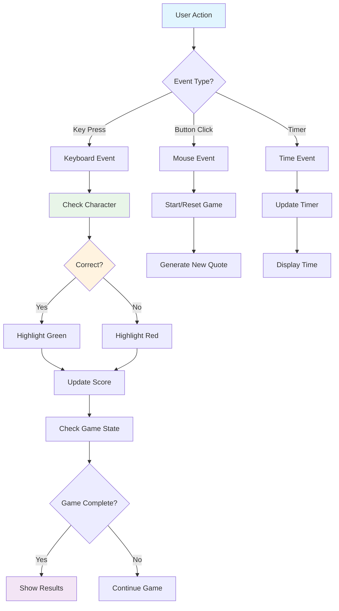
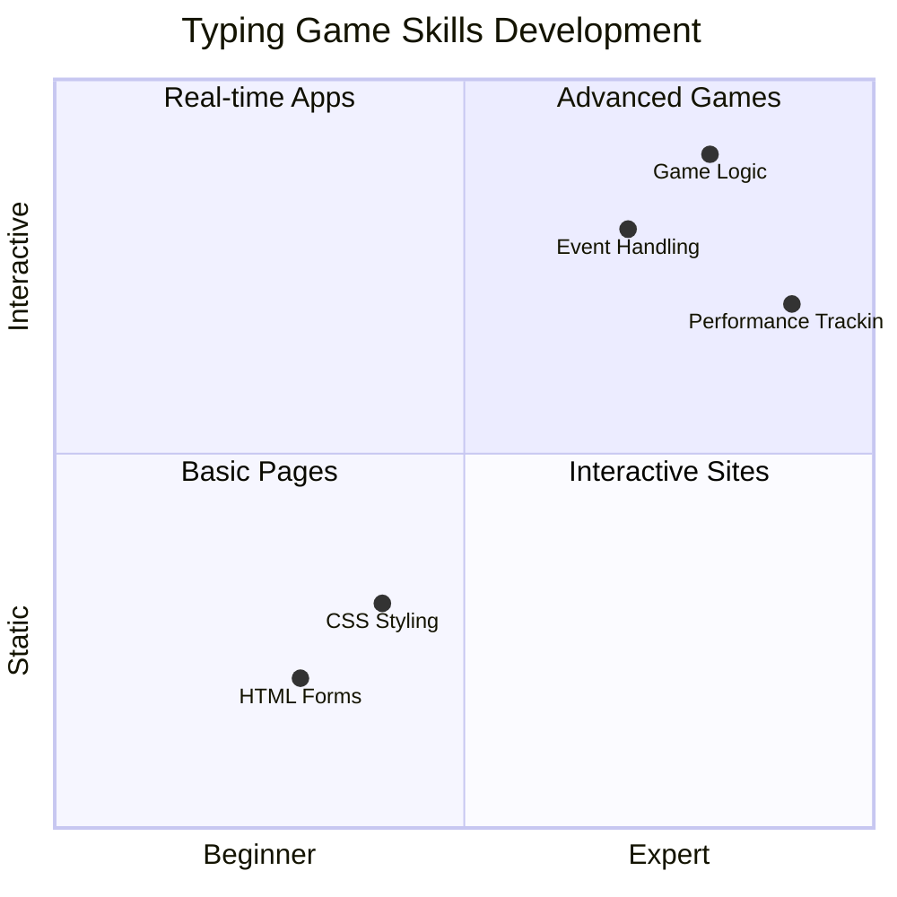
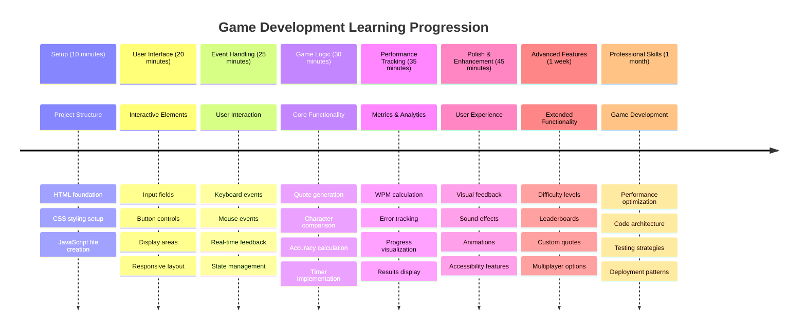

<!--
CO_OP_TRANSLATOR_METADATA:
{
  "original_hash": "efa2ab875b8bb5a7883816506da6b6d2",
  "translation_date": "2025-11-03T23:27:09+00:00",
  "source_file": "4-typing-game/README.md",
  "language_code": "ru"
}
-->
# Программирование на основе событий - Создаем игру на скорость набора текста

## Введение

Вот что знает каждый разработчик, но редко говорит вслух: быстро печатать — это суперспособность! 🚀 Подумайте сами — чем быстрее вы можете перенести свои идеи из головы в редактор кода, тем больше у вас возможностей для творчества. Это как прямой канал между вашими мыслями и экраном.

Хотите узнать один из лучших способов прокачать этот навык? Вы угадали — мы будем создавать игру!

> Давайте вместе создадим потрясающую игру на скорость набора текста!

Готовы применить все те навыки работы с JavaScript, HTML и CSS, которые вы изучали? Мы создадим игру на скорость набора текста, которая будет бросать вам вызов случайными цитатами легендарного детектива [Шерлока Холмса](https://en.wikipedia.org/wiki/Sherlock_Holmes). Игра будет отслеживать, насколько быстро и точно вы печатаете — и поверьте, это затягивает больше, чем вы думаете!

## Что нужно знать

Прежде чем мы начнем, убедитесь, что вы знакомы с этими концепциями (не переживайте, если вам нужно немного освежить память — с каждым бывает!):

- Создание текстовых полей ввода и кнопок
- CSS и установка стилей с помощью классов  
- Основы JavaScript
  - Создание массива
  - Генерация случайного числа
  - Получение текущего времени

Если что-то из этого кажется вам немного сложным, не переживайте! Иногда лучший способ закрепить знания — это погрузиться в проект и разбираться по ходу дела.

### 🔄 **Педагогическая проверка**
**Оценка базовых знаний**: Перед началом разработки убедитесь, что вы понимаете:
- ✅ Как работают HTML-формы и элементы ввода
- ✅ CSS-классы и динамическое стилизование
- ✅ Слушатели событий и обработчики в JavaScript
- ✅ Манипуляции с массивами и случайный выбор
- ✅ Измерение времени и вычисления

**Быстрый тест на самопроверку**: Можете ли вы объяснить, как эти концепции работают вместе в интерактивной игре?
- **События** срабатывают, когда пользователи взаимодействуют с элементами
- **Обработчики** обрабатывают эти события и обновляют состояние игры
- **CSS** обеспечивает визуальную обратную связь на действия пользователя
- **Измерение времени** позволяет оценивать производительность и прогресс в игре

## Давайте начнем!

[Создание игры на скорость набора текста с использованием программирования на основе событий](./typing-game/README.md)

### ⚡ **Что можно сделать за следующие 5 минут**
- [ ] Откройте консоль браузера и попробуйте отслеживать события клавиатуры с помощью `addEventListener`
- [ ] Создайте простую HTML-страницу с полем ввода и протестируйте обнаружение ввода текста
- [ ] Попрактикуйтесь в манипуляции строками, сравнивая введенный текст с целевым текстом
- [ ] Поэкспериментируйте с `setTimeout`, чтобы понять функции таймера

### 🎯 **Что можно достичь за час**
- [ ] Пройти тест после урока и понять программирование на основе событий
- [ ] Создать базовую версию игры на скорость набора текста с проверкой слов
- [ ] Добавить визуальную обратную связь для правильного и неправильного ввода
- [ ] Реализовать простую систему подсчета очков на основе скорости и точности
- [ ] Стилизовать игру с помощью CSS, чтобы она выглядела привлекательно

### 📅 **Разработка игры на неделю**
- [ ] Завершить полную игру на скорость набора текста с добавлением всех функций и доработок
- [ ] Добавить уровни сложности с различной сложностью слов
- [ ] Реализовать отслеживание статистики пользователя (скорость набора, точность со временем)
- [ ] Добавить звуковые эффекты и анимации для улучшения пользовательского опыта
- [ ] Сделать игру адаптивной для мобильных устройств с поддержкой сенсорного ввода
- [ ] Поделитесь своей игрой онлайн и получите отзывы от пользователей

### 🌟 **Месячный план интерактивной разработки**
- [ ] Создайте несколько игр, исследуя различные паттерны взаимодействия
- [ ] Узнайте о игровых циклах, управлении состоянием и оптимизации производительности
- [ ] Внесите вклад в проекты по разработке игр с открытым исходным кодом
- [ ] Освойте продвинутые концепции тайминга и плавные анимации
- [ ] Создайте портфолио, демонстрирующее различные интерактивные приложения
- [ ] Станьте наставником для тех, кто интересуется разработкой игр и взаимодействием с пользователем

## 🎯 Таймлайн освоения игры на скорость набора текста

### 🛠️ Резюме вашего инструментария для разработки игр

После завершения этого проекта вы освоите:
- **Программирование на основе событий**: Создание отзывчивых пользовательских интерфейсов, реагирующих на ввод
- **Обратная связь в реальном времени**: Мгновенные визуальные и производственные обновления
- **Измерение производительности**: Точные системы тайминга и подсчета очков
- **Управление состоянием игры**: Контроль за ходом приложения и пользовательским опытом
- **Интерактивный дизайн**: Создание увлекательного и затягивающего пользовательского опыта
- **Современные веб-API**: Использование возможностей браузера для создания насыщенных взаимодействий
- **Паттерны доступности**: Инклюзивный дизайн для всех пользователей

**Применение в реальном мире**: Эти навыки напрямую применимы к:
- **Веб-приложениям**: Любым интерактивным интерфейсам или панелям управления
- **Образовательному ПО**: Платформам для обучения и инструментам оценки навыков
- **Инструментам продуктивности**: Текстовым редакторам, IDE и программам для совместной работы
- **Игровой индустрии**: Браузерным играм и интерактивным развлечениям
- **Мобильной разработке**: Интерфейсам с сенсорным вводом и управлением жестами

**Следующий уровень**: Вы готовы изучать продвинутые игровые фреймворки, системы многопользовательских игр в реальном времени или сложные интерактивные приложения!

## Благодарности

Написано с ♥️ [Кристофером Харрисоном](http://www.twitter.com/geektrainer)

---

**Отказ от ответственности**:  
Этот документ был переведен с использованием сервиса автоматического перевода [Co-op Translator](https://github.com/Azure/co-op-translator). Несмотря на наши усилия обеспечить точность, автоматические переводы могут содержать ошибки или неточности. Оригинальный документ на его родном языке следует считать авторитетным источником. Для получения критически важной информации рекомендуется профессиональный перевод человеком. Мы не несем ответственности за любые недоразумения или неправильные интерпретации, возникающие в результате использования данного перевода.