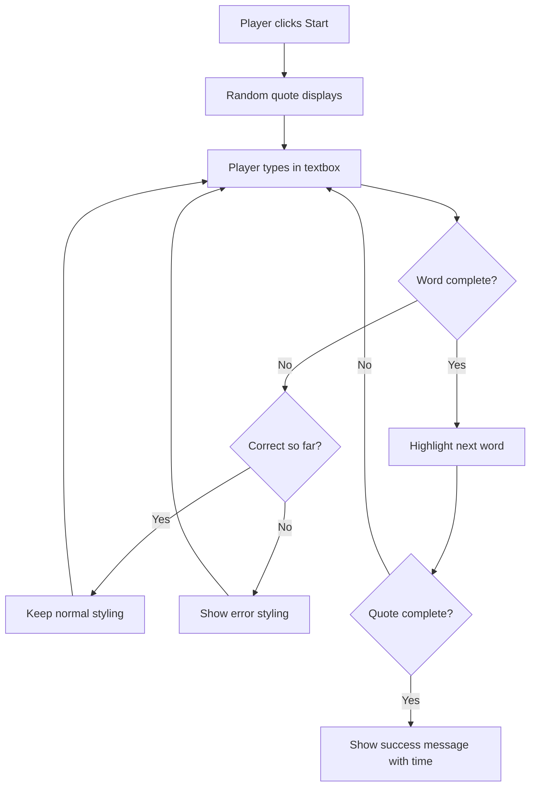
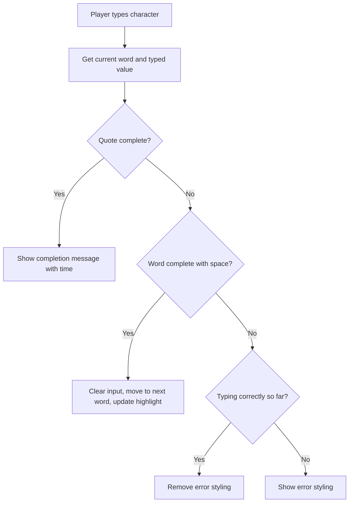
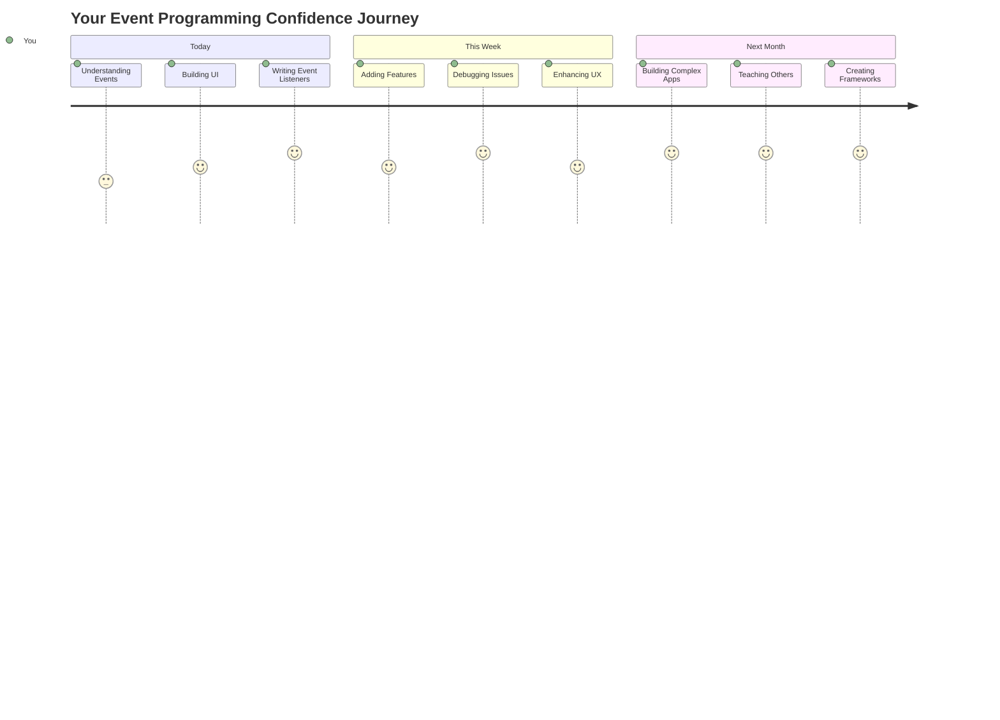

# Создание игры с использованием событий

Задумывались ли вы когда-нибудь, как веб-сайты узнают, что вы нажали кнопку или ввели текст в текстовое поле? Это магия событийного программирования! Что может быть лучше для изучения этого важного навыка, чем создание чего-то полезного — игры на скорость набора текста, которая реагирует на каждое ваше нажатие клавиши.

Вы увидите, как веб-браузеры "общаются" с вашим кодом на JavaScript. Каждый раз, когда вы нажимаете, вводите текст или перемещаете мышь, браузер отправляет маленькие сообщения (мы называем их событиями) вашему коду, а вы решаете, как на них реагировать!

Когда мы закончим, у вас будет настоящая игра на скорость набора текста, которая отслеживает вашу скорость и точность. Но самое главное — вы поймете основные концепции, которые лежат в основе каждого интерактивного веб-сайта, который вы когда-либо использовали. Давайте начнем!

## Предварительный тест

[Предварительный тест](https://ff-quizzes.netlify.app/web/quiz/21)

## Событийное программирование

Подумайте о вашем любимом приложении или веб-сайте — что делает его живым и отзывчивым? Все дело в том, как он реагирует на ваши действия! Каждый тап, клик, свайп или нажатие клавиши создает то, что мы называем "событием", и именно здесь начинается настоящая магия веб-разработки.

Вот что делает программирование для веба таким интересным: мы никогда не знаем, когда кто-то нажмет эту кнопку или начнет вводить текст в текстовое поле. Они могут нажать сразу, подождать пять минут или вообще никогда не нажать! Эта непредсказуемость заставляет нас думать иначе о том, как писать код.

Вместо того чтобы писать код, который выполняется сверху вниз, как рецепт, мы пишем код, который терпеливо ждет, пока что-то произойдет. Это похоже на то, как телеграфисты в 1800-х годах сидели у своих аппаратов, готовые ответить в момент, когда через провод поступит сообщение.

Так что же такое "событие"? Проще говоря, это то, что происходит! Когда вы нажимаете кнопку — это событие. Когда вы вводите букву — это событие. Когда вы перемещаете мышь — это еще одно событие.

Событийное программирование позволяет нам настроить наш код на прослушивание и реакцию. Мы создаем специальные функции, называемые **слушателями событий**, которые терпеливо ждут определенных действий, а затем активируются, когда они происходят.

Представьте слушатели событий как дверной звонок для вашего кода. Вы устанавливаете дверной звонок (`addEventListener()`), указываете, какой звук слушать (например, 'click' или 'keypress'), а затем определяете, что должно произойти, когда кто-то позвонит (ваша пользовательская функция).

**Как работают слушатели событий:**
- **Слушают** определенные действия пользователя, такие как клики, нажатия клавиш или движения мыши
- **Выполняют** ваш пользовательский код, когда происходит указанное событие
- **Реагируют** немедленно на взаимодействия пользователя, создавая плавный опыт
- **Обрабатывают** несколько событий на одном элементе с использованием разных слушателей

> **NOTE:** Стоит отметить, что существует множество способов создания слушателей событий. Вы можете использовать анонимные функции или создавать именованные. Можно использовать различные сокращения, такие как установка свойства `click` или использование `addEventListener()`. В нашем упражнении мы сосредоточимся на `addEventListener()` и анонимных функциях, так как это, вероятно, самый распространенный метод, который используют веб-разработчики. Это также самый гибкий способ, так как `addEventListener()` работает для всех событий, а имя события можно передать в качестве параметра.

### Распространенные события

Хотя веб-браузеры предлагают десятки различных событий, которые вы можете слушать, большинство интерактивных приложений опираются всего на несколько основных событий. Понимание этих ключевых событий даст вам основу для создания сложных взаимодействий с пользователем.

Существует [десятки событий](https://developer.mozilla.org/docs/Web/Events), которые вы можете слушать при создании приложения. Практически любое действие пользователя на странице вызывает событие, что дает вам большую свободу для обеспечения желаемого опыта. К счастью, вам обычно понадобится лишь небольшое количество событий. Вот несколько распространенных (включая два, которые мы будем использовать при создании нашей игры):

| Событие | Описание | Распространенные случаи использования |
|---------|----------|---------------------------------------|
| `click` | Пользователь нажал на что-то | Кнопки, ссылки, интерактивные элементы |
| `contextmenu` | Пользователь нажал правую кнопку мыши | Пользовательские контекстные меню |
| `select` | Пользователь выделил текст | Редактирование текста, операции копирования |
| `input` | Пользователь ввел текст | Проверка форм, поиск в реальном времени |

**Понимание этих типов событий:**
- **Срабатывают**, когда пользователи взаимодействуют с определенными элементами на вашей странице
- **Предоставляют** подробную информацию о действии пользователя через объекты событий
- **Позволяют** создавать отзывчивые, интерактивные веб-приложения
- **Работают** стабильно в разных браузерах и на разных устройствах

## Создание игры

Теперь, когда вы понимаете, как работают события, давайте применим эти знания на практике, создав что-то полезное. Мы создадим игру на скорость набора текста, которая демонстрирует обработку событий и помогает развивать важный навык разработчика.

Мы создадим игру, чтобы изучить, как работают события в JavaScript. Наша игра будет проверять навыки набора текста игрока, что является одним из самых недооцененных навыков, которые должны быть у всех разработчиков. Интересный факт: раскладка клавиатуры QWERTY, которую мы используем сегодня, была разработана в 1870-х годах для пишущих машинок — и хорошие навыки набора текста до сих пор так же ценны для программистов! Общий ход игры будет выглядеть следующим образом:



**Как будет работать наша игра:**
- **Начинается**, когда игрок нажимает кнопку "Старт" и отображает случайную цитату
- **Отслеживает** прогресс набора текста игрока слово за словом в реальном времени
- **Выделяет** текущее слово, чтобы направить внимание игрока
- **Предоставляет** немедленную визуальную обратную связь при ошибках набора текста
- **Рассчитывает** и отображает общее время после завершения цитаты

Давайте создадим нашу игру и изучим события!

### Структура файлов

Прежде чем начать кодировать, давайте организуемся! Чистая структура файлов с самого начала избавит вас от головной боли в будущем и сделает ваш проект более профессиональным. 😊

Мы будем придерживаться простоты, используя всего три файла: `index.html` для структуры страницы, `script.js` для всей логики игры и `style.css`, чтобы все выглядело красиво. Это классическая тройка, которая лежит в основе большинства веб-приложений!

**Создайте новую папку для вашей работы, открыв консоль или терминал и введя следующую команду:**

```bash
# Linux or macOS
mkdir typing-game && cd typing-game

# Windows
md typing-game && cd typing-game
```

**Что делают эти команды:**
- **Создают** новый каталог с именем `typing-game` для файлов вашего проекта
- **Переходят** в только что созданный каталог автоматически
- **Настраивают** чистое рабочее пространство для разработки вашей игры

**Откройте Visual Studio Code:**

```bash
code .
```

**Эта команда:**
- **Запускает** Visual Studio Code в текущем каталоге
- **Открывает** папку вашего проекта в редакторе
- **Предоставляет** доступ ко всем инструментам разработки, которые вам понадобятся

**Добавьте три файла в папку в Visual Studio Code с следующими именами:**
- `index.html` - Содержит структуру и контент вашей игры
- `script.js` - Обрабатывает всю логику игры и слушатели событий
- `style.css` - Определяет визуальный вид и стили

## Создание пользовательского интерфейса

Теперь давайте создадим сцену, на которой будет происходить вся игровая активность! Подумайте об этом как о проектировании панели управления для космического корабля — мы должны убедиться, что все, что нужно нашим игрокам, находится там, где они ожидают.

Давайте разберемся, что именно нужно нашей игре. Если бы вы играли в игру на скорость набора текста, что бы вы хотели видеть на экране? Вот что нам понадобится:

| Элемент интерфейса | Назначение | HTML-элемент |
|--------------------|------------|--------------|
| Отображение цитаты | Показывает текст для набора | `<p>` с `id="quote"` |
| Область сообщений | Отображает статус и сообщения об успехе | `<p>` с `id="message"` |
| Текстовое поле | Место, где игроки вводят текст | `<input>` с `id="typed-value"` |
| Кнопка "Старт" | Начинает игру | `<button>` с `id="start"` |

**Понимание структуры интерфейса:**
- **Организует** контент логически сверху вниз
- **Назначает** уникальные идентификаторы элементам для их использования в JavaScript
- **Обеспечивает** четкую визуальную иерархию для лучшего пользовательского опыта
- **Включает** семантические HTML-элементы для доступности

Каждому из этих элементов понадобятся идентификаторы, чтобы мы могли работать с ними в нашем JavaScript. Мы также добавим ссылки на создаваемые нами файлы CSS и JavaScript.

Создайте новый файл с именем `index.html`. Добавьте следующий HTML:

```html
<!-- inside index.html -->
<html>
<head>
  <title>Typing game</title>
  <link rel="stylesheet" href="style.css">
</head>
<body>
  <h1>Typing game!</h1>
  <p>Practice your typing skills with a quote from Sherlock Holmes. Click **start** to begin!</p>
  <p id="quote"></p> <!-- This will display our quote -->
  <p id="message"></p> <!-- This will display any status messages -->
  <div>
    <input type="text" aria-label="current word" id="typed-value" /> <!-- The textbox for typing -->
    <button type="button" id="start">Start</button> <!-- To start the game -->
  </div>
  <script src="script.js"></script>
</body>
</html>
```

**Разбор того, что делает эта структура HTML:**
- **Подключает** CSS-стили в `<head>` для оформления
- **Создает** четкий заголовок и инструкции для пользователей
- **Устанавливает** заполнители для абзацев с конкретными идентификаторами для динамического контента
- **Включает** текстовое поле с атрибутами доступности
- **Предоставляет** кнопку "Старт" для запуска игры
- **Загружает** файл JavaScript в конце для оптимальной производительности

### Запуск приложения

Частое тестирование вашего приложения во время разработки помогает вовремя выявлять проблемы и видеть ваш прогресс в реальном времени. Live Server — это незаменимый инструмент, который автоматически обновляет ваш браузер при сохранении изменений, делая разработку гораздо более эффективной.

Лучше всего разрабатывать итеративно, чтобы видеть, как все выглядит. Давайте запустим наше приложение. Существует замечательное расширение для Visual Studio Code под названием [Live Server](https://marketplace.visualstudio.com/items?itemName=ritwickdey.LiveServer&WT.mc_id=academic-77807-sagibbon), которое будет как размещать ваше приложение локально, так и обновлять браузер каждый раз, когда вы сохраняете изменения.

**Установите [Live Server](https://marketplace.visualstudio.com/items?itemName=ritwickdey.LiveServer&WT.mc_id=academic-77807-sagibbon), перейдя по ссылке и нажав "Install":**

**Что происходит во время установки:**
- **Открывает** ваш браузер для установки Visual Studio Code
- **Проводит** вас через процесс установки расширения
- **Может потребовать** перезапуска Visual Studio Code для завершения настройки

**После установки в Visual Studio Code нажмите Ctrl-Shift-P (или Cmd-Shift-P), чтобы открыть палитру команд:**

**Понимание палитры команд:**
- **Предоставляет** быстрый доступ ко всем командам VS Code
- **Ищет** команды по мере ввода
- **Предлагает** горячие клавиши для ускорения разработки

**Введите "Live Server: Open with Live Server":**

**Что делает Live Server:**
- **Запускает** локальный сервер разработки для вашего проекта
- **Автоматически** обновляет браузер при сохранении файлов
- **Обслуживает** ваши файлы с локального URL (обычно `localhost:5500`)

**Откройте браузер и перейдите на `https://localhost:5500`:**

Теперь вы должны увидеть созданную вами страницу! Давайте добавим немного функциональности.

## Добавление CSS

Теперь давайте сделаем все красиво! Визуальная обратная связь была важна для пользовательских интерфейсов с ранних дней вычислительной техники. В 1980-х годах исследователи обнаружили, что немедленная визуальная обратная связь значительно улучшает производительность пользователей и снижает количество ошибок. Именно это мы и собираемся создать.

Наша игра должна быть предельно ясной в том, что происходит. Игроки должны сразу понимать, какое слово они должны набрать, и если они допустят ошибку, они должны увидеть это немедленно. Давайте создадим простой, но эффективный стиль:

Создайте новый файл с именем `style.css` и добавьте следующий синтаксис.

```css
/* inside style.css */
.highlight {
  background-color: yellow;
}

.error {
  background-color: lightcoral;
  border: red;
}
```

**Понимание этих классов CSS:**
- **Выделяет** текущее слово желтым фоном для четкого визуального ориентира
- **Сигнализирует** об ошибках набора текста светло-коралловым цветом фона
- **Предоставляет** немедленную обратную связь, не нарушая процесс набора текста
- **Использует** контрастные цвета для доступности и четкой визуальной коммуникации

✅ Когда дело касается CSS, вы можете оформить вашу страницу так, как вам нравится. Потратьте немного времени, чтобы сделать страницу более привлекательной:

- Выберите другой шрифт
- Раскрасьте заголовки
- Измените размеры элементов

## JavaScript

Вот где становится интересно! 🎉 У нас есть структура HTML и стили CSS, но сейчас наша игра похожа на красивую машину без двигателя. JavaScript станет этим двигателем — он заставит все работать и реагировать на действия игроков.

Здесь вы увидите, как ваше творение оживает. Мы будем подходить к этому шаг за шагом, чтобы ничего не казалось сложным:

| Шаг | Назначение | Чему вы научитесь |
|-----|------------|-------------------|
| [Создание констант](../../../../4-typing-game/typing-game) | Настройка цитат и ссылок на DOM | Управление переменными и выбор DOM |
| [Слушатель событий для начала игры](../../../../4-typing-game/typing-game) | Обработка инициализации игры | Обработка событий и обновление интерфейса |
| [Слушатель событий для набора текста](../../../../4-typing-game/typing-game) | Обработка ввода пользователя в реальном времени | Проверка ввода и динамическая обратная связь |

**Этот структурированный подход помогает вам:**
- **Организовать** ваш код в логические, управляемые разделы
- **Создавать** функциональность постепенно для упрощения отладки
- **Понимать**, как разные части вашего приложения работают вместе
- **Создавать** шаблоны для повторного использования в будущих проектах

Но сначала создайте новый файл с именем `script.js`.

### Добавление констант

Прежде чем мы погрузимся в действие, давайте соберем все наши ресурсы! Как NASA готовит все свои системы мониторинга перед запуском, так и нам будет проще, если все будет подготовлено заранее. Это избавит нас от необходимости искать что-то позже и поможет избежать опечаток.

Вот что нам нужно настроить сначала:

| Тип данных | Назначение | Пример |
|------------|------------|--------|
| Массив цитат | Хранит все возможные цитаты для игры | `['Цитата 1', 'Цитата 2', ...]` |
| Массив слов | Разбивает текущую цитату на отдельные слова | `['Когда', 'ты', 'имеешь', ...]` |
| Индекс слова | Отслеживает, какое слово игрок вводит | `0, 1, 2, 3...` |
| Время начала | Рассчитывает прошедшее время для подсчета очков | `Date.now()` |

**Нам также понадобятся ссылки на элементы пользовательского интерфейса:**
| Элемент | ID | Назначение |
|---------|----|-----------|
| Текстовое поле | `typed-value` | Место, где игроки вводят текст |
| Отображение цитаты | `quote` | Показывает цитату для ввода |
| Область сообщений | `message` | Отображает обновления статуса |

```javascript
// inside script.js
// all of our quotes
const quotes = [
    'When you have eliminated the impossible, whatever remains, however improbable, must be the truth.',
    'There is nothing more deceptive than an obvious fact.',
    'I ought to know by this time that when a fact appears to be opposed to a long train of deductions it invariably proves to be capable of bearing some other interpretation.',
    'I never make exceptions. An exception disproves the rule.',
    'What one man can invent another can discover.',
    'Nothing clears up a case so much as stating it to another person.',
    'Education never ends, Watson. It is a series of lessons, with the greatest for the last.',
];
// store the list of words and the index of the word the player is currently typing
let words = [];
let wordIndex = 0;
// the starting time
let startTime = Date.now();
// page elements
const quoteElement = document.getElementById('quote');
const messageElement = document.getElementById('message');
const typedValueElement = document.getElementById('typed-value');
```

**Разберем, что делает этот код настройки:**
- **Сохраняет** массив цитат Шерлока Холмса с помощью `const`, так как цитаты не будут изменяться
- **Инициализирует** переменные отслеживания с помощью `let`, так как их значения будут обновляться во время игры
- **Получает** ссылки на элементы DOM с помощью `document.getElementById()` для эффективного доступа
- **Создает** основу для всей функциональности игры с четкими, описательными именами переменных
- **Организует** связанные данные и элементы логично для упрощения поддержки кода

✅ Добавьте больше цитат в вашу игру

> 💡 **Полезный совет**: Мы можем получать элементы в коде в любое время, используя `document.getElementById()`. Поскольку мы будем часто ссылаться на эти элементы, мы избегаем опечаток в строковых литералах, используя константы. Фреймворки, такие как [Vue.js](https://vuejs.org/) или [React](https://reactjs.org/), могут помочь вам лучше централизовать ваш код.
>
**Почему этот подход так хорошо работает:**
- **Предотвращает** ошибки в написании при многократном обращении к элементам
- **Улучшает** читаемость кода благодаря описательным именам констант
- **Обеспечивает** лучшую поддержку IDE с автозаполнением и проверкой ошибок
- **Упрощает** рефакторинг, если идентификаторы элементов изменятся позже

Посмотрите видео о использовании `const`, `let` и `var`

[](https://youtube.com/watch?v=JNIXfGiDWM8 "Типы переменных")

> 🎥 Нажмите на изображение выше, чтобы посмотреть видео о переменных.

### Добавьте логику начала игры

Вот где все начинает работать! 🚀 Вы собираетесь написать свой первый настоящий обработчик событий, и есть что-то невероятно приятное в том, чтобы увидеть, как ваш код реагирует на нажатие кнопки.

Подумайте: где-то там игрок нажмет кнопку "Начать", и ваш код должен быть готов к этому. Мы не знаем, когда это произойдет - может быть сразу, может быть после того, как он возьмет кофе - но когда это случится, ваша игра оживет.

Когда пользователь нажимает `start`, нам нужно выбрать цитату, настроить пользовательский интерфейс и отслеживание текущего слова и времени. Ниже приведен JavaScript, который вам нужно добавить; мы обсудим его сразу после блока скрипта.

```javascript
// at the end of script.js
document.getElementById('start').addEventListener('click', () => {
  // get a quote
  const quoteIndex = Math.floor(Math.random() * quotes.length);
  const quote = quotes[quoteIndex];
  // Put the quote into an array of words
  words = quote.split(' ');
  // reset the word index for tracking
  wordIndex = 0;

  // UI updates
  // Create an array of span elements so we can set a class
  const spanWords = words.map(function(word) { return `<span>${word} </span>`});
  // Convert into string and set as innerHTML on quote display
  quoteElement.innerHTML = spanWords.join('');
  // Highlight the first word
  quoteElement.childNodes[0].className = 'highlight';
  // Clear any prior messages
  messageElement.innerText = '';

  // Setup the textbox
  // Clear the textbox
  typedValueElement.value = '';
  // set focus
  typedValueElement.focus();
  // set the event handler

  // Start the timer
  startTime = new Date().getTime();
});
```

**Разберем код на логические секции:**

**📊 Настройка отслеживания слов:**
- **Выбирает** случайную цитату с помощью `Math.floor()` и `Math.random()` для разнообразия
- **Преобразует** цитату в массив отдельных слов с помощью `split(' ')`
- **Сбрасывает** `wordIndex` на 0, так как игроки начинают с первого слова
- **Готовит** состояние игры для нового раунда

**🎨 Настройка и отображение UI:**
- **Создает** массив элементов `<span>`, оборачивая каждое слово для индивидуального стилизования
- **Объединяет** элементы span в одну строку для эффективного обновления DOM
- **Выделяет** первое слово, добавляя CSS-класс `highlight`
- **Очищает** любые предыдущие сообщения игры, чтобы предоставить чистый лист

**⌨️ Подготовка текстового поля:**
- **Очищает** существующий текст в поле ввода
- **Устанавливает фокус** на текстовое поле, чтобы игроки могли сразу начать ввод
- **Готовит** область ввода для новой игровой сессии

**⏱️ Инициализация таймера:**
- **Фиксирует** текущую временную метку с помощью `new Date().getTime()`
- **Обеспечивает** точный расчет скорости ввода и времени завершения
- **Начинает** отслеживание производительности для игровой сессии

### Добавьте логику ввода текста

Вот где мы решаем основную задачу нашей игры! Не переживайте, если это сначала кажется сложным - мы разберем каждую часть, и в конце вы увидите, насколько это логично.

То, что мы здесь создаем, довольно сложное: каждый раз, когда кто-то вводит букву, наш код будет проверять, что они ввели, давать им обратную связь и решать, что должно произойти дальше. Это похоже на то, как ранние текстовые процессоры, такие как WordStar в 1970-х годах, предоставляли обратную связь в реальном времени для наборщиков текста.

```javascript
// at the end of script.js
typedValueElement.addEventListener('input', () => {
  // Get the current word
  const currentWord = words[wordIndex];
  // get the current value
  const typedValue = typedValueElement.value;

  if (typedValue === currentWord && wordIndex === words.length - 1) {
    // end of sentence
    // Display success
    const elapsedTime = new Date().getTime() - startTime;
    const message = `CONGRATULATIONS! You finished in ${elapsedTime / 1000} seconds.`;
    messageElement.innerText = message;
  } else if (typedValue.endsWith(' ') && typedValue.trim() === currentWord) {
    // end of word
    // clear the typedValueElement for the new word
    typedValueElement.value = '';
    // move to the next word
    wordIndex++;
    // reset the class name for all elements in quote
    for (const wordElement of quoteElement.childNodes) {
      wordElement.className = '';
    }
    // highlight the new word
    quoteElement.childNodes[wordIndex].className = 'highlight';
  } else if (currentWord.startsWith(typedValue)) {
    // currently correct
    // highlight the next word
    typedValueElement.className = '';
  } else {
    // error state
    typedValueElement.className = 'error';
  }
});
```

**Понимание логики ввода текста:**

Эта функция использует подход "водопада", проверяя условия от самых специфичных к самым общим. Разберем каждый сценарий:



**🏁 Завершение цитаты (Сценарий 1):**
- **Проверяет**, совпадает ли введенное значение с текущим словом И мы на последнем слове
- **Рассчитывает** прошедшее время, вычитая время начала из текущего времени
- **Преобразует** миллисекунды в секунды, деля на 1,000
- **Отображает** поздравительное сообщение с временем завершения

**✅ Завершение слова (Сценарий 2):**
- **Обнаруживает** завершение слова, когда ввод заканчивается пробелом
- **Проверяет**, что обрезанный ввод точно совпадает с текущим словом
- **Очищает** поле ввода для следующего слова
- **Переходит** к следующему слову, увеличивая `wordIndex`
- **Обновляет** визуальное выделение, удаляя все классы и выделяя новое слово

**📝 Процесс ввода (Сценарий 3):**
- **Проверяет**, что текущее слово начинается с того, что было введено до сих пор
- **Удаляет** любые стили ошибок, чтобы показать, что ввод правильный
- **Позволяет** продолжать ввод без прерываний

**❌ Состояние ошибки (Сценарий 4):**
- **Срабатывает**, когда введенный текст не совпадает с началом ожидаемого слова
- **Применяет** CSS-класс ошибки для немедленной визуальной обратной связи
- **Помогает** игрокам быстро обнаружить и исправить ошибки

## Тестирование приложения

Посмотрите, чего вы достигли! 🎉 Вы только что создали настоящую рабочую игру для набора текста с нуля, используя программирование, основанное на событиях. Сделайте паузу, чтобы оценить это - это не маленькое достижение!

Теперь наступает этап тестирования! Будет ли все работать так, как ожидалось? Мы что-то упустили? Вот что важно: если что-то не работает идеально сразу, это совершенно нормально. Даже опытные разработчики регулярно находят ошибки в своем коде. Это часть процесса разработки!

Нажмите на `start` и начните вводить текст! Это должно выглядеть примерно как анимация, которую мы видели ранее.


**Что нужно протестировать в вашем приложении:**
- **Проверяет**, что нажатие на Start отображает случайную цитату
- **Подтверждает**, что ввод текста правильно выделяет текущее слово
- **Проверяет**, что стили ошибок появляются при неправильном вводе
- **Убеждается**, что завершение слов правильно перемещает выделение
- **Тестирует**, что завершение цитаты отображает сообщение о завершении с временем

**Советы по отладке:**
- **Проверьте** консоль браузера (F12) на наличие ошибок JavaScript
- **Убедитесь**, что все имена файлов совпадают точно (учитывая регистр)
- **Проверьте**, что Live Server работает и обновляется правильно
- **Протестируйте** разные цитаты, чтобы убедиться, что случайный выбор работает

---

## Вызов GitHub Copilot Agent 🎮

Используйте режим Agent, чтобы выполнить следующий вызов:

**Описание:** Расширьте игру для набора текста, добавив систему сложности, которая адаптируется к производительности игрока. Этот вызов поможет вам попрактиковаться в обработке событий, анализе данных и динамическом обновлении UI.

**Задание:** Создайте систему настройки сложности для игры, которая:
1. Отслеживает скорость набора текста игрока (слов в минуту) и процент точности
2. Автоматически адаптируется к трем уровням сложности: Легкий (простые цитаты), Средний (текущие цитаты), Сложный (сложные цитаты с пунктуацией)
3. Отображает текущий уровень сложности и статистику игрока в UI
4. Реализует счетчик серии, который увеличивает сложность после 3 последовательных успешных игр
5. Добавляет визуальную обратную связь (цвета, анимации) для указания изменений сложности

Добавьте необходимые элементы HTML, стили CSS и функции JavaScript для реализации этой функции. Включите правильную обработку ошибок и убедитесь, что игра остается доступной с соответствующими ARIA метками.

Узнайте больше о [режиме Agent](https://code.visualstudio.com/blogs/2025/02/24/introducing-copilot-agent-mode) здесь.

## 🚀 Вызов

Готовы вывести свою игру для набора текста на новый уровень? Попробуйте реализовать эти расширенные функции, чтобы углубить свои знания в обработке событий и манипуляции с DOM:

**Добавьте больше функционала:**

| Функция | Описание | Навыки, которые вы освоите |
|---------|----------|----------------------------|
| **Контроль ввода** | Отключите слушатель события `input` после завершения и включите его при нажатии кнопки | Управление событиями и состоянием |
| **Управление состоянием UI** | Отключите текстовое поле, когда игрок завершает цитату | Манипуляция свойствами DOM |
| **Модальное окно** | Отобразите модальное окно с сообщением об успехе | Продвинутые UI-паттерны и доступность |
| **Система рекордов** | Сохраните рекорды с помощью `localStorage` | API хранения браузера и сохранение данных |

**Советы по реализации:**
- **Изучите** `localStorage.setItem()` и `localStorage.getItem()` для постоянного хранения данных
- **Практикуйте** добавление и удаление слушателей событий динамически
- **Исследуйте** элементы HTML диалогов или CSS-паттерны модальных окон
- **Учитывайте** доступность при отключении и включении элементов формы

## Итоговый тест

[Итоговый тест](https://ff-quizzes.netlify.app/web/quiz/22)

---

## 🚀 Ваш таймлайн освоения игры для набора текста

### ⚡ **Что можно сделать за следующие 5 минут**
- [ ] Протестируйте свою игру для набора текста с разными цитатами, чтобы убедиться, что она работает гладко
- [ ] Поэкспериментируйте с стилями CSS - попробуйте изменить цвета выделения и ошибок
- [ ] Откройте инструменты разработчика браузера (F12) и следите за консолью во время игры
- [ ] Поставьте себе вызов завершить цитату как можно быстрее

### ⏰ **Что можно достичь за час**
- [ ] Добавьте больше цитат в массив (может быть, из ваших любимых книг или фильмов)
- [ ] Реализуйте систему рекордов с использованием localStorage из раздела вызовов
- [ ] Создайте калькулятор слов в минуту, который отображается после каждой игры
- [ ] Добавьте звуковые эффекты для правильного ввода, ошибок и завершения

### 📅 **Ваше недельное приключение**
- [ ] Создайте многопользовательскую версию, где друзья могут соревноваться бок о бок
- [ ] Создайте разные уровни сложности с различной сложностью цитат
- [ ] Добавьте индикатор прогресса, показывающий, сколько цитаты завершено
- [ ] Реализуйте учетные записи пользователей с отслеживанием личной статистики
- [ ] Разработайте пользовательские темы и позвольте пользователям выбирать предпочитаемый стиль

### 🗓️ **Ваше месячное преобразование**
- [ ] Создайте курс набора текста с уроками, которые постепенно обучают правильному расположению пальцев
- [ ] Постройте аналитику, показывающую, какие буквы или слова вызывают наибольшее количество ошибок
- [ ] Добавьте поддержку разных языков и раскладок клавиатуры
- [ ] Интегрируйте с образовательными API для получения цитат из литературных баз данных
- [ ] Опубликуйте вашу улучшенную игру для набора текста, чтобы другие могли использовать и наслаждаться

### 🎯 **Финальная проверка размышлений**

**Прежде чем двигаться дальше, сделайте паузу, чтобы отпраздновать:**
- Какой момент был самым приятным при создании этой игры?
- Как вы относитесь к программированию, основанному на событиях, сейчас по сравнению с началом?
- Какую функцию вы хотите добавить, чтобы сделать эту игру уникальной?
- Как вы могли бы применить концепции обработки событий в других проектах?



> 🌟 **Помните**: Вы только что освоили одну из ключевых концепций, которая делает каждый интерактивный веб-сайт и приложение возможным. Программирование, основанное на событиях, делает веб живым и отзывчивым. Каждый раз, когда вы видите выпадающее меню, форму, которая проверяет ввод в реальном времени, или игру, которая реагирует на ваши клики, теперь вы понимаете магию, стоящую за этим. Вы не просто учитесь кодировать - вы учитесь создавать интуитивно понятные и увлекательные впечатления! 🎉

---

## Обзор и самостоятельное изучение

Изучите [все доступные события](https://developer.mozilla.org/docs/Web/Events) для разработчика через веб-браузер и подумайте о сценариях, в которых вы бы использовали каждое из них.

## Задание

[Создайте новую игру с клавиатурой](assignment.md)

---

**Отказ от ответственности**:  
Этот документ был переведен с использованием сервиса автоматического перевода [Co-op Translator](https://github.com/Azure/co-op-translator). Несмотря на наши усилия обеспечить точность, автоматические переводы могут содержать ошибки или неточности. Оригинальный документ на его родном языке следует считать авторитетным источником. Для получения критически важной информации рекомендуется профессиональный перевод человеком. Мы не несем ответственности за любые недоразумения или неправильные интерпретации, возникшие в результате использования данного перевода.