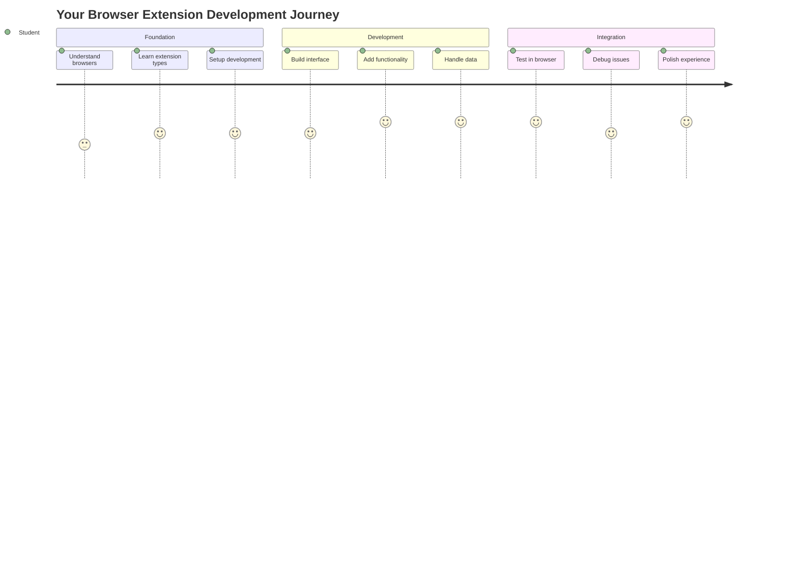
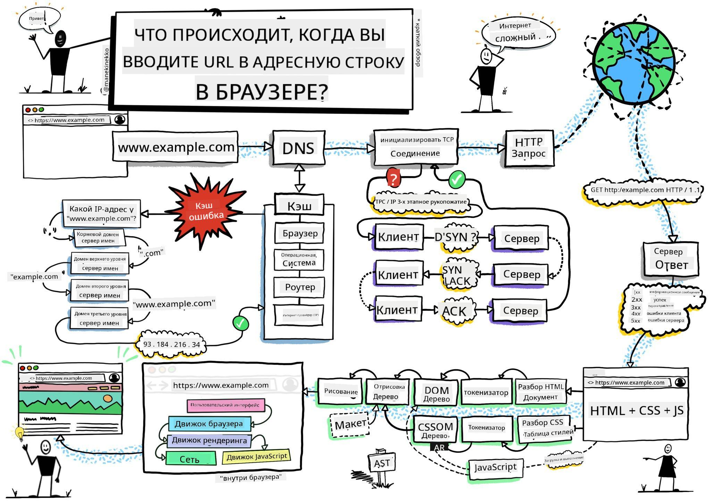
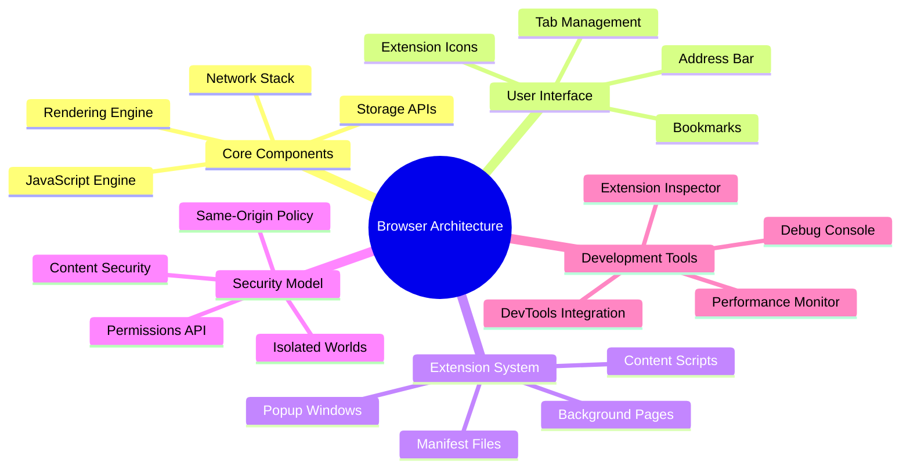
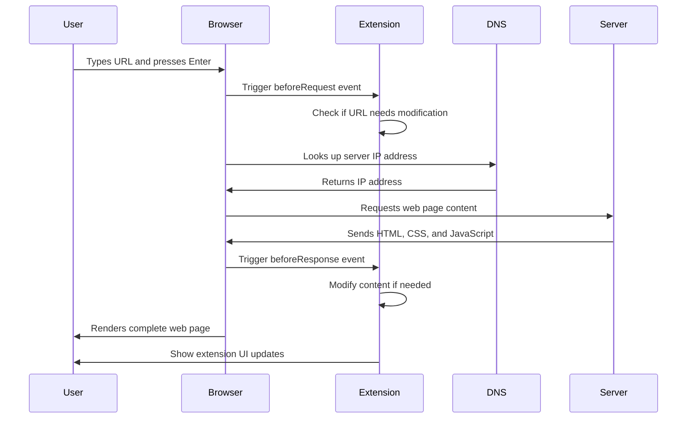
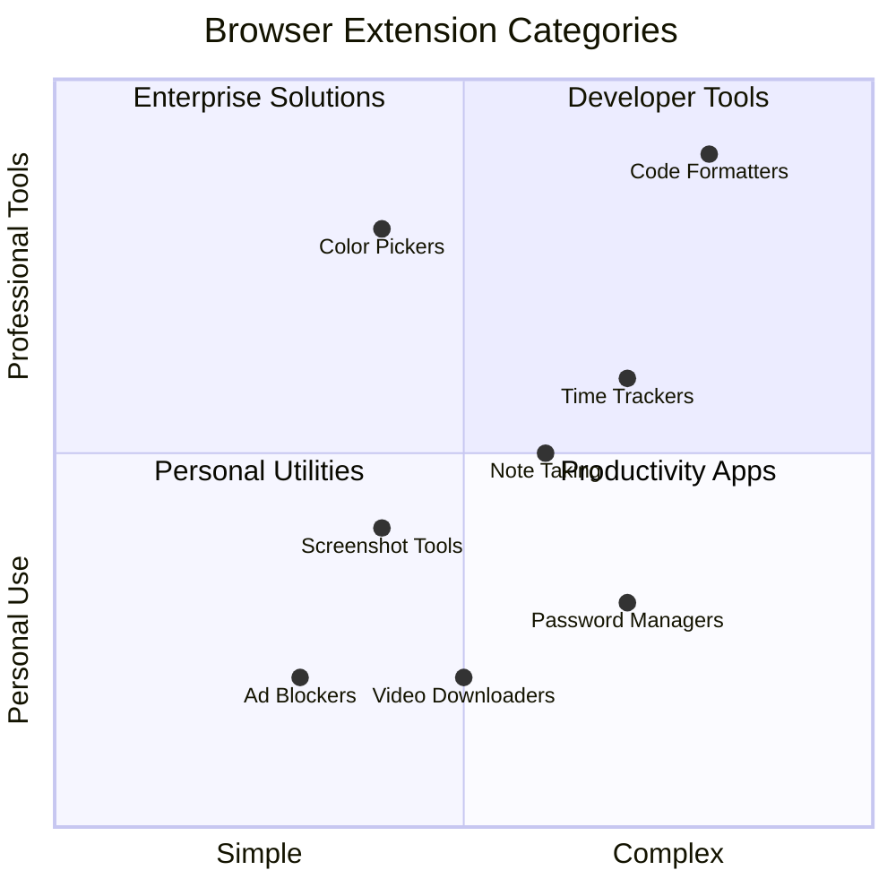
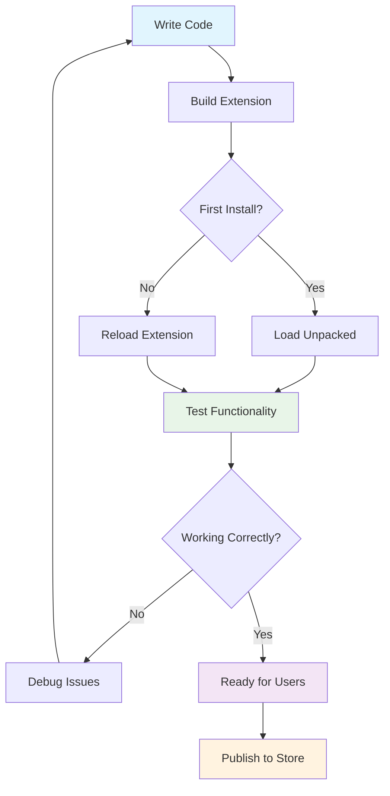
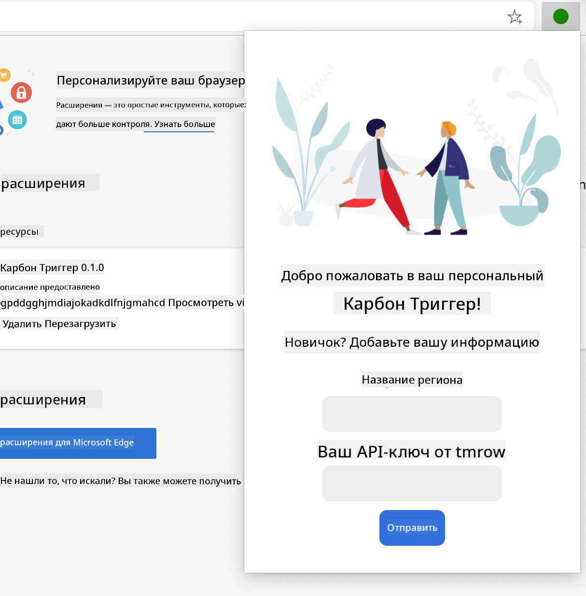
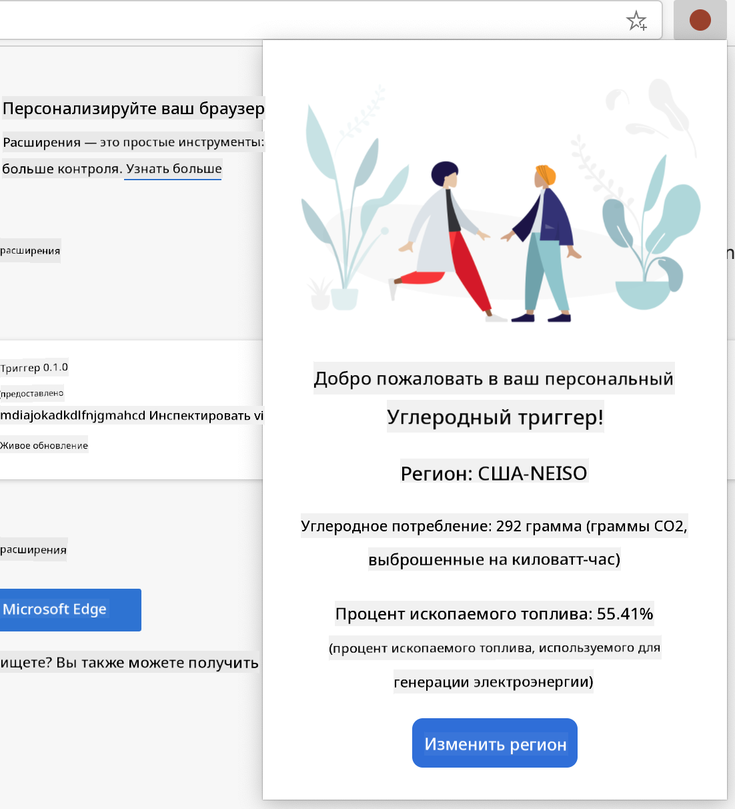
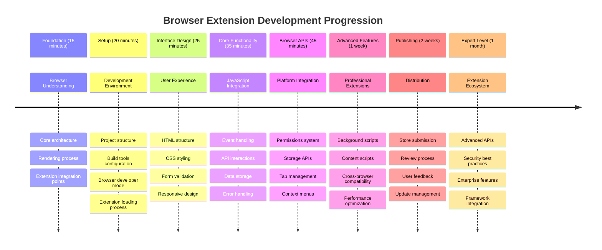

<!--
CO_OP_TRANSLATOR_METADATA:
{
  "original_hash": "00aa85715e1efd4930c17a23e3012e69",
  "translation_date": "2025-11-03T23:33:11+00:00",
  "source_file": "5-browser-extension/1-about-browsers/README.md",
  "language_code": "ru"
}
-->
# Проект расширения для браузера, часть 1: Всё о браузерах




> Скетч от [Wassim Chegham](https://dev.to/wassimchegham/ever-wondered-what-happens-when-you-type-in-a-url-in-an-address-bar-in-a-browser-3dob)

## Тест перед лекцией

[Тест перед лекцией](https://ff-quizzes.netlify.app/web/quiz/23)

### Введение

Расширения для браузеров — это мини-приложения, которые улучшают ваш опыт веб-серфинга. Как и первоначальное видение Тима Бернерса-Ли об интерактивной сети, расширения расширяют возможности браузера за пределы простого просмотра документов. От менеджеров паролей, которые обеспечивают безопасность ваших аккаунтов, до инструментов выбора цвета, которые помогают дизайнерам находить идеальные оттенки — расширения решают повседневные задачи веб-серфинга.

Прежде чем мы начнем создавать ваше первое расширение, давайте разберемся, как работают браузеры. Точно так же, как Александру Грэхему Беллу нужно было понять передачу звука перед изобретением телефона, знание основ работы браузеров поможет вам создавать расширения, которые будут гармонично интегрироваться с существующими системами браузеров.

К концу этого урока вы поймете архитектуру браузеров и начнете создавать свое первое расширение.



## Понимание веб-браузеров

Веб-браузер — это, по сути, сложный интерпретатор документов. Когда вы вводите "google.com" в адресной строке, браузер выполняет сложную серию операций — запрашивает контент с серверов по всему миру, а затем анализирует и отображает этот код в виде интерактивных веб-страниц, которые вы видите.

Этот процесс напоминает то, как был разработан первый веб-браузер WorldWideWeb Тимом Бернерсом-Ли в 1990 году, чтобы сделать гипертекстовые документы доступными для всех.

✅ **Немного истории**: Первый браузер назывался 'WorldWideWeb' и был создан сэром Тимоти Бернерсом-Ли в 1990 году.


> Некоторые из первых браузеров, фото от [Karen McGrane](https://www.slideshare.net/KMcGrane/week-4-ixd-history-personal-computing)

### Как браузеры обрабатывают веб-контент

Процесс от ввода URL до отображения веб-страницы включает несколько согласованных шагов, которые происходят за считанные секунды:



**Что выполняет этот процесс:**
- **Преобразует** читаемый человеком URL в IP-адрес сервера через DNS-запрос
- **Устанавливает** безопасное соединение с веб-сервером с использованием протоколов HTTP или HTTPS
- **Запрашивает** конкретный контент веб-страницы с сервера
- **Получает** HTML-разметку, стили CSS и код JavaScript с сервера
- **Отображает** весь контент в виде интерактивной веб-страницы, которую вы видите

### Основные функции браузеров

Современные браузеры предоставляют множество функций, которые разработчики расширений могут использовать:

| Функция | Назначение | Возможности для расширений |
|---------|------------|---------------------------|
| **Движок рендеринга** | Отображает HTML, CSS и JavaScript | Модификация контента, внедрение стилей |
| **Движок JavaScript** | Выполняет код JavaScript | Пользовательские скрипты, взаимодействие с API |
| **Локальное хранилище** | Сохраняет данные локально | Настройки пользователя, кэшированные данные |
| **Сетевой стек** | Обрабатывает веб-запросы | Мониторинг запросов, анализ данных |
| **Модель безопасности** | Защищает пользователей от вредоносного контента | Фильтрация контента, улучшение безопасности |

**Понимание этих функций помогает вам:**
- **Определить**, где ваше расширение может принести наибольшую пользу
- **Выбрать** подходящие API браузера для функциональности вашего расширения
- **Разработать** расширения, которые эффективно работают с системами браузера
- **Обеспечить**, чтобы ваше расширение соответствовало лучшим практикам безопасности браузера

### Особенности разработки для разных браузеров

Разные браузеры реализуют стандарты с небольшими вариациями, как разные языки программирования могут по-разному обрабатывать один и тот же алгоритм. Chrome, Firefox и Safari имеют уникальные характеристики, которые разработчики должны учитывать при разработке расширений.

> 💡 **Полезный совет**: Используйте [caniuse.com](https://www.caniuse.com), чтобы проверить, какие веб-технологии поддерживаются в разных браузерах. Это незаменимый инструмент при планировании функций вашего расширения!

**Основные моменты для разработки расширений:**
- **Тестируйте** ваше расширение в браузерах Chrome, Firefox и Edge
- **Адаптируйте** к различным API расширений и форматам манифестов
- **Учитывайте** различия в производительности и ограничениях
- **Предусмотрите** резервные варианты для функций, специфичных для браузеров, которые могут быть недоступны

✅ **Аналитика**: Вы можете определить, какие браузеры предпочитают ваши пользователи, установив аналитические пакеты в свои проекты веб-разработки. Эти данные помогут вам определить приоритеты поддержки браузеров.

## Понимание расширений для браузеров

Расширения для браузеров решают распространенные проблемы веб-серфинга, добавляя функциональность непосредственно в интерфейс браузера. Вместо необходимости использовать отдельные приложения или сложные рабочие процессы, расширения предоставляют мгновенный доступ к инструментам и функциям.

Эта концепция напоминает, как ранние компьютерные пионеры, такие как Дуглас Энгельбарт, представляли себе увеличение человеческих возможностей с помощью технологий — расширения увеличивают базовую функциональность вашего браузера.



**Популярные категории расширений и их преимущества:**
- **Инструменты продуктивности**: Менеджеры задач, приложения для заметок и трекеры времени, которые помогают вам быть организованным
- **Улучшение безопасности**: Менеджеры паролей, блокировщики рекламы и инструменты конфиденциальности, которые защищают ваши данные
- **Инструменты для разработчиков**: Форматеры кода, инструменты выбора цвета и утилиты для отладки, которые упрощают разработку
- **Улучшение контента**: Режимы чтения, загрузчики видео и инструменты для создания скриншотов, которые улучшают ваш веб-опыт

✅ **Вопрос для размышления**: Какие ваши любимые расширения для браузеров? Какие конкретные задачи они выполняют и как они улучшают ваш опыт веб-серфинга?

### 🔄 **Педагогическая проверка**
**Понимание архитектуры браузера**: Перед переходом к разработке расширений убедитесь, что вы можете:
- ✅ Объяснить, как браузеры обрабатывают веб-запросы и отображают контент
- ✅ Определить основные компоненты архитектуры браузера
- ✅ Понять, как расширения интегрируются с функциональностью браузера
- ✅ Осознать модель безопасности, которая защищает пользователей

**Быстрый тест**: Можете ли вы проследить путь от ввода URL до отображения веб-страницы?
1. **DNS-запрос** преобразует URL в IP-адрес
2. **HTTP-запрос** получает контент с сервера
3. **Анализ** обрабатывает HTML, CSS и JavaScript
4. **Отображение** выводит финальную веб-страницу
5. **Расширения** могут модифицировать контент на нескольких этапах

## Установка и управление расширениями

Понимание процесса установки расширений помогает предвидеть пользовательский опыт при установке вашего расширения. Процесс установки стандартизирован во всех современных браузерах, с небольшими различиями в дизайне интерфейса.


> **Важно**: Убедитесь, что включен режим разработчика и разрешена установка расширений из других магазинов при тестировании ваших собственных расширений.

### Процесс установки расширений для разработки

Когда вы разрабатываете и тестируете свои собственные расширения, следуйте этому рабочему процессу:



```bash
# Step 1: Build your extension
npm run build
```

**Что выполняет эта команда:**
- **Компилирует** ваш исходный код в файлы, готовые для браузера
- **Упаковывает** модули JavaScript в оптимизированные пакеты
- **Генерирует** финальные файлы расширения в папке `/dist`
- **Готовит** ваше расширение к установке и тестированию

**Шаг 2: Перейдите на страницу управления расширениями браузера**
1. **Откройте** страницу управления расширениями вашего браузера
2. **Нажмите** кнопку "Настройки и другое" (иконка `...`) в правом верхнем углу
3. **Выберите** "Расширения" в выпадающем меню

**Шаг 3: Установите ваше расширение**
- **Для новых установок**: Выберите `load unpacked` и укажите вашу папку `/dist`
- **Для обновлений**: Нажмите `reload` рядом с уже установленным расширением
- **Для тестирования**: Включите "Режим разработчика", чтобы получить доступ к дополнительным функциям отладки

### Установка расширений для использования

> ✅ **Примечание**: Эти инструкции по разработке предназначены специально для расширений, которые вы создаете сами. Чтобы установить опубликованные расширения, посетите официальные магазины расширений браузеров, такие как [Microsoft Edge Add-ons store](https://microsoftedge.microsoft.com/addons/Microsoft-Edge-Extensions-Home).

**Понимание различий:**
- **Установки для разработки** позволяют тестировать неопубликованные расширения в процессе разработки
- **Установки из магазина** предоставляют проверенные, опубликованные расширения с автоматическими обновлениями
- **Сторонняя установка** позволяет устанавливать расширения из источников вне официальных магазинов (требуется режим разработчика)

## Создание расширения для отображения углеродного следа

Мы создадим расширение для браузера, которое отображает углеродный след использования энергии в вашем регионе. Этот проект демонстрирует основные концепции разработки расширений, создавая при этом практичный инструмент для повышения экологической осведомленности.

Этот подход следует принципу "учиться, делая", который доказал свою эффективность с тех пор, как Джон Дьюи разработал свои образовательные теории — сочетание технических навыков с значимыми реальными приложениями.

### Требования к проекту

Прежде чем начать разработку, давайте соберем необходимые ресурсы и зависимости:

**Требуемый доступ к API:**
- **[CO2 Signal API key](https://www.co2signal.com/)**: Введите ваш адрес электронной почты, чтобы получить бесплатный ключ API
- **[Код региона](http://api.electricitymap.org/v3/zones)**: Найдите код вашего региона, используя [Electricity Map](https://www.electricitymap.org/map) (например, для Бостона используется 'US-NEISO')

**Инструменты разработки:**
- **[Node.js и NPM](https://www.npmjs.com)**: Инструмент управления пакетами для установки зависимостей проекта
- **[Стартовый код](../../../../5-browser-extension/start)**: Скачайте папку `start`, чтобы начать разработку

✅ **Узнать больше**: Улучшите свои навыки управления пакетами с помощью [этого подробного модуля обучения](https://docs.microsoft.com/learn/modules/create-nodejs-project-dependencies/?WT.mc_id=academic-77807-sagibbon)

### Понимание структуры проекта

Понимание структуры проекта помогает организовать работу над разработкой эффективно. Как библиотека Александрийская была организована для легкого поиска знаний, хорошо структурированный код делает разработку более продуктивной:

```
project-root/
├── dist/                    # Built extension files
│   ├── manifest.json        # Extension configuration
│   ├── index.html           # User interface markup
│   ├── background.js        # Background script functionality
│   └── main.js              # Compiled JavaScript bundle
├── src/                     # Source development files
│   └── index.js             # Your main JavaScript code
├── package.json             # Project dependencies and scripts
└── webpack.config.js        # Build configuration
```

**Разбор того, что выполняет каждый файл:**
- **`manifest.json`**: **Определяет** метаданные расширения, разрешения и точки входа
- **`index.html`**: **Создает** пользовательский интерфейс, который появляется при клике на расширение
- **`background.js`**: **Обрабатывает** фоновые задачи и слушатели событий браузера
- **`main.js`**: **Содержит** финальный скомпилированный JavaScript после процесса сборки
- **`src/index.js`**: **Содержит** основной код разработки, который компилируется в `main.js`

> 💡 **Совет по организации**: Сохраните ваш ключ API и код региона в безопасной заметке для легкого доступа во время разработки. Вам понадобятся эти значения для тестирования функциональности вашего расширения.

✅ **Примечание по безопасности**: Никогда не добавляйте ключи API или конфиденциальные данные в ваш репозиторий кода. Мы покажем, как безопасно работать с ними в следующих шагах.

## Создание интерфейса расширения

Теперь мы создадим компоненты пользовательского интерфейса. Расширение использует подход с двумя экранами: экран настройки для первоначальной конфигурации и экран результатов для отображения данных.

Это соответствует принципу постепенного раскрытия информации, который используется в дизайне интерфейсов с ранних дней вычислительной техники — предоставление информации и опций в логической последовательности, чтобы не перегружать пользователей.

### Обзор экранов расширения

**Экран настройки** - Конфигурация для первого использования:


**Экран результатов** - Отображение данных углеродного следа:


### Создание формы настройки

Форма настройки собирает данные конфигурации пользователя при первом использовании. После настройки эта информация сохраняется в хранилище браузера для будущих сеансов.

В файле `/dist/index.html` добавьте эту структуру формы:

```html
<form class="form-data" autocomplete="on">
    <div>
        <h2>New? Add your Information</h2>
    </div>
    <div>
        <label for="region">Region Name</label>
        <input type="text" id="region" required class="region-name" />
    </div>
    <div>
        <label for="api">Your API Key from tmrow</label>
        <input type="text" id="api" required class="api-key" />
    </div>
    <button class="search-btn">Submit</button>
</form>
```

**Что выполняет эта форма:**
- **Создает** семантическую структуру формы с правильными метками и ассоциациями ввода
- **Включает** функцию автозаполнения браузера для улучшения пользовательского опыта
- **Требует**, чтобы оба поля были заполнены перед отправкой, используя атрибут `required`
- **Организует** поля ввода с описательными именами классов для удобного стилизования и работы с JavaScript
- **Предоставляет** четкие инструкции для пользователей, которые настраивают расширение впервые

### Создание области отображения результатов

Далее создайте область результатов, которая будет показывать данные углеродного следа. Добавьте этот HTML ниже формы:

```html
<div class="result">
    <div class="loading">loading...</div>
    <div class="errors"></div>
    <div class="data"></div>
    <div class="result-container">
        <p><strong>Region: </strong><span class="my-region"></span></p>
        <p><strong>Carbon Usage: </strong><span class="carbon-usage"></span></p>
        <p><strong>Fossil Fuel Percentage: </strong><span class="fossil-fuel"></span></p>
    </div>
    <button class="clear-btn">Change region</button>
</div>
```

**Разбор того, что предоставляет эта структура:**
- **`loading`**: **Отображает** сообщение о загрузке, пока данные API извлекаются
- **`errors`**: **Показывает** сообщения об ошибках, если запросы к API не удались или данные недействительны
- **`data`**: **Содержит** необработанные данные для отладки во время разработки
- **`result-container`**: **Представляет** отформатированную информацию об углеродном следе пользователям
- **`clear-btn`**: **Позволяет** пользователям изменить свой регион и перенастроить расширение

### Настройка процесса сборки

Теперь установим зависимости проекта и протестируем процесс сборки:

```bash
npm install
```

**Что выполняет этот процесс установки:**
- **Скачивает** Webpack и другие зависимости разработки, указанные в `package.json`
- **Настраивает** цепочку инструментов сборки для компиляции современного JavaScript
- **Готовит** среду разработки для создания и тестирования расширений
- **Включает** функции упаковки кода, оптимизации и совместимости с различными браузерами

> 💡 **Инсайт о процессе сборки**: Webpack упаковывает ваш исходный код из `/src/index.js` в `/dist/main.js`. Этот процесс оптимизирует ваш код для продакшена и обеспечивает совместимость с браузерами.

### Тестирование вашего прогресса

На этом этапе вы можете протестировать ваше расширение:
1. **Запустите** команду сборки, чтобы скомпилировать ваш код.  
2. **Загрузите** расширение в браузер, используя режим разработчика.  
3. **Убедитесь**, что форма отображается корректно и выглядит профессионально.  
4. **Проверьте**, что все элементы формы правильно выровнены и работают.  

**Что вы сделали:**  
- **Создали** базовую HTML-структуру для вашего расширения.  
- **Разработали** интерфейсы конфигурации и результатов с использованием семантической разметки.  
- **Настроили** современный рабочий процесс разработки с использованием стандартных инструментов.  
- **Подготовили** основу для добавления интерактивного функционала на JavaScript.  

### 🔄 **Педагогическая проверка**  
**Прогресс разработки расширения**: Убедитесь, что вы понимаете материал, прежде чем продолжить:  
- ✅ Можете ли вы объяснить назначение каждого файла в структуре проекта?  
- ✅ Понимаете ли вы, как процесс сборки преобразует исходный код?  
- ✅ Почему мы разделяем конфигурацию и результаты на разные секции интерфейса?  
- ✅ Как структура формы поддерживает удобство использования и доступность?  

**Понимание рабочего процесса разработки**: Теперь вы должны уметь:  
1. **Изменять** HTML и CSS для интерфейса вашего расширения.  
2. **Запускать** команду сборки для компиляции изменений.  
3. **Перезагружать** расширение в браузере для тестирования обновлений.  
4. **Отлаживать** проблемы с помощью инструментов разработчика в браузере.  

Вы завершили первый этап разработки расширений для браузера. Как братья Райт сначала изучали аэродинамику перед тем, как подняться в воздух, понимание этих базовых концепций подготовит вас к созданию более сложных интерактивных функций в следующем уроке.  

## Задача GitHub Copilot Agent 🚀  

Используйте режим Agent, чтобы выполнить следующую задачу:  

**Описание:** Улучшите расширение для браузера, добавив функции проверки формы и обратной связи с пользователем, чтобы улучшить пользовательский опыт при вводе API-ключей и кодов регионов.  

**Задание:** Создайте функции проверки на JavaScript, которые проверяют, содержит ли поле API-ключа не менее 20 символов, а код региона соответствует правильному формату (например, 'US-NEISO'). Добавьте визуальную обратную связь, изменяя цвет границ ввода на зеленый для правильных данных и красный для неправильных. Также добавьте функцию переключения для отображения/скрытия API-ключа в целях безопасности.  

Узнайте больше о [режиме Agent](https://code.visualstudio.com/blogs/2025/02/24/introducing-copilot-agent-mode) здесь.  

## 🚀 Задача  

Посмотрите магазин расширений для браузера и установите одно из них. Вы можете изучить его файлы интересными способами. Что вы обнаружили?  

## Тест после лекции  

[Тест после лекции](https://ff-quizzes.netlify.app/web/quiz/24)  

## Обзор и самостоятельное изучение  

На этом уроке вы узнали немного о истории веб-браузеров; воспользуйтесь этой возможностью, чтобы узнать, как создатели Всемирной паутины представляли ее использование, прочитав больше о ее истории. Полезные ресурсы:  

[История веб-браузеров](https://www.mozilla.org/firefox/browsers/browser-history/)  

[История веба](https://webfoundation.org/about/vision/history-of-the-web/)  

[Интервью с Тимом Бернерсом-Ли](https://www.theguardian.com/technology/2019/mar/12/tim-berners-lee-on-30-years-of-the-web-if-we-dream-a-little-we-can-get-the-web-we-want)  

### ⚡ **Что вы можете сделать за следующие 5 минут**  
- [ ] Откройте страницу расширений Chrome/Edge (chrome://extensions) и изучите, что у вас установлено.  
- [ ] Посмотрите вкладку "Сеть" в инструментах разработчика вашего браузера при загрузке веб-страницы.  
- [ ] Попробуйте просмотреть исходный код страницы (Ctrl+U), чтобы увидеть структуру HTML.  
- [ ] Исследуйте любой элемент веб-страницы и измените его CSS в инструментах разработчика.  

### 🎯 **Что вы можете сделать за час**  
- [ ] Пройдите тест после урока и разберитесь в основах браузеров.  
- [ ] Создайте базовый файл manifest.json для расширения браузера.  
- [ ] Разработайте простое расширение "Hello World", которое показывает всплывающее окно.  
- [ ] Протестируйте загрузку вашего расширения в режиме разработчика.  
- [ ] Изучите документацию по расширениям браузера для вашей целевой платформы.  

### 📅 **Ваш недельный путь к созданию расширения**  
- [ ] Создайте функциональное расширение для браузера с реальной полезностью.  
- [ ] Узнайте о скриптах содержимого, фоновых скриптах и взаимодействии с всплывающими окнами.  
- [ ] Освойте API браузера, такие как storage, tabs и messaging.  
- [ ] Разработайте удобные интерфейсы для вашего расширения.  
- [ ] Протестируйте ваше расширение на разных веб-сайтах и в различных сценариях.  
- [ ] Опубликуйте ваше расширение в магазине расширений браузера.  

### 🌟 **Ваш месячный путь к разработке браузерных расширений**  
- [ ] Создайте несколько расширений, решающих разные пользовательские задачи.  
- [ ] Изучите продвинутые API браузера и лучшие практики безопасности.  
- [ ] Внесите вклад в проекты с открытым исходным кодом для браузерных расширений.  
- [ ] Освойте кроссбраузерную совместимость и прогрессивное улучшение.  
- [ ] Создайте инструменты и шаблоны для разработки расширений, чтобы помочь другим разработчикам.  
- [ ] Станьте экспертом по разработке расширений для браузеров, помогая другим разработчикам.  

## 🎯 Таймлайн вашего мастерства в разработке расширений для браузеров  


  
### 🛠️ Резюме вашего инструментария для разработки расширений  

После завершения этого урока у вас есть:  
- **Знания архитектуры браузеров**: Понимание движков рендеринга, моделей безопасности и интеграции расширений.  
- **Среда разработки**: Современный набор инструментов с Webpack, NPM и возможностями отладки.  
- **Основы UI/UX**: Семантическая HTML-структура с прогрессивными паттернами раскрытия.  
- **Осведомленность о безопасности**: Понимание разрешений браузера и безопасных методов разработки.  
- **Кроссбраузерные концепции**: Знания о совместимости и подходах к тестированию.  
- **Интеграция API**: Основа для работы с внешними источниками данных.  
- **Профессиональный рабочий процесс**: Стандартные процедуры разработки и тестирования.  

**Применение в реальном мире**: Эти навыки напрямую применимы к:  
- **Веб-разработке**: Одностраничные приложения и прогрессивные веб-приложения.  
- **Десктопным приложениям**: Electron и веб-ориентированное программное обеспечение для ПК.  
- **Мобильной разработке**: Гибридные приложения и веб-ориентированные мобильные решения.  
- **Корпоративным инструментам**: Внутренние приложения для повышения производительности и автоматизации рабочих процессов.  
- **Открытый код**: Внесение вклада в проекты расширений для браузеров и веб-стандарты.  

**Следующий уровень**: Вы готовы добавлять интерактивный функционал, работать с API браузера и создавать расширения, которые решают реальные проблемы пользователей!  

## Задание  

[Измените стиль вашего расширения](assignment.md)  

---

**Отказ от ответственности**:  
Этот документ был переведен с использованием сервиса автоматического перевода [Co-op Translator](https://github.com/Azure/co-op-translator). Несмотря на наши усилия обеспечить точность, автоматические переводы могут содержать ошибки или неточности. Оригинальный документ на его родном языке следует считать авторитетным источником. Для получения критически важной информации рекомендуется профессиональный перевод человеком. Мы не несем ответственности за любые недоразумения или неправильные интерпретации, возникающие в результате использования данного перевода.