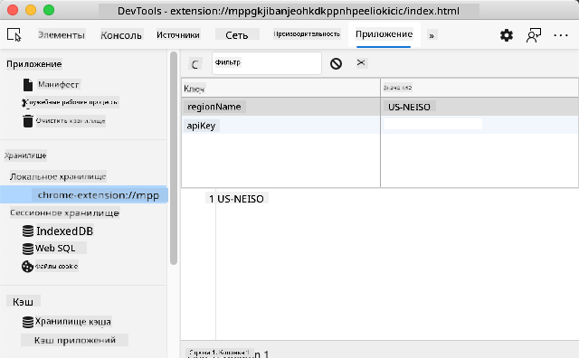

<!--
CO_OP_TRANSLATOR_METADATA:
{
  "original_hash": "8c8cd4af6086cc1d47e1d43aa4983d20",
  "translation_date": "2025-10-22T22:31:32+00:00",
  "source_file": "5-browser-extension/2-forms-browsers-local-storage/README.md",
  "language_code": "ru"
}
-->
# Проект расширения для браузера, часть 2: вызов API, использование локального хранилища

## Тест перед лекцией

[Тест перед лекцией](https://ff-quizzes.netlify.app/web/quiz/25)

## Введение

Помните то расширение для браузера, которое вы начали создавать? Сейчас у вас есть симпатичная форма, но она пока статична. Сегодня мы оживим её, подключив к реальным данным и добавив память.

Вспомните компьютеры управления миссией "Аполлон" — они не просто отображали фиксированную информацию. Они постоянно общались с космическим кораблем, обновляли данные телеметрии и запоминали важные параметры миссии. Именно такое динамическое поведение мы будем создавать сегодня. Ваше расширение будет обращаться к интернету, получать реальные данные об окружающей среде и запоминать ваши настройки для следующего использования.

Интеграция с API может показаться сложной, но на самом деле это просто обучение вашего кода взаимодействию с другими сервисами. Независимо от того, получаете ли вы данные о погоде, ленты социальных сетей или информацию о выбросах углекислого газа, как мы будем делать сегодня, всё сводится к установлению этих цифровых связей. Мы также изучим, как браузеры могут сохранять информацию — подобно тому, как библиотеки использовали карточные каталоги для запоминания местоположения книг.

К концу этого урока у вас будет расширение для браузера, которое получает реальные данные, сохраняет пользовательские настройки и обеспечивает плавный пользовательский опыт. Давайте начнем!

✅ Следуйте пронумерованным сегментам в соответствующих файлах, чтобы знать, куда вставлять ваш код.

## Настройка элементов для манипуляции в расширении

Прежде чем ваш JavaScript сможет манипулировать интерфейсом, ему нужны ссылки на конкретные HTML-элементы. Это как телескоп, который нужно направить на определенные звезды — прежде чем Галилей мог изучать спутники Юпитера, он должен был найти и сфокусироваться на самом Юпитере.

В вашем файле `index.js` мы создадим переменные `const`, которые будут содержать ссылки на каждый важный элемент формы. Это похоже на то, как ученые маркируют свое оборудование — вместо того, чтобы каждый раз искать его по всей лаборатории, они могут напрямую получить доступ к нужному.

```javascript
// form fields
const form = document.querySelector('.form-data');
const region = document.querySelector('.region-name');
const apiKey = document.querySelector('.api-key');

// results
const errors = document.querySelector('.errors');
const loading = document.querySelector('.loading');
const results = document.querySelector('.result-container');
const usage = document.querySelector('.carbon-usage');
const fossilfuel = document.querySelector('.fossil-fuel');
const myregion = document.querySelector('.my-region');
const clearBtn = document.querySelector('.clear-btn');
```

**Что делает этот код:**
- **Захватывает** элементы формы с помощью `document.querySelector()` и CSS-селекторов
- **Создает** ссылки на поля ввода для названия региона и ключа API
- **Устанавливает** соединения с элементами отображения результатов для данных о выбросах углекислого газа
- **Настраивает** доступ к элементам интерфейса, таким как индикаторы загрузки и сообщения об ошибках
- **Сохраняет** ссылки на каждый элемент в переменной `const` для удобного повторного использования в коде

## Добавление обработчиков событий

Теперь мы сделаем так, чтобы ваше расширение реагировало на действия пользователя. Обработчики событий — это способ вашего кода следить за взаимодействиями пользователя. Представьте их как операторов в ранних телефонных станциях — они слушали входящие звонки и соединяли нужные линии, когда кто-то хотел позвонить.

```javascript
form.addEventListener('submit', (e) => handleSubmit(e));
clearBtn.addEventListener('click', (e) => reset(e));
init();
```

**Понимание этих концепций:**
- **Присоединяет** обработчик события отправки к форме, который срабатывает, когда пользователь нажимает Enter или кнопку отправки
- **Подключает** обработчик события клика к кнопке очистки для сброса формы
- **Передает** объект события `(e)` в функции-обработчики для дополнительного контроля
- **Вызывает** функцию `init()` сразу для настройки начального состояния вашего расширения

✅ Обратите внимание на сокращенный синтаксис стрелочных функций, используемый здесь. Этот современный подход в JavaScript выглядит более лаконично, чем традиционные выражения функций, но оба работают одинаково хорошо!

## Создание функций инициализации и сброса

Давайте создадим логику инициализации для вашего расширения. Функция `init()` похожа на навигационную систему корабля, проверяющую свои приборы — она определяет текущее состояние и соответственно настраивает интерфейс. Она проверяет, использовал ли кто-то ваше расширение ранее, и загружает его предыдущие настройки.

Функция `reset()` предоставляет пользователям возможность начать с чистого листа — как ученые сбрасывают свои приборы между экспериментами, чтобы обеспечить чистоту данных.

```javascript
function init() {
	// Check if user has previously saved API credentials
	const storedApiKey = localStorage.getItem('apiKey');
	const storedRegion = localStorage.getItem('regionName');

	// Set extension icon to generic green (placeholder for future lesson)
	// TODO: Implement icon update in next lesson

	if (storedApiKey === null || storedRegion === null) {
		// First-time user: show the setup form
		form.style.display = 'block';
		results.style.display = 'none';
		loading.style.display = 'none';
		clearBtn.style.display = 'none';
		errors.textContent = '';
	} else {
		// Returning user: load their saved data automatically
		displayCarbonUsage(storedApiKey, storedRegion);
		results.style.display = 'none';
		form.style.display = 'none';
		clearBtn.style.display = 'block';
	}
}

function reset(e) {
	e.preventDefault();
	// Clear stored region to allow user to choose a new location
	localStorage.removeItem('regionName');
	// Restart the initialization process
	init();
}
```

**Разбор происходящего:**
- **Извлекает** сохраненный ключ API и регион из локального хранилища браузера
- **Проверяет**, является ли пользователь новым (нет сохраненных данных) или возвращающимся
- **Отображает** форму настройки для новых пользователей и скрывает другие элементы интерфейса
- **Автоматически загружает** сохраненные данные для возвращающихся пользователей и показывает опцию сброса
- **Управляет** состоянием пользовательского интерфейса на основе доступных данных

**Основные концепции локального хранилища:**
- **Сохраняет** данные между сеансами браузера (в отличие от session storage)
- **Хранит** данные в виде пар ключ-значение с использованием `getItem()` и `setItem()`
- **Возвращает** `null`, если для заданного ключа данных не существует
- **Обеспечивает** простой способ запоминания предпочтений и настроек пользователя

> 💡 **Понимание хранилища браузера**: [LocalStorage](https://developer.mozilla.org/docs/Web/API/Window/localStorage) — это как дать вашему расширению постоянную память. Представьте, как древняя Александрийская библиотека хранила свитки — информация оставалась доступной, даже когда ученые уходили и возвращались.
>
> **Основные характеристики:**
> - **Сохраняет** данные даже после закрытия браузера
> - **Выживает** после перезагрузки компьютера и сбоев браузера
> - **Предоставляет** значительное пространство для хранения пользовательских настроек
> - **Обеспечивает** мгновенный доступ без задержек сети

> **Важное замечание**: Ваше расширение для браузера имеет собственное изолированное локальное хранилище, которое отделено от обычных веб-страниц. Это обеспечивает безопасность и предотвращает конфликты с другими сайтами.

Вы можете просмотреть сохраненные данные, открыв инструменты разработчика браузера (F12), перейдя на вкладку **Application** и развернув раздел **Local Storage**.



> ⚠️ **Соображения безопасности**: В производственных приложениях хранение ключей API в LocalStorage представляет собой риск безопасности, так как JavaScript может получить доступ к этим данным. Для учебных целей этот подход подходит, но в реальных приложениях следует использовать безопасное серверное хранилище для конфиденциальных данных.

## Обработка отправки формы

Теперь мы обработаем то, что происходит, когда кто-то отправляет вашу форму. По умолчанию браузеры перезагружают страницу при отправке формы, но мы перехватим это поведение, чтобы создать более плавный опыт.

Этот подход напоминает, как центр управления миссией обрабатывает связь с космическими кораблями — вместо того, чтобы сбрасывать всю систему для каждой передачи, они поддерживают непрерывную работу, обрабатывая новую информацию.

Создайте функцию, которая захватывает событие отправки формы и извлекает ввод пользователя:

```javascript
function handleSubmit(e) {
	e.preventDefault();
	setUpUser(apiKey.value, region.value);
}
```

**В приведенном выше коде мы:**
- **Предотвращаем** стандартное поведение отправки формы, которое обновляет страницу
- **Извлекаем** значения, введенные пользователем, из полей ключа API и региона
- **Передаем** данные формы в функцию `setUpUser()` для обработки
- **Сохраняем** поведение одностраничного приложения, избегая перезагрузки страницы

✅ Помните, что ваши поля формы HTML включают атрибут `required`, поэтому браузер автоматически проверяет, чтобы пользователи предоставили и ключ API, и регион, прежде чем эта функция будет выполнена.

## Настройка пользовательских предпочтений

Функция `setUpUser` отвечает за сохранение учетных данных пользователя и выполнение первого вызова API. Это создает плавный переход от настройки к отображению результатов.

```javascript
function setUpUser(apiKey, regionName) {
	// Save user credentials for future sessions
	localStorage.setItem('apiKey', apiKey);
	localStorage.setItem('regionName', regionName);
	
	// Update UI to show loading state
	loading.style.display = 'block';
	errors.textContent = '';
	clearBtn.style.display = 'block';
	
	// Fetch carbon usage data with user's credentials
	displayCarbonUsage(apiKey, regionName);
}
```

**Шаг за шагом, что здесь происходит:**
- **Сохраняет** ключ API и название региона в локальном хранилище для будущего использования
- **Отображает** индикатор загрузки, чтобы информировать пользователей о том, что данные загружаются
- **Очищает** любые предыдущие сообщения об ошибках с экрана
- **Показывает** кнопку очистки, чтобы пользователи могли сбросить свои настройки позже
- **Инициирует** вызов API для получения реальных данных о выбросах углекислого газа

Эта функция создает бесшовный пользовательский опыт, управляя как сохранением данных, так и обновлением пользовательского интерфейса в одном согласованном действии.

## Отображение данных о выбросах углекислого газа

Теперь мы подключим ваше расширение к внешним источникам данных через API. Это преобразует ваше расширение из автономного инструмента в нечто, способное получать информацию в реальном времени из интернета.

**Понимание API**

[API](https://www.webopedia.com/TERM/A/API.html) — это способ, которым разные приложения общаются друг с другом. Представьте их как телеграфную систему, которая соединяла отдаленные города в XIX веке — операторы отправляли запросы на удаленные станции и получали ответы с запрошенной информацией. Каждый раз, когда вы проверяете социальные сети, задаете вопрос голосовому помощнику или используете приложение для доставки, API обеспечивают эти обмены данными.

**Основные концепции REST API:**
- **REST** означает "Representational State Transfer"
- **Использует** стандартные HTTP-методы (GET, POST, PUT, DELETE) для взаимодействия с данными
- **Возвращает** данные в предсказуемых форматах, обычно JSON
- **Предоставляет** последовательные URL-адреса для различных типов запросов

✅ [API CO2 Signal](https://www.co2signal.com/), который мы будем использовать, предоставляет данные о выбросах углекислого газа в реальном времени из электрических сетей по всему миру. Это помогает пользователям понять экологическое воздействие их потребления электроэнергии!

> 💡 **Понимание асинхронного JavaScript**: Ключевое слово [`async`](https://developer.mozilla.org/docs/Web/JavaScript/Reference/Statements/async_function) позволяет вашему коду выполнять несколько операций одновременно. Когда вы запрашиваете данные с сервера, вы не хотите, чтобы все ваше расширение зависло — это было бы как остановка всех операций управления воздушным движением в ожидании ответа одного самолета.
>
> **Основные преимущества:**
> - **Сохраняет** отзывчивость расширения во время загрузки данных
> - **Позволяет** другому коду продолжать выполнение во время сетевых запросов
> - **Улучшает** читаемость кода по сравнению с традиционными шаблонами обратного вызова
> - **Обеспечивает** элегантную обработку ошибок для сетевых проблем

Вот короткое видео о `async`:

[](https://youtube.com/watch?v=YwmlRkrxvkk "Async и Await для управления промисами")

> 🎥 Нажмите на изображение выше, чтобы посмотреть видео о async/await.

Создайте функцию для получения и отображения данных о выбросах углекислого газа:

```javascript
// Modern fetch API approach (no external dependencies needed)
async function displayCarbonUsage(apiKey, region) {
	try {
		// Fetch carbon intensity data from CO2 Signal API
		const response = await fetch('https://api.co2signal.com/v1/latest', {
			method: 'GET',
			headers: {
				'auth-token': apiKey,
				'Content-Type': 'application/json'
			},
			// Add query parameters for the specific region
			...new URLSearchParams({ countryCode: region }) && {
				url: `https://api.co2signal.com/v1/latest?countryCode=${region}`
			}
		});

		// Check if the API request was successful
		if (!response.ok) {
			throw new Error(`API request failed: ${response.status}`);
		}

		const data = await response.json();
		const carbonData = data.data;

		// Calculate rounded carbon intensity value
		const carbonIntensity = Math.round(carbonData.carbonIntensity);

		// Update the user interface with fetched data
		loading.style.display = 'none';
		form.style.display = 'none';
		myregion.textContent = region.toUpperCase();
		usage.textContent = `${carbonIntensity} grams (grams CO₂ emitted per kilowatt hour)`;
		fossilfuel.textContent = `${carbonData.fossilFuelPercentage.toFixed(2)}% (percentage of fossil fuels used to generate electricity)`;
		results.style.display = 'block';

		// TODO: calculateColor(carbonIntensity) - implement in next lesson

	} catch (error) {
		console.error('Error fetching carbon data:', error);
		
		// Show user-friendly error message
		loading.style.display = 'none';
		results.style.display = 'none';
		errors.textContent = 'Sorry, we couldn\'t fetch data for that region. Please check your API key and region code.';
	}
}
```

**Разбор происходящего:**
- **Использует** современный API `fetch()` вместо внешних библиотек, таких как Axios, для более чистого кода без зависимостей
- **Реализует** правильную проверку ошибок с помощью `response.ok`, чтобы вовремя обнаружить сбои API
- **Обрабатывает** асинхронные операции с помощью `async/await` для более читаемого потока кода
- **Аутентифицирует** с API CO2 Signal, используя заголовок `auth-token`
- **Парсит** данные ответа в формате JSON и извлекает информацию о выбросах углекислого газа
- **Обновляет** несколько элементов интерфейса с форматированными данными об окружающей среде
- **Предоставляет** удобные для пользователя сообщения об ошибках при сбоях вызовов API

**Основные современные концепции JavaScript, продемонстрированные здесь:**
- **Шаблонные строки** с синтаксисом `${}` для удобного форматирования строк
- **Обработка ошибок** с помощью блоков try/catch для надежных приложений
- **Async/await** для элегантной обработки сетевых запросов
- **Деструктуризация объектов** для извлечения конкретных данных из ответов API
- **Цепочка методов** для множественных манипуляций с DOM

✅ Эта функция демонстрирует несколько важных концепций веб-разработки — взаимодействие с внешними серверами, обработку аутентификации, обработку данных, обновление интерфейсов и элегантное управление ошибками. Это фундаментальные навыки, которые профессиональные разработчики используют регулярно.

🎉 **Что вы достигли:** Вы создали расширение для браузера, которое:
- **Подключается** к интернету и получает реальные данные об окружающей среде
- **Сохраняет** настройки пользователя между сеансами
- **Эффективно обрабатывает** ошибки, не допуская сбоев
- **Обеспечивает** плавный и профессиональный пользовательский опыт

Проверьте свою работу, запустив `npm run build` и обновив расширение в браузере. Теперь у вас есть функциональный трекер углеродного следа. В следующем уроке мы добавим динамическую функциональность значков, чтобы завершить расширение.

---

## Вызов для агента GitHub Copilot 🚀

Используйте режим Agent, чтобы выполнить следующий вызов:

**Описание:** Улучшите расширение для браузера, добавив улучшения обработки ошибок и функции для улучшения пользовательского опыта. Этот вызов поможет вам попрактиковаться в работе с API, локальным хранилищем и манипуляцией DOM, используя современные шаблоны JavaScript.

**Задание:** Создайте улучшенную версию функции displayCarbonUsage, которая включает: 1) Механизм повторных попыток для неудачных вызовов API с экспоненциальной задержкой, 2) Проверку ввода кода региона перед выполнением вызова API, 3) Анимацию загрузки с индикаторами прогресса, 4) Кэширование ответов API в локальном хранилище с временными метками истечения (кэш на 30 минут), и 5) Функцию отображения исторических данных из предыдущих вызовов API. Также добавьте правильные комментарии JSDoc в стиле TypeScript для документирования всех параметров функций и типов возвращаемых данных.

Узнайте больше о [режиме Agent](https://code.visualstudio.com/blogs/2025/02/24/introducing-copilot-agent-mode) здесь.

## 🚀 Вызов

Расширьте свои знания об API, изучив множество доступных браузерных API для веб-разработки. Выберите один из этих браузерных API и создайте небольшую демонстрацию:

- [Geolocation API](https://developer.mozilla.org/docs/Web/API/Geolocation_API) - Получение текущего местоположения пользователя
- [Notification API](https://developer.mozilla.org/docs/Web/API/Notifications_API) - Отправка уведомлений на рабочий стол
- [HTML Drag and Drop API](https://developer.mozilla.org/docs/Web/API/HTML_Drag_and_Drop_API) - Создание интерактивных интерфейсов с перетаскиванием
- [Web Storage API](https://developer.mozilla.org/docs/Web/API/Web_Storage_API) - Расширенные техники локального хранилища
- [Fetch API](https://developer.mozilla.org/docs/Web/API/Fetch_API) - Современная альтернатива XMLHttpRequest

**Вопросы для исследования:**
- Какие реальные проблемы решает этот API?
- Как API обрабатывает ошибки и крайние случаи?
- Какие существуют соображения безопасности при использовании этого API?
- Насколько широко поддерживается этот API в разных браузерах?

После вашего исследования определите, какие характеристики делают API удобным для разработчиков и надежным.

## Тест после лекции

[Тест после лекции](https://ff-quizzes.netlify.app/web/quiz/26)

## Обзор и самостоятельное изучение
Вы узнали о LocalStorage и API в этом уроке, оба инструмента очень полезны для профессионального веб-разработчика. Можете ли вы подумать о том, как эти две вещи работают вместе? Подумайте, как вы бы спроектировали веб-сайт, который будет хранить элементы для использования API.

## Задание

[Примите API](assignment.md)

---

**Отказ от ответственности**:  
Этот документ был переведен с использованием сервиса автоматического перевода [Co-op Translator](https://github.com/Azure/co-op-translator). Хотя мы стремимся к точности, пожалуйста, учитывайте, что автоматические переводы могут содержать ошибки или неточности. Оригинальный документ на его родном языке следует считать авторитетным источником. Для получения критически важной информации рекомендуется профессиональный перевод человеком. Мы не несем ответственности за любые недоразумения или неправильные интерпретации, возникающие в результате использования данного перевода.