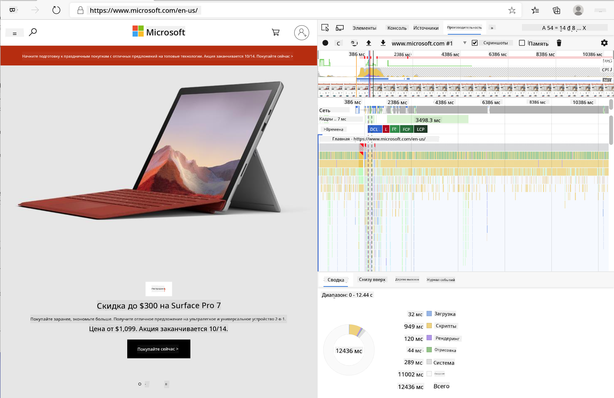
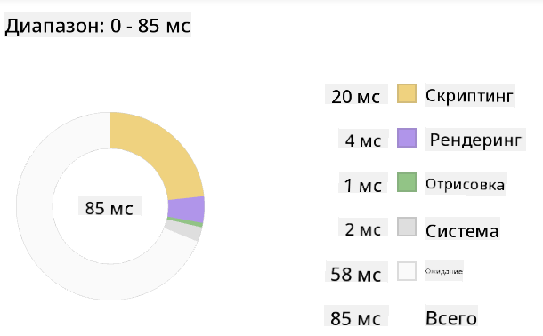
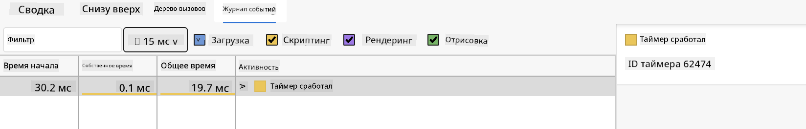

<!--
CO_OP_TRANSLATOR_METADATA:
{
  "original_hash": "49b58721a71cfda824e2f3e1f46908c6",
  "translation_date": "2025-08-28T23:15:41+00:00",
  "source_file": "5-browser-extension/3-background-tasks-and-performance/README.md",
  "language_code": "ru"
}
-->
# Проект расширения для браузера, часть 3: Изучение фоновых задач и производительности

## Викторина перед лекцией

[Викторина перед лекцией](https://ff-quizzes.netlify.app/web/quiz/27)

### Введение

В двух предыдущих уроках этого модуля вы узнали, как создать форму и область отображения для данных, полученных из API. Это стандартный способ создания веб-присутствия. Вы даже научились асинхронно получать данные. Ваше расширение для браузера почти готово.

Осталось настроить выполнение некоторых фоновых задач, включая обновление цвета значка расширения. Это отличный момент, чтобы обсудить, как браузер управляет такими задачами. Давайте рассмотрим эти задачи в контексте производительности ваших веб-ресурсов.

## Основы веб-производительности

> "Производительность веб-сайта — это две вещи: как быстро загружается страница и как быстро выполняется код на ней." -- [Зак Гроссбарт](https://www.smashingmagazine.com/2012/06/javascript-profiling-chrome-developer-tools/)

Тема ускорения работы веб-сайтов на всех типах устройств, для всех пользователей и в любых условиях, как вы понимаете, обширна. Вот несколько моментов, которые стоит учитывать при создании стандартного веб-проекта или расширения для браузера.

Первое, что нужно сделать, чтобы убедиться, что ваш сайт работает эффективно, — это собрать данные о его производительности. Начать можно с инструментов разработчика в вашем веб-браузере. В Edge выберите кнопку "Настройки и другое" (значок с тремя точками в правом верхнем углу браузера), затем перейдите в "Дополнительные инструменты" > "Инструменты разработчика" и откройте вкладку "Производительность". Вы также можете использовать сочетания клавиш `Ctrl` + `Shift` + `I` на Windows или `Option` + `Command` + `I` на Mac, чтобы открыть инструменты разработчика.

На вкладке "Производительность" есть инструмент профилирования. Откройте веб-сайт (например, [https://www.microsoft.com](https://www.microsoft.com/?WT.mc_id=academic-77807-sagibbon)) и нажмите кнопку "Запись", затем обновите сайт. Остановите запись в любой момент, и вы сможете увидеть процессы, связанные со 'скриптами', 'рендерингом' и 'отрисовкой' сайта:



✅ Посетите [документацию Microsoft](https://docs.microsoft.com/microsoft-edge/devtools-guide/performance/?WT.mc_id=academic-77807-sagibbon) о панели производительности в Edge.

> Совет: чтобы получить точные данные о времени загрузки вашего сайта, очистите кэш браузера.

Выберите элементы временной шкалы профиля, чтобы увеличить события, происходящие во время загрузки страницы.

Получите снимок производительности вашей страницы, выбрав часть временной шкалы профиля и посмотрев на панель сводки:



Проверьте панель журнала событий, чтобы увидеть, заняло ли какое-либо событие больше 15 мс:



✅ Познакомьтесь с вашим профайлером! Откройте инструменты разработчика на этом сайте и проверьте, есть ли узкие места. Какой ресурс загружается дольше всего? Быстрее всего?

## Проверки профилирования

В целом, есть несколько "проблемных зон", за которыми каждый веб-разработчик должен следить при создании сайта, чтобы избежать неприятных сюрпризов при развертывании в продакшн.

**Размеры ресурсов**: За последние годы веб стал "тяжелее" и, соответственно, медленнее. Часть этого веса связана с использованием изображений.

✅ Изучите [Архив Интернета](https://httparchive.org/reports/page-weight), чтобы получить исторический обзор веса страниц и другую информацию.

Хорошей практикой является оптимизация изображений и их доставка в нужном размере и разрешении для ваших пользователей.

**Обход DOM**: Браузер должен построить модель объекта документа (DOM) на основе вашего кода, поэтому для хорошей производительности страницы важно минимизировать количество тегов, используя и стилизуя только то, что необходимо. Например, избыточные CSS, связанные со страницей, можно оптимизировать; стили, которые нужны только на одной странице, не обязательно включать в основной файл стилей.

**JavaScript**: Каждый разработчик JavaScript должен следить за скриптами, блокирующими рендеринг, которые должны быть загружены до того, как остальная часть DOM будет обработана и отрисована в браузере. Рассмотрите возможность использования `defer` для ваших встроенных скриптов (как это сделано в модуле Terrarium).

✅ Попробуйте протестировать несколько сайтов на [сервисе проверки скорости сайтов](https://www.webpagetest.org/), чтобы узнать больше о стандартных проверках производительности.

Теперь, когда вы понимаете, как браузер обрабатывает ресурсы, которые вы ему отправляете, давайте рассмотрим последние шаги для завершения вашего расширения:

### Создание функции для расчета цвета

Работая в `/src/index.js`, добавьте функцию `calculateColor()` после серии переменных `const`, которые вы настроили для доступа к DOM:

```JavaScript
function calculateColor(value) {
	let co2Scale = [0, 150, 600, 750, 800];
	let colors = ['#2AA364', '#F5EB4D', '#9E4229', '#381D02', '#381D02'];

	let closestNum = co2Scale.sort((a, b) => {
		return Math.abs(a - value) - Math.abs(b - value);
	})[0];
	console.log(value + ' is closest to ' + closestNum);
	let num = (element) => element > closestNum;
	let scaleIndex = co2Scale.findIndex(num);

	let closestColor = colors[scaleIndex];
	console.log(scaleIndex, closestColor);

	chrome.runtime.sendMessage({ action: 'updateIcon', value: { color: closestColor } });
}
```

Что здесь происходит? Вы передаете значение (интенсивность углерода) из вызова API, который вы завершили на прошлом уроке, а затем вычисляете, насколько близко его значение к индексу, представленному в массиве цветов. Затем вы отправляете это ближайшее значение цвета в chrome runtime.

Chrome.runtime имеет [API](https://developer.chrome.com/extensions/runtime), которое обрабатывает все виды фоновых задач, и ваше расширение использует его:

> "Используйте API chrome.runtime для получения фоновой страницы, возврата данных о манифесте и прослушивания/реагирования на события в жизненном цикле приложения или расширения. Вы также можете использовать этот API для преобразования относительных путей URL в полностью квалифицированные URL."

✅ Если вы разрабатываете это расширение для Edge, вас может удивить, что вы используете API Chrome. Новые версии браузера Edge работают на движке Chromium, поэтому вы можете использовать эти инструменты.

> Обратите внимание, если вы хотите профилировать расширение для браузера, откройте инструменты разработчика из самого расширения, так как оно является отдельным экземпляром браузера.

### Установка цвета значка по умолчанию

Теперь в функции `init()` установите значок в стандартный зеленый цвет, снова вызвав действие `updateIcon` из Chrome:

```JavaScript
chrome.runtime.sendMessage({
	action: 'updateIcon',
		value: {
			color: 'green',
		},
});
```

### Вызов функции и выполнение вызова

Далее вызовите созданную вами функцию, добавив ее в промис, возвращаемый API C02Signal:

```JavaScript
//let CO2...
calculateColor(CO2);
```

И, наконец, в `/dist/background.js` добавьте слушатель для этих вызовов фоновых задач:

```JavaScript
chrome.runtime.onMessage.addListener(function (msg, sender, sendResponse) {
	if (msg.action === 'updateIcon') {
		chrome.browserAction.setIcon({ imageData: drawIcon(msg.value) });
	}
});
//borrowed from energy lollipop extension, nice feature!
function drawIcon(value) {
	let canvas = document.createElement('canvas');
	let context = canvas.getContext('2d');

	context.beginPath();
	context.fillStyle = value.color;
	context.arc(100, 100, 50, 0, 2 * Math.PI);
	context.fill();

	return context.getImageData(50, 50, 100, 100);
}
```

В этом коде вы добавляете слушатель для любых сообщений, поступающих в менеджер фоновых задач. Если сообщение называется 'updateIcon', то выполняется следующий код для отрисовки значка нужного цвета с использованием Canvas API.

✅ Вы узнаете больше о Canvas API в [уроках по созданию космической игры](../../6-space-game/2-drawing-to-canvas/README.md).

Теперь пересоберите ваше расширение (`npm run build`), обновите и запустите его, и наблюдайте за изменением цвета. Пора сходить за покупками или помыть посуду? Теперь вы знаете!

Поздравляем, вы создали полезное расширение для браузера и узнали больше о том, как работает браузер и как профилировать его производительность.

---

## 🚀 Задание

Исследуйте несколько открытых веб-сайтов, которые существуют уже давно, и, основываясь на их истории в GitHub, попробуйте определить, как они оптимизировались для производительности с течением времени, если вообще оптимизировались. Какая проблема встречается чаще всего?

## Викторина после лекции

[Викторина после лекции](https://ff-quizzes.netlify.app/web/quiz/28)

## Обзор и самостоятельное изучение

Рассмотрите возможность подписки на [рассылку о производительности](https://perf.email/).

Изучите, как браузеры оценивают производительность веб-сайтов, исследуя вкладки производительности в их инструментах разработчика. Обнаружили ли вы какие-либо значительные различия?

## Задание

[Анализ производительности сайта](assignment.md)

---

**Отказ от ответственности**:  
Этот документ был переведен с помощью сервиса автоматического перевода [Co-op Translator](https://github.com/Azure/co-op-translator). Хотя мы стремимся к точности, пожалуйста, учитывайте, что автоматические переводы могут содержать ошибки или неточности. Оригинальный документ на его родном языке следует считать авторитетным источником. Для получения критически важной информации рекомендуется профессиональный перевод человеком. Мы не несем ответственности за любые недоразумения или неправильные интерпретации, возникшие в результате использования данного перевода.