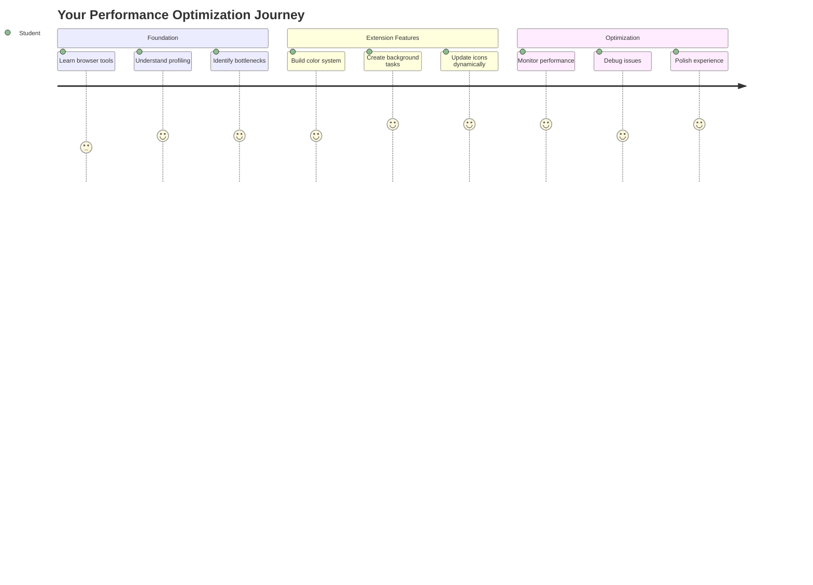
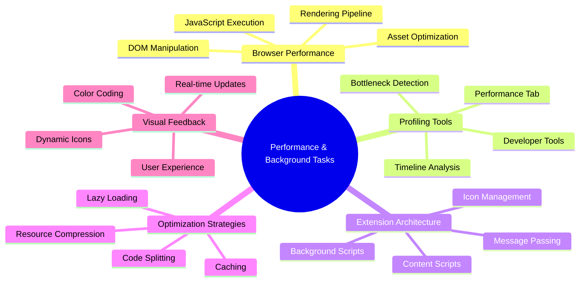
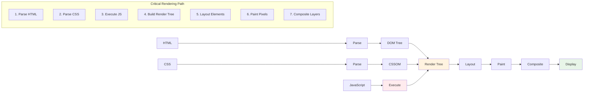
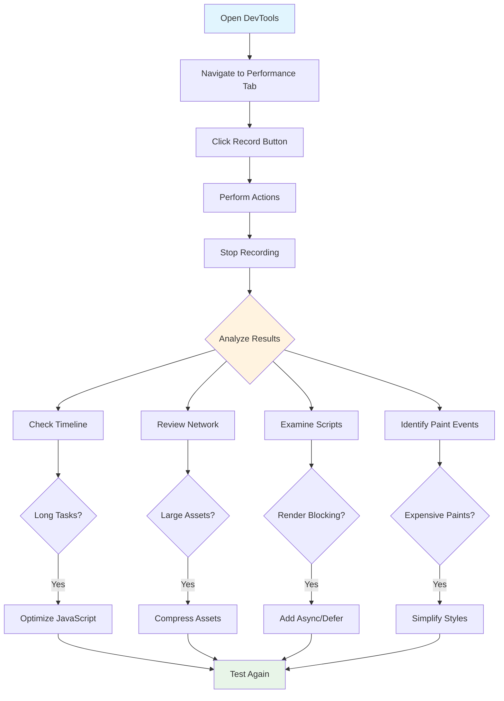
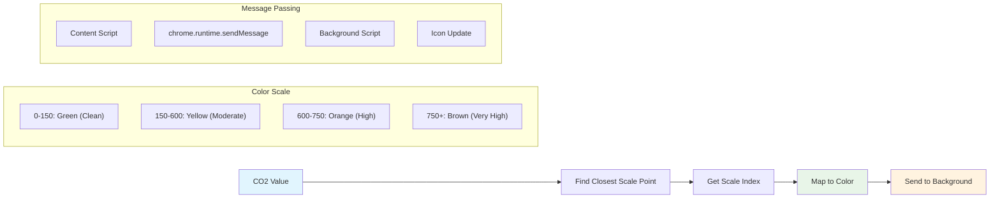
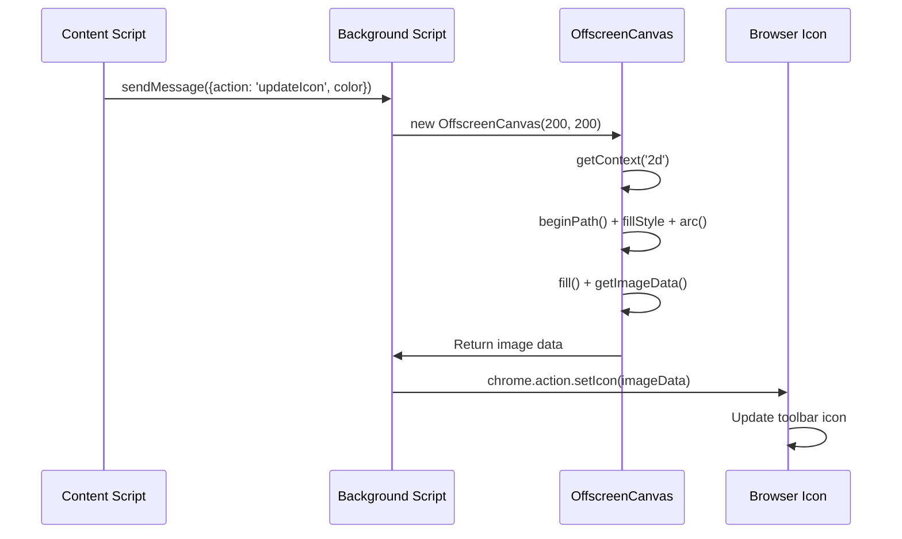
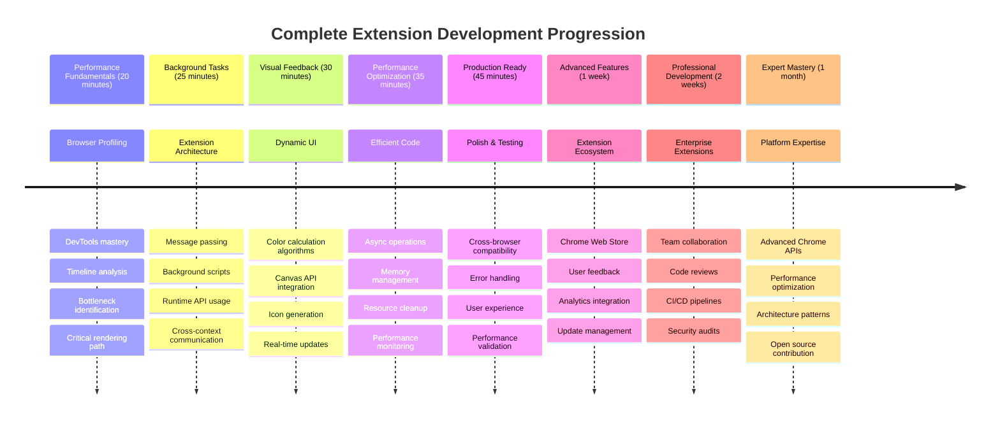

```mermaid
architecture-beta
    group browser(logos:chrome)[Browser]
    
    service popup(logos:html5)[Popup UI] in browser
    service content(logos:javascript)[Content Script] in browser
    service background(database)[Background Script] in browser
    service api(logos:api)[External API] in browser
    
    popup:R -- L:content
    content:R -- L:background
    background:T -- B:api
    content:T -- B:api
    
    junction junctionCenter in browser
    popup:R -- L:junctionCenter
    junctionCenter:R -- L:background
```

<!--
CO_OP_TRANSLATOR_METADATA:
{
  "original_hash": "b275fed2c6fc90d2b9b6661a3225faa2",
  "translation_date": "2025-11-03T23:31:52+00:00",
  "source_file": "5-browser-extension/3-background-tasks-and-performance/README.md",
  "language_code": "ru"
}
-->
# Проект расширения для браузера, часть 3: Изучение фоновых задач и производительности



Задумывались ли вы, почему некоторые расширения для браузера работают быстро и отзывчиво, а другие кажутся медленными? Секрет кроется в том, что происходит за кулисами. Пока пользователи кликают по интерфейсу вашего расширения, в фоновом режиме происходит множество процессов: сбор данных, обновление иконок и управление системными ресурсами.

Это наш последний урок в серии о расширениях для браузера, и мы сделаем ваш трекер углеродного следа максимально эффективным. Вы добавите динамические обновления иконок и научитесь выявлять проблемы с производительностью до того, как они станут серьезными. Это как настройка гоночного автомобиля — небольшие оптимизации могут значительно улучшить работу системы.

К концу урока у вас будет отточенное расширение, а также понимание принципов производительности, которые отличают хорошие веб-приложения от отличных. Давайте погрузимся в мир оптимизации браузера.

## Тест перед лекцией

[Тест перед лекцией](https://ff-quizzes.netlify.app/web/quiz/27)

### Введение

В предыдущих уроках вы создали форму, подключили её к API и разобрались с асинхронным сбором данных. Ваше расширение уже приобретает форму.

Теперь нужно добавить последние штрихи — например, сделать так, чтобы иконка расширения меняла цвет в зависимости от данных о выбросах углерода. Это напоминает, как NASA оптимизировала каждую систему на космическом корабле Apollo. Они не могли позволить себе лишние циклы или память, потому что от производительности зависели жизни. Хотя наше расширение для браузера не столь критично, те же принципы применимы — эффективный код создаёт лучший пользовательский опыт.



## Основы веб-производительности

Когда ваш код работает эффективно, люди действительно *чувствуют* разницу. Вы знаете тот момент, когда страница загружается мгновенно или анимация плавно воспроизводится? Это и есть хорошая производительность.

Производительность — это не только скорость, но и создание веб-опыта, который ощущается естественным, а не громоздким и раздражающим. В ранние дни вычислительной техники Грейс Хоппер держала на своём столе наносекунду (кусок провода длиной около фута), чтобы показать, как далеко свет проходит за одну миллиардную секунды. Это был её способ объяснить, почему каждая микросекунда имеет значение в вычислениях. Давайте изучим инструменты, которые помогут вам понять, что замедляет работу.

> "Производительность веб-сайта — это две вещи: как быстро загружается страница и как быстро работает код на ней." -- [Зак Гроссбарт](https://www.smashingmagazine.com/2012/06/javascript-profiling-chrome-developer-tools/)

Тема ускорения работы веб-сайтов на всех типах устройств, для всех типов пользователей и в любых ситуациях, как вы понимаете, обширна. Вот несколько моментов, которые стоит учитывать при создании стандартного веб-проекта или расширения для браузера.

Первый шаг в оптимизации вашего сайта — понять, что на самом деле происходит "под капотом". К счастью, ваш браузер оснащён мощными инструментами для анализа.



Чтобы открыть инструменты разработчика в Edge, нажмите на три точки в правом верхнем углу, затем выберите "Дополнительные инструменты" > "Инструменты разработчика". Или используйте сочетание клавиш: `Ctrl` + `Shift` + `I` на Windows или `Option` + `Command` + `I` на Mac. После этого перейдите на вкладку "Производительность" — здесь вы будете проводить своё исследование.

**Ваш набор инструментов для анализа производительности:**
- **Откройте** инструменты разработчика (вы будете использовать их постоянно как разработчик!)
- **Перейдите** на вкладку "Производительность" — это как фитнес-трекер для вашего веб-приложения
- **Нажмите** кнопку "Запись" и наблюдайте за действиями вашей страницы
- **Изучите** результаты, чтобы выявить, что замедляет работу

Попробуйте это. Откройте любой сайт (например, Microsoft.com) и нажмите кнопку "Запись". Затем обновите страницу и наблюдайте, как профайлер фиксирует всё, что происходит. Когда вы остановите запись, вы увидите подробный анализ того, как браузер "скриптует", "рендерит" и "рисует" сайт. Это напоминает, как центр управления полётами отслеживает каждую систему во время запуска ракеты — вы получаете данные в реальном времени о том, что происходит и когда.


✅ [Документация Microsoft](https://docs.microsoft.com/microsoft-edge/devtools-guide/performance/?WT.mc_id=academic-77807-sagibbon) содержит множество подробностей, если вы хотите углубиться.

> Совет: Очистите кэш браузера перед тестированием, чтобы увидеть, как ваш сайт работает для новых посетителей — это обычно сильно отличается от повторных визитов!

Выберите элементы временной шкалы профиля, чтобы увеличить события, происходящие во время загрузки страницы.

Получите снимок производительности вашей страницы, выбрав часть временной шкалы профиля и посмотрев на панель сводки:


Проверьте панель журнала событий, чтобы увидеть, заняло ли какое-либо событие больше 15 мс:


✅ Ознакомьтесь с профайлером! Откройте инструменты разработчика на этом сайте и посмотрите, есть ли узкие места. Какой ресурс загружается дольше всего? Какой быстрее?



## На что обращать внимание при профилировании

Запуск профайлера — это только начало, настоящая задача заключается в том, чтобы понять, что означают эти разноцветные графики. Не переживайте, со временем вы научитесь их читать. Опытные разработчики умеют замечать тревожные сигналы до того, как они перерастут в серьёзные проблемы.

Давайте поговорим о типичных "виновниках" — проблемах с производительностью, которые часто встречаются в веб-проектах. Как Мария Кюри тщательно следила за уровнем радиации в своей лаборатории, мы должны следить за определёнными признаками, указывающими на возможные проблемы. Их раннее обнаружение сэкономит вам (и вашим пользователям) много времени и нервов.

**Размеры ресурсов**: Со временем сайты становятся всё "тяжелее", и большая часть этого веса приходится на изображения. Это как если бы мы всё больше и больше набивали наши цифровые чемоданы.

✅ Ознакомьтесь с [Архивом Интернета](https://httparchive.org/reports/page-weight), чтобы увидеть, как размеры страниц увеличивались с годами — это довольно показательно.

**Как оптимизировать ресурсы:**
- **Сжимайте** изображения! Современные форматы, такие как WebP, могут значительно уменьшить размер файлов
- **Подавайте** изображения нужного размера для каждого устройства — нет необходимости отправлять огромные изображения для настольных компьютеров на телефоны
- **Минифицируйте** CSS и JavaScript — каждый байт имеет значение
- **Используйте** ленивую загрузку, чтобы изображения загружались только тогда, когда пользователи действительно прокручивают к ним

**Обход DOM**: Браузер должен построить свою модель объекта документа (DOM) на основе написанного вами кода, поэтому для хорошей производительности страницы важно минимизировать количество тегов, используя и стилизуя только то, что необходимо. Например, избыточные CSS, связанные с страницей, можно оптимизировать; стили, которые нужны только на одной странице, не обязательно включать в основной файл стилей.

**Ключевые стратегии оптимизации DOM:**
- **Минимизируйте** количество HTML-элементов и уровней вложенности
- **Удаляйте** неиспользуемые CSS-правила и эффективно объединяйте таблицы стилей
- **Организуйте** CSS так, чтобы загружались только необходимые стили для каждой страницы
- **Структурируйте** HTML семантически для лучшего анализа браузером

**JavaScript**: Каждый разработчик JavaScript должен следить за скриптами, блокирующими рендеринг, которые должны быть загружены перед тем, как остальная часть DOM может быть обработана и отображена в браузере. Рассмотрите возможность использования `defer` для ваших встроенных скриптов (как это сделано в модуле Terrarium).

**Современные методы оптимизации JavaScript:**
- **Используйте** атрибут `defer` для загрузки скриптов после обработки DOM
- **Реализуйте** разделение кода для загрузки только необходимого JavaScript
- **Применяйте** ленивую загрузку для некритичных функций
- **Минимизируйте** использование тяжёлых библиотек и фреймворков, если это возможно

✅ Попробуйте несколько сайтов на [сайте тестирования скорости](https://www.webpagetest.org/), чтобы узнать больше о распространённых проверках, которые проводятся для определения производительности сайта.

### 🔄 **Педагогическая проверка**
**Понимание производительности**: Перед добавлением функций в расширение убедитесь, что вы можете:
- ✅ Объяснить критический путь рендеринга от HTML до пикселей
- ✅ Определить распространённые узкие места производительности в веб-приложениях
- ✅ Использовать инструменты разработчика браузера для профилирования производительности страницы
- ✅ Понять, как размер ресурсов и сложность DOM влияют на скорость

**Быстрый тест**: Что происходит, если у вас есть JavaScript, блокирующий рендеринг?
*Ответ: Браузер должен загрузить и выполнить скрипт, прежде чем продолжить обработку HTML и рендеринг страницы*

**Реальное влияние производительности**:
- **Задержка 100 мс**: Пользователи замечают замедление
- **Задержка 1 секунда**: Пользователи начинают терять внимание
- **Задержка 3+ секунды**: 40% пользователей покидают страницу
- **Мобильные сети**: Производительность имеет ещё большее значение

Теперь, когда у вас есть представление о том, как браузер отображает отправленные ему ресурсы, давайте рассмотрим последние шаги, которые нужно выполнить для завершения вашего расширения:

### Создание функции для расчёта цвета

Теперь мы создадим функцию, которая преобразует числовые данные в значимые цвета. Это похоже на систему светофора — зелёный для чистой энергии, красный для высокой углеродной интенсивности.

Эта функция будет брать данные о CO2 из нашего API и определять, какой цвет лучше всего представляет воздействие на окружающую среду. Это похоже на то, как учёные используют цветовую кодировку в тепловых картах для визуализации сложных данных — от температуры океана до формирования звёзд. Добавьте это в `/src/index.js`, сразу после тех переменных `const`, которые мы настроили ранее:



```javascript
function calculateColor(value) {
	// Define CO2 intensity scale (grams per kWh)
	const co2Scale = [0, 150, 600, 750, 800];
	// Corresponding colors from green (clean) to dark brown (high carbon)
	const colors = ['#2AA364', '#F5EB4D', '#9E4229', '#381D02', '#381D02'];

	// Find the closest scale value to our input
	const closestNum = co2Scale.sort((a, b) => {
		return Math.abs(a - value) - Math.abs(b - value);
	})[0];
	
	console.log(`${value} is closest to ${closestNum}`);
	
	// Find the index for color mapping
	const num = (element) => element > closestNum;
	const scaleIndex = co2Scale.findIndex(num);

	const closestColor = colors[scaleIndex];
	console.log(scaleIndex, closestColor);

	// Send color update message to background script
	chrome.runtime.sendMessage({ action: 'updateIcon', value: { color: closestColor } });
}
```

**Разберём эту умную маленькую функцию:**
- **Настраивает** два массива — один для уровней CO2, другой для цветов (зелёный = чисто, коричневый = грязно!)
- **Находит** ближайшее совпадение с нашим фактическим значением CO2, используя сортировку массива
- **Получает** соответствующий цвет, используя метод findIndex()
- **Отправляет** сообщение в фоновый скрипт Chrome с выбранным цветом
- **Использует** шаблонные строки (эти обратные кавычки) для более чистого форматирования строк
- **Сохраняет** всё организованным с помощью объявлений const

API `chrome.runtime` [API](https://developer.chrome.com/extensions/runtime) — это как нервная система вашего расширения, оно управляет всей закулисной коммуникацией и задачами:

> "Используйте API chrome.runtime для получения фоновой страницы, возврата информации о манифесте и прослушивания событий в жизненном цикле приложения или расширения. Вы также можете использовать этот API для преобразования относительных путей URL в полностью квалифицированные URL."

**Почему API Chrome Runtime так удобен:**
- **Позволяет** различным частям вашего расширения общаться друг с другом
- **Управляет** фоновыми задачами без заморозки пользовательского интерфейса
- **Обрабатывает** события жизненного цикла вашего расширения
- **Упрощает** передачу сообщений между скриптами

✅ Если вы разрабатываете это расширение для браузера Edge, вас может удивить, что вы используете API Chrome. Новые версии браузера Edge работают на движке Chromium, поэтому вы можете использовать эти инструменты.



> **Совет**: Если вы хотите профилировать расширение для браузера, откройте инструменты разработчика внутри самого расширения, так как оно является отдельным экземпляром браузера. Это даст вам доступ к метрикам производительности, специфичным для расширения.

### Установите цвет иконки по умолчанию

Прежде чем начинать сбор реальных данных, давайте зададим начальный цвет для нашей иконки. Никто не любит смотреть на пустую или сломанную иконку. Мы начнём с зелёного цвета, чтобы пользователи знали, что расширение работает с момента его установки.

В вашей функции `init()` установим этот начальный зелёный цвет:

```javascript
chrome.runtime.sendMessage({
	action: 'updateIcon',
	value: {
		color: 'green',
	},
});
```

**Что делает эта инициализация:**
- **Устанавливает** нейтральный зелёный цвет как состояние по умолчанию
- **Обеспечивает** немедленную визуальную обратную связь при загрузке расширения
- **Устанавливает** шаблон коммуникации с фоновым скриптом
- **Гарантирует**, что пользователи видят рабочее расширение до загрузки данных

### Вызов функции, выполнение вызова

Теперь давайте свяжем всё вместе, чтобы при поступлении новых данных о CO2 ваша иконка автоматически обновлялась соответствующим цветом. Это как подключение последнего элемента в электронном устройстве — внезапно все отдельные компоненты начинают работать как единая система.

Добавьте эту строку сразу после получения данных о CO2 из API:

```javascript
// After retrieving CO2 data from the API
// let CO2 = data.data[0].intensity.actual;
calculateColor(CO2);
```

**Что делает эта интеграция:**
- **Соединяет** поток данных API с системой визуальных индикаторов
- **Автоматически запускает** обновления иконки при поступлении новых данных
- **Обеспечивает** визуальную обратную связь в реальном времени на основе текущей углеродной интенсивности
- **Сохраняет** разделение обязанностей между сбором данных и логикой отображения

И, наконец, в `/dist/background.js`, добавьте слушатель для этих вызовов фоновых действий:

```javascript
// Listen for messages from the content script
chrome.runtime.onMessage.addListener(function (msg, sender, sendResponse) {
	if (msg.action === 'updateIcon') {
		chrome.action.setIcon({ imageData: drawIcon(msg.value) });
	}
});

// Draw dynamic icon using Canvas API
// Borrowed from energy lollipop extension - nice feature!
function drawIcon(value) {
	// Create an offscreen canvas for better performance
	const canvas = new OffscreenCanvas(200, 200);
	const context = canvas.getContext('2d');

	// Draw a colored circle representing carbon intensity
	context.beginPath();
	context.fillStyle = value.color;
	context.arc(100, 100, 50, 0, 2 * Math.PI);
	context.fill();

	// Return the image data for the browser icon
	return context.getImageData(50, 50, 100, 100);
}
```

**Что делает этот фоновый скрипт:**
- **Слушает** сообщения от вашего основного скрипта (как секретарь, принимающий звонки)
- **Обрабатывает** запросы 'updateIcon' для изменения иконки на панели инструментов
- **Создаёт** новые иконки на лету, используя API Canvas
- **Рисует** простой цветной круг, показывающий текущую углеродную интенсивность
- **Обновляет** панель инструментов браузера с новой иконкой
- **Использует** OffscreenCanvas для плавной производительности (без блокировки интерфейса)

✅ Вы узнаете больше о API Canvas в [уроках по космической игре](../../6-space-game/2-drawing-to-canvas/README.md).



### 🔄 **Педагогическая проверка**
**Полное понимание расширения**: Убедитесь, что вы освоили всю систему:
- ✅ Как работает передача сообщений между различными скриптами расширения?
- ✅ Почему мы используем OffscreenCanvas вместо обычного Canvas для производительности?
- ✅ Какую роль играет Chrome Runtime API в архитектуре расширений?
- ✅ Как алгоритм расчета цвета сопоставляет данные с визуальной обратной связью?

**Учет производительности**: Ваше расширение теперь демонстрирует:
- **Эффективный обмен сообщениями**: Чистая коммуникация между контекстами скриптов
- **Оптимизированный рендеринг**: OffscreenCanvas предотвращает блокировку интерфейса
- **Обновления в реальном времени**: Динамическое изменение значков на основе актуальных данных
- **Управление памятью**: Корректная очистка и обработка ресурсов

**Время протестировать ваше расширение:**
- **Соберите** все с помощью `npm run build`
- **Перезагрузите** ваше расширение в браузере (не забудьте этот шаг)
- **Откройте** ваше расширение и наблюдайте, как значок меняет цвета
- **Проверьте**, как оно реагирует на реальные данные о выбросах углерода со всего мира

Теперь вы сможете мгновенно понять, стоит ли запускать стирку или лучше подождать более чистой энергии. Вы создали что-то действительно полезное и узнали о производительности браузера в процессе.

## Вызов GitHub Copilot Agent 🚀

Используйте режим Agent, чтобы выполнить следующий вызов:

**Описание:** Улучшите возможности мониторинга производительности расширения, добавив функцию, которая отслеживает и отображает время загрузки различных компонентов расширения.

**Задание:** Создайте систему мониторинга производительности для браузерного расширения, которая измеряет и записывает время, необходимое для получения данных о CO2 из API, расчета цветов и обновления значка. Добавьте функцию `performanceTracker`, которая использует Performance API для измерения этих операций и отображает результаты в консоли браузера с временными метками и метриками длительности.

Узнайте больше о [режиме Agent](https://code.visualstudio.com/blogs/2025/02/24/introducing-copilot-agent-mode) здесь.

## 🚀 Вызов

Вот интересная детективная миссия: выберите несколько сайтов с открытым исходным кодом, которые существуют уже много лет (например, Wikipedia, GitHub или Stack Overflow), и изучите их историю коммитов. Можете ли вы обнаружить, где они улучшали производительность? Какие проблемы повторялись?

**Ваш подход к расследованию:**
- **Ищите** в сообщениях коммитов слова, такие как "оптимизация", "производительность" или "быстрее"
- **Ищите** закономерности — исправляют ли они одни и те же типы проблем?
- **Определите** общие причины, которые замедляют работу сайтов
- **Поделитесь** своими открытиями — другие разработчики учатся на реальных примерах

## Викторина после лекции

[Викторина после лекции](https://ff-quizzes.netlify.app/web/quiz/28)

## Обзор и самостоятельное изучение

Рассмотрите возможность подписки на [рассылку о производительности](https://perf.email/)

Изучите некоторые способы, которыми браузеры оценивают производительность веб-страниц, заглянув в вкладки производительности их веб-инструментов. Обнаружили ли вы какие-либо значительные различия?

### ⚡ **Что можно сделать за следующие 5 минут**
- [ ] Откройте диспетчер задач браузера (Shift+Esc в Chrome), чтобы увидеть использование ресурсов расширением
- [ ] Используйте вкладку Performance в DevTools, чтобы записать и проанализировать производительность веб-страницы
- [ ] Проверьте страницу расширений браузера, чтобы увидеть, какие расширения влияют на время запуска
- [ ] Попробуйте временно отключить расширения, чтобы увидеть разницу в производительности

### 🎯 **Что можно достичь за час**
- [ ] Пройдите викторину после урока и разберитесь в концепциях производительности
- [ ] Реализуйте фоновый скрипт для вашего браузерного расширения
- [ ] Узнайте, как использовать browser.alarms для эффективных фоновых задач
- [ ] Практикуйте передачу сообщений между контентными скриптами и фоновыми скриптами
- [ ] Измерьте и оптимизируйте использование ресурсов вашего расширения

### 📅 **Ваш недельный путь к производительности**
- [ ] Завершите создание высокопроизводительного браузерного расширения с фоновым функционалом
- [ ] Освойте сервис-воркеры и современную архитектуру расширений
- [ ] Реализуйте эффективные стратегии синхронизации данных и кэширования
- [ ] Узнайте передовые методы отладки производительности расширений
- [ ] Оптимизируйте ваше расширение как с точки зрения функциональности, так и с точки зрения использования ресурсов
- [ ] Создайте комплексные тесты для сценариев производительности расширений

### 🌟 **Ваш месячный путь к мастерству оптимизации**
- [ ] Создайте браузерные расширения корпоративного уровня с оптимальной производительностью
- [ ] Узнайте о Web Workers, Service Workers и современной веб-производительности
- [ ] Внесите вклад в проекты с открытым исходным кодом, ориентированные на оптимизацию производительности
- [ ] Освойте внутреннюю архитектуру браузеров и передовые методы отладки
- [ ] Создайте инструменты мониторинга производительности и руководства по лучшим практикам
- [ ] Станьте экспертом по производительности, который помогает оптимизировать веб-приложения

## 🎯 Ваш график освоения разработки браузерных расширений



### 🛠️ Ваш полный набор инструментов для разработки расширений

После завершения этой трилогии вы освоили:
- **Архитектура браузера**: Глубокое понимание того, как расширения интегрируются с системами браузера
- **Профилирование производительности**: Умение выявлять и устранять узкие места с помощью инструментов разработчика
- **Асинхронное программирование**: Современные шаблоны JavaScript для отзывчивых, неблокирующих операций
- **Интеграция API**: Получение внешних данных с аутентификацией и обработкой ошибок
- **Визуальный дизайн**: Динамические обновления интерфейса и графика на основе Canvas
- **Передача сообщений**: Взаимодействие между скриптами в архитектуре расширений
- **Пользовательский опыт**: Состояния загрузки, обработка ошибок и интуитивное взаимодействие
- **Навыки производства**: Тестирование, отладка и оптимизация для реального развертывания

**Реальные приложения**: Ваши навыки разработки расширений применимы непосредственно к:
- **Прогрессивным веб-приложениям**: Похожие архитектуры и шаблоны производительности
- **Десктопным приложениям на Electron**: Кроссплатформенные приложения на веб-технологиях
- **Гибридным мобильным приложениям**: Разработка с использованием Cordova/PhoneGap и веб-API
- **Корпоративным веб-приложениям**: Сложные панели управления и инструменты продуктивности
- **Расширениям Chrome DevTools**: Расширенные инструменты разработчика и отладки
- **Интеграции веб-API**: Любое приложение, которое взаимодействует с внешними сервисами

**Профессиональное влияние**: Теперь вы можете:
- **Создавать** готовые к производству браузерные расширения от концепции до развертывания
- **Оптимизировать** производительность веб-приложений с использованием стандартных инструментов профилирования
- **Проектировать** масштабируемые системы с правильным разделением обязанностей
- **Отлаживать** сложные асинхронные операции и межконтекстное взаимодействие
- **Вносить вклад** в проекты с открытым исходным кодом и стандарты браузеров

**Возможности следующего уровня**:
- **Разработчик Chrome Web Store**: Публикуйте расширения для миллионов пользователей
- **Инженер веб-производительности**: Специализируйтесь на оптимизации и пользовательском опыте
- **Разработчик платформы браузера**: Вносите вклад в разработку движков браузеров
- **Создатель фреймворков для расширений**: Разрабатывайте инструменты для других разработчиков
- **Отношения с разработчиками**: Делитесь знаниями через обучение и создание контента

🌟 **Достижение разблокировано**: Вы создали полноценное, функциональное браузерное расширение, демонстрирующее профессиональные практики разработки и современные веб-стандарты!

## Задание

[Анализ сайта на производительность](assignment.md)

---

**Отказ от ответственности**:  
Этот документ был переведен с использованием сервиса автоматического перевода [Co-op Translator](https://github.com/Azure/co-op-translator). Несмотря на наши усилия обеспечить точность, автоматические переводы могут содержать ошибки или неточности. Оригинальный документ на его родном языке следует считать авторитетным источником. Для получения критически важной информации рекомендуется профессиональный перевод человеком. Мы не несем ответственности за любые недоразумения или неправильные интерпретации, возникшие в результате использования данного перевода.