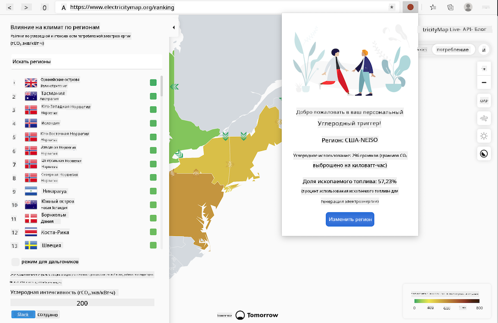

<!--
CO_OP_TRANSLATOR_METADATA:
{
  "original_hash": "9361268ca430b2579375009e1eceb5e5",
  "translation_date": "2025-08-25T23:57:03+00:00",
  "source_file": "5-browser-extension/solution/translation/README.fr.md",
  "language_code": "ru"
}
-->
# Расширение для браузера Carbon Trigger: Завершённый код

Используя API C02 Signal от tmrow для отслеживания потребления электроэнергии, создайте расширение для браузера, чтобы вы могли получать напоминания прямо в браузере о потреблении электроэнергии в вашем регионе. Использование этого расширения поможет вам принимать решения о своих действиях, основываясь на этих данных.



## Начало работы

Вам потребуется установленный [npm](https://npmjs.com). Скачайте копию этого кода в папку на вашем компьютере.

Установите все необходимые пакеты:

```
npm install
```

Соберите расширение с помощью webpack:

```
npm run build
```

Для установки в Edge используйте меню с "тремя точками" в правом верхнем углу браузера, чтобы найти панель "Расширения". Оттуда выберите "Загрузить распакованное расширение", чтобы добавить новое расширение. В появившемся окне выберите папку 'dist', и расширение будет загружено. Для использования вам понадобится API-ключ для API CO2 Signal ([получите его здесь по электронной почте](https://www.co2signal.com/) — введите ваш адрес электронной почты в поле на этой странице) и [код вашего региона](http://api.electricitymap.org/v3/zones), соответствующий [Картам электроэнергии](https://www.electricitymap.org/map) (например, для Бостона я использую 'US-NEISO').


После того как API-ключ и регион будут введены в интерфейсе расширения, цветная точка в панели расширений браузера должна измениться, чтобы отразить потребление энергии в вашем регионе. Это даст вам индикатор, который поможет определить, какие энергозатратные действия лучше выполнять в данный момент. Концепция этой системы "точек" была вдохновлена [расширением Energy Lollipop](https://energylollipop.com/) для калифорнийских выбросов.

**Отказ от ответственности**:  
Этот документ был переведен с использованием сервиса автоматического перевода [Co-op Translator](https://github.com/Azure/co-op-translator). Хотя мы стремимся к точности, пожалуйста, учитывайте, что автоматические переводы могут содержать ошибки или неточности. Оригинальный документ на его родном языке следует считать авторитетным источником. Для получения критически важной информации рекомендуется профессиональный перевод человеком. Мы не несем ответственности за любые недоразумения или неправильные интерпретации, возникшие в результате использования данного перевода.