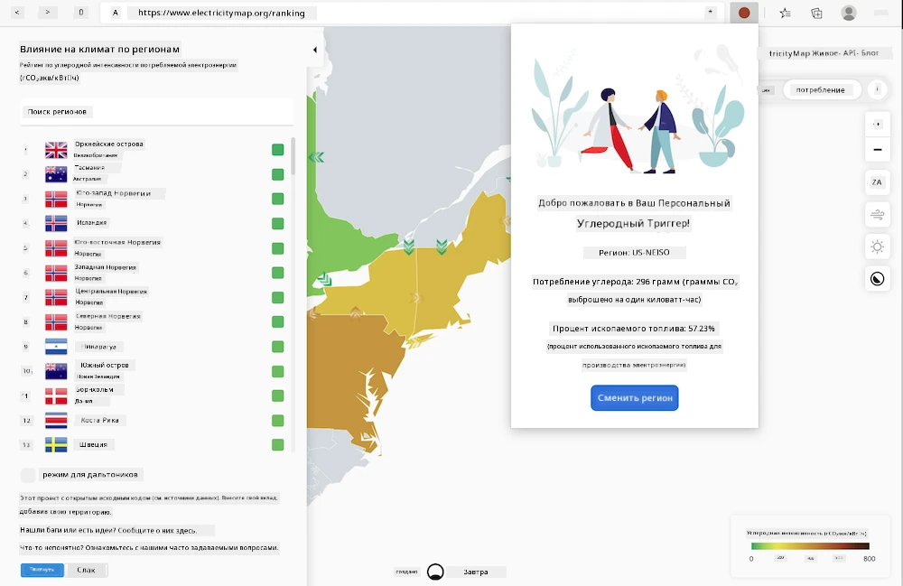
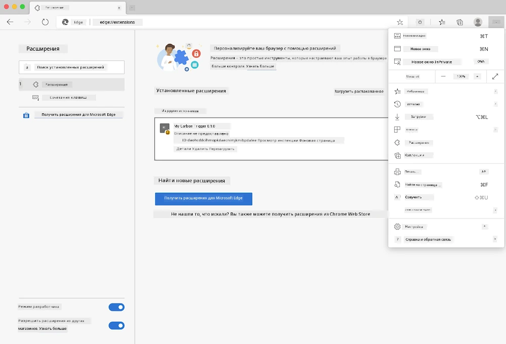

<!--
CO_OP_TRANSLATOR_METADATA:
{
  "original_hash": "dd58ae1b7707034f055718c1b68bc8de",
  "translation_date": "2025-08-25T23:53:27+00:00",
  "source_file": "5-browser-extension/solution/translation/README.hi.md",
  "language_code": "ru"
}
-->
# Карбон Триггер: Браузерное расширение с готовым кодом

Используя API CO2 Signal от tmrow для отслеживания потребления электроэнергии, создается браузерное расширение, которое напоминает вам о том, насколько интенсивно используется электроэнергия в вашем регионе. Использование этого расширения поможет вам принимать решения о своих действиях на основе этой информации.



## Начало работы

Вам нужно установить [npm](https://npmjs.com). Скачайте копию этого кода в папку на вашем компьютере.

Установите все необходимые пакеты:

```
npm install
```

Соберите расширение с помощью Webpack:

```
npm run build
```

Чтобы установить в Edge, используйте меню с "тремя точками" в правом верхнем углу браузера, чтобы найти панель расширений. Оттуда выберите "Загрузить распакованное" для добавления нового расширения. В появившемся окне откройте папку "dist", и расширение будет загружено. Для его использования вам понадобится API-ключ CO2 Signal ([получите его по электронной почте здесь](https://www.co2snal.com/) — введите свой email в поле на этой странице) и [код вашего региона](http://api.electricitymap.org/v3/zones) с [карты электроэнергии](https://www.electricitymap.org/map) (например, для Бостона я использую 'US-NEISO').



После того как API-ключ и регион будут введены в интерфейсе расширения, цветная точка в панели браузера должна измениться, отражая использование энергии в вашем регионе. Это даст вам индикатор, какие энергоемкие действия будут подходящими в данный момент. Концепция этой "точечной" системы была вдохновлена расширением [Energy Lollipop](https://energylollipop.com/) для отслеживания выбросов в Калифорнии.

**Отказ от ответственности**:  
Этот документ был переведен с использованием сервиса автоматического перевода [Co-op Translator](https://github.com/Azure/co-op-translator). Хотя мы стремимся к точности, пожалуйста, учитывайте, что автоматические переводы могут содержать ошибки или неточности. Оригинальный документ на его родном языке следует считать авторитетным источником. Для получения критически важной информации рекомендуется профессиональный перевод человеком. Мы не несем ответственности за любые недоразумения или неправильные интерпретации, возникшие в результате использования данного перевода.