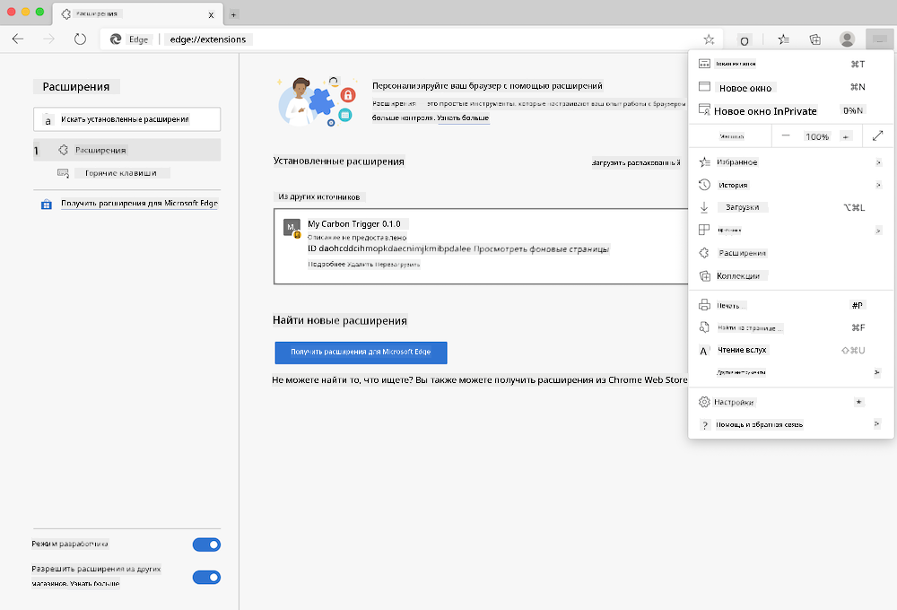

<!--
CO_OP_TRANSLATOR_METADATA:
{
  "original_hash": "9a6b22a2eff0f499b66236be973b24ad",
  "translation_date": "2025-08-25T23:58:49+00:00",
  "source_file": "5-browser-extension/solution/translation/README.it.md",
  "language_code": "ru"
}
-->
# Расширение для браузера Carbon Trigger: код для начала работы

Мы будем использовать API Signal CO2 от tmrow для мониторинга потребления электроэнергии, чтобы создать расширение для браузера, которое будет напоминать вам о том, насколько интенсивно используется электричество в вашем регионе. Использование этого специального расширения поможет оценить свои действия, основываясь на предоставленной информации.


## Начало работы

Убедитесь, что [npm](https://npmjs.com) установлен. Скачайте копию этого кода в папку на вашем компьютере.

Установите все необходимые пакеты:

```
npm install
```

Создайте расширение с помощью webpack:

```
npm run build
```

Чтобы установить расширение в Edge, используйте меню "три точки" в правом верхнем углу браузера, чтобы найти панель "Расширения". Если режим разработчика еще не активирован, включите его (внизу слева). Выберите "Загрузить распакованное", чтобы добавить новое расширение. В появившемся окне выберите папку "dist", и расширение будет загружено. Для использования вам понадобится API-ключ для CO2 Signal (его можно [получить по электронной почте](https://www.co2signal.com/) — введите свой адрес электронной почты в поле на этой странице) и [код вашего региона](http://api.electricitymap.org/v3/zones), соответствующий [электрической карте](https://www.electricitymap.org/map) (например, для Бостона — "US-NEISO").



После того как API-ключ и регион будут введены в интерфейсе расширения, цветная точка на панели расширения браузера должна измениться, отражая уровень потребления энергии в регионе. Она также предоставит рекомендации о том, какие действия с высоким энергопотреблением будут наиболее подходящими в данный момент. Концепция этой системы "точек" была вдохновлена [расширением Energy Lollipop](https://energylollipop.com/) для мониторинга выбросов в Калифорнии.

**Отказ от ответственности**:  
Этот документ был переведен с помощью сервиса автоматического перевода [Co-op Translator](https://github.com/Azure/co-op-translator). Несмотря на наши усилия обеспечить точность, автоматические переводы могут содержать ошибки или неточности. Оригинальный документ на его родном языке следует считать авторитетным источником. Для получения критически важной информации рекомендуется профессиональный перевод человеком. Мы не несем ответственности за любые недоразумения или неправильные интерпретации, возникающие в результате использования данного перевода.