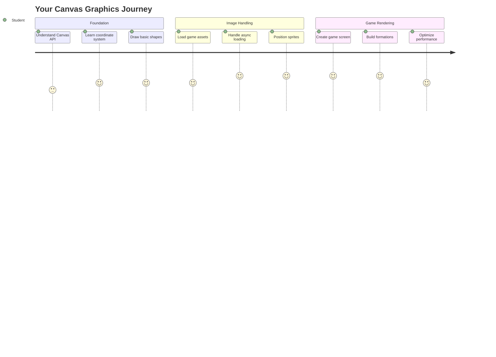
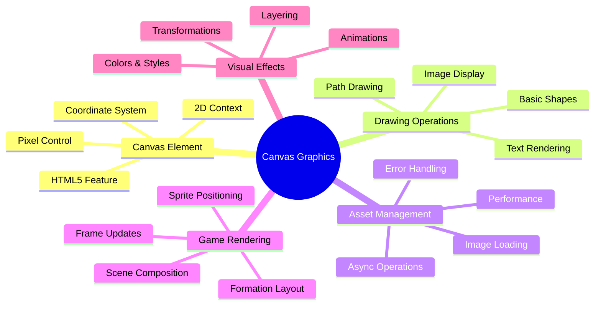
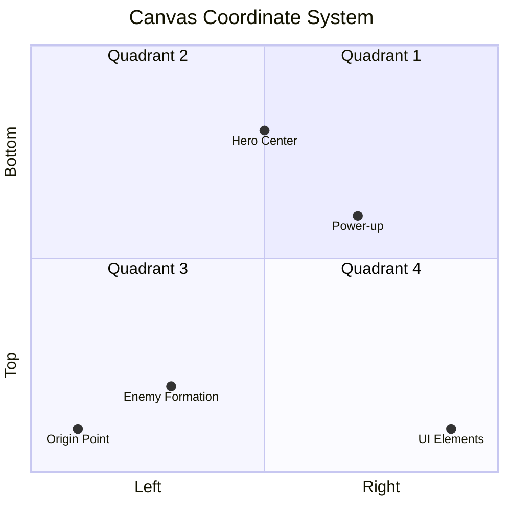
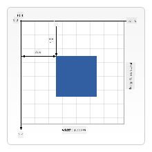
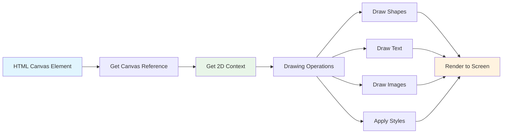
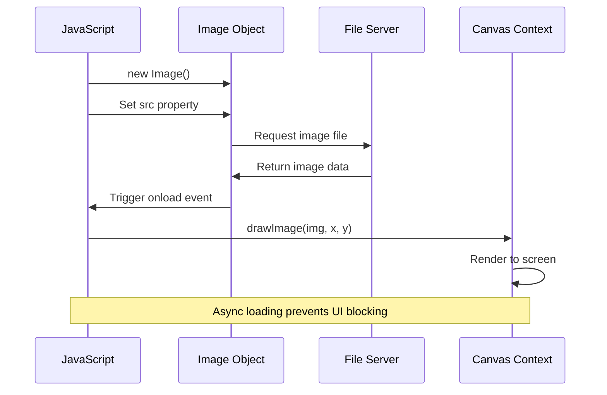
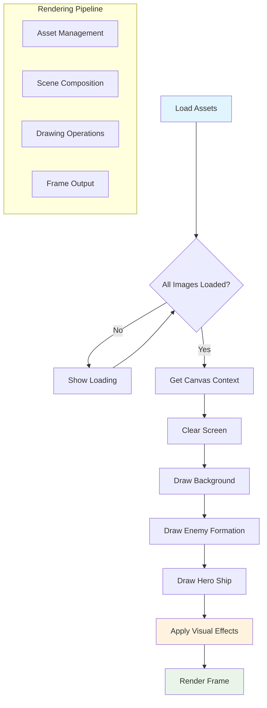
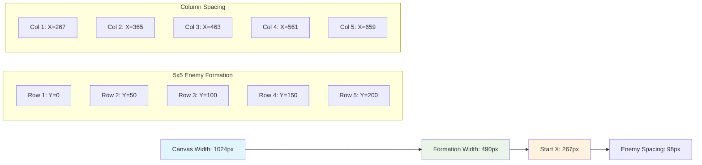
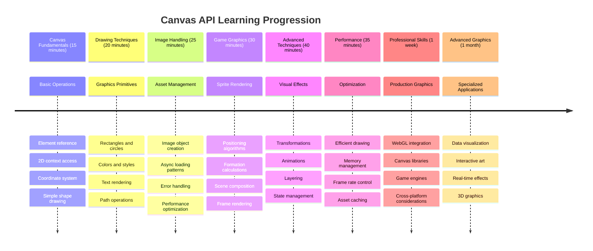

<!--
CO_OP_TRANSLATOR_METADATA:
{
  "original_hash": "7994743c5b21fdcceb36307916ef249a",
  "translation_date": "2025-11-03T23:28:56+00:00",
  "source_file": "6-space-game/2-drawing-to-canvas/README.md",
  "language_code": "ru"
}
-->
# Создание космической игры, часть 2: Рисуем героя и монстров на холсте



API Canvas — одна из самых мощных функций веб-разработки для создания динамической, интерактивной графики прямо в вашем браузере. В этом уроке мы превратим пустой HTML-элемент `<canvas>` в игровой мир, наполненный героями и монстрами. Представьте холст как цифровую доску для рисования, где код становится визуальным.

Мы продолжаем то, что вы изучили в предыдущем уроке, и теперь углубимся в визуальные аспекты. Вы узнаете, как загружать и отображать игровые спрайты, точно позиционировать элементы и создавать визуальную основу для вашей космической игры. Это мост между статическими веб-страницами и динамическими, интерактивными впечатлениями.

К концу этого урока у вас будет полноценная игровая сцена с правильно расположенным кораблем героя и формациями врагов, готовыми к бою. Вы поймете, как современные игры отображают графику в браузерах, и приобретете навыки для создания собственных интерактивных визуальных проектов. Давайте изучим графику на холсте и оживим вашу космическую игру!



## Предварительный тест

[Предварительный тест](https://ff-quizzes.netlify.app/web/quiz/31)

## Холст

Что же такое этот элемент `<canvas>`? Это решение HTML5 для создания динамической графики и анимации в веб-браузерах. В отличие от обычных изображений или видео, которые статичны, холст дает вам контроль над каждым пикселем на экране. Это делает его идеальным для игр, визуализации данных и интерактивного искусства. Представьте его как программируемую поверхность для рисования, где JavaScript становится вашей кистью.

По умолчанию элемент canvas выглядит как пустой, прозрачный прямоугольник на вашей странице. Но именно в этом заключается его потенциал! Его настоящая сила проявляется, когда вы используете JavaScript для рисования фигур, загрузки изображений, создания анимации и реакции на взаимодействие пользователя. Это похоже на то, как пионеры компьютерной графики в Bell Labs в 1960-х годах программировали каждый пиксель для создания первых цифровых анимаций.

✅ Прочитайте [больше о Canvas API](https://developer.mozilla.org/docs/Web/API/Canvas_API) на MDN.

Вот как он обычно объявляется в теле страницы:

```html
<canvas id="myCanvas" width="200" height="100"></canvas>
```

**Что делает этот код:**
- **Устанавливает** атрибут `id`, чтобы вы могли ссылаться на этот конкретный элемент canvas в JavaScript
- **Определяет** ширину в пикселях для управления горизонтальным размером холста
- **Устанавливает** высоту в пикселях для определения вертикальных размеров холста

## Рисуем простую геометрию

Теперь, когда вы знаете, что такое элемент canvas, давайте изучим, как на нем рисовать! Холст использует систему координат, которая может показаться знакомой из уроков математики, но есть один важный нюанс, специфичный для компьютерной графики.

Холст использует декартову систему координат с осью x (горизонтальной) и осью y (вертикальной) для позиционирования всего, что вы рисуете. Но вот ключевое отличие: в отличие от системы координат из математики, точка начала `(0,0)` находится в верхнем левом углу, при этом значения x увеличиваются при движении вправо, а значения y увеличиваются при движении вниз. Этот подход восходит к ранним компьютерным дисплеям, где электронные лучи сканировали сверху вниз, делая верхний левый угол естественной точкой начала.




> Изображение с [MDN](https://developer.mozilla.org/docs/Web/API/Canvas_API/Tutorial/Drawing_shapes)

Чтобы рисовать на элементе canvas, вы будете следовать тому же трехэтапному процессу, который составляет основу всей графики на холсте. Как только вы сделаете это несколько раз, это станет привычным:



1. **Получите ссылку** на ваш элемент Canvas из DOM (так же, как и на любой другой HTML-элемент)
2. **Получите контекст рендеринга 2D** – он предоставляет все методы рисования
3. **Начните рисовать!** Используйте встроенные методы контекста для создания графики

Вот как это выглядит в коде:

```javascript
// Step 1: Get the canvas element
const canvas = document.getElementById("myCanvas");

// Step 2: Get the 2D rendering context
const ctx = canvas.getContext("2d");

// Step 3: Set fill color and draw a rectangle
ctx.fillStyle = 'red';
ctx.fillRect(0, 0, 200, 200); // x, y, width, height
```

**Давайте разберем это шаг за шагом:**
- Мы **получаем** наш элемент canvas, используя его ID, и сохраняем его в переменной
- Мы **получаем** контекст рендеринга 2D – это наш набор инструментов с методами рисования
- Мы **указываем** холсту, что хотим заполнить элементы красным цветом, используя свойство `fillStyle`
- Мы **рисуем** прямоугольник, начиная с верхнего левого угла (0,0), шириной и высотой 200 пикселей

✅ API Canvas в основном сосредоточен на 2D-формах, но вы также можете рисовать 3D-элементы на веб-сайте; для этого можно использовать [WebGL API](https://developer.mozilla.org/docs/Web/API/WebGL_API).

С помощью Canvas API можно рисовать множество вещей, например:

- **Геометрические фигуры**, мы уже показали, как нарисовать прямоугольник, но можно нарисовать гораздо больше.
- **Текст**, вы можете нарисовать текст с любым шрифтом и цветом, который пожелаете.
- **Изображения**, вы можете нарисовать изображение на основе графического файла, например .jpg или .png.

✅ Попробуйте! Вы знаете, как нарисовать прямоугольник, сможете ли вы нарисовать круг на странице? Посмотрите на некоторые интересные рисунки на Canvas на CodePen. Вот [особенно впечатляющий пример](https://codepen.io/dissimulate/pen/KrAwx).

### 🔄 **Педагогическая проверка**
**Понимание основ холста**: Перед переходом к загрузке изображений убедитесь, что вы можете:
- ✅ Объяснить, чем система координат холста отличается от математической системы координат
- ✅ Понять трехэтапный процесс операций рисования на холсте
- ✅ Определить, что предоставляет контекст рендеринга 2D
- ✅ Описать, как `fillStyle` и `fillRect` работают вместе

**Быстрый тест**: Как бы вы нарисовали синий круг в позиции (100, 50) с радиусом 25?
```javascript
ctx.fillStyle = 'blue';
ctx.beginPath();
ctx.arc(100, 50, 25, 0, 2 * Math.PI);
ctx.fill();
```

**Методы рисования на холсте, которые вы теперь знаете**:
- **fillRect()**: Рисует заполненные прямоугольники
- **fillStyle**: Устанавливает цвета и узоры
- **beginPath()**: Начинает новые пути рисования
- **arc()**: Создает круги и кривые

## Загрузка и рисование графических ресурсов

Рисование базовых фигур полезно для начала, но большинству игр нужны настоящие изображения! Спрайты, фоны и текстуры придают играм визуальную привлекательность. Загрузка и отображение изображений на холсте работает иначе, чем рисование геометрических фигур, но это просто, как только вы поймете процесс.

Нам нужно создать объект `Image`, загрузить наш графический файл (это происходит асинхронно, то есть "в фоне"), а затем нарисовать его на холсте, как только он будет готов. Такой подход гарантирует, что ваши изображения отображаются правильно, не блокируя приложение во время загрузки.



### Базовая загрузка изображений

```javascript
const img = new Image();
img.src = 'path/to/my/image.png';
img.onload = () => {
  // Image loaded and ready to be used
  console.log('Image loaded successfully!');
};
```

**Что происходит в этом коде:**
- Мы **создаем** совершенно новый объект Image для хранения нашего спрайта или текстуры
- Мы **указываем**, какой графический файл загрузить, задавая путь к источнику
- Мы **слушаем** событие загрузки, чтобы точно знать, когда изображение готово к использованию

### Более надежный способ загрузки изображений

Вот более надежный способ обработки загрузки изображений, который часто используют профессиональные разработчики. Мы обернем логику загрузки изображений в функцию на основе Promise – этот подход, популяризированный, когда Promises стали стандартом в ES6, делает ваш код более организованным и позволяет аккуратно обрабатывать ошибки:

```javascript
function loadAsset(path) {
  return new Promise((resolve, reject) => {
    const img = new Image();
    img.src = path;
    img.onload = () => {
      resolve(img);
    };
    img.onerror = () => {
      reject(new Error(`Failed to load image: ${path}`));
    };
  });
}

// Modern usage with async/await
async function initializeGame() {
  try {
    const heroImg = await loadAsset('hero.png');
    const monsterImg = await loadAsset('monster.png');
    // Images are now ready to use
  } catch (error) {
    console.error('Failed to load game assets:', error);
  }
}
```

**Что мы сделали здесь:**
- **Обернули** всю логику загрузки изображений в Promise, чтобы лучше управлять процессом
- **Добавили** обработку ошибок, которая действительно сообщает нам, если что-то пошло не так
- **Использовали** современный синтаксис async/await, потому что он гораздо удобнее для чтения
- **Включили** блоки try/catch для аккуратного управления любыми сбоями загрузки

Как только ваши изображения загружены, их рисование на холсте становится довольно простым:

```javascript
async function renderGameScreen() {
  try {
    // Load game assets
    const heroImg = await loadAsset('hero.png');
    const monsterImg = await loadAsset('monster.png');

    // Get canvas and context
    const canvas = document.getElementById("myCanvas");
    const ctx = canvas.getContext("2d");

    // Draw images to specific positions
    ctx.drawImage(heroImg, canvas.width / 2, canvas.height / 2);
    ctx.drawImage(monsterImg, 0, 0);
  } catch (error) {
    console.error('Failed to render game screen:', error);
  }
}
```

**Давайте разберем это шаг за шагом:**
- Мы **загружаем** изображения героя и монстра в фоне, используя await
- Мы **получаем** наш элемент canvas и необходимый контекст рендеринга 2D
- Мы **позиционируем** изображение героя прямо в центре, используя небольшую математику координат
- Мы **размещаем** изображение монстра в верхнем левом углу, чтобы начать формирование врагов
- Мы **обрабатываем** любые ошибки, которые могут возникнуть во время загрузки или рендеринга



## Теперь пора начинать создавать вашу игру

Теперь мы объединим все вместе, чтобы создать визуальную основу вашей космической игры. У вас есть прочное понимание основ холста и методов загрузки изображений, поэтому этот практический раздел проведет вас через создание полного игрового экрана с правильно расположенными спрайтами.

### Что нужно создать

Вы создадите веб-страницу с элементом Canvas. Она должна отображать черный экран размером `1024*768`. Мы предоставили вам два изображения:

- Корабль героя

   

- 5×5 монстров

   

### Рекомендуемые шаги для начала разработки

Найдите стартовые файлы, которые были созданы для вас в папке `your-work`. Структура вашего проекта должна содержать:

```bash
your-work/
├── assets/
│   ├── enemyShip.png
│   └── player.png
├── index.html
├── app.js
└── package.json
```

**Что у вас есть:**
- **Игровые спрайты** находятся в папке `assets/`, чтобы все было организовано
- **Ваш основной HTML-файл** настраивает элемент canvas и готовит все к работе
- **Файл JavaScript**, где вы напишете весь код для рендеринга игры
- **Файл package.json**, который настраивает сервер разработки, чтобы вы могли тестировать локально

Откройте эту папку в Visual Studio Code, чтобы начать разработку. Вам понадобится локальная среда разработки с установленными Visual Studio Code, NPM и Node.js. Если у вас не настроен `npm` на компьютере, [вот как его установить](https://www.npmjs.com/get-npm).

Запустите сервер разработки, перейдя в папку `your-work`:

```bash
cd your-work
npm start
```

**Эта команда делает несколько крутых вещей:**
- **Запускает** локальный сервер на `http://localhost:5000`, чтобы вы могли тестировать свою игру
- **Обслуживает** все ваши файлы правильно, чтобы браузер мог их корректно загружать
- **Следит** за изменениями в ваших файлах, чтобы вы могли работать без перебоев
- **Предоставляет** профессиональную среду разработки для тестирования всего

> 💡 **Примечание**: Ваш браузер сначала покажет пустую страницу – это нормально! По мере добавления кода обновляйте браузер, чтобы увидеть изменения. Такой итеративный подход к разработке похож на то, как NASA создавала компьютер навигации Apollo – тестируя каждый компонент перед интеграцией в большую систему.

### Добавьте код

Добавьте необходимый код в `your-work/app.js`, чтобы выполнить следующие задачи:

1. **Нарисуйте холст с черным фоном**
   > 💡 **Как это сделать**: Найдите TODO в `/app.js` и добавьте всего две строки. Установите `ctx.fillStyle` в черный цвет, затем используйте `ctx.fillRect()`, начиная с (0,0) с размерами вашего холста. Легко!

2. **Загрузите игровые текстуры**
   > 💡 **Как это сделать**: Используйте `await loadAsset()` для загрузки изображений игрока и врага. Сохраните их в переменных, чтобы использовать позже. Помните – они не появятся, пока вы их не нарисуете!

3. **Нарисуйте корабль героя в центре нижней части экрана**
   > 💡 **Как это сделать**: Используйте `ctx.drawImage()` для позиционирования героя. Для координаты x попробуйте `canvas.width / 2 - 45`, чтобы центрировать его, а для координаты y используйте `canvas.height - canvas.height / 4`, чтобы разместить его в нижней части.

4. **Нарисуйте формацию врагов 5×5**
   > 💡 **Как это сделать**: Найдите функцию `createEnemies` и настройте вложенный цикл. Вам нужно будет немного поработать с математикой для расчета расстояний и позиций, но не переживайте – я покажу вам, как это сделать!

Сначала установите константы для правильной компоновки формации врагов:

```javascript
const ENEMY_TOTAL = 5;
const ENEMY_SPACING = 98;
const FORMATION_WIDTH = ENEMY_TOTAL * ENEMY_SPACING;
const START_X = (canvas.width - FORMATION_WIDTH) / 2;
const STOP_X = START_X + FORMATION_WIDTH;
```

**Давайте разберем, что делают эти константы:**
- Мы **устанавливаем** 5 врагов в строке и столбце (красивая сетка 5×5)
- Мы **определяем**, сколько пространства оставить между врагами, чтобы они не выглядели тесно
- Мы **вычисляем**, насколько широкой будет вся формация
- Мы **определяем**, где начать и закончить, чтобы формация выглядела центрированной



Затем создайте вложенные циклы для рисования формации врагов:

```javascript
for (let x = START_X; x < STOP_X; x += ENEMY_SPACING) {
  for (let y = 0; y < 50 * 5; y += 50) {
    ctx.drawImage(enemyImg, x, y);
  }
}
```

**Что делает этот вложенный цикл:**
- Внешний цикл **перемещается** слева направо по нашей формации
- Внутренний цикл **проходит** сверху вниз, создавая аккуратные строки
- Мы **рисуем** каждый спрайт врага в точных координатах x,y, которые мы рассчитали
- Все остается **равномерно расположенным**, чтобы выглядеть профессионально и организованно

### 🔄 **Педагогическая проверка**
**Мастерство рендеринга игры**: Убедитесь, что вы понимаете всю систему рендеринга:
- ✅ Как асинхронная загрузка изображений предотвращает блокировку интерфейса при запуске игры?
- ✅ Почему мы рассчитываем позиции формации врагов с помощью констант, а не жестко задаем их?
- ✅ Какую роль играет контекст рендеринга 2D в операциях рисования?
- ✅ Как вложенные циклы создают организованные формации спрайтов?

**Соображения производительности**: Ваша игра теперь демонстрирует:
- **Эффективную загрузку ресурсов**: Управление изображениями на основе Promise
- **Организованный рендеринг**: Структурированные операции рисования
- **Математическое позиционирование**: Вычисленное размещение спрайтов
- **Обработку ошибок**: Аккуратное управление сбоями

**Концепции визуального программирования**: Вы изучили:
- **Системы координат**: Перевод математических расчетов в экранные позиции
- **Управление спрайтами**: Загрузка и отображение графики для игры
- **Алгоритмы формирования**: Математические шаблоны для организованных макетов
- **Асинхронные операции**: Современный JavaScript для плавного пользовательского опыта

## Результат

Готовый результат должен выглядеть так:


## Решение

Попробуйте сначала решить задачу самостоятельно, но если застрянете, взгляните на [решение](../../../../6-space-game/2-drawing-to-canvas/solution/app.js)

---

## Вызов GitHub Copilot Agent 🚀

Используйте режим Agent, чтобы выполнить следующий вызов:

**Описание:** Улучшите холст вашей космической игры, добавив визуальные эффекты и интерактивные элементы, используя изученные вами техники API Canvas.

**Задание:** Создайте новый файл `enhanced-canvas.html` с холстом, который отображает анимированные звезды на фоне, пульсирующую шкалу здоровья для корабля героя и вражеские корабли, которые медленно движутся вниз. Включите JavaScript-код, который рисует мерцающие звезды с использованием случайных позиций и прозрачности, реализует шкалу здоровья, меняющую цвет в зависимости от уровня здоровья (зеленый > желтый > красный), и анимирует вражеские корабли, чтобы они двигались вниз с разной скоростью.

Узнайте больше о [режиме Agent](https://code.visualstudio.com/blogs/2025/02/24/introducing-copilot-agent-mode) здесь.

## 🚀 Вызов

Вы изучили рисование с помощью 2D-ориентированного API Canvas; взгляните на [WebGL API](https://developer.mozilla.org/docs/Web/API/WebGL_API) и попробуйте нарисовать 3D-объект.

## Викторина после лекции

[Викторина после лекции](https://ff-quizzes.netlify.app/web/quiz/32)

## Обзор и самостоятельное изучение

Узнайте больше о Canvas API, [прочитав о нем](https://developer.mozilla.org/docs/Web/API/Canvas_API).

### ⚡ **Что можно сделать за следующие 5 минут**
- [ ] Откройте консоль браузера и создайте элемент холста с помощью `document.createElement('canvas')`
- [ ] Попробуйте нарисовать прямоугольник с помощью метода `fillRect()` на контексте холста
- [ ] Поэкспериментируйте с разными цветами, используя свойство `fillStyle`
- [ ] Нарисуйте простой круг с помощью метода `arc()`

### 🎯 **Что можно достичь за час**
- [ ] Пройдите викторину после урока и разберитесь в основах холста
- [ ] Создайте приложение для рисования на холсте с множеством форм и цветов
- [ ] Реализуйте загрузку изображений и рендеринг спрайтов для вашей игры
- [ ] Постройте простую анимацию, которая перемещает объекты по холсту
- [ ] Попрактикуйтесь в трансформациях холста, таких как масштабирование, вращение и перенос

### 📅 **Ваш недельный путь изучения холста**
- [ ] Завершите космическую игру с улучшенной графикой и анимацией спрайтов
- [ ] Освойте продвинутые техники работы с холстом, такие как градиенты, узоры и композитинг
- [ ] Создайте интерактивные визуализации с использованием холста для представления данных
- [ ] Узнайте о техниках оптимизации холста для плавной производительности
- [ ] Постройте приложение для рисования или живописи с различными инструментами
- [ ] Исследуйте творческое программирование и генеративное искусство с использованием холста

### 🌟 **Ваш месячный путь к мастерству графики**
- [ ] Создайте сложные визуальные приложения с использованием Canvas 2D и WebGL
- [ ] Изучите концепции программирования графики и основы шейдеров
- [ ] Внесите вклад в открытые графические библиотеки и инструменты визуализации
- [ ] Освойте оптимизацию производительности для графически интенсивных приложений
- [ ] Создайте образовательный контент о программировании холста и компьютерной графике
- [ ] Станьте экспертом в программировании графики, помогая другим создавать визуальные проекты

## 🎯 Ваш график освоения графики на холсте



### 🛠️ Резюме вашего инструментария для работы с графикой на холсте

После завершения этого урока вы теперь обладаете:
- **Мастерством API Canvas**: Полное понимание программирования 2D-графики
- **Математикой координат**: Точные алгоритмы позиционирования и макета
- **Управлением ресурсами**: Профессиональная загрузка изображений и обработка ошибок
- **Конвейером рендеринга**: Структурированный подход к композиции сцены
- **Игровой графикой**: Позиционирование спрайтов и расчеты формирования
- **Асинхронным программированием**: Современные шаблоны JavaScript для плавной производительности
- **Визуальным программированием**: Перевод математических концепций в экранную графику

**Применение в реальном мире**: Ваши навыки работы с Canvas напрямую применимы к:
- **Визуализации данных**: Графики, диаграммы и интерактивные панели
- **Разработке игр**: 2D-игры, симуляции и интерактивные приложения
- **Цифровому искусству**: Творческое программирование и проекты генеративного искусства
- **UI/UX дизайну**: Пользовательские графики и интерактивные элементы
- **Образовательному программному обеспечению**: Инструменты визуального обучения и симуляции
- **Веб-приложениям**: Динамическая графика и визуализация в реальном времени

**Приобретенные профессиональные навыки**: Теперь вы можете:
- **Создавать** пользовательские графические решения без внешних библиотек
- **Оптимизировать** производительность рендеринга для плавного пользовательского опыта
- **Отлаживать** сложные визуальные проблемы с помощью инструментов разработчика браузера
- **Проектировать** масштабируемые графические системы, используя математические принципы
- **Интегрировать** графику Canvas с современными веб-фреймворками

**Методы API Canvas, которые вы освоили**:
- **Управление элементами**: getElementById, getContext
- **Операции рисования**: fillRect, drawImage, fillStyle
- **Загрузка ресурсов**: Объекты Image, шаблоны Promise
- **Математическое позиционирование**: Вычисления координат, алгоритмы формирования

**Следующий уровень**: Вы готовы добавить анимацию, взаимодействие с пользователем, обнаружение столкновений или изучить WebGL для 3D-графики!

🌟 **Достижение разблокировано**: Вы создали полноценную систему рендеринга игры, используя основные техники API Canvas!

## Задание

[Попробуйте Canvas API](assignment.md)

---

**Отказ от ответственности**:  
Этот документ был переведен с использованием сервиса автоматического перевода [Co-op Translator](https://github.com/Azure/co-op-translator). Несмотря на наши усилия обеспечить точность, автоматические переводы могут содержать ошибки или неточности. Оригинальный документ на его родном языке следует считать авторитетным источником. Для получения критически важной информации рекомендуется профессиональный перевод человеком. Мы не несем ответственности за любые недоразумения или неправильные интерпретации, возникшие в результате использования данного перевода.