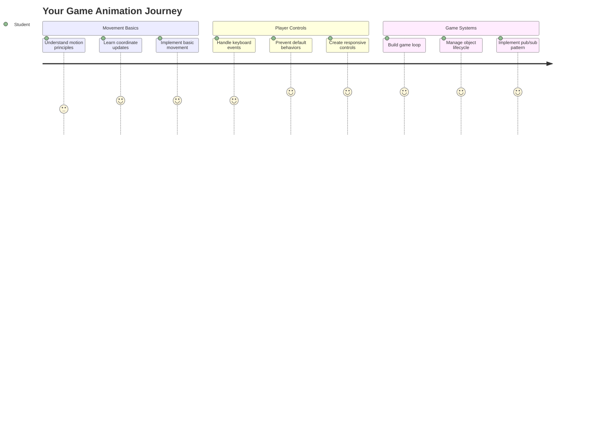
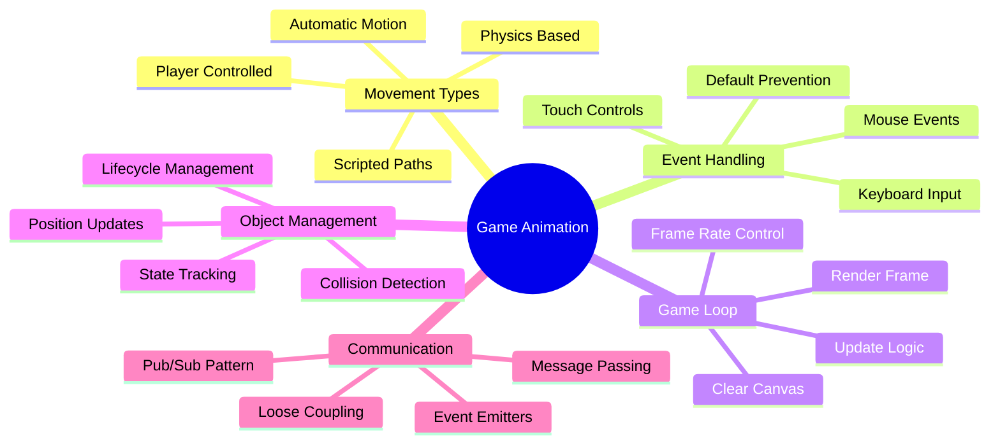
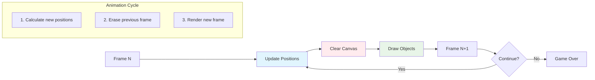
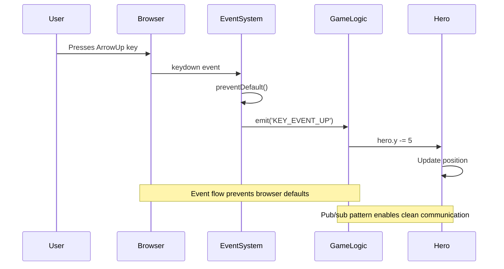
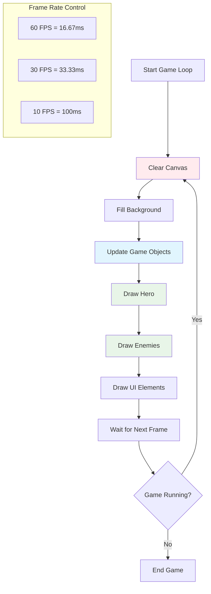
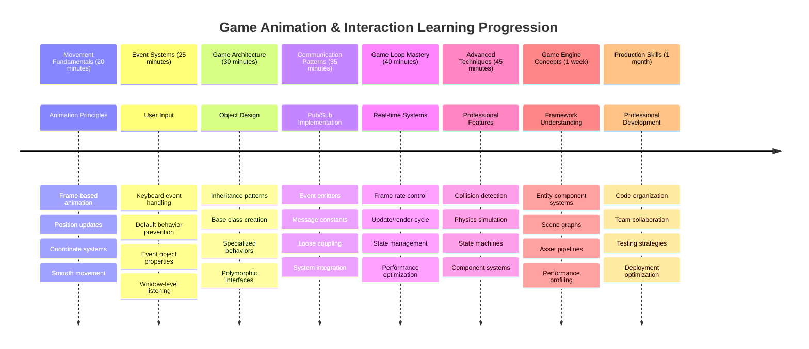

# Создание космической игры, часть 3: добавление движения



Подумайте о ваших любимых играх – что делает их увлекательными? Это не только красивая графика, но и то, как всё движется и реагирует на ваши действия. Сейчас ваша космическая игра похожа на красивую картину, но мы собираемся добавить движение, которое оживит её.

Когда инженеры NASA программировали компьютер навигации для миссий "Аполлон", они сталкивались с похожей задачей: как сделать так, чтобы космический корабль реагировал на команды пилота, одновременно автоматически корректируя курс? Принципы, которые мы изучим сегодня, перекликаются с этими концепциями – управление движением игрока в сочетании с автоматическим поведением системы.

В этом уроке вы научитесь заставлять космические корабли скользить по экрану, реагировать на команды игрока и создавать плавные движения. Мы разберём всё на понятные концепции, которые естественно дополняют друг друга.

К концу урока игроки смогут управлять своим кораблём-героем на экране, пока вражеские корабли патрулируют сверху. Но что ещё важнее, вы поймёте основные принципы, которые лежат в основе систем движения в играх.



## Предварительный тест

[Предварительный тест](https://ff-quizzes.netlify.app/web/quiz/33)

## Понимание движения в играх

Игры оживают, когда объекты начинают двигаться, и существует два основных способа, как это происходит:

- **Движение, управляемое игроком**: Когда вы нажимаете клавишу или кликаете мышкой, что-то движется. Это прямое соединение между вами и игровым миром.
- **Автоматическое движение**: Когда игра сама решает, что двигать – например, те вражеские корабли, которые должны патрулировать экран, независимо от ваших действий.

Заставить объекты двигаться на экране компьютера проще, чем вы думаете. Помните координаты x и y из уроков математики? Именно с этим мы будем работать. Когда Галилео наблюдал спутники Юпитера в 1610 году, он фактически делал то же самое – фиксировал позиции во времени, чтобы понять закономерности движения.

Движение объектов на экране похоже на создание анимации в блокноте – нужно следовать этим трём простым шагам:



1. **Обновить позицию** – Изменить, где должен находиться объект (например, переместить его на 5 пикселей вправо)
2. **Стереть старый кадр** – Очистить экран, чтобы не видеть "призрачные следы"
3. **Нарисовать новый кадр** – Поместить объект в его новое место

Делайте это достаточно быстро, и вуаля! У вас плавное движение, которое кажется естественным для игроков.

Вот как это может выглядеть в коде:

```javascript
// Set the hero's location
hero.x += 5;
// Clear the rectangle that hosts the hero
ctx.clearRect(0, 0, canvas.width, canvas.height);
// Redraw the game background and hero
ctx.fillRect(0, 0, canvas.width, canvas.height);
ctx.fillStyle = "black";
ctx.drawImage(heroImg, hero.x, hero.y);
```

**Что делает этот код:**
- **Обновляет** x-координату героя на 5 пикселей для горизонтального движения
- **Очищает** всю область холста, чтобы удалить предыдущий кадр
- **Заполняет** холст чёрным цветом фона
- **Перерисовывает** изображение героя в его новой позиции

✅ Можете ли вы придумать причину, почему перерисовка героя много раз в секунду может привести к затратам производительности? Прочитайте о [альтернативах этому подходу](https://developer.mozilla.org/en-US/docs/Web/API/Canvas_API/Tutorial/Optimizing_canvas).

## Обработка событий клавиатуры

Здесь мы связываем ввод игрока с действиями в игре. Когда кто-то нажимает пробел, чтобы выстрелить лазером, или стрелку, чтобы увернуться от астероида, ваша игра должна обнаружить и отреагировать на этот ввод.

События клавиатуры происходят на уровне окна, то есть весь ваш браузер слушает эти нажатия клавиш. Щелчки мыши, с другой стороны, могут быть привязаны к конкретным элементам (например, к кнопке). Для нашей космической игры мы сосредоточимся на управлении с клавиатуры, так как это придаёт игре классическое аркадное ощущение.

Это напоминает, как телеграфисты в XIX веке должны были переводить ввод азбуки Морзе в осмысленные сообщения – мы делаем что-то похожее, переводя нажатия клавиш в команды игры.

Чтобы обработать событие, нужно использовать метод `addEventListener()` окна и передать ему два параметра. Первый параметр – это название события, например, `keyup`. Второй параметр – это функция, которая должна быть вызвана в результате произошедшего события.

Вот пример:

```javascript
window.addEventListener('keyup', (evt) => {
  // evt.key = string representation of the key
  if (evt.key === 'ArrowUp') {
    // do something
  }
});
```

**Разбор происходящего:**
- **Слушает** события клавиатуры на всём окне
- **Фиксирует** объект события, который содержит информацию о нажатой клавише
- **Проверяет**, совпадает ли нажатая клавиша с определённой (в данном случае стрелка вверх)
- **Выполняет** код, если условие выполнено

Для событий клавиш есть два свойства объекта события, которые можно использовать, чтобы узнать, какая клавиша была нажата:

- `key` – строковое представление нажатой клавиши, например `'ArrowUp'`
- `keyCode` – числовое представление, например `37`, соответствует `ArrowLeft`

✅ Манипуляция событиями клавиш полезна не только в разработке игр. Какие ещё применения этой техники вы можете придумать?



### Особые клавиши: обратите внимание!

Некоторые клавиши имеют встроенные функции браузера, которые могут мешать вашей игре. Стрелки прокручивают страницу, а пробел перемещает вниз – это поведение вам не нужно, когда кто-то пытается управлять своим космическим кораблём.

Мы можем предотвратить эти стандартные действия и позволить игре обрабатывать ввод самостоятельно. Это похоже на то, как ранние программисты компьютеров должны были переопределять системные прерывания, чтобы создавать пользовательские функции – мы делаем это на уровне браузера. Вот как:

```javascript
const onKeyDown = function (e) {
  console.log(e.keyCode);
  switch (e.keyCode) {
    case 37:
    case 39:
    case 38:
    case 40: // Arrow keys
    case 32:
      e.preventDefault();
      break; // Space
    default:
      break; // do not block other keys
  }
};

window.addEventListener('keydown', onKeyDown);
```

**Разбор кода предотвращения:**
- **Проверяет** определённые коды клавиш, которые могут вызвать нежелательное поведение браузера
- **Предотвращает** стандартное действие браузера для стрелок и пробела
- **Позволяет** другим клавишам работать нормально
- **Использует** `e.preventDefault()`, чтобы остановить встроенное поведение браузера

### 🔄 **Педагогическая проверка**
**Понимание обработки событий**: Перед переходом к автоматическому движению убедитесь, что вы можете:
- ✅ Объяснить разницу между событиями `keydown` и `keyup`
- ✅ Понять, почему мы предотвращаем стандартное поведение браузера
- ✅ Описать, как слушатели событий связывают ввод пользователя с логикой игры
- ✅ Определить, какие клавиши могут мешать управлению игрой

**Быстрый тест**: Что произойдёт, если вы не предотвратите стандартное поведение для стрелок?
*Ответ: Браузер будет прокручивать страницу, мешая движению в игре*

**Архитектура системы событий**: Теперь вы понимаете:
- **Прослушивание на уровне окна**: Захват событий на уровне браузера
- **Свойства объекта события**: строки `key` против чисел `keyCode`
- **Предотвращение стандартного поведения**: Остановка нежелательных действий браузера
- **Условная логика**: Реакция на определённые комбинации клавиш

## Движение, вызванное игрой

Теперь поговорим об объектах, которые движутся без ввода игрока. Подумайте о вражеских кораблях, кружащих по экрану, пулях, летящих по прямой, или облаках, плывущих на заднем плане. Это автономное движение делает игровой мир живым, даже если никто не трогает управление.

Мы используем встроенные таймеры JavaScript, чтобы обновлять позиции через регулярные интервалы. Этот принцип похож на то, как работают маятниковые часы – регулярный механизм, запускающий последовательные действия. Вот как это просто:

```javascript
const id = setInterval(() => {
  // Move the enemy on the y axis
  enemy.y += 10;
}, 100);
```

**Что делает этот код движения:**
- **Создаёт** таймер, который запускается каждые 100 миллисекунд
- **Обновляет** y-координату врага на 10 пикселей каждый раз
- **Сохраняет** идентификатор интервала, чтобы можно было остановить его позже, если потребуется
- **Перемещает** врага вниз по экрану автоматически

## Игровой цикл

Вот концепция, которая связывает всё вместе – игровой цикл. Если ваша игра была бы фильмом, игровой цикл был бы кинопроектором, показывающим кадр за кадром так быстро, что всё кажется плавно движущимся.

У каждой игры есть такой цикл, работающий за кулисами. Это функция, которая обновляет все игровые объекты, перерисовывает экран и повторяет этот процесс непрерывно. Она отслеживает вашего героя, всех врагов, любые летящие лазеры – всё состояние игры.

Эта концепция напоминает, как ранние аниматоры, такие как Уолт Дисней, должны были перерисовывать персонажей кадр за кадром, чтобы создать иллюзию движения. Мы делаем то же самое, только с помощью кода, а не карандашей.

Вот как обычно выглядит игровой цикл, выраженный в коде:



```javascript
const gameLoopId = setInterval(() => {
  function gameLoop() {
    ctx.clearRect(0, 0, canvas.width, canvas.height);
    ctx.fillStyle = "black";
    ctx.fillRect(0, 0, canvas.width, canvas.height);
    drawHero();
    drawEnemies();
    drawStaticObjects();
  }
  gameLoop();
}, 200);
```

**Понимание структуры игрового цикла:**
- **Очищает** весь холст, чтобы удалить предыдущий кадр
- **Заполняет** фон сплошным цветом
- **Рисует** все игровые объекты в их текущих позициях
- **Повторяет** этот процесс каждые 200 миллисекунд для создания плавной анимации
- **Управляет** частотой кадров, контролируя временные интервалы

## Продолжение создания космической игры

Теперь мы добавим движение в статичную сцену, которую вы создали ранее. Мы превратим её из скриншота в интерактивный опыт. Мы будем работать шаг за шагом, чтобы каждый элемент дополнял предыдущий.

Возьмите код, на котором мы остановились в предыдущем уроке (или начните с кода в папке [Part II- starter](../../../../6-space-game/3-moving-elements-around/your-work), если вам нужен новый старт).

**Вот что мы создаём сегодня:**
- **Управление героем**: Стрелки будут управлять вашим космическим кораблём на экране
- **Движение врагов**: Эти инопланетные корабли начнут своё наступление

Давайте начнём реализацию этих функций.

## Рекомендуемые шаги

Найдите файлы, которые были созданы для вас в подпапке `your-work`. Она должна содержать следующее:

```bash
-| assets
  -| enemyShip.png
  -| player.png
-| index.html
-| app.js
-| package.json
```

Начните ваш проект в папке `your-work`, введя:

```bash
cd your-work
npm start
```

**Что делает эта команда:**
- **Переходит** в директорию вашего проекта
- **Запускает** HTTP-сервер по адресу `http://localhost:5000`
- **Обслуживает** файлы вашей игры, чтобы вы могли протестировать их в браузере

Вышеуказанное запустит HTTP-сервер по адресу `http://localhost:5000`. Откройте браузер и введите этот адрес, сейчас он должен отображать героя и всех врагов; пока ничего не движется – но скоро!

### Добавьте код

1. **Добавьте отдельные объекты** для `hero`, `enemy` и `game object`, они должны иметь свойства `x` и `y`. (Помните раздел о [Наследовании или композиции](../README.md)).

   *ПОДСКАЗКА* `game object` должен быть тем, у которого есть `x` и `y`, а также возможность рисовать себя на холсте.

   > **Совет**: Начните с добавления нового класса `GameObject` с его конструктором, как показано ниже, а затем нарисуйте его на холсте:

    ```javascript
    class GameObject {
      constructor(x, y) {
        this.x = x;
        this.y = y;
        this.dead = false;
        this.type = "";
        this.width = 0;
        this.height = 0;
        this.img = undefined;
      }
    
      draw(ctx) {
        ctx.drawImage(this.img, this.x, this.y, this.width, this.height);
      }
    }
    ```

    **Понимание базового класса:**
    - **Определяет** общие свойства, которые есть у всех игровых объектов (позиция, размер, изображение)
    - **Включает** флаг `dead`, чтобы отслеживать, должен ли объект быть удалён
    - **Предоставляет** метод `draw()`, который отображает объект на холсте
    - **Устанавливает** значения по умолчанию для всех свойств, которые могут быть переопределены дочерними классами

    ```mermaid
    classDiagram
        class GameObject {
            +x: number
            +y: number
            +dead: boolean
            +type: string
            +width: number
            +height: number
            +img: Image
            +draw(ctx)
        }
        
        class Hero {
            +speed: number
            +type: "Hero"
            +width: 98
            +height: 75
        }
        
        class Enemy {
            +type: "Enemy"
            +width: 98
            +height: 50
            +setInterval()
        }
        
        GameObject <|-- Hero
        GameObject <|-- Enemy
        
        class EventEmitter {
            +listeners: object
            +on(message, listener)
            +emit(message, payload)
        }
    ```

    Теперь расширьте этот `GameObject`, чтобы создать `Hero` и `Enemy`:
    
    ```javascript
    class Hero extends GameObject {
      constructor(x, y) {
        super(x, y);
        this.width = 98;
        this.height = 75;
        this.type = "Hero";
        this.speed = 5;
      }
    }
    ```

    ```javascript
    class Enemy extends GameObject {
      constructor(x, y) {
        super(x, y);
        this.width = 98;
        this.height = 50;
        this.type = "Enemy";
        const id = setInterval(() => {
          if (this.y < canvas.height - this.height) {
            this.y += 5;
          } else {
            console.log('Stopped at', this.y);
            clearInterval(id);
          }
        }, 300);
      }
    }
    ```

    **Основные концепции в этих классах:**
    - **Наследует** от `GameObject` с помощью ключевого слова `extends`
    - **Вызывает** родительский конструктор с `super(x, y)`
    - **Устанавливает** конкретные размеры и свойства для каждого типа объекта
    - **Реализует** автоматическое движение для врагов с использованием `setInterval()`

2. **Добавьте обработчики событий клавиш**, чтобы управлять движением героя (перемещение вверх/вниз, влево/вправо)

   *ПОМНИТЕ*, это декартова система, верхний левый угол – это `0,0`. Также не забудьте добавить код для остановки *стандартного поведения*.

   > **Совет**: Создайте вашу функцию `onKeyDown` и прикрепите её к окну:

   ```javascript
   const onKeyDown = function (e) {
     console.log(e.keyCode);
     // Add the code from the lesson above to stop default behavior
     switch (e.keyCode) {
       case 37:
       case 39:
       case 38:
       case 40: // Arrow keys
       case 32:
         e.preventDefault();
         break; // Space
       default:
         break; // do not block other keys
     }
   };

   window.addEventListener("keydown", onKeyDown);
   ```
    
   **Что делает этот обработчик событий:**
   - **Слушает** события нажатия клавиш на всём окне
   - **Регистрирует** код клавиши, чтобы помочь вам отладить, какие клавиши нажимаются
   - **Предотвращает** стандартное поведение браузера для стрелок и пробела
   - **Позволяет** другим клавишам работать нормально
   
   Проверьте консоль вашего браузера на этом этапе и наблюдайте за регистрацией нажатий клавиш. 

3. **Реализуйте** [паттерн Pub-Sub](../README.md), это поможет сохранить ваш код чистым, пока вы будете следовать оставшимся частям.

   Паттерн Publish-Subscribe помогает организовать ваш код, разделяя обнаружение событий и их обработку. Это делает ваш код более модульным и удобным для поддержки.

   Чтобы выполнить этот последний шаг, вы можете:

   1. **Добавить слушатель событий** на окно:

       ```javascript
       window.addEventListener("keyup", (evt) => {
         if (evt.key === "ArrowUp") {
           eventEmitter.emit(Messages.KEY_EVENT_UP);
         } else if (evt.key === "ArrowDown") {
           eventEmitter.emit(Messages.KEY_EVENT_DOWN);
         } else if (evt.key === "ArrowLeft") {
           eventEmitter.emit(Messages.KEY_EVENT_LEFT);
         } else if (evt.key === "ArrowRight") {
           eventEmitter.emit(Messages.KEY_EVENT_RIGHT);
         }
       });
       ```

   **Что делает эта система событий:**
   - **Обнаруживает** ввод с клавиатуры и преобразует его в пользовательские игровые события
   - **Разделяет** обнаружение ввода и игровую логику
   - **Упрощает** изменение управления в будущем без влияния на игровой код
   - **Позволяет** нескольким системам реагировать на один и тот же ввод

   ```mermaid
   flowchart TD
       A["Keyboard Input"] --> B["Window Event Listener"]
       B --> C["Event Emitter"]
       C --> D["KEY_EVENT_UP"]
       C --> E["KEY_EVENT_DOWN"]
       C --> F["KEY_EVENT_LEFT"]
       C --> G["KEY_EVENT_RIGHT"]
       
       D --> H["Hero Movement"]
       D --> I["Sound System"]
       D --> J["Visual Effects"]
       
       E --> H
       F --> H
       G --> H
       
       style A fill:#e1f5fe
       style C fill:#e8f5e8
       style H fill:#fff3e0
   ```

   2. **Создайте класс EventEmitter**, чтобы публиковать и подписываться на сообщения:

       ```javascript
       class EventEmitter {
         constructor() {
           this.listeners = {};
         }
       
         on(message, listener) {
           if (!this.listeners[message]) {
             this.listeners[message] = [];
           }
           this.listeners[message].push(listener);
         }
       
   3. **Добавьте константы** и настройте EventEmitter:

       ```javascript
       const Messages = {
         KEY_EVENT_UP: "KEY_EVENT_UP",
         KEY_EVENT_DOWN: "KEY_EVENT_DOWN",
         KEY_EVENT_LEFT: "KEY_EVENT_LEFT",
         KEY_EVENT_RIGHT: "KEY_EVENT_RIGHT",
       };
       
       let heroImg, 
           enemyImg, 
           laserImg,
           canvas, ctx, 
           gameObjects = [], 
           hero, 
           eventEmitter = new EventEmitter();
       ```

   **Понимание настройки:**
   - **Определяет** константы сообщений, чтобы избежать опечаток и упростить рефакторинг
   - **Объявляет** переменные для изображений, контекста холста и состояния игры
   - **Создаёт** глобальный EventEmitter для системы Pub-Sub
   - **Инициализирует** массив для хранения всех игровых объектов

   4. **Инициализация игры**

       ```javascript
       function initGame() {
         gameObjects = [];
         createEnemies();
         createHero();
       
         eventEmitter.on(Messages.KEY_EVENT_UP, () => {
           hero.y -= 5;
         });
       
         eventEmitter.on(Messages.KEY_EVENT_DOWN, () => {
           hero.y += 5;
         });
       
         eventEmitter.on(Messages.KEY_EVENT_LEFT, () => {
           hero.x -= 5;
         });
       
4. **Настройка игрового цикла**

   Перепишите функцию `window.onload`, чтобы инициализировать игру и настроить игровой цикл с хорошим интервалом. Также добавьте лазерный луч:

    ```javascript
    window.onload = async () => {
      canvas = document.getElementById("canvas");
      ctx = canvas.getContext("2d");
      heroImg = await loadTexture("assets/player.png");
      enemyImg = await loadTexture("assets/enemyShip.png");
      laserImg = await loadTexture("assets/laserRed.png");
    
      initGame();
      const gameLoopId = setInterval(() => {
        ctx.clearRect(0, 0, canvas.width, canvas.height);
        ctx.fillStyle = "black";
        ctx.fillRect(0, 0, canvas.width, canvas.height);
        drawGameObjects(ctx);
      }, 100);
    };
    ```

   **Понимание настройки игры:**
   - **Ожидает**, пока страница полностью загрузится, прежде чем начать
   - **Получает** элемент canvas и его 2D-контекст рендеринга
   - **Загружает** все графические ресурсы асинхронно с помощью `await`
   - **Запускает** игровой цикл с интервалом 100 мс (10 FPS)
   - **Очищает** и перерисовывает весь экран каждый кадр

5. **Добавьте код** для перемещения врагов через определенные интервалы

    Перепишите функцию `createEnemies()`, чтобы создать врагов и добавить их в новый класс gameObjects:

    ```javascript
    function createEnemies() {
      const MONSTER_TOTAL = 5;
      const MONSTER_WIDTH = MONSTER_TOTAL * 98;
      const START_X = (canvas.width - MONSTER_WIDTH) / 2;
      const STOP_X = START_X + MONSTER_WIDTH;
    
      for (let x = START_X; x < STOP_X; x += 98) {
        for (let y = 0; y < 50 * 5; y += 50) {
          const enemy = new Enemy(x, y);
          enemy.img = enemyImg;
          gameObjects.push(enemy);
        }
      }
    }
    ```

    **Что делает создание врагов:**
    - **Вычисляет** позиции для центрирования врагов на экране
    - **Создает** сетку врагов с помощью вложенных циклов
    - **Назначает** изображение врага каждому объекту врага
    - **Добавляет** каждого врага в глобальный массив игровых объектов
    
    и добавьте функцию `createHero()`, чтобы выполнить аналогичный процесс для героя.
    
    ```javascript
    function createHero() {
      hero = new Hero(
        canvas.width / 2 - 45,
        canvas.height - canvas.height / 4
      );
      hero.img = heroImg;
      gameObjects.push(hero);
    }
    ```

    **Что делает создание героя:**
    - **Располагает** героя в нижней центральной части экрана
    - **Назначает** изображение героя объекту героя
    - **Добавляет** героя в массив игровых объектов для рендеринга

    и, наконец, добавьте функцию `drawGameObjects()` для начала отрисовки:

    ```javascript
    function drawGameObjects(ctx) {
      gameObjects.forEach(go => go.draw(ctx));
    }
    ```

    **Понимание функции отрисовки:**
    - **Итерирует** через все игровые объекты в массиве
    - **Вызывает** метод `draw()` для каждого объекта
    - **Передает** контекст canvas, чтобы объекты могли сами себя отрисовать

    ### 🔄 **Педагогическая проверка**
    **Полное понимание игровой системы**: Убедитесь, что вы освоили всю архитектуру:
    - ✅ Как наследование позволяет герою и врагам делить общие свойства GameObject?
    - ✅ Почему паттерн pub/sub делает ваш код более поддерживаемым?
    - ✅ Какую роль играет игровой цикл в создании плавной анимации?
    - ✅ Как слушатели событий связывают пользовательский ввод с поведением игровых объектов?

    **Интеграция системы**: Ваша игра теперь демонстрирует:
    - **Объектно-ориентированный дизайн**: Базовые классы с специализированным наследованием
    - **Архитектура, основанная на событиях**: Паттерн pub/sub для слабой связанности
    - **Анимационная структура**: Игровой цикл с последовательными обновлениями кадров
    - **Обработка ввода**: События клавиатуры с предотвращением стандартного поведения
    - **Управление ресурсами**: Загрузка изображений и рендеринг спрайтов

    **Профессиональные паттерны**: Вы реализовали:
    - **Разделение обязанностей**: Разделение ввода, логики и рендеринга
    - **Полиморфизм**: Все игровые объекты имеют общий интерфейс отрисовки
    - **Передача сообщений**: Чистая коммуникация между компонентами
    - **Управление ресурсами**: Эффективная обработка спрайтов и анимации

    Ваши враги должны начать наступление на ваш космический корабль!
      }
    }
    ```
    
    and add a `createHero()` function to do a similar process for the hero.
    
    ```javascript
    function createHero() {
      hero = new Hero(
        canvas.width / 2 - 45,
        canvas.height - canvas.height / 4
      );
      hero.img = heroImg;
      gameObjects.push(hero);
    }
    ```

    и, наконец, добавьте функцию `drawGameObjects()` для начала отрисовки:

    ```javascript
    function drawGameObjects(ctx) {
      gameObjects.forEach(go => go.draw(ctx));
    }
    ```

    Ваши враги должны начать наступление на ваш космический корабль!

---

## Вызов GitHub Copilot Agent 🚀

Вот вызов, который улучшит вашу игру: добавление границ и плавного управления. В настоящее время ваш герой может улететь за пределы экрана, а движение может казаться резким.

**Ваша миссия:** Сделайте управление космическим кораблем более реалистичным, добавив границы экрана и плавное движение. Это похоже на то, как системы управления полетами NASA предотвращают выход космических кораблей за пределы безопасных параметров.

**Что нужно сделать:** Создайте систему, которая удерживает космический корабль героя на экране, и сделайте управление плавным. Когда игроки удерживают стрелку, корабль должен двигаться плавно, а не рывками. Рассмотрите возможность добавления визуальной индикации, когда корабль достигает границ экрана – например, легкий эффект, указывающий на край игровой зоны.

Узнайте больше о [режиме агента](https://code.visualstudio.com/blogs/2025/02/24/introducing-copilot-agent-mode) здесь.

## 🚀 Вызов

Организация кода становится все более важной по мере роста проектов. Вы могли заметить, что ваш файл становится переполненным функциями, переменными и классами, смешанными вместе. Это напоминает, как инженеры, организовывавшие код миссии Apollo, должны были создавать четкие, поддерживаемые системы, над которыми могли работать несколько команд одновременно.

**Ваша миссия:**
Думайте как архитектор программного обеспечения. Как бы вы организовали свой код, чтобы через шесть месяцев вы (или ваш коллега) могли понять, что происходит? Даже если все остается в одном файле, вы можете создать лучшую организацию:

- **Группировка связанных функций** с четкими заголовками комментариев
- **Разделение обязанностей** – отделите игровую логику от рендеринга
- **Использование согласованных имен** для переменных и функций
- **Создание модулей** или пространств имен для организации различных аспектов вашей игры
- **Добавление документации**, объясняющей назначение каждого основного раздела

**Вопросы для размышления:**
- Какие части вашего кода труднее всего понять, когда вы возвращаетесь к ним?
- Как вы могли бы организовать свой код, чтобы другим было легче внести вклад?
- Что произойдет, если вы захотите добавить новые функции, такие как усиления или разные типы врагов?

## Викторина после лекции

[Викторина после лекции](https://ff-quizzes.netlify.app/web/quiz/34)

## Обзор и самостоятельное изучение

Мы создавали все с нуля, что отлично подходит для обучения, но вот небольшой секрет – существуют удивительные JavaScript-фреймворки, которые могут взять на себя большую часть тяжелой работы. Как только вы почувствуете себя комфортно с основами, которые мы рассмотрели, стоит [изучить доступные варианты](https://github.com/collections/javascript-game-engines).

Думайте о фреймворках как о хорошо укомплектованном наборе инструментов, вместо того чтобы создавать каждый инструмент вручную. Они могут решить многие из тех проблем с организацией кода, о которых мы говорили, плюс предложить функции, на разработку которых ушли бы недели.

**Что стоит изучить:**
- Как игровые движки организуют код – вы будете поражены их умными паттернами
- Трюки для повышения производительности, чтобы игры на canvas работали плавно  
- Современные функции JavaScript, которые могут сделать ваш код чище и более поддерживаемым
- Различные подходы к управлению игровыми объектами и их отношениями

## 🎯 Ваш таймлайн освоения анимации в играх



### 🛠️ Резюме вашего набора инструментов для разработки игр

После завершения этого урока вы освоили:
- **Принципы анимации**: Движение на основе кадров и плавные переходы
- **Программирование, основанное на событиях**: Обработка ввода с клавиатуры с правильным управлением событиями
- **Объектно-ориентированный дизайн**: Иерархии наследования и полиморфные интерфейсы
- **Паттерны коммуникации**: Архитектура pub/sub для поддерживаемого кода
- **Архитектура игрового цикла**: Циклы обновления и рендеринга в реальном времени
- **Системы ввода**: Картирование управления пользователем с предотвращением стандартного поведения
- **Управление ресурсами**: Загрузка спрайтов и эффективные техники рендеринга

### ⚡ **Что вы можете сделать за следующие 5 минут**
- [ ] Откройте консоль браузера и попробуйте `addEventListener('keydown', console.log)`, чтобы увидеть события клавиатуры
- [ ] Создайте простой элемент div и перемещайте его с помощью стрелок
- [ ] Экспериментируйте с `setInterval`, чтобы создать непрерывное движение
- [ ] Попробуйте предотвратить стандартное поведение с помощью `event.preventDefault()`

### 🎯 **Что вы можете достичь за этот час**
- [ ] Завершите викторину после урока и поймите программирование, основанное на событиях
- [ ] Постройте движущийся космический корабль героя с полным управлением с клавиатуры
- [ ] Реализуйте плавные паттерны движения врагов
- [ ] Добавьте границы, чтобы предотвратить выход игровых объектов за пределы экрана
- [ ] Создайте базовое обнаружение столкновений между игровыми объектами

### 📅 **Ваш недельный путь освоения анимации**
- [ ] Завершите полную космическую игру с отточенным движением и взаимодействиями
- [ ] Добавьте сложные паттерны движения, такие как кривые, ускорение и физика
- [ ] Реализуйте плавные переходы и функции сглаживания
- [ ] Создайте эффекты частиц и системы визуальной обратной связи
- [ ] Оптимизируйте производительность игры для плавного геймплея на 60 fps
- [ ] Добавьте управление с помощью сенсорного экрана и адаптивный дизайн

### 🌟 **Ваш месячный путь интерактивной разработки**
- [ ] Создайте сложные интерактивные приложения с продвинутыми системами анимации
- [ ] Изучите библиотеки анимации, такие как GSAP, или создайте собственный движок анимации
- [ ] Внесите вклад в проекты разработки игр и анимации с открытым исходным кодом
- [ ] Освойте оптимизацию производительности для графически интенсивных приложений
- [ ] Создайте образовательный контент о разработке игр и анимации
- [ ] Постройте портфолио, демонстрирующее продвинутые навыки интерактивного программирования

**Применение в реальном мире**: Ваши навыки анимации в играх напрямую применимы к:
- **Интерактивным веб-приложениям**: Динамические панели управления и интерфейсы в реальном времени
- **Визуализации данных**: Анимированные графики и интерактивная графика
- **Образовательному программному обеспечению**: Интерактивные симуляции и обучающие инструменты
- **Мобильной разработке**: Игры с сенсорным управлением и обработкой жестов
- **Десктопным приложениям**: Приложения на Electron с плавной анимацией
- **Веб-анимациям**: Библиотеки анимации CSS и JavaScript

**Приобретенные профессиональные навыки**: Теперь вы можете:
- **Проектировать** системы, основанные на событиях, которые масштабируются с увеличением сложности
- **Реализовывать** плавные анимации, используя математические принципы
- **Отлаживать** сложные системы взаимодействия с помощью инструментов разработчика браузера
- **Оптимизировать** производительность игры для различных устройств и браузеров
- **Разрабатывать** поддерживаемые структуры кода, используя проверенные паттерны

**Освоенные концепции разработки игр**:
- **Управление частотой кадров**: Понимание FPS и контроля времени
- **Обработка ввода**: Кроссплатформенные системы клавиатуры и событий
- **Жизненный цикл объектов**: Паттерны создания, обновления и уничтожения
- **Синхронизация состояния**: Поддержание согласованности состояния игры между кадрами
- **Архитектура событий**: Разделенная коммуникация между игровыми системами

**Следующий уровень**: Вы готовы добавить обнаружение столкновений, системы подсчета очков, звуковые эффекты или изучить современные игровые фреймворки, такие как Phaser или Three.js!

🌟 **Достижение разблокировано**: Вы создали полную интерактивную игровую систему с профессиональными архитектурными паттернами!

## Задание

[Комментируйте ваш код](assignment.md)

---

**Отказ от ответственности**:  
Этот документ был переведен с помощью сервиса автоматического перевода [Co-op Translator](https://github.com/Azure/co-op-translator). Хотя мы стремимся к точности, пожалуйста, учитывайте, что автоматические переводы могут содержать ошибки или неточности. Оригинальный документ на его родном языке следует считать авторитетным источником. Для получения критически важной информации рекомендуется профессиональный перевод человеком. Мы не несем ответственности за любые недоразумения или неправильные интерпретации, возникающие в результате использования данного перевода.