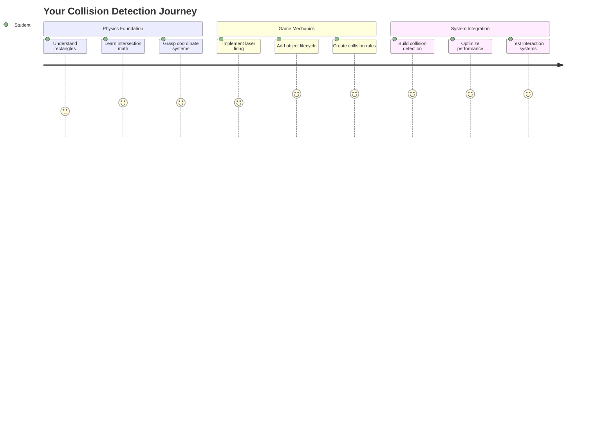
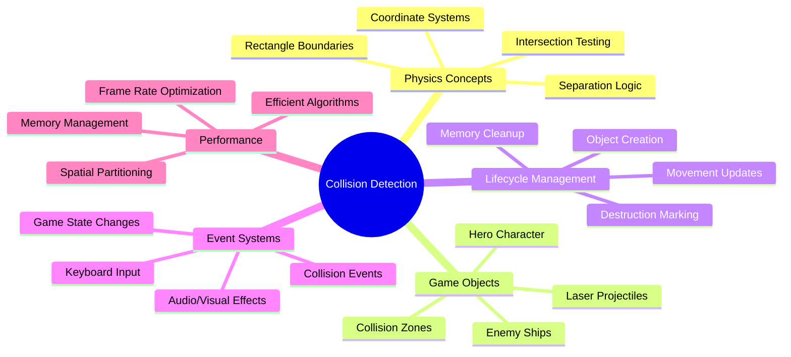
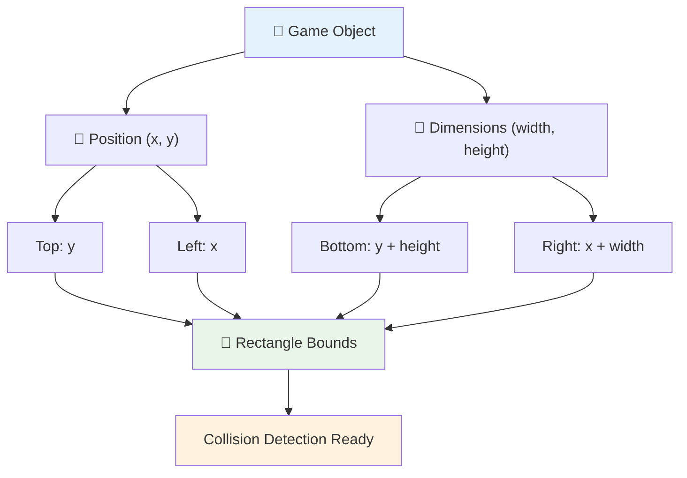
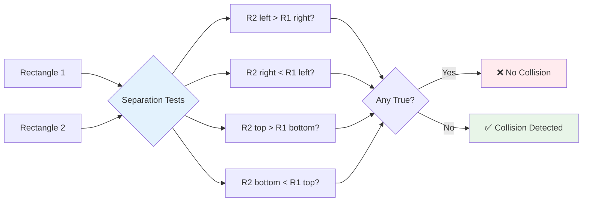
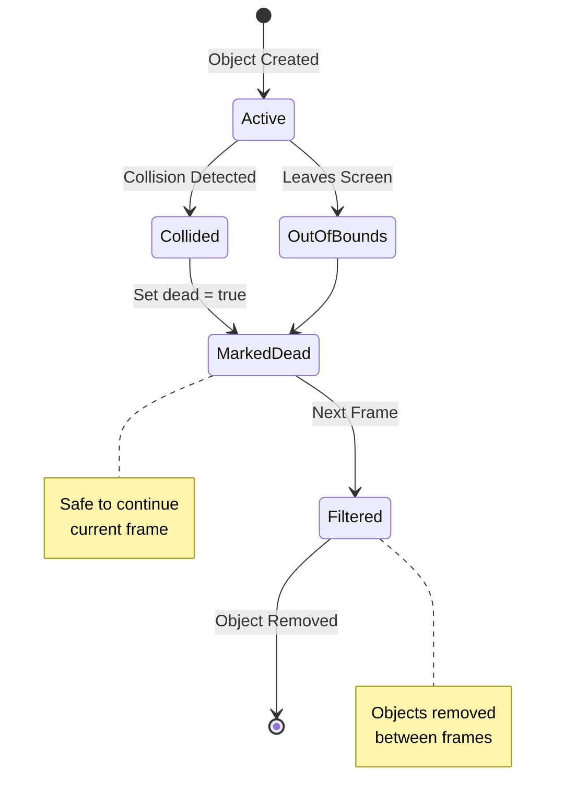
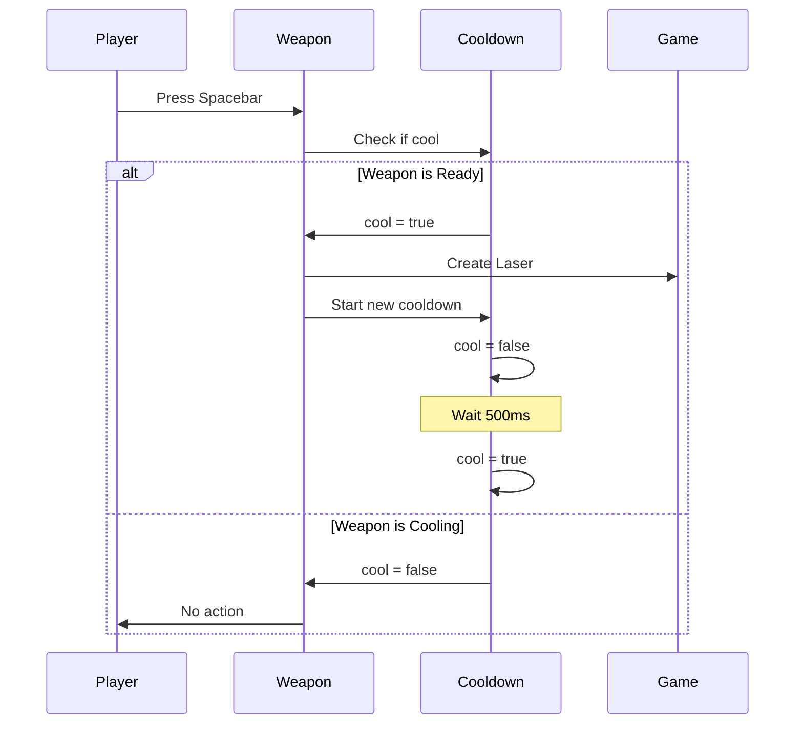
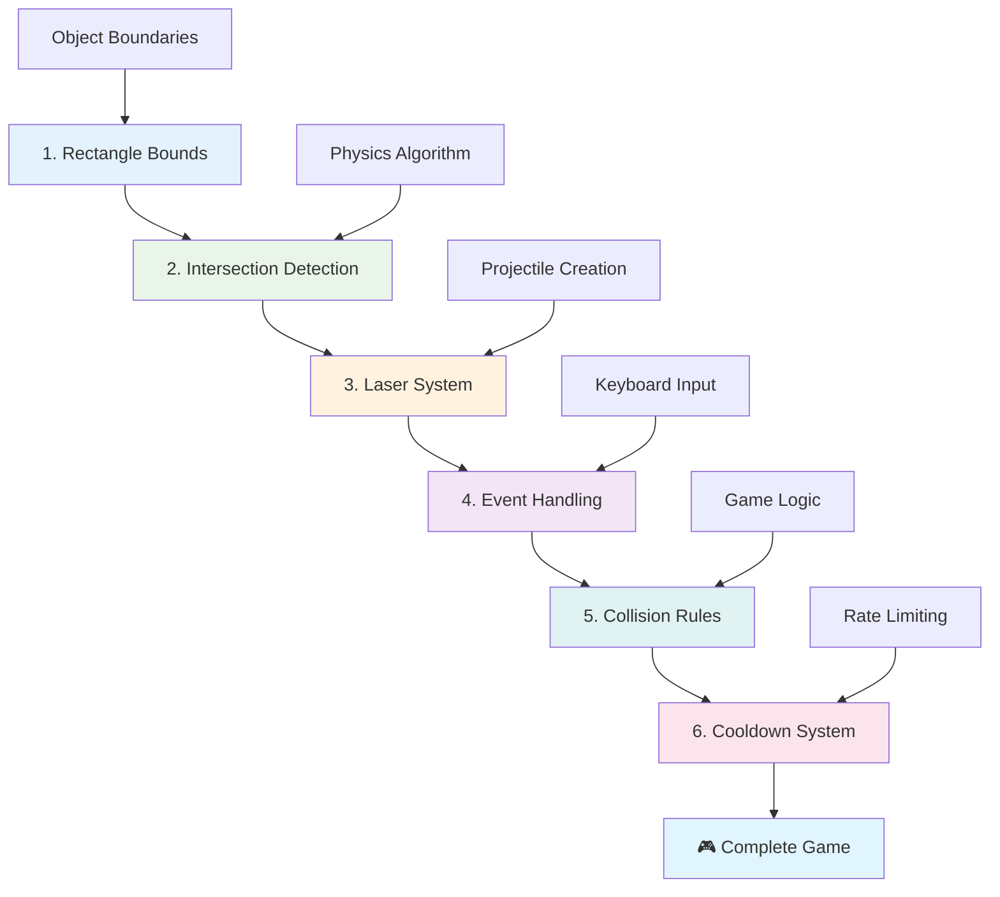
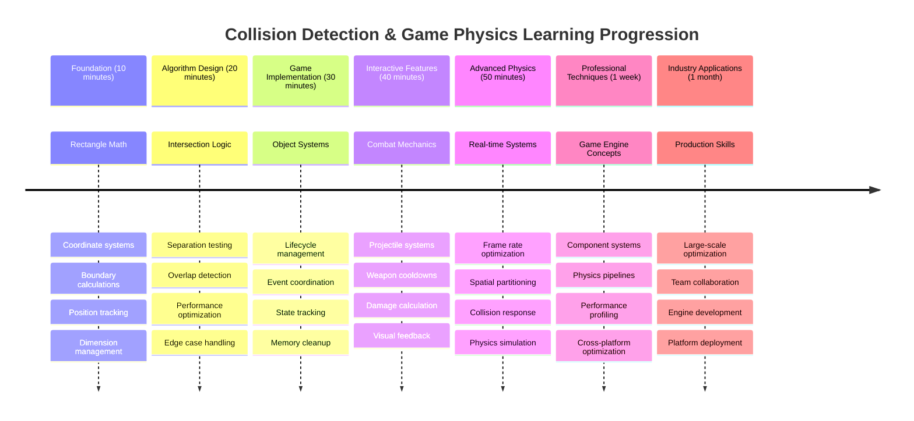

# Создание космической игры, часть 4: добавление лазера и обнаружение столкновений



## Викторина перед лекцией

[Викторина перед лекцией](https://ff-quizzes.netlify.app/web/quiz/35)

Вспомните момент из «Звездных войн», когда протонные торпеды Люка попали в выхлопное отверстие Звезды Смерти. Это точное обнаружение столкновения изменило судьбу галактики! В играх обнаружение столкновений работает так же — оно определяет, когда объекты взаимодействуют, и что происходит дальше.

На этом уроке вы добавите лазерное оружие в свою космическую игру и реализуете систему обнаружения столкновений. Точно так же, как планировщики миссий NASA рассчитывают траектории космических аппаратов, чтобы избежать столкновений с мусором, вы научитесь определять пересечение игровых объектов. Мы разобьем процесс на управляемые этапы, которые будут дополнять друг друга.

К концу урока у вас будет функционирующая система боя, где лазеры уничтожают врагов, а столкновения запускают игровые события. Эти же принципы обнаружения столкновений используются везде — от физических симуляций до интерактивных веб-интерфейсов.



✅ Проведите небольшое исследование о самой первой компьютерной игре, которая была написана. Какова была ее функциональность?

## Обнаружение столкновений

Обнаружение столкновений работает как датчики приближения на лунном модуле «Аполлон» — оно постоянно проверяет расстояния и выдает предупреждения, когда объекты слишком близко. В играх эта система определяет, когда объекты взаимодействуют, и что должно произойти дальше.

Метод, который мы будем использовать, рассматривает каждый игровой объект как прямоугольник, подобно тому, как системы управления воздушным движением используют упрощенные геометрические формы для отслеживания самолетов. Этот метод с прямоугольниками может показаться простым, но он вычислительно эффективен и хорошо работает в большинстве игровых сценариев.

### Представление прямоугольников

Каждому игровому объекту нужны границы координат, как марсоход Pathfinder определял свое местоположение на поверхности Марса. Вот как мы определяем эти границы:



```javascript
rectFromGameObject() {
  return {
    top: this.y,
    left: this.x,
    bottom: this.y + this.height,
    right: this.x + this.width
  }
}
```

**Разберем это:**
- **Верхняя граница**: Это просто место, где ваш объект начинается по вертикали (его позиция y).
- **Левая граница**: Место, где он начинается по горизонтали (его позиция x).
- **Нижняя граница**: Добавьте высоту к позиции y — теперь вы знаете, где он заканчивается!
- **Правая граница**: Добавьте ширину к позиции x — и у вас есть полные границы.

### Алгоритм пересечения

Обнаружение пересечения прямоугольников использует логику, аналогичную той, как космический телескоп Хаббл определяет, перекрываются ли небесные объекты в его поле зрения. Алгоритм проверяет наличие разделения:



```javascript
function intersectRect(r1, r2) {
  return !(r2.left > r1.right ||
    r2.right < r1.left ||
    r2.top > r1.bottom ||
    r2.bottom < r1.top);
}
```

**Тест на разделение работает как системы радаров:**
- Прямоугольник 2 полностью справа от прямоугольника 1?
- Прямоугольник 2 полностью слева от прямоугольника 1?
- Прямоугольник 2 полностью ниже прямоугольника 1?
- Прямоугольник 2 полностью выше прямоугольника 1?

Если ни одно из этих условий не выполняется, прямоугольники должны перекрываться. Этот подход напоминает, как операторы радаров определяют, находятся ли два самолета на безопасном расстоянии.

## Управление жизненным циклом объектов

Когда лазер попадает во врага, оба объекта должны быть удалены из игры. Однако удаление объектов в середине цикла может вызвать сбои — урок, усвоенный на горьком опыте в ранних компьютерных системах, таких как компьютер управления полетом «Аполлон». Вместо этого мы используем подход «пометить для удаления», который безопасно удаляет объекты между кадрами.



Вот как мы помечаем объект для удаления:

```javascript
// Mark object for removal
enemy.dead = true;
```

**Почему этот подход работает:**
- Мы помечаем объект как «мертвый», но не удаляем его сразу.
- Это позволяет текущему игровому кадру завершиться безопасно.
- Нет сбоев из-за попытки использовать что-то, что уже удалено!

Затем фильтруем помеченные объекты перед следующим циклом рендеринга:

```javascript
gameObjects = gameObjects.filter(go => !go.dead);
```

**Что делает это фильтрование:**
- Создает новый список только с «живыми» объектами.
- Удаляет все, что помечено как мертвое.
- Поддерживает плавную работу игры.
- Предотвращает накопление уничтоженных объектов в памяти.

## Реализация механики лазера

Лазерные снаряды в играх работают по тому же принципу, что и фотонные торпеды в «Звездном пути» — это отдельные объекты, которые движутся по прямой линии, пока не попадут во что-то. Каждое нажатие пробела создает новый лазерный объект, который перемещается по экрану.

Чтобы это работало, нам нужно согласовать несколько элементов:

**Основные компоненты для реализации:**
- **Создание** лазерных объектов, которые появляются из позиции героя.
- **Обработка** ввода с клавиатуры для запуска создания лазера.
- **Управление** движением и жизненным циклом лазера.
- **Реализация** визуального представления лазерных снарядов.

## Реализация контроля скорости стрельбы

Неограниченная скорость стрельбы перегрузила бы игровой движок и сделала игру слишком легкой. Реальные системы оружия сталкиваются с аналогичными ограничениями — даже фазеры USS Enterprise нуждаются в перезарядке между выстрелами.

Мы реализуем систему охлаждения, которая предотвращает спам-стрельбу, сохраняя при этом отзывчивое управление:



```javascript
class Cooldown {
  constructor(time) {
    this.cool = false;
    setTimeout(() => {
      this.cool = true;
    }, time);
  }
}

class Weapon {
  constructor() {
    this.cooldown = null;
  }
  
  fire() {
    if (!this.cooldown || this.cooldown.cool) {
      // Create laser projectile
      this.cooldown = new Cooldown(500);
    } else {
      // Weapon is still cooling down
    }
  }
}
```

**Как работает система охлаждения:**
- При создании оружие становится «горячим» (еще не готово к стрельбе).
- После тайм-аута оно становится «холодным» (готово к стрельбе).
- Перед стрельбой мы проверяем: «Оружие холодное?»
- Это предотвращает спам-клики, сохраняя отзывчивость управления.

✅ Обратитесь к уроку 1 из серии космических игр, чтобы напомнить себе о системе охлаждения.

## Создание системы обнаружения столкновений

Вы расширите существующий код своей космической игры, чтобы создать систему обнаружения столкновений. Как автоматизированная система предотвращения столкновений Международной космической станции, ваша игра будет постоянно отслеживать позиции объектов и реагировать на их пересечения.

Начав с кода из предыдущего урока, вы добавите обнаружение столкновений с конкретными правилами, которые управляют взаимодействием объектов.

> 💡 **Полезный совет**: Спрайт лазера уже включен в вашу папку с ресурсами и упомянут в коде, готов к реализации.

### Правила столкновений для реализации

**Игровая механика для добавления:**
1. **Лазер попадает во врага**: Объект врага уничтожается при попадании лазерного снаряда.
2. **Лазер достигает границы экрана**: Лазер удаляется при достижении верхней границы экрана.
3. **Столкновение врага и героя**: Оба объекта уничтожаются при их пересечении.
4. **Враг достигает нижней границы**: Условие окончания игры, если враги достигают нижней границы экрана.

### 🔄 **Педагогическая проверка**
**Основы обнаружения столкновений**: Перед реализацией убедитесь, что вы понимаете:
- ✅ Как границы прямоугольников определяют зоны столкновений.
- ✅ Почему тест на разделение более эффективен, чем расчет пересечения.
- ✅ Важность управления жизненным циклом объектов в игровых циклах.
- ✅ Как системы, основанные на событиях, координируют реакции на столкновения.

**Быстрый тест**: Что произойдет, если вы будете удалять объекты сразу, а не помечать их?
*Ответ: Удаление в середине цикла может вызвать сбои или пропустить объекты при итерации.*

**Понимание физики**: Теперь вы понимаете:
- **Системы координат**: Как положение и размеры создают границы.
- **Логику пересечения**: Математические принципы обнаружения столкновений.
- **Оптимизацию производительности**: Почему эффективные алгоритмы важны в системах реального времени.
- **Управление памятью**: Безопасные шаблоны жизненного цикла объектов для стабильности.

## Настройка среды разработки

Хорошие новости — мы уже подготовили большую часть основы для вас! Все ваши игровые ресурсы и базовая структура находятся в папке `your-work`, готовые для добавления крутых функций столкновений.

### Структура проекта

```bash
-| assets
  -| enemyShip.png
  -| player.png
  -| laserRed.png
-| index.html
-| app.js
-| package.json
```

**Понимание структуры файлов:**
- **Содержит** все изображения спрайтов, необходимые для игровых объектов.
- **Включает** основной HTML-документ и файл JavaScript приложения.
- **Предоставляет** конфигурацию пакета для локального сервера разработки.

### Запуск локального сервера разработки

Перейдите в папку вашего проекта и запустите локальный сервер:

```bash
cd your-work
npm start
```

**Эта последовательность команд:**
- **Меняет** каталог на вашу рабочую папку проекта.
- **Запускает** локальный HTTP-сервер на `http://localhost:5000`.
- **Обслуживает** ваши игровые файлы для тестирования и разработки.
- **Позволяет** живую разработку с автоматической перезагрузкой.

Откройте браузер и перейдите на `http://localhost:5000`, чтобы увидеть текущее состояние вашей игры с отображением героя и врагов на экране.

### Пошаговая реализация

Как систематический подход, который NASA использовала для программирования космического аппарата Voyager, мы будем методично реализовывать обнаружение столкновений, создавая каждый компонент шаг за шагом.



#### 1. Добавьте границы столкновений для прямоугольников

Сначала научим наши игровые объекты описывать свои границы. Добавьте этот метод в класс `GameObject`:

```javascript
rectFromGameObject() {
    return {
      top: this.y,
      left: this.x,
      bottom: this.y + this.height,
      right: this.x + this.width,
    };
  }
```

**Этот метод выполняет:**
- **Создает** объект прямоугольника с точными координатами границ.
- **Вычисляет** нижнюю и правую границы, используя положение и размеры.
- **Возвращает** объект, готовый для алгоритмов обнаружения столкновений.
- **Обеспечивает** стандартизированный интерфейс для всех игровых объектов.

#### 2. Реализуйте обнаружение пересечений

Теперь создадим функцию, которая сможет определить, перекрываются ли два прямоугольника:

```javascript
function intersectRect(r1, r2) {
  return !(
    r2.left > r1.right ||
    r2.right < r1.left ||
    r2.top > r1.bottom ||
    r2.bottom < r1.top
  );
}
```

**Этот алгоритм работает, проверяя:**
- **Тестирует** четыре условия разделения между прямоугольниками.
- **Возвращает** `false`, если выполняется любое условие разделения.
- **Указывает** на столкновение, если разделения нет.
- **Использует** логику отрицания для эффективного тестирования пересечений.

#### 3. Реализуйте систему стрельбы лазером

Теперь начинается самое интересное! Настроим систему стрельбы лазером.

##### Константы сообщений

Сначала определим типы сообщений, чтобы разные части игры могли взаимодействовать:

```javascript
KEY_EVENT_SPACE: "KEY_EVENT_SPACE",
COLLISION_ENEMY_LASER: "COLLISION_ENEMY_LASER",
COLLISION_ENEMY_HERO: "COLLISION_ENEMY_HERO",
```

**Эти константы обеспечивают:**
- **Стандартизацию** названий событий в приложении.
- **Позволяют** согласованное взаимодействие между системами игры.
- **Предотвращают** ошибки в регистрации обработчиков событий.

##### Обработка ввода с клавиатуры

Добавьте обнаружение нажатия пробела в ваш обработчик событий клавиш:

```javascript
} else if(evt.keyCode === 32) {
  eventEmitter.emit(Messages.KEY_EVENT_SPACE);
}
```

**Этот обработчик ввода:**
- **Обнаруживает** нажатия пробела с использованием keyCode 32.
- **Отправляет** стандартизированное сообщение о событии.
- **Позволяет** независимую логику стрельбы.

##### Настройка обработчика событий

Зарегистрируйте поведение стрельбы в функции `initGame()`:

```javascript
eventEmitter.on(Messages.KEY_EVENT_SPACE, () => {
 if (hero.canFire()) {
   hero.fire();
 }
});
```

**Этот обработчик событий:**
- **Реагирует** на события нажатия пробела.
- **Проверяет** статус охлаждения стрельбы.
- **Запускает** создание лазера, если это возможно.

Добавьте обработку столкновений для взаимодействий лазера и врага:

```javascript
eventEmitter.on(Messages.COLLISION_ENEMY_LASER, (_, { first, second }) => {
  first.dead = true;
  second.dead = true;
});
```

**Этот обработчик столкновений:**
- **Получает** данные о столкновении с обоими объектами.
- **Помечает** оба объекта для удаления.
- **Обеспечивает** правильную очистку после столкновения.

#### 4. Создайте класс Laser

Реализуйте лазерный снаряд, который движется вверх и управляет своим жизненным циклом:

```javascript
class Laser extends GameObject {
  constructor(x, y) {
    super(x, y);
    this.width = 9;
    this.height = 33;
    this.type = 'Laser';
    this.img = laserImg;
    
    let id = setInterval(() => {
      if (this.y > 0) {
        this.y -= 15;
      } else {
        this.dead = true;
        clearInterval(id);
      }
    }, 100);
  }
}
```

**Эта реализация класса:**
- **Расширяет** GameObject для наследования базовой функциональности.
- **Устанавливает** подходящие размеры для спрайта лазера.
- **Создает** автоматическое движение вверх с использованием `setInterval()`.
- **Обрабатывает** самоуничтожение при достижении верхней границы экрана.
- **Управляет** своим временем анимации и очисткой.

#### 5. Реализуйте систему обнаружения столкновений

Создайте комплексную функцию обнаружения столкновений:

```javascript
function updateGameObjects() {
  const enemies = gameObjects.filter(go => go.type === 'Enemy');
  const lasers = gameObjects.filter(go => go.type === "Laser");
  
  // Test laser-enemy collisions
  lasers.forEach((laser) => {
    enemies.forEach((enemy) => {
      if (intersectRect(laser.rectFromGameObject(), enemy.rectFromGameObject())) {
        eventEmitter.emit(Messages.COLLISION_ENEMY_LASER, {
          first: laser,
          second: enemy,
        });
      }
    });
  });

  // Remove destroyed objects
  gameObjects = gameObjects.filter(go => !go.dead);
}
```

**Эта система столкновений:**
- **Фильтрует** игровые объекты по типу для эффективного тестирования.
- **Проверяет** каждый лазер на пересечение с каждым врагом.
- **Отправляет** события столкновений при обнаружении пересечений.
- **Очищает** уничтоженные объекты после обработки столкновений.

> ⚠️ **Важно**: Добавьте `updateGameObjects()` в основной игровой цикл в `window.onload`, чтобы включить обнаружение столкновений.

#### 6. Добавьте систему охлаждения в класс Hero

Улучшите класс Hero, добавив механику стрельбы и ограничение скорости:

```javascript
class Hero extends GameObject {
  constructor(x, y) {
    super(x, y);
    this.width = 99;
    this.height = 75;
    this.type = "Hero";
    this.speed = { x: 0, y: 0 };
    this.cooldown = 0;
  }
  
  fire() {
    gameObjects.push(new Laser(this.x + 45, this.y - 10));
    this.cooldown = 500;

    let id = setInterval(() => {
      if (this.cooldown > 0) {
        this.cooldown -= 100;
      } else {
        clearInterval(id);
      }
    }, 200);
  }
  
  canFire() {
    return this.cooldown === 0;
  }
}
```

**Понимание улучшенного класса Hero:**
- **Инициализирует** таймер охлаждения на нуле (готов к стрельбе).
- **Создает** лазерные объекты, расположенные над кораблем героя.
- **Устанавливает** период охлаждения для предотвращения быстрой стрельбы.
- **Уменьшает** таймер охлаждения с помощью обновлений на основе интервала.
- **Предоставляет** проверку статуса стрельбы через метод `canFire()`.

### 🔄 **Педагогическая проверка**
**Полное понимание системы**: Убедитесь, что вы освоили систему обнаружения столкновений:
- ✅ Как границы прямоугольников позволяют эффективно обнаруживать столкновения?
- ✅ Почему управление жизненным циклом объектов критично для стабильности игры?
- ✅ Как система охлаждения предотвращает проблемы с производительностью?
- ✅ Какую роль играет архитектура, основанная на событиях, в обработке столкновений?

**Интеграция системы**: Ваша система обнаружения столкновений демонстрирует:
- **Математическую точность**: Алгоритмы пересечения прямоугольников.
- **Оптимизацию производительности**: Эффективные шаблоны тестирования столкновений.
- **Управление памятью**: Безопасное создание и удаление объектов.
- **Координацию событий**: Независимое взаимодействие систем.
- **Обработка в реальном времени**: Обновления на основе кадров.

**Профессиональные шаблоны**: Вы реализовали:
- **Разделение обязанностей**: Физика, рендеринг и ввод разделены.
- **Объектно-ориентированный дизайн**: Наследование и полиморфизм.
- **Управление состоянием**: Отслеживание жизненного цикла объектов и состояния игры.
- **Оптимизацию производительности**: Эффективные алгоритмы для использования в реальном времени.

### Тестирование вашей реализации

Теперь ваша космическая игра включает полную систему обнаружения столкновений и боевую механику. 🚀 Проверьте эти новые возможности:
- **Перемещайтесь** с помощью стрелок, чтобы проверить управление движением.
- **Стреляйте лазерами** с помощью пробела — обратите внимание, как система охлаждения предотвращает спам-клики.
- **Наблюдайте столкновения**, когда лазеры попадают во врагов, вызывая их удаление.
- **Проверьте очистку**, как уничтоженные объекты исчезают из игры.

Вы успешно реализовали систему обнаружения столкновений, используя те же математические принципы, которые направляют навигацию космических аппаратов и робототехнику.

### ⚡ **Что можно сделать за следующие 5 минут**
- [ ] Откройте инструменты разработчика в браузере и установите точки останова в функции обнаружения столкновений.
- [ ] Попробуйте изменить скорость лазера или движение врагов, чтобы увидеть эффекты столкновений.
- [ ] Экспериментируйте с различными значениями охлаждения, чтобы протестировать скорость стрельбы.
- [ ] Добавьте `console.log` для отслеживания событий столкновений в реальном времени

### 🎯 **Что вы можете достичь за этот час**
- [ ] Пройти тест после урока и понять алгоритмы обнаружения столкновений
- [ ] Добавить визуальные эффекты, такие как взрывы, при столкновениях
- [ ] Реализовать различные типы снарядов с уникальными свойствами
- [ ] Создать усиления, которые временно улучшают способности игрока
- [ ] Добавить звуковые эффекты для более впечатляющих столкновений

### 📅 **Ваш недельный план по программированию физики**
- [ ] Завершить создание космической игры с отточенной системой столкновений
- [ ] Реализовать сложные формы столкновений, кроме прямоугольников (круги, полигоны)
- [ ] Добавить системы частиц для реалистичных эффектов взрывов
- [ ] Создать сложное поведение врагов с уклонением от столкновений
- [ ] Оптимизировать обнаружение столкновений для повышения производительности при большом количестве объектов
- [ ] Добавить симуляцию физики, такую как импульс и реалистичное движение

### 🌟 **Ваш месячный путь к мастерству в игровой физике**
- [ ] Создавать игры с использованием продвинутых физических движков и реалистичных симуляций
- [ ] Изучить 3D-обнаружение столкновений и алгоритмы пространственного разделения
- [ ] Внести вклад в открытые библиотеки физики и игровые движки
- [ ] Освоить оптимизацию производительности для графически интенсивных приложений
- [ ] Создать образовательный контент о физике игр и обнаружении столкновений
- [ ] Построить портфолио, демонстрирующее навыки программирования физики на высоком уровне

## 🎯 Ваш график освоения обнаружения столкновений



### 🛠️ Итоговый набор инструментов для игровой физики

После завершения этого урока вы освоили:
- **Математика столкновений**: Алгоритмы пересечения прямоугольников и системы координат
- **Оптимизация производительности**: Эффективное обнаружение столкновений для приложений в реальном времени
- **Управление жизненным циклом объектов**: Безопасные шаблоны создания, обновления и уничтожения
- **Архитектура на основе событий**: Разделенные системы для обработки столкновений
- **Интеграция в игровой цикл**: Обновления физики на основе кадров и координация рендеринга
- **Системы ввода**: Отзывчивое управление с ограничением частоты и обратной связью
- **Управление памятью**: Эффективное использование пула объектов и стратегии очистки

**Применение в реальном мире**: Ваши навыки обнаружения столкновений напрямую применимы к:
- **Интерактивным симуляциям**: Научное моделирование и образовательные инструменты
- **Дизайну пользовательского интерфейса**: Перетаскивание объектов и обнаружение касаний
- **Визуализации данных**: Интерактивные графики и кликабельные элементы
- **Мобильной разработке**: Распознавание жестов и обработка столкновений
- **Программированию робототехники**: Планирование пути и избегание препятствий
- **Компьютерной графике**: Трассировка лучей и пространственные алгоритмы

**Приобретенные профессиональные навыки**: Теперь вы можете:
- **Разрабатывать** эффективные алгоритмы для обнаружения столкновений в реальном времени
- **Реализовывать** физические системы, которые масштабируются с увеличением сложности объектов
- **Отлаживать** сложные системы взаимодействия, используя математические принципы
- **Оптимизировать** производительность для различных аппаратных средств и возможностей браузеров
- **Проектировать** поддерживаемые игровые системы, используя проверенные шаблоны проектирования

**Освоенные концепции разработки игр**:
- **Симуляция физики**: Обнаружение и обработка столкновений в реальном времени
- **Инженерия производительности**: Оптимизированные алгоритмы для интерактивных приложений
- **Системы событий**: Разделенная коммуникация между компонентами игры
- **Управление объектами**: Эффективные шаблоны жизненного цикла для динамического контента
- **Обработка ввода**: Отзывчивое управление с соответствующей обратной связью

**Следующий уровень**: Вы готовы изучить продвинутые физические движки, такие как Matter.js, реализовать 3D-обнаружение столкновений или создать сложные системы частиц!

🌟 **Достижение разблокировано**: Вы создали полноценную систему взаимодействия на основе физики с профессиональным уровнем обнаружения столкновений!

## Вызов GitHub Copilot Agent 🚀

Используйте режим Agent, чтобы выполнить следующий вызов:

**Описание:** Улучшите систему обнаружения столкновений, добавив усиления, которые появляются случайным образом и предоставляют временные способности при сборе героическим кораблем.

**Задание:** Создайте класс PowerUp, который наследует GameObject, и реализуйте обнаружение столкновений между героем и усилениями. Добавьте как минимум два типа усилений: одно увеличивает скорость стрельбы (уменьшает время перезарядки), а другое создает временный щит. Включите логику появления, которая создает усиления с случайными интервалами и позициями.

---

## 🚀 Вызов

Добавьте взрыв! Ознакомьтесь с игровыми ресурсами в [репозитории Space Art](../../../../6-space-game/solution/spaceArt/readme.txt) и попробуйте добавить взрыв, когда лазер попадает в пришельца.

## Тест после лекции

[Тест после лекции](https://ff-quizzes.netlify.app/web/quiz/36)

## Обзор и самостоятельное изучение

Экспериментируйте с интервалами в вашей игре. Что происходит, если вы их измените? Прочитайте больше о [событиях времени в JavaScript](https://www.freecodecamp.org/news/javascript-timing-events-settimeout-and-setinterval/).

## Задание

[Изучите столкновения](assignment.md)

---

**Отказ от ответственности**:  
Этот документ был переведен с использованием сервиса автоматического перевода [Co-op Translator](https://github.com/Azure/co-op-translator). Несмотря на наши усилия обеспечить точность, автоматические переводы могут содержать ошибки или неточности. Оригинальный документ на его родном языке следует считать авторитетным источником. Для получения критически важной информации рекомендуется профессиональный перевод человеком. Мы не несем ответственности за любые недоразумения или неправильные интерпретации, возникшие в результате использования данного перевода.