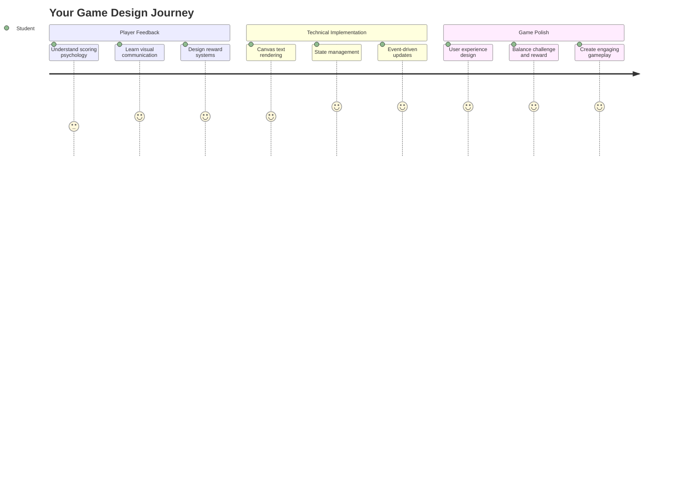
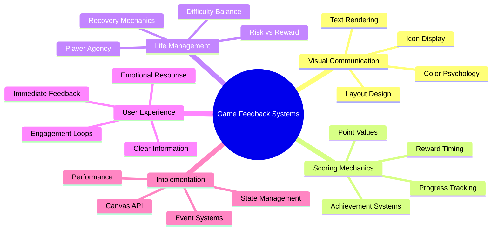
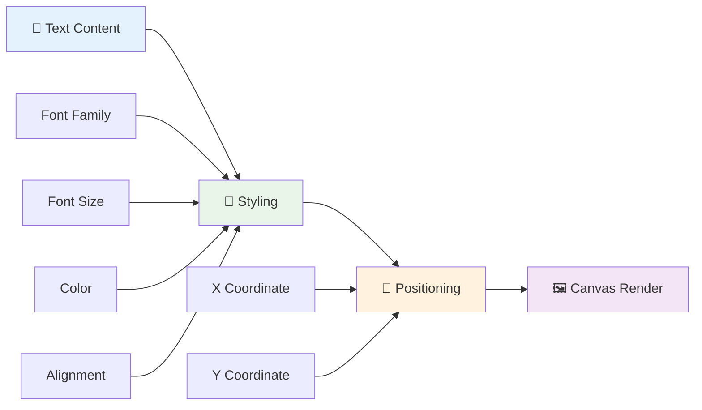
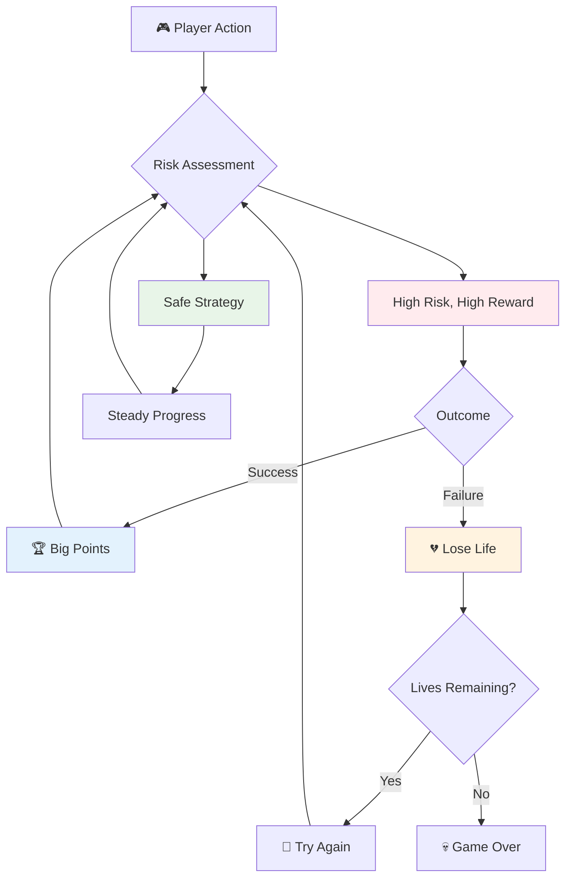
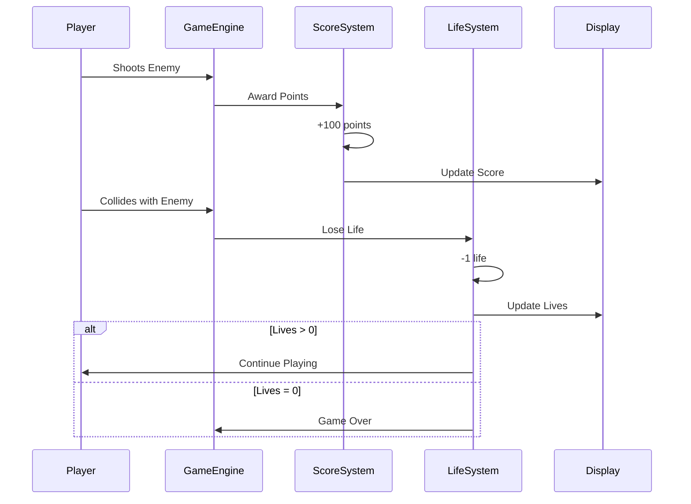
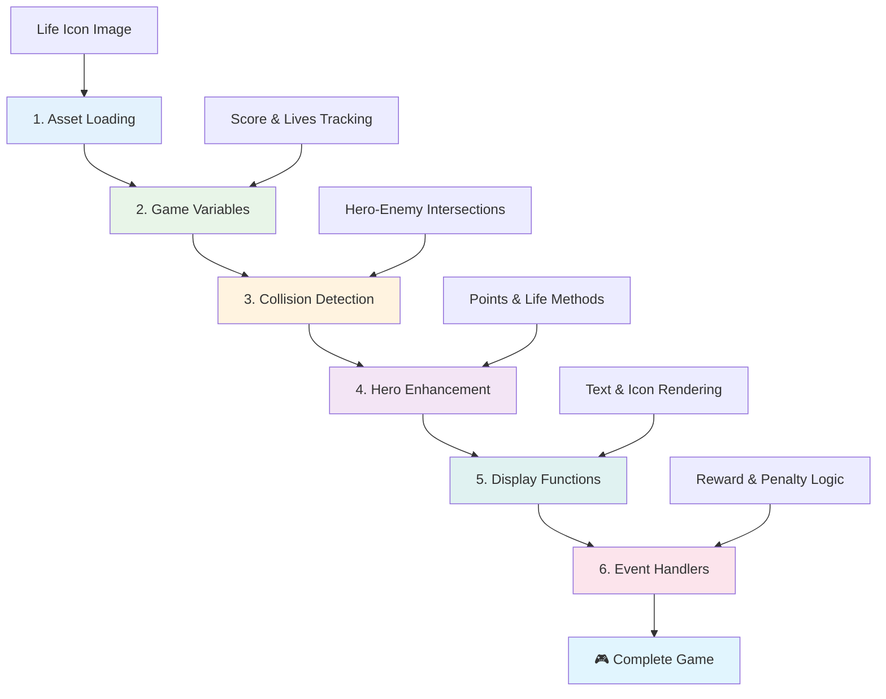
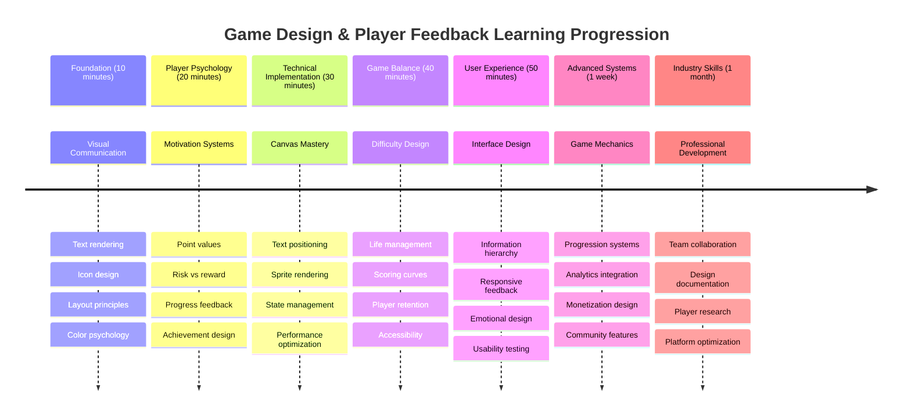

# Создание космической игры, часть 5: Очки и жизни



## Викторина перед лекцией

[Викторина перед лекцией](https://ff-quizzes.netlify.app/web/quiz/37)

Готовы сделать вашу космическую игру настоящей? Давайте добавим систему начисления очков и управления жизнями — ключевые механики, которые превратили ранние аркадные игры, такие как Space Invaders, из простых демонстраций в захватывающее развлечение. Именно здесь ваша игра становится по-настоящему играбельной.



## Отображение текста на экране — голос вашей игры

Чтобы показать ваш счет, нам нужно научиться выводить текст на холст. Метод `fillText()` — ваш главный инструмент для этого. Именно он использовался в классических аркадных играх для отображения очков и информации о статусе.



Вы полностью контролируете внешний вид текста:

```javascript
ctx.font = "30px Arial";
ctx.fillStyle = "red";
ctx.textAlign = "right";
ctx.fillText("show this on the screen", 0, 0);
```

✅ Узнайте больше о [добавлении текста на холст](https://developer.mozilla.org/docs/Web/API/Canvas_API/Tutorial/Drawing_text) — вы можете удивиться, насколько творчески можно использовать шрифты и стили!

## Жизни — это больше, чем просто цифры

В игровом дизайне "жизнь" представляет собой запас ошибок игрока. Эта концепция берет начало от игровых автоматов с пинболом, где у вас было несколько шариков для игры. В ранних видеоиграх, таких как Asteroids, жизни давали игрокам возможность рисковать и учиться на ошибках.



Визуальное представление имеет большое значение — отображение иконок кораблей вместо простого "Жизни: 3" создает мгновенное визуальное восприятие, подобно тому, как ранние аркадные автоматы использовали иконографию для общения вне языковых барьеров.

## Создание системы вознаграждений вашей игры

Теперь мы реализуем основные системы обратной связи, которые удерживают игроков:



- **Система очков**: За каждый уничтоженный вражеский корабль начисляется 100 очков (круглые числа легче воспринимать игрокам). Счет отображается в нижнем левом углу.
- **Счетчик жизней**: Ваш герой начинает с трех жизней — стандарт, установленный ранними аркадными играми для баланса между сложностью и играбельностью. Каждое столкновение с врагом стоит одной жизни. Оставшиеся жизни будут отображаться в нижнем правом углу с помощью иконок кораблей .

## Приступим к созданию!

Сначала настройте рабочее пространство. Перейдите к файлам в папке `your-work`. Вы должны увидеть следующие файлы:

```bash
-| assets
  -| enemyShip.png
  -| player.png
  -| laserRed.png
-| index.html
-| app.js
-| package.json
```

Чтобы протестировать вашу игру, запустите сервер разработки из папки `your_work`:

```bash
cd your-work
npm start
```

Это запустит локальный сервер по адресу `http://localhost:5000`. Откройте этот адрес в браузере, чтобы увидеть вашу игру. Проверьте управление с помощью стрелок и попробуйте стрелять по врагам, чтобы убедиться, что все работает.



### Время кодировать!

1. **Возьмите необходимые визуальные ресурсы**. Скопируйте файл `life.png` из папки `solution/assets/` в вашу папку `your-work`. Затем добавьте lifeImg в вашу функцию window.onload:

    ```javascript
    lifeImg = await loadTexture("assets/life.png");
    ```

1. Не забудьте добавить `lifeImg` в список ваших ресурсов:

    ```javascript
    let heroImg,
    ...
    lifeImg,
    ...
    eventEmitter = new EventEmitter();
    ```
  
2. **Настройте переменные игры**. Добавьте код для отслеживания общего счета (начиная с 0) и оставшихся жизней (начиная с 3). Мы будем отображать их на экране, чтобы игроки всегда знали, где они находятся.

3. **Реализуйте обнаружение столкновений**. Расширьте вашу функцию `updateGameObjects()`, чтобы она определяла, когда враги сталкиваются с вашим героем:

    ```javascript
    enemies.forEach(enemy => {
        const heroRect = hero.rectFromGameObject();
        if (intersectRect(heroRect, enemy.rectFromGameObject())) {
          eventEmitter.emit(Messages.COLLISION_ENEMY_HERO, { enemy });
        }
      })
    ```

4. **Добавьте отслеживание жизней и очков вашему герою**. 
   1. **Инициализируйте счетчики**. Под `this.cooldown = 0` в вашем классе `Hero` настройте жизни и очки:

        ```javascript
        this.life = 3;
        this.points = 0;
        ```

   1. **Отображайте эти значения игроку**. Создайте функции для отображения этих значений на экране:

        ```javascript
        function drawLife() {
          // TODO, 35, 27
          const START_POS = canvas.width - 180;
          for(let i=0; i < hero.life; i++ ) {
            ctx.drawImage(
              lifeImg, 
              START_POS + (45 * (i+1) ), 
              canvas.height - 37);
          }
        }
        
        function drawPoints() {
          ctx.font = "30px Arial";
          ctx.fillStyle = "red";
          ctx.textAlign = "left";
          drawText("Points: " + hero.points, 10, canvas.height-20);
        }
        
        function drawText(message, x, y) {
          ctx.fillText(message, x, y);
        }

        ```

   1. **Подключите все к игровому циклу**. Добавьте эти функции в вашу функцию window.onload сразу после `updateGameObjects()`:

        ```javascript
        drawPoints();
        drawLife();
        ```

### 🔄 **Педагогическая проверка**
**Понимание игрового дизайна**: Перед реализацией последствий убедитесь, что вы понимаете:
- ✅ Как визуальная обратная связь передает состояние игры игрокам
- ✅ Почему последовательное размещение элементов интерфейса улучшает удобство использования
- ✅ Психологию значений очков и управления жизнями
- ✅ Чем текстовое отображение на холсте отличается от HTML-текста

**Быстрый тест**: Почему аркадные игры обычно используют круглые числа для значений очков?
*Ответ: Круглые числа легче воспринимать игрокам и создают удовлетворительное психологическое вознаграждение*

**Принципы пользовательского опыта**: Вы применяете:
- **Визуальную иерархию**: Важная информация размещена на видных местах
- **Мгновенную обратную связь**: Обновления в реальном времени на действия игрока
- **Когнитивную нагрузку**: Простое и понятное представление информации
- **Эмоциональный дизайн**: Иконки и цвета, создающие связь с игроком

1. **Реализуйте последствия и вознаграждения в игре**. Теперь мы добавим системы обратной связи, которые делают действия игрока значимыми:

   1. **Столкновения стоят жизней**. Каждый раз, когда ваш герой сталкивается с врагом, вы теряете жизнь.
   
      Добавьте этот метод в ваш класс `Hero`:

        ```javascript
        decrementLife() {
          this.life--;
          if (this.life === 0) {
            this.dead = true;
          }
        }
        ```

   2. **Стрельба по врагам приносит очки**. Каждый успешный выстрел приносит 100 очков, обеспечивая немедленную положительную обратную связь за точную стрельбу.

      Расширьте ваш класс Hero этим методом увеличения:

        ```javascript
          incrementPoints() {
            this.points += 100;
          }
        ```

        Теперь подключите эти функции к событиям столкновения:

        ```javascript
        eventEmitter.on(Messages.COLLISION_ENEMY_LASER, (_, { first, second }) => {
           first.dead = true;
           second.dead = true;
           hero.incrementPoints();
        })

        eventEmitter.on(Messages.COLLISION_ENEMY_HERO, (_, { enemy }) => {
           enemy.dead = true;
           hero.decrementLife();
        });
        ```

✅ Интересуетесь другими играми, созданными с помощью JavaScript и Canvas? Исследуйте — вы можете удивиться, что возможно!

После реализации этих функций протестируйте вашу игру, чтобы увидеть полную систему обратной связи в действии. Вы должны увидеть иконки жизней в нижнем правом углу, ваш счет в нижнем левом углу, и наблюдать, как столкновения уменьшают жизни, а успешные выстрелы увеличивают счет.

Теперь ваша игра имеет основные механики, которые сделали ранние аркадные игры такими увлекательными — четкие цели, мгновенную обратную связь и значимые последствия действий игрока.

### 🔄 **Педагогическая проверка**
**Полная система игрового дизайна**: Убедитесь, что вы освоили системы обратной связи для игроков:
- ✅ Как механика начисления очков создает мотивацию и вовлеченность игроков?
- ✅ Почему визуальная последовательность важна для дизайна интерфейса?
- ✅ Как система жизней балансирует сложность и удержание игроков?
- ✅ Какую роль играет мгновенная обратная связь в создании удовлетворительного игрового процесса?

**Интеграция системы**: Ваша система обратной связи демонстрирует:
- **Дизайн пользовательского опыта**: Четкая визуальная коммуникация и иерархия информации
- **Архитектура, основанная на событиях**: Реактивные обновления на действия игрока
- **Управление состоянием**: Отслеживание и отображение динамических данных игры
- **Мастерство работы с Canvas**: Отображение текста и позиционирование спрайтов
- **Игровая психология**: Понимание мотивации и вовлеченности игроков

**Профессиональные шаблоны**: Вы реализовали:
- **Архитектуру MVC**: Разделение логики игры, данных и представления
- **Шаблон наблюдателя**: Обновления, основанные на событиях, для изменения состояния игры
- **Дизайн компонентов**: Повторно используемые функции для отображения и логики
- **Оптимизация производительности**: Эффективное отображение в игровых циклах

### ⚡ **Что можно сделать за следующие 5 минут**
- [ ] Поэкспериментируйте с различными размерами и цветами шрифта для отображения счета
- [ ] Попробуйте изменить значения очков и посмотрите, как это влияет на ощущения от игры
- [ ] Добавьте console.log, чтобы отслеживать изменения очков и жизней
- [ ] Проверьте крайние случаи, такие как отсутствие жизней или достижение высоких очков

### 🎯 **Что можно достичь за этот час**
- [ ] Завершите викторину после урока и поймите психологию игрового дизайна
- [ ] Добавьте звуковые эффекты для начисления очков и потери жизней
- [ ] Реализуйте систему высоких очков с использованием localStorage
- [ ] Создайте разные значения очков для разных типов врагов
- [ ] Добавьте визуальные эффекты, такие как тряска экрана при потере жизни

### 📅 **Ваш недельный путь к игровому дизайну**
- [ ] Завершите полную космическую игру с отточенными системами обратной связи
- [ ] Реализуйте продвинутую механику начисления очков, например, множители комбо
- [ ] Добавьте достижения и разблокируемый контент
- [ ] Создайте системы прогрессии сложности и баланса
- [ ] Разработайте пользовательские интерфейсы для меню и экранов окончания игры
- [ ] Изучите другие игры, чтобы понять механизмы вовлечения

### 🌟 **Ваш месячный путь к мастерству разработки игр**
- [ ] Создавайте полноценные игры с сложными системами прогрессии
- [ ] Изучите аналитику игр и измерение поведения игроков
- [ ] Участвуйте в проектах разработки игр с открытым исходным кодом
- [ ] Освойте продвинутые шаблоны игрового дизайна и монетизации
- [ ] Создавайте образовательный контент о дизайне игр и пользовательском опыте
- [ ] Создайте портфолио, демонстрирующее навыки дизайна и разработки игр

## 🎯 Таймлайн вашего мастерства в игровом дизайне



### 🛠️ Резюме вашего набора инструментов игрового дизайна

После завершения этого урока вы освоили:
- **Психология игроков**: Понимание мотивации, риска/вознаграждения и циклов вовлеченности
- **Визуальная коммуникация**: Эффективный дизайн интерфейса с использованием текста, иконок и макета
- **Системы обратной связи**: Реакция в реальном времени на действия игроков и события игры
- **Управление состоянием**: Эффективное отслеживание и отображение динамических данных игры
- **Отображение текста на Canvas**: Профессиональное отображение текста с использованием стилей и позиционирования
- **Интеграция событий**: Связывание действий пользователей с значимыми последствиями в игре
- **Баланс игры**: Дизайн кривых сложности и систем прогрессии игроков

**Применение в реальном мире**: Ваши навыки игрового дизайна напрямую применимы к:
- **Дизайну пользовательского интерфейса**: Создание увлекательных и интуитивно понятных интерфейсов
- **Разработке продуктов**: Понимание мотивации пользователей и циклов обратной связи
- **Образовательным технологиям**: Геймификация и системы вовлечения в обучении
- **Визуализации данных**: Представление сложной информации доступным и увлекательным образом
- **Разработке мобильных приложений**: Механики удержания и дизайн пользовательского опыта
- **Маркетинговым технологиям**: Понимание поведения пользователей и оптимизация конверсии

**Полученные профессиональные навыки**: Теперь вы можете:
- **Проектировать** пользовательский опыт, который мотивирует и вовлекает пользователей
- **Реализовывать** системы обратной связи, которые эффективно направляют поведение пользователей
- **Балансировать** сложность и доступность в интерактивных системах
- **Создавать** визуальную коммуникацию, которая работает для разных групп пользователей
- **Анализировать** поведение пользователей и улучшать дизайн

**Освоенные концепции разработки игр**:
- **Мотивация игроков**: Понимание того, что стимулирует вовлеченность и удержание
- **Визуальный дизайн**: Создание четких, привлекательных и функциональных интерфейсов
- **Интеграция систем**: Связывание нескольких игровых систем для целостного опыта
- **Оптимизация производительности**: Эффективное отображение и управление состоянием
- **Доступность**: Дизайн для разных уровней навыков и потребностей игроков

**Следующий уровень**: Вы готовы изучать продвинутые шаблоны игрового дизайна, реализовывать аналитические системы или изучать стратегии монетизации и удержания игроков!

🌟 **Достижение разблокировано**: Вы создали полную систему обратной связи для игроков с профессиональными принципами игрового дизайна!

---

## Вызов GitHub Copilot Agent 🚀

Используйте режим Agent, чтобы выполнить следующий вызов:

**Описание:** Улучшите систему начисления очков в космической игре, реализовав функцию высоких очков с постоянным хранением и механикой бонусных очков.

**Задача:** Создайте систему высоких очков, которая сохраняет лучший результат игрока в localStorage. Добавьте бонусные очки за последовательные уничтожения врагов (система комбо) и реализуйте разные значения очков для разных типов врагов. Включите визуальный индикатор, когда игрок достигает нового рекорда, и отображайте текущий рекорд на экране игры.


## 🚀 Вызов

Теперь у вас есть функциональная игра с системой очков и жизней. Подумайте, какие дополнительные функции могут улучшить опыт игрока.

## Викторина после лекции

[Викторина после лекции](https://ff-quizzes.netlify.app/web/quiz/38)

## Обзор и самостоятельное изучение

Хотите узнать больше? Исследуйте различные подходы к системам начисления очков и жизней. Существуют интересные игровые движки, такие как [PlayFab](https://playfab.com), которые управляют очками, таблицами лидеров и прогрессией игроков. Как интеграция чего-то подобного может вывести вашу игру на новый уровень?

## Задание

[Создайте игру с системой начисления очков](assignment.md)

---

**Отказ от ответственности**:  
Этот документ был переведен с использованием сервиса автоматического перевода [Co-op Translator](https://github.com/Azure/co-op-translator). Несмотря на наши усилия обеспечить точность, автоматические переводы могут содержать ошибки или неточности. Оригинальный документ на его родном языке следует считать авторитетным источником. Для получения критически важной информации рекомендуется профессиональный перевод человеком. Мы не несем ответственности за любые недоразумения или неправильные интерпретации, возникшие в результате использования данного перевода.