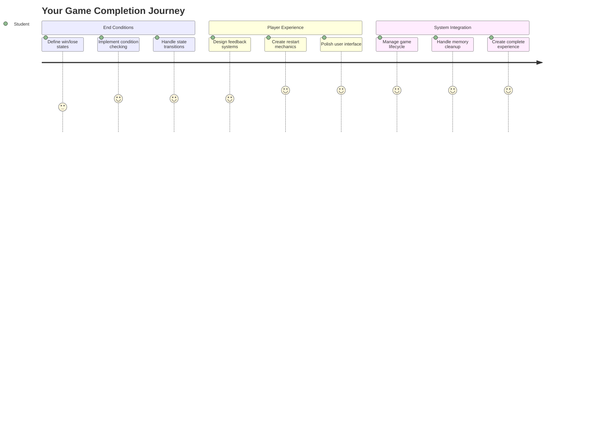
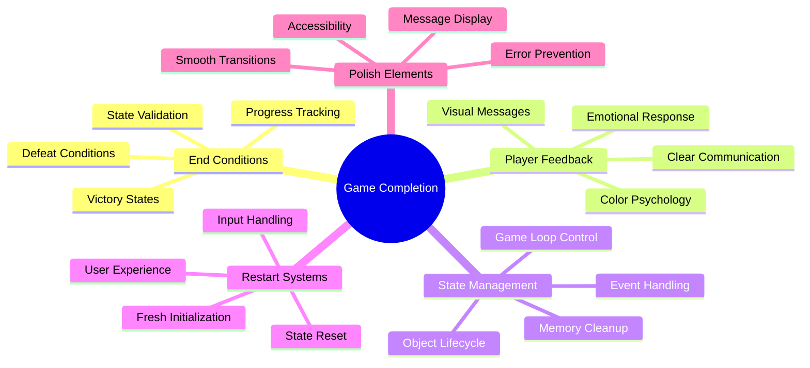
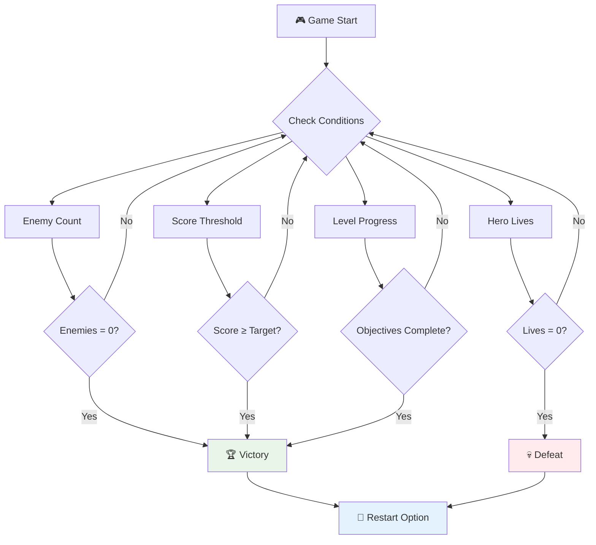
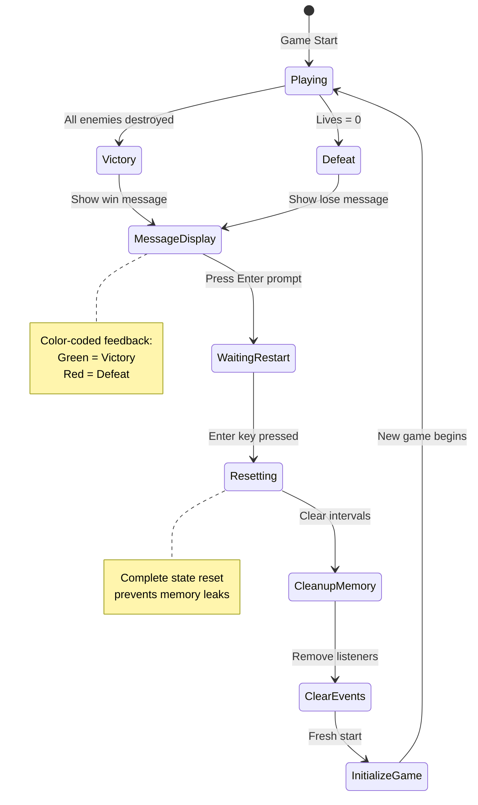
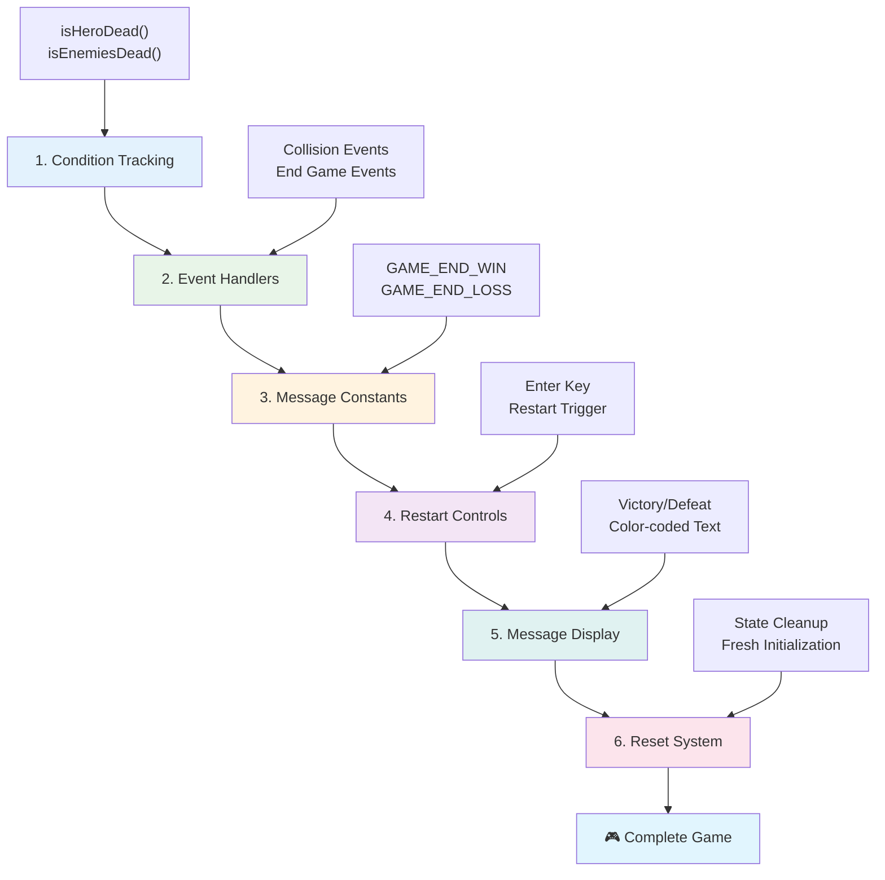
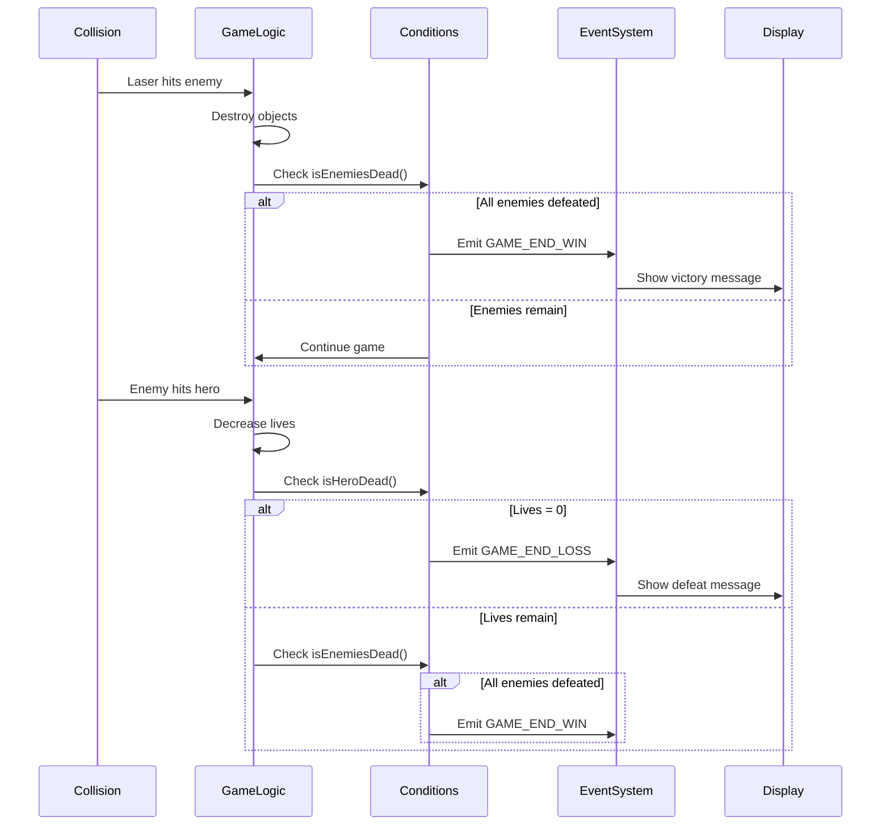
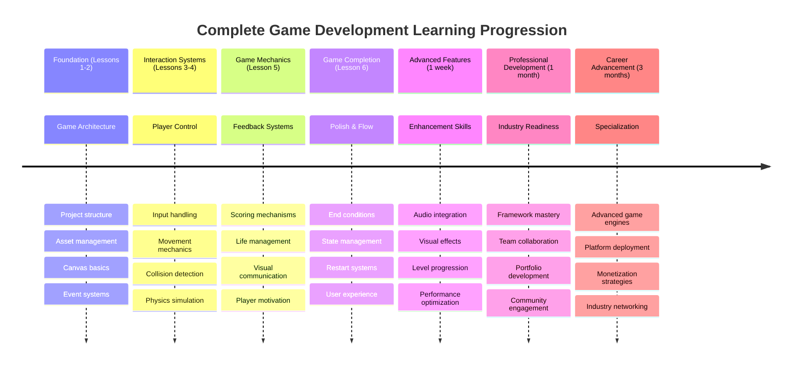

# Создание космической игры, часть 6: завершение и перезапуск



Каждой отличной игре нужны четкие условия завершения и удобный механизм перезапуска. Вы уже создали впечатляющую космическую игру с движением, боевыми действиями и системой очков — теперь пришло время добавить финальные элементы, которые сделают её завершённой.

Ваша игра сейчас работает бесконечно, как зонды Voyager, запущенные NASA в 1977 году, которые до сих пор путешествуют по космосу спустя десятилетия. Хотя это подходит для космических исследований, игры нуждаются в определённых конечных точках, чтобы создать удовлетворяющий опыт.

Сегодня мы реализуем правильные условия победы/поражения и систему перезапуска. К концу этого урока у вас будет отполированная игра, которую игроки смогут завершить и переиграть, как классические аркадные игры, которые определили жанр.



## Викторина перед лекцией

[Викторина перед лекцией](https://ff-quizzes.netlify.app/web/quiz/39)

## Понимание условий завершения игры

Когда должна заканчиваться ваша игра? Этот фундаментальный вопрос формировал дизайн игр с эпохи ранних аркадных автоматов. Pac-Man заканчивается, когда вас ловят призраки или вы собираете все точки, а Space Invaders завершается, когда пришельцы достигают нижней части экрана или вы уничтожаете их всех.

Как создатель игры, вы определяете условия победы и поражения. Для нашей космической игры вот проверенные подходы, которые создают увлекательный игровой процесс:



- **Уничтожено `N` вражеских кораблей**: Это довольно распространённый подход, если вы делите игру на уровни, где нужно уничтожить `N` вражеских кораблей, чтобы завершить уровень.
- **Ваш корабль уничтожен**: Есть игры, где вы проигрываете, если ваш корабль уничтожен. Другой распространённый подход — концепция жизней. Каждый раз, когда ваш корабль уничтожается, вы теряете жизнь. Когда все жизни потеряны, игра заканчивается.
- **Вы собрали `N` очков**: Ещё одно распространённое условие завершения — сбор очков. Как вы получаете очки, зависит от вас, но часто очки присваиваются за различные действия, например, уничтожение вражеского корабля или сбор предметов, которые выпадают при их уничтожении.
- **Завершение уровня**: Это может включать несколько условий, таких как уничтожение `X` вражеских кораблей, сбор `Y` очков или, возможно, сбор определённого предмета.

## Реализация функциональности перезапуска игры

Хорошие игры стимулируют повторное прохождение благодаря удобным механизмам перезапуска. Когда игроки завершают игру (или терпят поражение), они часто хотят попробовать снова сразу же — чтобы побить свой рекорд или улучшить свои навыки.



Тетрис прекрасно демонстрирует это: когда ваши блоки достигают верха, вы можете мгновенно начать новую игру без необходимости проходить сложные меню. Мы создадим аналогичную систему перезапуска, которая чисто сбрасывает состояние игры и быстро возвращает игроков в действие.

✅ **Рефлексия**: Вспомните игры, в которые вы играли. При каких условиях они заканчиваются, и как вас побуждают к перезапуску? Что делает опыт перезапуска плавным, а что — раздражающим?

## Что вы создадите

Вы реализуете финальные функции, которые преобразуют ваш проект в полноценный игровой опыт. Эти элементы отличают отполированные игры от базовых прототипов.

**Вот что мы добавим сегодня:**

1. **Условие победы**: Уничтожьте всех врагов и получите заслуженное празднование!
2. **Условие поражения**: Потеряйте все жизни и столкнитесь с экраном поражения.
3. **Механизм перезапуска**: Нажмите Enter, чтобы сразу вернуться в игру — ведь одной игры никогда не бывает достаточно.
4. **Управление состоянием**: Чистый лист каждый раз — никаких оставшихся врагов или странных глюков от предыдущей игры.

## Начало работы

Давайте подготовим вашу среду разработки. У вас должны быть все файлы космической игры из предыдущих уроков.

**Ваш проект должен выглядеть примерно так:**

```bash
-| assets
  -| enemyShip.png
  -| player.png
  -| laserRed.png
  -| life.png
-| index.html
-| app.js
-| package.json
```

**Запустите сервер разработки:**

```bash
cd your-work
npm start
```

**Эта команда:**
- Запускает локальный сервер на `http://localhost:5000`
- Корректно обслуживает ваши файлы
- Автоматически обновляет изменения

Откройте `http://localhost:5000` в вашем браузере и убедитесь, что игра работает. Вы должны иметь возможность двигаться, стрелять и взаимодействовать с врагами. После подтверждения можно приступать к реализации.

> 💡 **Полезный совет**: Чтобы избежать предупреждений в Visual Studio Code, объявите `gameLoopId` в начале файла как `let gameLoopId;`, а не внутри функции `window.onload`. Это соответствует современным практикам объявления переменных в JavaScript.



## Шаги реализации

### Шаг 1: Создание функций отслеживания условий завершения

Нам нужны функции, которые будут отслеживать, когда игра должна завершиться. Как датчики на Международной космической станции, которые постоянно мониторят критические системы, эти функции будут непрерывно проверять состояние игры.

```javascript
function isHeroDead() {
  return hero.life <= 0;
}

function isEnemiesDead() {
  const enemies = gameObjects.filter((go) => go.type === "Enemy" && !go.dead);
  return enemies.length === 0;
}
```

**Что происходит за кулисами:**
- **Проверяет**, остались ли у героя жизни (ай-ай-ай!)
- **Считает**, сколько врагов всё ещё живы и активны
- **Возвращает** `true`, когда поле боя очищено от врагов
- **Использует** простую логику true/false для упрощения
- **Фильтрует** все игровые объекты, чтобы найти выживших

### Шаг 2: Обновление обработчиков событий для условий завершения

Теперь мы подключим эти проверки условий к системе событий игры. Каждый раз, когда происходит столкновение, игра будет оценивать, вызывает ли оно условие завершения. Это создаёт мгновенную обратную связь для критических игровых событий.



```javascript
eventEmitter.on(Messages.COLLISION_ENEMY_LASER, (_, { first, second }) => {
    first.dead = true;
    second.dead = true;
    hero.incrementPoints();

    if (isEnemiesDead()) {
      eventEmitter.emit(Messages.GAME_END_WIN);
    }
});

eventEmitter.on(Messages.COLLISION_ENEMY_HERO, (_, { enemy }) => {
    enemy.dead = true;
    hero.decrementLife();
    if (isHeroDead())  {
      eventEmitter.emit(Messages.GAME_END_LOSS);
      return; // loss before victory
    }
    if (isEnemiesDead()) {
      eventEmitter.emit(Messages.GAME_END_WIN);
    }
});

eventEmitter.on(Messages.GAME_END_WIN, () => {
    endGame(true);
});
  
eventEmitter.on(Messages.GAME_END_LOSS, () => {
  endGame(false);
});
```

**Что здесь происходит:**
- **Лазер попадает во врага**: Оба исчезают, вы получаете очки, и мы проверяем, победили ли вы.
- **Враг попадает в вас**: Вы теряете жизнь, и мы проверяем, остались ли вы в игре.
- **Умный порядок**: Сначала проверяем поражение (никто не хочет одновременно победить и проиграть!).
- **Мгновенные реакции**: Как только происходит что-то важное, игра сразу узнаёт об этом.

### Шаг 3: Добавление новых констант сообщений

Вам нужно добавить новые типы сообщений в объект констант `Messages`. Эти константы помогают поддерживать согласованность и предотвращают опечатки в системе событий.

```javascript
GAME_END_LOSS: "GAME_END_LOSS",
GAME_END_WIN: "GAME_END_WIN",
```

**В приведённом выше коде мы:**
- **Добавили** константы для событий завершения игры для поддержания согласованности
- **Использовали** описательные имена, которые чётко указывают на цель события
- **Следовали** существующей системе именования типов сообщений

### Шаг 4: Реализация управления перезапуском

Теперь вы добавите управление клавишами, позволяющее игрокам перезапустить игру. Клавиша Enter — естественный выбор, так как она обычно ассоциируется с подтверждением действий и началом новых игр.

**Добавьте обнаружение нажатия клавиши Enter в существующий обработчик событий keydown:**

```javascript
else if(evt.key === "Enter") {
   eventEmitter.emit(Messages.KEY_EVENT_ENTER);
}
```

**Добавьте новую константу сообщения:**

```javascript
KEY_EVENT_ENTER: "KEY_EVENT_ENTER",
```

**Что нужно знать:**
- **Расширяет** вашу существующую систему обработки событий клавиатуры
- **Использует** клавишу Enter как триггер перезапуска для интуитивного пользовательского опыта
- **Излучает** пользовательское событие, которое могут слушать другие части вашей игры
- **Сохраняет** тот же шаблон, что и другие элементы управления клавиатурой

### Шаг 5: Создание системы отображения сообщений

Ваша игра должна чётко сообщать результаты игрокам. Мы создадим систему сообщений, которая отображает состояния победы и поражения с использованием цветного текста, подобно интерфейсам ранних компьютерных систем, где зелёный означал успех, а красный — ошибки.

**Создайте функцию `displayMessage()`:**

```javascript
function displayMessage(message, color = "red") {
  ctx.font = "30px Arial";
  ctx.fillStyle = color;
  ctx.textAlign = "center";
  ctx.fillText(message, canvas.width / 2, canvas.height / 2);
}
```

**Пошагово, что происходит:**
- **Устанавливает** размер и семейство шрифта для чёткого, читаемого текста
- **Применяет** параметр цвета с "красным" по умолчанию для предупреждений
- **Центрирует** текст горизонтально и вертикально на холсте
- **Использует** современные параметры JavaScript по умолчанию для гибкости выбора цвета
- **Использует** контекст 2D холста для прямого рендеринга текста

**Создайте функцию `endGame()`:**

```javascript
function endGame(win) {
  clearInterval(gameLoopId);

  // Set a delay to ensure any pending renders complete
  setTimeout(() => {
    ctx.clearRect(0, 0, canvas.width, canvas.height);
    ctx.fillStyle = "black";
    ctx.fillRect(0, 0, canvas.width, canvas.height);
    if (win) {
      displayMessage(
        "Victory!!! Pew Pew... - Press [Enter] to start a new game Captain Pew Pew",
        "green"
      );
    } else {
      displayMessage(
        "You died !!! Press [Enter] to start a new game Captain Pew Pew"
      );
    }
  }, 200)  
}
```

**Что делает эта функция:**
- **Замораживает** всё на месте — никакого движения кораблей или лазеров
- **Делает** небольшую паузу (200 мс), чтобы последний кадр успел отрисоваться
- **Очищает** экран и окрашивает его в чёрный для драматического эффекта
- **Показывает** разные сообщения для победителей и проигравших
- **Кодирует** новости цветом — зелёный для хороших, красный для... ну, не очень
- **Сообщает** игрокам, как вернуться в игру

### 🔄 **Педагогическая проверка**
**Управление состоянием игры**: Перед реализацией функциональности сброса убедитесь, что вы понимаете:
- ✅ Как условия завершения создают чёткие игровые цели
- ✅ Почему визуальная обратная связь важна для понимания игрока
- ✅ Важность правильной очистки для предотвращения утечек памяти
- ✅ Как событийная архитектура позволяет осуществлять чистые переходы состояний

**Быстрый тест**: Что произойдёт, если вы не очистите обработчики событий при сбросе?
*Ответ: Утечки памяти и дублирование обработчиков событий, вызывающее непредсказуемое поведение*

**Принципы дизайна игр**: Сейчас вы реализуете:
- **Чёткие цели**: Игроки точно знают, что определяет успех и поражение
- **Мгновенная обратная связь**: Изменения состояния игры сообщаются сразу
- **Контроль пользователя**: Игроки могут перезапустить игру, когда они готовы
- **Надёжность системы**: Правильная очистка предотвращает ошибки и проблемы с производительностью

### Шаг 6: Реализация функциональности сброса игры

Система сброса должна полностью очищать текущее состояние игры и инициализировать новую игровую сессию. Это гарантирует, что игроки начнут с чистого листа без остаточных данных от предыдущей игры.

**Создайте функцию `resetGame()`:**

```javascript
function resetGame() {
  if (gameLoopId) {
    clearInterval(gameLoopId);
    eventEmitter.clear();
    initGame();
    gameLoopId = setInterval(() => {
      ctx.clearRect(0, 0, canvas.width, canvas.height);
      ctx.fillStyle = "black";
      ctx.fillRect(0, 0, canvas.width, canvas.height);
      drawPoints();
      drawLife();
      updateGameObjects();
      drawGameObjects(ctx);
    }, 100);
  }
}
```

**Давайте разберём каждую часть:**
- **Проверяет**, запущен ли игровой цикл, перед сбросом
- **Очищает** текущий игровой цикл, чтобы остановить всю текущую игровую активность
- **Удаляет** все обработчики событий, чтобы предотвратить утечки памяти
- **Переинициализирует** состояние игры с новыми объектами и переменными
- **Запускает** новый игровой цикл со всеми необходимыми игровыми функциями
- **Сохраняет** тот же интервал в 100 мс для стабильной производительности игры

**Добавьте обработчик события клавиши Enter в вашу функцию `initGame()`:**

```javascript
eventEmitter.on(Messages.KEY_EVENT_ENTER, () => {
  resetGame();
});
```

**Добавьте метод `clear()` в ваш класс EventEmitter:**

```javascript
clear() {
  this.listeners = {};
}
```

**Основные моменты:**
- **Связывает** нажатие клавиши Enter с функциональностью сброса игры
- **Регистрирует** этот обработчик событий во время инициализации игры
- **Обеспечивает** чистый способ удаления всех обработчиков событий при сбросе
- **Предотвращает** утечки памяти, очищая обработчики между играми
- **Сбрасывает** объект слушателей в пустое состояние для новой инициализации

## Поздравляем! 🎉

👽 💥 🚀 Вы успешно создали полноценную игру с нуля. Как программисты, создавшие первые видеоигры в 1970-х, вы преобразовали строки кода в интерактивный опыт с правильной игровой механикой и обратной связью для пользователя. 🚀 💥 👽

**Вы достигли:**
- **Реализовали** полные условия победы и поражения с обратной связью для пользователя
- **Создали** плавную систему перезапуска для непрерывного игрового процесса
- **Разработали** чёткую визуальную коммуникацию для состояний игры
- **Управляли** сложными переходами состояния игры и очисткой
- **Собрали** все компоненты в целостную, играбельную игру

### 🔄 **Педагогическая проверка**
**Полная система разработки игр**: Отпразднуйте своё мастерство полного цикла разработки игр:
- ✅ Как условия завершения создают удовлетворяющий опыт для игрока?
- ✅ Почему правильное управление состоянием критично для стабильности игры?
- ✅ Как визуальная обратная связь улучшает понимание игрока?
- ✅ Какую роль играет система перезапуска в удержании игроков?

**Мастерство системы**: Ваша завершённая игра демонстрирует:
- **Полноценную разработку игр**: От графики до ввода и управления состоянием
- **Профессиональную архитектуру**: Системы, основанные на событиях, с правильной очисткой
- **Дизайн пользовательского опыта**: Чёткая обратная связь и интуитивное управление
- **Оптимизацию производительности**: Эффективный рендеринг и управление памятью
- **Полировку и завершённость**: Все детали, которые делают игру завершённой

**Навыки, готовые к применению в индустрии**: Вы реализовали:
- **Архитектуру игрового цикла**: Системы реального времени с стабильной производительностью
- **Программирование на основе событий**: Разделённые системы, которые эффективно масштабируются
- **Управление состоянием**: Сложная обработка данных и управление жизненным циклом
- **Дизайн пользовательского интерфейса**: Чёткая коммуникация и отзывчивое управление
- **Тестирование и отладка**: Итеративная разработка и решение проблем

### ⚡ **Что вы можете сделать за следующие 5 минут**
- [ ] Поиграйте в свою завершённую игру и протестируйте все условия победы и поражения
- [ ] Поэкспериментируйте с различными параметрами условий завершения
- [ ] Попробуйте добавить console.log для отслеживания изменений состояния игры
- [ ] Поделитесь своей игрой с друзьями и соберите отзывы

### 🎯 **Что вы можете достичь за этот час**
- [ ] Завершите викторину после урока и подумайте о своём пути разработки игры
- [ ] Добавьте звуковые эффекты для состояний победы и поражения
- [ ] Реализуйте дополнительные условия завершения, такие как ограничения по времени или бонусные цели
- [ ] Создайте разные уровни сложности с различным количеством врагов
- [ ] Улучшите визуальное оформление с помощью лучших шрифтов и цветов

### 📅 **Ваш недельный путь к мастерству разработки игр**
- [ ] Завершите улучшенную космическую игру с несколькими уровнями и прогрессией
- [ ] Добавьте продвинутые функции, такие как усиления, разные типы врагов и особое оружие
- [ ] Создайте систему рекордов с постоянным хранилищем
- [ ] Разработайте пользовательские интерфейсы для меню, настроек и опций игры
- [ ] Оптимизируйте производительность для разных устройств и браузеров
- [ ] Разместите свою игру онлайн и поделитесь ею с сообществом
### 🌟 **Ваш Месячный Путь в Карьере Разработчика Игр**
- [ ] Создайте несколько завершенных игр, исследуя разные жанры и механики
- [ ] Изучите продвинутые фреймворки для разработки игр, такие как Phaser или Three.js
- [ ] Внесите вклад в проекты разработки игр с открытым исходным кодом
- [ ] Изучите принципы игрового дизайна и психологию игроков
- [ ] Создайте портфолио, демонстрирующее ваши навыки разработки игр
- [ ] Свяжитесь с сообществом разработчиков игр и продолжайте учиться

## 🎯 Полный Таймлайн Освоения Разработки Игр



### 🛠️ Итоговый Обзор Вашего Инструментария Разработчика Игр

После завершения всей серии игр про космос вы освоили:
- **Архитектура игр**: Системы, основанные на событиях, игровые циклы и управление состоянием
- **Графическое программирование**: API Canvas, рендеринг спрайтов и визуальные эффекты
- **Системы ввода**: Обработка клавиатуры, обнаружение столкновений и отзывчивое управление
- **Дизайн игр**: Обратная связь с игроком, системы прогресса и механики вовлечения
- **Оптимизация производительности**: Эффективный рендеринг, управление памятью и контроль частоты кадров
- **Пользовательский опыт**: Четкая коммуникация, интуитивное управление и внимание к деталям
- **Профессиональные паттерны**: Чистый код, техники отладки и организация проектов

**Применение в реальном мире**: Ваши навыки разработки игр напрямую применимы к:
- **Интерактивным веб-приложениям**: Динамические интерфейсы и системы в реальном времени
- **Визуализации данных**: Анимированные графики и интерактивная графика
- **Образовательным технологиям**: Геймификация и увлекательные обучающие материалы
- **Мобильной разработке**: Взаимодействие через сенсорный экран и оптимизация производительности
- **Программам моделирования**: Физические движки и моделирование в реальном времени
- **Творческим индустриям**: Интерактивное искусство, развлечения и цифровой опыт

**Приобретенные профессиональные навыки**: Теперь вы можете:
- **Проектировать** сложные интерактивные системы с нуля
- **Отлаживать** приложения в реальном времени, используя систематический подход
- **Оптимизировать** производительность для плавного пользовательского опыта
- **Разрабатывать** увлекательные пользовательские интерфейсы и паттерны взаимодействия
- **Эффективно сотрудничать** в технических проектах с правильной организацией кода

**Освоенные концепции разработки игр**:
- **Системы реального времени**: Игровые циклы, управление частотой кадров и производительность
- **Архитектура, основанная на событиях**: Разделенные системы и передача сообщений
- **Управление состоянием**: Сложная обработка данных и управление жизненным циклом
- **Программирование пользовательского интерфейса**: Графика Canvas и адаптивный дизайн
- **Теория игрового дизайна**: Психология игроков и механики вовлечения

**Следующий уровень**: Вы готовы изучать продвинутые игровые фреймворки, 3D-графику, многопользовательские системы или переходить к профессиональным ролям в разработке игр!

🌟 **Достижение разблокировано**: Вы завершили полный путь разработки игр и создали интерактивный опыт профессионального качества с нуля!

**Добро пожаловать в сообщество разработчиков игр!** 🎮✨

## Вызов GitHub Copilot Agent 🚀

Используйте режим Agent, чтобы выполнить следующий вызов:

**Описание:** Улучшите космическую игру, добавив систему прогресса уровней с увеличением сложности и бонусными функциями.

**Задание:** Создайте систему многослойной космической игры, где на каждом уровне появляется больше вражеских кораблей с увеличенной скоростью и здоровьем. Добавьте множитель очков, который увеличивается с каждым уровнем, и реализуйте бонусы (например, ускоренную стрельбу или щит), которые случайно появляются при уничтожении врагов. Включите бонус за завершение уровня и отображайте текущий уровень на экране наряду с существующими очками и жизнями.

Узнайте больше о [режиме Agent](https://code.visualstudio.com/blogs/2025/02/24/introducing-copilot-agent-mode) здесь.

## 🚀 Дополнительный вызов на улучшение

**Добавьте аудио в вашу игру**: Улучшите игровой процесс, добавив звуковые эффекты! Рассмотрите добавление звука для:

- **Выстрелов лазера**, когда игрок стреляет
- **Уничтожения врагов**, когда корабли поражены
- **Повреждения героя**, когда игрок получает урон
- **Победной музыки**, когда игра выиграна
- **Звука поражения**, когда игра проиграна

**Пример реализации аудио:**

```javascript
// Create audio objects
const laserSound = new Audio('assets/laser.wav');
const explosionSound = new Audio('assets/explosion.wav');

// Play sounds during game events
function playLaserSound() {
  laserSound.currentTime = 0; // Reset to beginning
  laserSound.play();
}
```

**Что нужно знать:**
- **Создание** объектов Audio для различных звуковых эффектов
- **Сброс** `currentTime` для обеспечения быстрого воспроизведения звуковых эффектов
- **Обработка** политики автозапуска браузера путем активации звуков через взаимодействие пользователя
- **Управление** громкостью и временем воспроизведения для улучшения игрового опыта

> 💡 **Ресурс для обучения**: Изучите этот [аудио песочницу](https://www.w3schools.com/jsref/tryit.asp?filename=tryjsref_audio_play), чтобы узнать больше о реализации аудио в играх на JavaScript.

## Викторина после лекции

[Викторина после лекции](https://ff-quizzes.netlify.app/web/quiz/40)

## Обзор и самостоятельное изучение

Ваше задание — создать новую пробную игру, поэтому изучите некоторые интересные игры, чтобы понять, какую игру вы могли бы создать.

## Задание

[Создайте пробную игру](assignment.md)

---

**Отказ от ответственности**:  
Этот документ был переведен с использованием сервиса автоматического перевода [Co-op Translator](https://github.com/Azure/co-op-translator). Хотя мы стремимся к точности, пожалуйста, учитывайте, что автоматические переводы могут содержать ошибки или неточности. Оригинальный документ на его родном языке следует считать авторитетным источником. Для получения критически важной информации рекомендуется профессиональный перевод человеком. Мы не несем ответственности за любые недоразумения или неправильные интерпретации, возникающие в результате использования данного перевода.