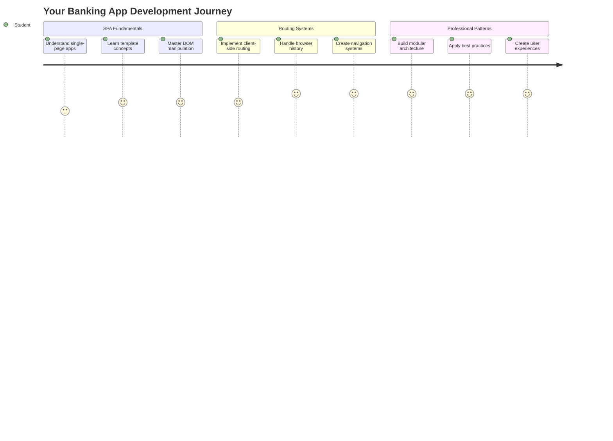
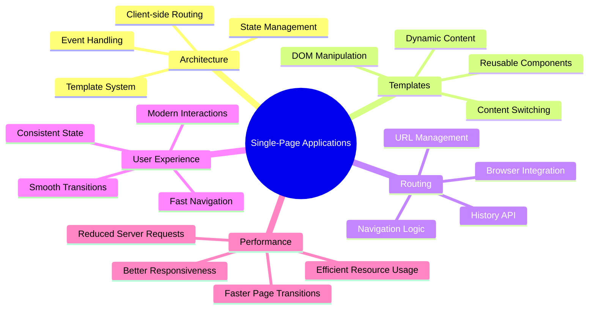
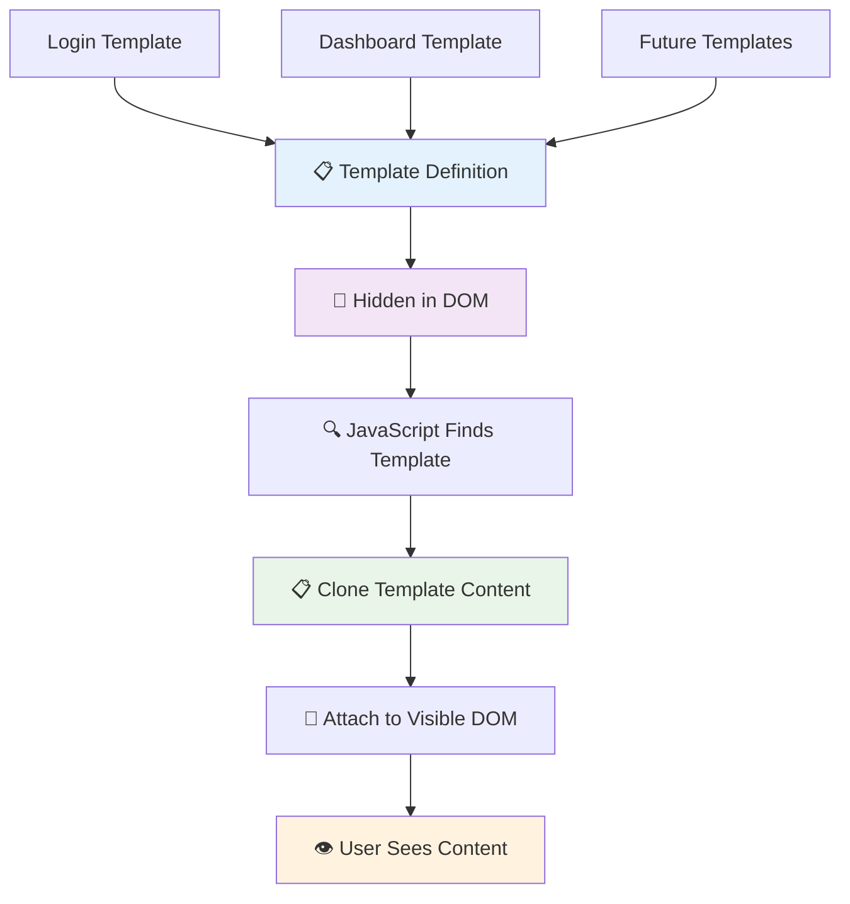
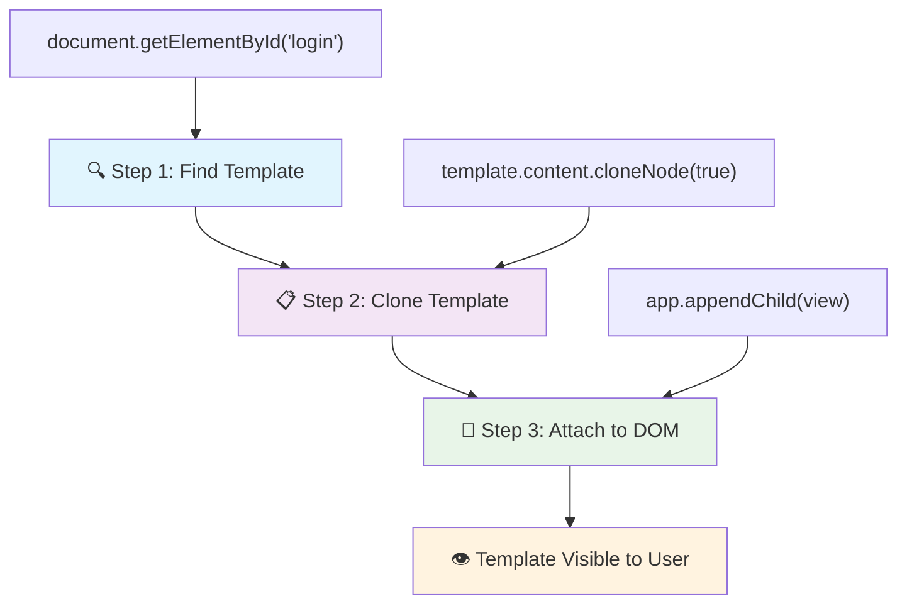
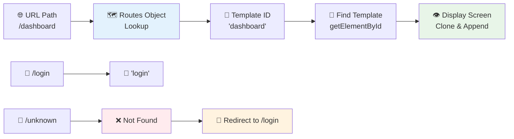
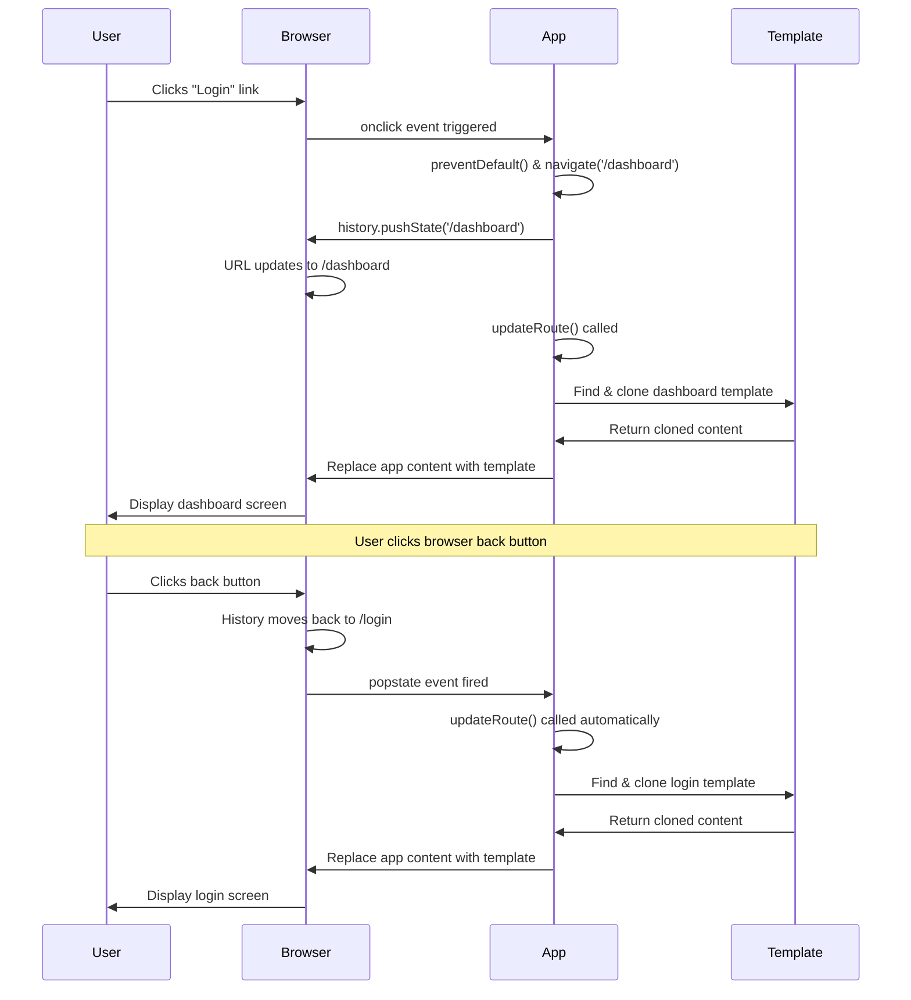
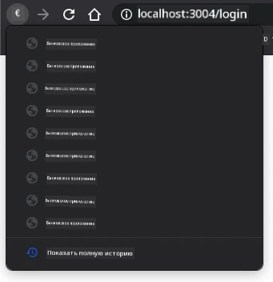
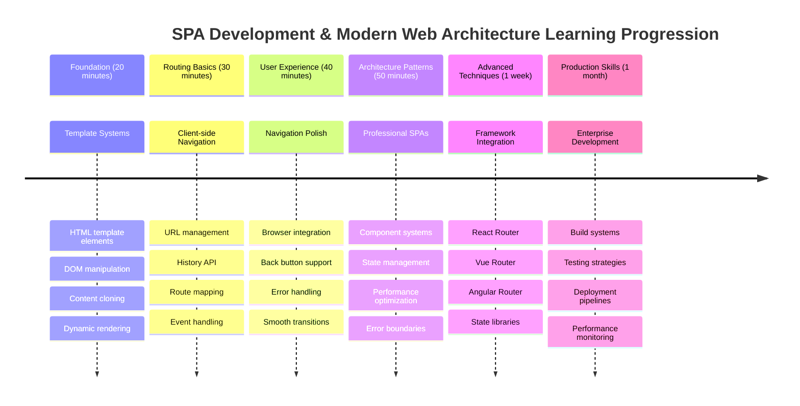

# Создание банковского приложения, часть 1: HTML-шаблоны и маршруты в веб-приложении



Когда компьютер навигации Apollo 11 направлял корабль на Луну в 1969 году, он переключался между различными программами, не перезапуская всю систему. Современные веб-приложения работают аналогично – они изменяют то, что вы видите, без полной перезагрузки. Это создает плавный и отзывчивый интерфейс, который пользователи ожидают сегодня.

В отличие от традиционных веб-сайтов, которые перезагружают целые страницы при каждом взаимодействии, современные веб-приложения обновляют только те части, которые необходимо изменить. Такой подход, как переключение дисплеев в центре управления полетами при постоянной связи, создает тот самый плавный опыт, к которому мы привыкли.

Вот что делает эту разницу такой заметной:

| Традиционные многостраничные приложения | Современные одностраничные приложения |
|-----------------------------------------|---------------------------------------|
| **Навигация** | Полная перезагрузка страницы для каждого экрана | Мгновенное переключение контента |
| **Производительность** | Медленнее из-за загрузки полного HTML | Быстрее благодаря частичным обновлениям |
| **Пользовательский опыт** | Резкие переходы между страницами | Плавные, похожие на приложение переходы |
| **Обмен данными** | Сложно между страницами | Легкое управление состоянием |
| **Разработка** | Множество HTML-файлов для поддержки | Один HTML с динамическими шаблонами |

**Понимание эволюции:**
- **Традиционные приложения** требуют запросов к серверу для каждого действия навигации
- **Современные SPA** загружаются один раз и динамически обновляют контент с помощью JavaScript
- **Ожидания пользователей** теперь ориентированы на мгновенные, бесшовные взаимодействия
- **Преимущества производительности** включают уменьшение объема передаваемых данных и более быстрые ответы

В этом уроке мы создадим банковское приложение с несколькими экранами, которые плавно переходят друг в друга. Как ученые используют модульные инструменты, которые можно перенастраивать для различных экспериментов, мы будем использовать HTML-шаблоны как повторно используемые компоненты, которые можно отображать по мере необходимости.

Вы будете работать с HTML-шаблонами (повторно используемыми чертежами для различных экранов), маршрутизацией на JavaScript (система, которая переключает экраны) и API истории браузера (который обеспечивает корректную работу кнопки "Назад"). Это те же самые основные техники, которые используются в таких фреймворках, как React, Vue и Angular.

К концу урока у вас будет рабочее банковское приложение, демонстрирующее профессиональные принципы одностраничных приложений.



## Предварительный тест

[Предварительный тест](https://ff-quizzes.netlify.app/web/quiz/41)

### Что вам понадобится

Нам понадобится локальный веб-сервер для тестирования нашего банковского приложения – не переживайте, это проще, чем кажется! Если у вас его еще нет, просто установите [Node.js](https://nodejs.org) и выполните команду `npx lite-server` из папки вашего проекта. Эта удобная команда запускает локальный сервер и автоматически открывает ваше приложение в браузере.

### Подготовка

На вашем компьютере создайте папку с именем `bank` и файл с именем `index.html` внутри нее. Мы начнем с этого [шаблона HTML](https://en.wikipedia.org/wiki/Boilerplate_code):

```html
<!DOCTYPE html>
<html lang="en">
  <head>
    <meta charset="UTF-8">
    <meta name="viewport" content="width=device-width, initial-scale=1.0">
    <title>Bank App</title>
  </head>
  <body>
    <!-- This is where you'll work -->
  </body>
</html>
```

**Что предоставляет этот шаблон:**
- **Устанавливает** структуру документа HTML5 с правильным объявлением DOCTYPE
- **Настраивает** кодировку символов как UTF-8 для поддержки международного текста
- **Включает** адаптивный дизайн с мета-тегом viewport для совместимости с мобильными устройствами
- **Устанавливает** описательный заголовок, который отображается на вкладке браузера
- **Создает** чистую секцию body, где мы будем строить наше приложение

> 📁 **Предварительный обзор структуры проекта**
> 
> **К концу этого урока ваш проект будет содержать:**
> ```
> bank/
> ├── index.html      <!-- Main HTML with templates -->
> ├── app.js          <!-- Routing and navigation logic -->
> └── style.css       <!-- (Optional for future lessons) -->
> ```
> 
> **Ответственность файлов:**
> - **index.html**: Содержит все шаблоны и обеспечивает структуру приложения
> - **app.js**: Управляет маршрутизацией, навигацией и управлением шаблонами
> - **Templates**: Определяют пользовательский интерфейс для входа, панели управления и других экранов

---

## HTML-шаблоны

Шаблоны решают фундаментальную проблему веб-разработки. Когда Гутенберг изобрел печатный станок с подвижными литерами в 1440-х годах, он понял, что вместо того, чтобы вырезать целые страницы, он мог создать повторно используемые блоки букв и расставлять их по мере необходимости. HTML-шаблоны работают по тому же принципу – вместо создания отдельных HTML-файлов для каждого экрана вы определяете повторно используемые структуры, которые можно отображать по мере необходимости.



Представьте шаблоны как чертежи для различных частей вашего приложения. Как архитектор создает один чертеж и использует его несколько раз, вместо того чтобы заново рисовать идентичные комнаты, мы создаем шаблоны один раз и используем их по мере необходимости. Браузер хранит эти шаблоны скрытыми, пока JavaScript не активирует их.

Если вы хотите создать несколько экранов для веб-страницы, одним из решений будет создание одного HTML-файла для каждого экрана, который вы хотите отобразить. Однако это решение имеет некоторые неудобства:

- Вам придется перезагружать весь HTML при переключении экрана, что может быть медленным.
- Сложно обмениваться данными между различными экранами.

Другой подход – иметь только один HTML-файл и определить несколько [HTML-шаблонов](https://developer.mozilla.org/docs/Web/HTML/Element/template) с использованием элемента `<template>`. Шаблон – это повторно используемый HTML-блок, который не отображается браузером и должен быть создан во время выполнения с помощью JavaScript.

### Давайте создадим

Мы собираемся создать банковское приложение с двумя основными экранами: страницей входа и панелью управления. Сначала добавим элемент-заполнитель в тело HTML – здесь будут отображаться все наши разные экраны:

```html
<div id="app">Loading...</div>
```

**Понимание этого заполнителя:**
- **Создает** контейнер с идентификатором "app", где будут отображаться все экраны
- **Показывает** сообщение о загрузке, пока JavaScript не инициализирует первый экран
- **Обеспечивает** единую точку монтирования для нашего динамического контента
- **Позволяет** легко нацеливаться с помощью JavaScript, используя `document.getElementById()`

> 💡 **Полезный совет**: Поскольку содержимое этого элемента будет заменено, мы можем добавить сообщение о загрузке или индикатор, который будет отображаться, пока приложение загружается.

Далее добавим HTML-шаблон для страницы входа. Пока мы добавим туда только заголовок и секцию с ссылкой, которую будем использовать для навигации.

```html
<template id="login">
  <h1>Bank App</h1>
  <section>
    <a href="/dashboard">Login</a>
  </section>
</template>
```

**Разбор этого шаблона входа:**
- **Определяет** шаблон с уникальным идентификатором "login" для нацеливания через JavaScript
- **Включает** основной заголовок, который устанавливает бренд приложения
- **Содержит** семантический элемент `<section>` для группировки связанного контента
- **Предоставляет** навигационную ссылку, которая будет перенаправлять пользователей на панель управления

Затем добавим еще один HTML-шаблон для страницы панели управления. Эта страница будет содержать различные секции:

- Заголовок с названием и ссылкой для выхода
- Текущий баланс банковского счета
- Список транзакций, отображаемый в таблице

```html
<template id="dashboard">
  <header>
    <h1>Bank App</h1>
    <a href="/login">Logout</a>
  </header>
  <section>
    Balance: 100$
  </section>
  <section>
    <h2>Transactions</h2>
    <table>
      <thead>
        <tr>
          <th>Date</th>
          <th>Object</th>
          <th>Amount</th>
        </tr>
      </thead>
      <tbody></tbody>
    </table>
  </section>
</template>
```

**Разберем каждую часть этой панели управления:**
- **Структурирует** страницу с помощью семантического элемента `<header>`, содержащего навигацию
- **Отображает** название приложения на всех экранах для узнаваемости бренда
- **Предоставляет** ссылку для выхода, которая перенаправляет обратно на экран входа
- **Показывает** текущий баланс счета в выделенной секции
- **Организует** данные о транзакциях с использованием правильно структурированной HTML-таблицы
- **Определяет** заголовки таблицы для столбцов Дата, Объект и Сумма
- **Оставляет** тело таблицы пустым для динамического добавления контента позже

> 💡 **Полезный совет**: При создании HTML-шаблонов, если вы хотите увидеть, как они будут выглядеть, вы можете закомментировать строки `<template>` и `</template>`, заключив их в `<!-- -->`.

### 🔄 **Проверка понимания**
**Понимание системы шаблонов**: Перед реализацией JavaScript убедитесь, что вы понимаете:
- ✅ Чем шаблоны отличаются от обычных HTML-элементов
- ✅ Почему шаблоны остаются скрытыми, пока их не активирует JavaScript
- ✅ Важность семантической структуры HTML в шаблонах
- ✅ Как шаблоны позволяют создавать повторно используемые компоненты пользовательского интерфейса

**Быстрый тест**: Что произойдет, если вы удалите теги `<template>` вокруг вашего HTML?
*Ответ: Контент станет видимым сразу и потеряет функциональность шаблона*

**Преимущества архитектуры**: Шаблоны предоставляют:
- **Повторное использование**: Одно определение, множество экземпляров
- **Производительность**: Нет лишнего парсинга HTML
- **Удобство поддержки**: Централизованная структура пользовательского интерфейса
- **Гибкость**: Динамическое переключение контента

✅ Почему мы используем атрибуты `id` для шаблонов? Можно ли использовать что-то другое, например классы?

## Оживляем шаблоны с помощью JavaScript

Теперь нам нужно сделать наши шаблоны функциональными. Как 3D-принтер берет цифровой чертеж и создает физический объект, JavaScript берет наши скрытые шаблоны и создает видимые, интерактивные элементы, которые пользователи могут видеть и использовать.

Процесс состоит из трех последовательных шагов, которые формируют основу современной веб-разработки. Как только вы поймете этот шаблон, вы узнаете его во многих фреймворках и библиотеках.

Если вы попробуете текущий HTML-файл в браузере, вы увидите, что он застрял на отображении `Loading...`. Это потому, что нам нужно добавить немного JavaScript-кода, чтобы создать и отобразить HTML-шаблоны.

Создание экземпляра шаблона обычно выполняется в 3 этапа:

1. Найти элемент шаблона в DOM, например, используя [`document.getElementById`](https://developer.mozilla.org/docs/Web/API/Document/getElementById).
2. Клонировать элемент шаблона, используя [`cloneNode`](https://developer.mozilla.org/docs/Web/API/Node/cloneNode).
3. Прикрепить его к DOM под видимым элементом, например, используя [`appendChild`](https://developer.mozilla.org/docs/Web/API/Node/appendChild).



**Визуальный разбор процесса:**
- **Шаг 1** находит скрытый шаблон в структуре DOM
- **Шаг 2** создает рабочую копию, которую можно безопасно изменять
- **Шаг 3** вставляет копию в видимую область страницы
- **Результат** – функциональный экран, с которым пользователи могут взаимодействовать

✅ Почему нам нужно клонировать шаблон перед его прикреплением к DOM? Что, по вашему мнению, произойдет, если мы пропустим этот шаг?

### Задание

Создайте новый файл с именем `app.js` в папке вашего проекта и импортируйте этот файл в секцию `<head>` вашего HTML:

```html
<script src="app.js" defer></script>
```

**Понимание этого импорта скрипта:**
- **Связывает** файл JavaScript с нашим HTML-документом
- **Использует** атрибут `defer`, чтобы скрипт выполнялся после завершения парсинга HTML
- **Обеспечивает** доступ ко всем элементам DOM, так как они полностью загружены перед выполнением скрипта
- **Следует** современным лучшим практикам загрузки скриптов и производительности

Теперь в `app.js` мы создадим новую функцию `updateRoute`:

```js
function updateRoute(templateId) {
  const template = document.getElementById(templateId);
  const view = template.content.cloneNode(true);
  const app = document.getElementById('app');
  app.innerHTML = '';
  app.appendChild(view);
}
```

**Шаг за шагом, что происходит:**
- **Находит** элемент шаблона, используя его уникальный идентификатор
- **Создает** глубокую копию содержимого шаблона с помощью `cloneNode(true)`
- **Находит** контейнер приложения, где будет отображаться контент
- **Очищает** любой существующий контент из контейнера приложения
- **Вставляет** клонированное содержимое шаблона в видимый DOM

Теперь вызовите эту функцию с одним из шаблонов и посмотрите результат.

```js
updateRoute('login');
```

**Что делает этот вызов функции:**
- **Активирует** шаблон входа, передавая его идентификатор в качестве параметра
- **Демонстрирует**, как программно переключаться между различными экранами приложения
- **Отображает** экран входа вместо сообщения "Loading..."

✅ Какова цель этого кода `app.innerHTML = '';`? Что произойдет без него?

## Создание маршрутов

Маршрутизация – это, по сути, соединение URL-адресов с нужным контентом. Представьте, как ранние телефонные операторы использовали коммутаторы для соединения звонков – они принимали входящий запрос и направляли его в нужное место. Веб-маршрутизация работает аналогично, принимая запрос URL и определяя, какой контент отображать.



Традиционно веб-серверы обрабатывали это, предоставляя разные HTML-файлы для разных URL-адресов. Поскольку мы создаем одностраничное приложение, нам нужно обрабатывать эту маршрутизацию самостоятельно с помощью JavaScript. Такой подход дает нам больше контроля над пользовательским опытом и производительностью.


**Понимание процесса маршрутизации:**
- **Изменение URL** вызывает поиск в конфигурации маршрутов
- **Корректные маршруты** сопоставляются с конкретными идентификаторами шаблонов для отображения
- **Некорректные маршруты** вызывают резервное поведение, чтобы избежать ошибок
- **Отображение шаблонов** следует изученному трехэтапному процессу

Когда мы говорим о веб-приложении, мы называем *маршрутизацией* намерение сопоставить **URL-адреса** с конкретными экранами, которые должны быть отображены. На веб-сайте с несколькими HTML-файлами это происходит автоматически, так как пути к файлам отражаются в URL. Например, с этими файлами в папке вашего проекта:

```
mywebsite/index.html
mywebsite/login.html
mywebsite/admin/index.html
```

Если вы создадите веб-сервер с корнем `mywebsite`, сопоставление URL будет следующим:

```
https://site.com            --> mywebsite/index.html
https://site.com/login.html --> mywebsite/login.html
https://site.com/admin/     --> mywebsite/admin/index.html
```

Однако для нашего веб-приложения мы используем один HTML-файл, содержащий все экраны, поэтому это поведение по умолчанию нам не поможет. Нам нужно создать эту карту вручную и обновить отображаемый шаблон с помощью JavaScript.

### Задание

Мы будем использовать простой объект для реализации [карты](https://en.wikipedia.org/wiki/Associative_array) между путями URL и нашими шаблонами. Добавьте этот объект в начало вашего файла `app.js`.

```js
const routes = {
  '/login': { templateId: 'login' },
  '/dashboard': { templateId: 'dashboard' },
};
```

**Понимание этой конфигурации маршрутов:**
- **Определяет** сопоставление между путями URL и идентификаторами шаблонов
- **Использует** синтаксис объекта, где ключи – пути URL, а значения содержат информацию о шаблонах
- **Позволяет** легко определить, какой шаблон отображать для любого заданного URL
- **Обеспечивает** масштабируемую структуру для добавления новых маршрутов в будущем
Теперь давайте немного изменим функцию `updateRoute`. Вместо того чтобы передавать `templateId` напрямую в качестве аргумента, мы хотим сначала получить его, посмотрев текущий URL, а затем использовать нашу карту для получения соответствующего значения идентификатора шаблона. Мы можем использовать [`window.location.pathname`](https://developer.mozilla.org/docs/Web/API/Location/pathname), чтобы получить только часть пути из URL.

```js
function updateRoute() {
  const path = window.location.pathname;
  const route = routes[path];

  const template = document.getElementById(route.templateId);
  const view = template.content.cloneNode(true);
  const app = document.getElementById('app');
  app.innerHTML = '';
  app.appendChild(view);
}
```

**Разберем, что здесь происходит:**
- **Извлечение** текущего пути из URL браузера с помощью `window.location.pathname`
- **Поиск** соответствующей конфигурации маршрута в нашем объекте маршрутов
- **Получение** идентификатора шаблона из конфигурации маршрута
- **Следование** тому же процессу рендеринга шаблона, что и раньше
- **Создание** динамической системы, реагирующей на изменения URL

Здесь мы сопоставили объявленные маршруты с соответствующими шаблонами. Вы можете проверить, что это работает правильно, изменив URL вручную в вашем браузере.

✅ Что произойдет, если вы введете неизвестный путь в URL? Как мы могли бы это исправить?

## Добавление навигации

С установленной маршрутизацией пользователям нужен способ перемещаться по приложению. Традиционные веб-сайты перезагружают целые страницы при нажатии на ссылки, но мы хотим обновлять как URL, так и содержимое без перезагрузки страницы. Это создает более плавный опыт, похожий на то, как настольные приложения переключаются между различными представлениями.

Нам нужно согласовать две вещи: обновление URL браузера, чтобы пользователи могли сохранять страницы в закладках и делиться ссылками, и отображение соответствующего содержимого. При правильной реализации это создает бесшовную навигацию, которую ожидают пользователи современных приложений.



### 🔄 **Проверка понимания**
**Архитектура одностраничного приложения**: Убедитесь, что вы понимаете всю систему:
- ✅ Чем клиентская маршрутизация отличается от традиционной серверной маршрутизации?
- ✅ Почему API History необходим для правильной навигации в SPA?
- ✅ Как шаблоны позволяют динамически изменять содержимое без перезагрузки страницы?
- ✅ Какую роль играет обработка событий в перехвате навигации?

**Интеграция системы**: Ваше SPA демонстрирует:
- **Управление шаблонами**: Повторно используемые компоненты интерфейса с динамическим содержимым
- **Клиентская маршрутизация**: Управление URL без запросов к серверу
- **Архитектура, основанная на событиях**: Отзывчивая навигация и взаимодействие с пользователем
- **Интеграция с браузером**: Поддержка кнопок "назад" и "вперед"
- **Оптимизация производительности**: Быстрые переходы и снижение нагрузки на сервер

**Профессиональные подходы**: Вы реализовали:
- **Разделение модели и представления**: Шаблоны отделены от логики приложения
- **Управление состоянием**: Состояние URL синхронизировано с отображаемым содержимым
- **Прогрессивное улучшение**: JavaScript улучшает базовую функциональность HTML
- **Пользовательский опыт**: Плавная навигация, похожая на приложение, без перезагрузки страницы

> � **Инсайт архитектуры**: Компоненты системы навигации
>
> **Что вы создаете:**
> - **🔄 Управление URL**: Обновляет адресную строку браузера без перезагрузки страницы
> - **📋 Система шаблонов**: Динамически меняет содержимое в зависимости от текущего маршрута  
> - **📚 Интеграция истории**: Поддерживает функциональность кнопок "назад" и "вперед" в браузере
> - **🛡️ Обработка ошибок**: Элегантные резервные механизмы для недействительных или отсутствующих маршрутов
>
> **Как компоненты работают вместе:**
> - **Слушает** события навигации (клики, изменения истории)
> - **Обновляет** URL с помощью API History
> - **Отображает** соответствующий шаблон для нового маршрута
> - **Обеспечивает** бесшовный пользовательский опыт на протяжении всего использования

Следующий шаг для нашего приложения — добавить возможность перехода между страницами без необходимости вручную изменять URL. Это подразумевает две вещи:

  1. Обновление текущего URL
  2. Обновление отображаемого шаблона на основе нового URL

Мы уже позаботились о второй части с помощью функции `updateRoute`, поэтому нам нужно разобраться, как обновить текущий URL.

Нам придется использовать JavaScript, а точнее [`history.pushState`](https://developer.mozilla.org/docs/Web/API/History/pushState), который позволяет обновлять URL и создавать новую запись в истории браузера без перезагрузки HTML.

> ⚠️ **Важное замечание**: Хотя HTML-элемент якоря [`<a href>`](https://developer.mozilla.org/docs/Web/HTML/Element/a) сам по себе может использоваться для создания гиперссылок на разные URL, он по умолчанию заставляет браузер перезагружать HTML. Необходимо предотвратить это поведение при обработке маршрутизации с помощью пользовательского JavaScript, используя функцию preventDefault() для события клика.

### Задача

Давайте создадим новую функцию, которую мы можем использовать для навигации в нашем приложении:

```js
function navigate(path) {
  window.history.pushState({}, path, path);
  updateRoute();
}
```

**Понимание этой функции навигации:**
- **Обновляет** URL браузера на новый путь с помощью `history.pushState`
- **Добавляет** новую запись в стек истории браузера для правильной поддержки кнопок "назад/вперед"
- **Вызывает** функцию `updateRoute()`, чтобы отобразить соответствующий шаблон
- **Сохраняет** опыт использования одностраничного приложения без перезагрузки страницы

Этот метод сначала обновляет текущий URL на основе заданного пути, а затем обновляет шаблон. Свойство `window.location.origin` возвращает корневой URL, позволяя нам реконструировать полный URL из заданного пути.

Теперь, когда у нас есть эта функция, мы можем решить проблему, которая возникает, если путь не соответствует ни одному из определенных маршрутов. Мы изменим функцию `updateRoute`, добавив резервный вариант для одного из существующих маршрутов, если мы не можем найти совпадение.

```js
function updateRoute() {
  const path = window.location.pathname;
  const route = routes[path];

  if (!route) {
    return navigate('/login');
  }

  const template = document.getElementById(route.templateId);
  const view = template.content.cloneNode(true);
  const app = document.getElementById('app');
  app.innerHTML = '';
  app.appendChild(view);
}
```

**Основные моменты, которые нужно запомнить:**
- **Проверяет**, существует ли маршрут для текущего пути
- **Перенаправляет** на страницу входа при доступе к недействительному маршруту
- **Обеспечивает** механизм резервного копирования, предотвращающий сбои навигации
- **Гарантирует**, что пользователи всегда видят действительный экран, даже при неправильных URL

Если маршрут не может быть найден, теперь мы будем перенаправлять на страницу `login`.

Теперь давайте создадим функцию, которая будет получать URL при клике на ссылку и предотвращать стандартное поведение браузера для ссылок:

```js
function onLinkClick(event) {
  event.preventDefault();
  navigate(event.target.href);
}
```

**Разбор этого обработчика кликов:**
- **Предотвращает** стандартное поведение браузера для ссылок с помощью `preventDefault()`
- **Извлекает** URL назначения из элемента ссылки, на который был произведен клик
- **Вызывает** нашу пользовательскую функцию navigate вместо перезагрузки страницы
- **Сохраняет** плавный опыт использования одностраничного приложения

```html
<a href="/dashboard" onclick="onLinkClick(event)">Login</a>
...
<a href="/login" onclick="onLinkClick(event)">Logout</a>
```

**Что достигается с помощью этого связывания onclick:**
- **Соединяет** каждую ссылку с нашей пользовательской системой навигации
- **Передает** событие клика в нашу функцию `onLinkClick` для обработки
- **Обеспечивает** плавную навигацию без перезагрузки страницы
- **Сохраняет** правильную структуру URL, которую пользователи могут сохранять в закладках или делиться

Атрибут [`onclick`](https://developer.mozilla.org/docs/Web/API/GlobalEventHandlers/onclick) связывает событие `click` с кодом JavaScript, здесь вызов функции `navigate()`.

Попробуйте кликнуть на эти ссылки, теперь вы должны иметь возможность перемещаться между различными экранами вашего приложения.

✅ Метод `history.pushState` является частью стандарта HTML5 и реализован [во всех современных браузерах](https://caniuse.com/?search=pushState). Если вы создаете веб-приложение для старых браузеров, есть трюк, который можно использовать вместо этого API: используя [хэш (`#`)](https://en.wikipedia.org/wiki/URI_fragment) перед путем, вы можете реализовать маршрутизацию, которая работает с обычной навигацией по якорям и не перезагружает страницу, так как ее цель — создавать внутренние ссылки внутри страницы.

## Работа кнопок "Назад" и "Вперед"

Кнопки "назад" и "вперед" являются основополагающими для веб-серфинга, так же как и возможность пересматривать предыдущие состояния системы для операторов миссий NASA. Пользователи ожидают, что эти кнопки будут работать, и если они не работают, это нарушает ожидаемый опыт использования браузера.

Нашему одностраничному приложению требуется дополнительная настройка, чтобы поддерживать это. Браузер поддерживает стек истории (который мы добавляем с помощью `history.pushState`), но когда пользователи перемещаются по этой истории, наше приложение должно реагировать, обновляя отображаемое содержимое соответствующим образом.


**Основные точки взаимодействия:**
- **Действия пользователя** инициируют навигацию через клики или кнопки браузера
- **Приложение перехватывает** клики по ссылкам, чтобы предотвратить перезагрузку страницы
- **API History** управляет изменениями URL и стеком истории браузера
- **Шаблоны** предоставляют структуру содержимого для каждого экрана
- **Слушатели событий** обеспечивают реакцию приложения на все типы навигации

Использование `history.pushState` создает новые записи в истории навигации браузера. Вы можете проверить это, удерживая *кнопку назад* вашего браузера, она должна отображать что-то вроде этого:



Если вы попробуете несколько раз нажать кнопку назад, вы увидите, что текущий URL изменяется, и история обновляется, но тот же шаблон продолжает отображаться.

Это происходит потому, что приложение не знает, что нам нужно вызывать `updateRoute()` каждый раз, когда история изменяется. Если вы посмотрите документацию [`history.pushState`](https://developer.mozilla.org/docs/Web/API/History/pushState), вы увидите, что если состояние изменяется — то есть мы переместились на другой URL — событие [`popstate`](https://developer.mozilla.org/docs/Web/API/Window/popstate_event) будет вызвано. Мы используем это, чтобы исправить проблему.

### Задача

Чтобы убедиться, что отображаемый шаблон обновляется при изменении истории браузера, мы добавим новую функцию, которая вызывает `updateRoute()`. Мы сделаем это в конце нашего файла `app.js`:

```js
window.onpopstate = () => updateRoute();
updateRoute();
```

**Понимание этой интеграции с историей:**
- **Слушает** события `popstate`, которые происходят, когда пользователи перемещаются с помощью кнопок браузера
- **Использует** стрелочную функцию для лаконичного синтаксиса обработчика событий
- **Вызывает** `updateRoute()` автоматически при каждом изменении состояния истории
- **Инициализирует** приложение, вызывая `updateRoute()` при первой загрузке страницы
- **Обеспечивает**, что правильный шаблон отображается независимо от того, как пользователи перемещаются

> 💡 **Полезный совет**: Мы использовали [стрелочную функцию](https://developer.mozilla.org/docs/Web/JavaScript/Reference/Functions/Arrow_functions) для объявления нашего обработчика события `popstate` для краткости, но обычная функция работала бы так же.

Вот видео-обзор о стрелочных функциях:

[](https://youtube.com/watch?v=OP6eEbOj2sc "Стрелочные функции")

> 🎥 Нажмите на изображение выше, чтобы посмотреть видео о стрелочных функциях.

Теперь попробуйте использовать кнопки назад и вперед вашего браузера и убедитесь, что отображаемый маршрут теперь правильно обновляется.

### ⚡ **Что вы можете сделать за следующие 5 минут**
- [ ] Протестируйте навигацию в вашем банковском приложении, используя кнопки назад/вперед браузера
- [ ] Попробуйте вручную ввести различные URL в адресной строке, чтобы проверить маршрутизацию
- [ ] Откройте инструменты разработчика браузера и проверьте, как шаблоны клонируются в DOM
- [ ] Попробуйте добавить операторы console.log, чтобы отслеживать поток маршрутизации

### 🎯 **Что вы можете достичь за этот час**
- [ ] Пройти итоговый тест после урока и понять концепции архитектуры SPA
- [ ] Добавить стили CSS, чтобы сделать шаблоны вашего банковского приложения профессиональными
- [ ] Реализовать задачу с 404 страницей ошибки с правильной обработкой ошибок
- [ ] Создать задачу с добавлением страницы "Кредиты" с дополнительной функциональностью маршрутизации
- [ ] Добавить состояния загрузки и переходы между переключениями шаблонов

### 📅 **Ваш недельный путь к разработке SPA**
- [ ] Завершить полное банковское приложение с формами, управлением данными и их сохранением
- [ ] Добавить расширенные функции маршрутизации, такие как параметры маршрута и вложенные маршруты
- [ ] Реализовать защиту маршрутов и маршрутизацию на основе аутентификации
- [ ] Создать повторно используемые компоненты шаблонов и библиотеку компонентов
- [ ] Добавить анимации и переходы для более плавного пользовательского опыта
- [ ] Развернуть ваше SPA на хостинговой платформе и правильно настроить маршрутизацию

### 🌟 **Ваш месячный путь к мастерству в архитектуре фронтенда**
- [ ] Создать сложные SPA, используя современные фреймворки, такие как React, Vue или Angular
- [ ] Изучить расширенные паттерны управления состоянием и библиотеки
- [ ] Освоить инструменты сборки и рабочие процессы разработки для SPA
- [ ] Реализовать функции прогрессивных веб-приложений и оффлайн-функциональность
- [ ] Изучить методы оптимизации производительности для крупномасштабных SPA
- [ ] Внести вклад в проекты SPA с открытым исходным кодом и поделиться своими знаниями

## 🎯 Ваш временной график освоения одностраничных приложений



### 🛠️ Резюме вашего набора инструментов для разработки SPA

После завершения этого урока вы освоили:
- **Архитектура шаблонов**: Повторно используемые HTML-компоненты с динамическим рендерингом содержимого
- **Клиентская маршрутизация**: Управление URL и навигация без перезагрузки страницы
- **Интеграция с браузером**: Использование API History и поддержка кнопок назад/вперед
- **Системы, основанные на событиях**: Обработка навигации и взаимодействия с пользователем
- **Манипуляция DOM**: Клонирование шаблонов, переключение содержимого и управление элементами
- **Обработка ошибок**: Элегантные резервные механизмы для недействительных маршрутов и отсутствующего содержимого
- **Паттерны оптимизации производительности**: Эффективная загрузка и стратегии рендеринга содержимого

**Применение в реальном мире**: Ваши навыки разработки SPA напрямую применимы к:
- **Современным веб-приложениям**: Разработка с использованием React, Vue, Angular и других фреймворков
- **Прогрессивным веб-приложениям**: Приложения с поддержкой оффлайн-режима и опытом, похожим на приложение
- **Корпоративным панелям управления**: Сложные бизнес-приложения с множеством представлений
- **Платформам электронной коммерции**: Каталоги товаров, корзины покупок и процессы оформления заказа
- **Управлению контентом**: Динамическое создание и редактирование интерфейсов
- **Мобильной разработке**: Гибридные приложения, использующие веб-технологии

**Полученные профессиональные навыки**: Теперь вы можете:
- **Проектируйте** одностраничные приложения с правильным разделением обязанностей
- **Реализуйте** системы маршрутизации на стороне клиента, которые масштабируются вместе со сложностью приложения
- **Отлаживайте** сложные навигационные потоки с помощью инструментов разработчика браузера
- **Оптимизируйте** производительность приложения через эффективное управление шаблонами
- **Разрабатывайте** пользовательские интерфейсы, которые выглядят естественно и отзывчиво

**Освоенные концепции фронтенд-разработки**:
- **Архитектура компонентов**: Повторно используемые шаблоны интерфейса и системы шаблонов
- **Синхронизация состояния**: Управление состоянием URL и историей браузера
- **Программирование на основе событий**: Обработка взаимодействий пользователя и навигации
- **Оптимизация производительности**: Эффективная манипуляция DOM и загрузка контента
- **Дизайн пользовательского опыта**: Плавные переходы и интуитивная навигация

**Следующий уровень**: Вы готовы изучать современные фронтенд-фреймворки, продвинутые системы управления состоянием или создавать сложные корпоративные приложения!

🌟 **Достижение разблокировано**: Вы создали профессиональную основу для одностраничного приложения с использованием современных архитектурных паттернов веб-разработки!

---

## Вызов GitHub Copilot Agent 🚀

Используйте режим Agent, чтобы выполнить следующий вызов:

**Описание:** Улучшите банковское приложение, добавив обработку ошибок и шаблон страницы 404 для недействительных маршрутов, чтобы улучшить пользовательский опыт при переходе на несуществующие страницы.

**Задание:** Создайте новый HTML-шаблон с id "not-found", который отображает удобную страницу ошибки 404 с оформлением. Затем измените логику маршрутизации в JavaScript, чтобы этот шаблон отображался, когда пользователи переходят по недействительным URL, и добавьте кнопку "На главную", которая возвращает на страницу входа.

Узнайте больше о [режиме Agent](https://code.visualstudio.com/blogs/2025/02/24/introducing-copilot-agent-mode) здесь.

## 🚀 Вызов

Добавьте новый шаблон и маршрут для третьей страницы, которая показывает авторов этого приложения.

**Цели вызова:**
- **Создайте** новый HTML-шаблон с подходящей структурой контента
- **Добавьте** новый маршрут в объект конфигурации маршрутов
- **Включите** ссылки для навигации на страницу авторов и обратно
- **Проверьте**, что вся навигация работает корректно с историей браузера

## Викторина после лекции

[Викторина после лекции](https://ff-quizzes.netlify.app/web/quiz/42)

## Обзор и самостоятельное изучение

Маршрутизация — одна из удивительно сложных частей веб-разработки, особенно когда веб переходит от поведения обновления страниц к обновлениям страниц в одностраничных приложениях. Прочитайте немного о [том, как служба Azure Static Web App](https://docs.microsoft.com/azure/static-web-apps/routes/?WT.mc_id=academic-77807-sagibbon) обрабатывает маршрутизацию. Можете ли вы объяснить, почему некоторые из описанных решений необходимы?

**Дополнительные ресурсы для изучения**:
- **Изучите**, как популярные фреймворки, такие как React Router и Vue Router, реализуют маршрутизацию на стороне клиента
- **Исследуйте** различия между маршрутизацией на основе хэша и маршрутизацией через API истории
- **Узнайте** о серверной рендеринге (SSR) и о том, как он влияет на стратегии маршрутизации
- **Изучите**, как прогрессивные веб-приложения (PWA) обрабатывают маршрутизацию и навигацию

## Задание

[Улучшите маршрутизацию](assignment.md)

---

**Отказ от ответственности**:  
Этот документ был переведен с использованием сервиса автоматического перевода [Co-op Translator](https://github.com/Azure/co-op-translator). Хотя мы стремимся к точности, пожалуйста, учитывайте, что автоматические переводы могут содержать ошибки или неточности. Оригинальный документ на его родном языке следует считать авторитетным источником. Для получения критически важной информации рекомендуется профессиональный перевод человеком. Мы не несем ответственности за любые недоразумения или неправильные интерпретации, возникающие в результате использования данного перевода.