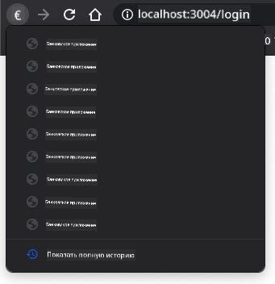

<!--
CO_OP_TRANSLATOR_METADATA:
{
  "original_hash": "8a07db14e75ac62f013b7de5df05981d",
  "translation_date": "2025-08-28T23:14:03+00:00",
  "source_file": "7-bank-project/1-template-route/README.md",
  "language_code": "ru"
}
-->
# Создание банковского приложения. Часть 1: HTML-шаблоны и маршруты в веб-приложении

## Викторина перед лекцией

[Викторина перед лекцией](https://ff-quizzes.netlify.app/web/quiz/41)

### Введение

С появлением JavaScript в браузерах веб-сайты стали более интерактивными и сложными, чем когда-либо. Веб-технологии теперь часто используются для создания полноценных приложений, которые работают прямо в браузере и называются [веб-приложениями](https://en.wikipedia.org/wiki/Web_application). Поскольку веб-приложения очень интерактивны, пользователи не хотят ждать полной перезагрузки страницы каждый раз, когда выполняется какое-либо действие. Именно поэтому JavaScript используется для обновления HTML напрямую через DOM, чтобы обеспечить более плавный пользовательский опыт.

В этом уроке мы заложим основы для создания банковского веб-приложения, используя HTML-шаблоны для создания нескольких экранов, которые можно отображать и обновлять без необходимости перезагрузки всей HTML-страницы.

### Предварительные требования

Для тестирования веб-приложения, которое мы создадим в этом уроке, вам понадобится локальный веб-сервер. Если у вас его нет, вы можете установить [Node.js](https://nodejs.org) и использовать команду `npx lite-server` из папки вашего проекта. Это создаст локальный веб-сервер и откроет ваше приложение в браузере.

### Подготовка

На вашем компьютере создайте папку с именем `bank` и файл с именем `index.html` внутри нее. Мы начнем с этого [шаблона HTML](https://en.wikipedia.org/wiki/Boilerplate_code):

```html
<!DOCTYPE html>
<html lang="en">
  <head>
    <meta charset="UTF-8">
    <meta name="viewport" content="width=device-width, initial-scale=1.0">
    <title>Bank App</title>
  </head>
  <body>
    <!-- This is where you'll work -->
  </body>
</html>
```

---

## HTML-шаблоны

Если вы хотите создать несколько экранов для веб-страницы, одним из решений будет создание отдельного HTML-файла для каждого экрана, который вы хотите отобразить. Однако у этого подхода есть свои неудобства:

- При переключении экранов приходится перезагружать весь HTML, что может быть медленным.
- Сложно делиться данными между разными экранами.

Другой подход — использовать только один HTML-файл и определить несколько [HTML-шаблонов](https://developer.mozilla.org/docs/Web/HTML/Element/template) с помощью элемента `<template>`. Шаблон — это повторно используемый HTML-блок, который не отображается браузером и должен быть создан во время выполнения с помощью JavaScript.

### Задача

Мы создадим банковское приложение с двумя экранами: страницей входа и панелью управления. Сначала добавим в тело HTML элемент-заполнитель, который мы будем использовать для отображения различных экранов нашего приложения:

```html
<div id="app">Loading...</div>
```

Мы присваиваем ему `id`, чтобы позже было проще найти его с помощью JavaScript.

> Совет: так как содержимое этого элемента будет заменено, можно добавить сообщение или индикатор загрузки, который будет отображаться, пока приложение загружается.

Далее добавим ниже HTML-шаблон для страницы входа. Пока что мы добавим туда только заголовок и секцию с ссылкой, которую будем использовать для навигации.

```html
<template id="login">
  <h1>Bank App</h1>
  <section>
    <a href="/dashboard">Login</a>
  </section>
</template>
```

Затем добавим еще один HTML-шаблон для страницы панели управления. Эта страница будет содержать различные секции:

- Заголовок с названием и ссылкой для выхода
- Текущий баланс банковского счета
- Список транзакций, отображаемый в таблице

```html
<template id="dashboard">
  <header>
    <h1>Bank App</h1>
    <a href="/login">Logout</a>
  </header>
  <section>
    Balance: 100$
  </section>
  <section>
    <h2>Transactions</h2>
    <table>
      <thead>
        <tr>
          <th>Date</th>
          <th>Object</th>
          <th>Amount</th>
        </tr>
      </thead>
      <tbody></tbody>
    </table>
  </section>
</template>
```

> Совет: при создании HTML-шаблонов, если вы хотите увидеть, как они будут выглядеть, вы можете закомментировать строки `<template>` и `</template>`, обернув их в `<!-- -->`.

✅ Как вы думаете, почему мы используем атрибуты `id` для шаблонов? Можно ли использовать что-то другое, например классы?

## Отображение шаблонов с помощью JavaScript

Если вы попробуете открыть текущий HTML-файл в браузере, вы увидите, что он застревает на отображении `Loading...`. Это потому, что нам нужно добавить JavaScript-код для создания и отображения HTML-шаблонов.

Создание шаблона обычно выполняется в 3 шага:

1. Найти элемент шаблона в DOM, например, с помощью [`document.getElementById`](https://developer.mozilla.org/docs/Web/API/Document/getElementById).
2. Клонировать элемент шаблона с помощью [`cloneNode`](https://developer.mozilla.org/docs/Web/API/Node/cloneNode).
3. Присоединить его к DOM под видимым элементом, например, с помощью [`appendChild`](https://developer.mozilla.org/docs/Web/API/Node/appendChild).

✅ Почему нам нужно клонировать шаблон перед его добавлением в DOM? Что, по вашему мнению, произойдет, если пропустить этот шаг?

### Задача

Создайте новый файл с именем `app.js` в папке вашего проекта и импортируйте этот файл в секцию `<head>` вашего HTML:

```html
<script src="app.js" defer></script>
```

Теперь в `app.js` создадим новую функцию `updateRoute`:

```js
function updateRoute(templateId) {
  const template = document.getElementById(templateId);
  const view = template.content.cloneNode(true);
  const app = document.getElementById('app');
  app.innerHTML = '';
  app.appendChild(view);
}
```

Здесь мы выполняем те самые 3 шага, описанные выше. Мы создаем шаблон с `id` `templateId` и помещаем его клонированное содержимое в наш заполнитель приложения. Обратите внимание, что мы используем `cloneNode(true)`, чтобы скопировать всю поддеревянную структуру шаблона.

Теперь вызовите эту функцию с одним из шаблонов и посмотрите на результат.

```js
updateRoute('login');
```

✅ Какова цель этого кода `app.innerHTML = '';`? Что произойдет, если его убрать?

## Создание маршрутов

Когда мы говорим о веб-приложении, *маршрутизация* означает сопоставление **URL-адресов** с конкретными экранами, которые должны отображаться. На веб-сайте с несколькими HTML-файлами это делается автоматически, так как пути файлов отражаются в URL. Например, с такими файлами в папке вашего проекта:

```
mywebsite/index.html
mywebsite/login.html
mywebsite/admin/index.html
```

Если вы создадите веб-сервер с корнем `mywebsite`, то сопоставление URL будет следующим:

```
https://site.com            --> mywebsite/index.html
https://site.com/login.html --> mywebsite/login.html
https://site.com/admin/     --> mywebsite/admin/index.html
```

Однако для нашего веб-приложения мы используем один HTML-файл, содержащий все экраны, поэтому это поведение по умолчанию нам не поможет. Нам нужно вручную создать это сопоставление и обновить отображаемый шаблон с помощью JavaScript.

### Задача

Мы будем использовать простой объект для реализации [карты](https://en.wikipedia.org/wiki/Associative_array) между путями URL и нашими шаблонами. Добавьте этот объект в начало вашего файла `app.js`.

```js
const routes = {
  '/login': { templateId: 'login' },
  '/dashboard': { templateId: 'dashboard' },
};
```

Теперь немного изменим функцию `updateRoute`. Вместо того чтобы передавать напрямую `templateId` в качестве аргумента, мы хотим сначала получить текущий URL, а затем использовать нашу карту, чтобы получить соответствующее значение `templateId`. Мы можем использовать [`window.location.pathname`](https://developer.mozilla.org/docs/Web/API/Location/pathname), чтобы получить только часть пути из URL.

```js
function updateRoute() {
  const path = window.location.pathname;
  const route = routes[path];

  const template = document.getElementById(route.templateId);
  const view = template.content.cloneNode(true);
  const app = document.getElementById('app');
  app.innerHTML = '';
  app.appendChild(view);
}
```

Здесь мы сопоставили объявленные маршруты с соответствующими шаблонами. Вы можете проверить, что это работает правильно, изменив URL вручную в вашем браузере.

✅ Что произойдет, если вы введете неизвестный путь в URL? Как мы могли бы это исправить?

## Добавление навигации

Следующий шаг для нашего приложения — добавить возможность переходить между страницами без необходимости вручную изменять URL. Это включает два аспекта:

1. Обновление текущего URL
2. Обновление отображаемого шаблона на основе нового URL

Мы уже позаботились о втором аспекте с помощью функции `updateRoute`, поэтому нам нужно разобраться, как обновить текущий URL.

Мы будем использовать JavaScript, а точнее [`history.pushState`](https://developer.mozilla.org/docs/Web/API/History/pushState), который позволяет обновлять URL и создавать новую запись в истории браузера без перезагрузки HTML.

> Примечание: хотя HTML-элемент якоря [`<a href>`](https://developer.mozilla.org/docs/Web/HTML/Element/a) можно использовать для создания гиперссылок на разные URL, он по умолчанию заставляет браузер перезагружать HTML. Необходимо предотвратить это поведение при обработке маршрутизации с помощью пользовательского JavaScript, используя функцию `preventDefault()` для события клика.

### Задача

Создадим новую функцию, которую можно использовать для навигации в нашем приложении:

```js
function navigate(path) {
  window.history.pushState({}, path, path);
  updateRoute();
}
```

Этот метод сначала обновляет текущий URL на основе переданного пути, а затем обновляет шаблон. Свойство `window.location.origin` возвращает корень URL, позволяя нам реконструировать полный URL из заданного пути.

Теперь, когда у нас есть эта функция, мы можем решить проблему, которая возникает, если путь не соответствует ни одному из определенных маршрутов. Мы изменим функцию `updateRoute`, добавив резервный вариант для одного из существующих маршрутов, если совпадение не найдено.

```js
function updateRoute() {
  const path = window.location.pathname;
  const route = routes[path];

  if (!route) {
    return navigate('/login');
  }

  ...
```

Если маршрут не найден, теперь мы будем перенаправлять на страницу `login`.

Теперь создадим функцию для получения URL при клике на ссылку и предотвращения стандартного поведения браузера:

```js
function onLinkClick(event) {
  event.preventDefault();
  navigate(event.target.href);
}
```

Завершим систему навигации, добавив привязки к нашим ссылкам *Login* и *Logout* в HTML.

```html
<a href="/dashboard" onclick="onLinkClick(event)">Login</a>
...
<a href="/login" onclick="onLinkClick(event)">Logout</a>
```

Объект `event` выше захватывает событие `click` и передает его в нашу функцию `onLinkClick`.

Используя атрибут [`onclick`](https://developer.mozilla.org/docs/Web/API/GlobalEventHandlers/onclick), привяжите событие `click` к JavaScript-коду, в данном случае вызову функции `navigate()`.

Попробуйте кликнуть по этим ссылкам, теперь вы должны иметь возможность перемещаться между различными экранами вашего приложения.

✅ Метод `history.pushState` является частью стандарта HTML5 и реализован [во всех современных браузерах](https://caniuse.com/?search=pushState). Если вы создаете веб-приложение для старых браузеров, есть трюк, который можно использовать вместо этого API: используя [хэш (`#`)](https://en.wikipedia.org/wiki/URI_fragment) перед путем, вы можете реализовать маршрутизацию, которая работает с обычной навигацией по якорям и не перезагружает страницу, так как ее цель — создавать внутренние ссылки на странице.

## Обработка кнопок "Назад" и "Вперед" в браузере

Использование `history.pushState` создает новые записи в истории навигации браузера. Вы можете проверить это, удерживая кнопку *назад* в вашем браузере, должно отобразиться что-то вроде этого:



Если вы попробуете несколько раз нажать кнопку назад, вы увидите, что текущий URL меняется, а история обновляется, но отображается один и тот же шаблон.

Это происходит потому, что приложение не знает, что нам нужно вызвать `updateRoute()` каждый раз, когда история меняется. Если вы посмотрите документацию [`history.pushState`](https://developer.mozilla.org/docs/Web/API/History/pushState), вы увидите, что если состояние меняется — то есть мы перешли на другой URL — событие [`popstate`](https://developer.mozilla.org/docs/Web/API/Window/popstate_event) будет вызвано. Мы используем это, чтобы исправить проблему.

### Задача

Чтобы убедиться, что отображаемый шаблон обновляется при изменении истории браузера, мы добавим новую функцию, которая вызывает `updateRoute()`. Мы сделаем это в конце нашего файла `app.js`:

```js
window.onpopstate = () => updateRoute();
updateRoute();
```

> Примечание: здесь мы использовали [стрелочную функцию](https://developer.mozilla.org/docs/Web/JavaScript/Reference/Functions/Arrow_functions) для объявления обработчика события `popstate` для краткости, но обычная функция работала бы так же.

Вот видео-напоминание о стрелочных функциях:

[](https://youtube.com/watch?v=OP6eEbOj2sc "Стрелочные функции")

> 🎥 Нажмите на изображение выше, чтобы посмотреть видео о стрелочных функциях.

Теперь попробуйте использовать кнопки "назад" и "вперед" в вашем браузере и проверьте, что отображаемый маршрут теперь корректно обновляется.

---

## 🚀 Задание

Добавьте новый шаблон и маршрут для третьей страницы, которая показывает информацию о создателях этого приложения.

## Викторина после лекции

[Викторина после лекции](https://ff-quizzes.netlify.app/web/quiz/42)

## Обзор и самостоятельное изучение

Маршрутизация — одна из удивительно сложных частей веб-разработки, особенно по мере того, как веб переходит от поведения с обновлением страниц к обновлениям страниц в одностраничных приложениях. Прочитайте немного о том, [как служба Azure Static Web App](https://docs.microsoft.com/azure/static-web-apps/routes/?WT.mc_id=academic-77807-sagibbon) обрабатывает маршрутизацию. Можете ли вы объяснить, почему некоторые из описанных в этом документе решений необходимы?

## Задание

[Улучшите маршрутизацию](assignment.md)

---

**Отказ от ответственности**:  
Этот документ был переведен с помощью сервиса автоматического перевода [Co-op Translator](https://github.com/Azure/co-op-translator). Несмотря на наши усилия обеспечить точность, автоматические переводы могут содержать ошибки или неточности. Оригинальный документ на его исходном языке следует считать авторитетным источником. Для получения критически важной информации рекомендуется профессиональный перевод человеком. Мы не несем ответственности за любые недоразумения или неправильные интерпретации, возникающие в результате использования данного перевода.