<!--
CO_OP_TRANSLATOR_METADATA:
{
  "original_hash": "7cbdbd132d39a2bb493e85bc2a9387cc",
  "translation_date": "2025-11-03T23:26:14+00:00",
  "source_file": "7-bank-project/2-forms/README.md",
  "language_code": "ru"
}
-->
# Создание банковского приложения, часть 2: форма входа и регистрации

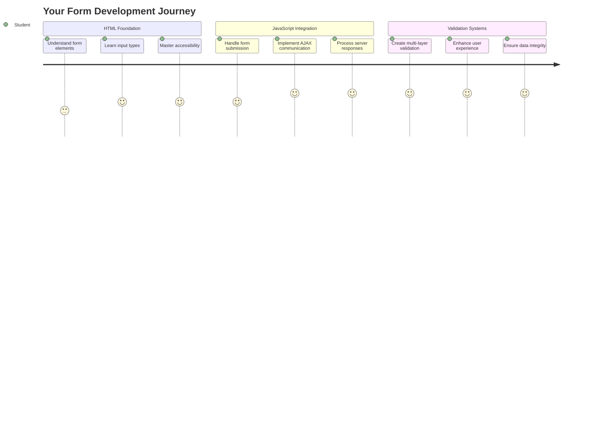

## Предварительный тест

[Предварительный тест](https://ff-quizzes.netlify.app/web/quiz/43)

Вы когда-нибудь заполняли форму онлайн, и она отклоняла формат вашей электронной почты? Или теряли всю информацию после нажатия кнопки отправки? Мы все сталкивались с такими неприятными ситуациями.

Формы — это мост между пользователями и функциональностью вашего приложения. Как и строгие протоколы, которые используют авиадиспетчеры для безопасного управления самолетами, хорошо спроектированные формы предоставляют четкую обратную связь и предотвращают дорогостоящие ошибки. Плохие формы, напротив, могут отпугнуть пользователей быстрее, чем недоразумение в переполненном аэропорту.

В этом уроке мы превратим ваше статическое банковское приложение в интерактивное. Вы научитесь создавать формы, которые проверяют ввод данных, взаимодействуют с серверами и предоставляют полезную обратную связь. Это как создание интерфейса управления, который позволяет пользователям ориентироваться в функциях вашего приложения.

К концу урока у вас будет полноценная система входа и регистрации с проверкой данных, которая поможет пользователям добиться успеха, а не разочарования.

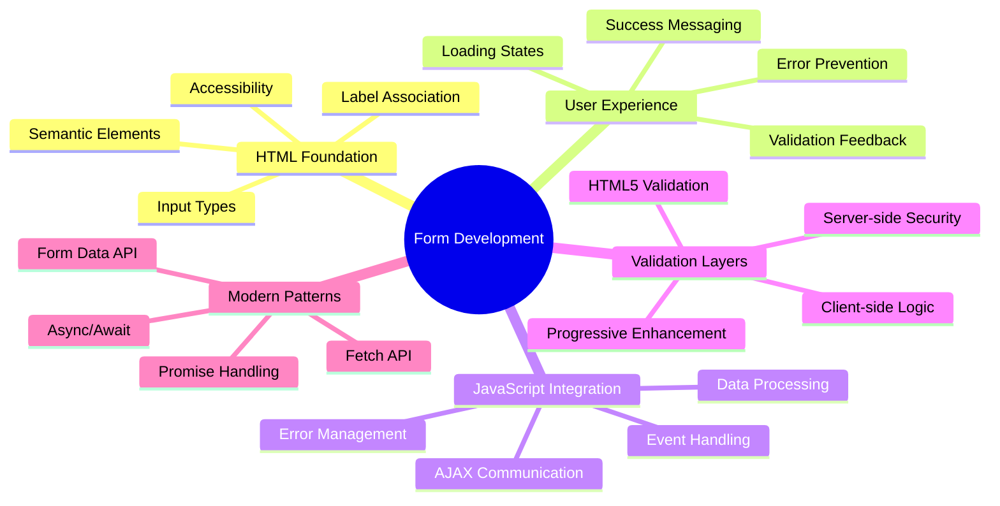

## Предварительные требования

Прежде чем начать создавать формы, убедитесь, что у вас все настроено правильно. Этот урок продолжает предыдущий, поэтому, если вы пропустили его, возможно, вам стоит вернуться и сначала освоить основы.

### Необходимая настройка

| Компонент | Статус | Описание |
|-----------|--------|-------------|
| [HTML-шаблоны](../1-template-route/README.md) | ✅ Обязательно | Основная структура банковского приложения |
| [Node.js](https://nodejs.org) | ✅ Обязательно | Среда выполнения JavaScript для сервера |
| [Сервер Bank API](../api/README.md) | ✅ Обязательно | Бэкэнд-сервис для хранения данных |

> 💡 **Совет для разработчиков**: Вам нужно будет одновременно запускать два отдельных сервера — один для фронтенда банковского приложения, а другой для бэкэнда API. Такая настройка отражает реальную разработку, где фронтенд и бэкэнд работают независимо.

### Конфигурация сервера

**Ваша среда разработки будет включать:**
- **Сервер фронтенда**: Обслуживает ваше банковское приложение (обычно порт `3000`)
- **Сервер бэкэнда API**: Обрабатывает хранение и извлечение данных (порт `5000`)
- **Оба сервера** могут работать одновременно без конфликтов

**Проверка подключения к API:**
```bash
curl http://localhost:5000/api
# Expected response: "Bank API v1.0.0"
```

**Если вы видите ответ с версией API, можно продолжать!**

---

## Понимание HTML-форм и элементов управления

HTML-формы — это способ общения пользователей с вашим веб-приложением. Представьте их как телеграфную систему, которая соединяла удаленные места в XIX веке — это протокол связи между намерениями пользователя и ответом приложения. При правильном проектировании они помогают избежать ошибок, направляют формат ввода и предоставляют полезные подсказки.

Современные формы значительно сложнее, чем простые текстовые поля. HTML5 ввел специализированные типы ввода, которые автоматически обрабатывают проверку электронной почты, форматирование чисел и выбор дат. Эти улучшения повышают доступность и удобство использования на мобильных устройствах.

### Основные элементы формы

**Строительные блоки, которые нужны каждой форме:**

```html
<!-- Basic form structure -->
<form id="userForm" method="POST">
  <label for="username">Username</label>
  <input id="username" name="username" type="text" required>
  
  <button type="submit">Submit</button>
</form>
```

**Что делает этот код:**
- **Создает** контейнер формы с уникальным идентификатором
- **Указывает** HTTP-метод для отправки данных
- **Ассоциирует** метки с полями ввода для доступности
- **Определяет** кнопку отправки для обработки формы

### Современные типы ввода и атрибуты

| Тип ввода | Назначение | Пример использования |
|------------|---------|---------------|
| `text` | Ввод текста | `<input type="text" name="username">` |
| `email` | Проверка электронной почты | `<input type="email" name="email">` |
| `password` | Скрытый ввод текста | `<input type="password" name="password">` |
| `number` | Ввод чисел | `<input type="number" name="balance" min="0">` |
| `tel` | Номера телефонов | `<input type="tel" name="phone">` |

> 💡 **Преимущество HTML5**: Использование специфических типов ввода обеспечивает автоматическую проверку, подходящие клавиатуры на мобильных устройствах и лучшую поддержку доступности без дополнительного JavaScript!

### Типы кнопок и их поведение

```html
<!-- Different button behaviors -->
<button type="submit">Save Data</button>     <!-- Submits the form -->
<button type="reset">Clear Form</button>    <!-- Resets all fields -->
<button type="button">Custom Action</button> <!-- No default behavior -->
```

**Что делает каждый тип кнопки:**
- **Кнопки отправки**: Запускают отправку формы и отправляют данные на указанный конечный адрес
- **Кнопки сброса**: Восстанавливают все поля формы до их начального состояния
- **Обычные кнопки**: Не имеют поведения по умолчанию, требуют пользовательского JavaScript для функциональности

> ⚠️ **Важное замечание**: Элемент `<input>` является самозакрывающимся и не требует закрывающего тега. Современная лучшая практика — писать `<input>` без косой черты.

### Создание формы входа

Теперь давайте создадим практическую форму входа, которая демонстрирует современные практики HTML-форм. Начнем с базовой структуры и постепенно улучшим ее, добавив функции доступности и проверки.

```html
<template id="login">
  <h1>Bank App</h1>
  <section>
    <h2>Login</h2>
    <form id="loginForm" novalidate>
      <div class="form-group">
        <label for="username">Username</label>
        <input id="username" name="user" type="text" required 
               autocomplete="username" placeholder="Enter your username">
      </div>
      <button type="submit">Login</button>
    </form>
  </section>
</template>
```

**Разбор происходящего:**
- **Структурирует** форму с помощью семантических элементов HTML5
- **Группирует** связанные элементы, используя контейнеры `div` с осмысленными классами
- **Ассоциирует** метки с полями ввода с помощью атрибутов `for` и `id`
- **Включает** современные атрибуты, такие как `autocomplete` и `placeholder`, для улучшения UX
- **Добавляет** `novalidate`, чтобы обрабатывать проверку с помощью JavaScript вместо стандартных настроек браузера

### Важность правильных меток

**Почему метки важны для современного веб-разработки:**

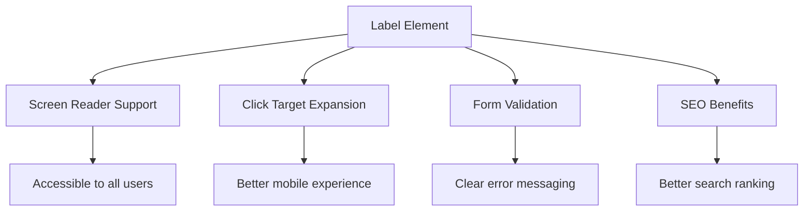

**Что делают правильные метки:**
- **Позволяют** экранным читалкам четко озвучивать поля формы
- **Расширяют** область клика (нажатие на метку фокусирует поле ввода)
- **Улучшают** удобство использования на мобильных устройствах благодаря увеличенным зонам касания
- **Поддерживают** проверку формы с осмысленными сообщениями об ошибках
- **Усиливают** SEO, предоставляя семантическое значение элементам формы

> 🎯 **Цель доступности**: Каждое поле ввода формы должно иметь связанную метку. Эта простая практика делает ваши формы удобными для всех, включая пользователей с ограниченными возможностями, и улучшает общий пользовательский опыт.

### Создание формы регистрации

Форма регистрации требует более детальной информации для создания полного аккаунта пользователя. Давайте создадим ее с использованием современных функций HTML5 и улучшенной доступности.

```html
<hr/>
<h2>Register</h2>
<form id="registerForm" novalidate>
  <div class="form-group">
    <label for="user">Username</label>
    <input id="user" name="user" type="text" required 
           autocomplete="username" placeholder="Choose a username">
  </div>
  
  <div class="form-group">
    <label for="currency">Currency</label>
    <input id="currency" name="currency" type="text" value="$" 
           required maxlength="3" placeholder="USD, EUR, etc.">
  </div>
  
  <div class="form-group">
    <label for="description">Account Description</label>
    <input id="description" name="description" type="text" 
           maxlength="100" placeholder="Personal savings, checking, etc.">
  </div>
  
  <div class="form-group">
    <label for="balance">Starting Balance</label>
    <input id="balance" name="balance" type="number" value="0" 
           min="0" step="0.01" placeholder="0.00">
  </div>
  
  <button type="submit">Create Account</button>
</form>
```

**В приведенном выше примере мы:**
- **Организовали** каждое поле в контейнеры div для лучшего оформления и макета
- **Добавили** соответствующие атрибуты `autocomplete` для поддержки автозаполнения браузером
- **Включили** полезный текст-заполнитель, чтобы направлять ввод пользователя
- **Установили** разумные значения по умолчанию с помощью атрибута `value`
- **Применили** атрибуты проверки, такие как `required`, `maxlength` и `min`
- **Использовали** `type="number"` для поля баланса с поддержкой десятичных чисел

### Исследование типов ввода и их поведения

**Современные типы ввода предоставляют расширенные возможности:**

| Функция | Преимущество | Пример |
|---------|---------|----------|
| `type="number"` | Цифровая клавиатура на мобильных устройствах | Удобный ввод баланса |
| `step="0.01"` | Контроль точности до десятых | Позволяет вводить копейки в валюте |
| `autocomplete` | Автозаполнение браузера | Быстрое завершение формы |
| `placeholder` | Контекстные подсказки | Направляет ожидания пользователя |

> 🎯 **Задача доступности**: Попробуйте навигацию по формам, используя только клавиатуру! Используйте `Tab` для перехода между полями, `Space` для отметки чекбоксов и `Enter` для отправки. Этот опыт поможет вам понять, как пользователи экранных читалок взаимодействуют с вашими формами.

### 🔄 **Педагогическая проверка**
**Понимание основ форм**: Перед реализацией JavaScript убедитесь, что вы понимаете:
- ✅ Как семантический HTML создает доступные структуры форм
- ✅ Почему типы ввода важны для мобильных клавиатур и проверки
- ✅ Связь между метками и элементами управления формой
- ✅ Как атрибуты формы влияют на поведение браузера по умолчанию

**Быстрый тест**: Что произойдет, если отправить форму без обработки JavaScript?
*Ответ: Браузер выполнит отправку по умолчанию, обычно перенаправляя на URL действия*

**Преимущества HTML5 форм**: Современные формы предоставляют:
- **Встроенную проверку**: Автоматическая проверка формата электронной почты и чисел
- **Оптимизацию для мобильных устройств**: Подходящие клавиатуры для разных типов ввода
- **Доступность**: Поддержка экранных читалок и навигации с помощью клавиатуры
- **Прогрессивное улучшение**: Работает даже при отключенном JavaScript

## Понимание методов отправки форм

Когда кто-то заполняет вашу форму и нажимает "Отправить", эти данные должны куда-то отправиться — обычно на сервер, который может их сохранить. Существует несколько способов, как это может происходить, и знание того, какой из них использовать, может избавить вас от головной боли в будущем.

Давайте рассмотрим, что на самом деле происходит, когда кто-то нажимает кнопку отправки.

### Поведение формы по умолчанию

Сначала давайте посмотрим, что происходит при базовой отправке формы:

**Протестируйте ваши текущие формы:**
1. Нажмите кнопку *Регистрация* в вашей форме
2. Наблюдайте изменения в адресной строке вашего браузера
3. Заметьте, как страница перезагружается, и данные появляются в URL


### Сравнение методов HTTP

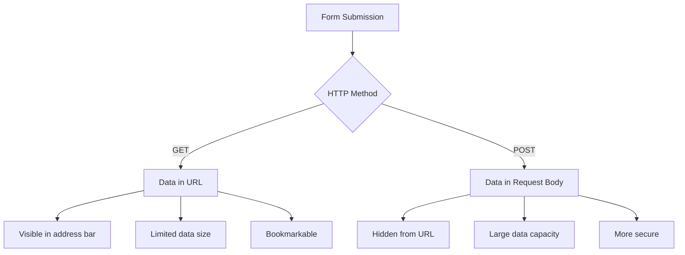

**Понимание различий:**

| Метод | Сценарий использования | Местоположение данных | Уровень безопасности | Ограничение размера |
|--------|----------|---------------|----------------|-------------|
| `GET` | Поисковые запросы, фильтры | Параметры URL | Низкий (видимый) | ~2000 символов |
| `POST` | Аккаунты пользователей, конфиденциальные данные | Тело запроса | Высокий (скрытый) | Нет практического ограничения |

**Понимание основных различий:**
- **GET**: Добавляет данные формы в URL в виде параметров запроса (подходит для операций поиска)
- **POST**: Включает данные в тело запроса (необходимо для конфиденциальной информации)
- **Ограничения GET**: Ограничение размера, видимые данные, сохранение истории браузера
- **Преимущества POST**: Большая емкость данных, защита конфиденциальности, поддержка загрузки файлов

> 💡 **Лучшая практика**: Используйте `GET` для форм поиска и фильтров (извлечение данных), используйте `POST` для регистрации пользователей, входа и создания данных.

### Настройка отправки формы

Давайте настроим вашу форму регистрации для правильного взаимодействия с бэкэндом API, используя метод POST:

```html
<form id="registerForm" action="//localhost:5000/api/accounts" 
      method="POST" novalidate>
```

**Что делает эта настройка:**
- **Направляет** отправку формы на конечный адрес вашего API
- **Использует** метод POST для безопасной передачи данных
- **Включает** `novalidate`, чтобы обрабатывать проверку с помощью JavaScript

### Тестирование отправки формы

**Следуйте этим шагам для тестирования вашей формы:**
1. **Заполните** форму регистрации своей информацией
2. **Нажмите** кнопку "Создать аккаунт"
3. **Наблюдайте** ответ сервера в вашем браузере

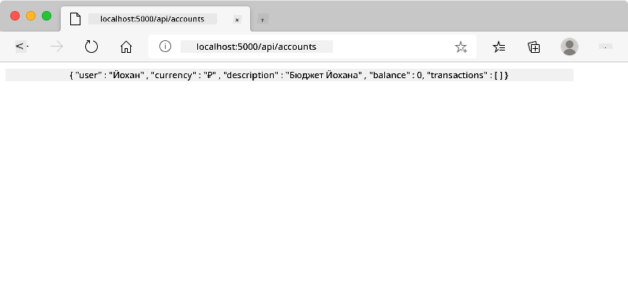

**Что вы должны увидеть:**
- **Браузер перенаправляет** на URL конечного адреса API
- **Ответ в формате JSON**, содержащий данные вашего нового аккаунта
- **Подтверждение сервера**, что аккаунт успешно создан

> 🧪 **Время экспериментов**: Попробуйте зарегистрироваться снова с тем же именем пользователя. Какой ответ вы получите? Это поможет вам понять, как сервер обрабатывает дублирующиеся данные и условия ошибок.

### Понимание ответов JSON

**Когда сервер успешно обрабатывает вашу форму:**
```json
{
  "user": "john_doe",
  "currency": "$",
  "description": "Personal savings",
  "balance": 100,
  "id": "unique_account_id"
}
```

**Этот ответ подтверждает:**
- **Создание** нового аккаунта с указанными вами данными
- **Присвоение** уникального идентификатора для дальнейшего использования
- **Возврат** всей информации об аккаунте для проверки
- **Указание** успешного сохранения в базе данных

## Современная обработка форм с помощью JavaScript

Традиционная отправка форм вызывает полное обновление страницы, как ранние космические миссии требовали полного сброса системы для корректировки курса. Такой подход нарушает пользовательский опыт и теряет состояние приложения.

Обработка форм с помощью JavaScript работает как современные системы навигации космических аппаратов — выполняя корректировки в реальном времени без потери контекста навигации. Мы можем перехватывать отправку форм, предоставлять мгновенную обратную связь, аккуратно обрабатывать ошибки и обновлять интерфейс на основе ответов сервера, сохраняя положение пользователя в приложении.

### Почему стоит избегать перезагрузки страницы?

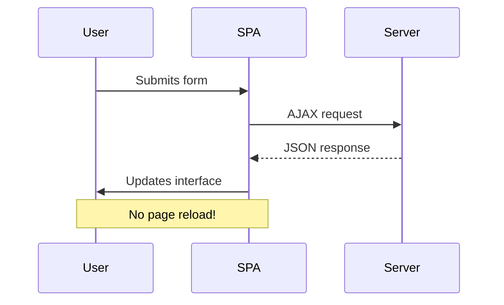

**Преимущества обработки форм с помощью JavaScript:**
- **Сохраняет** состояние приложения и контекст пользователя
- **Обеспечивает** мгновенную обратную связь и индикаторы загрузки
- **Позволяет** динамическую обработку ошибок и проверку
- **Создает** плавный, похожий на приложение пользовательский опыт
- **Поддерживает** условную логику на основе ответов сервера

### Переход от традиционных форм к современным

**Проблемы традиционного подхода:**
- **Перенаправляет** пользователей из вашего приложения
- **Теряет** текущее состояние приложения и контекст
- **Требует** полного обновления страницы для простых операций
- **Обеспечивает** ограниченный контроль над обратной связью с пользователем

**Преимущества современного подхода с JavaScript:**
- **Оставляет** пользователей внутри вашего приложения
- **Сохраняет** все состояние приложения и данные
- **Позволяет** проверку и обратную связь в реальном времени
- **Поддерживает** прогрессивное улучшение и доступность

### Реализация обработки форм с помощью JavaScript

Давайте заменим традиционную отправку формы на современную обработку событий с помощью JavaScript:

```html
<!-- Remove the action attribute and add event handling -->
<form id="registerForm" method="POST" novalidate>
```

**Добавьте логику регистрации в ваш файл `app.js`:**

```javascript
// Modern event-driven form handling
function register() {
  const registerForm = document.getElementById('registerForm');
  const formData = new FormData(registerForm);
  const data = Object.fromEntries(formData);
  const jsonData = JSON.stringify(data);
  
  console.log('Form data prepared:', data);
}

// Attach event listener when the page loads
document.addEventListener('DOMContentLoaded', () => {
  const registerForm = document.getElementById('registerForm');
  registerForm.addEventListener('submit', (event) => {
    event.preventDefault(); // Prevent default form submission
    register();
  });
});
```

**Разбор происходящего:**
- **Предотвращает** отправку формы по умолчанию с помощью `event.preventDefault()`
- **Извлекает** элемент формы с использованием современных методов выбора DOM
- **Получает** данные формы с помощью мощного API `FormData`
- **Преобразует** FormData в обычный объект с помощью `Object.fromEntries()`
- **Сериализует** данные в формат JSON для взаимодействия с сервером
- **Логирует** обработанные данные для отладки и проверки

### Понимание API FormData

**API FormData предоставляет мощные возможности для работы с формами:**
```javascript
// Example of what FormData captures
const formData = new FormData(registerForm);

// FormData automatically captures:
// {
//   "user": "john_doe",
//   "currency": "$", 
//   "description": "Personal account",
//   "balance": "100"
// }
```

**Преимущества API FormData:**
- **Полный сбор данных**: Захватывает все элементы формы, включая текст, файлы и сложные вводы
- **Осведомленность о типах**: Автоматически обрабатывает различные типы ввода без необходимости ручного кодирования
- **Эффективность**: Устраняет необходимость ручного сбора полей с помощью одного вызова API
- **Адаптивность**: Сохраняет функциональность при изменении структуры формы

### Создание функции для связи с сервером

Теперь давайте создадим надежную функцию для связи с вашим API сервером, используя современные шаблоны JavaScript:

```javascript
async function createAccount(account) {
  try {
    const response = await fetch('//localhost:5000/api/accounts', {
      method: 'POST',
      headers: { 
        'Content-Type': 'application/json',
        'Accept': 'application/json'
      },
      body: account
    });
    
    // Check if the response was successful
    if (!response.ok) {
      throw new Error(`HTTP error! status: ${response.status}`);
    }
    
    return await response.json();
  } catch (error) {
    console.error('Account creation failed:', error);
    return { error: error.message || 'Network error occurred' };
  }
}
```

**Понимание асинхронного JavaScript:**

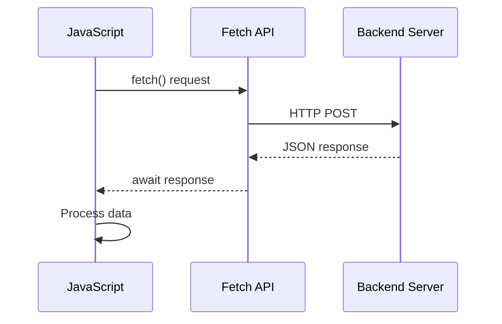

**Что делает эта современная реализация:**
- **Использует** `async/await` для читаемого асинхронного кода
- **Включает** правильную обработку ошибок с помощью блоков try/catch
- **Проверяет** статус ответа перед обработкой данных
- **Устанавливает** соответствующие заголовки для JSON-коммуникации
- **Предоставляет** подробные сообщения об ошибках для отладки
- **Возвращает** согласованную структуру данных для успешных и ошибочных случаев

### Сила современного Fetch API

**Преимущества Fetch API по сравнению с устаревшими методами:**

| Функция | Преимущество | Реализация |
|---------|--------------|------------|
| Основан на Promise | Чистый асинхронный код | `await fetch()` |
| Настройка запросов | Полный контроль HTTP | Заголовки, методы, тело |
| Обработка ответов | Гибкий парсинг данных | `.json()`, `.text()`, `.blob()` |
| Обработка ошибок | Полный захват ошибок | Блоки try/catch |

> 🎥 **Узнать больше**: [Учебник по Async/Await](https://youtube.com/watch?v=YwmlRkrxvkk) - Понимание асинхронных шаблонов JavaScript для современного веб-разработки.

**Ключевые концепции для связи с сервером:**
- **Асинхронные функции** позволяют приостанавливать выполнение для ожидания ответа сервера
- **Ключевое слово await** делает асинхронный код похожим на синхронный
- **Fetch API** предоставляет современные HTTP-запросы, основанные на Promise
- **Обработка ошибок** гарантирует, что ваше приложение корректно реагирует на проблемы сети

### Завершение функции регистрации

Давайте объединим все вместе и создадим полную, готовую к производству функцию регистрации:

```javascript
async function register() {
  const registerForm = document.getElementById('registerForm');
  const submitButton = registerForm.querySelector('button[type="submit"]');
  
  try {
    // Show loading state
    submitButton.disabled = true;
    submitButton.textContent = 'Creating Account...';
    
    // Process form data
    const formData = new FormData(registerForm);
    const jsonData = JSON.stringify(Object.fromEntries(formData));
    
    // Send to server
    const result = await createAccount(jsonData);
    
    if (result.error) {
      console.error('Registration failed:', result.error);
      alert(`Registration failed: ${result.error}`);
      return;
    }
    
    console.log('Account created successfully!', result);
    alert(`Welcome, ${result.user}! Your account has been created.`);
    
    // Reset form after successful registration
    registerForm.reset();
    
  } catch (error) {
    console.error('Unexpected error:', error);
    alert('An unexpected error occurred. Please try again.');
  } finally {
    // Restore button state
    submitButton.disabled = false;
    submitButton.textContent = 'Create Account';
  }
}
```

**Эта улучшенная реализация включает:**
- **Предоставляет** визуальную обратную связь во время отправки формы
- **Отключает** кнопку отправки, чтобы предотвратить повторные отправки
- **Обрабатывает** как ожидаемые, так и неожиданные ошибки корректно
- **Показывает** удобные для пользователя сообщения об успехе и ошибках
- **Сбрасывает** форму после успешной регистрации
- **Восстанавливает** состояние интерфейса независимо от результата

### Тестирование вашей реализации

**Откройте инструменты разработчика браузера и протестируйте регистрацию:**

1. **Откройте** консоль браузера (F12 → вкладка Console)
2. **Заполните** форму регистрации
3. **Нажмите** "Создать аккаунт"
4. **Наблюдайте** сообщения в консоли и обратную связь для пользователя


**Что вы должны увидеть:**
- **Состояние загрузки** появляется на кнопке отправки
- **Логи консоли** показывают подробную информацию о процессе
- **Сообщение об успехе** появляется при успешном создании аккаунта
- **Форма автоматически сбрасывается** после успешной отправки

> 🔒 **Соображения безопасности**: В настоящее время данные передаются через HTTP, что небезопасно для производства. В реальных приложениях всегда используйте HTTPS для шифрования передачи данных. Узнайте больше о [безопасности HTTPS](https://en.wikipedia.org/wiki/HTTPS) и почему это важно для защиты данных пользователей.

### 🔄 **Педагогическая проверка**
**Интеграция современного JavaScript**: Проверьте свое понимание асинхронной обработки форм:
- ✅ Как `event.preventDefault()` изменяет стандартное поведение формы?
- ✅ Почему API FormData более эффективен, чем ручной сбор полей?
- ✅ Как шаблоны async/await улучшают читаемость кода?
- ✅ Какую роль играет обработка ошибок в пользовательском опыте?

**Архитектура системы**: Ваша обработка формы демонстрирует:
- **Программирование, основанное на событиях**: Формы реагируют на действия пользователя без перезагрузки страницы
- **Асинхронная связь**: Запросы к серверу не блокируют пользовательский интерфейс
- **Обработка ошибок**: Корректное поведение при сбоях сетевых запросов
- **Управление состоянием**: Обновления интерфейса отражают ответы сервера
- **Прогрессивное улучшение**: Базовая функциональность работает, JavaScript улучшает её

**Профессиональные шаблоны**: Вы реализовали:
- **Принцип единственной ответственности**: Функции имеют четкие, сфокусированные цели
- **Границы ошибок**: Блоки try/catch предотвращают сбои приложения
- **Обратная связь для пользователя**: Состояния загрузки и сообщения об успехе/ошибках
- **Преобразование данных**: FormData в JSON для связи с сервером

## Комплексная проверка формы

Проверка формы предотвращает неприятный опыт обнаружения ошибок только после отправки. Как и множество резервных систем на Международной космической станции, эффективная проверка использует несколько уровней проверки.

Оптимальный подход сочетает проверку на уровне браузера для мгновенной обратной связи, проверку на уровне JavaScript для улучшения пользовательского опыта и серверную проверку для обеспечения безопасности и целостности данных. Эта избыточность гарантирует как удовлетворение пользователей, так и защиту системы.

### Понимание уровней проверки

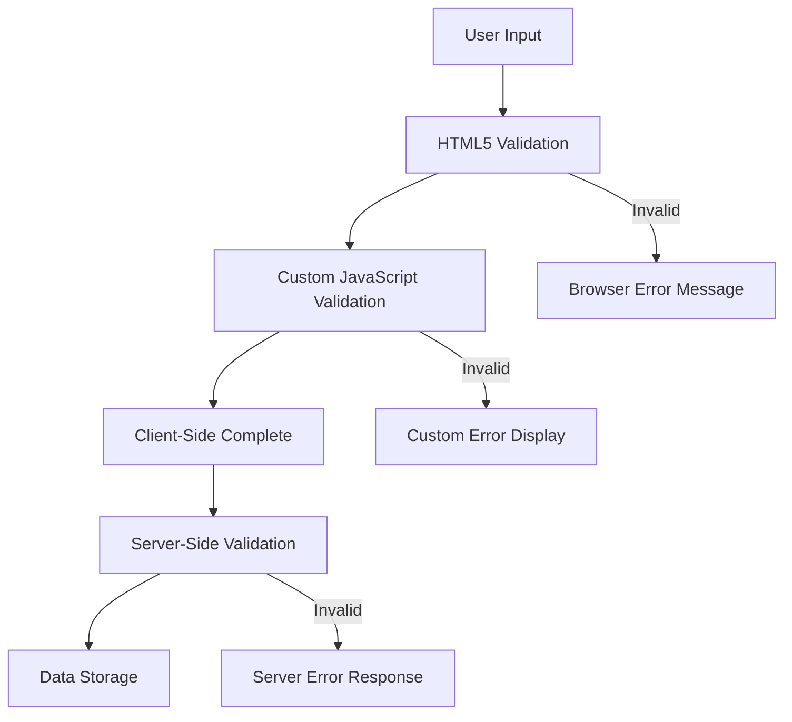

**Стратегия многоуровневой проверки:**
- **Проверка HTML5**: Мгновенные проверки на уровне браузера
- **Проверка JavaScript**: Пользовательская логика и улучшение опыта
- **Серверная проверка**: Финальная проверка безопасности и целостности данных
- **Прогрессивное улучшение**: Работает даже если JavaScript отключен

### Атрибуты проверки HTML5

**Современные инструменты проверки, доступные вам:**

| Атрибут | Назначение | Пример использования | Поведение браузера |
|---------|------------|-----------------------|--------------------|
| `required` | Обязательные поля | `<input required>` | Предотвращает отправку пустой формы |
| `minlength`/`maxlength` | Ограничения длины текста | `<input maxlength="20">` | Устанавливает ограничения на количество символов |
| `min`/`max` | Диапазоны чисел | `<input min="0" max="1000">` | Проверяет границы чисел |
| `pattern` | Пользовательские правила регулярных выражений | `<input pattern="[A-Za-z]+">` | Соответствует определенным форматам |
| `type` | Проверка типа данных | `<input type="email">` | Проверка формата данных |

### Стилизация проверки с помощью CSS

**Создайте визуальную обратную связь для состояний проверки:**

```css
/* Valid input styling */
input:valid {
  border-color: #28a745;
  background-color: #f8fff9;
}

/* Invalid input styling */
input:invalid {
  border-color: #dc3545;
  background-color: #fff5f5;
}

/* Focus states for better accessibility */
input:focus:valid {
  box-shadow: 0 0 0 0.2rem rgba(40, 167, 69, 0.25);
}

input:focus:invalid {
  box-shadow: 0 0 0 0.2rem rgba(220, 53, 69, 0.25);
}
```

**Что достигают эти визуальные подсказки:**
- **Зеленые границы**: Указывают на успешную проверку, как зеленый свет в центре управления
- **Красные границы**: Сигнализируют об ошибках проверки, требующих внимания
- **Выделение фокуса**: Обеспечивает четкий визуальный контекст для текущего местоположения ввода
- **Согласованная стилизация**: Устанавливает предсказуемые шаблоны интерфейса, которые пользователи могут освоить

> 💡 **Совет**: Используйте псевдоклассы CSS `:valid` и `:invalid` для предоставления мгновенной визуальной обратной связи во время ввода, создавая отзывчивый и полезный интерфейс.

### Реализация комплексной проверки

Давайте улучшим вашу форму регистрации с помощью надежной проверки, которая обеспечивает отличный пользовательский опыт и качество данных:

```html
<form id="registerForm" method="POST" novalidate>
  <div class="form-group">
    <label for="user">Username <span class="required">*</span></label>
    <input id="user" name="user" type="text" required 
           minlength="3" maxlength="20" 
           pattern="[a-zA-Z0-9_]+" 
           autocomplete="username"
           title="Username must be 3-20 characters, letters, numbers, and underscores only">
    <small class="form-text">Choose a unique username (3-20 characters)</small>
  </div>
  
  <div class="form-group">
    <label for="currency">Currency <span class="required">*</span></label>
    <input id="currency" name="currency" type="text" required 
           value="$" maxlength="3" 
           pattern="[A-Z$€£¥₹]+" 
           title="Enter a valid currency symbol or code">
    <small class="form-text">Currency symbol (e.g., $, €, £)</small>
  </div>
  
  <div class="form-group">
    <label for="description">Account Description</label>
    <input id="description" name="description" type="text" 
           maxlength="100" 
           placeholder="Personal savings, checking, etc.">
    <small class="form-text">Optional description (up to 100 characters)</small>
  </div>
  
  <div class="form-group">
    <label for="balance">Starting Balance</label>
    <input id="balance" name="balance" type="number" 
           value="0" min="0" step="0.01" 
           title="Enter a positive number for your starting balance">
    <small class="form-text">Initial account balance (minimum $0.00)</small>
  </div>
  
  <button type="submit">Create Account</button>
</form>
```

**Понимание улучшенной проверки:**
- **Сочетает** индикаторы обязательных полей с полезными описаниями
- **Включает** атрибуты `pattern` для проверки форматов
- **Предоставляет** атрибуты `title` для доступности и подсказок
- **Добавляет** вспомогательный текст для направления ввода пользователя
- **Использует** семантическую структуру HTML для лучшей доступности

### Расширенные правила проверки

**Что достигает каждое правило проверки:**

| Поле | Правила проверки | Пользовательская выгода |
|------|------------------|-------------------------|
| Имя пользователя | `required`, `minlength="3"`, `maxlength="20"`, `pattern="[a-zA-Z0-9_]+"` | Обеспечивает допустимые, уникальные идентификаторы |
| Валюта | `required`, `maxlength="3"`, `pattern="[A-Z$€£¥₹]+"` | Принимает распространенные символы валют |
| Баланс | `min="0"`, `step="0.01"`, `type="number"` | Предотвращает отрицательные значения баланса |
| Описание | `maxlength="100"` | Разумные ограничения длины |

### Тестирование поведения проверки

**Попробуйте следующие сценарии проверки:**
1. **Отправьте** форму с пустыми обязательными полями
2. **Введите** имя пользователя короче 3 символов
3. **Попробуйте** специальные символы в поле имени пользователя
4. **Введите** отрицательное значение баланса

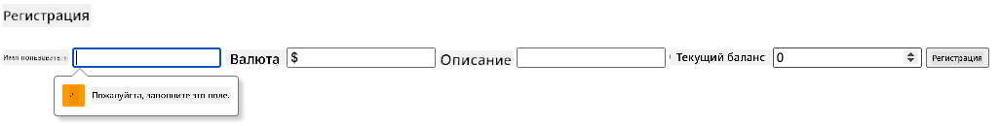

**Что вы заметите:**
- **Браузер отображает** стандартные сообщения о проверке
- **Изменения стиля** на основе состояний `:valid` и `:invalid`
- **Отправка формы** блокируется, пока все проверки не пройдут
- **Фокус автоматически** перемещается на первое неверное поле

### Клиентская vs серверная проверка

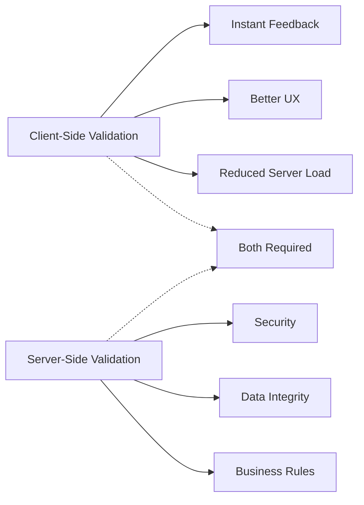

**Почему нужны оба уровня:**
- **Клиентская проверка**: Обеспечивает мгновенную обратную связь и улучшает пользовательский опыт
- **Серверная проверка**: Гарантирует безопасность и обрабатывает сложные бизнес-правила
- **Сочетанный подход**: Создает надежные, удобные и безопасные приложения
- **Прогрессивное улучшение**: Работает даже при отключенном JavaScript

> 🛡️ **Напоминание о безопасности**: Никогда не доверяйте только клиентской проверке! Злоумышленники могут обойти клиентские проверки, поэтому серверная проверка необходима для безопасности и целостности данных.

### ⚡ **Что вы можете сделать за следующие 5 минут**
- [ ] Протестируйте вашу форму с неверными данными, чтобы увидеть сообщения о проверке
- [ ] Попробуйте отправить форму с отключенным JavaScript, чтобы увидеть проверку HTML5
- [ ] Откройте инструменты разработчика браузера и проверьте данные формы, отправляемые на сервер
- [ ] Экспериментируйте с различными типами ввода, чтобы увидеть изменения клавиатуры на мобильных устройствах

### 🎯 **Что вы можете достичь за этот час**
- [ ] Завершите тест после урока и поймите концепции обработки форм
- [ ] Реализуйте вызов проверки с реальной обратной связью
- [ ] Добавьте стили CSS для создания профессионально выглядящих форм
- [ ] Создайте обработку ошибок для дублирующихся имен пользователей и ошибок сервера
- [ ] Добавьте поля подтверждения пароля с проверкой совпадения

### 📅 **Ваш недельный путь к мастерству работы с формами**
- [ ] Завершите приложение для банковских операций с расширенными функциями форм
- [ ] Реализуйте возможность загрузки файлов для фотографий профиля или документов
- [ ] Добавьте многошаговые формы с индикаторами прогресса и управлением состоянием
- [ ] Создайте динамические формы, которые адаптируются на основе выбора пользователя
- [ ] Реализуйте автосохранение формы и восстановление для улучшения пользовательского опыта
- [ ] Добавьте расширенную проверку, такую как подтверждение электронной почты и форматирование номера телефона

### 🌟 **Ваш месячный путь к мастерству фронтенд-разработки**
- [ ] Создайте сложные приложения с формами, включающими условную логику и рабочие процессы
- [ ] Изучите библиотеки и фреймворки для форм для быстрого развития
- [ ] Освойте рекомендации по доступности и принципы инклюзивного дизайна
- [ ] Реализуйте интернационализацию и локализацию для глобальных форм
- [ ] Создайте библиотеки компонентов форм и системы дизайна
- [ ] Внесите вклад в проекты с открытым исходным кодом и поделитесь лучшими практиками

## 🎯 Ваш график освоения разработки форм

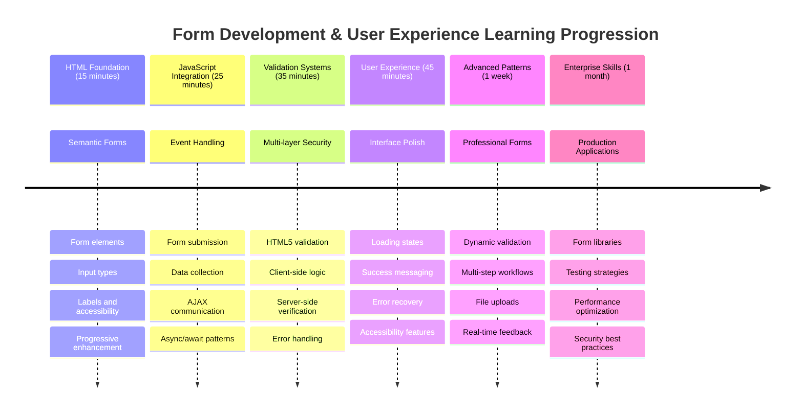

### 🛠️ Резюме вашего набора инструментов для разработки форм

После завершения этого урока вы освоили:
- **HTML5 Формы**: Семантическая структура, типы ввода и функции доступности
- **Обработка форм на JavaScript**: Управление событиями, сбор данных и AJAX-коммуникация
- **Архитектура проверки**: Многоуровневая проверка для безопасности и пользовательского опыта
- **Асинхронное программирование**: Современный Fetch API и шаблоны async/await
- **Управление ошибками**: Полная обработка ошибок и системы обратной связи для пользователей
- **Дизайн пользовательского опыта**: Состояния загрузки, сообщения об успехе и восстановление после ошибок
- **Прогрессивное улучшение**: Формы, которые работают во всех браузерах и с любыми возможностями

**Применение в реальном мире**: Ваши навыки разработки форм применимы непосредственно к:
- **Приложениям электронной коммерции**: Процессы оформления заказа, регистрация аккаунтов и формы оплаты
- **Корпоративному программному обеспечению**: Системы ввода данных, интерфейсы отчетности и рабочие процессы
- **Управлению контентом**: Платформы публикации, пользовательский контент и административные интерфейсы
- **Финансовым приложениям**: Интерфейсы банковских операций, инвестиционные платформы и системы транзакций
- **Системам здравоохранения**: Порталы пациентов, расписание встреч и формы медицинских записей
- **Образовательным платформам**: Регистрация на курсы, инструменты оценки и системы управления обучением

**Приобретенные профессиональные навыки**: Теперь вы можете:
- **Проектировать** доступные формы, которые работают для всех пользователей, включая людей с ограниченными возможностями
- **Реализовывать** безопасную проверку форм, предотвращающую повреждение данных и уязвимости безопасности
- **Создавать** отзывчивые пользовательские интерфейсы, предоставляющие четкую обратную связь и руководство
- **Отлаживать** сложные взаимодействия форм с использованием инструментов разработчика браузера и анализа сети
- **Оптимизировать** производительность форм через эффективную обработку данных и стратегии проверки

**Освоенные концепции фронтенд-разработки**:
- **Архитектура, основанная на событиях**: Обработка взаимодействий с пользователем и системы отклика
- **Асинхронное программирование**: Неблокирующая связь с сервером и обработка ошибок
- **Проверка данных**: Клиентская и серверная проверка безопасности и целостности
- **Дизайн пользовательского опыта**: Интуитивные интерфейсы, которые направляют пользователей к успеху
- **Инженерия доступности**: Инклюзивный дизайн, который работает для разнообразных потребностей пользователей

**Следующий уровень**: Вы готовы изучить расширенные библиотеки форм, реализовать сложные правила проверки или создать системы сбора данных корпоративного уровня!

🌟 **Достижение разблокировано**: Вы создали полную систему обработки форм с профессиональной проверкой, обработкой ошибок и шаблонами пользовательского опыта!

---


---

## Вызов GitHub Copilot Agent 🚀

Используйте режим Agent, чтобы выполнить следующий вызов:

**Описание:** Улучшите форму регистрации с помощью комплексной клиентской проверки и обратной связи для пользователя. Этот вызов поможет вам попрактиковаться в проверке форм, обработке ошибок и улучшении пользовательского опыта с интерактивной обратной связью.
**Запрос:** Создайте полную систему проверки формы для регистрационной формы, которая включает: 1) Проверку в реальном времени для каждого поля по мере ввода пользователем, 2) Пользовательские сообщения об ошибках, которые появляются под каждым полем ввода, 3) Поле подтверждения пароля с проверкой совпадения, 4) Визуальные индикаторы (например, зеленые галочки для валидных полей и красные предупреждения для невалидных), 5) Кнопку отправки, которая становится активной только при успешной проверке всех полей. Используйте атрибуты проверки HTML5, CSS для стилизации состояний проверки и JavaScript для интерактивного поведения.

Узнайте больше о [режиме агента](https://code.visualstudio.com/blogs/2025/02/24/introducing-copilot-agent-mode) здесь.

## 🚀 Задача

Покажите сообщение об ошибке в HTML, если пользователь уже существует.

Вот пример того, как может выглядеть итоговая страница входа после небольшой стилизации:

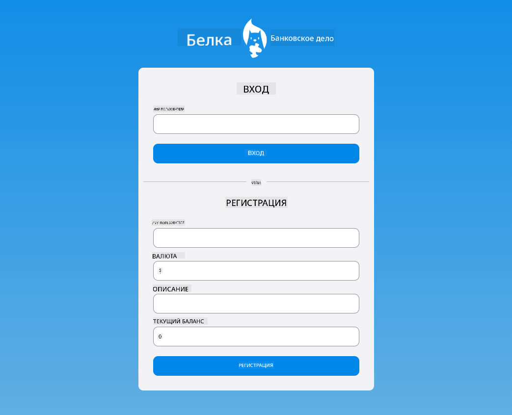

## Викторина после лекции

[Викторина после лекции](https://ff-quizzes.netlify.app/web/quiz/44)

## Обзор и самостоятельное изучение

Разработчики проявляют большую креативность в создании форм, особенно в стратегиях проверки. Узнайте о различных подходах к созданию форм, изучив [CodePen](https://codepen.com); сможете ли вы найти интересные и вдохновляющие примеры форм?

## Задание

[Стилизуйте ваше банковское приложение](assignment.md)

---

**Отказ от ответственности**:  
Этот документ был переведен с использованием сервиса автоматического перевода [Co-op Translator](https://github.com/Azure/co-op-translator). Несмотря на наши усилия обеспечить точность, автоматические переводы могут содержать ошибки или неточности. Оригинальный документ на его родном языке следует считать авторитетным источником. Для получения критически важной информации рекомендуется профессиональный перевод человеком. Мы не несем ответственности за любые недоразумения или неправильные интерпретации, возникающие в результате использования данного перевода.