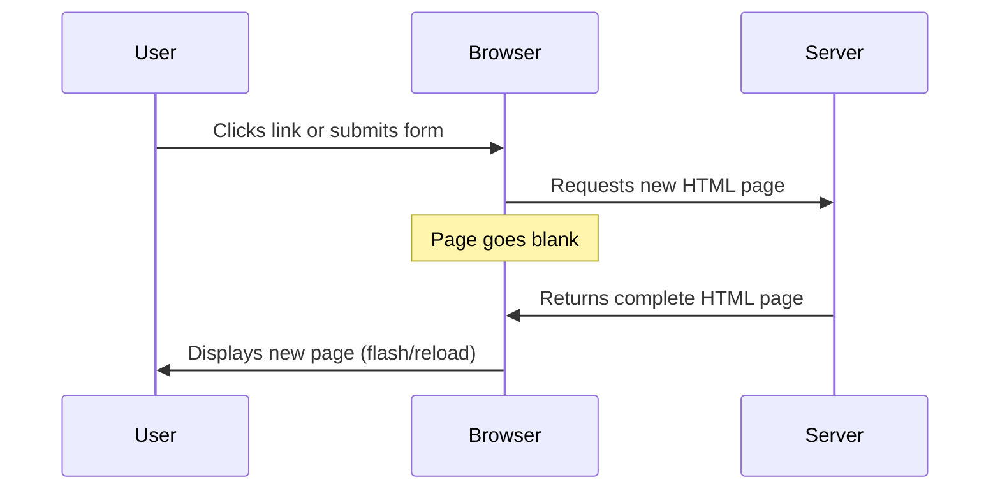
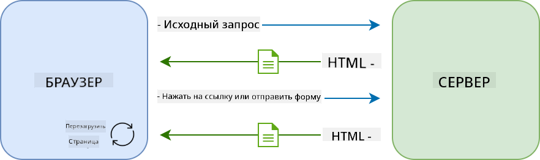
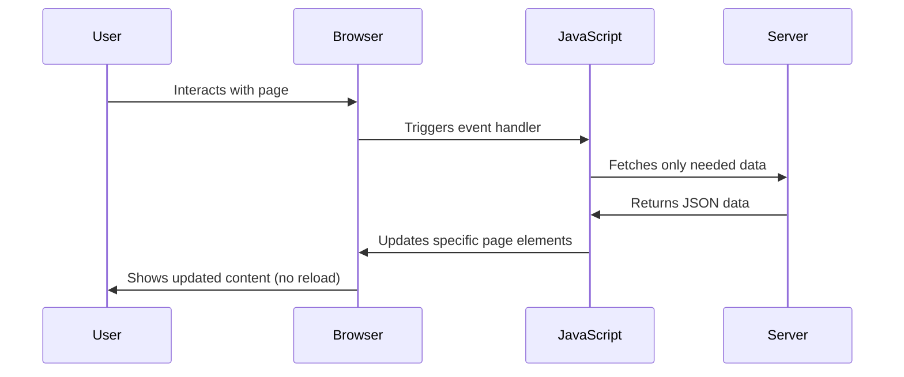
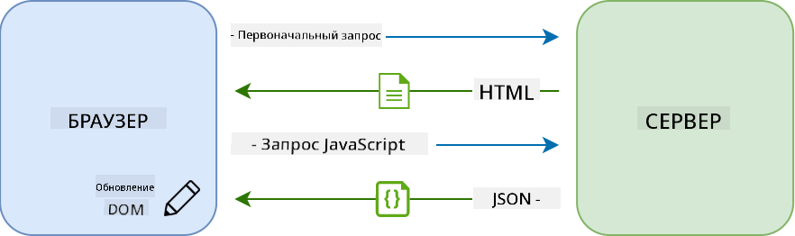
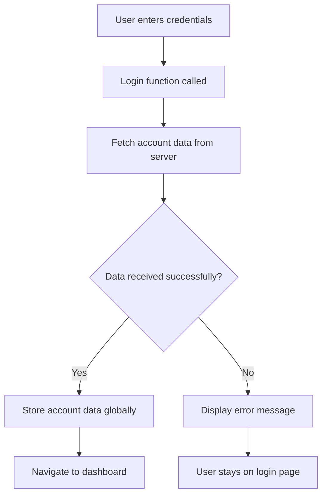
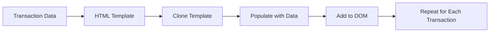
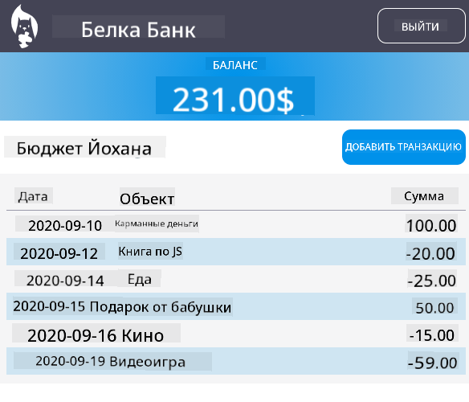

<!--
CO_OP_TRANSLATOR_METADATA:
{
  "original_hash": "2c1164912414820c8efd699b43f64954",
  "translation_date": "2025-10-22T22:23:25+00:00",
  "source_file": "7-bank-project/3-data/README.md",
  "language_code": "ru"
}
-->
# Создание банковского приложения, часть 3: методы получения и использования данных

Представьте себе компьютер на борту корабля Enterprise из «Звездного пути» — когда капитан Пикар запрашивает статус корабля, информация появляется мгновенно, без перезагрузки интерфейса. Именно такой плавный поток данных мы создаем здесь с помощью динамического получения данных.

Сейчас ваше банковское приложение похоже на печатную газету — информативно, но статично. Мы превратим его в нечто похожее на центр управления полетами NASA, где данные поступают непрерывно и обновляются в реальном времени, не прерывая работу пользователя.

Вы научитесь асинхронно взаимодействовать с серверами, обрабатывать данные, которые поступают в разное время, и преобразовывать сырую информацию в полезную для пользователей. Это и есть разница между демонстрационной версией и готовым к производству программным обеспечением.

## Тест перед лекцией

[Тест перед лекцией](https://ff-quizzes.netlify.app/web/quiz/45)

### Предварительные требования

Перед тем как углубиться в получение данных, убедитесь, что у вас готовы следующие компоненты:

- **Предыдущий урок**: Завершите [форму входа и регистрации](../2-forms/README.md) — мы будем строить на этой основе.
- **Локальный сервер**: Установите [Node.js](https://nodejs.org) и [запустите сервер API](../api/README.md), чтобы предоставить данные аккаунта.
- **Соединение с API**: Проверьте соединение с сервером с помощью этой команды:

```bash
curl http://localhost:5000/api
# Expected response: "Bank API v1.0.0"
```

Этот быстрый тест гарантирует, что все компоненты правильно взаимодействуют:
- Проверяет, что Node.js работает корректно на вашей системе.
- Подтверждает, что ваш сервер API активен и отвечает.
- Убеждает, что ваше приложение может связаться с сервером (как проверка радиосвязи перед миссией).

---

## Понимание получения данных в современных веб-приложениях

Способы обработки данных веб-приложениями значительно изменились за последние два десятилетия. Понимание этой эволюции поможет вам оценить, почему современные методы, такие как AJAX и Fetch API, настолько мощны и почему они стали необходимыми инструментами для веб-разработчиков.

Давайте рассмотрим, как работали традиционные веб-сайты по сравнению с динамическими, отзывчивыми приложениями, которые мы создаем сегодня.

### Традиционные многостраничные приложения (MPA)

В первые дни веба каждый клик был похож на переключение каналов на старом телевизоре — экран становился пустым, а затем медленно загружал новый контент. Это была реальность ранних веб-приложений, где каждое взаимодействие означало полную перезагрузку страницы.





**Почему этот подход казался неудобным:**
- Каждый клик означал полную перезагрузку страницы.
- Пользователи прерывались на середине мысли из-за раздражающих миганий страницы.
- Ваше интернет-соединение работало на пределе, загружая один и тот же заголовок и нижний колонтитул снова и снова.
- Приложения больше походили на просмотр картотеки, чем на использование программного обеспечения.

### Современные одностраничные приложения (SPA)

AJAX (асинхронный JavaScript и XML) полностью изменил эту парадигму. Как модульная конструкция Международной космической станции, где астронавты могут заменять отдельные компоненты без перестройки всей структуры, AJAX позволяет обновлять конкретные части веб-страницы без перезагрузки всего. Несмотря на то, что в названии упоминается XML, сегодня мы в основном используем JSON, но основной принцип остается: обновлять только то, что нужно.





**Почему SPA намного удобнее:**
- Обновляются только те части, которые действительно изменились (умно, правда?).
- Больше никаких резких прерываний — пользователи остаются в потоке.
- Меньше данных передается по сети, что означает более быструю загрузку.
- Все кажется быстрым и отзывчивым, как приложения на вашем телефоне.

### Эволюция к современному Fetch API

Современные браузеры предоставляют [`Fetch` API](https://developer.mozilla.org/docs/Web/API/Fetch_API), который заменяет устаревший [`XMLHttpRequest`](https://developer.mozilla.org/docs/Web/API/XMLHttpRequest/Using_XMLHttpRequest). Как разница между использованием телеграфа и электронной почты, Fetch API использует промисы для более чистого асинхронного кода и естественно обрабатывает JSON.

| Функция | XMLHttpRequest | Fetch API |
|---------|----------------|----------|
| **Синтаксис** | Сложный, основанный на обратных вызовах | Чистый, основанный на промисах |
| **Обработка JSON** | Требуется ручное парсирование | Встроенный метод `.json()` |
| **Обработка ошибок** | Ограниченная информация об ошибках | Полная информация об ошибках |
| **Современная поддержка** | Совместимость с устаревшими системами | ES6+ промисы и async/await |

> 💡 **Совместимость с браузерами**: Хорошие новости — Fetch API работает во всех современных браузерах! Если вам интересно узнать о конкретных версиях, [caniuse.com](https://caniuse.com/fetch) предоставит полную информацию о совместимости.
> 
**Итог:**
- Отлично работает в Chrome, Firefox, Safari и Edge (везде, где находятся ваши пользователи).
- Только Internet Explorer требует дополнительной помощи (и честно говоря, пора отпустить IE).
- Идеально подходит для элегантных async/await паттернов, которые мы будем использовать позже.

### Реализация входа пользователя и получения данных

Теперь давайте реализуем систему входа, которая преобразует ваше банковское приложение из статического дисплея в функциональное приложение. Как протоколы аутентификации, используемые в защищенных военных объектах, мы проверим учетные данные пользователя, а затем предоставим доступ к его конкретным данным.

Мы будем строить это постепенно, начиная с базовой аутентификации и затем добавляя возможности получения данных.

#### Шаг 1: Создание основы функции входа

Откройте ваш файл `app.js` и добавьте новую функцию `login`. Она будет обрабатывать процесс аутентификации пользователя:

```javascript
async function login() {
  const loginForm = document.getElementById('loginForm');
  const user = loginForm.user.value;
}
```

**Разберем это:**
- Ключевое слово `async` говорит JavaScript: «Эй, эта функция может потребовать ожидания».
- Мы находим форму на странице (ничего сложного, просто ищем ее по ID).
- Затем извлекаем то, что пользователь ввел в качестве имени пользователя.
- Вот хитрость: вы можете получить доступ к любому элементу формы через его атрибут `name` — не нужно дополнительных вызовов getElementById!

> 💡 **Шаблон доступа к форме**: Каждый элемент управления формой может быть доступен через его имя (установленное в HTML с помощью атрибута `name`) как свойство элемента формы. Это обеспечивает чистый и удобочитаемый способ получения данных формы.

#### Шаг 2: Создание функции получения данных аккаунта

Далее мы создадим отдельную функцию для получения данных аккаунта с сервера. Это следует той же схеме, что и ваша функция регистрации, но сосредоточено на получении данных:

```javascript
async function getAccount(user) {
  try {
    const response = await fetch('//localhost:5000/api/accounts/' + encodeURIComponent(user));
    return await response.json();
  } catch (error) {
    return { error: error.message || 'Unknown error' };
  }
}
```

**Что делает этот код:**
- **Использует** современный `fetch` API для асинхронного запроса данных.
- **Формирует** URL-адрес GET-запроса с параметром имени пользователя.
- **Применяет** `encodeURIComponent()` для безопасной обработки специальных символов в URL.
- **Преобразует** ответ в формат JSON для удобной манипуляции данными.
- **Обрабатывает** ошибки аккуратно, возвращая объект ошибки вместо сбоя.

> ⚠️ **Примечание по безопасности**: Функция `encodeURIComponent()` обрабатывает специальные символы в URL. Как системы кодирования, используемые в военно-морских коммуникациях, она гарантирует, что ваше сообщение прибудет точно так, как задумано, предотвращая неправильную интерпретацию символов, таких как "#" или "&".
> 
**Почему это важно:**
- Предотвращает сбои URL из-за специальных символов.
- Защищает от атак с манипуляцией URL.
- Гарантирует, что сервер получает данные в нужном виде.
- Следует принципам безопасного кодирования.

#### Понимание HTTP GET-запросов

Вот что может вас удивить: когда вы используете `fetch` без дополнительных опций, он автоматически создает [`GET`](https://developer.mozilla.org/docs/Web/HTTP/Methods/GET) запрос. Это идеально подходит для того, что мы делаем — спрашиваем у сервера: «Эй, можно мне посмотреть данные аккаунта этого пользователя?»

Думайте о GET-запросах как о вежливой просьбе взять книгу в библиотеке — вы запрашиваете доступ к тому, что уже существует. POST-запросы (которые мы использовали для регистрации) больше похожи на отправку новой книги для добавления в коллекцию.

| GET-запрос | POST-запрос |
|------------|-------------|
| **Цель** | Получение существующих данных | Отправка новых данных на сервер |
| **Параметры** | В пути URL/строке запроса | В теле запроса |
| **Кэширование** | Может быть кэшировано браузерами | Обычно не кэшируется |
| **Безопасность** | Видно в URL/логах | Скрыто в теле запроса |

#### Шаг 3: Объединение всех частей

Теперь самая приятная часть — давайте подключим вашу функцию получения данных аккаунта к процессу входа. Здесь все становится на свои места:

```javascript
async function login() {
  const loginForm = document.getElementById('loginForm');
  const user = loginForm.user.value;
  const data = await getAccount(user);

  if (data.error) {
    return console.log('loginError', data.error);
  }

  account = data;
  navigate('/dashboard');
}
```

Эта функция следует четкой последовательности:
- Извлекает имя пользователя из ввода формы.
- Запрашивает данные аккаунта пользователя с сервера.
- Обрабатывает любые ошибки, возникающие в процессе.
- Сохраняет данные аккаунта и переходит на панель управления в случае успеха.

> 🎯 **Паттерн Async/Await**: Поскольку `getAccount` является асинхронной функцией, мы используем ключевое слово `await`, чтобы приостановить выполнение до ответа сервера. Это предотвращает продолжение кода с неопределенными данными.

#### Шаг 4: Создание хранилища для данных

Вашему приложению нужно место, где оно будет хранить информацию об аккаунте после загрузки. Думайте об этом как о краткосрочной памяти вашего приложения — месте, где можно держать данные текущего пользователя под рукой. Добавьте эту строку в начало вашего файла `app.js`:

```javascript
// This holds the current user's account data
let account = null;
```

**Почему это нужно:**
- Держит данные аккаунта доступными из любой части вашего приложения.
- Начало с `null` означает, что «никто еще не вошел».
- Обновляется, когда кто-то успешно входит или регистрируется.
- Действует как единый источник правды — никакой путаницы о том, кто вошел.

#### Шаг 5: Подключение формы

Теперь давайте подключим вашу новую функцию входа к HTML-форме. Обновите тег формы следующим образом:

```html
<form id="loginForm" action="javascript:login()">
  <!-- Your existing form inputs -->
</form>
```

**Что делает это небольшое изменение:**
- Останавливает форму от выполнения ее стандартного поведения «перезагрузить всю страницу».
- Вызывает вашу пользовательскую JavaScript-функцию вместо этого.
- Сохраняет все плавным и в стиле одностраничного приложения.
- Дает вам полный контроль над тем, что происходит, когда пользователи нажимают «Войти».

#### Шаг 6: Улучшение функции регистрации

Для согласованности обновите вашу функцию `register`, чтобы также сохранять данные аккаунта и переходить на панель управления:

```javascript
// Add these lines at the end of your register function
account = result;
navigate('/dashboard');
```

**Это улучшение обеспечивает:**
- **Плавный** переход от регистрации к панели управления.
- **Согласованный** пользовательский опыт между процессами входа и регистрации.
- **Мгновенный** доступ к данным аккаунта после успешной регистрации.

#### Тестирование реализации



**Пора протестировать:**
1. Создайте новый аккаунт, чтобы убедиться, что все работает.
2. Попробуйте войти с этими же учетными данными.
3. Загляните в консоль браузера (F12), если что-то кажется неправильным.
4. Убедитесь, что вы попадаете на панель управления после успешного входа.

Если что-то не работает, не паникуйте! Большинство проблем легко исправить, например, опечатки или забытый запуск API-сервера.

#### Несколько слов о магии междоменного взаимодействия

Вы можете задаться вопросом: «Как мое веб-приложение общается с этим сервером API, если они работают на разных портах?» Отличный вопрос! Это касается того, с чем сталкивается каждый веб-разработчик.

> 🔒 **Безопасность междоменного взаимодействия**: Браузеры применяют политику «одного источника», чтобы предотвратить несанкционированное взаимодействие между различными доменами. Как система пропусков в Пентагоне, они проверяют, что взаимодействие авторизовано, прежде чем разрешить передачу данных.
> 
**В нашей настройке:**
- Ваше веб-приложение работает на `localhost:3000` (сервер разработки).
- Ваш сервер API работает на `localhost:5000` (сервер бэкэнда).
- Сервер API включает [заголовки CORS](https://developer.mozilla.org/docs/Web/HTTP/CORS), которые явно разрешают взаимодействие с вашим веб-приложением.

Эта конфигурация отражает реальную разработку, где фронтенд и бэкэнд приложения обычно работают на отдельных серверах.

> 📚 **Узнать больше**: Узнайте больше о API и получении данных с этим подробным [модулем Microsoft Learn об API](https://docs.microsoft.com/learn/modules/use-apis-discover-museum-art/?WT.mc_id=academic-77807-sagibbon).

## Превращение данных в HTML

Теперь мы сделаем полученные данные видимыми для пользователей через манипуляцию DOM. Как процесс проявления фотографий в фотолаборатории, мы превращаем невидимые данные в то, что пользователи могут видеть и с чем взаимодействовать.

Манипуляция DOM — это техника, которая преобразует статические веб-страницы в динамические приложения, обновляющие свой контент на основе взаимодействий пользователей и ответов сервера.

### Выбор подходящего инструмента для работы

Когда дело доходит до обновления вашего HTML с помощью JavaScript, у вас есть несколько вариантов. Думайте о них как о разных инструментах в наборе — каждый идеально подходит для определенных задач:

| Метод | Для чего подходит | Когда использовать | Уровень безопасности |
|-------|-------------------|--------------------|-----------------------|
| `textContent` | Безопасное отображение данных пользователя | В любое время, когда вы показываете текст | ✅ Надежно |
| `createElement()` + `append()` | Создание сложных макетов | Создание новых разделов/списков | ✅ Безопасно |
| `innerHTML` | Установка HTML-контента | ⚠️ Старайтесь избегать | ❌ Рискованно |

#### Безопасный способ отображения текста: textContent

Свойство [`textContent`](https://developer.mozilla.org/docs/Web/API/Node/textContent) — ваш лучший друг при отображении данных пользователя. Это как охранник для вашей веб-страницы — ничего вредного не пройдет:

```javascript
// The safe, reliable way to update text
const balanceElement = document.getElementById('balance');
balanceElement.textContent = account.balance;
```

**Преимущества textContent:**
- Обрабатывает все как простой текст (предотвращает выполнение скриптов).
- Автоматически очищает существующий контент.
- Эффективен для простых текстовых обновлений.
- Обеспечивает встроенную защиту от вредоносного контента.

#### Создание динамических HTML-элементов
Для более сложного контента объедините [`document.createElement()`](https://developer.mozilla.org/docs/Web/API/Document/createElement) с методом [`append()`](https://developer.mozilla.org/docs/Web/API/ParentNode/append):

```javascript
// Safe way to create new elements
const transactionItem = document.createElement('div');
transactionItem.className = 'transaction-item';
transactionItem.textContent = `${transaction.date}: ${transaction.description}`;
container.append(transactionItem);
```

**Понимание подхода:**
- **Создание** новых элементов DOM программным способом
- **Полный контроль** над атрибутами и содержимым элементов
- **Возможность** создания сложных, вложенных структур элементов
- **Обеспечение безопасности** за счет разделения структуры и содержимого

> ⚠️ **Соображения безопасности**: Хотя [`innerHTML`](https://developer.mozilla.org/docs/Web/API/Element/innerHTML) часто встречается в учебных материалах, он может выполнять встроенные скрипты. Как и протоколы безопасности в CERN, которые предотвращают выполнение несанкционированного кода, использование `textContent` и `createElement` является более безопасной альтернативой.
> 
**Риски использования innerHTML:**
- Выполняет любые теги `<script>` в пользовательских данных
- Уязвим для атак с внедрением кода
- Создает потенциальные проблемы безопасности
- Используемые нами безопасные альтернативы предоставляют аналогичный функционал

### Создание удобных для пользователя сообщений об ошибках

В настоящее время ошибки при входе отображаются только в консоли браузера, что недоступно для пользователей. Как разница между внутренней диагностикой пилота и системой информации для пассажиров, нам нужно передавать важную информацию через подходящий канал.

Реализация видимых сообщений об ошибках дает пользователям немедленную обратную связь о том, что пошло не так и как действовать дальше.

#### Шаг 1: Добавьте место для сообщений об ошибках

Сначала создадим место для сообщений об ошибках в вашем HTML. Добавьте это прямо перед кнопкой входа, чтобы пользователи могли легко заметить:

```html
<!-- This is where error messages will appear -->
<div id="loginError" role="alert"></div>
<button>Login</button>
```

**Что здесь происходит:**
- Мы создаем пустой контейнер, который остается невидимым, пока не понадобится
- Он расположен там, где пользователи естественно смотрят после нажатия на "Войти"
- Атрибут `role="alert"` — это полезное дополнение для экранных читалок, он сообщает вспомогательным технологиям: "Эй, это важно!"
- Уникальный `id` дает нашему JavaScript легкую цель

#### Шаг 2: Создайте удобную вспомогательную функцию

Давайте создадим небольшую утилиту, которая может обновлять текст любого элемента. Это одна из тех функций "напиши один раз, используй везде", которая сэкономит вам время:

```javascript
function updateElement(id, text) {
  const element = document.getElementById(id);
  element.textContent = text;
}
```

**Преимущества функции:**
- Простой интерфейс, требующий только ID элемента и текстового содержимого
- Безопасно находит и обновляет элементы DOM
- Повторяемый шаблон, который уменьшает дублирование кода
- Обеспечивает согласованное поведение обновления по всему приложению

#### Шаг 3: Покажите ошибки там, где их могут увидеть пользователи

Теперь заменим скрытое сообщение в консоли на то, что пользователи действительно смогут увидеть. Обновите вашу функцию входа:

```javascript
// Instead of just logging to console, show the user what's wrong
if (data.error) {
  return updateElement('loginError', data.error);
}
```

**Это небольшое изменение имеет большое значение:**
- Сообщения об ошибках появляются там, где пользователи их ожидают
- Больше никаких загадочных молчаливых сбоев
- Пользователи получают немедленную, полезную обратную связь
- Ваше приложение начинает выглядеть профессионально и заботливо

Теперь, если вы протестируете с недействительным аккаунтом, вы увидите полезное сообщение об ошибке прямо на странице!


#### Шаг 4: Забота о доступности

Вот что круто в том атрибуте `role="alert"`, который мы добавили ранее — это не просто украшение! Этот небольшой атрибут создает так называемую [живую область](https://developer.mozilla.org/docs/Web/Accessibility/ARIA/ARIA_Live_Regions), которая немедленно объявляет изменения экранным читалкам:

```html
<div id="loginError" role="alert"></div>
```

**Почему это важно:**
- Пользователи экранных читалок слышат сообщение об ошибке, как только оно появляется
- Все получают одинаковую важную информацию, независимо от способа навигации
- Это простой способ сделать ваше приложение доступным для большего числа людей
- Показывает, что вы заботитесь о создании инклюзивного опыта

Такие мелочи отличают хороших разработчиков от отличных!

#### Шаг 5: Примените тот же шаблон к регистрации

Для согласованности реализуйте идентичную обработку ошибок в вашей форме регистрации:

1. **Добавьте** элемент отображения ошибок в HTML регистрации:
```html
<div id="registerError" role="alert"></div>
```

2. **Обновите** вашу функцию регистрации, чтобы использовать тот же шаблон отображения ошибок:
```javascript
if (data.error) {
  return updateElement('registerError', data.error);
}
```

**Преимущества согласованной обработки ошибок:**
- **Обеспечивает** единообразный пользовательский опыт во всех формах
- **Снижает** когнитивную нагрузку благодаря использованию знакомых шаблонов
- **Упрощает** обслуживание с помощью повторяемого кода
- **Гарантирует** соблюдение стандартов доступности во всем приложении

## Создание динамической панели управления

Теперь мы преобразуем вашу статическую панель управления в динамический интерфейс, который отображает реальные данные аккаунта. Как разница между напечатанным расписанием рейсов и живыми табло вылетов в аэропортах, мы переходим от статической информации к обновляемым в реальном времени дисплеям.

Используя изученные вами техники манипуляции DOM, мы создадим панель управления, которая автоматически обновляется с текущей информацией об аккаунте.

### Знакомство с вашими данными

Прежде чем начать разработку, давайте взглянем на данные, которые ваш сервер отправляет обратно. Когда кто-то успешно входит в систему, вот кладезь информации, с которой вы можете работать:

```json
{
  "user": "test",
  "currency": "$",
  "description": "Test account",
  "balance": 75,
  "transactions": [
    { "id": "1", "date": "2020-10-01", "object": "Pocket money", "amount": 50 },
    { "id": "2", "date": "2020-10-03", "object": "Book", "amount": -10 },
    { "id": "3", "date": "2020-10-04", "object": "Sandwich", "amount": -5 }
  ]
}
```

**Эта структура данных предоставляет:**
- **`user`**: Отлично подходит для персонализации ("С возвращением, Сара!")
- **`currency`**: Убедитесь, что суммы денег отображаются правильно
- **`description`**: Дружественное название аккаунта
- **`balance`**: Важный текущий баланс
- **`transactions`**: Полная история транзакций со всеми деталями

Все, что нужно для создания профессиональной панели управления банковским аккаунтом!

> 💡 **Полезный совет**: Хотите сразу увидеть вашу панель управления в действии? Используйте имя пользователя `test` при входе — оно уже загружено с примером данных, чтобы вы могли увидеть, как все работает, не создавая сначала транзакции.
> 
**Почему тестовый аккаунт удобен:**
- Уже содержит реалистичные примерные данные
- Идеально подходит для просмотра отображения транзакций
- Отлично подходит для тестирования функций панели управления
- Экономит время на создание тестовых данных вручную

### Создание элементов отображения панели управления

Давайте построим интерфейс вашей панели управления шаг за шагом, начиная с информации о счете и переходя к более сложным функциям, таким как списки транзакций.

#### Шаг 1: Обновите структуру HTML

Сначала замените статический раздел "Баланс" на динамические элементы-заполнители, которые ваш JavaScript сможет заполнить:

```html
<section>
  Balance: <span id="balance"></span><span id="currency"></span>
</section>
```

Затем добавьте раздел для описания аккаунта. Поскольку он действует как заголовок для содержимого панели управления, используйте семантический HTML:

```html
<h2 id="description"></h2>
```

**Понимание структуры HTML:**
- **Использует** отдельные элементы `<span>` для баланса и валюты для индивидуального контроля
- **Применяет** уникальные ID к каждому элементу для целевой работы JavaScript
- **Следует** семантическому HTML, используя `<h2>` для описания аккаунта
- **Создает** логическую иерархию для экранных читалок и SEO

> ✅ **Инсайт о доступности**: Описание аккаунта функционирует как заголовок для содержимого панели управления, поэтому оно оформлено семантически как заголовок. Узнайте больше о том, как [структура заголовков](https://www.nomensa.com/blog/2017/how-structure-headings-web-accessibility) влияет на доступность. Можете ли вы определить другие элементы на вашей странице, которые могли бы выиграть от использования тегов заголовков?

#### Шаг 2: Создайте функцию обновления панели управления

Теперь создайте функцию, которая заполняет вашу панель управления реальными данными аккаунта:

```javascript
function updateDashboard() {
  if (!account) {
    return navigate('/login');
  }

  updateElement('description', account.description);
  updateElement('balance', account.balance.toFixed(2));
  updateElement('currency', account.currency);
}
```

**Шаг за шагом, что делает эта функция:**
- **Проверяет**, что данные аккаунта существуют, прежде чем продолжить
- **Перенаправляет** неавторизованных пользователей обратно на страницу входа
- **Обновляет** описание аккаунта, используя повторяемую функцию `updateElement`
- **Форматирует** баланс, чтобы всегда показывать два десятичных знака
- **Отображает** соответствующий символ валюты

> 💰 **Форматирование денег**: Метод [`toFixed(2)`](https://developer.mozilla.org/docs/Web/JavaScript/Reference/Global_Objects/Number/toFixed) — это спасение! Он гарантирует, что ваш баланс всегда выглядит как реальные деньги — "75.00" вместо просто "75". Ваши пользователи оценят знакомое форматирование валюты.

#### Шаг 3: Убедитесь, что ваша панель управления обновляется

Чтобы гарантировать, что ваша панель управления обновляется с текущими данными каждый раз, когда кто-то посещает ее, нам нужно подключиться к вашей системе навигации. Если вы завершили [задание урока 1](../1-template-route/assignment.md), это должно быть знакомо. Если нет, не переживайте — вот что нужно:

Добавьте это в конец вашей функции `updateRoute()`:

```javascript
if (typeof route.init === 'function') {
  route.init();
}
```

Затем обновите ваши маршруты, чтобы включить инициализацию панели управления:

```javascript
const routes = {
  '/login': { templateId: 'login' },
  '/dashboard': { templateId: 'dashboard', init: updateDashboard }
};
```

**Что делает эта умная настройка:**
- Проверяет, есть ли у маршрута специальный код инициализации
- Автоматически запускает этот код при загрузке маршрута
- Гарантирует, что ваша панель управления всегда показывает свежие, актуальные данные
- Сохраняет вашу логику маршрутизации чистой и организованной

#### Тестирование вашей панели управления

После внедрения этих изменений протестируйте вашу панель управления:

1. **Войдите** с тестовым аккаунтом
2. **Убедитесь**, что вас перенаправляют на панель управления
3. **Проверьте**, что описание аккаунта, баланс и валюта отображаются правильно
4. **Попробуйте выйти и снова войти**, чтобы убедиться, что данные обновляются правильно

Ваша панель управления теперь должна отображать динамическую информацию об аккаунте, которая обновляется на основе данных вошедшего пользователя!

## Создание умных списков транзакций с помощью шаблонов

Вместо ручного создания HTML для каждой транзакции мы будем использовать шаблоны для автоматического создания согласованного форматирования. Как стандартизированные компоненты, используемые в производстве космических аппаратов, шаблоны гарантируют, что каждая строка транзакции следует одной и той же структуре и внешнему виду.

Этот метод эффективно масштабируется от нескольких транзакций до тысяч, сохраняя согласованность производительности и презентации.



### Шаг 1: Создайте шаблон транзакции

Сначала добавьте повторяемый шаблон для строк транзакций в ваш HTML `<body>`:

```html
<template id="transaction">
  <tr>
    <td></td>
    <td></td>
    <td></td>
  </tr>
</template>
```

**Понимание HTML-шаблонов:**
- **Определяет** структуру для одной строки таблицы
- **Остается** невидимым, пока не будет клонирован и заполнен с помощью JavaScript
- **Включает** три ячейки для даты, описания и суммы
- **Предоставляет** повторяемый шаблон для согласованного форматирования

### Шаг 2: Подготовьте вашу таблицу для динамического контента

Затем добавьте `id` к телу таблицы, чтобы JavaScript мог легко его найти:

```html
<tbody id="transactions"></tbody>
```

**Что это дает:**
- **Создает** четкую цель для вставки строк транзакций
- **Разделяет** структуру таблицы от динамического контента
- **Позволяет** легко очищать и заполнять данные транзакций

### Шаг 3: Создайте фабричную функцию для строк транзакций

Теперь создайте функцию, которая преобразует данные транзакции в элементы HTML:

```javascript
function createTransactionRow(transaction) {
  const template = document.getElementById('transaction');
  const transactionRow = template.content.cloneNode(true);
  const tr = transactionRow.querySelector('tr');
  tr.children[0].textContent = transaction.date;
  tr.children[1].textContent = transaction.object;
  tr.children[2].textContent = transaction.amount.toFixed(2);
  return transactionRow;
}
```

**Разбор фабричной функции:**
- **Находит** элемент шаблона по его ID
- **Клонирует** содержимое шаблона для безопасной манипуляции
- **Выбирает** строку таблицы в клонированном содержимом
- **Заполняет** каждую ячейку данными транзакции
- **Форматирует** сумму, чтобы показать правильные десятичные знаки
- **Возвращает** завершенную строку, готовую к вставке

### Шаг 4: Эффективно создавайте несколько строк транзакций

Добавьте этот код в вашу функцию `updateDashboard()`, чтобы отображать все транзакции:

```javascript
const transactionsRows = document.createDocumentFragment();
for (const transaction of account.transactions) {
  const transactionRow = createTransactionRow(transaction);
  transactionsRows.appendChild(transactionRow);
}
updateElement('transactions', transactionsRows);
```

**Понимание этого эффективного подхода:**
- **Создает** фрагмент документа для пакетных операций с DOM
- **Итерирует** все транзакции в данных аккаунта
- **Генерирует** строку для каждой транзакции с помощью фабричной функции
- **Собирает** все строки во фрагменте перед добавлением в DOM
- **Выполняет** одно обновление DOM вместо множества отдельных вставок

> ⚡ **Оптимизация производительности**: [`document.createDocumentFragment()`](https://developer.mozilla.org/docs/Web/API/Document/createDocumentFragment) работает как процесс сборки на заводе Boeing — компоненты подготавливаются вне основной линии, а затем устанавливаются как единое целое. Такой пакетный подход минимизирует перерасчеты DOM, выполняя одну вставку вместо множества отдельных операций.

### Шаг 5: Улучшите функцию обновления для смешанного контента

Ваша функция `updateElement()` в настоящее время обрабатывает только текстовый контент. Обновите ее, чтобы она работала как с текстовыми строками, так и с узлами DOM:

```javascript
function updateElement(id, textOrNode) {
  const element = document.getElementById(id);
  element.textContent = ''; // Removes all children
  element.append(textOrNode);
}
```

**Ключевые улучшения в этом обновлении:**
- **Очищает** существующий контент перед добавлением нового
- **Принимает** как текстовые строки, так и узлы DOM в качестве параметров
- **Использует** метод [`append()`](https://developer.mozilla.org/docs/Web/API/ParentNode/append) для гибкости
- **Сохраняет** обратную совместимость с существующим текстовым использованием

### Испытайте вашу панель управления

Настал момент истины! Давайте посмотрим, как работает ваша динамическая панель управления:

1. Войдите, используя аккаунт `test` (в нем уже есть пример данных)
2. Перейдите на вашу панель управления
3. Убедитесь, что строки транзакций появляются с правильным форматированием
4. Проверьте, чтобы даты, описания и суммы выглядели корректно

Если все работает, вы должны увидеть полностью функциональный список транзакций на вашей панели управления! 🎉

**Что вы достигли:**
- Создали панель управления, которая масштабируется с любым объемом данных
- Создали повторяемые шаблоны для согласованного форматирования
- Реализовали эффективные техники манипуляции DOM
- Разработали функциональность, сопоставимую с банковскими приложениями уровня производства

Вы успешно преобразовали статическую веб-страницу в динамическое веб-приложение.

---

## Вызов GitHub Copilot Agent 🚀

Используйте режим Agent, чтобы выполнить следующий вызов:

**Описание:** Улучшите банковское приложение, реализовав функцию поиска и фильтрации транзакций, которая позволяет пользователям находить конкретные транзакции по диапазону дат, сумме или описанию.
**Подсказка:** Создайте функцию поиска для банковского приложения, которая включает: 1) Форма поиска с полями ввода для диапазона дат (от/до), минимальной/максимальной суммы и ключевых слов описания транзакции, 2) Функцию `filterTransactions()`, которая фильтрует массив account.transactions на основе критериев поиска, 3) Обновите функцию `updateDashboard()`, чтобы отображать отфильтрованные результаты, и 4) Добавьте кнопку "Очистить фильтры" для сброса отображения. Используйте современные методы массива JavaScript, такие как `filter()`, и обработайте крайние случаи для пустых критериев поиска.

Узнайте больше о [режиме агента](https://code.visualstudio.com/blogs/2025/02/24/introducing-copilot-agent-mode) здесь.

## 🚀 Задача

Готовы вывести ваше банковское приложение на новый уровень? Давайте сделаем его таким, чтобы им действительно хотелось пользоваться. Вот несколько идей, которые могут вдохновить вас:

**Сделайте его красивым**: Добавьте стили CSS, чтобы преобразовать вашу функциональную панель в нечто визуально привлекательное. Подумайте о чистых линиях, хорошем расстоянии и, возможно, даже о легких анимациях.

**Сделайте его адаптивным**: Попробуйте использовать [медиа-запросы](https://developer.mozilla.org/docs/Web/CSS/Media_Queries), чтобы создать [адаптивный дизайн](https://developer.mozilla.org/docs/Web/Progressive_web_apps/Responsive/responsive_design_building_blocks), который будет отлично работать на телефонах, планшетах и настольных компьютерах. Ваши пользователи будут вам благодарны!

**Добавьте немного изюминки**: Рассмотрите возможность цветового кодирования транзакций (зеленый для доходов, красный для расходов), добавления иконок или создания эффектов наведения, которые сделают интерфейс более интерактивным.

Вот как может выглядеть стильная панель:



Не чувствуйте себя обязанными точно повторять этот пример - используйте его как вдохновение и создайте что-то свое!

## Викторина после лекции

[Викторина после лекции](https://ff-quizzes.netlify.app/web/quiz/46)

## Задание

[Рефакторизуйте и прокомментируйте ваш код](assignment.md)

---

**Отказ от ответственности**:  
Этот документ был переведен с использованием сервиса автоматического перевода [Co-op Translator](https://github.com/Azure/co-op-translator). Хотя мы стремимся к точности, пожалуйста, учитывайте, что автоматические переводы могут содержать ошибки или неточности. Оригинальный документ на его родном языке следует считать авторитетным источником. Для получения критически важной информации рекомендуется профессиональный перевод человеком. Мы не несем ответственности за любые недоразумения или неправильные интерпретации, возникающие в результате использования данного перевода.