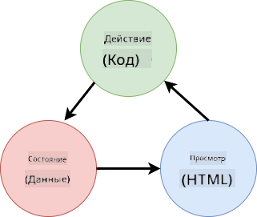
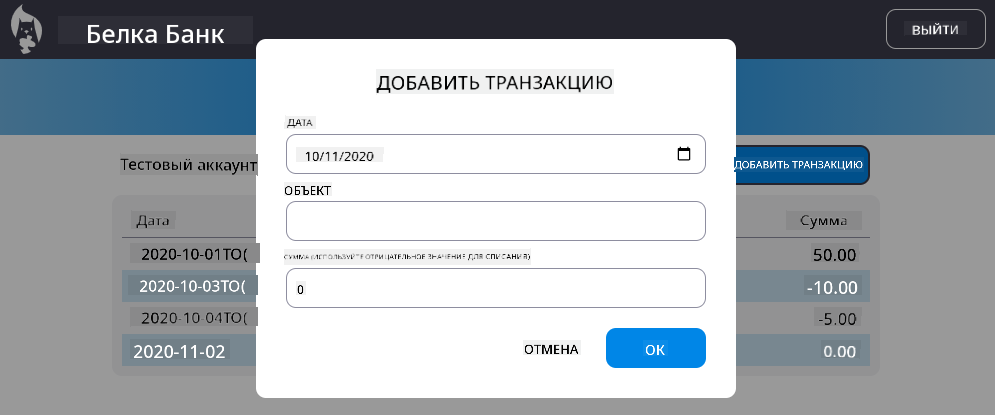

<!--
CO_OP_TRANSLATOR_METADATA:
{
  "original_hash": "4fa20c513e367e9cdd401bf49ae16e33",
  "translation_date": "2025-08-26T00:40:13+00:00",
  "source_file": "7-bank-project/4-state-management/README.md",
  "language_code": "ru"
}
-->
# Создание банковского приложения, часть 4: Концепции управления состоянием

## Викторина перед лекцией

[Викторина перед лекцией](https://ashy-river-0debb7803.1.azurestaticapps.net/quiz/47)

### Введение

По мере роста веб-приложения становится все сложнее отслеживать все потоки данных. Какой код получает данные, какая страница их использует, где и когда их нужно обновить... Легко запутаться в коде, который становится трудным для поддержки. Это особенно актуально, когда нужно делиться данными между различными страницами приложения, например, данными пользователя. Концепция *управления состоянием* всегда существовала во всех типах программ, но с увеличением сложности веб-приложений она стала ключевым моментом, который необходимо учитывать при разработке.

В этой заключительной части мы пересмотрим приложение, которое мы создали, чтобы улучшить управление состоянием, обеспечив поддержку обновления браузера в любой момент и сохранение данных между сеансами пользователя.

### Предварительные требования

Для этого урока вам нужно завершить часть веб-приложения, посвященную [получению данных](../3-data/README.md). Также необходимо установить [Node.js](https://nodejs.org) и [запустить сервер API](../api/README.md) локально, чтобы управлять данными учетной записи.

Вы можете проверить, что сервер работает корректно, выполнив эту команду в терминале:

```sh
curl http://localhost:5000/api
# -> should return "Bank API v1.0.0" as a result
```

---

## Пересмотр управления состоянием

В [предыдущем уроке](../3-data/README.md) мы ввели базовую концепцию состояния в нашем приложении с помощью глобальной переменной `account`, которая содержит банковские данные текущего авторизованного пользователя. Однако наша текущая реализация имеет несколько недостатков. Попробуйте обновить страницу, находясь на панели управления. Что происходит?

Есть три проблемы с текущим кодом:

- Состояние не сохраняется, так как обновление браузера возвращает вас на страницу входа.
- Существует множество функций, которые изменяют состояние. По мере роста приложения это может усложнить отслеживание изменений, и легко забыть обновить одну из них.
- Состояние не очищается, поэтому при нажатии на *Выход* данные учетной записи остаются, даже если вы находитесь на странице входа.

Мы могли бы обновить наш код, чтобы решить эти проблемы по отдельности, но это привело бы к дублированию кода и усложнило бы приложение. Или мы могли бы остановиться на несколько минут и пересмотреть нашу стратегию.

> Какие проблемы мы действительно пытаемся решить?

[Управление состоянием](https://en.wikipedia.org/wiki/State_management) заключается в поиске хорошего подхода для решения двух конкретных проблем:

- Как сделать потоки данных в приложении понятными?
- Как обеспечить постоянную синхронизацию данных состояния с пользовательским интерфейсом (и наоборот)?

После того как вы решите эти проблемы, любые другие возникающие вопросы либо уже будут решены, либо станут проще для решения. Существует множество подходов к решению этих проблем, но мы выберем распространенное решение, которое заключается в **централизации данных и способов их изменения**. Потоки данных будут выглядеть следующим образом:



> Здесь мы не будем рассматривать часть, где данные автоматически вызывают обновление представления, так как это связано с более сложными концепциями [реактивного программирования](https://en.wikipedia.org/wiki/Reactive_programming). Это хороший предмет для дальнейшего изучения, если вы готовы к глубокому погружению.

✅ Существует множество библиотек с различными подходами к управлению состоянием, [Redux](https://redux.js.org) является популярным вариантом. Ознакомьтесь с концепциями и шаблонами, которые используются, так как это часто помогает понять потенциальные проблемы, с которыми вы можете столкнуться в крупных веб-приложениях, и способы их решения.

### Задача

Начнем с небольшого рефакторинга. Замените объявление `account`:

```js
let account = null;
```

На:

```js
let state = {
  account: null
};
```

Идея заключается в *централизации* всех данных нашего приложения в одном объекте состояния. Пока у нас есть только `account` в состоянии, поэтому это не сильно меняет ситуацию, но создает основу для дальнейших изменений.

Также необходимо обновить функции, которые его используют. В функциях `register()` и `login()` замените `account = ...` на `state.account = ...`;

В начале функции `updateDashboard()` добавьте эту строку:

```js
const account = state.account;
```

Этот рефакторинг сам по себе не принес больших улучшений, но его идея заключалась в создании основы для следующих изменений.

## Отслеживание изменений данных

Теперь, когда мы создали объект `state` для хранения данных, следующим шагом будет централизация обновлений. Цель — упростить отслеживание любых изменений и времени их возникновения.

Чтобы избежать изменений объекта `state`, также рекомендуется считать его [*неизменяемым*](https://en.wikipedia.org/wiki/Immutable_object), то есть таким, который нельзя модифицировать. Это также означает, что вам нужно создать новый объект состояния, если вы хотите что-то изменить в нем. Таким образом, вы защищаете себя от потенциально нежелательных [побочных эффектов](https://en.wikipedia.org/wiki/Side_effect_(computer_science)) и открываете возможности для новых функций в вашем приложении, таких как реализация отмены/повтора, а также упрощаете отладку. Например, вы можете записывать каждое изменение состояния и сохранять историю изменений, чтобы понять источник ошибки.

В JavaScript вы можете использовать [`Object.freeze()`](https://developer.mozilla.org/docs/Web/JavaScript/Reference/Global_Objects/Object/freeze) для создания неизменяемой версии объекта. Если вы попытаетесь внести изменения в неизменяемый объект, будет вызвано исключение.

✅ Знаете ли вы разницу между *поверхностным* и *глубоким* неизменяемым объектом? Вы можете прочитать об этом [здесь](https://developer.mozilla.org/docs/Web/JavaScript/Reference/Global_Objects/Object/freeze#What_is_shallow_freeze).

### Задача

Создадим новую функцию `updateState()`:

```js
function updateState(property, newData) {
  state = Object.freeze({
    ...state,
    [property]: newData
  });
}
```

В этой функции мы создаем новый объект состояния и копируем данные из предыдущего состояния с помощью [*оператора распространения (`...`)*](https://developer.mozilla.org/docs/Web/JavaScript/Reference/Operators/Spread_syntax#Spread_in_object_literals). Затем мы переопределяем конкретное свойство объекта состояния новыми данными, используя [нотацию скобок](https://developer.mozilla.org/docs/Web/JavaScript/Guide/Working_with_Objects#Objects_and_properties) `[property]` для присваивания. Наконец, мы блокируем объект, чтобы предотвратить модификации, используя `Object.freeze()`. Пока у нас есть только свойство `account`, хранящееся в состоянии, но с этим подходом вы можете добавить столько свойств, сколько вам нужно.

Также обновим инициализацию `state`, чтобы убедиться, что начальное состояние тоже заморожено:

```js
let state = Object.freeze({
  account: null
});
```

После этого обновите функцию `register`, заменив присваивание `state.account = result;` на:

```js
updateState('account', result);
```

Сделайте то же самое с функцией `login`, заменив `state.account = data;` на:

```js
updateState('account', data);
```

Теперь воспользуемся случаем, чтобы исправить проблему, связанную с тем, что данные учетной записи не очищаются, когда пользователь нажимает на *Выход*.

Создайте новую функцию `logout()`:

```js
function logout() {
  updateState('account', null);
  navigate('/login');
}
```

В `updateDashboard()` замените перенаправление `return navigate('/login');` на `return logout();`

Попробуйте зарегистрировать новую учетную запись, выйти из системы и снова войти, чтобы убедиться, что все работает правильно.

> Совет: вы можете посмотреть все изменения состояния, добавив `console.log(state)` в конце `updateState()` и открыв консоль в инструментах разработчика вашего браузера.

## Сохранение состояния

Большинство веб-приложений нуждаются в сохранении данных для корректной работы. Все критические данные обычно хранятся в базе данных и доступны через серверный API, как, например, данные учетной записи пользователя в нашем случае. Но иногда также полезно сохранять некоторые данные в клиентском приложении, которое работает в вашем браузере, для улучшения пользовательского опыта или повышения производительности загрузки.

Когда вы хотите сохранить данные в браузере, есть несколько важных вопросов, которые следует задать:

- *Являются ли данные конфиденциальными?* Следует избегать хранения любых конфиденциальных данных на клиенте, таких как пароли пользователей.
- *Как долго вам нужно хранить эти данные?* Планируете ли вы использовать эти данные только для текущего сеанса или хотите, чтобы они хранились навсегда?

Существует несколько способов хранения информации внутри веб-приложения, в зависимости от того, что вы хотите достичь. Например, вы можете использовать URL-адреса для хранения поискового запроса и сделать его доступным для обмена между пользователями. Вы также можете использовать [HTTP cookies](https://developer.mozilla.org/docs/Web/HTTP/Cookies), если данные нужно передавать на сервер, например, информацию для [аутентификации](https://en.wikipedia.org/wiki/Authentication).

Другой вариант — использовать один из многих API браузера для хранения данных. Два из них особенно интересны:

- [`localStorage`](https://developer.mozilla.org/docs/Web/API/Window/localStorage): [хранилище ключ/значение](https://en.wikipedia.org/wiki/Key%E2%80%93value_database), позволяющее сохранять данные, специфичные для текущего веб-сайта, между различными сеансами. Сохраненные данные никогда не истекают.
- [`sessionStorage`](https://developer.mozilla.org/docs/Web/API/Window/sessionStorage): работает так же, как `localStorage`, за исключением того, что данные, хранящиеся в нем, очищаются при завершении сеанса (при закрытии браузера).

Обратите внимание, что оба этих API позволяют хранить только [строки](https://developer.mozilla.org/docs/Web/JavaScript/Reference/Global_Objects/String). Если вы хотите хранить сложные объекты, вам нужно сериализовать их в формате [JSON](https://developer.mozilla.org/docs/Web/JavaScript/Reference/Global_Objects/JSON) с помощью [`JSON.stringify()`](https://developer.mozilla.org/docs/Web/JavaScript/Reference/Global_Objects/JSON/stringify).

✅ Если вы хотите создать веб-приложение, которое не работает с сервером, также возможно создать базу данных на клиенте, используя API [`IndexedDB`](https://developer.mozilla.org/docs/Web/API/IndexedDB_API). Этот вариант предназначен для сложных случаев использования или если вам нужно хранить значительное количество данных, так как он более сложен в использовании.

### Задача

Мы хотим, чтобы наши пользователи оставались авторизованными, пока они явно не нажмут кнопку *Выход*, поэтому будем использовать `localStorage` для хранения данных учетной записи. Сначала определим ключ, который будем использовать для хранения данных.

```js
const storageKey = 'savedAccount';
```

Затем добавьте эту строку в конец функции `updateState()`:

```js
localStorage.setItem(storageKey, JSON.stringify(state.account));
```

С этим данные учетной записи пользователя будут сохраняться и всегда актуальны, так как мы централизовали все обновления состояния. Здесь мы начинаем извлекать выгоду из всех наших предыдущих рефакторингов 🙂.

Так как данные сохраняются, нам также нужно позаботиться об их восстановлении при загрузке приложения. Поскольку у нас начнет появляться больше кода инициализации, может быть хорошей идеей создать новую функцию `init`, которая также включает наш предыдущий код внизу `app.js`:

```js
function init() {
  const savedAccount = localStorage.getItem(storageKey);
  if (savedAccount) {
    updateState('account', JSON.parse(savedAccount));
  }

  // Our previous initialization code
  window.onpopstate = () => updateRoute();
  updateRoute();
}

init();
```

Здесь мы извлекаем сохраненные данные, и если они есть, обновляем состояние соответствующим образом. Важно сделать это *до* обновления маршрута, так как может быть код, который зависит от состояния во время обновления страницы.

Мы также можем сделать страницу *Dashboard* страницей по умолчанию для нашего приложения, так как теперь мы сохраняем данные учетной записи. Если данные не найдены, панель управления все равно перенаправляет на страницу *Login*. В `updateRoute()` замените резервный вариант `return navigate('/login');` на `return navigate('/dashboard');`.

Теперь войдите в приложение и попробуйте обновить страницу. Вы должны остаться на панели управления. С этим обновлением мы решили все наши первоначальные проблемы...

## Обновление данных

...Но мы могли также создать новую проблему. Упс!

Перейдите на панель управления, используя учетную запись `test`, затем выполните эту команду в терминале, чтобы создать новую транзакцию:

```sh
curl --request POST \
     --header "Content-Type: application/json" \
     --data "{ \"date\": \"2020-07-24\", \"object\": \"Bought book\", \"amount\": -20 }" \
     http://localhost:5000/api/accounts/test/transactions
```

Теперь попробуйте обновить страницу панели управления в браузере. Что происходит? Видите ли вы новую транзакцию?

Состояние сохраняется бесконечно благодаря `localStorage`, но это также означает, что оно никогда не обновляется, пока вы не выйдете из приложения и снова войдете!

Одна из возможных стратегий решения этой проблемы — перезагружать данные учетной записи каждый раз, когда загружается панель управления, чтобы избежать устаревших данных.

### Задача

Создайте новую функцию `updateAccountData`:

```js
async function updateAccountData() {
  const account = state.account;
  if (!account) {
    return logout();
  }

  const data = await getAccount(account.user);
  if (data.error) {
    return logout();
  }

  updateState('account', data);
}
```

Этот метод проверяет, что пользователь авторизован, а затем перезагружает данные учетной записи с сервера.

Создайте еще одну функцию с именем `refresh`:

```js
async function refresh() {
  await updateAccountData();
  updateDashboard();
}
```

Эта функция обновляет данные учетной записи, а затем заботится об обновлении HTML на странице панели управления. Это то, что нам нужно вызвать, когда загружается маршрут панели управления. Обновите определение маршрута:

```js
const routes = {
  '/login': { templateId: 'login' },
  '/dashboard': { templateId: 'dashboard', init: refresh }
};
```

Теперь попробуйте обновить панель управления, она должна отображать обновленные данные учетной записи.

---

## 🚀 Задание

Теперь, когда мы перезагружаем данные учетной записи каждый раз, когда загружается панель управления, как вы думаете, нужно ли нам сохранять *все данные учетной записи*?

Попробуйте вместе изменить то, что сохраняется и загружается из `localStorage`, чтобы включать только то, что абсолютно необходимо для работы приложения.

## Викторина после лекции
[Тест после лекции](https://ashy-river-0debb7803.1.azurestaticapps.net/quiz/48)

## Задание

[Реализуйте диалог "Добавить транзакцию"](assignment.md)

Вот пример результата после выполнения задания:



**Отказ от ответственности**:  
Этот документ был переведен с использованием сервиса автоматического перевода [Co-op Translator](https://github.com/Azure/co-op-translator). Хотя мы стремимся к точности, пожалуйста, учитывайте, что автоматические переводы могут содержать ошибки или неточности. Оригинальный документ на его родном языке следует считать авторитетным источником. Для получения критически важной информации рекомендуется профессиональный перевод человеком. Мы не несем ответственности за любые недоразумения или неправильные интерпретации, возникшие в результате использования данного перевода.