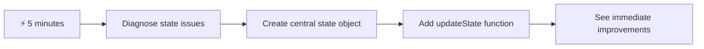
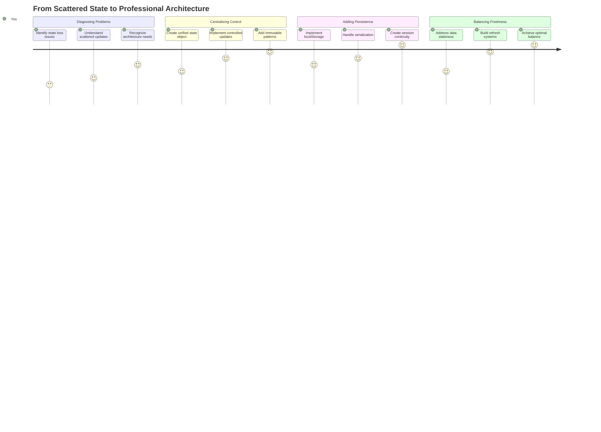
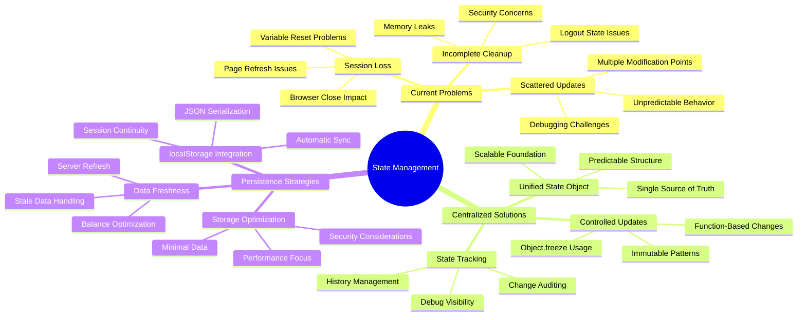
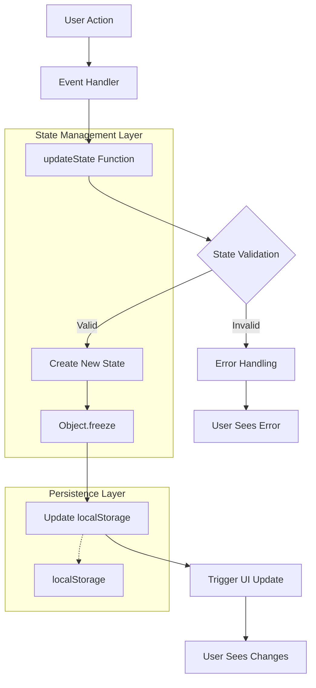
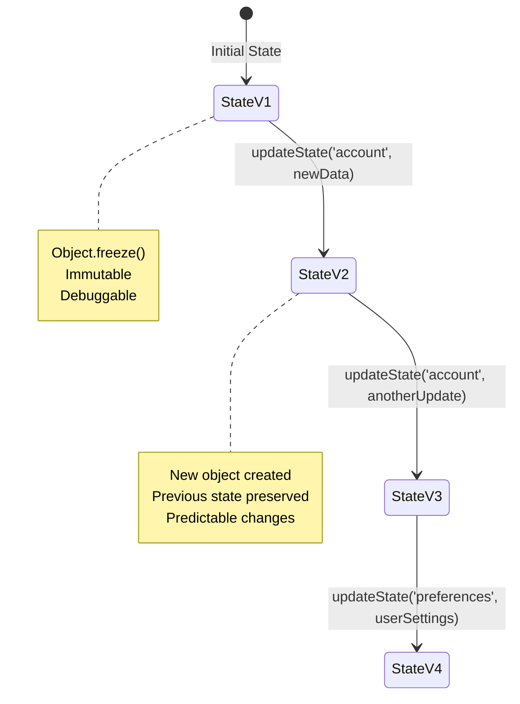
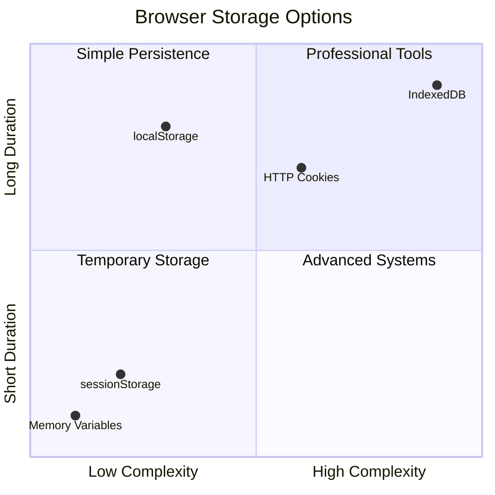
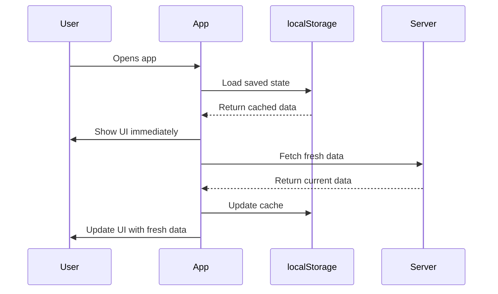
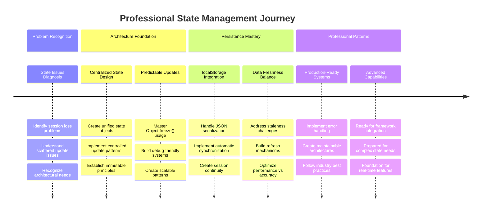

<!--
CO_OP_TRANSLATOR_METADATA:
{
  "original_hash": "b807b09df716dc48a2b750835bf8e933",
  "translation_date": "2025-11-03T23:23:27+00:00",
  "source_file": "7-bank-project/4-state-management/README.md",
  "language_code": "ru"
}
-->
# Создание банковского приложения, часть 4: Основы управления состоянием

## ⚡ Что можно сделать за следующие 5 минут

**Быстрый старт для занятых разработчиков**



- **Минута 1**: Проверьте текущую проблему состояния — войдите в систему, обновите страницу, наблюдайте выход из аккаунта.
- **Минута 2**: Замените `let account = null` на `let state = { account: null }`.
- **Минута 3**: Создайте простую функцию `updateState()` для контролируемых обновлений.
- **Минута 4**: Обновите одну функцию, чтобы использовать новый шаблон.
- **Минута 5**: Проверьте улучшенную предсказуемость и возможность отладки.

**Быстрый диагностический тест**:
```javascript
// Before: Scattered state
let account = null; // Lost on refresh!

// After: Centralized state
let state = Object.freeze({ account: null }); // Controlled and trackable!
```

**Почему это важно**: За 5 минут вы почувствуете переход от хаотичного управления состоянием к предсказуемым и удобным для отладки шаблонам. Это основа, которая делает сложные приложения поддерживаемыми.

## 🗺️ Ваш путь к мастерству управления состоянием



**Цель вашего пути**: К концу этого урока вы создадите профессиональную систему управления состоянием, которая обеспечивает сохранность данных, их актуальность и предсказуемые обновления — те же шаблоны, которые используются в производственных приложениях.

## Предварительный тест

[Предварительный тест](https://ff-quizzes.netlify.app/web/quiz/47)

## Введение

Управление состоянием похоже на навигационную систему космического аппарата Voyager — когда все работает гладко, вы едва замечаете его наличие. Но когда что-то идет не так, это становится разницей между достижением межзвездного пространства и блужданием в космической пустоте. В веб-разработке состояние представляет все, что ваше приложение должно помнить: статус входа пользователя, данные формы, историю навигации и временные состояния интерфейса.

По мере того как ваше банковское приложение эволюционировало от простого формы входа к более сложному приложению, вы, вероятно, столкнулись с некоторыми распространенными проблемами. Обновите страницу, и пользователи неожиданно выходят из системы. Закройте браузер, и весь прогресс исчезает. Отлаживайте проблему, и вы ищете в нескольких функциях, которые все изменяют одни и те же данные разными способами.

Это не признаки плохого кодирования — это естественные трудности роста, которые возникают, когда приложения достигают определенного уровня сложности. Каждый разработчик сталкивается с этими проблемами, когда его приложения переходят от "доказательства концепции" к "готовности к производству".

В этом уроке мы реализуем централизованную систему управления состоянием, которая преобразует ваше банковское приложение в надежное профессиональное приложение. Вы научитесь управлять потоками данных предсказуемо, сохранять пользовательские сессии должным образом и создавать плавный пользовательский опыт, который требуется современным веб-приложениям.

## Предварительные требования

Перед тем как углубляться в концепции управления состоянием, вам нужно правильно настроить среду разработки и подготовить основу вашего банковского приложения. Этот урок напрямую опирается на концепции и код из предыдущих частей этой серии.

Убедитесь, что у вас готовы следующие компоненты:

**Необходимая настройка:**
- Завершите [урок по получению данных](../3-data/README.md) — ваше приложение должно успешно загружать и отображать данные аккаунта.
- Установите [Node.js](https://nodejs.org) на вашу систему для запуска API на сервере.
- Запустите [серверный API](../api/README.md) локально для обработки операций с данными аккаунта.

**Проверка вашей среды:**

Убедитесь, что ваш сервер API работает корректно, выполнив эту команду в терминале:

```sh
curl http://localhost:5000/api
# -> should return "Bank API v1.0.0" as a result
```

**Что делает эта команда:**
- **Отправляет** GET-запрос на ваш локальный сервер API.
- **Проверяет** соединение и подтверждает, что сервер отвечает.
- **Возвращает** информацию о версии API, если все работает правильно.

## 🧠 Обзор архитектуры управления состоянием



**Основной принцип**: Профессиональное управление состоянием балансирует предсказуемость, сохранность и производительность, создавая надежный пользовательский опыт, который масштабируется от простых взаимодействий до сложных рабочих процессов приложения.

---

## Диагностика текущих проблем управления состоянием

Как Шерлок Холмс, исследующий место преступления, мы должны понять, что именно происходит в нашей текущей реализации, прежде чем мы сможем решить загадку исчезающих пользовательских сессий.

Давайте проведем простой эксперимент, который выявит основные проблемы управления состоянием:

**🧪 Попробуйте этот диагностический тест:**
1. Войдите в ваше банковское приложение и перейдите на панель управления.
2. Обновите страницу браузера.
3. Наблюдайте, что происходит с вашим статусом входа.

Если вас перенаправляют обратно на экран входа, вы обнаружили классическую проблему сохранности состояния. Такое поведение происходит, потому что наша текущая реализация хранит данные пользователя в переменных JavaScript, которые сбрасываются при каждой загрузке страницы.

**Проблемы текущей реализации:**

Простая переменная `account` из нашего [предыдущего урока](../3-data/README.md) создает три значительные проблемы, которые влияют как на пользовательский опыт, так и на поддерживаемость кода:

| Проблема | Техническая причина | Влияние на пользователя |
|---------|--------|----------------|
| **Потеря сессии** | Обновление страницы очищает переменные JavaScript | Пользователи должны часто повторно аутентифицироваться |
| **Разрозненные обновления** | Несколько функций напрямую изменяют состояние | Отладка становится все сложнее |
| **Неполная очистка** | Выход из системы не очищает все ссылки на состояние | Возможные проблемы безопасности и конфиденциальности |

**Архитектурная задача:**

Как и дизайн Титаника с разделенными отсеками, который казался надежным, пока несколько отсеков не затопило одновременно, исправление этих проблем по отдельности не решит основную архитектурную проблему. Нам нужна комплексная система управления состоянием.

> 💡 **Что мы на самом деле пытаемся здесь достичь?**

[Управление состоянием](https://en.wikipedia.org/wiki/State_management) на самом деле сводится к решению двух фундаментальных задач:

1. **Где мои данные?**: Отслеживание, какую информацию мы имеем и откуда она поступает.
2. **Все ли на одной волне?**: Убедиться, что то, что видят пользователи, соответствует тому, что на самом деле происходит.

**Наш план действий:**

Вместо того чтобы гоняться за собственным хвостом, мы создадим **централизованную систему управления состоянием**. Представьте, что есть один очень организованный человек, который отвечает за все важные дела:




**Понимание этого потока данных:**
- **Централизует** все состояние приложения в одном месте.
- **Направляет** все изменения состояния через контролируемые функции.
- **Обеспечивает**, чтобы пользовательский интерфейс оставался синхронизированным с текущим состоянием.
- **Предоставляет** четкий и предсказуемый шаблон для управления данными.

> 💡 **Профессиональный совет**: Этот урок сосредоточен на фундаментальных концепциях. Для сложных приложений библиотеки, такие как [Redux](https://redux.js.org), предоставляют более продвинутые функции управления состоянием. Понимание этих основных принципов поможет вам освоить любую библиотеку управления состоянием.

> ⚠️ **Продвинутая тема**: Мы не будем рассматривать автоматические обновления пользовательского интерфейса, вызванные изменениями состояния, так как это связано с концепциями [реактивного программирования](https://en.wikipedia.org/wiki/Reactive_programming). Считайте это отличным следующим шагом для вашего обучения!

### Задача: Централизация структуры состояния

Давайте начнем преобразование нашего разрозненного управления состоянием в централизованную систему. Этот первый шаг закладывает основу для всех последующих улучшений.

**Шаг 1: Создайте центральный объект состояния**

Замените простое объявление `account`:

```js
let account = null;
```

На структурированный объект состояния:

```js
let state = {
  account: null
};
```

**Почему это изменение важно:**
- **Централизует** все данные приложения в одном месте.
- **Готовит** структуру для добавления новых свойств состояния в будущем.
- **Создает** четкую границу между состоянием и другими переменными.
- **Закладывает** шаблон, который масштабируется по мере роста вашего приложения.

**Шаг 2: Обновите шаблоны доступа к состоянию**

Обновите ваши функции, чтобы использовать новую структуру состояния:

**В функциях `register()` и `login()` замените:**
```js
account = ...
```

На:
```js
state.account = ...
```

**В функции `updateDashboard()` добавьте эту строку в начале:**
```js
const account = state.account;
```

**Что достигают эти обновления:**
- **Сохраняют** существующую функциональность, улучшая структуру.
- **Готовят** ваш код для более сложного управления состоянием.
- **Создают** последовательные шаблоны для доступа к данным состояния.
- **Закладывают** основу для централизованных обновлений состояния.

> 💡 **Примечание**: Этот рефакторинг не решает наши проблемы сразу, но создает необходимую основу для мощных улучшений, которые последуют!

### 🎯 Педагогическая проверка: Принципы централизации

**Пауза и размышления**: Вы только что реализовали основу централизованного управления состоянием. Это важное архитектурное решение.

**Быстрая самооценка**:
- Можете ли вы объяснить, почему централизация состояния в одном объекте лучше, чем разрозненные переменные?
- Что произойдет, если вы забудете обновить функцию для использования `state.account`?
- Как этот шаблон готовит ваш код для более продвинутых функций?

**Связь с реальным миром**: Шаблон централизации, который вы изучили, является основой современных фреймворков, таких как Redux, Vuex и React Context. Вы строите ту же архитектурную логику, которая используется в крупных приложениях.

**Вопрос для вызова**: Если вам нужно добавить пользовательские предпочтения (тема, язык) в ваше приложение, где бы вы их добавили в структуру состояния? Как это будет масштабироваться?

## Реализация контролируемых обновлений состояния

С централизованным состоянием следующий шаг включает установление контролируемых механизмов для изменения данных. Этот подход обеспечивает предсказуемые изменения состояния и упрощает отладку.

Основной принцип напоминает управление воздушным движением: вместо того чтобы позволять нескольким функциям независимо изменять состояние, мы будем направлять все изменения через одну контролируемую функцию. Этот шаблон обеспечивает четкий контроль над тем, когда и как происходят изменения данных.

**Управление неизменяемым состоянием:**

Мы будем рассматривать наш объект `state` как [*неизменяемый*](https://en.wikipedia.org/wiki/Immutable_object), то есть мы никогда не будем изменять его напрямую. Вместо этого каждое изменение будет создавать новый объект состояния с обновленными данными.

Хотя этот подход может показаться неэффективным по сравнению с прямыми изменениями, он предоставляет значительные преимущества для отладки, тестирования и поддержания предсказуемости приложения.

**Преимущества управления неизменяемым состоянием:**

| Преимущество | Описание | Влияние |
|---------|-------------|--------|
| **Предсказуемость** | Изменения происходят только через контролируемые функции | Упрощает отладку и тестирование |
| **Отслеживание истории** | Каждое изменение состояния создает новый объект | Позволяет реализовать функции отмены/повтора |
| **Предотвращение побочных эффектов** | Нет случайных изменений | Предотвращает загадочные ошибки |
| **Оптимизация производительности** | Легко определить, когда состояние действительно изменилось | Обеспечивает эффективные обновления интерфейса |

**Неизменяемость в JavaScript с помощью `Object.freeze()`:**

JavaScript предоставляет [`Object.freeze()`](https://developer.mozilla.org/docs/Web/JavaScript/Reference/Global_Objects/Object/freeze) для предотвращения изменений объекта:

```js
const immutableState = Object.freeze({ account: userData });
// Any attempt to modify immutableState will throw an error
```

**Разбор того, что здесь происходит:**
- **Предотвращает** прямое присваивание свойств или их удаление.
- **Вызывает** исключения при попытке изменения.
- **Обеспечивает**, что изменения состояния должны проходить через контролируемые функции.
- **Создает** четкий контракт для того, как можно обновлять состояние.

> 💡 **Углубление**: Узнайте о разнице между *поверхностными* и *глубокими* неизменяемыми объектами в [документации MDN](https://developer.mozilla.org/docs/Web/JavaScript/Reference/Global_Objects/Object/freeze#What_is_shallow_freeze). Понимание этого различия важно для сложных структур состояния.



### Задача

Давайте создадим новую функцию `updateState()`:

```js
function updateState(property, newData) {
  state = Object.freeze({
    ...state,
    [property]: newData
  });
}
```

В этой функции мы создаем новый объект состояния и копируем данные из предыдущего состояния, используя [*оператор распространения (`...`)*](https://developer.mozilla.org/docs/Web/JavaScript/Reference/Operators/Spread_syntax#Spread_in_object_literals). Затем мы переопределяем конкретное свойство объекта состояния новыми данными, используя [нотацию в квадратных скобках](https://developer.mozilla.org/docs/Web/JavaScript/Guide/Working_with_Objects#Objects_and_properties) `[property]` для присваивания. Наконец, мы блокируем объект, чтобы предотвратить изменения, используя `Object.freeze()`. Пока в состоянии хранится только свойство `account`, но с этим подходом вы можете добавлять столько свойств, сколько потребуется.

Мы также обновим инициализацию `state`, чтобы убедиться, что начальное состояние тоже заморожено:

```js
let state = Object.freeze({
  account: null
});
```

После этого обновите функцию `register`, заменив присваивание `state.account = result;` на:

```js
updateState('account', result);
```

Сделайте то же самое с функцией `login`, заменив `state.account = data;` на:

```js
updateState('account', data);
```

Теперь мы воспользуемся случаем, чтобы исправить проблему с данными аккаунта, которые не очищаются, когда пользователь нажимает *Выход*.

Создайте новую функцию `logout()`:

```js
function logout() {
  updateState('account', null);
  navigate('/login');
}
```

В `updateDashboard()` замените перенаправление `return navigate('/login');` на `return logout();`.

Попробуйте зарегистрировать новый аккаунт, выйти из системы и снова войти, чтобы убедиться, что все работает корректно.

> Совет: вы можете посмотреть все изменения состояния, добавив `console.log(state)` в конце `updateState()` и открыв консоль в инструментах разработчика вашего браузера.

## Реализация сохранности данных

Проблема потери сессии, которую мы выявили ранее, требует решения для сохранности, которое поддерживает состояние пользователя между сессиями браузера. Это преобразует наше приложение из временного опыта в надежный профессиональный инструмент.

Подумайте, как атомные часы сохраняют точное время даже при отключении питания, храня критическое состояние в энергонезависимой памяти. Точно так же веб-приложения нуждаются в механизмах постоянного хранения, чтобы сохранять важные данные пользователя между сессиями браузера и обновлениями страницы.

**Стратегические вопросы для сохранности данных:**

Прежде чем реализовать сохранность, рассмотрите эти важные факторы:

| Вопрос | Контекст банковского приложения | Влияние решения |
|----------|-------------------|----------------|
| **Как долго это должно сохраняться?** | Состояние входа vs. временные настройки интерфейса | Выберите подходящую длительность хранения |
| **Нужен ли серверу этот элемент?** | Токены аутентификации vs. настройки интерфейса | Определите требования к совместному использованию |

**Варианты хранения в браузере:**

Современные браузеры предоставляют несколько механизмов хранения, каждый из которых предназначен для различных случаев использования:

**Основные API хранения:**

1. **[`localStorage`](https://developer.mozilla.org/docs/Web/API/Window/localStorage)**: Постоянное [хранилище ключ/значение](https://en.wikipedia.org/wiki/Key%E2%80%93value_database)
   - **Сохраняет** данные между сессиями браузера на неопределённый срок  
   - **Сохраняется** при перезапуске браузера и компьютера
   - **Привязан** к конкретному домену сайта
   - **Идеально подходит** для пользовательских предпочтений и состояний входа

2. **[`sessionStorage`](https://developer.mozilla.org/docs/Web/API/Window/sessionStorage)**: Временное хранилище сессии
   - **Работает** аналогично localStorage в течение активных сессий
   - **Очищается** автоматически при закрытии вкладки браузера
   - **Идеально подходит** для временных данных, которые не должны сохраняться

3. **[HTTP Cookies](https://developer.mozilla.org/docs/Web/HTTP/Cookies)**: Хранилище, доступное серверу
   - **Автоматически** отправляется с каждым запросом к серверу
   - **Идеально подходит** для [токенов аутентификации](https://en.wikipedia.org/wiki/Authentication)
   - **Ограничено** по размеру и может влиять на производительность

**Требование к сериализации данных:**

И `localStorage`, и `sessionStorage` хранят только [строки](https://developer.mozilla.org/docs/Web/JavaScript/Reference/Global_Objects/String):

```js
// Convert objects to JSON strings for storage
const accountData = { user: 'john', balance: 150 };
localStorage.setItem('account', JSON.stringify(accountData));

// Parse JSON strings back to objects when retrieving
const savedAccount = JSON.parse(localStorage.getItem('account'));
```

**Понимание сериализации:**
- **Преобразует** объекты JavaScript в строки JSON с помощью [`JSON.stringify()`](https://developer.mozilla.org/docs/Web/JavaScript/Reference/Global_Objects/JSON/stringify)
- **Восстанавливает** объекты из JSON с помощью [`JSON.parse()`](https://developer.mozilla.org/docs/Web/JavaScript/Reference/Global_Objects/JSON/parse)
- **Автоматически обрабатывает** сложные вложенные объекты и массивы
- **Не работает** с функциями, неопределёнными значениями и циклическими ссылками

> 💡 **Расширенный вариант**: Для сложных офлайн-приложений с большими наборами данных рассмотрите использование API [`IndexedDB`](https://developer.mozilla.org/docs/Web/API/IndexedDB_API). Оно предоставляет полноценную базу данных на стороне клиента, но требует более сложной реализации.



### Задача: Реализовать постоянное хранение с помощью localStorage

Давайте реализуем постоянное хранилище, чтобы пользователи оставались авторизованными до тех пор, пока они явно не выйдут из системы. Мы будем использовать `localStorage` для хранения данных аккаунта между сессиями браузера.

**Шаг 1: Определите конфигурацию хранения**

```js
const storageKey = 'savedAccount';
```

**Что предоставляет эта константа:**
- **Создаёт** единый идентификатор для наших данных
- **Предотвращает** ошибки в ссылках на ключи хранилища
- **Упрощает** изменение ключа хранилища при необходимости
- **Следует** лучшим практикам для поддерживаемого кода

**Шаг 2: Добавьте автоматическое сохранение**

Добавьте эту строку в конце функции `updateState()`:

```js
localStorage.setItem(storageKey, JSON.stringify(state.account));
```

**Разбор происходящего:**
- **Преобразует** объект аккаунта в строку JSON для хранения
- **Сохраняет** данные с использованием нашего единого ключа хранилища
- **Выполняется** автоматически при изменении состояния
- **Гарантирует**, что сохранённые данные всегда синхронизированы с текущим состоянием

> 💡 **Преимущество архитектуры**: Поскольку мы централизовали все обновления состояния через `updateState()`, добавление функции сохранения потребовало всего одной строки кода. Это демонстрирует силу хороших архитектурных решений!

**Шаг 3: Восстановите состояние при загрузке приложения**

Создайте функцию инициализации для восстановления сохранённых данных:

```js
function init() {
  const savedAccount = localStorage.getItem(storageKey);
  if (savedAccount) {
    updateState('account', JSON.parse(savedAccount));
  }

  // Our previous initialization code
  window.onpopstate = () => updateRoute();
  updateRoute();
}

init();
```

**Понимание процесса инициализации:**
- **Извлекает** ранее сохранённые данные аккаунта из localStorage
- **Парсит** строку JSON обратно в объект JavaScript
- **Обновляет** состояние с помощью нашей контролируемой функции обновления
- **Автоматически восстанавливает** сессию пользователя при загрузке страницы
- **Выполняется** перед обновлением маршрутов, чтобы состояние было доступно

**Шаг 4: Оптимизируйте маршрут по умолчанию**

Обновите маршрут по умолчанию, чтобы использовать преимущества сохранения:

В `updateRoute()` замените:
```js
// Replace: return navigate('/login');
return navigate('/dashboard');
```

**Почему это изменение имеет смысл:**
- **Эффективно использует** нашу новую систему сохранения
- **Позволяет** панели управления проверять аутентификацию
- **Автоматически перенаправляет** на страницу входа, если сохранённая сессия отсутствует
- **Создаёт** более плавный пользовательский опыт

**Тестирование вашей реализации:**

1. Войдите в банковское приложение
2. Обновите страницу браузера
3. Убедитесь, что вы остались авторизованным и на панели управления
4. Закройте и снова откройте браузер
5. Перейдите обратно в приложение и подтвердите, что вы всё ещё авторизованы

🎉 **Достижение разблокировано**: Вы успешно реализовали управление постоянным состоянием! Ваше приложение теперь работает как профессиональное веб-приложение.

### 🎯 Проверка понимания: Архитектура сохранения

**Понимание архитектуры**: Вы реализовали сложный слой сохранения, который балансирует пользовательский опыт и сложность управления данными.

**Ключевые освоенные концепции**:
- **Сериализация JSON**: Преобразование сложных объектов в строки для хранения
- **Автоматическая синхронизация**: Изменения состояния запускают сохранение
- **Восстановление сессии**: Приложения могут восстанавливать контекст пользователя после прерываний
- **Централизованное сохранение**: Одна функция обновления обрабатывает всё хранение

**Связь с индустрией**: Этот шаблон сохранения является основой для прогрессивных веб-приложений (PWA), офлайн-приложений и современных мобильных веб-решений. Вы создаёте возможности уровня производства.

**Вопрос для размышления**: Как бы вы модифицировали эту систему для работы с несколькими аккаунтами на одном устройстве? Учитывайте вопросы конфиденциальности и безопасности.

## Баланс сохранения и актуальности данных

Наша система сохранения успешно поддерживает сессии пользователей, но вводит новую проблему: устаревание данных. Когда несколько пользователей или приложений изменяют одни и те же данные на сервере, локальная кэшированная информация становится устаревшей.

Эта ситуация напоминает навигаторов-викингов, которые полагались как на сохранённые карты звёздного неба, так и на текущие наблюдения за небесными телами. Карты обеспечивали стабильность, но навигаторы нуждались в свежих наблюдениях, чтобы учитывать изменяющиеся условия. Точно так же наше приложение нуждается как в сохранённом состоянии пользователя, так и в актуальных данных с сервера.

**🧪 Обнаружение проблемы устаревания данных:**

1. Войдите в панель управления, используя аккаунт `test`
2. Выполните эту команду в терминале, чтобы симулировать транзакцию из другого источника:

```sh
curl --request POST \
     --header "Content-Type: application/json" \
     --data "{ \"date\": \"2020-07-24\", \"object\": \"Bought book\", \"amount\": -20 }" \
     http://localhost:5000/api/accounts/test/transactions
```

3. Обновите страницу панели управления в браузере
4. Проверьте, отображается ли новая транзакция

**Что демонстрирует этот тест:**
- **Показывает**, как локальное хранилище может стать "устаревшим" (неактуальным)
- **Симулирует** реальные сценарии, где изменения данных происходят вне вашего приложения
- **Выявляет** напряжение между сохранением и актуальностью данных

**Проблема устаревания данных:**

| Проблема | Причина | Влияние на пользователя |
|----------|---------|--------------------------|
| **Устаревшие данные** | localStorage никогда не истекает автоматически | Пользователи видят неактуальную информацию |
| **Изменения на сервере** | Другие приложения/пользователи изменяют те же данные | Несогласованное отображение на разных платформах |
| **Кэш vs. реальность** | Локальный кэш не соответствует состоянию сервера | Плохой пользовательский опыт и путаница |

**Стратегия решения:**

Мы реализуем шаблон "обновление при загрузке", который балансирует преимущества сохранения с необходимостью актуальных данных. Этот подход сохраняет плавный пользовательский опыт, обеспечивая точность данных.



### Задача: Реализовать систему обновления данных

Мы создадим систему, которая автоматически получает актуальные данные с сервера, сохраняя преимущества нашей системы управления состоянием.

**Шаг 1: Создайте обновляющий данные аккаунта**

```js
async function updateAccountData() {
  const account = state.account;
  if (!account) {
    return logout();
  }

  const data = await getAccount(account.user);
  if (data.error) {
    return logout();
  }

  updateState('account', data);
}
```

**Понимание логики этой функции:**
- **Проверяет**, авторизован ли пользователь (существует ли state.account)
- **Перенаправляет** на выход, если сессия недействительна
- **Получает** актуальные данные аккаунта с сервера, используя существующую функцию `getAccount()`
- **Обрабатывает** ошибки сервера, корректно завершая недействительные сессии
- **Обновляет** состояние с актуальными данными, используя нашу контролируемую систему обновления
- **Запускает** автоматическое сохранение в localStorage через функцию `updateState()`

**Шаг 2: Создайте обработчик обновления панели управления**

```js
async function refresh() {
  await updateAccountData();
  updateDashboard();
}
```

**Что делает эта функция обновления:**
- **Координирует** процесс обновления данных и интерфейса
- **Ожидает**, пока загрузятся актуальные данные, перед обновлением отображения
- **Гарантирует**, что панель управления показывает самую актуальную информацию
- **Сохраняет** чёткое разделение между управлением данными и обновлением интерфейса

**Шаг 3: Интеграция с системой маршрутов**

Обновите конфигурацию маршрутов, чтобы автоматически запускать обновление:

```js
const routes = {
  '/login': { templateId: 'login' },
  '/dashboard': { templateId: 'dashboard', init: refresh }
};
```

**Как работает эта интеграция:**
- **Выполняет** функцию обновления каждый раз при загрузке маршрута панели управления
- **Гарантирует**, что актуальные данные всегда отображаются при переходе на панель управления
- **Сохраняет** существующую структуру маршрутов, добавляя актуальность данных
- **Обеспечивает** последовательный шаблон для инициализации маршрутов

**Тестирование вашей системы обновления данных:**

1. Войдите в банковское приложение
2. Выполните команду curl, чтобы создать новую транзакцию
3. Обновите страницу панели управления или перейдите на другую страницу и вернитесь
4. Убедитесь, что новая транзакция отображается немедленно

🎉 **Идеальный баланс достигнут**: Ваше приложение теперь сочетает плавный опыт сохранения состояния с точностью актуальных данных сервера!

## 📈 Таймлайн вашего мастерства управления состоянием



**🎓 Этап завершения**: Вы успешно построили полную систему управления состоянием, используя те же принципы, которые лежат в основе Redux, Vuex и других профессиональных библиотек управления состоянием. Эти шаблоны масштабируются от простых приложений до корпоративных решений.

**🔄 Возможности следующего уровня**:
- Готовы освоить фреймворки управления состоянием (Redux, Zustand, Pinia)
- Подготовлены к реализации функций в реальном времени с WebSockets
- Оснащены для создания офлайн-приложений Progressive Web Apps
- Заложена основа для сложных шаблонов, таких как машины состояний и наблюдатели

## Вызов GitHub Copilot Agent 🚀

Используйте режим Agent, чтобы выполнить следующий вызов:

**Описание:** Реализуйте комплексную систему управления состоянием с функцией отмены/повтора для банковского приложения. Этот вызов поможет вам освоить сложные концепции управления состоянием, включая отслеживание истории состояний, неизменяемые обновления и синхронизацию пользовательского интерфейса.

**Задание:** Создайте улучшенную систему управления состоянием, включающую: 1) Массив истории состояний, отслеживающий все предыдущие состояния, 2) Функции отмены и повтора, которые могут возвращаться к предыдущим состояниям, 3) Кнопки интерфейса для операций отмены/повтора на панели управления, 4) Максимальный лимит истории в 10 состояний для предотвращения проблем с памятью, и 5) Корректную очистку истории при выходе пользователя. Убедитесь, что функции отмены/повтора работают с изменениями баланса аккаунта и сохраняются между обновлениями браузера.

Узнайте больше о [режиме Agent](https://code.visualstudio.com/blogs/2025/02/24/introducing-copilot-agent-mode) здесь.

## 🚀 Вызов: Оптимизация хранения

Ваша реализация теперь эффективно обрабатывает сессии пользователей, обновление данных и управление состоянием. Однако подумайте, оптимально ли наш текущий подход балансирует эффективность хранения и функциональность.

Как мастера шахмат, которые различают важные фигуры и пешки, эффективное управление состоянием требует определения, какие данные должны сохраняться, а какие всегда должны быть свежими с сервера.

**Анализ оптимизации:**

Оцените вашу текущую реализацию localStorage и рассмотрите следующие стратегические вопросы:
- Какой минимум информации необходим для поддержания аутентификации пользователя?
- Какие данные меняются настолько часто, что локальное кэширование малоэффективно?
- Как оптимизация хранения может улучшить производительность без ухудшения пользовательского опыта?

**Стратегия реализации:**
- **Определите** основные данные, которые должны сохраняться (вероятно, только идентификация пользователя)
- **Измените** вашу реализацию localStorage, чтобы хранить только критические данные сессии
- **Убедитесь**, что актуальные данные всегда загружаются с сервера при посещении панели управления
- **Протестируйте**, что ваш оптимизированный подход сохраняет тот же пользовательский опыт

**Продвинутое рассмотрение:**
- **Сравните** компромиссы между хранением полных данных аккаунта и только токенов аутентификации
- **Документируйте** ваши решения и аргументацию для будущих членов команды

Этот вызов поможет вам мыслить как профессиональный разработчик, который учитывает как пользовательский опыт, так и эффективность приложения. Экспериментируйте с различными подходами!

## Пост-лекционный тест

[Пост-лекционный тест](https://ff-quizzes.netlify.app/web/quiz/48)

## Задание

[Реализуйте диалог "Добавить транзакцию"](assignment.md)

Вот пример результата после выполнения задания:


---

**Отказ от ответственности**:  
Этот документ был переведен с использованием сервиса автоматического перевода [Co-op Translator](https://github.com/Azure/co-op-translator). Хотя мы стремимся к точности, пожалуйста, учитывайте, что автоматические переводы могут содержать ошибки или неточности. Оригинальный документ на его родном языке следует считать авторитетным источником. Для получения критически важной информации рекомендуется профессиональный перевод человеком. Мы не несем ответственности за любые недоразумения или неправильные интерпретации, возникающие в результате использования данного перевода.