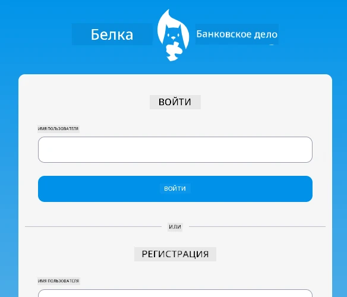
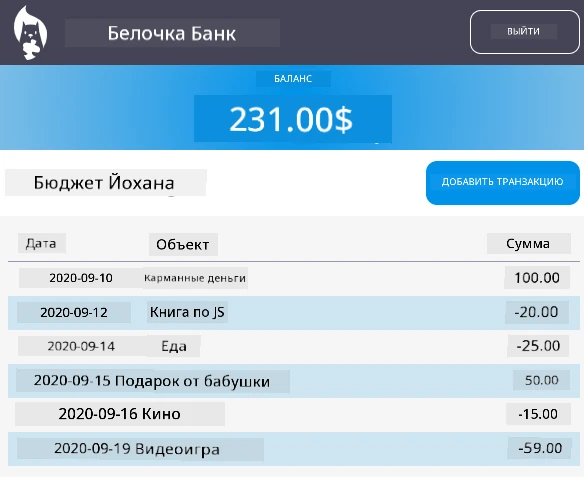

<!--
CO_OP_TRANSLATOR_METADATA:
{
  "original_hash": "830359535306594b448db6575ce5cdee",
  "translation_date": "2025-08-26T00:02:28+00:00",
  "source_file": "7-bank-project/README.md",
  "language_code": "ru"
}
-->
# :dollar: Создаем банк

В этом проекте вы научитесь создавать вымышленный банк. Эти уроки включают инструкции по созданию макета веб-приложения, настройке маршрутов, созданию форм, управлению состоянием и получению данных из API, откуда можно извлечь данные банка.

|  |  |
|--------------------------------|--------------------------------|

## Уроки

1. [HTML-шаблоны и маршруты в веб-приложении](1-template-route/README.md)
2. [Создание формы входа и регистрации](2-forms/README.md)
3. [Методы получения и использования данных](3-data/README.md)
4. [Основы управления состоянием](4-state-management/README.md)

### Благодарности

Эти уроки были написаны с :hearts: [Йоханом Ласорса](https://twitter.com/sinedied).

Если вам интересно узнать, как создать [серверный API](/7-bank-project/api/README.md), используемый в этих уроках, вы можете посмотреть [эту серию видео](https://aka.ms/NodeBeginner) (особенно видео с 17 по 21).

Также вы можете ознакомиться с [этим интерактивным учебным пособием Learn](https://aka.ms/learn/express-api).

**Отказ от ответственности**:  
Этот документ был переведен с использованием сервиса автоматического перевода [Co-op Translator](https://github.com/Azure/co-op-translator). Хотя мы стремимся к точности, пожалуйста, учитывайте, что автоматические переводы могут содержать ошибки или неточности. Оригинальный документ на его родном языке следует считать авторитетным источником. Для получения критически важной информации рекомендуется профессиональный перевод человеком. Мы не несем ответственности за любые недоразумения или неправильные интерпретации, возникающие в результате использования данного перевода.