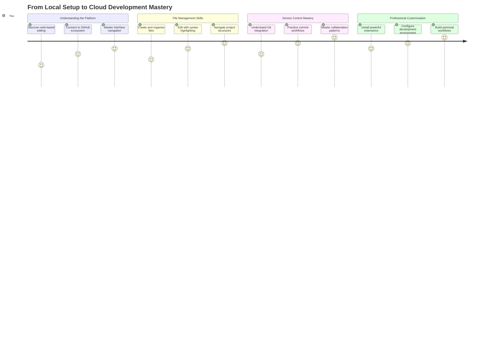
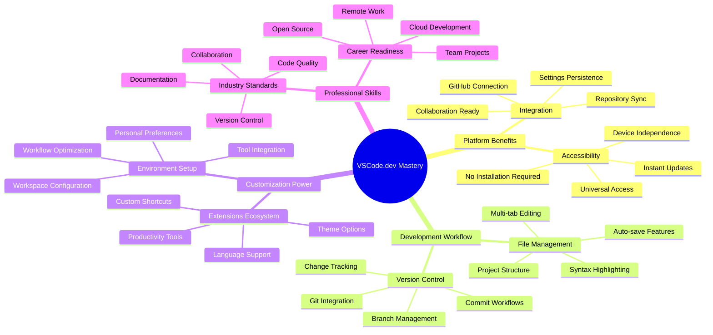
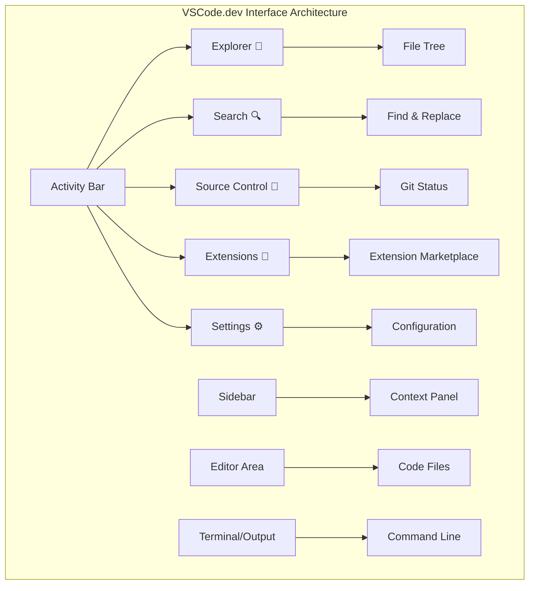
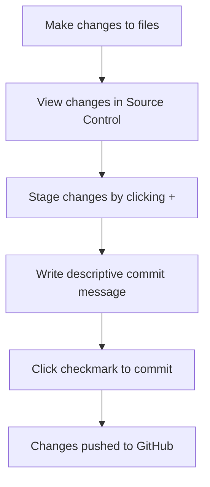
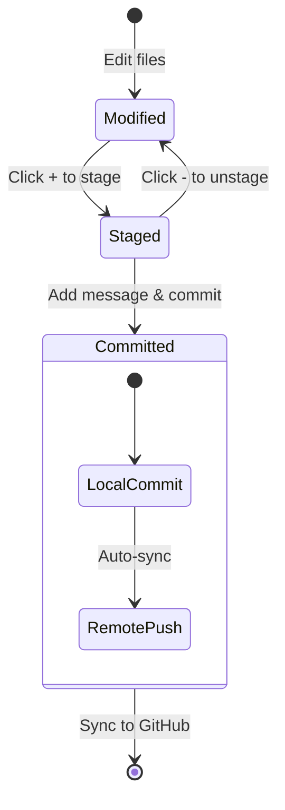
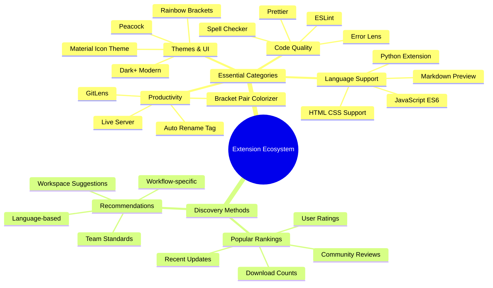
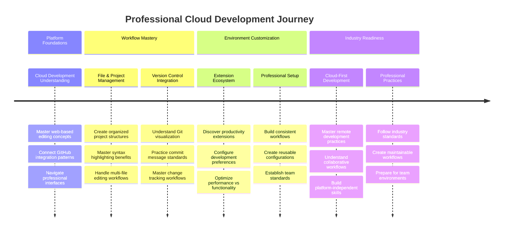

<!--
CO_OP_TRANSLATOR_METADATA:
{
  "original_hash": "a9a3bcc037a447e2d8994d99e871cd9f",
  "translation_date": "2025-11-03T23:13:32+00:00",
  "source_file": "8-code-editor/1-using-a-code-editor/README.md",
  "language_code": "ru"
}
-->
# Использование редактора кода: освоение VSCode.dev

Помните, как в *Матрице* Нео подключался к огромному компьютерному терминалу, чтобы попасть в цифровой мир? Современные инструменты веб-разработки – это совсем другая история: невероятно мощные возможности, доступные отовсюду. VSCode.dev – это редактор кода, работающий в браузере, который предоставляет профессиональные инструменты разработки на любом устройстве с доступом в интернет.

Как печатный станок сделал книги доступными для всех, а не только для монахов-писцов, так и VSCode.dev демократизирует программирование. Вы можете работать над проектами с компьютера в библиотеке, школьного класса или любого другого места, где есть доступ к браузеру. Без установок, без ограничений "мне нужна моя особая настройка".

К концу этого урока вы научитесь ориентироваться в VSCode.dev, открывать репозитории GitHub прямо в браузере и использовать Git для управления версиями – навыки, на которые профессиональные разработчики полагаются ежедневно.

## ⚡ Что можно сделать за следующие 5 минут

**Быстрый старт для занятых разработчиков**


- **Минута 1**: Перейдите на [vscode.dev](https://vscode.dev) – установка не требуется
- **Минута 2**: Войдите через GitHub, чтобы подключить свои репозитории
- **Минута 3**: Попробуйте трюк с URL: замените `github.com` на `vscode.dev/github` в любом URL репозитория
- **Минута 4**: Создайте новый файл и посмотрите, как автоматически работает подсветка синтаксиса
- **Минута 5**: Внесите изменения и зафиксируйте их через панель управления версиями

**Быстрый тестовый URL**:
```
# Transform this:
github.com/microsoft/Web-Dev-For-Beginners

# Into this:
vscode.dev/github/microsoft/Web-Dev-For-Beginners
```

**Почему это важно**: За 5 минут вы почувствуете свободу программирования в любом месте с профессиональными инструментами. Это будущее разработки – доступное, мощное и мгновенное.

## 🗺️ Ваш путь обучения облачной разработке



**Цель вашего пути**: К концу этого урока вы освоите профессиональную облачную среду разработки, которая работает на любом устройстве, позволяя вам программировать с использованием тех же инструментов, что и разработчики в крупных технологических компаниях.

## Чему вы научитесь

После прохождения этого урока вы сможете:

- Ориентироваться в VSCode.dev, как в своем втором доме – находить все необходимое без труда
- Открывать любой репозиторий GitHub в браузере и сразу начинать редактирование (это действительно волшебно!)
- Использовать Git для отслеживания изменений и сохранения прогресса, как профессионал
- Усилить свой редактор с помощью расширений, которые ускоряют и упрощают процесс программирования
- Создавать и организовывать файлы проекта с уверенностью

## Что вам понадобится

Требования просты:

- Бесплатный [аккаунт GitHub](https://github.com) (мы поможем вам создать его, если нужно)
- Базовые навыки работы с веб-браузерами
- Урок "Основы GitHub" предоставляет полезный фон, хотя он не обязателен

> 💡 **Новичок в GitHub?** Создание аккаунта бесплатно и занимает всего несколько минут. Как библиотечный билет дает доступ к книгам по всему миру, аккаунт GitHub открывает двери к репозиториям кода в интернете.

## 🧠 Обзор экосистемы облачной разработки



**Основной принцип**: Среды разработки на основе облака представляют будущее программирования – предоставляя профессиональные инструменты, которые доступны, удобны для совместной работы и независимы от платформы.

## Почему важны редакторы кода на основе веба

До появления интернета ученые из разных университетов не могли легко делиться исследованиями. Затем появился ARPANET в 1960-х годах, соединяющий компьютеры на расстоянии. Веб-редакторы кода следуют тому же принципу – предоставляют мощные инструменты, доступные независимо от вашего местоположения или устройства.

Редактор кода служит вашей рабочей средой разработки, где вы пишете, редактируете и организуете файлы кода. В отличие от простых текстовых редакторов, профессиональные редакторы кода предоставляют подсветку синтаксиса, обнаружение ошибок и функции управления проектами.

VSCode.dev переносит эти возможности в ваш браузер:

**Преимущества веб-редактирования:**

| Функция | Описание | Практическая польза |
|---------|-------------|----------|
| **Независимость от платформы** | Работает на любом устройстве с браузером | Бесшовная работа на разных компьютерах |
| **Без необходимости установки** | Доступ через веб-URL | Обход ограничений на установку программного обеспечения |
| **Автоматические обновления** | Всегда работает с последней версией | Доступ к новым функциям без ручных обновлений |
| **Интеграция с репозиториями** | Прямое подключение к GitHub | Редактирование кода без управления локальными файлами |

**Практические последствия:**
- Непрерывность работы в разных средах
- Единый интерфейс независимо от операционной системы
- Мгновенные возможности для совместной работы
- Снижение требований к локальному хранилищу

## Исследование VSCode.dev

Как лаборатория Марии Кюри содержала сложное оборудование в относительно простом пространстве, так и VSCode.dev объединяет профессиональные инструменты разработки в интерфейсе браузера. Это веб-приложение предоставляет те же основные функции, что и настольные редакторы кода.

Начните с перехода на [vscode.dev](https://vscode.dev) в вашем браузере. Интерфейс загружается без загрузок или установок системы – прямое применение принципов облачных вычислений.

### Подключение аккаунта GitHub

Как телефон Александра Грэма Белла соединял удаленные места, так и подключение вашего аккаунта GitHub связывает VSCode.dev с вашими репозиториями кода. Когда вам предложат войти через GitHub, рекомендуется принять это соединение.

**Интеграция с GitHub предоставляет:**
- Прямой доступ к вашим репозиториям в редакторе
- Синхронизированные настройки и расширения на разных устройствах
- Упрощенный процесс сохранения в GitHub
- Персонализированную среду разработки

### Знакомство с новой рабочей средой

После загрузки вы увидите красиво оформленное рабочее пространство, созданное для того, чтобы вы сосредоточились на главном – вашем коде!


**Вот ваш тур по окрестностям:**
- **Панель действий** (полоса слева): Основная навигация с Explorer 📁, Search 🔍, Source Control 🌿, Extensions 🧩 и Settings ⚙️
- **Боковая панель** (панель рядом с ней): Меняется, чтобы показывать актуальную информацию в зависимости от выбранного элемента
- **Область редактора** (большое пространство в центре): Здесь происходит магия – ваша основная зона кодирования

**Потратьте минуту на исследование:**
- Кликните по значкам на панели действий и посмотрите, что каждый из них делает
- Обратите внимание, как боковая панель обновляется, показывая различную информацию – довольно удобно, правда?
- Вид Explorer (📁) – это, вероятно, то место, где вы будете проводить большую часть времени, так что привыкните к нему



## Открытие репозиториев GitHub

До появления интернета исследователям приходилось физически посещать библиотеки, чтобы получить доступ к документам. Репозитории GitHub работают аналогично – это коллекции кода, хранящиеся удаленно. VSCode.dev устраняет традиционный шаг загрузки репозиториев на ваш локальный компьютер перед редактированием.

Эта возможность позволяет мгновенно получить доступ к любому публичному репозиторию для просмотра, редактирования или внесения вклада. Вот два метода открытия репозиториев:

### Метод 1: Способ "укажи и кликни"

Этот метод идеально подходит, если вы начинаете с нуля в VSCode.dev и хотите открыть конкретный репозиторий. Он прост и удобен для новичков:

**Как это сделать:**

1. Перейдите на [vscode.dev](https://vscode.dev), если вы еще там не находитесь
2. Найдите кнопку "Open Remote Repository" на приветственном экране и нажмите на нее

   

3. Вставьте любой URL репозитория GitHub (попробуйте этот: `https://github.com/microsoft/Web-Dev-For-Beginners`)
4. Нажмите Enter и наблюдайте за магией!

**Совет профессионала – сочетание клавиш Command Palette:**

Хотите почувствовать себя волшебником программирования? Попробуйте это сочетание клавиш: Ctrl+Shift+P (или Cmd+Shift+P на Mac), чтобы открыть Command Palette:


**Command Palette – это как поисковая система для всего, что вы можете сделать:**
- Введите "open remote", и он найдет для вас инструмент открытия репозитория
- Он запоминает недавно открытые репозитории (очень удобно!)
- Как только вы привыкнете к нему, вы почувствуете, что программируете с молниеносной скоростью
- Это, по сути, версия VSCode.dev "Эй, Siri, но для программирования"

### Метод 2: Техника модификации URL

Как HTTP и HTTPS используют разные протоколы, сохраняя ту же структуру домена, так и VSCode.dev использует шаблон URL, который отражает систему адресации GitHub. Любой URL репозитория GitHub можно изменить, чтобы открыть его прямо в VSCode.dev.

**Шаблон преобразования URL:**

| Тип репозитория | URL GitHub | URL VSCode.dev |
|----------------|---------------------|----------------|
| **Публичный репозиторий** | `github.com/microsoft/Web-Dev-For-Beginners` | `vscode.dev/github/microsoft/Web-Dev-For-Beginners` |
| **Личный проект** | `github.com/your-username/my-project` | `vscode.dev/github/your-username/my-project` |
| **Любой доступный репозиторий** | `github.com/their-username/awesome-repo` | `vscode.dev/github/their-username/awesome-repo` |

**Реализация:**
- Замените `github.com` на `vscode.dev/github`
- Сохраните все остальные компоненты URL без изменений
- Работает с любым публично доступным репозиторием
- Обеспечивает мгновенный доступ к редактированию

> 💡 **Совет, меняющий жизнь**: Добавьте в закладки версии VSCode.dev ваших любимых репозиториев. У меня есть закладки вроде "Редактировать мое портфолио" и "Исправить документацию", которые сразу переводят меня в режим редактирования!

**Какой метод использовать?**
- **Интерфейсный способ**: Отлично подходит, если вы исследуете или не можете вспомнить точные названия репозиториев
- **Трюк с URL**: Идеально для молниеносного доступа, если вы точно знаете, куда хотите попасть

### 🎯 Педагогическая проверка: доступ к облачной разработке

**Пауза и размышление**: Вы только что узнали два метода доступа к репозиториям кода через веб-браузер. Это представляет собой фундаментальный сдвиг в том, как работает разработка.

**Быстрая самооценка**:
- Можете ли вы объяснить, почему веб-редактирование устраняет традиционную "настройку среды разработки"?
- Какие преимущества предоставляет техника модификации URL по сравнению с локальным клонированием git?
- Как этот подход меняет способ вашего вклада в проекты с открытым исходным кодом?

**Связь с реальным миром**: Крупные компании, такие как GitHub, GitLab и Replit, построили свои платформы разработки вокруг этих принципов облачного подхода. Вы изучаете те же рабочие процессы, которые используют профессиональные команды разработчиков по всему миру.

**Вопрос для размышления**: Как облачная разработка может изменить способ преподавания программирования в школах? Учитывайте требования к устройствам, управление программным обеспечением и возможности для совместной работы.

## Работа с файлами и проектами

Теперь, когда вы открыли репозиторий, давайте начнем создавать! VSCode.dev предоставляет все необходимое для создания, редактирования и организации файлов кода. Представьте, что это ваша цифровая мастерская – каждый инструмент находится там, где он вам нужен.

Давайте погрузимся в повседневные задачи, которые составят большую часть вашего рабочего процесса программирования.

### Создание новых файлов

Как организация чертежей в офисе архитектора, создание файлов в VSCode.dev следует структурированному подходу. Система поддерживает все стандартные типы файлов веб-разработки.

**Процесс создания файла:**

1. Перейдите в целевую папку на боковой панели Explorer
2. Наведите курсор на имя папки, чтобы появился значок "New File" (📄+)
3. Введите имя файла, включая соответствующее расширение (`style.css`, `script.js`, `index.html`)
4. Нажмите Enter, чтобы создать файл


**Рекомендации по именованию:**
- Используйте описательные имена, указывающие на назначение файла
- Включайте расширения файлов для правильной подсветки синтаксиса
- Следуйте единым шаблонам именования в проектах
- Используйте строчные буквы и дефисы вместо пробелов

### Редактирование и сохранение файлов

Вот где начинается настоящее веселье! Редактор VSCode.dev наполнен полезными функциями, которые делают процесс кодирования плавным и интуитивным. Это как иметь очень умного помощника для написания, но для кода.

**Ваш рабочий процесс редактирования:**

1. Нажмите на любой файл в Explorer, чтобы открыть его в основной области
2. Начните вводить текст и наблюдайте, как VSCode.dev помогает вам с цветами, подсказками и обнаружением ошибок
3. Сохраните свою работу с помощью Ctrl+S (Windows/Linux) или Cmd+S (Mac) – хотя он также автоматически сохраняет!


**Крутые вещи, которые происходят во время кодирования:**
- Ваш код красиво подсвечивается, чтобы его было легко читать
- VSCode.dev предлагает автозаполнение во время ввода (как автокоррекция, но намного умнее)
- Он обнаруживает опечатки и ошибки до того, как вы сохраните
- Вы можете открыть несколько файлов в вкладках, как в браузере
- Все автоматически сохраняется в фоновом режиме

> ⚠️ **Быстрый совет**: Хотя автосохранение всегда вас поддерживает, нажимать Ctrl+S или Cmd+S – все еще хорошая привычка. Это немедленно сохраняет все и запускает дополнительные полезные функции, такие как проверка ошибок.

### Управление версиями с помощью Git

Как археологи создают подробные записи слоев раскопок, так и Git отслеживает изменения в вашем коде с течением времени. Эта система сохраняет историю проекта и позволяет вам возвращаться к предыдущим версиям, когда это необходимо. VSCode.dev включает встроенную функциональность Git.

**Интерфейс управления версиями:**

1. Доступ к панели Source Control через значок 🌿 на панели действий
2. Измененные файлы появляются в разделе "Changes"
3. Цветовая кодировка указывает тип изменений: зеленый для добавлений, красный для удалений


**Сохранение работы (процесс фиксации):**





**Ваш пошаговый процесс:**
- Нажмите на значок "+" рядом с файлами, которые вы хотите сохранить (это их "стадирует")
- Убедитесь, что вы довольны всеми подготовленными изменениями  
- Напишите короткую заметку, объясняющую, что вы сделали (это ваше "сообщение коммита")  
- Нажмите кнопку с галочкой, чтобы сохранить все на GitHub  
- Если вы передумали, значок отмены позволяет отменить изменения  

**Как писать хорошие сообщения коммитов (это проще, чем кажется!):**  
- Просто опишите, что вы сделали, например, "Добавить контактную форму" или "Исправить сломанную навигацию"  
- Держите сообщение коротким и лаконичным – думайте о длине твита, а не эссе  
- Начинайте с глаголов, таких как "Добавить", "Исправить", "Обновить" или "Удалить"  
- **Хорошие примеры**: "Добавить адаптивное меню навигации", "Исправить проблемы с мобильной версткой", "Обновить цвета для улучшения доступности"  

> 💡 **Совет по быстрой навигации**: Используйте значок "гамбургер" (☰) в верхнем левом углу, чтобы вернуться к вашему репозиторию на GitHub и увидеть ваши сохраненные изменения онлайн. Это как портал между вашей средой редактирования и домашней страницей вашего проекта на GitHub!  

## Улучшение функциональности с помощью расширений  

Как в мастерской мастера есть специализированные инструменты для разных задач, так и VSCode.dev можно настроить с помощью расширений, которые добавляют определенные возможности. Эти плагины, разработанные сообществом, решают распространенные задачи разработки, такие как форматирование кода, предварительный просмотр и улучшенная интеграция с Git.  

В магазине расширений представлены тысячи бесплатных инструментов, созданных разработчиками со всего мира. Каждое расширение решает конкретные задачи рабочего процесса, позволяя создать персонализированную среду разработки, соответствующую вашим потребностям и предпочтениям.  


  
### Поиск идеальных расширений  

Магазин расширений очень хорошо организован, поэтому вы не потеряетесь, пытаясь найти то, что вам нужно. Он создан, чтобы помочь вам открыть как конкретные инструменты, так и интересные вещи, о которых вы даже не подозревали!  

**Как попасть в магазин:**  

1. Нажмите на значок расширений (🧩) в панели активности  
2. Просмотрите или найдите что-то конкретное  
3. Нажмите на то, что кажется интересным, чтобы узнать больше  

  

**Что вы там найдете:**  

| Раздел | Что внутри | Почему это полезно |  
|----------|---------|----------|  
| **Установленные** | Расширения, которые вы уже добавили | Ваш персональный набор инструментов для кодинга |  
| **Популярные** | Любимые расширения большинства | То, что рекомендуют разработчики |  
| **Рекомендуемые** | Умные предложения для вашего проекта | Полезные рекомендации от VSCode.dev |  

**Что делает просмотр удобным:**  
- Каждое расширение показывает рейтинги, количество загрузок и реальные отзывы пользователей  
- Вы видите скриншоты и четкие описания того, что делает каждое расширение  
- Все четко обозначено с информацией о совместимости  
- Предлагаются похожие расширения, чтобы вы могли сравнить варианты  

### Установка расширений (это очень просто!)  

Добавить новые возможности в ваш редактор так же просто, как нажать кнопку. Расширения устанавливаются за секунды и начинают работать сразу – без перезагрузок и ожидания.  

**Вот что нужно сделать:**  

1. Найдите то, что вам нужно (например, "live server" или "prettier")  
2. Нажмите на подходящее расширение, чтобы узнать больше  
3. Ознакомьтесь с его описанием и рейтингами  
4. Нажмите синюю кнопку "Установить" – и готово!  

  

**Что происходит за кулисами:**  
- Расширение загружается и автоматически настраивается  
- Новые функции появляются в интерфейсе сразу  
- Все начинает работать мгновенно (серьезно, это так быстро!)  
- Если вы вошли в систему, расширение синхронизируется на всех ваших устройствах  

**Некоторые расширения, которые я рекомендую начать использовать:**  
- **Live Server**: Позволяет видеть обновления вашего сайта в реальном времени, пока вы пишете код (это просто волшебство!)  
- **Prettier**: Автоматически делает ваш код чистым и профессиональным  
- **Auto Rename Tag**: Измените один HTML-тег, и его парный тег тоже обновится  
- **Bracket Pair Colorizer**: Раскрашивает скобки, чтобы вы не запутались  
- **GitLens**: Улучшает функции Git с множеством полезной информации  

### Настройка ваших расширений  

Большинство расширений имеют настройки, которые можно изменить, чтобы они работали так, как вам нравится. Это как настроить сиденье и зеркала в машине – у каждого свои предпочтения!  

**Настройка параметров расширений:**  

1. Найдите установленное расширение в панели расширений  
2. Найдите значок шестеренки (⚙️) рядом с его названием и нажмите на него  
3. Выберите "Настройки расширения" в выпадающем меню  
4. Настройте параметры так, чтобы они идеально подходили для вашего рабочего процесса  

  

**Что можно настроить:**  
- Как форматируется ваш код (табуляция или пробелы, длина строки и т.д.)  
- Какие сочетания клавиш запускают разные действия  
- С какими типами файлов должно работать расширение  
- Включение или отключение определенных функций для упрощения интерфейса  

### Организация ваших расширений  

Когда вы найдете больше интересных расширений, вам захочется держать свою коллекцию в порядке и поддерживать ее в хорошем состоянии. VSCode.dev делает управление этим очень простым.  

**Варианты управления расширениями:**  

| Что можно сделать | Когда это полезно | Совет |  
|--------|---------|----------|  
| **Отключить** | Проверка, вызывает ли расширение проблемы | Лучше, чем удалять, если вы хотите вернуть его позже |  
| **Удалить** | Полное удаление ненужных расширений | Поддерживает вашу среду чистой и быстрой |  
| **Обновить** | Получение новых функций и исправлений ошибок | Обычно происходит автоматически, но стоит проверять |  

**Как я управляю расширениями:**  
- Каждые несколько месяцев я пересматриваю, что установлено, и удаляю то, чем не пользуюсь  
- Я обновляю расширения, чтобы получать последние улучшения и исправления безопасности  
- Если что-то кажется медленным, я временно отключаю расширения, чтобы выяснить, в чем проблема  
- Я читаю заметки об обновлениях, когда расширения получают крупные обновления – иногда там есть крутые новые функции!  

> ⚠️ **Совет по производительности**: Расширения – это здорово, но их слишком большое количество может замедлить работу. Сосредоточьтесь на тех, которые действительно облегчают вашу жизнь, и не бойтесь удалять те, которые вы не используете.  

### 🎯 Педагогическая проверка: Настройка среды разработки  

**Понимание архитектуры**: Вы научились настраивать профессиональную среду разработки с помощью расширений, созданных сообществом. Это отражает, как команды разработчиков создают стандартизированные наборы инструментов.  

**Ключевые освоенные концепции**:  
- **Поиск расширений**: Поиск инструментов для решения конкретных задач разработки  
- **Настройка среды**: Адаптация инструментов под личные или командные предпочтения  
- **Оптимизация производительности**: Баланс между функциональностью и производительностью системы  
- **Сотрудничество в сообществе**: Использование инструментов, созданных глобальным сообществом разработчиков  

**Связь с индустрией**: Экосистемы расширений поддерживают крупные платформы разработки, такие как VS Code, Chrome DevTools и современные IDE. Умение оценивать, устанавливать и настраивать расширения важно для профессиональных рабочих процессов разработки.  

**Вопрос для размышления**: Как бы вы подошли к созданию стандартизированной среды разработки для команды из 10 разработчиков? Учитывайте консистентность, производительность и индивидуальные предпочтения.  

## 📈 Ваш график освоения облачной разработки  


  
**🎓 Этап завершения обучения**: Вы успешно освоили облачную разработку, используя те же инструменты и рабочие процессы, которые применяют профессиональные разработчики в крупных технологических компаниях. Эти навыки представляют будущее разработки программного обеспечения.  

**🔄 Следующий уровень возможностей**:  
- Готовность к изучению продвинутых платформ облачной разработки (Codespaces, GitPod)  
- Подготовленность к работе в распределенных командах разработчиков  
- Готовность к участию в глобальных проектах с открытым исходным кодом  
- Заложена основа для современных практик DevOps и непрерывной интеграции  

## Вызов агента GitHub Copilot 🚀  

Как структурированный подход NASA к космическим миссиям, этот вызов включает систематическое применение навыков VSCode.dev в полном сценарии рабочего процесса.  

**Цель:** Продемонстрировать владение VSCode.dev, установив комплексный рабочий процесс веб-разработки.  

**Требования к проекту:** Используя помощь в режиме Agent, выполните следующие задачи:  
1. Форкните существующий репозиторий или создайте новый  
2. Настройте функциональную структуру проекта с файлами HTML, CSS и JavaScript  
3. Установите и настройте три расширения для улучшения разработки  
4. Практикуйте контроль версий с описательными сообщениями коммитов  
5. Попробуйте создать и изменить ветку для новой функции  
6. Задокументируйте процесс и выводы в файле README.md  

Это упражнение объединяет все концепции VSCode.dev в практический рабочий процесс, который можно применить к будущим проектам разработки.  

Узнайте больше о [режиме агента](https://code.visualstudio.com/blogs/2025/02/24/introducing-copilot-agent-mode) здесь.  

## Задание  

Пора протестировать эти навыки на практике! У меня есть практическое задание, которое позволит вам применить все, что мы изучили: [Создайте сайт-резюме с использованием VSCode.dev](./assignment.md)  

В этом задании вы создадите профессиональный сайт-резюме полностью в браузере. Вы будете использовать все функции VSCode.dev, которые мы изучили, и в конце у вас будет как отлично выглядящий сайт, так и уверенность в новом рабочем процессе.  

## Продолжайте изучать и развивать свои навыки  

Теперь у вас есть прочная основа, но впереди еще много интересного! Вот несколько ресурсов и идей для дальнейшего развития ваших навыков работы с VSCode.dev:  

**Официальная документация, которую стоит сохранить:**  
- [Документация по VSCode Web](https://code.visualstudio.com/docs/editor/vscode-web?WT.mc_id=academic-0000-alfredodeza) – Полное руководство по редактированию в браузере  
- [GitHub Codespaces](https://docs.github.com/en/codespaces) – Если вам нужно еще больше возможностей в облаке  

**Крутые функции, которые стоит попробовать:**  
- **Горячие клавиши**: Изучите комбинации клавиш, которые сделают вас мастером кодинга  
- **Настройки рабочего пространства**: Настройте разные среды для разных типов проектов  
- **Многокорневые рабочие пространства**: Работайте с несколькими репозиториями одновременно (очень удобно!)  
- **Интеграция терминала**: Доступ к инструментам командной строки прямо в браузере  

**Идеи для практики:**  
- Присоединяйтесь к проектам с открытым исходным кодом и вносите вклад, используя VSCode.dev – это отличный способ внести свой вклад!  
- Пробуйте разные расширения, чтобы найти идеальную настройку  
- Создавайте шаблоны проектов для тех типов сайтов, которые вы создаете чаще всего  
- Практикуйте рабочие процессы Git, такие как создание веток и слияние – эти навыки очень ценятся в командных проектах  

---

**Вы освоили разработку в браузере!** 🎉 Как изобретение портативных инструментов позволило ученым проводить исследования в удаленных местах, VSCode.dev позволяет профессионально кодировать с любого устройства, подключенного к интернету.  

Эти навыки отражают современные практики индустрии – многие профессиональные разработчики используют облачные среды разработки за их гибкость и доступность. Вы освоили рабочий процесс, который подходит как для индивидуальных проектов, так и для крупных командных коллабораций.  

Примените эти техники в вашем следующем проекте разработки! 🚀  

---

**Отказ от ответственности**:  
Этот документ был переведен с использованием сервиса автоматического перевода [Co-op Translator](https://github.com/Azure/co-op-translator). Хотя мы стремимся к точности, пожалуйста, учитывайте, что автоматические переводы могут содержать ошибки или неточности. Оригинальный документ на его родном языке следует считать авторитетным источником. Для получения критически важной информации рекомендуется профессиональный перевод человеком. Мы не несем ответственности за любые недоразумения или неправильные интерпретации, возникающие в результате использования данного перевода.