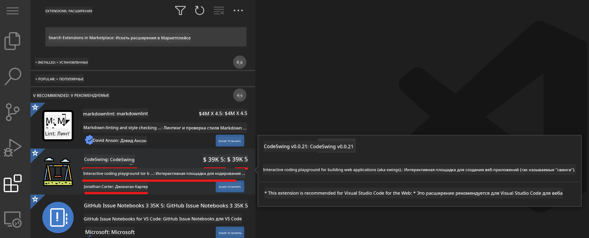

<!--
CO_OP_TRANSLATOR_METADATA:
{
  "original_hash": "7aa6e4f270d38d9cb17f2b5bd86b863d",
  "translation_date": "2025-08-25T23:15:07+00:00",
  "source_file": "8-code-editor/1-using-a-code-editor/README.md",
  "language_code": "ru"
}
-->
# Использование редактора кода

Этот урок охватывает основы использования [VSCode.dev](https://vscode.dev), веб-редактора кода, чтобы вы могли вносить изменения в свой код и участвовать в проекте, не устанавливая ничего на свой компьютер.

<!----
TODO: добавить необязательное изображение

> Скетчноут от [Author name](https://example.com)
---->

<!---
## Викторина перед лекцией
[Викторина перед лекцией](https://ashy-river-0debb7803.1.azurestaticapps.net/quiz/3)
---->

## Цели обучения

В этом уроке вы научитесь:

- Использовать редактор кода в проекте
- Отслеживать изменения с помощью системы контроля версий
- Настраивать редактор для разработки

### Предварительные требования

Перед началом вам нужно создать аккаунт на [GitHub](https://github.com). Перейдите на [GitHub](https://github.com/) и создайте аккаунт, если у вас его еще нет.

### Введение

Редактор кода — это важный инструмент для написания программ и работы с существующими проектами. Как только вы освоите основы редактора и научитесь использовать его функции, вы сможете применять их при написании кода.

## Начало работы с VSCode.dev

[VSCode.dev](https://vscode.dev) — это редактор кода в вебе. Вам не нужно ничего устанавливать, чтобы его использовать, как при открытии любого другого сайта. Чтобы начать работу с редактором, откройте следующую ссылку: [https://vscode.dev](https://vscode.dev). Если вы не вошли в [GitHub](https://github.com/), следуйте подсказкам, чтобы войти или создать новый аккаунт, а затем войдите.

После загрузки редактор должен выглядеть примерно так:


Есть три основные секции, начиная с крайней левой и двигаясь вправо:

1. _Панель активности_, которая включает несколько иконок, таких как увеличительное стекло 🔎, шестеренка ⚙️ и другие.
2. Расширенная панель активности, которая по умолчанию отображает _Обозреватель_, называемый _боковой панелью_.
3. И, наконец, область кода справа.

Нажмите на каждую из иконок, чтобы открыть разные меню. После этого вернитесь к _Обозревателю_, чтобы оказаться там, где начали.

Когда вы начнете создавать код или изменять существующий, это будет происходить в самой большой области справа. Вы также будете использовать эту область для просмотра существующего кода, что сделаете далее.

## Открытие репозитория GitHub

Первое, что вам нужно сделать, — это открыть репозиторий GitHub. Существует несколько способов открыть репозиторий. В этом разделе вы увидите два разных способа, как это сделать, чтобы начать вносить изменения.

### 1. Через редактор

Используйте сам редактор, чтобы открыть удаленный репозиторий. Если вы зайдете на [VSCode.dev](https://vscode.dev), вы увидите кнопку _"Open Remote Repository"_:


Вы также можете использовать палитру команд. Палитра команд — это поле ввода, где вы можете ввести любое слово, связанное с командой или действием, чтобы найти нужную команду для выполнения. Используйте меню в верхнем левом углу, затем выберите _View_, а потом _Command Palette_, или используйте следующую комбинацию клавиш: Ctrl-Shift-P (на MacOS — Command-Shift-P).


После открытия меню введите _open remote repository_, а затем выберите первый вариант. Появятся несколько репозиториев, которыми вы пользуетесь или которые открывали недавно. Вы также можете использовать полный URL GitHub для выбора. Вставьте следующий URL в поле:

```
https://github.com/microsoft/Web-Dev-For-Beginners
```

✅ Если все прошло успешно, вы увидите все файлы этого репозитория, загруженные в текстовый редактор.

### 2. Используя URL

Вы также можете использовать URL напрямую, чтобы загрузить репозиторий. Например, полный URL текущего репозитория — [https://github.com/microsoft/Web-Dev-For-Beginners](https://github.com/microsoft/Web-Dev-For-Beginners), но вы можете заменить домен GitHub на `VSCode.dev/github` и загрузить репозиторий напрямую. Получившийся URL будет [https://vscode.dev/github/microsoft/Web-Dev-For-Beginners](https://vscode.dev/github/microsoft/Web-Dev-For-Beginners).

## Редактирование файлов

После того как вы открыли репозиторий в браузере/vscode.dev, следующим шагом будет внесение обновлений или изменений в проект.

### 1. Создание нового файла

Вы можете создать файл внутри существующей папки или в корневом каталоге/папке. Чтобы создать новый файл, откройте место/каталог, в котором вы хотите сохранить файл, и выберите иконку _'New file ...'_ на панели активности _(слева)_, дайте ему имя и нажмите Enter.


### 2. Редактирование и сохранение файла в репозитории

Использование vscode.dev полезно, когда вы хотите быстро обновить свой проект, не загружая никакое программное обеспечение локально. Чтобы обновить код, нажмите на иконку 'Explorer', также расположенную на панели активности, чтобы просмотреть файлы и папки в репозитории. Выберите файл, чтобы открыть его в области кода, внесите изменения и сохраните.


После того как вы закончите обновлять проект, выберите иконку _`source control`_, которая содержит все новые изменения, внесенные вами в репозиторий.

Чтобы просмотреть изменения, которые вы внесли в проект, выберите файл(ы) в папке `Changes` на расширенной панели активности. Это откроет 'Рабочее дерево', где вы сможете визуально увидеть изменения, внесенные в файл. Красный цвет показывает удаление из проекта, а зеленый — добавление.


Если вас устраивают внесенные изменения, наведите курсор на папку `Changes` и нажмите кнопку `+`, чтобы подготовить изменения. Подготовка означает подготовку изменений для их фиксации в GitHub.

Если же вас не устраивают некоторые изменения и вы хотите их отменить, наведите курсор на папку `Changes` и выберите иконку `undo`.

Затем введите `commit message` _(описание изменений, внесенных в проект)_, нажмите иконку `check`, чтобы зафиксировать и отправить изменения.

После завершения работы над проектом выберите иконку `гамбургер-меню` в верхнем левом углу, чтобы вернуться к репозиторию на github.com.


## Использование расширений

Установка расширений в VSCode позволяет добавлять новые функции и настраивать параметры среды разработки в редакторе, чтобы улучшить рабочий процесс. Эти расширения также помогают добавлять поддержку для различных языков программирования и часто бывают либо универсальными, либо языковыми.

Чтобы просмотреть список всех доступных расширений, нажмите на иконку _`Extensions`_ на панели активности и начните вводить название расширения в текстовом поле с надписью _'Search Extensions in Marketplace'_. Вы увидите список расширений, каждое из которых содержит **название расширения, имя издателя, краткое описание, количество загрузок** и **рейтинг в звездах**.



Вы также можете просмотреть все ранее установленные расширения, развернув папку _`Installed`_, популярные расширения, используемые большинством разработчиков, в папке _`Popular`_, и рекомендованные расширения для вас, либо от пользователей в той же рабочей области, либо на основе недавно открытых файлов, в папке _`Recommended`_.


### 1. Установка расширений

Чтобы установить расширение, введите его название в поле поиска и нажмите на него, чтобы просмотреть дополнительную информацию о расширении в области кода, как только оно появится на расширенной панели активности.

Вы можете либо нажать _синюю кнопку установки_ на расширенной панели активности, чтобы установить расширение, либо использовать кнопку установки, которая появляется в области кода после выбора расширения для загрузки дополнительной информации.


### 2. Настройка расширений

После установки расширения вам может понадобиться изменить его поведение и настроить его в соответствии с вашими предпочтениями. Для этого выберите иконку Extensions, и теперь ваше расширение появится в папке _Installed_, нажмите на _**иконку шестеренки**_ и перейдите в _Extensions Setting_.


### 3. Управление расширениями

После установки и использования расширения vscode.dev предлагает варианты управления расширением в зависимости от различных потребностей. Например, вы можете:

- **Отключить:** _(Вы временно отключаете расширение, если оно вам больше не нужно, но не хотите полностью его удалять)_

    Выберите установленное расширение на расширенной панели активности > нажмите на иконку шестеренки > выберите 'Disable' или 'Disable (Workspace)' **ИЛИ** откройте расширение в области кода и нажмите синюю кнопку Disable.

   
- **Удалить:** Выберите установленное расширение на расширенной панели активности > нажмите на иконку шестеренки > выберите 'Uninstall' **ИЛИ** откройте расширение в области кода и нажмите синюю кнопку Uninstall.

---

## Задание

[Создайте сайт-резюме, используя vscode.dev](https://github.com/microsoft/Web-Dev-For-Beginners/blob/main/8-code-editor/1-using-a-code-editor/assignment.md)

<!----
## Викторина после лекции
[Викторина после лекции](https://ashy-river-0debb7803.1.azurestaticapps.net/quiz/4)
---->

## Обзор и самостоятельное изучение

Прочитайте больше о [VSCode.dev](https://code.visualstudio.com/docs/editor/vscode-web?WT.mc_id=academic-0000-alfredodeza) и некоторых его других функциях.

**Отказ от ответственности**:  
Этот документ был переведен с использованием сервиса автоматического перевода [Co-op Translator](https://github.com/Azure/co-op-translator). Хотя мы стремимся к точности, пожалуйста, учитывайте, что автоматические переводы могут содержать ошибки или неточности. Оригинальный документ на его родном языке следует считать авторитетным источником. Для получения критически важной информации рекомендуется профессиональный перевод человеком. Мы не несем ответственности за любые недоразумения или неправильные интерпретации, возникающие в результате использования данного перевода.