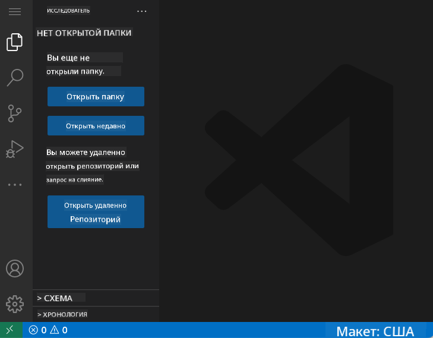
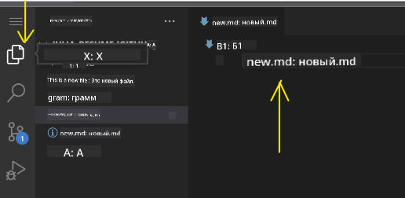
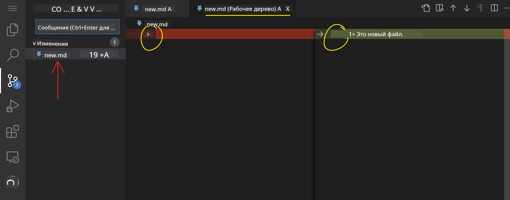
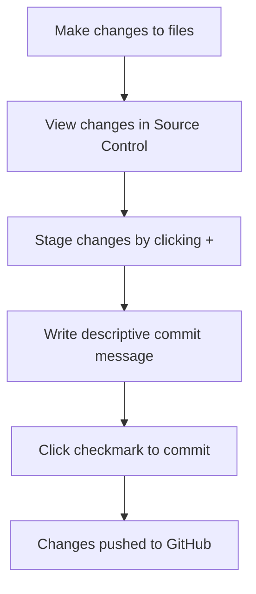
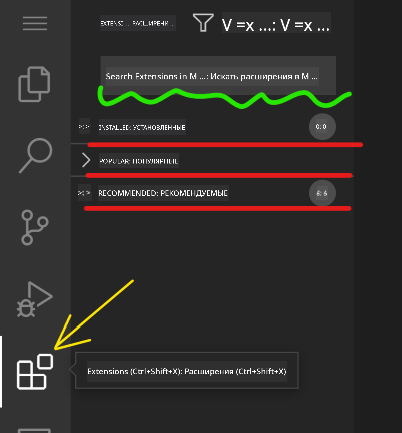
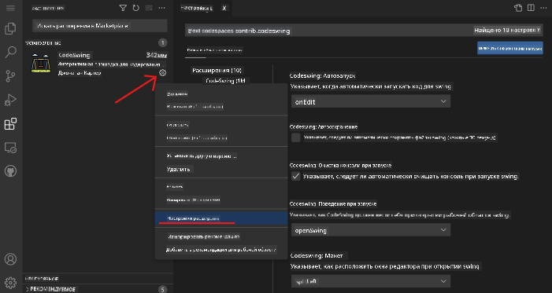

<!--
CO_OP_TRANSLATOR_METADATA:
{
  "original_hash": "cfd4a15974168ca426d50c67682ab9d4",
  "translation_date": "2025-10-22T22:10:55+00:00",
  "source_file": "8-code-editor/1-using-a-code-editor/README.md",
  "language_code": "ru"
}
-->
# Использование редактора кода: освоение VSCode.dev

Помните, как в *Матрице* Нео подключался к огромному компьютерному терминалу, чтобы попасть в цифровой мир? Современные инструменты веб-разработки – это полная противоположность: невероятно мощные возможности, доступные отовсюду. VSCode.dev – это редактор кода, работающий в браузере, который предоставляет профессиональные инструменты разработки на любом устройстве с доступом в интернет.

Точно так же, как печатный станок сделал книги доступными для всех, а не только для монахов-писцов, VSCode.dev демократизирует программирование. Вы можете работать над проектами с компьютера в библиотеке, школьного класса или любого другого места, где есть доступ к браузеру. Без установок, без ограничений вроде "мне нужна моя специфическая настройка".

К концу этого урока вы научитесь ориентироваться в VSCode.dev, открывать репозитории GitHub прямо в браузере и использовать Git для контроля версий – навыки, на которые профессиональные разработчики полагаются ежедневно.

## Чему вы научитесь

После прохождения этого урока вы сможете:

- Ориентироваться в VSCode.dev, как в своем втором доме – находить все необходимое без путаницы
- Открывать любой репозиторий GitHub в браузере и сразу начинать редактирование (это действительно волшебно!)
- Использовать Git для отслеживания изменений и сохранения прогресса, как профессионал
- Усилить редактор с помощью расширений, которые делают программирование быстрее и интереснее
- Создавать и организовывать файлы проекта с уверенностью

## Что вам понадобится

Требования просты:

- Бесплатный [аккаунт GitHub](https://github.com) (мы покажем, как его создать, если нужно)
- Базовые знания работы с веб-браузерами
- Урок "Основы GitHub" предоставляет полезный фон, хотя он не обязателен

> 💡 **Новичок в GitHub?** Создание аккаунта бесплатно и занимает всего несколько минут. Как библиотечная карта дает доступ к книгам по всему миру, аккаунт GitHub открывает двери к репозиториям кода в интернете.

## Почему важны редакторы кода на основе веба

До появления интернета ученые из разных университетов не могли легко делиться исследованиями. Затем в 1960-х годах появился ARPANET, соединяющий компьютеры на расстоянии. Редакторы кода на основе веба следуют тому же принципу – предоставляют мощные инструменты независимо от вашего физического местоположения или устройства.

Редактор кода служит вашей рабочей средой для разработки, где вы пишете, редактируете и организуете файлы кода. В отличие от простых текстовых редакторов, профессиональные редакторы кода предоставляют подсветку синтаксиса, обнаружение ошибок и функции управления проектами.

VSCode.dev переносит эти возможности в ваш браузер:

**Преимущества веб-редактирования:**

| Функция | Описание | Практическая польза |
|---------|-------------|----------|
| **Независимость от платформы** | Работает на любом устройстве с браузером | Бесшовная работа на разных компьютерах |
| **Без необходимости установки** | Доступ через веб-URL | Обход ограничений на установку программного обеспечения |
| **Автоматические обновления** | Всегда работает с последней версией | Доступ к новым функциям без ручных обновлений |
| **Интеграция с репозиториями** | Прямая связь с GitHub | Редактирование кода без управления локальными файлами |

**Практические последствия:**
- Непрерывность работы в разных средах
- Единый интерфейс независимо от операционной системы
- Мгновенные возможности для совместной работы
- Снижение требований к локальному хранилищу

## Исследуем VSCode.dev

Точно так же, как лаборатория Марии Кюри содержала сложное оборудование в относительно простом пространстве, VSCode.dev упаковывает профессиональные инструменты разработки в интерфейс браузера. Это веб-приложение предоставляет те же основные функции, что и настольные редакторы кода.

Начните с перехода на [vscode.dev](https://vscode.dev) в вашем браузере. Интерфейс загружается без загрузок или установок системы – прямое применение принципов облачных вычислений.

### Подключение вашего аккаунта GitHub

Как телефон Александра Грэма Белла соединял удаленные места, так и подключение вашего аккаунта GitHub связывает VSCode.dev с вашими репозиториями кода. Когда вам предложат войти в систему через GitHub, рекомендуется принять это соединение.

**Интеграция с GitHub предоставляет:**
- Прямой доступ к вашим репозиториям в редакторе
- Синхронизацию настроек и расширений на разных устройствах
- Упрощенный процесс сохранения в GitHub
- Персонализированную среду разработки

### Знакомство с новым рабочим пространством

Когда все загрузится, вы увидите красиво оформленное рабочее пространство, созданное для того, чтобы вы могли сосредоточиться на главном – вашем коде!

**Вот ваш гид по окрестностям:**
- **Панель действий** (полоса слева): Ваш основной навигатор с Проводником 📁, Поиском 🔍, Контролем версий 🌿, Расширениями 🧩 и Настройками ⚙️
- **Боковая панель** (панель рядом с ней): Меняется, чтобы показывать актуальную информацию в зависимости от выбранного элемента
- **Область редактора** (большое пространство в центре): Здесь происходит магия – ваша основная зона для кодирования

**Потратьте минуту на исследование:**
- Кликните по значкам на Панели действий и посмотрите, что каждый из них делает
- Обратите внимание, как боковая панель обновляется, показывая различную информацию – довольно удобно, правда?
- Вид Проводника (📁) – это, вероятно, то место, где вы будете проводить большую часть времени, так что привыкните к нему

## Открытие репозиториев GitHub

До появления интернета исследователям приходилось физически ездить в библиотеки, чтобы получить доступ к документам. Репозитории GitHub работают аналогично – это коллекции кода, хранящиеся удаленно. VSCode.dev устраняет традиционный шаг загрузки репозиториев на ваш локальный компьютер перед редактированием.

Эта возможность обеспечивает мгновенный доступ к любому публичному репозиторию для просмотра, редактирования или внесения изменений. Вот два способа открытия репозиториев:

### Метод 1: Способ "укажи и кликни"

Этот способ идеально подходит, если вы только начинаете работать с VSCode.dev и хотите открыть конкретный репозиторий. Он прост и удобен для новичков:

**Как это сделать:**

1. Перейдите на [vscode.dev](https://vscode.dev), если вы еще не там
2. Найдите кнопку "Open Remote Repository" на приветственном экране и нажмите на нее

   

3. Вставьте любой URL репозитория GitHub (попробуйте этот: `https://github.com/microsoft/Web-Dev-For-Beginners`)
4. Нажмите Enter и наблюдайте за магией!

**Совет профессионала – сочетание клавиш для Command Palette:**

Хотите почувствовать себя волшебником программирования? Попробуйте это сочетание клавиш: Ctrl+Shift+P (или Cmd+Shift+P на Mac), чтобы открыть Command Palette:

**Command Palette – это как поисковая система для всего, что вы можете сделать:**
- Введите "open remote", и она найдет для вас инструмент открытия репозитория
- Она запоминает недавно открытые вами репозитории (очень удобно!)
- Когда вы привыкнете к ней, вы будете чувствовать себя, как будто программируете со скоростью света
- Это, по сути, версия VSCode.dev "Эй, Siri, но для программирования"

### Метод 2: Техника модификации URL

Точно так же, как HTTP и HTTPS используют разные протоколы, сохраняя ту же структуру домена, VSCode.dev использует шаблон URL, который отражает систему адресации GitHub. Любой URL репозитория GitHub можно изменить, чтобы открыть его прямо в VSCode.dev.

**Шаблон преобразования URL:**

| Тип репозитория | URL GitHub | URL VSCode.dev |
|----------------|---------------------|----------------|
| **Публичный репозиторий** | `github.com/microsoft/Web-Dev-For-Beginners` | `vscode.dev/github/microsoft/Web-Dev-For-Beginners` |
| **Личный проект** | `github.com/your-username/my-project` | `vscode.dev/github/your-username/my-project` |
| **Любой доступный репозиторий** | `github.com/their-username/awesome-repo` | `vscode.dev/github/their-username/awesome-repo` |

**Реализация:**
- Замените `github.com` на `vscode.dev/github`
- Сохраните все остальные компоненты URL без изменений
- Работает с любым публично доступным репозиторием
- Обеспечивает мгновенный доступ к редактированию

> 💡 **Совет, меняющий жизнь**: Добавьте в закладки версии VSCode.dev ваших любимых репозиториев. У меня есть закладки вроде "Редактировать мое портфолио" и "Исправить документацию", которые сразу переводят меня в режим редактирования!

**Какой метод использовать?**
- **Интерфейсный способ**: Отлично подходит, если вы исследуете или не можете вспомнить точные названия репозиториев
- **Трюк с URL**: Идеально для молниеносного доступа, если вы точно знаете, куда хотите попасть

## Работа с файлами и проектами

Теперь, когда вы открыли репозиторий, давайте начнем создавать! VSCode.dev предоставляет все необходимое для создания, редактирования и организации ваших файлов кода. Представьте это как вашу цифровую мастерскую – каждый инструмент находится там, где он вам нужен.

Давайте погрузимся в повседневные задачи, которые составляют большую часть вашего рабочего процесса программирования.

### Создание новых файлов

Как организация чертежей в офисе архитектора, создание файлов в VSCode.dev следует структурированному подходу. Система поддерживает все стандартные типы файлов веб-разработки.

**Процесс создания файла:**

1. Перейдите в целевую папку на боковой панели Проводника
2. Наведите курсор на имя папки, чтобы появился значок "Новый файл" (📄+)
3. Введите имя файла, включая соответствующее расширение (`style.css`, `script.js`, `index.html`)
4. Нажмите Enter, чтобы создать файл

**Рекомендации по именованию:**
- Используйте описательные названия, которые указывают на назначение файла
- Включайте расширения файлов для правильной подсветки синтаксиса
- Следуйте единым шаблонам именования в проектах
- Используйте строчные буквы и дефисы вместо пробелов

### Редактирование и сохранение файлов

Вот где начинается настоящее веселье! Редактор VSCode.dev наполнен полезными функциями, которые делают программирование плавным и интуитивно понятным. Это как иметь очень умного помощника для написания, но для кода.

**Ваш рабочий процесс редактирования:**

1. Кликните на любой файл в Проводнике, чтобы открыть его в основной области
2. Начните вводить текст и наблюдайте, как VSCode.dev помогает вам с цветами, подсказками и обнаружением ошибок
3. Сохраните свою работу с помощью Ctrl+S (Windows/Linux) или Cmd+S (Mac) – хотя он также автоматически сохраняет!

**Крутые вещи, которые происходят во время кодирования:**
- Ваш код красиво подсвечивается, чтобы его было легко читать
- VSCode.dev предлагает завершения, пока вы вводите текст (как автокоррекция, но намного умнее)
- Он ловит опечатки и ошибки до того, как вы сохраните
- Вы можете открыть несколько файлов в вкладках, как в браузере
- Все автоматически сохраняется в фоне

> ⚠️ **Быстрый совет**: Хотя автосохранение вас поддерживает, нажимать Ctrl+S или Cmd+S – все еще хорошая привычка. Это немедленно сохраняет все и запускает некоторые дополнительные полезные функции, такие как проверка ошибок.

### Контроль версий с помощью Git

Точно так же, как археологи создают подробные записи слоев раскопок, Git отслеживает изменения в вашем коде с течением времени. Эта система сохраняет историю проекта и позволяет вам возвращаться к предыдущим версиям, когда это необходимо. VSCode.dev включает встроенную функциональность Git.

**Интерфейс контроля версий:**

1. Доступ к панели контроля версий через значок 🌿 на Панели действий
2. Измененные файлы появляются в разделе "Changes"
3. Цветовая кодировка указывает тип изменений: зеленый для добавлений, красный для удалений

**Сохранение вашей работы (процесс фиксации):**

**Вот ваш пошаговый процесс:**
- Нажмите значок "+" рядом с файлами, которые вы хотите сохранить (это "стадирует" их)
- Убедитесь, что вы довольны всеми вашими стадированными изменениями
- Напишите короткую заметку, объясняющую, что вы сделали (это ваше "сообщение фиксации")
- Нажмите кнопку с галочкой, чтобы сохранить все в GitHub
- Если вы передумали насчет чего-то, значок отмены позволяет вам отменить изменения

**Написание хороших сообщений фиксации (это проще, чем кажется!):**
- Просто опишите, что вы сделали, например, "Добавить контактную форму" или "Исправить сломанную навигацию"
- Держите это коротким и лаконичным – думайте о длине твита, а не эссе
- Начинайте с глаголов действия, таких как "Добавить", "Исправить", "Обновить" или "Удалить"
- **Хорошие примеры**: "Добавить адаптивное меню навигации", "Исправить проблемы с макетом для мобильных устройств", "Обновить цвета для улучшения доступности"

> 💡 **Совет по быстрой навигации**: Используйте меню-гамбургер (☰) в верхнем левом углу, чтобы вернуться к вашему репозиторию GitHub и увидеть ваши зафиксированные изменения онлайн. Это как портал между вашей средой редактирования и домом вашего проекта на GitHub!

## Расширение функциональности с помощью расширений

Точно так же, как мастерская ремесленника содержит специализированные инструменты для разных задач, VSCode.dev можно настроить с помощью расширений, которые добавляют определенные возможности. Эти плагины, разработанные сообществом, решают общие задачи разработки, такие как форматирование кода, предварительный просмотр и улучшенная интеграция Git.

Магазин расширений содержит тысячи бесплатных инструментов, созданных разработчиками со всего мира. Каждое расширение решает определенные проблемы рабочего процесса, позволяя вам создать персонализированную среду разработки, подходящую для ваших конкретных нужд и предпочтений.

### Поиск идеальных расширений

Магазин расширений действительно хорошо организован, так что вы не потеряетесь, пытаясь найти то, что вам нужно. Он создан, чтобы помочь вам открыть как конкретные инструменты, так и интересные вещи, о которых вы даже не знали!

**Переход в магазин:**

1. Нажмите на значок Расширений (🧩) на Панели действий
2. Просмотрите или найдите что-то конкретное
3. Нажмите на то, что выглядит интересно, чтобы узнать больше

**Что вы увидите там:**

| Раздел | Что внутри | Почему это полезно |
|----------|---------|----------|
| **Установленные** | Расширения, которые вы уже добавили | Ваш персональный набор инструментов для кодирования |
| **Популярные** | Любимцы сообщества | То, что большинство разработчиков рекомендуют |
| **Рекомендуемые** | Умные предложения для вашего проекта | Полезные рекомендации от VSCode.dev |

**Что делает просмотр удобным:**
- Каждое расширение показывает рейтинги, количество загрузок и отзывы реальных пользователей
- Вы получаете скриншоты и четкие описания того, что делает каждое из них
- Все четко обозначено с информацией о совместимости
- Предлагаются похожие расширения, чтобы вы могли сравнить варианты

### Установка расширений (это очень просто!)

Добавить новые возможности в ваш редактор так же просто, как нажать кнопку. Расширения устанавливаются за секунды и начинают работать сразу – без перезагрузки, без ожидания.

**Вот что нужно сделать:**

1. Найдите то, что вам нужно (например, попробуйте поискать "live server" или "prettier")
2. Нажмите на понравившееся расширение, чтобы увидеть подробности
3. Ознакомьтесь с описанием и проверьте рейтинги
4. Нажмите синюю кнопку "Install", и готово!

**Что происходит за кулисами:**
- Расширение автоматически загружается и настраивается
- Новые функции появляются в вашем интерфейсе сразу
- Все начинает работать мгновенно (серьезно, это так быстро!)
- Если вы вошли в систему, расширение синхронизируется на всех ваших устройствах

**Некоторые расширения, которые я рекомендую для начала:**
- **Live Server**: Позволяет видеть обновления вашего сайта в реальном времени, пока вы пишете код (это просто магия!)
- **Prettier**: Автоматически делает ваш код чистым и профессиональным
- **Auto Rename Tag**: Измените один HTML-тег, и его парный тег тоже обновится
- **Bracket Pair Colorizer**: Раскрашивает скобки, чтобы вы не запутались
- **GitLens**: Улучшает функции Git с множеством полезной информации

### Настройка ваших расширений

Большинство расширений имеют настройки, которые можно изменить, чтобы они работали именно так, как вам нужно. Это как настройка сиденья и зеркал в машине – у каждого свои предпочтения!

**Настройка параметров расширений:**

1. Найдите установленное расширение в панели Extensions
2. Найдите маленький значок шестеренки (⚙️) рядом с его названием и нажмите на него
3. Выберите "Extension Settings" в выпадающем меню
4. Настройте параметры так, чтобы они идеально подходили для вашего рабочего процесса

**Что можно настроить:**
- Как форматируется ваш код (табуляция или пробелы, длина строки и т.д.)
- Какие сочетания клавиш запускают разные действия
- С какими типами файлов должно работать расширение
- Включение или отключение определенных функций для упрощения интерфейса

### Организация ваших расширений

Когда вы найдете больше крутых расширений, вам захочется держать свою коллекцию в порядке и в рабочем состоянии. VSCode.dev делает управление этим очень простым.

**Варианты управления расширениями:**

| Что можно сделать | Когда это полезно | Совет |
|--------|---------|----------|
| **Отключить** | Проверка, вызывает ли расширение проблемы | Лучше, чем удаление, если вы захотите вернуть его |
| **Удалить** | Полное удаление ненужных расширений | Поддерживает вашу среду чистой и быстрой |
| **Обновить** | Получение новых функций и исправлений ошибок | Обычно происходит автоматически, но стоит проверять |

**Как я предпочитаю управлять расширениями:**
- Каждые несколько месяцев я пересматриваю установленные расширения и удаляю те, которые не использую
- Я обновляю расширения, чтобы получать последние улучшения и исправления безопасности
- Если что-то работает медленно, я временно отключаю расширения, чтобы выяснить, какое из них является причиной
- Я читаю заметки об обновлениях, когда расширения получают крупные обновления – иногда там есть крутые новые функции!

> ⚠️ **Совет по производительности**: Расширения – это здорово, но их слишком большое количество может замедлить работу. Сосредоточьтесь на тех, которые действительно облегчают вашу жизнь, и не бойтесь удалять те, которые вы не используете.

## Вызов GitHub Copilot Agent 🚀

Как структурированный подход NASA к космическим миссиям, этот вызов предполагает систематическое применение навыков работы с VSCode.dev в полном рабочем процессе.

**Цель:** Продемонстрировать владение VSCode.dev, создав комплексный рабочий процесс веб-разработки.

**Требования к проекту:** Используя помощь в режиме Agent, выполните следующие задачи:
1. Форкните существующий репозиторий или создайте новый
2. Создайте функциональную структуру проекта с файлами HTML, CSS и JavaScript
3. Установите и настройте три расширения, улучшающих разработку
4. Практикуйте контроль версий с описательными сообщениями коммитов
5. Экспериментируйте с созданием и изменением веток функций
6. Задокументируйте процесс и выводы в файле README.md

Это упражнение объединяет все концепции VSCode.dev в практический рабочий процесс, который можно применить к будущим проектам разработки.

Узнайте больше о [режиме Agent](https://code.visualstudio.com/blogs/2025/02/24/introducing-copilot-agent-mode) здесь.

## Задание

Пора проверить эти навыки на практике! У меня есть практическое задание, которое позволит вам применить все, что мы изучили: [Создайте сайт-резюме с помощью VSCode.dev](./assignment.md)

Это задание проведет вас через создание профессионального сайта-резюме полностью в вашем браузере. Вы будете использовать все функции VSCode.dev, которые мы изучили, и к концу у вас будет как отлично выглядящий сайт, так и уверенность в новом рабочем процессе.

## Продолжайте изучать и развивать свои навыки

Теперь у вас есть прочная основа, но впереди еще много интересного! Вот несколько ресурсов и идей для дальнейшего изучения возможностей VSCode.dev:

**Официальные документы, которые стоит сохранить:**
- [Документация VSCode Web](https://code.visualstudio.com/docs/editor/vscode-web?WT.mc_id=academic-0000-alfredodeza) – Полное руководство по редактированию в браузере
- [GitHub Codespaces](https://docs.github.com/en/codespaces) – Для тех, кто хочет еще больше возможностей в облаке

**Крутые функции, которые стоит попробовать:**
- **Сочетания клавиш**: Изучите комбинации клавиш, которые сделают вас мастером кодинга
- **Настройки рабочего пространства**: Настройте разные среды для разных типов проектов
- **Многокорневые рабочие пространства**: Работайте с несколькими репозиториями одновременно (очень удобно!)
- **Интеграция терминала**: Доступ к инструментам командной строки прямо в вашем браузере

**Идеи для практики:**
- Присоединяйтесь к проектам с открытым исходным кодом и внесите свой вклад, используя VSCode.dev – это отличный способ помочь сообществу!
- Пробуйте разные расширения, чтобы найти идеальную настройку
- Создавайте шаблоны проектов для тех типов сайтов, которые вы создаете чаще всего
- Практикуйте рабочие процессы Git, такие как создание веток и слияние – эти навыки очень ценны в командных проектах

---

**Вы освоили разработку в браузере!** 🎉 Как изобретение портативных инструментов позволило ученым проводить исследования в удаленных местах, VSCode.dev дает возможность профессионально кодировать с любого устройства, подключенного к интернету.

Эти навыки отражают современные практики индустрии – многие профессиональные разработчики используют облачные среды разработки за их гибкость и доступность. Вы освоили рабочий процесс, который подходит как для индивидуальных проектов, так и для крупных командных разработок.

Применяйте эти техники в своем следующем проекте разработки! 🚀

---

**Отказ от ответственности**:  
Этот документ был переведен с использованием сервиса автоматического перевода [Co-op Translator](https://github.com/Azure/co-op-translator). Несмотря на наши усилия обеспечить точность, автоматические переводы могут содержать ошибки или неточности. Оригинальный документ на его родном языке следует считать авторитетным источником. Для получения критически важной информации рекомендуется профессиональный перевод человеком. Мы не несем ответственности за любые недоразумения или неправильные интерпретации, возникающие в результате использования данного перевода.