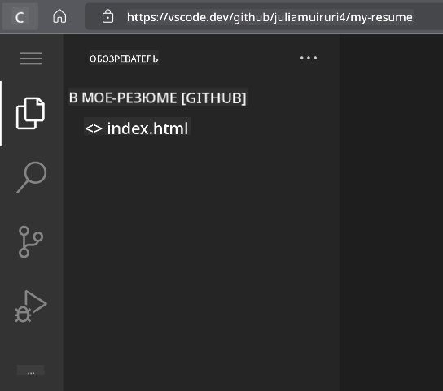
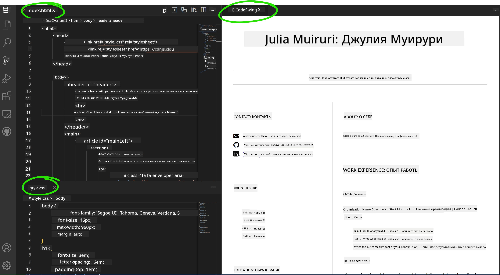

<!--
CO_OP_TRANSLATOR_METADATA:
{
  "original_hash": "effe56ba51c38d7bdfad1ea38288666b",
  "translation_date": "2025-10-22T22:11:34+00:00",
  "source_file": "8-code-editor/1-using-a-code-editor/assignment.md",
  "language_code": "ru"
}
-->
# Создание сайта-резюме с использованием VSCode.dev

Измените свои карьерные перспективы, создав профессиональный сайт-резюме, который демонстрирует ваши навыки и опыт в интерактивном современном формате. Вместо отправки традиционных PDF-файлов представьте, что вы предоставляете рекрутерам стильный, адаптивный сайт, который демонстрирует как ваши квалификации, так и ваши способности в веб-разработке.

Эта практическая задача позволит вам применить все ваши навыки работы с VSCode.dev, создавая что-то действительно полезное для вашей карьеры. Вы пройдете полный процесс веб-разработки – от создания репозитория до развертывания – все это прямо в вашем браузере.

Завершив этот проект, вы получите профессиональное онлайн-портфолио, которое легко можно будет поделиться с потенциальными работодателями, обновлять по мере роста ваших навыков и настраивать в соответствии с вашим личным брендом. Это именно тот практический проект, который демонстрирует реальные навыки веб-разработки.

## Цели обучения

После выполнения этой задачи вы сможете:

- **Создавать** и управлять полным проектом веб-разработки с использованием VSCode.dev
- **Структурировать** профессиональный сайт с использованием семантических HTML-элементов
- **Стилизовать** адаптивные макеты с использованием современных техник CSS
- **Реализовывать** интерактивные функции с использованием базовых веб-технологий
- **Развертывать** сайт, доступный по ссылке
- **Демонстрировать** лучшие практики управления версиями в процессе разработки

## Предварительные требования

Перед началом выполнения задачи убедитесь, что у вас есть:

- Аккаунт на GitHub (если у вас его нет, создайте на [github.com](https://github.com/))
- Пройденный урок по VSCode.dev, охватывающий навигацию по интерфейсу и базовые операции
- Базовое понимание структуры HTML и концепций стилизации CSS

## Настройка проекта и создание репозитория

Начнем с создания основы вашего проекта. Этот процесс отражает реальные рабочие процессы разработки, где проекты начинаются с правильной инициализации репозитория и планирования структуры.

### Шаг 1: Создание репозитория на GitHub

Создание отдельного репозитория обеспечивает правильную организацию проекта и контроль версий с самого начала.

1. **Перейдите** на [GitHub.com](https://github.com) и войдите в свой аккаунт
2. **Нажмите** зеленую кнопку "New" или значок "+" в правом верхнем углу
3. **Назовите** ваш репозиторий `my-resume` (или выберите персонализированное имя, например, `john-smith-resume`)
4. **Добавьте** краткое описание: "Профессиональный сайт-резюме, созданный с использованием HTML и CSS"
5. **Выберите** "Public", чтобы сделать ваше резюме доступным для потенциальных работодателей
6. **Отметьте** "Add a README file", чтобы создать начальное описание проекта
7. **Нажмите** "Create repository", чтобы завершить настройку

> 💡 **Совет по выбору имени репозитория**: Используйте описательные, профессиональные названия, которые четко указывают на цель проекта. Это поможет при его демонстрации работодателям или на портфолио-обзорах.

### Шаг 2: Инициализация структуры проекта

Поскольку VSCode.dev требует наличия хотя бы одного файла для открытия репозитория, мы создадим наш основной HTML-файл прямо на GitHub перед переходом к веб-редактору.

1. **Нажмите** на ссылку "creating a new file" в вашем новом репозитории
2. **Введите** `index.html` в качестве имени файла
3. **Добавьте** следующую начальную структуру HTML:

```html
<!DOCTYPE html>
<html lang="en">
<head>
    <meta charset="UTF-8">
    <meta name="viewport" content="width=device-width, initial-scale=1.0">
    <title>Your Name - Professional Resume</title>
</head>
<body>
    <h1>Your Name</h1>
    <p>Professional Resume Website</p>
</body>
</html>
```

4. **Напишите** сообщение коммита: "Добавить начальную структуру HTML"
5. **Нажмите** "Commit new file", чтобы сохранить изменения


**Что достигается с помощью этой начальной настройки:**
- **Создается** правильная структура документа HTML5 с семантическими элементами
- **Включается** мета-тег viewport для совместимости с адаптивным дизайном
- **Устанавливается** описательный заголовок страницы, который отображается в вкладках браузера
- **Создается** основа для профессиональной организации контента

## Работа в VSCode.dev

Теперь, когда основа вашего репозитория создана, перейдем к VSCode.dev для основной работы над проектом. Этот веб-редактор предоставляет все необходимые инструменты для профессиональной веб-разработки.

### Шаг 3: Откройте проект в VSCode.dev

1. **Перейдите** на [vscode.dev](https://vscode.dev) в новой вкладке браузера
2. **Нажмите** "Open Remote Repository" на приветственном экране
3. **Скопируйте** URL вашего репозитория с GitHub и вставьте его в поле ввода

   Формат: `https://github.com/your-username/my-resume`
   
   *Замените `your-username` на ваше реальное имя пользователя GitHub*

4. **Нажмите** Enter, чтобы загрузить ваш проект

✅ **Индикатор успеха**: Вы должны увидеть файлы вашего проекта в боковой панели Explorer и `index.html`, доступный для редактирования в главной области редактора.



**Что вы увидите в интерфейсе:**
- **Боковая панель Explorer**: **Отображает** файлы и структуру папок вашего репозитория
- **Область редактора**: **Показывает** содержимое выбранных файлов для редактирования
- **Панель активности**: **Предоставляет** доступ к функциям, таким как управление версиями и расширения
- **Строка состояния**: **Показывает** статус подключения и информацию о текущей ветке

### Шаг 4: Создание контента резюме

Замените содержимое-заглушку в `index.html` на полноценную структуру резюме. Этот HTML станет основой для профессионального представления ваших квалификаций.

<details>
<summary><b>Полная структура HTML для резюме</b></summary>

```html
<!DOCTYPE html>
<html lang="en">
<head>
    <meta charset="UTF-8">
    <meta name="viewport" content="width=device-width, initial-scale=1.0">
    <link href="style.css" rel="stylesheet">
    <link rel="stylesheet" href="https://cdnjs.cloudflare.com/ajax/libs/font-awesome/5.15.4/css/all.min.css">
    <title>Your Name - Professional Resume</title>
</head>
<body>
    <header id="header">
        <h1>Your Full Name</h1>
        <hr>
        <p class="role">Your Professional Title</p>
        <hr>
    </header>
    
    <main>
        <article id="mainLeft">
            <section>
                <h2>CONTACT</h2>
                <p>
                    <i class="fa fa-envelope" aria-hidden="true"></i>
                    <a href="mailto:your.email@domain.com">your.email@domain.com</a>
                </p>
                <p>
                    <i class="fab fa-github" aria-hidden="true"></i>
                    <a href="https://github.com/your-username">github.com/your-username</a>
                </p>
                <p>
                    <i class="fab fa-linkedin" aria-hidden="true"></i>
                    <a href="https://linkedin.com/in/your-profile">linkedin.com/in/your-profile</a>
                </p>
            </section>
            
            <section>
                <h2>SKILLS</h2>
                <ul>
                    <li>HTML5 & CSS3</li>
                    <li>JavaScript (ES6+)</li>
                    <li>Responsive Web Design</li>
                    <li>Version Control (Git)</li>
                    <li>Problem Solving</li>
                </ul>
            </section>
            
            <section>
                <h2>EDUCATION</h2>
                <h3>Your Degree or Certification</h3>
                <p>Institution Name</p>
                <p>Start Date - End Date</p>
            </section>
        </article>
        
        <article id="mainRight">
            <section>
                <h2>ABOUT</h2>
                <p>Write a compelling summary that highlights your passion for web development, key achievements, and career goals. This section should give employers insight into your personality and professional approach.</p>
            </section>
            
            <section>
                <h2>WORK EXPERIENCE</h2>
                <div class="job">
                    <h3>Job Title</h3>
                    <p class="company">Company Name | Start Date – End Date</p>
                    <ul>
                        <li>Describe a key accomplishment or responsibility</li>
                        <li>Highlight specific skills or technologies used</li>
                        <li>Quantify impact where possible (e.g., "Improved efficiency by 25%")</li>
                    </ul>
                </div>
                
                <div class="job">
                    <h3>Previous Job Title</h3>
                    <p class="company">Previous Company | Start Date – End Date</p>
                    <ul>
                        <li>Focus on transferable skills and achievements</li>
                        <li>Demonstrate growth and learning progression</li>
                        <li>Include any leadership or collaboration experiences</li>
                    </ul>
                </div>
            </section>
            
            <section>
                <h2>PROJECTS</h2>
                <div class="project">
                    <h3>Project Name</h3>
                    <p>Brief description of what the project accomplishes and technologies used.</p>
                    <a href="#" target="_blank">View Project</a>
                </div>
            </section>
        </article>
    </main>
</body>
</html>
```
</details>

**Рекомендации по настройке:**
- **Замените** весь текст-заглушку на вашу реальную информацию
- **Настройте** разделы в зависимости от вашего уровня опыта и карьерного фокуса
- **Добавьте** или удалите разделы по необходимости (например, Сертификаты, Волонтерская работа, Языки)
- **Включите** ссылки на ваши реальные профили и проекты

### Шаг 5: Создание вспомогательных файлов

Профессиональные сайты требуют организованной структуры файлов. Создайте CSS-стили и конфигурационные файлы, необходимые для полного проекта.

1. **Наведите** курсор на имя папки вашего проекта в боковой панели Explorer
2. **Нажмите** на значок "New File" (📄+), который появится
3. **Создайте** следующие файлы по одному:
   - `style.css` (для стилизации и макета)
   - `codeswing.json` (для конфигурации расширения предварительного просмотра)

**Создание CSS-файла (`style.css`):**

<details>
<summary><b>Профессиональная стилизация CSS</b></summary>

```css
/* Modern Resume Styling */
body {
    font-family: 'Segoe UI', Tahoma, Geneva, Verdana, sans-serif;
    font-size: 16px;
    line-height: 1.6;
    max-width: 960px;
    margin: 0 auto;
    padding: 20px;
    color: #333;
    background-color: #f9f9f9;
}

/* Header Styling */
header {
    text-align: center;
    margin-bottom: 3em;
    padding: 2em;
    background: linear-gradient(135deg, #667eea 0%, #764ba2 100%);
    color: white;
    border-radius: 10px;
    box-shadow: 0 4px 6px rgba(0, 0, 0, 0.1);
}

h1 {
    font-size: 3em;
    letter-spacing: 0.1em;
    margin-bottom: 0.2em;
    font-weight: 300;
}

.role {
    font-size: 1.3em;
    font-weight: 300;
    margin: 1em 0;
}

/* Main Content Layout */
main {
    display: grid;
    grid-template-columns: 35% 65%;
    gap: 3em;
    margin-top: 3em;
    background: white;
    padding: 2em;
    border-radius: 10px;
    box-shadow: 0 2px 10px rgba(0, 0, 0, 0.1);
}

/* Typography */
h2 {
    font-size: 1.4em;
    font-weight: 600;
    margin-bottom: 1em;
    color: #667eea;
    border-bottom: 2px solid #667eea;
    padding-bottom: 0.3em;
}

h3 {
    font-size: 1.1em;
    font-weight: 600;
    margin-bottom: 0.5em;
    color: #444;
}

/* Section Styling */
section {
    margin-bottom: 2.5em;
}

#mainLeft {
    border-right: 1px solid #e0e0e0;
    padding-right: 2em;
}

/* Contact Links */
section a {
    color: #667eea;
    text-decoration: none;
    transition: color 0.3s ease;
}

section a:hover {
    color: #764ba2;
    text-decoration: underline;
}

/* Icons */
i {
    margin-right: 0.8em;
    width: 20px;
    text-align: center;
    color: #667eea;
}

/* Lists */
ul {
    list-style: none;
    padding-left: 0;
}

li {
    margin: 0.5em 0;
    padding: 0.3em 0;
    position: relative;
}

li:before {
    content: "▸";
    color: #667eea;
    margin-right: 0.5em;
}

/* Work Experience */
.job, .project {
    margin-bottom: 2em;
    padding-bottom: 1.5em;
    border-bottom: 1px solid #f0f0f0;
}

.company {
    font-style: italic;
    color: #666;
    margin-bottom: 0.5em;
}

/* Responsive Design */
@media (max-width: 768px) {
    main {
        grid-template-columns: 1fr;
        gap: 2em;
    }
    
    #mainLeft {
        border-right: none;
        border-bottom: 1px solid #e0e0e0;
        padding-right: 0;
        padding-bottom: 2em;
    }
    
    h1 {
        font-size: 2.2em;
    }
    
    body {
        padding: 10px;
    }
}

/* Print Styles */
@media print {
    body {
        background: white;
        color: black;
        font-size: 12pt;
    }
    
    header {
        background: none;
        color: black;
        box-shadow: none;
    }
    
    main {
        box-shadow: none;
    }
}
```
</details>

**Создание конфигурационного файла (`codeswing.json`):**

```json
{
    "scripts": [],
    "styles": []
}
```

**Понимание функций CSS:**
- **Использует** CSS Grid для адаптивной, профессиональной структуры макета
- **Реализует** современные цветовые схемы с градиентными заголовками
- **Включает** эффекты наведения и плавные переходы для интерактивности
- **Обеспечивает** адаптивный дизайн, который работает на всех размерах устройств
- **Добавляет** стили, удобные для печати, для генерации PDF

### Шаг 6: Установка и настройка расширений

Расширения улучшают ваш опыт разработки, предоставляя возможности предварительного просмотра в реальном времени и улучшенные инструменты рабочего процесса. Расширение CodeSwing особенно полезно для проектов веб-разработки.

**Установка расширения CodeSwing:**

1. **Нажмите** на значок Extensions (🧩) в панели активности
2. **Найдите** "CodeSwing" в строке поиска маркетплейса
3. **Выберите** расширение CodeSwing из результатов поиска
4. **Нажмите** синюю кнопку "Install"


**Что предоставляет CodeSwing:**
- **Позволяет** предварительный просмотр вашего сайта в реальном времени во время редактирования
- **Отображает** изменения без необходимости ручного обновления
- **Поддерживает** несколько типов файлов, включая HTML, CSS и JavaScript
- **Обеспечивает** интегрированную среду разработки

**Результаты после установки:**
После установки CodeSwing вы увидите предварительный просмотр вашего сайта-резюме прямо в редакторе. Это позволяет вам видеть, как выглядит ваш сайт, пока вы вносите изменения.



**Понимание улучшенного интерфейса:**
- **Разделенный вид**: **Показывает** ваш код с одной стороны и предварительный просмотр с другой
- **Обновления в реальном времени**: **Отражает** изменения сразу же, как вы их вводите
- **Интерактивный предварительный просмотр**: **Позволяет** тестировать ссылки и взаимодействия
- **Мобильная симуляция**: **Обеспечивает** тестирование адаптивного дизайна

### Шаг 7: Управление версиями и публикация

Теперь, когда ваш сайт-резюме завершен, используйте Git для сохранения вашей работы и публикации ее онлайн.

**Фиксация изменений:**

1. **Нажмите** на значок Source Control (🌿) в панели активности
2. **Просмотрите** все файлы, которые вы создали и изменили, в разделе "Changes"
3. **Добавьте** изменения, нажав на значок "+" рядом с каждым файлом
4. **Напишите** описательное сообщение коммита, например:
   - "Добавить полный сайт-резюме с адаптивным дизайном"
   - "Реализовать профессиональную стилизацию и структуру контента"
5. **Нажмите** на галочку (✓), чтобы зафиксировать и отправить изменения

**Примеры эффективных сообщений коммита:**
- "Добавить профессиональный контент и стили для резюме"
- "Реализовать адаптивный дизайн для совместимости с мобильными устройствами"
- "Обновить контактную информацию и ссылки на проекты"

> 💡 **Профессиональный совет**: Хорошие сообщения коммитов помогают отслеживать эволюцию вашего проекта и демонстрируют внимание к деталям – качества, которые ценят работодатели.

**Доступ к опубликованному сайту:**
После фиксации изменений вы можете вернуться к вашему репозиторию на GitHub, используя меню-гамбургер (☰) в левом верхнем углу. Ваш сайт-резюме теперь находится под контролем версий и готов к развертыванию или публикации.

## Результаты и дальнейшие шаги

**Поздравляем! 🎉** Вы успешно создали профессиональный сайт-резюме с использованием VSCode.dev. Ваш проект демонстрирует:
**Демонстрируемые технические навыки:**
- **Управление репозиторием**: Создание и организация полной структуры проекта
- **Веб-разработка**: Создание адаптивного сайта с использованием современных HTML5 и CSS3
- **Управление версиями**: Реализация правильного рабочего процесса Git с содержательными коммитами
- **Профессиональное владение инструментами**: Эффективное использование интерфейса VSCode.dev и системы расширений

**Достигнутые профессиональные результаты:**
- **Онлайн-присутствие**: Ссылка, которую можно поделиться для демонстрации ваших квалификаций
- **Современный формат**: Интерактивная альтернатива традиционным PDF-резюме
- **Демонстрация навыков**: Конкретное доказательство ваших способностей в веб-разработке
- **Легкость обновления**: Основа, которую можно постоянно улучшать и настраивать

### Варианты развертывания

Чтобы сделать ваше резюме доступным для работодателей, рассмотрите следующие варианты хостинга:

**GitHub Pages (Рекомендуется):**
1. Перейдите в настройки вашего репозитория на GitHub
2. Прокрутите до раздела "Pages"
3. Выберите "Deploy from a branch" и выберите "main"
4. Ваш сайт будет доступен по адресу `https://your-username.github.io/my-resume`

**Альтернативные платформы:**
- **Netlify**: Автоматическое развертывание с пользовательскими доменами
- **Vercel**: Быстрое развертывание с современными функциями хостинга
- **GitHub Codespaces**: Среда разработки с встроенным предварительным просмотром

### Предложения по улучшению

Продолжайте развивать свои навыки, добавляя следующие функции:

**Технические улучшения:**
- **Интерактивность с помощью JavaScript**: Добавьте плавную прокрутку или интерактивные элементы
- **Переключение тем**: Реализуйте переключение между светлой и темной темой
- **Форма обратной связи**: Позвольте работодателям связываться с вами напрямую
- **Оптимизация SEO**: Добавьте мета-теги и структурированные данные для лучшей видимости в поисковых системах

**Улучшения контента:**
- **Портфолио проектов**: Ссылки на репозитории GitHub и демонстрации проектов
- **Визуализация навыков**: Создайте индикаторы прогресса или системы оценки навыков
- **Раздел отзывов**: Включите рекомендации от коллег или преподавателей
- **Интеграция блога**: Добавьте раздел блога, чтобы показать ваш путь обучения

## Вызов от GitHub Copilot 🚀

Используйте режим Agent, чтобы выполнить следующий вызов:

**Описание:** Улучшите ваш сайт-резюме, добавив продвинутые функции, которые демонстрируют профессиональные навыки веб-разработки и современные принципы дизайна.

**Задание:** На основе вашего существующего сайта-резюме реализуйте следующие продвинутые функции:
1. Добавьте переключение тем (светлая/темная) с плавными переходами
2. Создайте интерактивный раздел навыков с анимированными индикаторами прогресса
3. Реализуйте форму обратной связи с проверкой данных
4. Добавьте раздел портфолио проектов с эффектами наведения и модальными окнами
5. Включите раздел блога с минимум 3 примерами постов о вашем пути обучения
6. Оптимизируйте сайт для SEO с правильными мета-тегами, структурированными данными и производительностью
7. Разверните улучшенный сайт с использованием GitHub Pages или Netlify
8. Задокументируйте все новые функции в вашем README.md с скриншотами

Ваш улучшенный сайт должен демонстрировать мастерство современных практик веб-разработки, включая адаптивный дизайн, интерактивность с помощью JavaScript и профессиональные рабочие процессы развертывания.

## Расширение вызова

Готовы развивать свои навыки дальше? Попробуйте эти продвинутые задачи:

**📱 Редизайн с приоритетом мобильных устройств:** Полностью перестройте ваш сайт, используя подход с приоритетом мобильных устройств с CSS Grid и Flexbox

**🔍 Оптимизация SEO:** Реализуйте комплексную SEO, включая мета-теги, структурированные данные и оптимизацию производительности

**🌐 Поддержка нескольких языков:** Добавьте функции интернационализации для поддержки нескольких языков

**📊 Интеграция аналитики:** Добавьте Google Analytics для отслеживания вовлеченности посетителей и оптимизации контента

**🚀 Оптимизация производительности:** Достигните идеальных оценок Lighthouse во всех категориях

## Обзор и самостоятельное изучение

Расширьте свои знания с помощью этих ресурсов:

**Продвинутые функции VSCode.dev:**
- [Документация VSCode.dev](https://code.visualstudio.com/docs/editor/vscode-web?WT.mc_id=academic-0000-alfredodeza) - Полное руководство по веб-редактированию
- [GitHub Codespaces](https://docs.github.com/en/codespaces) - Облачные среды разработки

**Лучшие практики веб-разработки:**
- **Адаптивный дизайн**: Изучите CSS Grid и Flexbox для современных макетов
- **Доступность**: Изучите рекомендации WCAG для создания инклюзивного веб-дизайна  
- **Производительность**: Ознакомьтесь с инструментами, такими как Lighthouse, для оптимизации  
- **SEO**: Поймите основы поисковой оптимизации  

**Профессиональное развитие:**  
- **Создание портфолио**: Разрабатывайте дополнительные проекты, чтобы продемонстрировать разнообразие навыков  
- **Open Source**: Вносите вклад в существующие проекты, чтобы получить опыт совместной работы  
- **Нетворкинг**: Делитесь своим сайтом-резюме в сообществах разработчиков для получения обратной связи  
- **Непрерывное обучение**: Следите за трендами и технологиями веб-разработки  

---

**Ваши следующие шаги:** Поделитесь своим сайтом-резюме с друзьями, семьей или наставниками, чтобы получить обратную связь. Используйте их предложения для внесения изменений и улучшения дизайна. Помните, этот проект — не просто резюме, это демонстрация вашего роста как веб-разработчика!

---

**Отказ от ответственности**:  
Этот документ был переведен с использованием сервиса автоматического перевода [Co-op Translator](https://github.com/Azure/co-op-translator). Хотя мы стремимся к точности, пожалуйста, учитывайте, что автоматические переводы могут содержать ошибки или неточности. Оригинальный документ на его родном языке следует считать авторитетным источником. Для получения критически важной информации рекомендуется профессиональный перевод человеком. Мы не несем ответственности за любые недоразумения или неправильные интерпретации, возникающие в результате использования данного перевода.