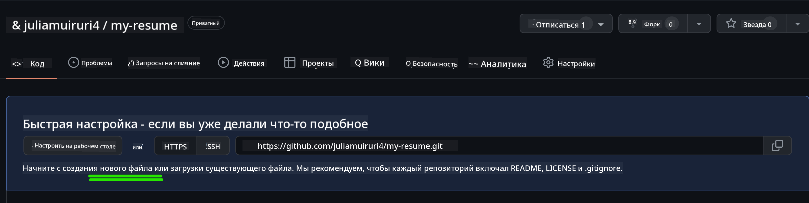

<!--
CO_OP_TRANSLATOR_METADATA:
{
  "original_hash": "bd3aa6d2b879c30ea496c43aec1c49ed",
  "translation_date": "2025-08-28T23:24:57+00:00",
  "source_file": "8-code-editor/1-using-a-code-editor/assignment.md",
  "language_code": "ru"
}
-->
# Создание сайта-резюме с использованием vscode.dev

_Как круто было бы, если бы рекрутер попросил ваше резюме, а вы отправили ему ссылку?_ 😎

<!----
TODO: добавить необязательное изображение

> Скетчноут от [Имя автора](https://example.com)
---->

<!---
## Викторина перед лекцией
[Викторина перед лекцией](https://ff-quizzes.netlify.app/web/quiz/3)
---->

## Цели

После выполнения этого задания вы научитесь:

- Создавать сайт для демонстрации вашего резюме

### Предварительные требования

1. Аккаунт на GitHub. Перейдите на [GitHub](https://github.com/) и создайте аккаунт, если у вас его еще нет.

## Шаги

**Шаг 1:** Создайте новый репозиторий на GitHub и назовите его `my-resume`

**Шаг 2:** Создайте файл `index.html` в вашем репозитории. Мы добавим хотя бы один файл прямо на github.com, так как пустой репозиторий нельзя открыть в vscode.dev.

Нажмите на ссылку `creating a new file`, введите имя `index.html` и выберите кнопку `Commit new file`.



**Шаг 3:** Откройте [VSCode.dev](https://vscode.dev) и выберите кнопку `Open Remote Repository`.

Скопируйте URL репозитория, который вы только что создали для сайта-резюме, и вставьте его в поле ввода:

_Замените `your-username` на ваше имя пользователя GitHub._

```
https://github.com/your-username/my-resume
```

✅ Если все прошло успешно, вы увидите ваш проект и файл index.html, открытые в текстовом редакторе в браузере.


**Шаг 4:** Откройте файл `index.html`, вставьте приведенный ниже код в область кода и сохраните.

<details>
    <summary><b>HTML-код, отвечающий за содержание вашего сайта-резюме.</b></summary>
    
        <html>

            <head>
                <link href="style.css" rel="stylesheet">
                <link rel="stylesheet" href="https://cdnjs.cloudflare.com/ajax/libs/font-awesome/5.15.4/css/all.min.css">
                <title>Ваше имя здесь!</title>
            </head>
            <body>
                <header id="header">
                    <!-- Заголовок резюме с вашим именем и должностью -->
                    <h1>Ваше имя здесь!</h1>
                    <hr>
                    Ваша роль!
                    <hr>
                </header>
                <main>
                    <article id="mainLeft">
                        <section>
                            <h2>КОНТАКТЫ</h2>
                            <!-- Контактная информация, включая социальные сети -->
                            <p>
                                <i class="fa fa-envelope" aria-hidden="true"></i>
                                <a href="mailto:username@domain.top-level domain">Напишите ваш email здесь</a>
                            </p>
                            <p>
                                <i class="fab fa-github" aria-hidden="true"></i>
                                <a href="github.com/yourGitHubUsername">Напишите ваше имя пользователя здесь!</a>
                            </p>
                            <p>
                                <i class="fab fa-linkedin" aria-hidden="true"></i>
                                <a href="linkedin.com/yourLinkedInUsername">Напишите ваше имя пользователя здесь!</a>
                            </p>
                        </section>
                        <section>
                            <h2>НАВЫКИ</h2>
                            <!-- Ваши навыки -->
                            <ul>
                                <li>Навык 1!</li>
                                <li>Навык 2!</li>
                                <li>Навык 3!</li>
                                <li>Навык 4!</li>
                            </ul>
                        </section>
                        <section>
                            <h2>ОБРАЗОВАНИЕ</h2>
                            <!-- Ваше образование -->
                            <h3>Напишите ваш курс здесь!</h3>
                            <p>
                                Напишите ваше учебное заведение здесь!
                            </p>
                            <p>
                                Дата начала - дата окончания
                            </p>
                        </section>            
                    </article>
                    <article id="mainRight">
                        <section>
                            <h2>ОБО МНЕ</h2>
                            <!-- О вас -->
                            <p>Напишите немного о себе!</p>
                        </section>
                        <section>
                            <h2>ОПЫТ РАБОТЫ</h2>
                            <!-- Ваш опыт работы -->
                            <h3>Название должности</h3>
                            <p>
                                Название организации здесь | Месяц начала – месяц окончания
                            </p>
                            <ul>
                                    <li>Задача 1 - Напишите, что вы делали!</li>
                                    <li>Задача 2 - Напишите, что вы делали!</li>
                                    <li>Напишите результаты/влияние вашего вклада</li>
                                    
                            </ul>
                            <h3>Название должности 2</h3>
                            <p>
                                Название организации здесь | Месяц начала – месяц окончания
                            </p>
                            <ul>
                                    <li>Задача 1 - Напишите, что вы делали!</li>
                                    <li>Задача 2 - Напишите, что вы делали!</li>
                                    <li>Напишите результаты/влияние вашего вклада</li>
                                    
                            </ul>
                        </section>
                    </article>
                </main>
            </body>
        </html>
</details>

Добавьте детали вашего резюме, заменив _текст-заполнитель_ в HTML-коде.

**Шаг 5:** Наведите курсор на папку My-Resume, нажмите на значок `New File ...` и создайте 2 новых файла в вашем проекте: `style.css` и `codeswing.json`.

**Шаг 6:** Откройте файл `style.css`, вставьте приведенный ниже код и сохраните.

<details>
        <summary><b>CSS-код для форматирования макета сайта.</b></summary>
            
            body {
                font-family: 'Segoe UI', Tahoma, Geneva, Verdana, sans-serif;
                font-size: 16px;
                max-width: 960px;
                margin: auto;
            }
            h1 {
                font-size: 3em;
                letter-spacing: .6em;
                padding-top: 1em;
                padding-bottom: 1em;
            }

            h2 {
                font-size: 1.5em;
                padding-bottom: 1em;
            }

            h3 {
                font-size: 1em;
                padding-bottom: 1em;
            }
            main { 
                display: grid;
                grid-template-columns: 40% 60%;
                margin-top: 3em;
            }
            header {
                text-align: center;
                margin: auto 2em;
            }

            section {
                margin: auto 1em 4em 2em;
            }

            i {
                margin-right: .5em;
            }

            p {
                margin: .2em auto
            }

            hr {
                border: none;
                background-color: lightgray;
                height: 1px;
            }

            h1, h2, h3 {
                font-weight: 100;
                margin-bottom: 0;
            }
            #mainLeft {
                border-right: 1px solid lightgray;
            }
            
</details>

**Шаг 6:** Откройте файл `codeswing.json`, вставьте приведенный ниже код и сохраните.

    {
    "scripts": [],
    "styles": []
    }

**Шаг 7:** Установите расширение `Codeswing`, чтобы визуализировать сайт-резюме в области кода.

Нажмите на значок _`Extensions`_ на панели действий и введите Codeswing. Либо нажмите _синюю кнопку установки_ на расширенной панели действий, чтобы установить, либо используйте кнопку установки, которая появится в области кода после выбора расширения для загрузки дополнительной информации. Сразу после установки расширения обратите внимание на изменения в вашем проекте 😃.


Вот что вы увидите на экране после установки расширения.


Если вы довольны внесенными изменениями, наведите курсор на папку `Changes` и нажмите кнопку `+`, чтобы зафиксировать изменения.

Введите сообщение коммита _(Описание изменений, которые вы внесли в проект)_ и зафиксируйте изменения, нажав на `check`. После завершения работы над проектом выберите значок меню-гамбургера в верхнем левом углу, чтобы вернуться к репозиторию на GitHub.

Поздравляем 🎉 Вы только что создали сайт-резюме с использованием vscode.dev всего за несколько шагов.

## 🚀 Задание

Откройте удаленный репозиторий, в котором у вас есть разрешения на внесение изменений, и обновите несколько файлов. Затем попробуйте создать новую ветку с вашими изменениями и сделайте Pull Request.

<!----
## Викторина после лекции
[Викторина после лекции](https://ff-quizzes.netlify.app/web/quiz/4)
---->

## Обзор и самостоятельное изучение

Узнайте больше о [VSCode.dev](https://code.visualstudio.com/docs/editor/vscode-web?WT.mc_id=academic-0000-alfredodeza) и некоторых его других функциях.

---

**Отказ от ответственности**:  
Этот документ был переведен с использованием сервиса автоматического перевода [Co-op Translator](https://github.com/Azure/co-op-translator). Хотя мы стремимся к точности, пожалуйста, учитывайте, что автоматические переводы могут содержать ошибки или неточности. Оригинальный документ на его родном языке следует считать авторитетным источником. Для получения критически важной информации рекомендуется профессиональный перевод человеком. Мы не несем ответственности за любые недоразумения или неправильные интерпретации, возникшие в результате использования данного перевода.