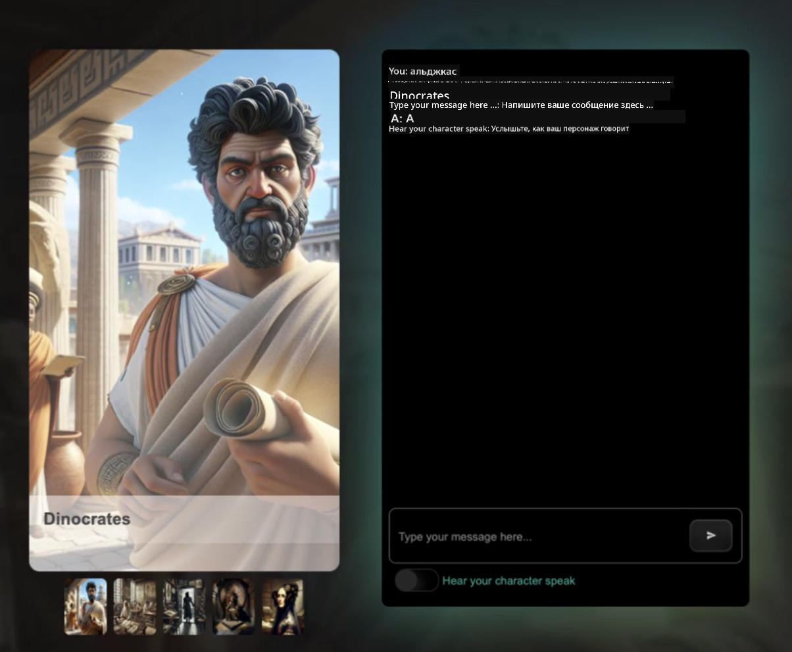
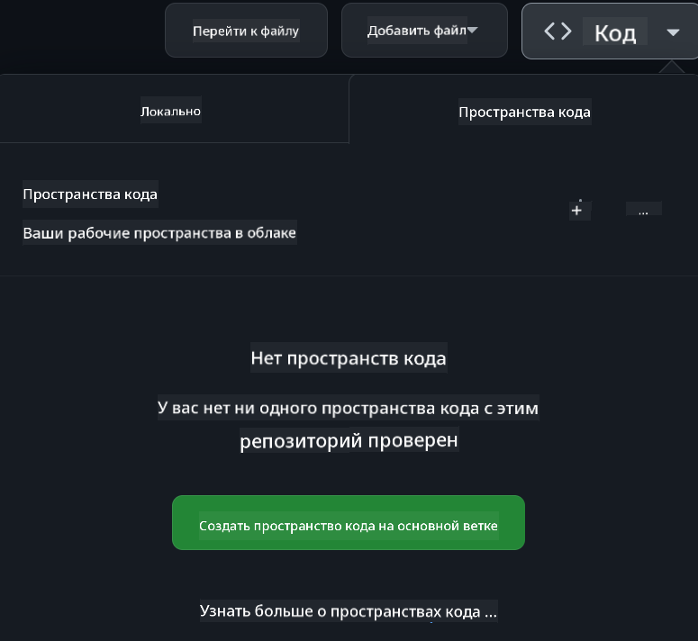

<!--
CO_OP_TRANSLATOR_METADATA:
{
  "original_hash": "fea3a0fceb8ad86fd640c09cf63a2aac",
  "translation_date": "2026-01-06T09:31:03+00:00",
  "source_file": "README.md",
  "language_code": "ru"
}
-->
# Веб-разработка для начинающих — учебная программа

Изучите основы веб-разработки с нашим комплексным 12-недельным курсом от Microsoft Cloud Advocates. Каждое из 24 занятий погружает в JavaScript, CSS и HTML через практические проекты, такие как террариумы, расширения для браузера и космические игры. Участвуйте в викторинах, обсуждениях и практических заданиях. Повышайте свои навыки и улучшайте усвоение материала с помощью нашей эффективной проектно-ориентированной методики. Начните ваше путешествие в мир программирования уже сегодня!

Присоединяйтесь к сообществу Azure AI Foundry в Discord

Следуйте этим шагам, чтобы начать использовать эти ресурсы:
1. **Форкните репозиторий**: Нажмите [](https://GitHub.com/microsoft/Web-Dev-For-Beginners/fork)
2. **Клонируйте репозиторий**: `git clone https://github.com/microsoft/Web-Dev-For-Beginners.git`
3. [**Присоединяйтесь к Azure AI Foundry Discord и встречайтесь с экспертами и другими разработчиками**](https://discord.com/invite/ByRwuEEgH4)

### 🌐 Поддержка множества языков

#### Поддерживается через GitHub Action (автоматически и всегда актуально)

> **Отдаёте предпочтение локальному клонированию?**

> Этот репозиторий включает более 50 переводов, что значительно увеличивает размер загрузки. Чтобы клонировать без переводов, используйте sparse checkout:  
> ```bash
> git clone --filter=blob:none --sparse https://github.com/microsoft/Web-Dev-For-Beginners.git
> cd Web-Dev-For-Beginners
> git sparse-checkout set --no-cone '/*' '!translations' '!translated_images'
> ```
> Это даст вам всё необходимое для прохождения курса при намного более быстрой загрузке.

**Если вы хотите поддерживать дополнительные языки перевода, они перечислены [здесь](https://github.com/Azure/co-op-translator/blob/main/getting_started/supported-languages.md)**

#### 🧑‍🎓 _Вы студент?_

Посетите [**страницу Student Hub**](https://docs.microsoft.com/learn/student-hub/?WT.mc_id=academic-77807-sagibbon), где вы найдете материалы для начинающих, студенческие пакеты и даже способы получить бесплатный сертификат. Это страница, которую стоит добавить в закладки и время от времени проверять, так как контент обновляется ежемесячно.

### 📣 Объявление — новые челленджи в режиме GitHub Copilot Agent!

Добавлен новый челлендж, найдите "GitHub Copilot Agent Challenge 🚀" в большинстве глав. Это новый вызов для вас, который можно выполнить с помощью GitHub Copilot и режима Agent. Если вы не использовали режим Agent ранее, он способен не только генерировать текст, но и создавать и редактировать файлы, запускать команды и многое другое.

### 📣 Объявление — _новый проект с использованием генеративного ИИ_

Добавлен новый проект помощника на базе искусственного интеллекта, посмотрите [проект](./9-chat-project/README.md)

### 📣 Объявление — _новая учебная программа_ по генеративному ИИ для JavaScript только что выпущена

Не пропустите нашу новую учебную программу по генеративному ИИ!

Посетите [https://aka.ms/genai-js-course](https://aka.ms/genai-js-course), чтобы начать!


- Уроки охватывают всё от основ до RAG.
- Взаимодействуйте с историческими персонажами с помощью GenAI и нашего сопутствующего приложения.
- Забавный и увлекательный сюжет, вы будете путешествовать во времени!



Каждый урок включает задание для выполнения, проверку знаний и вызов, чтобы помочь вам освоить такие темы, как:
- Формулировка запросов и проектирование запросов
- Генерация приложений для текста и изображений
- Поисковые приложения

Посетите [https://aka.ms/genai-js-course](https://aka.ms/genai-js-course), чтобы начать!

## 🌱 Начало работы

> **Преподаватели**, мы [включили некоторые предложения](for-teachers.md) по использованию этой учебной программы. Нам очень важна ваша обратная связь [в нашем форуме обсуждений](https://github.com/microsoft/Web-Dev-For-Beginners/discussions/categories/teacher-corner)!

**[Обучающиеся](https://aka.ms/student-page/?WT.mc_id=academic-77807-sagibbon)**, для каждого урока начинайте с викторины перед лекцией, затем просмотрите лекционный материал, выполните различные задания и проверьте свои знания в постлекционной викторине.

Для улучшения обучения общайтесь с вашими коллегами, чтобы работать над проектами вместе! Обсуждения приветствуются в нашем [форуме обсуждений](https://github.com/microsoft/Web-Dev-For-Beginners/discussions), где команда модераторов будет готова ответить на ваши вопросы.

Для углубления знаний мы настоятельно рекомендуем изучать [Microsoft Learn](https://learn.microsoft.com/users/wirelesslife/collections/p1ddcy5jwy0jkm?WT.mc_id=academic-77807-sagibbon) для дополнительных материалов по обучению.

### 📋 Настройка вашей среды

В этой учебной программе уже готова среда разработки! Начав работу, вы можете выбрать запуск курса в [Codespace](https://github.com/features/codespaces/) (_браузерная среда без необходимости установки_), либо локально на вашем компьютере с помощью текстового редактора, например [Visual Studio Code](https://code.visualstudio.com/?WT.mc_id=academic-77807-sagibbon).

#### Создайте свой репозиторий

Чтобы легко сохранять свою работу, рекомендуется создать собственную копию этого репозитория. Сделать это можно, нажав кнопку **Use this template** вверху страницы. Это создаст новый репозиторий в вашем аккаунте GitHub с копией учебной программы.

Выполните следующие шаги:
1. **Форкните репозиторий**: Нажмите на кнопку "Fork" в правом верхнем углу этой страницы.
2. **Клонируйте репозиторий**: `git clone https://github.com/microsoft/Web-Dev-For-Beginners.git`

#### Запуск учебной программы в Codespace

В вашей копии репозитория нажмите кнопку **Code** и выберите **Open with Codespaces**. Это создаст для вас новый Codespace для работы.



#### Запуск учебной программы локально на вашем компьютере

Для запуска этой учебной программы локально понадобятся текстовый редактор, браузер и инструмент командной строки. Наш первый урок, [Введение в языки программирования и основные инструменты](../../1-getting-started-lessons/1-intro-to-programming-languages), познакомит вас с различными вариантами каждого из этих инструментов, чтобы вы могли выбрать то, что подходит именно вам.

Мы рекомендуем использовать [Visual Studio Code](https://code.visualstudio.com/?WT.mc_id=academic-77807-sagibbon) как редактор, который включает собственный [терминал](https://code.visualstudio.com/docs/terminal/basics/?WT.mc_id=academic-77807-sagibbon). Вы можете скачать Visual Studio Code [здесь](https://code.visualstudio.com/?WT.mc_id=academic-77807-sagibbon).

1. Клонируйте ваш репозиторий на компьютер. Для этого нажмите кнопку **Code** и скопируйте URL:

    [CodeSpace](./images/createcodespace.png)
    Затем откройте [Терминал](https://code.visualstudio.com/docs/terminal/basics/?WT.mc_id=academic-77807-sagibbon) в составе [Visual Studio Code](https://code.visualstudio.com/?WT.mc_id=academic-77807-sagibbon) и выполните следующую команду, заменив `<your-repository-url>` на только что скопированный URL:

    ```bash 
    git clone <your-repository-url>
    ```

2. Откройте папку в Visual Studio Code. Это можно сделать, кликнув **File** > **Open Folder** и выбрав только что склонированную папку.


>  Рекомендуемые расширения Visual Studio Code:
>
> * [Live Server](https://marketplace.visualstudio.com/items?itemName=ritwickdey.LiveServer&WT.mc_id=academic-77807-sagibbon) — для предварительного просмотра HTML-страниц внутри Visual Studio Code
> * [Copilot](https://marketplace.visualstudio.com/items?itemName=GitHub.copilot&WT.mc_id=academic-77807-sagibbon) — для помощи в более быстром написании кода

## 📂 Каждый урок включает:

- опциональные заметки
- опциональное вспомогательное видео
- разминку-квиз перед уроком
- письменный урок
- для проектных уроков — пошаговые инструкции по созданию проекта
- проверки знаний
- вызов (challenge)
- дополнительное чтение
- задание
- [квиз после урока](https://ff-quizzes.netlify.app/web/)

> **Примечание о квизах**: Все квизы находятся в папке Quiz-app, всего 48 квизов по 3 вопроса в каждом. Они доступны [здесь](https://ff-quizzes.netlify.app/web/), приложение квиза можно запускать локально или развернуть в Azure; следуйте инструкциям в папке `quiz-app`.

## 🗃️ Уроки

|     |                       Название проекта                       |                            Изучаемые концепции                             | Цели обучения                                                                                                                 |                                                         Связанный урок                                                          |         Автор          |
| :-: | :----------------------------------------------------------: | :------------------------------------------------------------------------: | ---------------------------------------------------------------------------------------------------------------------------- | :----------------------------------------------------------------------------------------------------------------------------: | :---------------------: |
| 01  |                     Начало работы                            |           Введение в программирование и инструменты профессии              | Изучить основные основы большинства языков программирования и ПО, помогающего профессиональным разработчикам                  | [Введение в языки программирования и инструменты](./1-getting-started-lessons/1-intro-to-programming-languages/README.md)       |         Jasmine         |
| 02  |                     Начало работы                            |             Основы GitHub, включая командную работу                        | Как использовать GitHub в проекте, как сотрудничать с другими над кодовой базой                                               |                            [Введение в GitHub](./1-getting-started-lessons/2-github-basics/README.md)                               |          Floor          |
| 03  |                     Начало работы                            |                             Доступность                                    | Изучить основы веб-доступности                                                                                               |                       [Основы доступности](./1-getting-started-lessons/3-accessibility/README.md)                                |       Christopher       |
| 04  |                        Основы JS                            |                         Типы данных в JavaScript                          | Основы типов данных в JavaScript                                                                                              |                                       [Типы данных](./2-js-basics/1-data-types/README.md)                                        |         Jasmine         |
| 05  |                        Основы JS                            |                         Функции и методы                                  | Изучить функции и методы для управления логикой приложения                                                                    |                              [Функции и методы](./2-js-basics/2-functions-methods/README.md)                                     | Jasmine and Christopher |
| 06  |                        Основы JS                            |                        Принятие решений с помощью JS                      | Научиться создавать условия в коде, используя методы принятия решений                                                        |                                 [Принятие решений](./2-js-basics/3-making-decisions/README.md)                                  |         Jasmine         |
| 07  |                        Основы JS                            |                            Массивы и циклы                                | Работа с данными с помощью массивов и циклов в JavaScript                                                                    |                                   [Массивы и циклы](./2-js-basics/4-arrays-loops/README.md)                                   |         Jasmine         |
| 08  |       [Террариум](./3-terrarium/solution/README.md)        |                            Практика HTML                                 | Создать HTML для онлайн-террариума, сосредоточившись на создании макета                                                      |                                 [Введение в HTML](./3-terrarium/1-intro-to-html/README.md)                                   |           Jen           |
| 09  |       [Террариум](./3-terrarium/solution/README.md)        |                            Практика CSS                                  | Создать CSS для стилизации онлайн-террариума, изучить основы CSS, включая адаптивность страницы                               |                                  [Введение в CSS](./3-terrarium/2-intro-to-css/README.md)                                   |           Jen           |
| 10  |            [Террариум](./3-terrarium/solution/README.md)   |                 JavaScript замыкания, управление DOM                        | Написать JavaScript для функции перетаскивания в террариуме, сосредоточившись на замыканиях и манипуляциях DOM               |                  [JavaScript замыкания, управление DOM](./3-terrarium/3-intro-to-DOM-and-closures/README.md)                  |           Jen           |
| 11  |          [Игра на набор текста](./4-typing-game/solution/README.md) |                          Создание игры для набора текста                   | Научиться использовать события клавиатуры для управления логикой JavaScript приложения                                       |                                [Программирование на основе событий](./4-typing-game/typing-game/README.md)                     |       Christopher       |
| 12  | [Расширение для браузера Green](./5-browser-extension/solution/README.md) |                         Работа с браузерами                              | Узнать, как работают браузеры, их историю, и как создать основные элементы расширения браузера                                |                               [О браузерах](./5-browser-extension/1-about-browsers/README.md)                                 |           Jen           |
| 13  | [Расширение для браузера Green](./5-browser-extension/solution/README.md) | Создание формы, вызов API и хранение переменных в локальном хранилище     | Написать JavaScript для расширения браузера, чтобы вызвать API, используя переменные из локального хранилища                  |                [API, формы и локальное хранилище](./5-browser-extension/2-forms-browsers-local-storage/README.md)              |           Jen           |
| 14  | [Расширение для браузера Green](./5-browser-extension/solution/README.md) |       Фоновые процессы браузера, производительность веб                   | Использовать фоновые процессы для управления иконкой расширения; узнать о производительности и оптимизациях                  |             [Фоновые задачи и производительность](./5-browser-extension/3-background-tasks-and-performance/README.md)         |           Jen           |
| 15  |           [Игра в космос](./6-space-game/solution/README.md)           |             Более продвинутая разработка игр на JavaScript               | Узнать об наследовании через классы и композицию, паттерн Pub/Sub, подготовка к созданию игры                                |                      [Введение в продвинутую разработку игр](./6-space-game/1-introduction/README.md)                          |          Chris          |
| 16  |           [Игра в космос](./6-space-game/solution/README.md)           |                           Рисование на canvas                            | Изучить Canvas API для рисования элементов на экране                                                                        |                                [Рисование на Canvas](./6-space-game/2-drawing-to-canvas/README.md)                            |          Chris          |
| 17  |           [Игра в космос](./6-space-game/solution/README.md)           |                  Передвижение элементов по экрану                        | Узнать, как элементы приобретают движение с использованием декартовых координат и Canvas API                                 |                           [Передвижение элементов](./6-space-game/3-moving-elements-around/README.md)                        |          Chris          |
| 18  |           [Игра в космос](./6-space-game/solution/README.md)           |                          Обнаружение столкновений                       | Сделать так, чтобы элементы сталкивались и реагировали друг на друга, используя нажатия клавиш, и добавить функцию cooldown  |                              [Обнаружение столкновений](./6-space-game/4-collision-detection/README.md)                       |          Chris          |
| 19  |           [Игра в космос](./6-space-game/solution/README.md)           |                             Ведение счета                                | Выполнять математические вычисления на основе текущего состояния и прогресса игры                                            |                                    [Ведение счета](./6-space-game/5-keeping-score/README.md)                                    |          Chris          |
| 20  |           [Игра в космос](./6-space-game/solution/README.md)           |                     Завершение и перезапуск игры                        | Научиться завершать и перезапускать игру, включая очистку ресурсов и сброс переменных                                        |                                [Условие окончания](./6-space-game/6-end-condition/README.md)                                  |          Chris          |
| 21  |         [Банковское приложение](./7-bank-project/solution/README.md)   |                 HTML-шаблоны и маршруты в веб-приложении                 | Узнать, как создать структуру многстраничного сайта, используя маршрутизацию и HTML-шаблоны                                 |                            [HTML-шаблоны и маршруты](./7-bank-project/1-template-route/README.md)                             |          Yohan          |
| 22  |         [Банковское приложение](./7-bank-project/solution/README.md)   |                  Создание форм для входа и регистрации                   | Изучить создание форм и обработку процедур валидации                                                                         |                                           [Формы](./7-bank-project/2-forms/README.md)                                   |          Yohan          |
| 23  |         [Банковское приложение](./7-bank-project/solution/README.md)   |                   Методы получения и использования данных                | Как данные поступают и уходят из приложения, как их получать, хранить и удалять                                              |                                            [Данные](./7-bank-project/3-data/README.md)                                       |          Yohan          |
| 24  |         [Банковское приложение](./7-bank-project/solution/README.md)   |                      Концепции управления состоянием                    | Как приложение сохраняет состояние и управляет им программно                                                                 |                                [Управление состоянием](./7-bank-project/4-state-management/README.md)                        |          Yohan          |
| 25 | [Код для браузера/VScode](../../8-code-editor) | Работа с VScode | Узнайте, как использовать редактор кода | [Использование редактора кода VScode](./8-code-editor/1-using-a-code-editor/README.md) | Chris |
| 26 | [AI ассистенты](./9-chat-project/README.md) | Работа с ИИ | Узнайте, как создать своего ИИ ассистента | [Проект ассистента ИИ](./9-chat-project/README.md) | Chris |

## 🏫 Педагогика

Наша учебная программа основывается на двух ключевых педагогических принципах:
* обучение на основе проектов
* частые квизы

Программа обучает основам JavaScript, HTML и CSS, а также последним инструментам и методам, которые используют современные веб-разработчики. Студенты смогут получить практический опыт, создавая игру для набора текста, виртуальный террариум, экологичное расширение для браузера, игру в стиле космических захватчиков и банковское приложение для бизнеса. К концу курса студенты приобретут прочные знания веб-разработки.

> 🎓 Вы можете пройти первые несколько уроков этой программы в виде [Учебного пути](https://docs.microsoft.com/learn/paths/web-development-101/?WT.mc_id=academic-77807-sagibbon) на Microsoft Learn!

Обеспечение соответствия контента проектам делает процесс более увлекательным для студентов и улучшает запоминание концепций. Мы также создали несколько начальных уроков по основам JavaScript с видео из коллекции "[Серия для начинающих по JavaScript](https://channel9.msdn.com/Series/Beginners-Series-to-JavaScript/?WT.mc_id=academic-77807-sagibbon)", авторы которой внесли вклад в эту учебную программу.

Кроме того, простой квиз перед занятием формирует у студента настрой на изучение темы, а второй квиз после урока обеспечивает более глубокое усвоение материала. Данная программа разработана быть гибкой и интересной, ее можно проходить полностью или частично. Проекты начинаются с малого и постепенно усложняются к концу 12-недельного цикла.

Хотя мы сознательно избегали введения JavaScript-фреймворков, чтобы сосредоточиться на базовых навыках веб-разработчика до перехода к фреймворкам, хорошим следующим шагом после завершения этой программы будет изучение Node.js с помощью другой серии видео: "[Серия для начинающих по Node.js](https://channel9.msdn.com/Series/Beginners-Series-to-Nodejs/?WT.mc_id=academic-77807-sagibbon)".

> Посетите наши руководства [Кодекс поведения](CODE_OF_CONDUCT.md) и [Участие](CONTRIBUTING.md). Мы приветствуем ваши конструктивные отзывы!


## 🧭 Оффлайн доступ

Вы можете использовать эту документацию оффлайн с помощью [Docsify](https://docsify.js.org/#/). Форкните этот репозиторий, [установите Docsify](https://docsify.js.org/#/quickstart) на свой локальный компьютер и затем в корневой папке репозитория введите `docsify serve`. Веб-сайт будет доступен на порту 3000 на вашем локальном хосте: `localhost:3000`.

## 📘 PDF

PDF со всеми уроками доступен [здесь](https://microsoft.github.io/Web-Dev-For-Beginners/pdf/readme.pdf).


## 🎒 Другие курсы
Наша команда выпускает и другие курсы! Ознакомьтесь:

<!-- CO-OP TRANSLATOR OTHER COURSES START -->
### LangChain
[](https://aka.ms/langchain4j-for-beginners)
[](https://aka.ms/langchainjs-for-beginners?WT.mc_id=m365-94501-dwahlin)

---

### Azure / Edge / MCP / Agents
[](https://github.com/microsoft/AZD-for-beginners?WT.mc_id=academic-105485-koreyst)
[](https://github.com/microsoft/edgeai-for-beginners?WT.mc_id=academic-105485-koreyst)
[](https://github.com/microsoft/mcp-for-beginners?WT.mc_id=academic-105485-koreyst)
[](https://github.com/microsoft/ai-agents-for-beginners?WT.mc_id=academic-105485-koreyst)

---
 
### Серия Generative AI
[](https://github.com/microsoft/generative-ai-for-beginners?WT.mc_id=academic-105485-koreyst)
[-9333EA?style=for-the-badge&labelColor=E5E7EB&color=9333EA)](https://github.com/microsoft/Generative-AI-for-beginners-dotnet?WT.mc_id=academic-105485-koreyst)
[-C084FC?style=for-the-badge&labelColor=E5E7EB&color=C084FC)](https://github.com/microsoft/generative-ai-for-beginners-java?WT.mc_id=academic-105485-koreyst)
[-E879F9?style=for-the-badge&labelColor=E5E7EB&color=E879F9)](https://github.com/microsoft/generative-ai-with-javascript?WT.mc_id=academic-105485-koreyst)

---
 
### Основное обучение
[](https://aka.ms/ml-beginners?WT.mc_id=academic-105485-koreyst)
[](https://aka.ms/datascience-beginners?WT.mc_id=academic-105485-koreyst)
[](https://aka.ms/ai-beginners?WT.mc_id=academic-105485-koreyst)
[](https://github.com/microsoft/Security-101?WT.mc_id=academic-96948-sayoung)
[](https://aka.ms/webdev-beginners?WT.mc_id=academic-105485-koreyst)
[](https://aka.ms/iot-beginners?WT.mc_id=academic-105485-koreyst)
[](https://github.com/microsoft/xr-development-for-beginners?WT.mc_id=academic-105485-koreyst)

---
 
### Серия Copilot
[](https://aka.ms/GitHubCopilotAI?WT.mc_id=academic-105485-koreyst)
[](https://github.com/microsoft/mastering-github-copilot-for-dotnet-csharp-developers?WT.mc_id=academic-105485-koreyst)
[](https://github.com/microsoft/CopilotAdventures?WT.mc_id=academic-105485-koreyst)
<!-- CO-OP TRANSLATOR OTHER COURSES END -->

## Получение помощи

Если вы застряли или у вас есть вопросы по созданию AI-приложений. Присоединяйтесь к другим учащимся и опытным разработчикам в обсуждениях о MCP. Это поддерживающее сообщество, где вопросы приветствуются, а знания свободно делятся.

[](https://discord.gg/nTYy5BXMWG)

Если у вас есть отзывы о продукте или ошибки при разработке, посетите:

[](https://aka.ms/foundry/forum)

## Лицензия

Этот репозиторий лицензирован под лицензией MIT. Подробнее смотрите в файле [LICENSE](../../LICENSE).

---

<!-- CO-OP TRANSLATOR DISCLAIMER START -->
**Отказ от ответственности**:
Этот документ был переведен с использованием автоматического сервиса перевода [Co-op Translator](https://github.com/Azure/co-op-translator). Несмотря на наши усилия по обеспечению точности, имейте в виду, что автоматический перевод может содержать ошибки или неточности. Оригинальный документ на его исходном языке следует рассматривать как авторитетный источник. Для важной информации рекомендуется использовать профессиональный перевод, выполненный человеком. Мы не несем ответственности за любые недоразумения или неправильное толкование, возникшие в результате использования данного перевода.
<!-- CO-OP TRANSLATOR DISCLAIMER END -->