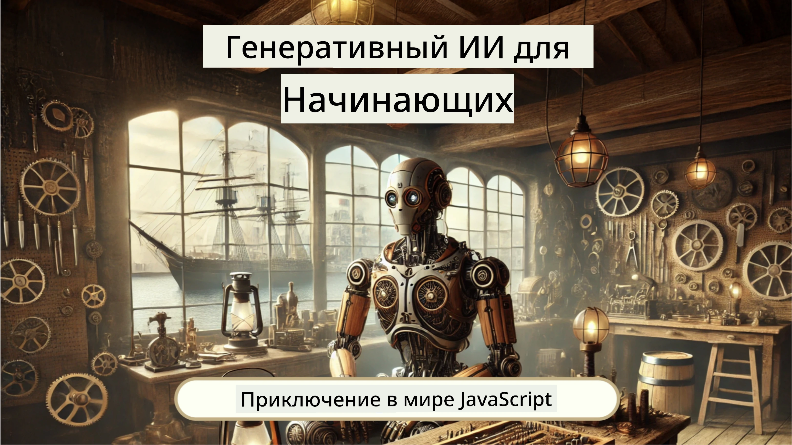
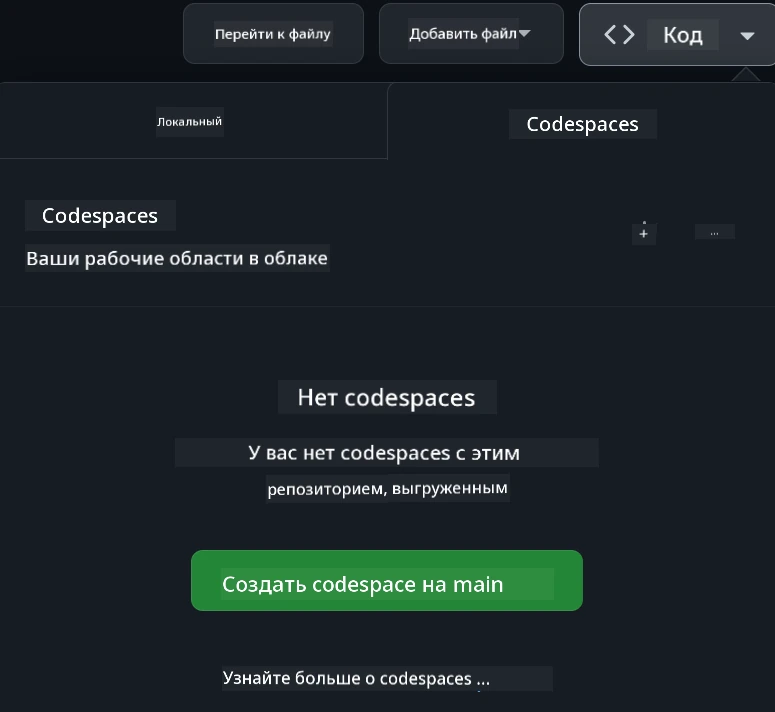

[](https://github.com/microsoft/Web-Dev-For-Beginners/blob/master/LICENSE)
[](https://GitHub.com/microsoft/Web-Dev-For-Beginners/graphs/contributors/)
[](https://GitHub.com/microsoft/Web-Dev-For-Beginners/issues/)
[](https://GitHub.com/microsoft/Web-Dev-For-Beginners/pulls/)
[](http://makeapullrequest.com) 

[](https://GitHub.com/microsoft/Web-Dev-For-Beginners/watchers/)
[](https://GitHub.com/microsoft/Web-Dev-For-Beginners/network/)
[](https://GitHub.com/microsoft/Web-Dev-For-Beginners/stargazers/)

[](https://discord.gg/nTYy5BXMWG)

# Веб-разработка для начинающих — Учебная программа

Освойте основы веб-разработки с нашим 12-недельным комплексным курсом от Microsoft Cloud Advocates. Каждое из 24 занятий подробно изучает JavaScript, CSS и HTML через практические проекты, такие как террариумы, расширения для браузера и космические игры. Участвуйте в викторинах, обсуждениях и выполняйте практические задания. Повышайте свои навыки и оптимизируйте запоминание с помощью нашей эффективной проектно-ориентированной методики. Начните свой путь в программировании уже сегодня!

Присоединяйтесь к сообществу Azure AI Foundry в Discord

[](https://discord.gg/nTYy5BXMWG)

Выполните следующие шаги, чтобы начать использовать эти ресурсы:
1. **Сделайте форк репозитория**: Нажмите [](https://GitHub.com/microsoft/Web-Dev-For-Beginners/fork)
2. **Склонируйте репозиторий**:   `git clone https://github.com/microsoft/Web-Dev-For-Beginners.git`
3. [**Присоединяйтесь к Azure AI Foundry Discord и встречайтесь с экспертами и другими разработчиками**](https://discord.com/invite/ByRwuEEgH4)

### 🌐 Многоязычная поддержка

#### Поддерживается через GitHub Action (автоматически и всегда актуально)

<!-- CO-OP TRANSLATOR LANGUAGES TABLE START -->
[Arabic](../ar/README.md) | [Bengali](../bn/README.md) | [Bulgarian](../bg/README.md) | [Burmese (Myanmar)](../my/README.md) | [Chinese (Simplified)](../zh-CN/README.md) | [Chinese (Traditional, Hong Kong)](../zh-HK/README.md) | [Chinese (Traditional, Macau)](../zh-MO/README.md) | [Chinese (Traditional, Taiwan)](../zh-TW/README.md) | [Croatian](../hr/README.md) | [Czech](../cs/README.md) | [Danish](../da/README.md) | [Dutch](../nl/README.md) | [Estonian](../et/README.md) | [Finnish](../fi/README.md) | [French](../fr/README.md) | [German](../de/README.md) | [Greek](../el/README.md) | [Hebrew](../he/README.md) | [Hindi](../hi/README.md) | [Hungarian](../hu/README.md) | [Indonesian](../id/README.md) | [Italian](../it/README.md) | [Japanese](../ja/README.md) | [Kannada](../kn/README.md) | [Korean](../ko/README.md) | [Lithuanian](../lt/README.md) | [Malay](../ms/README.md) | [Malayalam](../ml/README.md) | [Marathi](../mr/README.md) | [Nepali](../ne/README.md) | [Nigerian Pidgin](../pcm/README.md) | [Norwegian](../no/README.md) | [Persian (Farsi)](../fa/README.md) | [Polish](../pl/README.md) | [Portuguese (Brazil)](../pt-BR/README.md) | [Portuguese (Portugal)](../pt-PT/README.md) | [Punjabi (Gurmukhi)](../pa/README.md) | [Romanian](../ro/README.md) | [Russian](./README.md) | [Serbian (Cyrillic)](../sr/README.md) | [Slovak](../sk/README.md) | [Slovenian](../sl/README.md) | [Spanish](../es/README.md) | [Swahili](../sw/README.md) | [Swedish](../sv/README.md) | [Tagalog (Filipino)](../tl/README.md) | [Tamil](../ta/README.md) | [Telugu](../te/README.md) | [Thai](../th/README.md) | [Turkish](../tr/README.md) | [Ukrainian](../uk/README.md) | [Urdu](../ur/README.md) | [Vietnamese](../vi/README.md)

> **Предпочитаете клонировать локально?**

> Этот репозиторий включает более 50 переводов на разные языки, что значительно увеличивает размер загрузки. Чтобы клонировать без переводов, используйте sparse checkout:
> ```bash
> git clone --filter=blob:none --sparse https://github.com/microsoft/Web-Dev-For-Beginners.git
> cd Web-Dev-For-Beginners
> git sparse-checkout set --no-cone '/*' '!translations' '!translated_images'
> ```
> Это даст вам всё необходимое для прохождения курса с гораздо более быстрой загрузкой.
<!-- CO-OP TRANSLATOR LANGUAGES TABLE END -->

**Если вы хотите, чтобы были добавлены дополнительные языки перевода, они перечислены [здесь](https://github.com/Azure/co-op-translator/blob/main/getting_started/supported-languages.md)**

[](https://open.vscode.dev/microsoft/Web-Dev-For-Beginners)

#### 🧑‍🎓 _Вы студент?_

Посетите страницу [**Student Hub**](https://docs.microsoft.com/learn/student-hub/?WT.mc_id=academic-77807-sagibbon), где вы найдёте ресурсы для начинающих, студенческие наборы и даже способы получить бесплатный сертификат. Это страница, которую стоит добавить в закладки и периодически проверять, так как мы ежемесячно обновляем контент.

### 📣 Объявление — Новые задания GitHub Copilot Agent для выполнения!

Добавлено новое задание, ищите «GitHub Copilot Agent Challenge 🚀» в большинстве разделов. Это новое задание для вас, используя GitHub Copilot и режим Agent. Если вы ранее не пользовались режимом Agent, он не только генерирует текст, но и может создавать и редактировать файлы, выполнять команды и многое другое.

### 📣 Объявление — _Новый проект с использованием генеративного ИИ_

Недавно добавлен новый проект AI Assistant, посмотрите его [проект](./9-chat-project/README.md)

### 📣 Объявление — _Новая учебная программа_ по генеративному ИИ для JavaScript только что выпущена

Не пропустите нашу новую программу по генеративному ИИ!

Начните по ссылке: [https://aka.ms/genai-js-course](https://aka.ms/genai-js-course)!



- Уроки от основ до RAG.
- Взаимодействуйте с историческими персонажами, используя GenAI и наше сопутствующее приложение.
- Веселый и увлекательный сюжет, вы будете путешествовать во времени!


Каждый урок включает задание, проверку знаний и вызов, чтобы помочь вам изучать такие темы, как:
- Промптинг и инженерия промптов
- Создание приложений с текстом и изображениями
- Поисковые приложения

Начните по ссылке: [https://aka.ms/genai-js-course](https://aka.ms/genai-js-course)


## 🌱 Начало работы

> **Учителя**, мы включили [некоторые предложения](for-teachers.md) по использованию этой учебной программы. Нам будет приятно получить ваши отзывы [в нашем форуме обсуждений](https://github.com/microsoft/Web-Dev-For-Beginners/discussions/categories/teacher-corner)!

**[Студенты](https://aka.ms/student-page/?WT.mc_id=academic-77807-sagibbon)**, для каждого занятия начните с предварительной викторины, затем изучите учебный материал, выполните различные задания и проверьте свои знания после занятий с помощью пост-лекционной викторины.

Для улучшения опыта обучения подключайтесь к своим товарищам, чтобы работать над проектами вместе! Обсуждения приветствуются в нашем [форуме обсуждений](https://github.com/microsoft/Web-Dev-For-Beginners/discussions), где команда модераторов будет готова ответить на ваши вопросы.

Для расширения знаний мы настоятельно рекомендуем изучать материалы на [Microsoft Learn](https://learn.microsoft.com/users/wirelesslife/collections/p1ddcy5jwy0jkm?WT.mc_id=academic-77807-sagibbon).

### 📋 Настройка вашей среды

Эта учебная программа имеет готовую среду разработки! Начав, вы можете выбрать запуск курса в [Codespace](https://github.com/features/codespaces/) (_среда в браузере без необходимости установки_), или локально на вашем компьютере с использованием текстового редактора, например [Visual Studio Code](https://code.visualstudio.com/?WT.mc_id=academic-77807-sagibbon).

#### Создайте свой репозиторий
Для удобства сохранения своей работы рекомендуется создать собственную копию этого репозитория. Вы можете сделать это, нажав кнопку **Use this template** в верхней части страницы. Это создаст новый репозиторий в вашем аккаунте GitHub с копией учебной программы.

Выполните следующие шаги:
1. **Сделайте форк репозитория**: Нажмите кнопку "Fork" в правом верхнем углу этой страницы.
2. **Склонируйте репозиторий**:   `git clone https://github.com/microsoft/Web-Dev-For-Beginners.git`

#### Запуск учебной программы в Codespace

В вашей копии этого репозитория нажмите кнопку **Code** и выберите **Open with Codespaces**. Это создаст новый Codespace для работы.



#### Запуск учебной программы локально на вашем компьютере

Чтобы запустить учебную программу локально, вам понадобится текстовый редактор, браузер и инструмент командной строки. Наш первый урок, [Введение в языки программирования и инструменты](../../1-getting-started-lessons/1-intro-to-programming-languages), проведет вас по разным вариантам этих инструментов, чтобы вы выбрали наиболее подходящие.

Мы рекомендуем использовать [Visual Studio Code](https://code.visualstudio.com/?WT.mc_id=academic-77807-sagibbon) как редактор, который также имеет встроенный [терминал](https://code.visualstudio.com/docs/terminal/basics/?WT.mc_id=academic-77807-sagibbon). Вы можете скачать Visual Studio Code [здесь](https://code.visualstudio.com/?WT.mc_id=academic-77807-sagibbon).


1. Склонируйте свой репозиторий на ваш компьютер. Для этого нажмите кнопку **Code** и скопируйте URL:

    [CodeSpace](./images/createcodespace.png)
Затем откройте [Терминал](https://code.visualstudio.com/docs/terminal/basics/?WT.mc_id=academic-77807-sagibbon) в [Visual Studio Code](https://code.visualstudio.com/?WT.mc_id=academic-77807-sagibbon) и выполните следующую команду, заменив `<your-repository-url>` на URL, который вы только что скопировали:

    ```bash 
    git clone <your-repository-url>
    ```

2. Откройте папку в Visual Studio Code. Вы можете сделать это, кликнув **Файл** > **Открыть папку** и выбрав только что клонированную папку.


> Рекомендуемые расширения Visual Studio Code:
>
> * [Live Server](https://marketplace.visualstudio.com/items?itemName=ritwickdey.LiveServer&WT.mc_id=academic-77807-sagibbon) — для предварительного просмотра HTML-страниц в Visual Studio Code
> * [Copilot](https://marketplace.visualstudio.com/items?itemName=GitHub.copilot&WT.mc_id=academic-77807-sagibbon) — для более быстрого написания кода

## 📂 Каждый урок включает:

- необязательные скетчноуты
- необязательное дополнительное видео
- разогревающий квиз перед уроком
- письменный урок
- для уроков с проектами — пошаговые руководства по созданию проекта
- проверки знаний
- челлендж
- дополнительное чтение
- задание
- [квиз после урока](https://ff-quizzes.netlify.app/web/)

> **Примечание о квизах**: Все квизы находятся в папке Quiz-app, всего 48 квизов по три вопроса в каждом. Они доступны [здесь](https://ff-quizzes.netlify.app/web/), приложение квизов можно запускать локально или развёртывать в Azure; следуйте инструкциям в папке `quiz-app`.

## 🗃️ Уроки

|     |                       Название проекта                      |                            Осваиваемые концепции                             | Цели обучения                                                                                                                    |                                                         Связанный урок                                                          |         Автор           |
| :-: | :---------------------------------------------------------: | :------------------------------------------------------------------------: | -------------------------------------------------------------------------------------------------------------------------------- | :------------------------------------------------------------------------------------------------------------------------------: | :---------------------: |
| 01  |                     Начинаем работу                          |        Введение в программирование и инструменты профессии                 | Ознакомиться с базовыми понятиями большинства языков программирования и программным обеспечением, помогающим профессионалам | [Введение в языки программирования и инструменты](./1-getting-started-lessons/1-intro-to-programming-languages/README.md)          |         Jasmine         |
| 02  |                     Начинаем работу                          |                    Основы GitHub, работа в команде                          | Узнать, как использовать GitHub в проекте, как сотрудничать с другими над кодом                                                |                            [Введение в GitHub](./1-getting-started-lessons/2-github-basics/README.md)                               |          Floor          |
| 03  |                     Начинаем работу                          |                                Доступность                                 | Изучить основы веб-доступности                                                                                                  |                       [Основы доступности](./1-getting-started-lessons/3-accessibility/README.md)                                  |       Christopher       |
| 04  |                       Основы JS                              |                         Типы данных JavaScript                            | Основы работы с типами данных в JavaScript                                                                                        |                                       [Типы данных](./2-js-basics/1-data-types/README.md)                                        |         Jasmine         |
| 05  |                       Основы JS                              |                        Функции и методы                                   | Узнать о функциях и методах для управления логикой приложения                                                                   |                              [Функции и методы](./2-js-basics/2-functions-methods/README.md)                                       | Jasmine и Christopher   |
| 06  |                       Основы JS                              |                      Принятие решений в JS                                | Научиться создавать условия в коде с помощью конструкций принятия решений                                                       |                                 [Принятие решений](./2-js-basics/3-making-decisions/README.md)                                  |         Jasmine         |
| 07  |                       Основы JS                              |                          Массивы и циклы                                 | Работа с данными используя массивы и циклы в JavaScript                                                                         |                                   [Массивы и циклы](./2-js-basics/4-arrays-loops/README.md)                                    |         Jasmine         |
| 08  |       [Террариум](./3-terrarium/solution/README.md)         |                            Практика HTML                                  | Создать HTML для онлайн-террариума, сосредоточившись на создании разметки                                                      |                                 [Введение в HTML](./3-terrarium/1-intro-to-html/README.md)                                     |           Jen           |
| 09  |       [Террариум](./3-terrarium/solution/README.md)         |                            Практика CSS                                   | Создать CSS для стилизации онлайн-террариума, акцент на основах CSS и адаптивности страницы                                     |                                  [Введение в CSS](./3-terrarium/2-intro-to-css/README.md)                                      |           Jen           |
| 10  |             [Террариум](./3-terrarium/solution/README.md)             |             Замыкания JavaScript, работа с DOM                            | Написать JavaScript для реализации функционала перетаскивания в террариуме, акцент на замыкания и манипуляции DOM                |                  [Замыкания JS и работа с DOM](./3-terrarium/3-intro-to-DOM-and-closures/README.md)                             |           Jen           |
| 11  |           [Игра на скорость набора](./4-typing-game/solution/README.md)           |                       Создание игры для набора текста                     | Научиться использовать события клавиатуры для управления логикой JS приложения                                                 |                                [Событийно-ориентированное программирование](./4-typing-game/typing-game/README.md)             |       Christopher       |
| 12  | [Расширение зеленого браузера](./5-browser-extension/solution/README.md) |                          Работа с браузерами                             | Узнать, как работают браузеры, их историю и как построить первые элементы расширения                                             |                              [О браузерах](./5-browser-extension/1-about-browsers/README.md)                                     |           Jen           |
| 13  | [Расширение зеленого браузера](./5-browser-extension/solution/README.md) |       Создание формы, вызов API и хранение переменных в localStorage      | Написать JavaScript для расширения браузера для вызова API с использованием переменных из локального хранилища                  |                  [API, формы и локальное хранилище](./5-browser-extension/2-forms-browsers-local-storage/README.md)               |           Jen           |
| 14  | [Расширение зеленого браузера](./5-browser-extension/solution/README.md) |         Фоновые процессы в браузере, производительность веба             | Использовать фоновые процессы браузера для управления иконкой расширения; изучить веб-производительность и оптимизации          |                 [Фоновые задачи и производительность](./5-browser-extension/3-background-tasks-and-performance/README.md)       |           Jen           |
| 15  |            [Космическая игра](./6-space-game/solution/README.md)            |          Продвинутая разработка игр на JavaScript                        | Изучить наследование с помощью классов и композиции, а также паттерн Pub/Sub перед созданием игры                                |                      [Введение в продвинутую разработку игр](./6-space-game/1-introduction/README.md)                             |          Chris          |
| 16  |            [Космическая игра](./6-space-game/solution/README.md)            |                        Рисование на canvas                               | Познакомиться с Canvas API, используемым для рисования на экране                                                                |                                [Рисование на canvas](./6-space-game/2-drawing-to-canvas/README.md)                               |          Chris          |
| 17  |            [Космическая игра](./6-space-game/solution/README.md)            |                    Перемещение элементов по экрану                      | Узнать, как элементы могут двигаться с использованием декартовых координат и Canvas API                                         |                              [Перемещение элементов](./6-space-game/3-moving-elements-around/README.md)                          |          Chris          |
| 18  |            [Космическая игра](./6-space-game/solution/README.md)            |                       Обнаружение столкновений                          | Сделать чтобы элементы сталкивались и реагировали друг на друга при нажатии клавиш, добавить функцию охлаждения для производительности |                                [Обнаружение столкновений](./6-space-game/4-collision-detection/README.md)                          |          Chris          |
| 19  |            [Космическая игра](./6-space-game/solution/README.md)            |                             Ведение счета                                | Выполнять математические вычисления, основываясь на статусе и производительности игры                                             |                                    [Ведение счета](./6-space-game/5-keeping-score/README.md)                                    |          Chris          |
| 20  |            [Космическая игра](./6-space-game/solution/README.md)            |                          Завершение и перезапуск игры                   | Узнать, как завершить и перезапустить игру, включая очистку ресурсов и сброс переменных                                          |                                 [Условие завершения](./6-space-game/6-end-condition/README.md)                                  |          Chris          |
| 21  |            [Банковское приложение](./7-bank-project/solution/README.md)            |                   HTML-шаблоны и маршрутизация в веб-приложении          | Научиться создавать основу архитектуры многостраничного сайта с использованием маршрутизации и HTML-шаблонов                   |                           [HTML-шаблоны и маршруты](./7-bank-project/1-template-route/README.md)                              |          Yohan          |
| 22  |            [Банковское приложение](./7-bank-project/solution/README.md)            |                     Создание форм входа и регистрации                   | Изучить построение форм и обработку процедур валидации                                                                           |                                            [Формы](./7-bank-project/2-forms/README.md)                                       |          Yohan          |
| 23  |            [Банковское приложение](./7-bank-project/solution/README.md)            |                    Методы получения и использования данных              | Понять, как данные поступают в приложение и как их получать, хранить и удалять                                                  |                                                [Данные](./7-bank-project/3-data/README.md)                                    |          Yohan          |
| 24  |            [Банковское приложение](./7-bank-project/solution/README.md)            |                         Концепции управления состоянием                 | Узнать, как приложение хранит состояние и как управлять им программно                                                          |                                         [Управление состоянием](./7-bank-project/4-state-management/README.md)                   |          Yohan          |
| 25 | [Код браузера/VSCode](../../8-code-editor) | Работа с VScode | Научиться использовать редактор кода | [Использование редактора VScode](./8-code-editor/1-using-a-code-editor/README.md) | Chris |
| 26 | [AI Ассистенты](./9-chat-project/README.md) | Работа с ИИ | Научиться создавать собственного ИИ-ассистента | [Проект AI Ассистент](./9-chat-project/README.md) | Chris |

## 🏫 Педагогика

Наша учебная программа разработана с учётом двух ключевых педагогических принципов:
* обучение через проекты
* частые квизы

Программа обучает основам JavaScript, HTML и CSS, а также современным инструментам и методам, используемым современными веб-разработчиками. Студенты получат возможность получить практический опыт, создавая игру на набор текста, виртуальный террариум, экологичное расширение для браузера, игру в стиле космических захватчиков и банковское приложение для бизнеса. К концу серии студенты приобретут прочное понимание веб-разработки.

> 🎓 Вы можете пройти первые несколько уроков этой программы как [Обучающий путь](https://docs.microsoft.com/learn/paths/web-development-101/?WT.mc_id=academic-77807-sagibbon) на Microsoft Learn!

Обеспечение соответствия содержания проектам делает процесс более увлекательным для студентов и способствует лучшему усвоению концепций. Мы также написали несколько вводных уроков по основам JavaScript с видео из серии "[Beginners Series to: JavaScript](https://channel9.msdn.com/Series/Beginners-Series-to-JavaScript/?WT.mc_id=academic-77807-sagibbon)", авторы которых внесли вклад в эту программу.

Кроме того, небольшой квиз перед занятием задаёт настрой учащегося на изучение темы, а второй квиз после класса обеспечивает лучшее закрепление материала. Эта учебная программа разработана быть гибкой и интересной, её можно пройти полностью или частично. Проекты начинаются с простых и усложняются к концу 12-недельного цикла.

Хотя мы сознательно избегали внедрения JavaScript-фреймворков, чтобы сосредоточиться на базовых навыках веб-разработчика перед изучением фреймворков, хорошим следующим шагом после этой программы будет изучение Node.js через другую видеосерию: "[Beginner Series to: Node.js](https://channel9.msdn.com/Series/Beginners-Series-to-Nodejs/?WT.mc_id=academic-77807-sagibbon)".

> Посетите наши руководства [Кодекс поведения](CODE_OF_CONDUCT.md) и [Как внести вклад](CONTRIBUTING.md). Мы рады вашим конструктивным отзывам!


## 🧭 Офлайн-доступ

Вы можете просматривать эту документацию офлайн, используя [Docsify](https://docsify.js.org/#/). Форкните этот репозиторий, [установите Docsify](https://docsify.js.org/#/quickstart) на своём компьютере, а затем в корневой папке репозитория введите `docsify serve`. Веб-сайт будет доступен на порту 3000 по адресу `localhost:3000`.

## 📘 PDF

PDF со всеми уроками доступен [здесь](https://microsoft.github.io/Web-Dev-For-Beginners/pdf/readme.pdf).


## 🎒 Другие курсы
Наша команда выпускает и другие курсы! Посмотрите:

<!-- CO-OP TRANSLATOR OTHER COURSES START -->
### LangChain
[](https://aka.ms/langchain4j-for-beginners)
[](https://aka.ms/langchainjs-for-beginners?WT.mc_id=m365-94501-dwahlin)
[](https://github.com/microsoft/langchain-for-beginners?WT.mc_id=m365-94501-dwahlin)
---

### Azure / Edge / MCP / Agents
[](https://github.com/microsoft/AZD-for-beginners?WT.mc_id=academic-105485-koreyst)
[](https://github.com/microsoft/edgeai-for-beginners?WT.mc_id=academic-105485-koreyst)
[](https://github.com/microsoft/mcp-for-beginners?WT.mc_id=academic-105485-koreyst)
[](https://github.com/microsoft/ai-agents-for-beginners?WT.mc_id=academic-105485-koreyst)

---
 
### Серия по генеративному ИИ
[](https://github.com/microsoft/generative-ai-for-beginners?WT.mc_id=academic-105485-koreyst)
[-9333EA?style=for-the-badge&labelColor=E5E7EB&color=9333EA)](https://github.com/microsoft/Generative-AI-for-beginners-dotnet?WT.mc_id=academic-105485-koreyst)
[-C084FC?style=for-the-badge&labelColor=E5E7EB&color=C084FC)](https://github.com/microsoft/generative-ai-for-beginners-java?WT.mc_id=academic-105485-koreyst)
[-E879F9?style=for-the-badge&labelColor=E5E7EB&color=E879F9)](https://github.com/microsoft/generative-ai-with-javascript?WT.mc_id=academic-105485-koreyst)

---
 
### Основы обучения
[](https://aka.ms/ml-beginners?WT.mc_id=academic-105485-koreyst)
[](https://aka.ms/datascience-beginners?WT.mc_id=academic-105485-koreyst)
[](https://aka.ms/ai-beginners?WT.mc_id=academic-105485-koreyst)
[](https://github.com/microsoft/Security-101?WT.mc_id=academic-96948-sayoung)
[](https://aka.ms/webdev-beginners?WT.mc_id=academic-105485-koreyst)
[](https://aka.ms/iot-beginners?WT.mc_id=academic-105485-koreyst)
[](https://github.com/microsoft/xr-development-for-beginners?WT.mc_id=academic-105485-koreyst)

---
 
### Серия Copilot
[](https://aka.ms/GitHubCopilotAI?WT.mc_id=academic-105485-koreyst)
[](https://github.com/microsoft/mastering-github-copilot-for-dotnet-csharp-developers?WT.mc_id=academic-105485-koreyst)
[](https://github.com/microsoft/CopilotAdventures?WT.mc_id=academic-105485-koreyst)
<!-- CO-OP TRANSLATOR OTHER COURSES END -->

## Получение помощи

Если вы застряли или у вас есть вопросы по созданию ИИ-приложений, присоединяйтесь к другим учащимся и опытным разработчикам в обсуждениях на тему MCP. Это поддерживающее сообщество, где вопросы приветствуются, а знания свободно распространяются.

[](https://discord.gg/nTYy5BXMWG)

Если у вас есть отзывы о продукте или ошибки во время разработки, посетите:

[](https://aka.ms/foundry/forum)

## Лицензия

Этот репозиторий лицензирован по лицензии MIT. Дополнительную информацию смотрите в файле [LICENSE](../../LICENSE).

---

<!-- CO-OP TRANSLATOR DISCLAIMER START -->
**Отказ от ответственности**:  
Данный документ был переведен с помощью автоматического сервиса перевода искусственного интеллекта [Co-op Translator](https://github.com/Azure/co-op-translator). Несмотря на наши усилия по обеспечению точности, имейте в виду, что автоматические переводы могут содержать ошибки или неточности. Оригинальный документ на его исходном языке следует считать авторитетным источником. Для получения критически важной информации рекомендуется обращаться к профессиональному переводчику. Мы не несем ответственности за любые недоразумения или неправильные толкования, возникшие в результате использования данного перевода.
<!-- CO-OP TRANSLATOR DISCLAIMER END -->