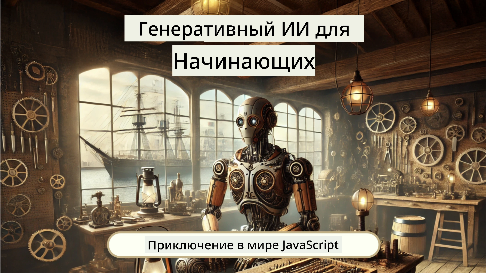
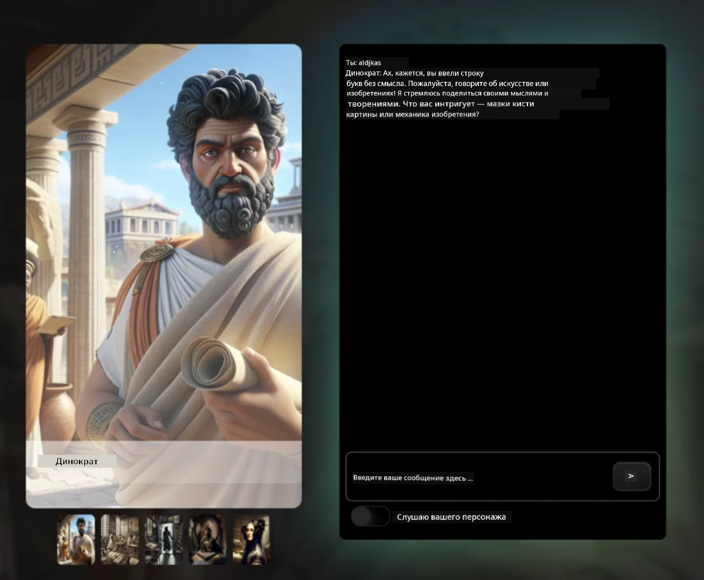
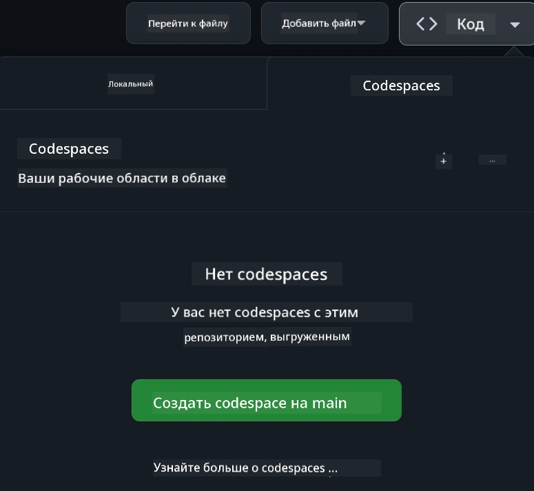

[](https://github.com/microsoft/Web-Dev-For-Beginners/blob/master/LICENSE)
[](https://GitHub.com/microsoft/Web-Dev-For-Beginners/graphs/contributors/)
[](https://GitHub.com/microsoft/Web-Dev-For-Beginners/issues/)
[](https://GitHub.com/microsoft/Web-Dev-For-Beginners/pulls/)
[](http://makeapullrequest.com) 

[](https://GitHub.com/microsoft/Web-Dev-For-Beginners/watchers/)
[](https://GitHub.com/microsoft/Web-Dev-For-Beginners/network/)
[](https://GitHub.com/microsoft/Web-Dev-For-Beginners/stargazers/)

[](https://discord.gg/nTYy5BXMWG)

# Веб-разработка для начинающих - Учебная программа

Изучите основы веб-разработки с нашим 12-недельным комплексным курсом от Microsoft Cloud Advocates. Каждое из 24 занятий погружает в JavaScript, CSS и HTML через практические проекты, такие как террариумы, расширения для браузера и космические игры. Участвуйте в викторинах, обсуждениях и практических заданиях. Повышайте свои навыки и оптимизируйте усвоение знаний с помощью нашей эффективной проектной педагогики. Начните свое путешествие в программирование уже сегодня!

Присоединяйтесь к сообществу Azure AI Foundry Discord

[](https://discord.gg/nTYy5BXMWG)

Следуйте этим шагам, чтобы начать использовать эти ресурсы:
1. **Форкнуть репозиторий**: Нажмите [](https://GitHub.com/microsoft/Web-Dev-For-Beginners/fork)
2. **Клонировать репозиторий**:   `git clone https://github.com/microsoft/Web-Dev-For-Beginners.git`
3. [**Присоединиться к Discord Azure AI Foundry, познакомиться с экспертами и другими разработчиками**](https://discord.com/invite/ByRwuEEgH4)

### 🌐 Многоязычная поддержка

#### Поддерживается через GitHub Action (автоматически и всегда актуально)

<!-- CO-OP TRANSLATOR LANGUAGES TABLE START -->
[Arabic](../ar/README.md) | [Bengali](../bn/README.md) | [Bulgarian](../bg/README.md) | [Burmese (Myanmar)](../my/README.md) | [Chinese (Simplified)](../zh-CN/README.md) | [Chinese (Traditional, Hong Kong)](../zh-HK/README.md) | [Chinese (Traditional, Macau)](../zh-MO/README.md) | [Chinese (Traditional, Taiwan)](../zh-TW/README.md) | [Croatian](../hr/README.md) | [Czech](../cs/README.md) | [Danish](../da/README.md) | [Dutch](../nl/README.md) | [Estonian](../et/README.md) | [Finnish](../fi/README.md) | [French](../fr/README.md) | [German](../de/README.md) | [Greek](../el/README.md) | [Hebrew](../he/README.md) | [Hindi](../hi/README.md) | [Hungarian](../hu/README.md) | [Indonesian](../id/README.md) | [Italian](../it/README.md) | [Japanese](../ja/README.md) | [Kannada](../kn/README.md) | [Khmer](../km/README.md) | [Korean](../ko/README.md) | [Lithuanian](../lt/README.md) | [Malay](../ms/README.md) | [Malayalam](../ml/README.md) | [Marathi](../mr/README.md) | [Nepali](../ne/README.md) | [Nigerian Pidgin](../pcm/README.md) | [Norwegian](../no/README.md) | [Persian (Farsi)](../fa/README.md) | [Polish](../pl/README.md) | [Portuguese (Brazil)](../pt-BR/README.md) | [Portuguese (Portugal)](../pt-PT/README.md) | [Punjabi (Gurmukhi)](../pa/README.md) | [Romanian](../ro/README.md) | [Russian](./README.md) | [Serbian (Cyrillic)](../sr/README.md) | [Slovak](../sk/README.md) | [Slovenian](../sl/README.md) | [Spanish](../es/README.md) | [Swahili](../sw/README.md) | [Swedish](../sv/README.md) | [Tagalog (Filipino)](../tl/README.md) | [Tamil](../ta/README.md) | [Telugu](../te/README.md) | [Thai](../th/README.md) | [Turkish](../tr/README.md) | [Ukrainian](../uk/README.md) | [Urdu](../ur/README.md) | [Vietnamese](../vi/README.md)

> **Предпочитаете клонировать локально?**
>
> Этот репозиторий включает более 50 переводов на разные языки, что значительно увеличивает размер загрузки. Чтобы клонировать без переводов, используйте sparse checkout:
>
> **Bash / macOS / Linux:**
> ```bash
> git clone --filter=blob:none --sparse https://github.com/microsoft/Web-Dev-For-Beginners.git
> cd Web-Dev-For-Beginners
> git sparse-checkout set --no-cone '/*' '!translations' '!translated_images'
> ```
>
> **CMD (Windows):**
> ```cmd
> git clone --filter=blob:none --sparse https://github.com/microsoft/Web-Dev-For-Beginners.git
> cd Web-Dev-For-Beginners
> git sparse-checkout set --no-cone "/*" "!translations" "!translated_images"
> ```
>
> Это даст вам всё необходимое для прохождения курса с гораздо более быстрой загрузкой.
<!-- CO-OP TRANSLATOR LANGUAGES TABLE END -->

**Если хотите, чтобы были поддержаны дополнительные языки, их список доступен [здесь](https://github.com/Azure/co-op-translator/blob/main/getting_started/supported-languages.md)**

[](https://open.vscode.dev/microsoft/Web-Dev-For-Beginners)

#### 🧑‍🎓 _Вы студент?_

Посетите [**страницу Student Hub**](https://docs.microsoft.com/learn/student-hub/?WT.mc_id=academic-77807-sagibbon), где вы найдете материалы для начинающих, студенческие пакеты и даже способы получить бесплатный ваучер на сертификат. Это страница, которую стоит сохранить в закладках и периодически проверять, так как мы ежемесячно обновляем контент.

### 📣 Анонс – Новые задачи режима GitHub Copilot Agent для выполнения!

Добавлена новая задача, ищите "GitHub Copilot Agent Challenge 🚀" во многих главах. Это новая задача для вас, которую нужно выполнить с помощью GitHub Copilot и режима Agent. Если вы раньше не использовали режим Agent, он способен не только генерировать текст, но и создавать и редактировать файлы, запускать команды и многое другое.

### 📣 Анонс – _Новый проект с использованием генеративного ИИ_

Добавлен новый проект AI Assistant, посмотрите [проект](./9-chat-project/README.md)

### 📣 Анонс – _Новая учебная программа_ по генеративному ИИ для JavaScript только что выпущена

Не пропустите нашу новую учебную программу по генеративному ИИ!

Посетите [https://aka.ms/genai-js-course](https://aka.ms/genai-js-course), чтобы начать!



- Уроки, охватывающие всё от основ до RAG.
- Взаимодействуйте с историческими персонажами с помощью GenAI и нашего сопутствующего приложения.
- Веселая и увлекательная история, словно путешествие во времени!




Каждый урок включает задание, проверку знаний и вызов, которые помогут вам освоить такие темы, как:
- Промптинги и создание промптов
- Генерация приложений с текстом и изображениями
- Поисковые приложения

Посетите [https://aka.ms/genai-js-course](https://aka.ms/genai-js-course), чтобы начать!


## 🌱 Начало работы

> **Учителя**, мы включили [некоторые рекомендации](for-teachers.md) по использованию этой учебной программы. Мы будем рады вашему отзыву [в нашем форуме обсуждений](https://github.com/microsoft/Web-Dev-For-Beginners/discussions/categories/teacher-corner)!

**[Ученики](https://aka.ms/student-page/?WT.mc_id=academic-77807-sagibbon)**, для каждого урока начните с предварительной викторины, затем изучите лекционный материал, выполните различные задания и проверьте понимание с помощью пост-лекторной викторины.

Чтобы улучшить опыт обучения, объединяйтесь с вашими сверстниками для совместной работы над проектами! Обсуждения приветствуются в нашем [форуме обсуждений](https://github.com/microsoft/Web-Dev-For-Beginners/discussions), где наша команда модераторов ответит на ваши вопросы.

Для дальнейшего образования мы настоятельно рекомендуем изучать материалы на [Microsoft Learn](https://learn.microsoft.com/users/wirelesslife/collections/p1ddcy5jwy0jkm?WT.mc_id=academic-77807-sagibbon).

### 📋 Настройка среды

Эта учебная программа уже готова к работе в среде разработки! В начале вы можете выбрать запуск программы в [Codespace](https://github.com/features/codespaces/) (_окружение в браузере без необходимости установки_), или локально на вашем компьютере с помощью текстового редактора, такого как [Visual Studio Code](https://code.visualstudio.com/?WT.mc_id=academic-77807-sagibbon).

#### Создайте свой репозиторий
Для удобного сохранения своей работы рекомендуется создать вашу собственную копию этого репозитория. Вы можете сделать это, нажав кнопку **Use this template** в верхней части страницы. Это создаст новый репозиторий в вашем аккаунте GitHub с копией учебной программы.

Следуйте этим шагам:
1. **Форкнуть репозиторий**: Нажмите кнопку "Fork" в правом верхнем углу этой страницы.
2. **Клонировать репозиторий**:   `git clone https://github.com/microsoft/Web-Dev-For-Beginners.git`

#### Запуск учебной программы в Codespace

В вашей копии этого репозитория нажмите кнопку **Code** и выберите **Open with Codespaces**. Это создаст новый Codespace для работы.



#### Запуск учебной программы локально на вашем компьютере

Для запуска этой учебной программы локально вам понадобится текстовый редактор, браузер и инструмент командной строки. Наш первый урок, [Введение в языки программирования и инструменты](../../1-getting-started-lessons/1-intro-to-programming-languages), поможет вам выбрать подходящие варианты для каждого из этих инструментов.

Мы рекомендуем использовать [Visual Studio Code](https://code.visualstudio.com/?WT.mc_id=academic-77807-sagibbon) в качестве редактора, он также имеет встроенный [Терминал](https://code.visualstudio.com/docs/terminal/basics/?WT.mc_id=academic-77807-sagibbon). Скачать Visual Studio Code можно [здесь](https://code.visualstudio.com/?WT.mc_id=academic-77807-sagibbon).
1. Клонируйте ваш репозиторий на компьютер. Вы можете сделать это, нажав кнопку **Code** и скопировав URL:

    [CodeSpace](./images/createcodespace.png)

    Затем откройте [Терминал](https://code.visualstudio.com/docs/terminal/basics/?WT.mc_id=academic-77807-sagibbon) в [Visual Studio Code](https://code.visualstudio.com/?WT.mc_id=academic-77807-sagibbon) и выполните следующую команду, заменив `<your-repository-url>` на только что скопированный URL:

    ```bash 
    git clone <your-repository-url>
    ```

2. Откройте папку в Visual Studio Code. Вы можете сделать это, нажав **File** > **Open Folder** и выбрав только что склонированную папку.


>  Рекомендуемые расширения Visual Studio Code:
>
> * [Live Server](https://marketplace.visualstudio.com/items?itemName=ritwickdey.LiveServer&WT.mc_id=academic-77807-sagibbon) - для предварительного просмотра HTML-страниц внутри Visual Studio Code
> * [Copilot](https://marketplace.visualstudio.com/items?itemName=GitHub.copilot&WT.mc_id=academic-77807-sagibbon) - помогает писать код быстрее

## 📂 Каждый урок включает:

- необязательные зарисовки (sketchnote)
- необязательное сопутствующее видео
- разминку перед уроком в виде викторины
- письменный урок
- для проектных уроков — пошаговые инструкции по созданию проекта
- проверки знаний
- вызов (челлендж)
- дополнительное чтение
- задание
- [викторину после урока](https://ff-quizzes.netlify.app/web/)

> **Примечание о викторинах**: Все викторины находятся в папке Quiz-app, всего 48 викторин по три вопроса каждая. Они доступны [здесь](https://ff-quizzes.netlify.app/web/). Приложение для викторин можно запускать локально или развертывать в Azure; следуйте инструкциям в папке `quiz-app`.

## 🗃️ Уроки

|     |                       Название проекта                      |                            Изучаемые концепции                             | Учебные цели                                                                                                                 |                                                         Связанный урок                                                          |         Автор          |
| :-: | :---------------------------------------------------------: | :-----------------------------------------------------------------------: | ---------------------------------------------------------------------------------------------------------------------------- | :----------------------------------------------------------------------------------------------------------------------------: | :---------------------: |
| 01  |                     Начало работы                           |           Введение в программирование и используемые инструменты          | Узнать основные принципы большинства языков программирования и о софте, который помогает профессиональным разработчикам     | [Введение в языки программирования и инструменты](./1-getting-started-lessons/1-intro-to-programming-languages/README.md) |         Jasmine         |
| 02  |                     Начало работы                           |             Основы GitHub, включая работу в команде                       | Как использовать GitHub в проекте, как сотрудничать с другими над кодом                                                     |                            [Введение в GitHub](./1-getting-started-lessons/2-github-basics/README.md)                             |          Floor          |
| 03  |                     Начало работы                           |                             Доступность                                   | Узнайте основы доступности веб-сайтов                                                                                        |                       [Основы доступности](./1-getting-started-lessons/3-accessibility/README.md)                                |       Christopher       |
| 04  |                        Основы JS                            |                         Типы данных в JavaScript                          | Основы типов данных в JavaScript                                                                                            |                                       [Типы данных](./2-js-basics/1-data-types/README.md)                                        |         Jasmine         |
| 05  |                        Основы JS                            |                         Функции и методы                                 | Узнайте о функциях и методах для управления логикой приложения                                                              |                              [Функции и методы](./2-js-basics/2-functions-methods/README.md)                                      | Jasmine and Christopher |
| 06  |                        Основы JS                            |                        Создание условий в JS                              | Узнайте, как создавать условия в коде с помощью конструкций для принятия решений                                           |                                 [Создание условий](./2-js-basics/3-making-decisions/README.md)                                  |         Jasmine         |
| 07  |                        Основы JS                            |                            Массивы и циклы                               | Работа с данными с использованием массивов и циклов в JavaScript                                                          |                                   [Массивы и циклы](./2-js-basics/4-arrays-loops/README.md)                                   |         Jasmine         |
| 08  |       [Террариум](./3-terrarium/solution/README.md)        |                            Практика HTML                                 | Создание HTML для онлайн-террариума с акцентом на построение макета                                                        |                                 [Введение в HTML](./3-terrarium/1-intro-to-html/README.md)                                     |           Jen           |
| 09  |       [Террариум](./3-terrarium/solution/README.md)        |                            Практика CSS                                  | Создание CSS для стилизации онлайн-террариума, включая основы CSS и адаптивность страницы                                   |                                  [Введение в CSS](./3-terrarium/2-intro-to-css/README.md)                                    |           Jen           |
| 10  |            [Террариум](./3-terrarium/solution/README.md)            |                 Замыкания в JavaScript, работа с DOM                      | Написание JavaScript для создания интерфейса перетаскивания в террариуме; изучение замыканий и манипуляций с DOM           |                  [Замыкания в JavaScript, работа с DOM](./3-terrarium/3-intro-to-DOM-and-closures/README.md)                  |           Jen           |
| 11  |          [Игра на набор текста](./4-typing-game/solution/README.md)          |                          Создание игры на набор текста                   | Узнайте, как использовать события клавиатуры для управления логикой вашего JavaScript-приложения                           |                                [Событийно-ориентированное программирование](./4-typing-game/typing-game/README.md)          |       Christopher       |
| 12  | [Расширение браузера Green](./5-browser-extension/solution/README.md) |                         Работа с браузерами                              | Узнайте, как работают браузеры, их история и как создать первые элементы расширения                                        |                               [О браузерах](./5-browser-extension/1-about-browsers/README.md)                                 |           Jen           |
| 13  | [Расширение браузера Green](./5-browser-extension/solution/README.md) | Создание формы, вызов API и хранение данных в локальном хранилище        | Создайте JavaScript-компоненты расширения браузера для вызова API с использованием данных из локального хранилища          |                [API, формы и локальное хранилище](./5-browser-extension/2-forms-browsers-local-storage/README.md)               |           Jen           |
| 14  | [Расширение браузера Green](./5-browser-extension/solution/README.md) |          Фоновые процессы в браузере, производительность веб-сайта       | Используйте фоновые процессы браузера для управления иконкой расширения; узнайте о производительности и оптимизациях       |             [Фоновые задачи и производительность](./5-browser-extension/3-background-tasks-and-performance/README.md)          |           Jen           |
| 15  |           [Игра в космосе](./6-space-game/solution/README.md)           |             Продвинутый разработка игр на JavaScript                    | Узнайте про наследование через классы и композицию, а также паттерн Pub/Sub для создания игры                                |                      [Введение в продвинутую разработку игр](./6-space-game/1-introduction/README.md)                          |          Chris          |
| 16  |           [Игра в космосе](./6-space-game/solution/README.md)           |                           Рисование на холсте                            | Узнайте об API Canvas для рисования элементов на экране                                                                    |                                [Рисование на Canvas](./6-space-game/2-drawing-to-canvas/README.md)                              |          Chris          |
| 17  |           [Игра в космосе](./6-space-game/solution/README.md)           |                   Перемещение элементов по экрану                        | Узнайте, как элементы могут двигаться с использованием декартовых координат и API Canvas                                    |                           [Перемещение элементов](./6-space-game/3-moving-elements-around/README.md)                           |          Chris          |
| 18  |           [Игра в космосе](./6-space-game/solution/README.md)           |                          Обнаружение столкновений                        | Реализуйте столкновения элементов и реакцию на них с помощью нажатий клавиш; добавьте функцию паузы для производительности |                              [Обнаружение столкновений](./6-space-game/4-collision-detection/README.md)                            |          Chris          |
| 19  |           [Игра в космосе](./6-space-game/solution/README.md)           |                             Ведение счета                                | Выполняйте математические вычисления на основе состояния и прогресса игры                                                  |                                    [Ведение счета](./6-space-game/5-keeping-score/README.md)                                    |          Chris          |
| 20  |           [Игра в космосе](./6-space-game/solution/README.md)           |                     Завершение и перезапуск игры                         | Узнайте о завершении и перезапуске игры, включая очистку ресурсов и сброс значений переменных                               |                                [Условие завершения](./6-space-game/6-end-condition/README.md)                                  |          Chris          |
| 21  |         [Банковское приложение](./7-bank-project/solution/README.md)          |                 HTML-шаблоны и маршруты в веб-приложении                | Узнайте, как создавать структуру многостраничного сайта с помощью маршрутизации и HTML-шаблонов                             |                            [HTML-шаблоны и маршруты](./7-bank-project/1-template-route/README.md)                              |          Yohan          |
| 22  |         [Банковское приложение](./7-bank-project/solution/README.md)          |                  Создание формы входа и регистрации                     | Узнайте, как создавать формы и обрабатывать проверку данных                                                                 |                                           [Формы](./7-bank-project/2-forms/README.md)                                       |          Yohan          |
| 23  |         [Банковское приложение](./7-bank-project/solution/README.md)          |                   Методы получения и использования данных               | Как данные поступают и вытекают из вашего приложения, как их запрашивать, хранить и удалять                                   |                                            [Данные](./7-bank-project/3-data/README.md)                                        |          Yohan          |
| 24  |         [Банковское приложение](./7-bank-project/solution/README.md)          |                      Концепции управления состоянием                    | Узнайте, как ваше приложение сохраняет состояние и как программно управлять им                                               |                                [Управление состоянием](./7-bank-project/4-state-management/README.md)                         |          Yohan          |
| 25 | [Код браузера/VScode](../../8-code-editor) | Работа с VScode | Узнайте, как использовать редактор кода | [Использование редактора кода VScode](./8-code-editor/1-using-a-code-editor/README.md) | Chris |
| 26 | [AI Ассистенты](./9-chat-project/README.md) | Работа с ИИ | Узнайте, как создать собственного AI-ассистента | [Проект AI ассистента](./9-chat-project/README.md) | Chris |

## 🏫 Педагогика

Наша программа разработана с учётом двух ключевых педагогических принципов:
* обучение на основе проектов
* частые викторины

Программа обучает основам JavaScript, HTML и CSS, а также последним инструментам и техникам, используемым современными веб-разработчиками. Студенты получат практический опыт, создавая игру на набор текста, виртуальный террариум, экологичное расширение для браузера, игру в стиле «космический захватчик» и банковское приложение для бизнеса. К концу курса студенты приобретут прочное понимание веб-разработки.

> 🎓 Вы можете пройти первые несколько уроков этого курса как [Учебный путь](https://docs.microsoft.com/learn/paths/web-development-101/?WT.mc_id=academic-77807-sagibbon) на Microsoft Learn!

Обеспечение соответствия контента проектам делает процесс более увлекательным для студентов и улучшает усвоение концепций. Мы также написали несколько вводных уроков по основам JavaScript, сопровождаемых видео из серии "[Серия для начинающих: JavaScript](https://channel9.msdn.com/Series/Beginners-Series-to-JavaScript/?WT.mc_id=academic-77807-sagibbon)", авторы которых внесли вклад в этот курс.

Кроме того, викторина с низкой сложностью перед уроком настраивает студента на изучение темы, а вторая викторина после урока обеспечивает лучшее закрепление материала. Эта программа создана быть гибкой и интересной, её можно проходить полностью или частично. Проекты начинаются с простых и становятся все сложнее к концу 12-недельного цикла.

Хотя мы сознательно избегали введения JavaScript-фреймворков, чтобы сосредоточиться на базовых навыках веб-разработчика до знакомства с фреймворком, хорошим следующим шагом после этого курса будет изучение Node.js через другую серию видео: "[Серия для начинающих: Node.js](https://channel9.msdn.com/Series/Beginners-Series-to-Nodejs/?WT.mc_id=academic-77807-sagibbon)".

> Посетите наши [Правила поведения](CODE_OF_CONDUCT.md) и руководство по [вкладу в проект](CONTRIBUTING.md). Мы приветствуем ваши конструктивные отзывы!


## 🧭 Доступ офлайн

Вы можете просматривать эту документацию офлайн с помощью [Docsify](https://docsify.js.org/#/). Форкните этот репозиторий, [установите Docsify](https://docsify.js.org/#/quickstart) на свой локальный компьютер, а затем в корневой папке репозитория выполните команду `docsify serve`. Сайт будет доступен на порту 3000 вашего локального хоста: `localhost:3000`.

## 📘 PDF
PDF всех уроков можно найти [здесь](https://microsoft.github.io/Web-Dev-For-Beginners/pdf/readme.pdf).


## 🎒 Другие курсы

Наша команда создает и другие курсы! Ознакомьтесь:

<!-- CO-OP TRANSLATOR OTHER COURSES START -->
### LangChain
[](https://aka.ms/langchain4j-for-beginners)
[](https://aka.ms/langchainjs-for-beginners?WT.mc_id=m365-94501-dwahlin)
[](https://github.com/microsoft/langchain-for-beginners?WT.mc_id=m365-94501-dwahlin)
---

### Azure / Edge / MCP / Agents
[](https://github.com/microsoft/AZD-for-beginners?WT.mc_id=academic-105485-koreyst)
[](https://github.com/microsoft/edgeai-for-beginners?WT.mc_id=academic-105485-koreyst)
[](https://github.com/microsoft/mcp-for-beginners?WT.mc_id=academic-105485-koreyst)
[](https://github.com/microsoft/ai-agents-for-beginners?WT.mc_id=academic-105485-koreyst)

---
 
### Серия "Генеративный ИИ"
[](https://github.com/microsoft/generative-ai-for-beginners?WT.mc_id=academic-105485-koreyst)
[-9333EA?style=for-the-badge&labelColor=E5E7EB&color=9333EA)](https://github.com/microsoft/Generative-AI-for-beginners-dotnet?WT.mc_id=academic-105485-koreyst)
[-C084FC?style=for-the-badge&labelColor=E5E7EB&color=C084FC)](https://github.com/microsoft/generative-ai-for-beginners-java?WT.mc_id=academic-105485-koreyst)
[-E879F9?style=for-the-badge&labelColor=E5E7EB&color=E879F9)](https://github.com/microsoft/generative-ai-with-javascript?WT.mc_id=academic-105485-koreyst)

---
 
### Основное обучение
[](https://aka.ms/ml-beginners?WT.mc_id=academic-105485-koreyst)
[](https://aka.ms/datascience-beginners?WT.mc_id=academic-105485-koreyst)
[](https://aka.ms/ai-beginners?WT.mc_id=academic-105485-koreyst)
[](https://github.com/microsoft/Security-101?WT.mc_id=academic-96948-sayoung)
[](https://aka.ms/webdev-beginners?WT.mc_id=academic-105485-koreyst)
[](https://aka.ms/iot-beginners?WT.mc_id=academic-105485-koreyst)
[](https://github.com/microsoft/xr-development-for-beginners?WT.mc_id=academic-105485-koreyst)

---
 
### Серия Copilot
[](https://aka.ms/GitHubCopilotAI?WT.mc_id=academic-105485-koreyst)
[](https://github.com/microsoft/mastering-github-copilot-for-dotnet-csharp-developers?WT.mc_id=academic-105485-koreyst)
[](https://github.com/microsoft/CopilotAdventures?WT.mc_id=academic-105485-koreyst)
<!-- CO-OP TRANSLATOR OTHER COURSES END -->

## Получение помощи

Если вы застряли или у вас есть вопросы по созданию приложений на базе ИИ. Присоединяйтесь к другим учащимся и опытным разработчикам для обсуждения MCP. Это поддерживающее сообщество, где вопросы приветствуются, а знания свободно обмениваются.

[](https://discord.gg/nTYy5BXMWG)

Если у вас есть отзывы о продукте или ошибки во время создания, посетите:

[](https://aka.ms/foundry/forum)

## Лицензия

Этот репозиторий лицензирован по лицензии MIT. Дополнительную информацию смотрите в файле [LICENSE](../../LICENSE).

---

<!-- CO-OP TRANSLATOR DISCLAIMER START -->
**Отказ от ответственности**:  
Этот документ был переведён с помощью сервиса автоматического перевода [Co-op Translator](https://github.com/Azure/co-op-translator). Несмотря на наши усилия обеспечить точность, имейте в виду, что автоматический перевод может содержать ошибки или неточности. Оригинальный документ на исходном языке следует считать авторитетным источником. Для критически важной информации рекомендуется использовать профессиональный человеческий перевод. Мы не несем ответственности за любые недоразумения или неправильные толкования, возникающие в результате использования данного перевода.
<!-- CO-OP TRANSLATOR DISCLAIMER END -->