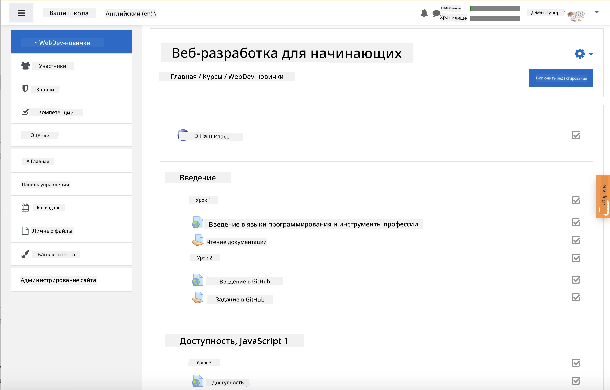
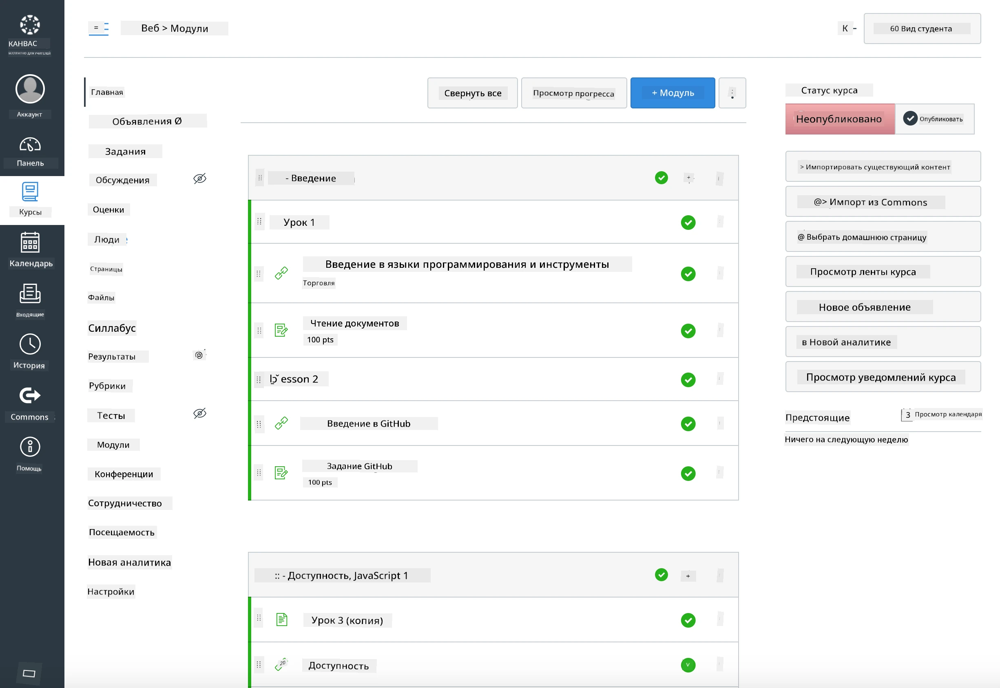

<!--
CO_OP_TRANSLATOR_METADATA:
{
  "original_hash": "71009af209f81cc01a1f2d324200375f",
  "translation_date": "2025-10-03T08:32:07+00:00",
  "source_file": "for-teachers.md",
  "language_code": "ru"
}
-->
### Для преподавателей

Вы можете использовать эту учебную программу в своем классе. Она отлично интегрируется с GitHub Classroom и ведущими платформами LMS, а также может быть использована как самостоятельный репозиторий для работы со студентами.

### Использование с GitHub Classroom

Чтобы управлять уроками и заданиями для каждой группы, создавайте отдельный репозиторий для каждого урока, чтобы GitHub Classroom мог прикреплять задания независимо.

- Форкните этот репозиторий в вашу организацию.
- Создайте отдельный репозиторий для каждого урока, извлекая папку урока в отдельный репозиторий.
  - Вариант A: Создайте пустые репозитории (по одному на урок) и скопируйте содержимое папки урока в каждый.
  - Вариант B: Используйте подход с сохранением истории Git (например, разделение папки в новый репозиторий), если вам нужна история изменений.
- В GitHub Classroom создайте задание для каждого урока и укажите соответствующий репозиторий урока.
- Рекомендуемые настройки:
  - Видимость репозитория: приватная для работы студентов.
  - Используйте стартовый код из основной ветки репозитория урока.
  - Добавьте шаблоны для Issues и Pull Requests для викторин и сдачи заданий.
  - При необходимости настройте автопроверку и тесты, если они включены в ваши уроки.
- Полезные соглашения:
  - Имена репозиториев, такие как lesson-01-intro, lesson-02-html и т.д.
  - Метки: quiz, assignment, needs-review, late, resubmission.
  - Теги/релизы для каждой группы (например, v2025-term1).

Совет: избегайте хранения репозиториев в синхронизируемых папках (например, OneDrive/Google Drive), чтобы предотвратить конфликты Git на Windows.

### Использование с Moodle, Canvas или Blackboard

Эта учебная программа включает импортируемые пакеты для стандартных рабочих процессов LMS.

- Moodle: Используйте файл загрузки Moodle [Moodle upload file](../../../../../../../teaching-files/webdev-moodle.mbz) для загрузки полного курса.
- Common Cartridge: Используйте файл Common Cartridge [Common Cartridge file](../../../../../../../teaching-files/webdev-common-cartridge.imscc) для более широкой совместимости с LMS.
- Примечания:
  - Moodle Cloud имеет ограниченную поддержку Common Cartridge. Предпочтительно использовать файл Moodle, который также можно загрузить в Canvas.
  - После импорта проверьте модули, сроки выполнения и настройки викторин, чтобы они соответствовали вашему расписанию.

> Учебная программа в классе Moodle

> Учебная программа в Canvas

### Использование репозитория напрямую (без Classroom)

Если вы предпочитаете не использовать GitHub Classroom, вы можете проводить курс напрямую из этого репозитория.

- Синхронные/онлайн форматы (Zoom/Teams):
  - Проводите короткие вводные занятия с наставником; используйте комнаты для групповой работы над викторинами.
  - Объявляйте временные окна для викторин; студенты отправляют ответы через GitHub Issues.
  - Для совместных заданий студенты работают в публичных репозиториях уроков и открывают Pull Requests.
- Приватные/асинхронные форматы:
  - Студенты форкают каждый урок в свои **приватные** репозитории и добавляют вас как соавтора.
  - Они отправляют задания через Issues (викторины) и Pull Requests (задания) в ваш репозиторий класса или свои приватные форки.

### Лучшие практики

- Проведите вводный урок по основам Git/GitHub, Issues и PRs.
- Используйте чек-листы в Issues для многоэтапных викторин/заданий.
- Добавьте CONTRIBUTING.md и CODE_OF_CONDUCT.md для установления норм в классе.
- Добавьте заметки по доступности (альтернативный текст, подписи) и предложите печатные PDF.
- Версионируйте ваш контент для каждого семестра и замораживайте репозитории уроков после публикации.

### Обратная связь и поддержка

Мы хотим, чтобы эта учебная программа была полезной для вас и ваших студентов. Пожалуйста, создайте новый Issue в этом репозитории для сообщений об ошибках, запросов или улучшений, или начните обсуждение в Teacher Corner.

---

**Отказ от ответственности**:  
Этот документ был переведен с помощью сервиса автоматического перевода [Co-op Translator](https://github.com/Azure/co-op-translator). Несмотря на наши усилия обеспечить точность, автоматические переводы могут содержать ошибки или неточности. Оригинальный документ на его родном языке следует считать авторитетным источником. Для получения критически важной информации рекомендуется профессиональный перевод человеком. Мы не несем ответственности за любые недоразумения или неправильные интерпретации, возникшие в результате использования данного перевода.