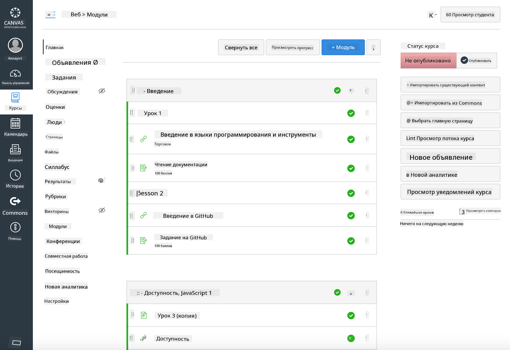

<!--
CO_OP_TRANSLATOR_METADATA:
{
  "original_hash": "75cb51f7ca9ea0b097ef4a1287e9290c",
  "translation_date": "2025-08-25T20:55:18+00:00",
  "source_file": "for-teachers.md",
  "language_code": "ru"
}
-->
## Для преподавателей

Хотите использовать эту учебную программу в своем классе? Пожалуйста, не стесняйтесь!

На самом деле, вы можете использовать ее прямо в GitHub, воспользовавшись GitHub Classroom.

Для этого сделайте форк этого репозитория. Вам нужно будет создать отдельный репозиторий для каждого урока, поэтому необходимо извлечь каждую папку в отдельный репозиторий. Таким образом, [GitHub Classroom](https://classroom.github.com/classrooms) сможет обрабатывать каждый урок отдельно.

Эти [полные инструкции](https://github.blog/2020-03-18-set-up-your-digital-classroom-with-github-classroom/) помогут вам понять, как настроить ваш класс.

## Использование в Moodle, Canvas или Blackboard

Эта учебная программа отлично работает в этих системах управления обучением! Используйте [файл для загрузки в Moodle](../../../../../../../teaching-files/webdev-moodle.mbz) для полного контента или попробуйте [файл Common Cartridge](../../../../../../../teaching-files/webdev-common-cartridge.imscc), который содержит часть контента. Moodle Cloud не поддерживает полные экспорты Common Cartridge, поэтому предпочтительнее использовать файл для Moodle, который можно загрузить в Canvas. Пожалуйста, сообщите нам, как мы можем улучшить этот процесс.

> Учебная программа в классе Moodle

> Учебная программа в Canvas

## Использование репозитория как есть

Если вы хотите использовать этот репозиторий в его текущем виде, без использования GitHub Classroom, это тоже возможно. Вам нужно будет сообщить своим студентам, над каким уроком работать вместе.

В онлайн-формате (Zoom, Teams или другие платформы) вы можете организовать комнаты для обсуждений, чтобы студенты могли проходить викторины, а также наставлять их, чтобы они были готовы к обучению. Затем пригласите студентов пройти викторины и отправить свои ответы в виде 'issues' в определенное время. Вы можете поступить так же с заданиями, если хотите, чтобы студенты работали совместно и открыто.

Если вы предпочитаете более приватный формат, попросите студентов сделать форк учебной программы, урок за уроком, в свои собственные приватные репозитории на GitHub и предоставить вам доступ. Затем они смогут проходить викторины и выполнять задания приватно, отправляя их вам через issues в вашем репозитории класса.

Существует множество способов организовать работу в онлайн-классе. Пожалуйста, сообщите нам, что лучше всего подходит для вас!

## Поделитесь своими мыслями!

Мы хотим, чтобы эта учебная программа была полезной для вас и ваших студентов. Свяжитесь с нами через [Teacher corner](https://github.com/microsoft/Web-Dev-For-Beginners/discussions/categories/teacher-corner) и откройте [**новый issue**](https://github.com/microsoft/Web-Dev-For-Beginners/issues/new/choose) для любых запросов, ошибок и отзывов.

**Отказ от ответственности**:  
Этот документ был переведен с использованием сервиса автоматического перевода [Co-op Translator](https://github.com/Azure/co-op-translator). Хотя мы стремимся к точности, пожалуйста, учитывайте, что автоматические переводы могут содержать ошибки или неточности. Оригинальный документ на его родном языке следует считать авторитетным источником. Для получения критически важной информации рекомендуется профессиональный перевод человеком. Мы не несем ответственности за любые недоразумения или неправильные интерпретации, возникающие в результате использования данного перевода.