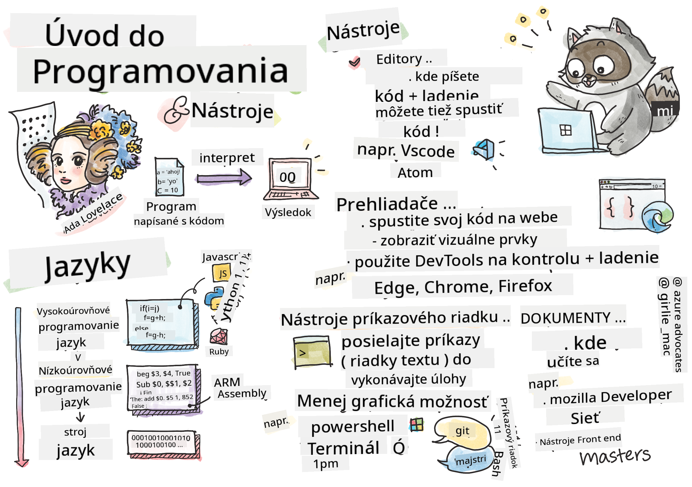

<!--
CO_OP_TRANSLATOR_METADATA:
{
  "original_hash": "2581528206a2a01c3a0b9c88e039b7bc",
  "translation_date": "2025-10-03T10:40:52+00:00",
  "source_file": "1-getting-started-lessons/1-intro-to-programming-languages/README.md",
  "language_code": "sk"
}
-->
# Úvod do programovacích jazykov a nástrojov pre vývojárov

Táto lekcia pokrýva základy programovacích jazykov. Témy uvedené tu sa vzťahujú na väčšinu moderných programovacích jazykov. V sekcii 'Nástroje pre vývojárov' sa dozviete o užitočnom softvéri, ktorý vám pomôže ako vývojárovi.


> Sketchnote od [Tomomi Imura](https://twitter.com/girlie_mac)

## Kvíz pred prednáškou
[Kvíz pred prednáškou](https://forms.office.com/r/dru4TE0U9n?origin=lprLink)

## Úvod

V tejto lekcii sa budeme venovať:

- Čo je programovanie?
- Typy programovacích jazykov
- Základné prvky programu
- Užitočný softvér a nástroje pre profesionálneho vývojára

> Túto lekciu si môžete prejsť na [Microsoft Learn](https://docs.microsoft.com/learn/modules/web-development-101/introduction-programming/?WT.mc_id=academic-77807-sagibbon)!

## Čo je programovanie?

Programovanie (známe aj ako kódovanie) je proces písania inštrukcií pre zariadenie, ako je počítač alebo mobilné zariadenie. Tieto inštrukcie píšeme pomocou programovacieho jazyka, ktorý je následne interpretovaný zariadením. Tieto súbory inštrukcií môžu byť označované rôznymi názvami, ale *program*, *počítačový program*, *aplikácia (app)* a *spustiteľný súbor* sú niektoré z populárnych názvov.

*Program* môže byť čokoľvek, čo je napísané pomocou kódu; webové stránky, hry a aplikácie na telefóne sú programy. Aj keď je možné vytvoriť program bez písania kódu, základná logika je interpretovaná zariadením a táto logika bola pravdepodobne napísaná pomocou kódu. Program, ktorý *beží* alebo *vykonáva* kód, vykonáva inštrukcie. Zariadenie, na ktorom čítate túto lekciu, práve spúšťa program, aby ju zobrazilo na vašej obrazovke.

✅ Urobte si malý prieskum: kto je považovaný za prvého počítačového programátora na svete?

## Programovacie jazyky

Programovacie jazyky umožňujú vývojárom písať inštrukcie pre zariadenie. Zariadenia dokážu rozumieť iba binárnemu kódu (1 a 0), a pre *väčšinu* vývojárov to nie je veľmi efektívny spôsob komunikácie. Programovacie jazyky sú prostriedkom komunikácie medzi ľuďmi a počítačmi.

Programovacie jazyky majú rôzne formáty a môžu slúžiť rôznym účelom. Napríklad JavaScript sa primárne používa na webové aplikácie, zatiaľ čo Bash sa primárne používa na operačné systémy.

*Nízkou úrovňové jazyky* zvyčajne vyžadujú menej krokov ako *vysokou úrovňové jazyky* na interpretáciu inštrukcií zariadením. Avšak, čo robí vysokou úrovňové jazyky populárnymi, je ich čitateľnosť a podpora. JavaScript je považovaný za vysokou úrovňový jazyk.

Nasledujúci kód ilustruje rozdiel medzi vysokou úrovňovým jazykom (JavaScript) a nízkou úrovňovým jazykom (ARM assembly kód).

```javascript
let number = 10
let n1 = 0, n2 = 1, nextTerm;

for (let i = 1; i <= number; i++) {
    console.log(n1);
    nextTerm = n1 + n2;
    n1 = n2;
    n2 = nextTerm;
}
```

```c
 area ascen,code,readonly
 entry
 code32
 adr r0,thumb+1
 bx r0
 code16
thumb
 mov r0,#00
 sub r0,r0,#01
 mov r1,#01
 mov r4,#10
 ldr r2,=0x40000000
back add r0,r1
 str r0,[r2]
 add r2,#04
 mov r3,r0
 mov r0,r1
 mov r1,r3
 sub r4,#01
 cmp r4,#00
 bne back
 end
```

Verte tomu alebo nie, *oba robia to isté*: vypisujú Fibonacciho postupnosť až do čísla 10.

✅ Fibonacciho postupnosť je [definovaná](https://en.wikipedia.org/wiki/Fibonacci_number) ako súbor čísel, kde každé číslo je súčtom dvoch predchádzajúcich, začínajúc od 0 a 1. Prvých 10 čísel v Fibonacciho postupnosti je 0, 1, 1, 2, 3, 5, 8, 13, 21 a 34.

## Prvky programu

Jedna inštrukcia v programe sa nazýva *výrok* a zvyčajne má znak alebo medzeru, ktorá označuje, kde inštrukcia končí, alebo *terminuje*. Spôsob, akým program terminuje, sa líši podľa jazyka.

Výroky v programe môžu závisieť od údajov poskytnutých používateľom alebo z iného zdroja na vykonanie inštrukcií. Údaje môžu zmeniť správanie programu, takže programovacie jazyky prichádzajú s možnosťou dočasne uložiť údaje, aby sa mohli použiť neskôr. Tieto sa nazývajú *premenné*. Premenné sú výroky, ktoré inštruujú zariadenie, aby uložilo údaje do svojej pamäte. Premenné v programoch sú podobné premenným v algebre, kde majú jedinečný názov a ich hodnota sa môže časom meniť.

Existuje možnosť, že niektoré výroky nebudú zariadením vykonané. Toto je zvyčajne zámerne napísané vývojárom alebo náhodou, keď nastane neočakávaná chyba. Tento typ kontroly nad aplikáciou ju robí robustnejšou a udržiavateľnejšou. Typicky sa tieto zmeny v kontrole dejú, keď sú splnené určité podmienky. Bežný výrok používaný v modernom programovaní na kontrolu, ako program beží, je `if..else` výrok.

✅ O tomto type výroku sa dozviete viac v nasledujúcich lekciách.

## Nástroje pre vývojárov

[](https://youtube.com/watch?v=69WJeXGBdxg "Nástroje pre vývojárov")

> 🎥 Kliknite na obrázok vyššie pre video o nástrojoch

V tejto sekcii sa dozviete o niektorom softvéri, ktorý môže byť veľmi užitočný, keď začínate svoju profesionálnu vývojársku cestu.

**Vývojové prostredie** je jedinečná sada nástrojov a funkcií, ktoré vývojár často používa pri písaní softvéru. Niektoré z týchto nástrojov boli prispôsobené špecifickým potrebám vývojára a môžu sa časom meniť, ak vývojár zmení priority v práci, osobných projektoch alebo keď používa iný programovací jazyk. Vývojové prostredia sú tak jedinečné ako vývojári, ktorí ich používajú.

### Editory

Jedným z najdôležitejších nástrojov pre vývoj softvéru je editor. Editory sú miestom, kde píšete svoj kód a niekedy aj miestom, kde ho spúšťate.

Vývojári sa spoliehajú na editory z niekoľkých ďalších dôvodov:

- *Ladenie* pomáha odhaliť chyby a problémy tým, že prechádza kód riadok po riadku. Niektoré editory majú schopnosti ladenia; môžu byť prispôsobené a doplnené pre konkrétne programovacie jazyky.
- *Zvýraznenie syntaxe* pridáva farby a formátovanie textu do kódu, čo ho robí ľahšie čitateľným. Väčšina editorov umožňuje prispôsobené zvýraznenie syntaxe.
- *Rozšírenia a integrácie* sú špecializované nástroje pre vývojárov, od vývojárov. Tieto nástroje neboli zabudované do základného editora. Napríklad, mnoho vývojárov dokumentuje svoj kód, aby vysvetlili, ako funguje. Môžu si nainštalovať rozšírenie na kontrolu pravopisu, aby našli preklepy v dokumentácii. Väčšina rozšírení je určená na použitie v konkrétnom editore a väčšina editorov má spôsob, ako vyhľadať dostupné rozšírenia.
- *Prispôsobenie* umožňuje vývojárom vytvoriť jedinečné vývojové prostredie, ktoré vyhovuje ich potrebám. Väčšina editorov je extrémne prispôsobiteľná a môže tiež umožniť vývojárom vytvárať vlastné rozšírenia.

#### Populárne editory a rozšírenia pre webový vývoj

- [Visual Studio Code](https://code.visualstudio.com/?WT.mc_id=academic-77807-sagibbon)
  - [Code Spell Checker](https://marketplace.visualstudio.com/items?itemName=streetsidesoftware.code-spell-checker)
  - [Live Share](https://marketplace.visualstudio.com/items?itemName=MS-vsliveshare.vsliveshare)
  - [Prettier - Code formatter](https://marketplace.visualstudio.com/items?itemName=esbenp.prettier-vscode)
- [Atom](https://atom.io/)
  - [spell-check](https://atom.io/packages/spell-check)
  - [teletype](https://atom.io/packages/teletype)
  - [atom-beautify](https://atom.io/packages/atom-beautify)
  
- [Sublimetext](https://www.sublimetext.com/)
  - [emmet](https://emmet.io/)
  - [SublimeLinter](http://www.sublimelinter.com/en/stable/)

### Prehliadače

Ďalším dôležitým nástrojom je prehliadač. Weboví vývojári sa spoliehajú na prehliadač, aby videli, ako ich kód funguje na webe. Používa sa tiež na zobrazenie vizuálnych prvkov webovej stránky, ktoré sú napísané v editore, ako je HTML.

Mnoho prehliadačov prichádza s *nástrojmi pre vývojárov* (DevTools), ktoré obsahujú sadu užitočných funkcií a informácií, ktoré pomáhajú vývojárom zhromažďovať a zachytávať dôležité informácie o ich aplikácii. Napríklad: Ak má webová stránka chyby, niekedy je užitočné vedieť, kedy sa vyskytli. DevTools v prehliadači môžu byť nakonfigurované na zachytenie týchto informácií.

#### Populárne prehliadače a DevTools

- [Edge](https://docs.microsoft.com/microsoft-edge/devtools-guide-chromium/?WT.mc_id=academic-77807-sagibbon)
- [Chrome](https://developers.google.com/web/tools/chrome-devtools/)
- [Firefox](https://developer.mozilla.org/docs/Tools)

### Nástroje príkazového riadku

Niektorí vývojári preferujú menej grafický pohľad na svoje každodenné úlohy a spoliehajú sa na príkazový riadok, aby to dosiahli. Písanie kódu vyžaduje značné množstvo písania a niektorí vývojári preferujú neprerušovať svoj tok na klávesnici. Používajú klávesové skratky na prepínanie medzi oknami na pracovnej ploche, prácu na rôznych súboroch a používanie nástrojov. Väčšinu úloh je možné vykonať pomocou myši, ale jednou z výhod používania príkazového riadku je, že veľa vecí sa dá urobiť pomocou nástrojov príkazového riadku bez potreby prepínania medzi myšou a klávesnicou. Ďalšou výhodou príkazového riadku je, že sú konfigurovateľné a môžete uložiť vlastnú konfiguráciu, neskôr ju zmeniť a importovať do iných vývojových zariadení. Pretože vývojové prostredia sú tak jedinečné pre každého vývojára, niektorí sa vyhýbajú používaniu príkazového riadku, niektorí sa naň úplne spoliehajú a niektorí preferujú kombináciu oboch.

### Populárne možnosti príkazového riadku

Možnosti príkazového riadku sa líšia podľa operačného systému, ktorý používate.

*💻 = predinštalované v operačnom systéme.*

#### Windows

- [Powershell](https://docs.microsoft.com/powershell/scripting/overview?view=powershell-7/?WT.mc_id=academic-77807-sagibbon) 💻
- [Príkazový riadok](https://docs.microsoft.com/windows-server/administration/windows-commands/windows-commands/?WT.mc_id=academic-77807-sagibbon) (známy aj ako CMD) 💻
- [Windows Terminal](https://docs.microsoft.com/windows/terminal/?WT.mc_id=academic-77807-sagibbon)
- [mintty](https://mintty.github.io/)
  
#### MacOS

- [Terminal](https://support.apple.com/guide/terminal/open-or-quit-terminal-apd5265185d-f365-44cb-8b09-71a064a42125/mac) 💻
- [iTerm](https://iterm2.com/)
- [Powershell](https://docs.microsoft.com/powershell/scripting/install/installing-powershell-core-on-macos?view=powershell-7/?WT.mc_id=academic-77807-sagibbon)

#### Linux

- [Bash](https://www.gnu.org/software/bash/manual/html_node/index.html) 💻
- [KDE Konsole](https://docs.kde.org/trunk5/en/konsole/konsole/index.html)
- [Powershell](https://docs.microsoft.com/powershell/scripting/install/installing-powershell-core-on-linux?view=powershell-7/?WT.mc_id=academic-77807-sagibbon)

#### Populárne nástroje príkazového riadku

- [Git](https://git-scm.com/) (💻 na väčšine operačných systémov)
- [NPM](https://www.npmjs.com/)
- [Yarn](https://classic.yarnpkg.com/en/docs/cli/)

### Dokumentácia

Keď sa vývojár chce naučiť niečo nové, pravdepodobne sa obráti na dokumentáciu, aby sa naučil, ako to používať. Vývojári sa často spoliehajú na dokumentáciu, aby ich viedla, ako správne používať nástroje a jazyky, a tiež aby získali hlbšie znalosti o tom, ako fungujú.

#### Populárna dokumentácia o webovom vývoji

- [Mozilla Developer Network (MDN)](https://developer.mozilla.org/docs/Web), od Mozilly, vydavateľov prehliadača [Firefox](https://www.mozilla.org/firefox/)
- [Frontend Masters](https://frontendmasters.com/learn/)
- [Web.dev](https://web.dev), od Google, vydavateľov prehliadača [Chrome](https://www.google.com/chrome/)
- [Microsoftova vlastná dokumentácia pre vývojárov](https://docs.microsoft.com/microsoft-edge/#microsoft-edge-for-developers), pre [Microsoft Edge](https://www.microsoft.com/edge)
- [W3 Schools](https://www.w3schools.com/where_to_start.asp)

✅ Urobte si prieskum: Teraz, keď poznáte základy prostredia webového vývojára, porovnajte ho s prostredím webového dizajnéra.

---

## 🚀 Výzva

Porovnajte niektoré programovacie jazyky. Aké sú niektoré jedinečné vlastnosti JavaScriptu oproti Jave? A čo COBOL oproti Go?

## Kvíz po prednáške
[Kvíz po prednáške](https://ff-quizzes.netlify.app/web/)

## Prehľad a samostatné štúdium

Študujte rôzne jazyky dostupné pre programátora. Skúste napísať riadok v jednom jazyku a potom ho prepísať do dvoch ďalších. Čo ste sa naučili?

## Zadanie

[Čítanie dokumentácie](assignment.md)

> Poznámka: Pri výbere nástrojov pre vaše zadanie nevyberajte editory, prehliadače alebo nástroje príkazového riadku uvedené vyššie.

---

**Upozornenie**:  
Tento dokument bol preložený pomocou služby AI prekladu [Co-op Translator](https://github.com/Azure/co-op-translator). Hoci sa snažíme o presnosť, upozorňujeme, že automatizované preklady môžu obsahovať chyby alebo nepresnosti. Pôvodný dokument v jeho rodnom jazyku by mal byť považovaný za autoritatívny zdroj. Pre kritické informácie sa odporúča profesionálny ľudský preklad. Nenesieme zodpovednosť za akékoľvek nedorozumenia alebo nesprávne interpretácie vyplývajúce z použitia tohto prekladu.