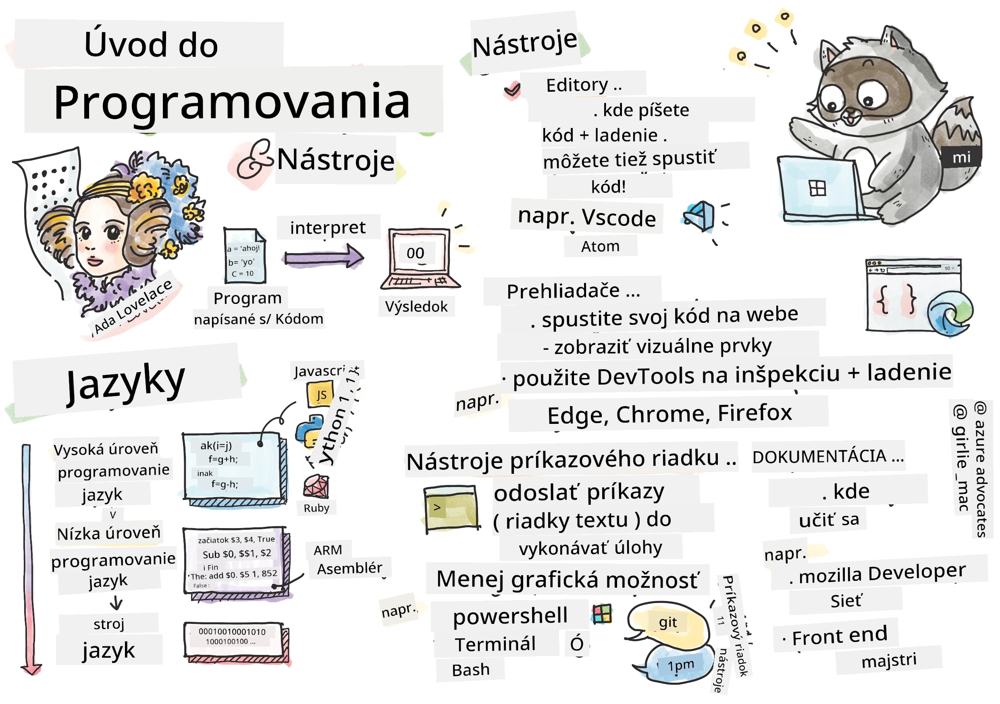
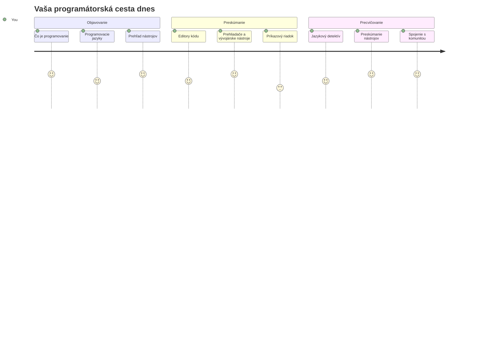
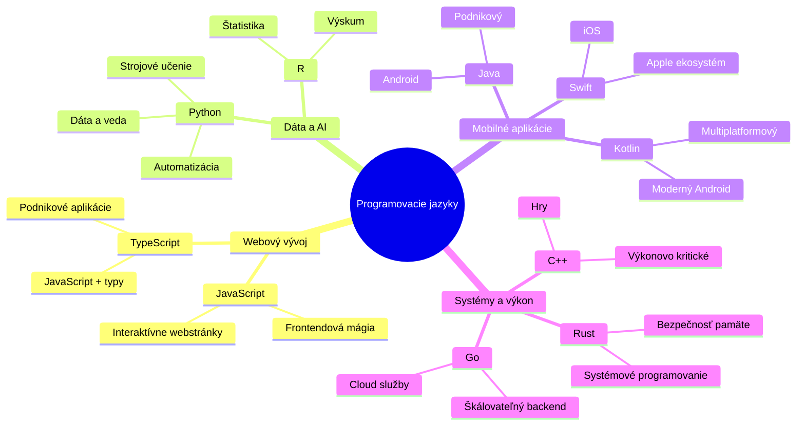
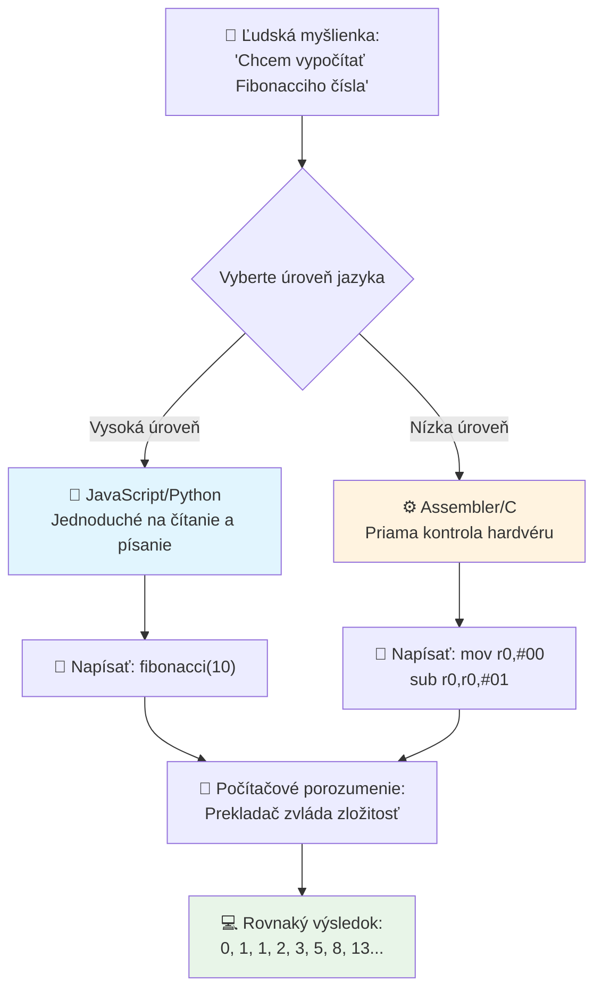
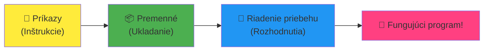
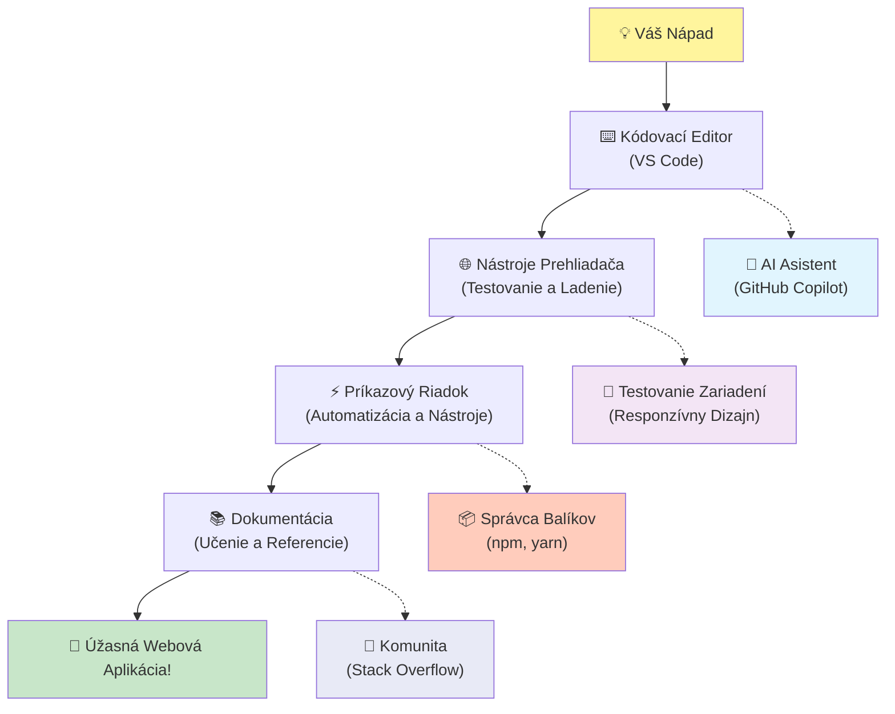
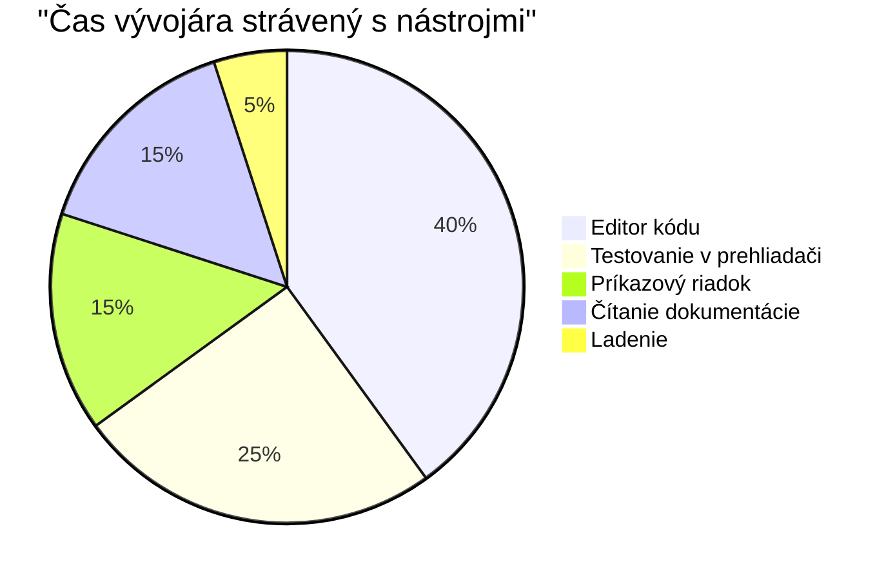
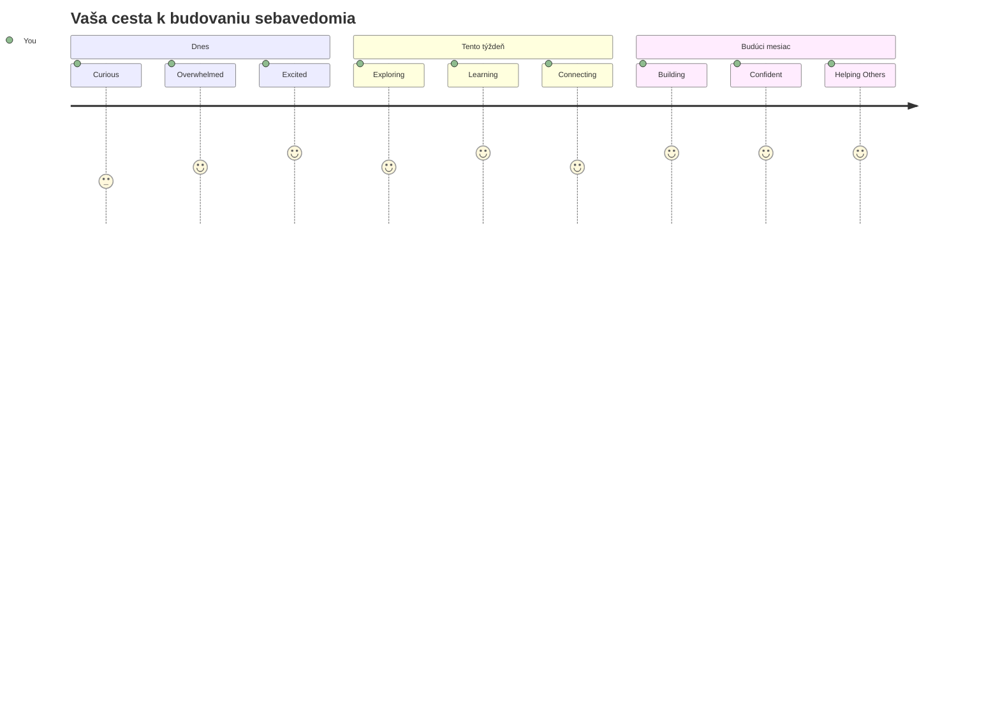

<!--
CO_OP_TRANSLATOR_METADATA:
{
  "original_hash": "d45ddcc54eb9232a76d08328b09d792e",
  "translation_date": "2026-01-07T05:15:33+00:00",
  "source_file": "1-getting-started-lessons/1-intro-to-programming-languages/README.md",
  "language_code": "sk"
}
-->
# Úvod do programovacích jazykov a moderných nástrojov pre vývojárov

Ahoj, budúci vývojár! 👋 Môžem ti povedať niečo, čo mi stále dvíha zimomriavky každý jeden deň? Práve sa chystáš objaviť, že programovanie nie je len o počítačoch – je to o tom, mať skutočné supermocnosti, aby si oživil svoje najdivokejšie nápady!

Poznáš ten moment, keď používaš svoju obľúbenú aplikáciu a všetko jednoducho dohromady perfektne sedí? Keď klikneš na tlačidlo a stane sa niečo absolútne magické, čo ťa donúti povedať „wow, ako to urobili?“ No, niekto presne ako ty – pravdepodobne sediaci vo svojej obľúbenej kaviarni o 2 ráno s tretím espresom – napísal kód, ktorý vytvoril túto mágiu. A tu je niečo, čo ti vyrazí dych: na konci tejto lekcie nielenže pochopíš, ako to urobili, ale budeš mať obrovskú chuť to vyskúšať sám!

Pozri, úplne chápem, ak sa ti programovanie teraz zdá zastrašujúce. Keď som začínal ja, úprimne som si myslel, že musíš byť nejaký matematik-genius alebo programovať od svojich piatich rokov. Ale toto mi úplne zmenilo pohľad: programovanie je presne ako naučiť sa viesť rozhovory v novom jazyku. Začneš „ahoj“ a „ďakujem,“ potom si objednáš kávu a skôr ako sa nadáš, vedieš hlboké filozofické debaty! Lenže v tomto prípade vedieš rozhovor s počítačmi a úprimne? Sú to najtrpezlivejší partneri na rozhovor, akých kedy budeš mať – nikdy neodsudzujú tvoje chyby a vždy sa tešia, že môžu skúsiť znova!

Dnes preskúmame úžasné nástroje, ktoré robia moderný webový vývoj nielen možným, ale aj vážne návykovým. Hovorím o presne tých editorech, prehliadačoch a pracovných postupoch, ktoré denno-denne používajú vývojári v Netflixe, Spotify a tvojej obľúbenej indie app štúdiu. A tu je časť, ktorá ťa rozveselí: väčšina týchto profesionálnych, priemyselných nástrojov je úplne zadarmo!


> Sketchnote od [Tomomi Imura](https://twitter.com/girlie_mac)


## Poďme sa pozrieť, čo už vieš!

Predtým, než skočíme do zábavy, som zvedavý – čo už vieš o tomto programátorskom svete? A pozri, ak sa na tieto otázky pozeráš a myslíš si „takmer nič o tom neviem,“ to je nielen v poriadku, je to perfektné! Znamená to, že si na presne správnom mieste. Predstav si tento kvíz ako rozcvičku pred tréningom – len zahrejeme tie mozgové svaly!

[Vykonaj predbežný kvíz](https://forms.office.com/r/dru4TE0U9n?origin=lprLink)


## Dobrodružstvo, na ktoré sa spolu vydáme

Dobre, naozaj skáčem od nadšenia z toho, čo dnes preskúmame! Fakt, prajem si vidieť tvoju tvár, keď ti niektoré z týchto konceptov do seba zapadnú. Toto je neuveriteľná cesta, ktorou spolu pôjdeme:

- **Čo programovanie vlastne je (a prečo je to najcoolovejšia vec vôbec!)** – Objavíme, ako je kód doslova neviditeľná mágia, ktorá poháňa všetko okolo teba, od toho budíka, ktorý nejako vie, že je pondelok ráno, po algoritmus, ktorý dokonale kurátorsky zoraďuje tvoje odporúčania na Netflixe
- **Programovacie jazyky a ich úžasné osobnosti** – Predstav si párty, kde každý človek má úplne iné supermocnosti a spôsoby riešenia problémov. Taký je svet programovacích jazykov a ty si ich zamiluješ!
- **Základné stavebné kamene, ktoré umožňujú digitálnu mágiu** – Predstav si ich ako ultimátnu kreatívnu LEGO stavebnicu. Keď pochopíš, ako tieto kúsky do seba zapadajú, uvedomíš si, že doslova môžeš postaviť čokoľvek, čo si tvoja predstavivosť vysníva
- **Profesionálne nástroje, ktoré ťa budú cítiť ako keby ti práve predali čarodejnícku paličku** – Nie som dramatický – tieto nástroje ťa naozaj presvedčia, že máš supermocnosti, a najlepšie na tom je to, že sú to tie isté nástroje, ktoré používajú profesionáli!

> 💡 **Tu je vec**: Dnes sa nesnaž snažiť si všetko pamätať! Teraz chcem, aby si pocítil iskru nadšenia z toho, čo je možné. Detaily si prirodzene zapamätáš, keď si to spolu vyskúšame – takto sa skutočne učíme!

> Túto lekciu môžeš absolvovať na [Microsoft Learn](https://docs.microsoft.com/learn/modules/web-development-101/introduction-programming/?WT.mc_id=academic-77807-sagibbon)!

## Čo teda vlastne *je* programovanie?

Dobre, pustime sa do miliónovej otázky: čo vlastne programovanie je?

Dám ti príbeh, ktorý úplne zmenil môj pohľad na to. Minulý týždeň som skúšal vysvetliť mame, ako používať náš nový ovládač na smart TV. Chytil som sa, že hovorím veci ako „Stlač červené tlačidlo, ale nie veľké červené, malé červené naľavo... nie, tvoje druhé ľavé... dobre, teraz podrž dve sekundy, nie jednu, nie tri...“ Znie to povedome? 😅

To je programovanie! Je to umenie dávať neuveriteľne detailné, krok za krokom pokyny niečomu, čo je veľmi mocné, ale potrebuje, aby bolo všetko presne vysvetlené. Lenže namiesto toho, aby si vysvetľoval mame (ktorá sa môže opýtať „ktoré červené tlačidlo?!“), hovoríš počítaču (ktorý presne urobí, čo povieš, aj keď to nie je úplne to, čo si myslel).

Tu mi rozum vyletel, keď som sa to prvýkrát naučil: počítače sú vlastne dosť jednoduché vo svojom základe. Rozumejú doslova len dvom veciam – 1 a 0, čo je v podstate len „áno“ a „nie“ alebo „zapnuté“ a „vypnuté.“ To je všetko! Ale tu prichádza tá mágia – nemusíme hovoriť v 1 a 0 ako v Matrixe. Prichádzajú na pomoc **programovacie jazyky**. Sú ako mať najlepšieho prekladateľa na svete, ktorý vezme tvoje úplne normálne ľudské myšlienky a premení ich do počítačového jazyka.

A toto mi stále každý deň ráno dvíha zimomriavky: doslova *všetko* digitálne vo tvojom živote začalo u niekoho ako si ty, pravdepodobne sediaceho v pyžame s šálkou kávy a píšuceho kód na svojom notebooku. Ten Instagramový filter, ktorý ťa robí dokonalým? Niektorý niekto to naprogramoval. Odporúčanie, ktoré ťa dovedie k tvojej novej obľúbenej pesničke? Developer vytvoril tento algoritmus. Aplikácia, ktorá ti pomáha rozdeliť účet za večeru s kamarátmi? Áno, niekto si povedal „toto je otravné, to by som mohol opraviť“ a potom... to spravil!

Keď sa naučíš programovať, nezískavaš len novú zručnosť – stávaš sa súčasťou tejto neuveriteľnej komunity riešiteľov problémov, ktorí trávia dni premýšľaním, „Čo keby som mohol vytvoriť niečo, čo niekomu spraví deň o niečo lepším?“ Úprimne, je niečo krajšie?

✅ **Zábavná úloha**: Tu je niečo super zaujímavé, čo si môžeš vyhľadať, keď budeš mať chvíľu voľna – kto myslíš, že bol prvým programátorom na svete? Dám ti nápovedu: možno to nie je ten, koho očakávaš! Príbeh tejto osoby je absolútne fascinujúci a ukazuje, že programovanie bolo vždy o kreatívnom riešení problémov a myslení „mimo rámca“.

### 🧠 **Skontroluj sa: Ako sa cítiš?**

**Vezmi si chvíľku na zamyslenie:**
- Má teraz zmysel predstava „dávať pokyny počítačom“?
- Vieš si predstaviť nejaký bežný úkon, ktorý by si chcel automatizovať programovaním?
- Aké otázky ti prichádzajú na um o celom tom programovaní?

> **Pamätaj**: Je úplne normálne, ak ti niektoré koncepty teraz prídu zahmlené. Učenie programovania je ako učenie sa nového jazyka – mozog potrebuje čas, aby vybudoval tie neurónové spojenia. Robíš to skvele!

## Programovacie jazyky sú ako rôzne druhy mágie

Dobre, toto bude znieť divne, ale drž sa ma – programovacie jazyky sú veľmi podobné rôznym typom hudby. Predstav si: máš jazz, ktorý je hladký a improvizačný, rock, ktorý je silný a priamy, klasiku, ktorá je elegantná a štruktúrovaná, a hip-hop, ktorý je kreatívny a expresívny. Každý štýl má svoju atmosféru, svoju komunitu zanietených fanúšikov a každý je perfektný na iné nálady a príležitosti.

Programovacie jazyky fungujú úplne rovnako! Nepoužil by si rovnaký jazyk na vytvorenie zábavnej mobilnej hry ako na spracovanie obrovského množstva dát o klíme, rovnako ako by si na jogu nehral death metal (no, aspoň tie väčšie jogové hodiny nie! 😄).

Ale toto mi stále vyrazí dych zakaždým, keď na to myslím: tieto jazyky sú ako mať najtrpezlivejšieho a najbystrejšieho tlmočníka na svete sedieť priamo vedľa teba. Môžeš vyjadriť svoje myšlienky spôsobom, ktorý je tvojmu ľudskému mozgu prirodzený a on zvládne všetku neuveriteľne zložitú prácu prevodu do 1 a 0, ktorými počítače skutočne hovoria. Je to ako mať priateľa, ktorý je dokonale plynulý v „ľudskej kreativite“ aj „logike počítača“ – a nikdy sa neunaví, nikdy nepotrebuje prestávky na kávu a nikdy ťa nezačne súdiť, keď sa spýtaš tu istú otázku dvakrát!

### Populárne programovacie jazyky a ich využitie


| Jazyk | Najlepšie pre | Prečo je populárny |
|----------|----------|------------------|
| **JavaScript** | Webový vývoj, používateľské rozhrania | Beží v prehliadačoch a poháňa interaktívne webové stránky |
| **Python** | Dáta, automatizácia, AI | Ľahko sa číta a učí, výkonné knižnice |
| **Java** | Podnikové aplikácie, Android aplikácie | Nezávislý na platforme, robustný pre veľké systémy |
| **C#** | Windows aplikácie, vývoj hier | Silná podpora Microsoft ekosystému |
| **Go** | Cloudové služby, backend systémy | Rýchly, jednoduchý, navrhnutý pre moderné počítanie |

### Vysokoúrovňové vs. nízkoúrovňové jazyky

Dobre, toto bola úprimne tá idea, ktorá mi pri učení prvýkrát úplne zrušila mozog, tak ti podelím sa o analógiu, ktorá mi to konečne vysvetlila – a naozaj dúfam, že pomôže aj tebe!

Predstav si, že cestuješ do krajiny, kde nehovoríš miestnym jazykom a zúfalo potrebuješ nájsť najbližšie WC (všetci sme tam už boli, však? 😅):

- **Nízkoúrovňové programovanie** je ako tak dobre sa naučiť miestny dialekt, že môžeš rozprávať so starou mamou predávajúcou ovocie na rohu, používajúc kultúrne odkazy, miestny slang a vnútorné vtipy, ktoré pochopí len niekto, kto tam vyrastal. Super impresívne a neuveriteľne efektívne... ak náhodou vieš plynule! Ale dosť mätúce, keď len chceš nájsť WC.

- **Vysokoúrovňové programovanie** je ako mať úžasného miestneho kamoša, ktorý ťa dokonale chápe. Môžeš povedať „Naozaj potrebujem nájsť toaletu“ v jednoduchom angličtine a on vyrieši všetky kultúrne rozdiely a dá ti presné, zrozumiteľné smerovanie.

V programátorských termínoch:
- **Nízkoúrovňové jazyky** (ako Assembly alebo C) ti umožnujú mať neuveriteľne detailné rozhovory s priamo hardvérom počítača, ale musíš myslieť ako stroj, čo je... no, povedzme, že to je veľký mentálny presun!
- **Vysokoúrovňové jazyky** (ako JavaScript, Python alebo C#) ti umožňujú myslieť ako človek, zatiaľ čo ony sa starajú o všetký strojový jazyk v pozadí. Plus majú neuveriteľne priateľské komunity plné ľudí, ktorí nezabudli, aké je to byť nováčikom a naozaj chcú pomôcť!

Tipni si, ktoré ti navrhnem na začiatok? 😉 Vysokoúrovňové jazyky sú ako pomocné kolieska, ktoré vlastne nikdy nechceš dať dole, pretože ti robia celý zážitok oveľa príjemnejším!


### Ukážem ti, prečo sú vysokoúrovňové jazyky oveľa priateľskejšie

Dobre, chystám sa ti ukázať niečo, čo dokonale ilustruje, prečo som sa zamiloval do vysokoúrovňových jazykov, ale najprv – sľúb mi niečo. Keď uvidíš prvý príklad kódu, nezľakni sa! Má vyzerať trochu zastrašujúco. Práve o to ide!

Pozrieme sa na rovnakú úlohu napísanú v dvoch úplne odlišných štýloch. Oba vytvárajú takzvanú Fibonacciho postupnosť – krásny matematický vzor, kde každé číslo je súčtom predchádzajúcich dvoch: 0, 1, 1, 2, 3, 5, 8, 13... (Zábavný fakt: tento vzor nájdeš doslova všade v prírode – špirály slnečnicových semien, vzory šišiek, dokonca aj tvarovanie galaxií!)

Pripravený vidieť rozdiel? Poďme na to!

**Vysokoúrovňový jazyk (JavaScript) – Ľudsky priateľský:**

```javascript
// Krok 1: Základné nastavenie Fibonacciho posloupnosti
const fibonacciCount = 10;
let current = 0;
let next = 1;

console.log('Fibonacci sequence:');
```

**Tento kód robí toto:**
- **Deklaruje** konštantu, ktorá špecifikuje, koľko Fibonacciho čísel chceme vygenerovať
- **Inicializuje** dve premenné na sledovanie aktuálneho a nasledujúceho čísla v postupnosti
- **Nastaví** počiatočné hodnoty (0 a 1), ktoré definujú Fibonacciho vzor
- **Zobrazí** hlavičkovú správu na označenie nášho výstupu

```javascript
// Krok 2: Vygenerujte postupnosť pomocou slučky
for (let i = 0; i < fibonacciCount; i++) {
  console.log(`Position ${i + 1}: ${current}`);
  
  // Vypočítajte ďalšie číslo v postupnosti
  const sum = current + next;
  current = next;
  next = sum;
}
```

**Rozklad toho, čo sa tu deje:**
- **Prechádza** každý index v postupnosti pomocou cyklu `for`
- **Zobrazuje** každé číslo s jeho pozíciou pomocou formátovania šablónového reťazca
- **Vypočíta** ďalšie Fibonacciho číslo pridaním aktuálnych a nasledujúcich hodnôt
- **Aktualizuje** sledovacie premenné pre ďalšiu iteráciu

```javascript
// Krok 3: Moderný funkčný prístup
const generateFibonacci = (count) => {
  const sequence = [0, 1];
  
  for (let i = 2; i < count; i++) {
    sequence[i] = sequence[i - 1] + sequence[i - 2];
  }
  
  return sequence;
};

// Príklad použitia
const fibSequence = generateFibonacci(10);
console.log(fibSequence);
```

**V uvedenom kóde sme:**
- **Vytvorili** znovupoužiteľnú funkciu pomocou modernej syntaxe šípky
- **Vytvorili** pole na uloženie celej postupnosti namiesto zobrazenia po jednom
- **Použili** indexovanie poľa na výpočet každého nového čísla z predchádzajúcich hodnôt
- **Vrátili** kompletnú postupnosť na flexibilné použitie v iných častiach nášho programu

**Nízkoúrovňový jazyk (ARM Assembly) – Počítačový:**

```assembly
 area ascen,code,readonly
 entry
 code32
 adr r0,thumb+1
 bx r0
 code16
thumb
 mov r0,#00
 sub r0,r0,#01
 mov r1,#01
 mov r4,#10
 ldr r2,=0x40000000
back add r0,r1
 str r0,[r2]
 add r2,#04
 mov r3,r0
 mov r0,r1
 mov r1,r3
 sub r4,#01
 cmp r4,#00
 bne back
 end
```

Všimni si, ako verzia v JavaScripte číta takmer ako anglické inštrukcie, zatiaľ čo Assembly verzia používa záhadné príkazy, ktoré priamo riadia procesor počítača. Obe dosahujú tú istú úlohu, ale vysokoúrovňový jazyk je pre ľudí oveľa jednoduchšie pochopiť, písať a udržiavať.

**Kľúčové rozdiely, ktoré si všimneš:**
- **Čitateľnosť**: JavaScript používa popisné názvy ako `fibonacciCount`, zatiaľ čo Assembly používa záhadné označenia ako `r0`, `r1`
- **Komentáre**: Vysokoúrovňové jazyky podporujú vysvetľujúce komentáre, ktoré robia kód samodokumentujúcim sa
- **Štruktúra**: Logický tok JavaScriptu zodpovedá spôsobu, ako ľudia premýšľajú o problémoch krok za krokom
- **Údržba**: Aktualizácia verzie JavaScriptu pre rôzne požiadavky je priamočiara a jasná

✅ **O Fibonacciho postupnosti**: Tento absolútne nádherný číselný vzor (kde každé číslo je súčtom dvoch predchádzajúcich: 0, 1, 1, 2, 3, 5, 8...) sa doslova objavuje *všade* v prírode! Nájdete ho v špirálach slnečníc, vzoroch šišiek, v raste ulít nautilov a dokonca aj v tom, ako rastú konáre stromov. Je dosť úžasné, ako nám matematika a kód môžu pomôcť pochopiť a znovu vytvoriť vzory, ktoré príroda používa na tvorbu krásy!


## Stavebné kamene, ktoré vytvárajú tú mágiu

Dobre, teraz keď ste videli, ako vyzerajú programovacie jazyky v akcii, poďme si rozobrať základné kusy, ktoré tvoria doslova každý program, ktorý bol kedy napísaný. Myslite na ne ako na nevyhnutné ingrediencie vo vašom obľúbenom recepte – keď pochopíte, čo každý jeden robí, budete schopní čítať a písať kód v podstate v ktoromkoľvek jazyku!

Je to niečo ako učiť sa gramatiku programovania. Pamätáte si, keď ste v škole učili o podstatných menách, slovesách a ako skladať vety? Programovanie má svoju vlastnú verziu gramatiky, a úprimne, je oveľa logickejšia a zhovievavejšia než anglická gramatika! 😄

### Výrazy: Krok za krokom inštrukcie

Začnime s **výrazmi** – tie sú ako jednotlivé vety v rozhovore s vaším počítačom. Každý výraz hovorí počítaču, aby urobil jednu konkrétnu vec, podobne ako dávanie pokynov: „Zatoč tu doľava,“ „Zastav na červenú,“ „Zaparkuj na tom mieste.“

Čo sa mi na výrazoch páči, je ich čitateľnosť. Pozrite sa na toto:

```javascript
// Základné príkazy, ktoré vykonávajú jednorázové akcie
const userName = "Alex";                    
console.log("Hello, world!");              
const sum = 5 + 3;                         
```

**Tu je, čo tento kód robí:**
- **Deklaruje** konštantnú premennú na uloženie mena používateľa
- **Zobrazí** uvítaciu správu do konzoly
- **Vypočíta** a uloží výsledok matematickej operácie

```javascript
// Výrazy, ktoré interagujú s webovými stránkami
document.title = "My Awesome Website";      
document.body.style.backgroundColor = "lightblue";
```

**Krok po kroku, toto sa deje:**
- **Upraví** názov webovej stránky, ktorý sa zobrazuje na záložke prehliadača
- **Zmení** farbu pozadia celého tela stránky

### Premenné: Pamäťový systém vášho programu

Dobre, **premenné** sú úprimne jeden z mojich úplne najobľúbenejších konceptov na vyučovanie, pretože sú veľmi podobné veciam, ktoré už denne používate!

Pozrite sa na zoznam kontaktov vo vašom telefóne. Nepamätáte si telefónne čísla všetkých – namiesto toho ukladáte „Mama“, „Najlepší priateľ“ alebo „Pizzeria, ktorá doručuje do 2 rána“ a telefón si zapamätá skutočné čísla. Premenné fungujú presne takto! Sú ako označené nádoby, kde váš program môže uložiť informácie a neskôr ich podľa mena vyhľadať.

Čo je na tom skutočne úžasné: premenné sa môžu meniť počas behu programu (odtiaľ názov „premenná“ – vidíte, čo urobili?). Rovnako ako by ste mohli aktualizovať kontakt na pizzeriu, keď objavíte niečo lepšie, premenné sa môžu meniť, keď sa program dozvie nové informácie alebo keď sa situácie zmenia!

Ukážem vám, ako to môže byť krásne jednoduché:

```javascript
// Krok 1: Vytváranie základných premenných
const siteName = "Weather Dashboard";        
let currentWeather = "sunny";               
let temperature = 75;                       
let isRaining = false;                      
```

**Porozumenie týmto konceptom:**
- **Ukladať** nemenné hodnoty do premenných `const` (napríklad názov stránky)
- **Používať** `let` pre hodnoty, ktoré sa môžu počas programu meniť
- **Priraďovať** rôzne dátové typy: reťazce (text), čísla a booleovské hodnoty (true/false)
- **Vybrať** popisné mená, ktoré vysvetľujú, čo každá premenná obsahuje

```javascript
// Krok 2: Práca s objektmi na zoskupenie súvisiacich údajov
const weatherData = {                       
  location: "San Francisco",
  humidity: 65,
  windSpeed: 12
};
```

**V predchádzajúcom sme:**
- **Vytvorili** objekt na zoskupenie súvisiacich informácií o počasí
- **Zorganizovali** viacero údajov pod jedným názvom premennej
- **Použili** kľúč-hodnota páry na jasné označenie každej informácie

```javascript
// Krok 3: Používanie a aktualizácia premenných
console.log(`${siteName}: Today is ${currentWeather} and ${temperature}°F`);
console.log(`Wind speed: ${weatherData.windSpeed} mph`);

// Aktualizácia meniteľných premenných
currentWeather = "cloudy";                  
temperature = 68;                          
```

**Pochopme každú časť:**
- **Zobraziť** informácie pomocou šablónových literálov so syntaxou `${}`
- **Pristupovať** k vlastnostiam objektu cez bodkovú notáciu (`weatherData.windSpeed`)
- **Aktualizovať** premenné deklarované s `let`, aby odrážali meniace sa podmienky
- **Kombinovať** viac premenných na vytvorenie zmysluplných správ

```javascript
// Krok 4: Moderné deštrukturalizovanie pre čistejší kód
const { location, humidity } = weatherData; 
console.log(`${location} humidity: ${humidity}%`);
```

**Čo potrebujete vedieť:**
- **Extrahovať** konkrétne vlastnosti z objektov pomocou destrukturalizačného priradenia
- **Vytvoriť** nové premenné automaticky so rovnakými názvami ako kľúče objektu
- **Zjednodušiť** kód vyhýbaním sa opakovanej bodkovej notácii

### Riadenie toku: Naučiť váš program myslieť

Dobre, tu programovanie začne byť absolútne ohromujúce! **Riadenie toku** je v podstate naučiť váš program, ako robiť múdre rozhodnutia, presne tak, ako to robíte vy každý deň, a ani o tom neuvážite.

Predstavte si toto: dnes ráno ste asi prešli niečím ako „Ak prší, vezmem si dáždnik. Ak je zima, oblečiem si bundu. Ak meškám, vynechám raňajky a vezmem si kávu na cestu.“ Váš mozog prirodzene nasleduje túto logiku if-then desiatky krát denne!

Toto robí programy inteligentnými a živými namiesto toho, aby len nasledovali nudný a predvídateľný scenár. Môžu skutočne pozrieť na situáciu, vyhodnotiť, čo sa deje, a správne zareagovať. Je to ako dať programu mozog, ktorý sa dokáže prispôsobiť a robiť rozhodnutia!

Chcete vidieť, ako krásne to funguje? Ukážem vám to:

```javascript
// Krok 1: Základná podmienená logika
const userAge = 17;

if (userAge >= 18) {
  console.log("You can vote!");
} else {
  const yearsToWait = 18 - userAge;
  console.log(`You'll be able to vote in ${yearsToWait} year(s).`);
}
```

**Čo tento kód robí:**
- **Skontroluje**, či vek používateľa spĺňa požiadavky na hlasovanie
- **Vykoná** rôzne bloky kódu podľa výsledku podmienky
- **Vypočíta** a zobrazí, ako dlho zostáva do spôsobilosti na hlasovanie, ak je používateľ mladší ako 18
- **Poskytne** konkrétnu, užitočnú spätnú väzbu pre každú situáciu

```javascript
// Krok 2: Viacero podmienok s logickými operátormi
const userAge = 17;
const hasPermission = true;

if (userAge >= 18 && hasPermission) {
  console.log("Access granted: You can enter the venue.");
} else if (userAge >= 16) {
  console.log("You need parent permission to enter.");
} else {
  console.log("Sorry, you must be at least 16 years old.");
}
```

**Rozbor toho, čo sa deje:**
- **Spojí** viacero podmienok pomocou operátora `&&` (a)
- **Vytvorí** hierarchiu podmienok pomocou `else if` pre viacero scenárov
- **Zvládne** všetky možné prípady pomocou záverečného `else` výrazu
- **Poskytne** jasnú a konateľnú spätnú väzbu pre každú zvláštnu situáciu

```javascript
// Krok 3: Stručná podmienka s ternárnym operátorom
const votingStatus = userAge >= 18 ? "Can vote" : "Cannot vote yet";
console.log(`Status: ${votingStatus}`);
```

**Čo si treba zapamätať:**
- **Použiť** ternárny operátor (`? :`) pre jednoduché dve-option podmienky
- **Napísať** podmienku najprv, potom `?`, potom pravdivý výsledok, potom `:`, potom nepravdivý výsledok
- **Použiť** tento vzorec, keď potrebujete priradiť hodnoty na základe podmienok

```javascript
// Krok 4: Spracovanie viacerých konkrétnych prípadov
const dayOfWeek = "Tuesday";

switch (dayOfWeek) {
  case "Monday":
  case "Tuesday":
  case "Wednesday":
  case "Thursday":
  case "Friday":
    console.log("It's a weekday - time to work!");
    break;
  case "Saturday":
  case "Sunday":
    console.log("It's the weekend - time to relax!");
    break;
  default:
    console.log("Invalid day of the week");
}
```

**Tento kód dosahuje nasledovné:**
- **Porovná** hodnotu premennej s viacerými špecifickými prípadmi
- **Zoskupí** podobné prípady (pracovné dni vs. víkendy)
- **Spustí** príslušný blok kódu, keď nájde zhodu
- **Obsahuje** `default` prípady na zvládnutie neočakávaných hodnôt
- **Používa** príkazy `break` na zabránenie pokračovania do ďalšieho prípadu

> 💡 **Analógia zo skutočného sveta**: Predstavte si riadenie toku ako najtrpezlivejší GPS na svete, ktorý vám dáva pokyny. Možno povie: „Ak je zápcha na Main Street, choď diaľnicou. Ak je na diaľnici stavebná uzávera, skúste scenickú cestu.“ Programy používajú presne tento typ podmienkovej logiky, aby inteligentne reagovali na rôzne situácie a vždy poskytli používateľom čo najlepšiu skúsenosť.

### 🎯 **Kontrola pochopenia: Majstrovstvo stavebných kameňov**

**Pozrime sa, ako vám to ide so základmi:**
- Viete svojimi slovami vysvetliť rozdiel medzi premennou a výrazom?
- Vymyslite si reálnu situáciu, kde by ste použili rozhodnutie if-then (napríklad náš príklad s hlasovaním)
- Čo vás na logike programovania najviac prekvapilo?

**Rýchly posilňovač sebavedomia:**

✅ **Čo príde ďalej**: Čaká nás absolútny zážitok, keď sa do týchto konceptov ponoríme hlbšie v rámci pokračovania našej neuveriteľnej cesty! Teraz sa sústreďte len na vzrušenie z úžasných možností, ktoré máte pred sebou. Konkrétne zručnosti a techniky si osvojíte prirodzene, keď budeme trénovať spolu – sľubujem, že to bude oveľa zábavnejšie, než možno očakávate!

## Nástroje remesla

Dobre, toto je úprimne chvíľa, keď sa tak nadchnem, že sa takmer neviem udržať! 🚀 Chystáme sa hovoriť o neuveriteľných nástrojoch, ktoré vám dajú pocit, akoby ste práve dostali kľúče od digitálnej kozmickej lode.

Viete, ako má kuchár tie dokonale vyvážené nože, ktoré sú akoby predĺžením jeho rúk? Alebo ako má hudobník tú jednu gitaru, ktorá akonáhle ju vezme do rúk, akoby začala spievať? No, vývojári majú svoju vlastnú verziu týchto magických nástrojov a tu je niečo, čo vám úplne vyrazí dych – väčšina z nich je úplne zadarmo!

Doslova sa vrtím na stoličke, keď o tom hovorím, lebo úplne zmenili spôsob, ako tvoríme softvér. Hovoríme o asistente kódu poháňanom AI, ktorý vám môže pomôcť písať kód (nemyslím si to len tak!), cloudových prostrediach, kde môžete budovať celé aplikácie doslova odkiaľkoľvek s Wi-Fi, a debugovacích nástrojoch tak sofistikovaných, že sú ako mať röntgenový pohľad na vaše programy.

A tu je časť, ktorá mi stále dvíha zimomriavky: toto nie sú „nástroje pre začiatočníkov“, ktoré prerastiete. Sú to presne tie isté profesionálne nástroje, ktoré používajú developeri v Google, Netflixe a v tom indie štúdiu aplikácií, ktoré milujete, práve teraz. Budete sa cítiť ako profík, keď ich budete používať!


### Editory kódu a IDE: Vaši noví digitálni najlepší priatelia

Povedzme si o editoroch kódu – tieto sa majú vážne stať vašimi novými obľúbenými miestami na tvorenie! Myslite na ne ako na vaše osobné útočisko pre kódovanie, kde budete tráviť väčšinu času tvorbou a vylepšovaním vašich digitálnych výtvorov.

Ale tu je to úplne magické na moderných editoroch: nie sú to len obyčajné textové editory. Sú to ako mať najbystrejšieho, najpodpornejšieho mentora kódovania sediaceho vedľa vás 24/7. Chytia vám preklepy ešte skôr, než si ich všimnete, navrhnú vylepšenia, ktoré vás urobia géniom, pomôžu vám pochopiť, čo každý kúsok kódu robí, a niektoré vám dokážu predpovedať, čo chcete napísať, a ponúknu vám dokončenie myšlienky!

Pamätám si, keď som objavil automatické dopĺňanie – mal som pocit, že žijem v budúcnosti. Začnete niečo písať a editor povie: „Hej, nechceli ste použiť túto funkciu, ktorá presne robí to, čo potrebujete?“ Je to, akoby ste mali čitateľa myšlienok ako kódovacieho kamaráta!

**Čo robí tieto editory také neuveriteľné?**

Moderné editory kódu ponúkajú impozantný súbor funkcií navrhnutých na zvýšenie vašej produktivity:

| Funkcia | Čo robí | Prečo pomáha |
|---------|---------|--------------|
| **Zvýrazňovanie syntaxe** | Farbenie rôznych častí vášho kódu | Uľahčuje čítanie kódu a odhaľovanie chýb |
| **Automatické dopĺňanie** | Navrhuje kód počas písania | Urýchľuje kódovanie a znižuje preklepy |
| **Nástroje na ladenie** | Pomáhajú nájsť a opraviť chyby | Šetria hodiny na hľadaní problémov |
| **Rozšírenia** | Pridávajú špecializované funkcie | Prispôsobte editor pre akúkoľvek technológiu |
| **AI asistenti** | Navrhujú kód a vysvetlenia | Urýchľujú učenie a produktivitu |

> 🎥 **Video zdroj**: Chcete vidieť tieto nástroje v akcii? Pozrite si toto [Video Nástroje remesla](https://youtube.com/watch?v=69WJeXGBdxg) pre komplexný prehľad.

#### Odporúčané editory pre webový vývoj

**[Visual Studio Code](https://code.visualstudio.com/?WT.mc_id=academic-77807-sagibbon)** (zadarmo)
- Najpopulárnejší medzi webovými vývojármi
- Vynikajúci ekosystém rozšírení
- Vstavaný terminál a integrácia Git
- **Nezabudnuteľné rozšírenia**:
  - [GitHub Copilot](https://marketplace.visualstudio.com/items?itemName=GitHub.copilot) - AI-poháňané návrhy kódu
  - [Live Share](https://marketplace.visualstudio.com/items?itemName=MS-vsliveshare.vsliveshare) - Spolupráca v reálnom čase
  - [Prettier](https://marketplace.visualstudio.com/items?itemName=esbenp.prettier-vscode) - Automatické formátovanie kódu
  - [Code Spell Checker](https://marketplace.visualstudio.com/items?itemName=streetsidesoftware.code-spell-checker) - Odhaľovanie preklepov v kóde

**[JetBrains WebStorm](https://www.jetbrains.com/webstorm/)** (platený, zadarmo pre študentov)
- Pokročilé nástroje na ladenie a testovanie
- Inteligentné dopĺňanie kódu
- Vstavaná správa verzií

**Cloudové IDE** (rôzne ceny)
- [GitHub Codespaces](https://github.com/features/codespaces) - Plná verzia VS Code vo vašom prehliadači
- [Replit](https://replit.com/) - Skvelé na učenie a zdieľanie kódu
- [StackBlitz](https://stackblitz.com/) - Okamžitý full-stack webový vývoj

> 💡 **Tip na začiatok**: Začnite s Visual Studio Code – je zadarmo, široko používaný v priemysle a má obrovskú komunitu tvoriacu užitočné návody a rozšírenia.


### Webové prehliadače: Vaša tajná vývojárska laboratórium

Dobre, pripravte sa, že vám úplne vyrazí dych! Viete, ako ste používali prehliadače na prechádzanie sociálnych sietí a sledovanie videí? Ukazuje sa, že celú dobu skrývajú neuveriteľnú tajnú vývojársku laboratórium, ktoré čaká len na to, kým ho objavíte!

Kedykoľvek kliknete pravým tlačidlom myši na webovú stránku a vyberiete „Preskúmať prvok“, otvárate skrytý svet vývojárskych nástrojov, ktoré sú úprimne výkonnejšie než niektorý drahý softvér, za ktorý som kedysi platil stovky dolárov. Je to, akoby ste zistili, že vaša obyčajná kuchyňa skrýva za tajnou stenou profesionálnu šéfkuchársku laboratóriu!
Prvýkrát, keď mi niekto ukázal DevTools v prehliadači, strávil som asi tri hodiny iba klikaním a hovoril som si: „POČKAJ, TOTO TIEŽ VIE?!” Môžete doslova upravovať akúkoľvek webovú stránku v reálnom čase, vidieť presne, ako rýchlo sa všetko načítava, testovať, ako vaša stránka vyzerá na rôznych zariadeniach, a dokonca debugovať JavaScript ako úplný profesionál. Je to úplne ohromujúce!

**Prečo sú prehliadače vašou tajnou zbraňou:**

Keď vytvárate webovú stránku alebo webovú aplikáciu, potrebujete vidieť, ako vyzerá a správa sa vo svete. Prehliadače nielen zobrazujú vašu prácu, ale poskytujú aj podrobné informácie o výkone, prístupnosti a potenciálnych problémoch.

#### Vývojárske nástroje prehliadača (DevTools)

Moderné prehliadače obsahujú komplexné sady nástrojov:

| Kategória nástroja | Čo robí | Príklad použitia |
|--------------------|----------|-------------------|
| **Inšpektor elementov** | Prezerá a upravuje HTML/CSS v reálnom čase | Úprava štýlov pre okamžité výsledky |
| **Konzola** | Zobrazuje chybové hlásenia a testuje JavaScript | Ladenie problémov a experimentovanie s kódom |
| **Monitor siete** | Sleduje načítavanie zdrojov | Optimalizácia výkonu a času načítania |
| **Kontrola prístupnosti** | Testuje inkluzívny dizajn | Zabezpečuje, aby stránka fungovala pre všetkých |
| **Simulator zariadenia** | Náhľad na rôznych veľkostiach obrazoviek | Testovanie responzívneho dizajnu bez viacerých zariadení |

#### Odporúčané prehliadače na vývoj

- **[Chrome](https://developers.google.com/web/tools/chrome-devtools/)** - Priemyselný štandard DevTools s rozsiahlymi dokumentáciami
- **[Firefox](https://developer.mozilla.org/docs/Tools)** - Výborné nástroje pre CSS Grid a prístupnosť
- **[Edge](https://docs.microsoft.com/microsoft-edge/devtools-guide-chromium/?WT.mc_id=academic-77807-sagibbon)** - Postavený na Chromium s vývojárskymi zdrojmi Microsoftu

> ⚠️ **Dôležitý tip na testovanie**: Vždy testujte svoje webové stránky vo viacerých prehliadačoch! To, čo funguje perfektne v Chrome, môže vyzerať inak v Safari alebo Firefox. Profesionálni vývojári testujú vo všetkých hlavných prehliadačoch, aby zabezpečili konzistentný používateľský zážitok.


### Príkazové riadky: Vstupná brána k vývojárskym superschopnostiam

Dobre, poďme na úplne úprimný moment ohľadom príkazového riadku, pretože chcem, aby ste to počuli od niekoho, kto tomu naozaj rozumie. Keď som ho prvýkrát videl – iba tú desivú čiernu obrazovku s blikajúcim textom – doslova som si pomyslel: „Nie, rozhodne nie! Vyzerá to ako niečo z hackerovského filmu z 80. rokov, a určite na to nie som dosť šikovný!” 😅

Ale tu je to, čo by mi mal niekto povedať vtedy a čo vám hovorím teraz: príkazový riadok nie je strašidelný – je ako priama konverzácia s vaším počítačom. Predstavte si to ako rozdiel medzi objednaním jedla cez peknú aplikáciu s obrázkami a menu (čo je fajn a jednoduché) a vstúpením do vašej obľúbenej miestnej reštaurácie, kde kuchár presne vie, čo máte radi, a môže vám pripraviť niečo dokonalé len tým, že poviete „prekvap ma niečím úžasným“.

Príkazový riadok je miesto, kam vývojári chodia, aby sa cítili ako kúzelníci. Napíšete pár zdanlivo magických slov (dobre, sú to len príkazy, ale pôsobia magicky!), stlačíte enter a BAM – vytvorili ste celú štruktúru projektu, nainštalovali výkonné nástroje z celého sveta alebo nasadili svoju aplikáciu na internet, aby ju videli milióny ľudí. Keď ochutnáte túto silu prvýkrát, je to naozaj návykové!

**Prečo sa príkazový riadok stane vaším obľúbeným nástrojom:**

Kým grafické rozhrania sú skvelé pre mnoho úloh, príkazový riadok vyniká automatizáciou, presnosťou a rýchlosťou. Mnohé vývojárske nástroje fungujú hlavne cez príkazový riadok a naučiť sa ich efektívne používať môže výrazne zvýšiť vašu produktivitu.

```bash
# Krok 1: Vytvorte a prejdite do adresára projektu
mkdir my-awesome-website
cd my-awesome-website
```

**Čo tento kód robí:**
- **Vytvorí** nový adresár s názvom „my-awesome-website“ pre váš projekt
- **Presunie sa** do novo vytvoreného adresára, aby ste mohli začať pracovať

```bash
# Krok 2: Inicializujte projekt s package.json
npm init -y

# Nainštalujte moderné vývojové nástroje
npm install --save-dev vite prettier eslint
npm install --save-dev @eslint/js
```

**Krok za krokom, čo sa deje:**
- **Inicializuje** nový Node.js projekt s predvolenými nastaveniami pomocou `npm init -y`
- **Nainštaluje** Vite ako moderný build tool pre rýchly vývoj a produkčné zostavy
- **Pridá** Prettier pre automatické formátovanie kódu a ESLint pre kontrolu kvality kódu
- **Použije** príznak `--save-dev`, aby označil tieto závislosti ako vývojové

```bash
# Krok 3: Vytvorte štruktúru projektu a súbory
mkdir src assets
echo '<!DOCTYPE html><html><head><title>My Site</title></head><body><h1>Hello World</h1></body></html>' > index.html

# Spustite vývojový server
npx vite
```

**Čo sme v tom vyššie urobili:**
- **Usporiadali** náš projekt vytvorením samostatných priečinkov pre zdrojový kód a zdroje
- **Vygenerovali** základný HTML súbor so správnou štruktúrou dokumentu
- **Spustili** vývojový server Vite pre živé znovunačítanie a horúcu výmenu modulov

#### Zásadné príkazové nástroje pre webový vývoj

| Nástroj | Účel | Prečo ho potrebujete |
|---------|-------|---------------------|
| **[Git](https://git-scm.com/)** | Verzionovanie | Sledovanie zmien, spolupráca, zálohovanie práce |
| **[Node.js & npm](https://nodejs.org/)** | JavaScript runtime & správca balíčkov | Spúšťanie JavaScriptu mimo prehliadačov, inštalácia moderných vývojárskych nástrojov |
| **[Vite](https://vitejs.dev/)** | Build tool & vývojový server | Bleskurýchly vývoj s hot module replacement |
| **[ESLint](https://eslint.org/)** | Kvalita kódu | Automatické zisťovanie a oprava problémov v JavaScripte |
| **[Prettier](https://prettier.io/)** | Formátovanie kódu | Zachovanie jednotného formátovania a čitateľnosti kódu |

#### Platformovo špecifické možnosti

**Windows:**
- **[Windows Terminal](https://docs.microsoft.com/windows/terminal/?WT.mc_id=academic-77807-sagibbon)** - Moderný, bohatý terminál
- **[PowerShell](https://docs.microsoft.com/powershell/?WT.mc_id=academic-77807-sagibbon)** 💻 - Výkonné skriptovacie prostredie
- **[Command Prompt](https://docs.microsoft.com/windows-server/administration/windows-commands/?WT.mc_id=academic-77807-sagibbon)** 💻 - Tradičný príkazový riadok Windows

**macOS:**
- **[Terminal](https://support.apple.com/guide/terminal/)** 💻 - Vstavaná terminálová aplikácia
- **[iTerm2](https://iterm2.com/)** - Vylepšený terminál s pokročilými funkciami

**Linux:**
- **[Bash](https://www.gnu.org/software/bash/)** 💻 - Štandardná Linuxová shell
- **[KDE Konsole](https://docs.kde.org/trunk5/en/konsole/konsole/index.html)** - Pokročilý terminálový emulátor

> 💻 = Predinštalované v operačnom systéme

> 🎯 **Cesta učenia**: Začnite so základnými príkazmi ako `cd` (zmena adresára), `ls` alebo `dir` (zobrazenie súborov) a `mkdir` (vytvorenie priečinka). Cvičte s modernými príkazmi pracovného toku ako `npm install`, `git status` a `code .` (otvorí aktuálny adresár vo VS Code). Ako sa budete cítiť istejší, prirodzene sa naučíte pokročilejšie príkazy a techniky automatizácie.


### Dokumentácia: Váš neustále dostupný mentor učenia

Dobre, prezradím vám malé tajomstvo, ktoré vám pomôže cítiť sa oveľa lepšie ako začiatočník: aj tí najskúsenejší vývojári trávia veľkú časť svojho času čítaním dokumentácie. A nie je to preto, že by nevedeli, čo robia – je to vlastne znak múdrosti!

Myslite na dokumentáciu ako na prístup k najtrpezlivejším a najschopnejším učiteľom na svete, ktorí sú k dispozícii 24/7. Ste zaseknutý pri probléme o druhej ráno? Dokumentácia je tu s virtuálnym teplým objatím a presne s tou odpoveďou, ktorú potrebujete. Chcete sa naučiť niečo nové, o čom všetci hovoria? Dokumentácia vám pomôže s krok za krokom príkladmi. Snažíte sa pochopiť, prečo niečo funguje tak, ako funguje? Uhádli ste – dokumentácia vám to vysvetlí spôsobom, ktorý vám konečne dá zmysel!

Niečo, čo úplne zmenilo môj pohľad: svet webového vývoja sa pohybuje neuveriteľne rýchlo a nikto (myslím absolútne nikto!) si všetko nezapamätá. Viděl som skúsených vývojárov s viac ako 15-ročnou praxou, ako si vyhľadávajú základnú syntax, a viete čo? Nie je to trápne – je to múdre! Nie je to o dokonalom pamätaní si, ale o tom, vedieť rýchlo nájsť spoľahlivé odpovede a vedieť ich aplikovať.

**Tu sa deje tá pravá mágia:**

Profesionálni vývojári venujú značnú časť svojho času čítaniu dokumentácie – nie preto, že by nevedeli, čo robia, ale preto, že svet webového vývoja sa tak rýchlo vyvíja, že zostať aktuálnym vyžaduje neustále učenie. Skvelá dokumentácia vám pomôže pochopiť nielen *ako* niečo používať, ale *prečo* a *kedy* to používať.

#### Základné zdroje dokumentácie

**[Mozilla Developer Network (MDN)](https://developer.mozilla.org/docs/Web)**
- Zlatý štandard dokumentácie pre webové technológie
- Obsiahle návody pre HTML, CSS a JavaScript
- Obsahuje informácie o kompatibilite prehliadačov
- Ponúka praktické príklady a interaktívne ukážky

**[Web.dev](https://web.dev)** (od Google)
- Najlepšie praktiky moderného webového vývoja
- Návody na optimalizáciu výkonu
- Princípy prístupnosti a inkluzívneho dizajnu
- Prípadové štúdie z reálnych projektov

**[Microsoft Developer Documentation](https://docs.microsoft.com/microsoft-edge/#microsoft-edge-for-developers)**
- Vývojárske zdroje pre prehliadač Edge
- Návody pre progresívne webové aplikácie
- Prehľady o multiplatformovom vývoji

**[Frontend Masters Learning Paths](https://frontendmasters.com/learn/)**
- Štruktúrované učebné plány
- Videokurzy od expertov v odbore
- Praktické cvičenia s kódovaním

> 📚 **Študijná stratégia**: Nesnažte sa dokumentáciu pamätať naspamäť – namiesto toho sa naučte, ako ju efektívne prechádzať. Ukladajte si často používané odkazy a cvičte vyhľadávanie, aby ste rýchlo našli konkrétne informácie.

### 🔧 **Kontrola ovládania nástrojov: Čo na vás zapôsobilo?**

**Zamyslite sa na chvíľu:**
- Ktorý nástroj vás najviac zaujíma vyskúšať ako prvý? (Nemôžete sa pomýliť!)
- Zdá sa vám príkazový riadok stále zastrašujúci, alebo ste zvedaví?
- Viete si predstaviť, že by ste použili DevTools prehliadača na nazretie „za oponu“ vašich obľúbených stránok?


> **Zaujímavý fakt**: Väčšina vývojárov trávi asi 40 % svojho času v editore kódu, no všimnite si, koľko času ide na testovanie, učenie a riešenie problémov. Programovanie nie je len o písaní kódu – je to o tvorbe zážitkov!

✅ **Na zamyslenie**: Tu je zaujímavá otázka – ako si myslíte, že sa nástroje na tvorbu webov (vývoj) líšia od nástrojov na dizajn ich vzhľadu (dizajn)? Je to ako rozdiel medzi architektom, ktorý navrhuje krásny dom, a stavebným dodávateľom, ktorý ho naozaj postaví. Obe sú kľúčové, no vyžadujú rôzne súpravy nástrojov! Toto myslenie vám skutočne pomôže vidieť širší obraz toho, ako weby ožívajú.

## Výzva GitHub Copilot Agenta 🚀

Použite režim Agenta na splnenie nasledujúcej výzvy:

**Popis:** Preskúmajte funkcie moderného editora kódu alebo IDE a demonštrujte, ako môže zlepšiť váš pracovný tok ako webového vývojára.

**Návod:** Vyberte si editor kódu alebo IDE (napríklad Visual Studio Code, WebStorm alebo cloudové IDE). Uveďte tri funkcie alebo rozšírenia, ktoré vám pomáhajú efektívnejšie písať, ladiť alebo udržiavať kód. Ku každej krátko vysvetlite, ako zlepšuje váš pracovný tok.

---

## 🚀 Výzva

**Dobre, detektív, pripravený na svoj prvý prípad?**

Teraz, keď máte tento skvelý základ, mám pre vás dobrodružstvo, ktoré vám pomôže vidieť, aký neuveriteľne rôznorodý a fascinujúci svet programovania je. A počúvajte – nejde zatiaľ o písanie kódu, takže žiadny tlak! Predstavte si, že ste detektív programovacích jazykov na vašom úplne prvom vzrušujúcom prípade!

**Vaša misia, ak ju prijmete:**
1. **Staňte sa prieskumníkom jazykov**: Vyberte tri programovacie jazyky z úplne odlišných svetov – možno jeden na tvorbu webov, druhý na mobilné aplikácie a tretí na spracovanie dát pre vedcov. Nájdite príklady toho istého jednoduchého úlohy napísanej v každom jazyku. Sľubujem, že budete úplne ohromený, ako veľmi sa môžu líšiť, aj keď robia presne to isté!

2. **Objavte ich pôvodné príbehy:** Čo robí každý jazyk špeciálnym? Tu je zaujímavý fakt – každý jediný programovací jazyk vznikol, pretože si niekto povedal: „Vieš čo? Musí existovať lepší spôsob, ako vyriešiť tento konkrétny problém.“ Dokážete prísť na to, aké problémy to boli? Niektoré z týchto príbehov sú naozaj fascinujúce!

3. **Spoznajte komunity:** Pozrite sa, ako priateľské a vášnivé sú komunity okolo každého jazyka. Niektoré majú milióny vývojárov, ktorí zdieľajú vedomosti a pomáhajú si navzájom, iné sú menšie, ale nesmierne zjednotené a podporujúce. Určite vás bude baviť spoznávať rôzne osobnosti týchto komunít!

4. **Nasledujte svoje pocity:** Ktorý jazyk sa vám teraz zdá najprístupnejší? Nesnažte sa urobiť „dokonalú“ voľbu – len počúvajte svoju intuíciu! Naozaj tu nie je zlý výber a kedykoľvek sa môžete pozrieť aj na iné.

**Bonusová detektívna úloha:** Skúste zistiť, ktoré hlavné weby alebo aplikácie sú vytvorené s každým jazykom. Zaručujem, že budete šokovaní, čo poháňa Instagram, Netflix alebo tú mobilnú hru, ktorú neviete prestať hrať!

> 💡 **Pamätajte:** Nepokúšate sa dnes stať odborníkom v žiadnom z týchto jazykov. Len spoznávate okolie, než sa rozhodnete, kde si založíte pôsobisko. Dajte si čas, bavte sa a nechajte sa viesť svojou zvedavosťou!

## Oslávme to, čo ste objavili!

Panečku, dnes ste načerpali toľko neuveriteľných informácií! Som naozaj nadšený, koľko z tejto úžasnej cesty vám zostalo v pamäti. A nezabudnite – toto nie je test, kde musíte všetko vedieť na sto percent. Toto je skôr oslava všetkého super, čo ste sa dozvedeli o tomto fascinujúcom svete, do ktorého sa chystáte ponoriť!

[Otestujte sa v poprednom kvíze](https://ff-quizzes.netlify.app/web/)
## Review & Self Study

**Neponáhľajte sa a užívajte si to!**

Dnes ste prešli veľa a na to môžete byť hrdí! Teraz prichádza tá zábavná časť – objavovanie tém, ktoré vzbudili vašu zvedavosť. Pamätajte, toto nie je domáca úloha – je to dobrodružstvo!

**Ponorte sa hlbšie do toho, čo vás zaujíma:**

**Vyskúšajte programovacie jazyky prakticky:**
- Navštívte oficiálne webové stránky 2 až 3 jazykov, ktoré vás zaujali. Každý z nich má svoju vlastnú osobnosť a príbeh!
- Vyskúšajte online kódovacie „pieskoviská“ ako [CodePen](https://codepen.io/), [JSFiddle](https://jsfiddle.net/) alebo [Replit](https://replit.com/). Nebojte sa experimentovať – nič nepokazíte!
- Prečítajte si o tom, ako váš obľúbený jazyk vznikol. Niektoré z týchto príbehov pôvodu sú naozaj fascinujúce a pomôžu vám pochopiť, prečo jazyky fungujú tak, ako fungujú.

**Zoznámte sa s vašimi novými nástrojmi:**
- Ak ste tak ešte nespravili, stiahnite si Visual Studio Code – je zadarmo a určite si ho zamilujete!
- Strávte pár minút prehliadaním trhu rozšírení. Je to ako obchod s aplikáciami pre váš kódový editor!
- Otvorte si nástroje pre vývojárov vo vašom prehliadači a klikajte. Nemusíte všetko rozumieť – len sa zoznámte s tým, čo tam je.

**Pridajte sa ku komunite:**
- Sledujte niektoré vývojárske komunity na [Dev.to](https://dev.to/), [Stack Overflow](https://stackoverflow.com/) alebo [GitHub](https://github.com/). Programátorská komunita je veľmi priateľská k nováčikom!
- Pozrite si začiatočnícke video návody na YouTube. Existuje veľa skvelých tvorcov, ktorí vedia, aké to je začínať.
- Zvážte pripojenie k lokálnym meet-upom alebo online komunitám. Verím, že vývojári milujú pomáhať nováčikom!

> 🎯 **Počúvajte, toto si pamätajte**: Neočakáva sa od vás, že sa zo dňa na deň stanete kódovacím mágom! Práve teraz sa iba zoznamujete s týmto úžasným novým svetom, do ktorého sa chystáte vstúpiť. Neponáhľajte sa, užívajte si cestu a pamätajte – každý jeden vývojár, ktorého obdivujete, kedysi sedel presne tam, kde ste vy, cítil sa nadšene a možno trochu zahltený. To je úplne normálne a znamená to, že to robíte správne!

## Assignment

[Reading the Docs](assignment.md)

> 💡 **Malé povzbudenie k zadaniu**: Veľmi rád by som vás videl, ako objavujete nástroje, o ktorých sme ešte nerozprávali! Preskočte editory, prehliadače a príkazové nástroje, o ktorých sme už hovorili – existuje celý úžasný vesmír vývojárskych nástrojov, ktoré čakajú na objavenie. Hľadajte také, ktoré sa aktívne udržiavajú a majú živé, ochotné komunity (tie majú zvyčajne tie najlepšie návody a najpodpornejších ľudí, keď sa náhodou zaseknete a potrebujete priateľskú pomoc).

---

## 🚀 Your Programming Journey Timeline

### ⚡ **Čo môžete spraviť v najbližších 5 minútach**
- [ ] Záložkujte 2-3 webové stránky programovacích jazykov, ktoré vás zaujali
- [ ] Stiahnite si Visual Studio Code, ak ste tak ešte nespravili
- [ ] Otvorte si DevTools vo vašom prehliadači (F12) a klikajte na ľubovoľnú stránku
- [ ] Pridajte sa k nejakej programátorskej komunite (Dev.to, Reddit r/webdev alebo Stack Overflow)

### ⏰ **Čo môžete dosiahnuť za túto hodinu**
- [ ] Dokončite kvíz po lekcii a zamyslite sa nad svojimi odpoveďami
- [ ] Nastavte VS Code s rozšírením GitHub Copilot
- [ ] Vyskúšajte "Hello World" príklad v 2 rôznych programovacích jazykoch online
- [ ] Pozrite si video "Deň v živote vývojára" na YouTube
- [ ] Začnite s detektívnou prácou o programovacích jazykoch (z výzvy)

### 📅 **Vaše týždenné dobrodružstvo**
- [ ] Dokončite zadanie a preskúmajte 3 nové vývojárske nástroje
- [ ] Sledujte 5 vývojárov alebo programátorské účty na sociálnych sieťach
- [ ] Skúste niečo malé postaviť v CodePen alebo Replit (aj len “Hello, [vaše meno]!”)
- [ ] Prečítajte si jeden blogový príspevok o ceste nejakého vývojára
- [ ] Pridajte sa k virtuálnemu meetup-u alebo si pozrite programátorské prednášky
- [ ] Začnite sa učiť vybraný jazyk cez online tutoriály

### 🗓️ **Vaša mesačná transformácia**
- [ ] Vybudujte svoj prvý malý projekt (aj jednoduchá webová stránka sa počíta!)
- [ ] Prispievajte do open-source projektu (začnite napríklad opravou dokumentácie)
- [ ] Mentorujte niekoho, kto práve začína svoju programátorskú cestu
- [ ] Vytvorte si vlastné portfólio vývojára na webe
- [ ] Spojte sa s lokálnymi vývojárskymi komunitami alebo študijnými skupinami
- [ ] Začnite plánovať svoj ďalší vzdelávací míľnik

### 🎯 **Záverečné zamyslenie**

**Predtým, než budete pokračovať, oslávte to:**
- Čo vás dnes na programovaní najviac nadchlo?
- Ktorý nástroj alebo koncept chcete skúmať ako prvý?
- Ako sa cítite pri štarte tejto programátorskej cesty?
- Akú jednu otázku by ste teraz chceli položiť vývojárovi?


> 🌟 **Pamätajte**: Každý expert bol raz začiatočníkom. Každý seniorský vývojár sa kedysi cítil presne ako vy teraz – nadšene, možno trochu zahltený, a určite zvedavý na to, čo všetko je možné. Ste v úžasnej spoločnosti a táto cesta bude fantastická. Vitajte v nádhernom svete programovania! 🎉

---

<!-- CO-OP TRANSLATOR DISCLAIMER START -->
**Zrieknutie sa zodpovednosti**:
Tento dokument bol preložený pomocou AI prekladateľskej služby [Co-op Translator](https://github.com/Azure/co-op-translator). Hoci sa snažíme o presnosť, vezmite prosím na vedomie, že automatizované preklady môžu obsahovať chyby alebo nepresnosti. Pôvodný dokument v jeho rodnom jazyku by mal byť považovaný za autoritatívny zdroj. Pre kritické informácie sa odporúča profesionálny ľudský preklad. Za akékoľvek nedorozumenia alebo nesprávne interpretácie vzniknuté použitím tohto prekladu nenesieme zodpovednosť.
<!-- CO-OP TRANSLATOR DISCLAIMER END -->